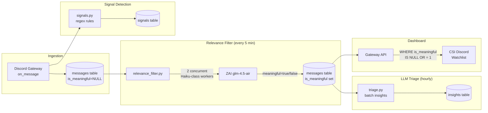

# Discord Intelligence System

**Canonical source of truth** for the Universal Agent Discord Integration.

**Last Updated:** 2026-04-25

## 1. Overview

The Discord Intelligence subsystem provides passive intelligence gathering and active operational command-and-control for the Universal Agent. It separates listening operations from interactive operations using a dual-token architecture.

### Architectural Decision: Bot API vs. User Token Extractor
Early designs attempted to use standard Discord Bot capabilities (e.g., `netixc/mcp-discord`) for full intelligence gathering. This approach failed because traditional Discord bots **cannot read historical messages or passively ingest data across hundreds of private servers** unless the bot is specifically invited with administrative scopes.

To bypass these API restrictions safely without being flagged as an automated spam client:
1. **The extraction layer** utilizes `discord.py-self` with a **User Token** to passively mirror read-only channels acting completely un-interactive.
2. **The MCP interface** bypasses Discord infrastructure entirely by connecting the Universal Agent *directly* to the local SQLite database populated by the user token.
3. **The command surface** is strictly delegated to a standard **Bot Token** restricted entirely to a private Ops Server.

## 2. Architecture & Components

The system is cleanly decoupled into two persistent services:

### 2.1. Intelligence Daemon (`ua-discord-intelligence.service`)
- **Token Type:** `DISCORD_USER_TOKEN` (User Token via `discord.py-self`)
- **Role:** Passively monitors designated channels without triggering presence alerts or sending outbound messages.
- **Storage:** Stores metadata, content, and signal classifications into a dedicated SQLite hub (`discord_intelligence.db`).
- **Status:** **DEPLOYED (Phase 1)** - Successfully running natively on the production VPS.

### 2.2. Command & Control Bot (`ua-discord-cc-bot.service`)
- **Token Type:** `DISCORD_BOT_TOKEN`
- **Role:** The execution surface. Operates exclusively within the isolated UA Operations Server. It provides slash commands (`/status`, `/task_add`, etc.) and automatically dispatches rich embed alerts from the intelligence DB to specific feed channels (e.g., `#event-calendar`, `#announcements-feed`).
- **Status:** **DEPLOYED (Phase 2)** - Successfully running natively on the production VPS.

## 3. Message Processing Pipeline

The intelligence daemon processes messages through a multi-stage pipeline:



### 3.1. Stage 1: Raw Ingestion
All messages from monitored channels are stored unconditionally via `on_message` in `daemon.py`. Messages receive `is_meaningful = NULL` (pending classification).

### 3.2. Stage 2: Deterministic Signal Detection
`signals.py` runs regex-based pattern matching for high-confidence signals (releases, version numbers, breaking changes, event indicators). Results stored in the `signals` table.

### 3.3. Stage 3: LLM Relevance Filter (Phase 5 — NEW)
A periodic sweep (every 5 minutes) classifies pending messages as **meaningful signal** or **noise** using a cheap, fast LLM (Haiku-class `glm-4.5-air`). Key design properties:

- **Store-but-hide**: Noise messages remain in the database for audit/replay but are hidden from the dashboard
- **Cross-channel batching**: Messages from all servers/channels are batched into a single LLM call with inline server/channel context, avoiding per-domain LLM calls
- **Concurrent workers**: Up to 2 concurrent classification workers for large backlogs
- **Fail-open**: On LLM errors or parse failures, messages default to `is_meaningful = true` — never hide content due to infrastructure issues
- **Batch efficiency**: Up to 50 messages per LLM call, with the LLM returning a JSON array of verdicts

**Implementation:** [`discord_intelligence/relevance_filter.py`](file:///home/kjdragan/lrepos/universal_agent/discord_intelligence/relevance_filter.py)

**Classification rubric:**

| Meaningful (show) | Noise (hide) |
|---|---|
| Product announcements, releases | Casual chat, greetings |
| Architectural/design discussions | Basic support questions |
| Breaking changes, deprecations | Emoji-only messages |
| Event/webinar/AMA announcements | Debugging sessions, stack traces |
| Official team communications | Off-topic conversation |
| Security advisories | Bot routine messages (join/leave) |

### 3.4. Stage 4: LLM Triage (Hourly)
`triage.py` performs deeper batch analysis on unprocessed tier-A channel messages, extracting macro-level insights (topics, summaries, sentiment, urgency). Stored in the `insights` table.

## 4. Development Status & Roadmap

The current integration is partially complete based on the 4-phase plan found in `discord_intelligence/PROMPT_Discord_Phases_2_3_4_For_AI_Coder.md`.

### ✅ Phase 1: Passive Intelligence Daemon
- [x] Background service running under user profile.
- [x] Basic signal detection (Layers 1 and 2).
- [x] Secrets loaded dynamically from Infisical on bootstrap.

### ✅ Phase 2: Command & Control Execution
- [x] Operational server scaffolded with `OPERATIONS`, `INTELLIGENCE`, `ARTIFACTS`, and `SYSTEM` categories.
- [x] `cc_bot.py` deployed as a `systemd` unit with isolated token.
- [x] `discord.ext.tasks` background polling architecture verified.

### ✅ Phase 3: MCP Interactive Tool Setup
- [x] **Pivot:** Bypassed `netixc/mcp-discord` because standard bot scopes cannot read historical user-monitored channels. 
- [x] Implemented a custom FastMCP SQLite bridge (`discord_intelligence/mcp_bridge.py`) that strictly links the Universal Agent to our local intelligence database.
- [x] **Task Hub Integration:** Adjusted the deployment code to correctly use the durable database connection (`connect_runtime_db(get_activity_db_path())`) to support dynamic task assignments from incoming Discord intelligence.

### ✅ Phase 4: Event Intelligence Pipeline
- [x] **Investigation Complete:** Decided against capturing audio recordings from stage channels due to high TOS account ban risks and complexity.
- [x] **GWS Calendar Sync:** Integrated the Google Workspace CLI via `gws calendar events insert` / `npx @googleworkspace/cli calendar events insert` natively inside `cc_bot.py`.
    - **Auth Discovery:** The CLI must first be authenticated locally with `npx @googleworkspace/cli auth login` to handle OAuth consent and cache credentials in the secure keyring.
    - **Payload Discovery:** The Calendar API requires strict ISO 8601 formatting for `--start` and `--end` timestamps rather than natural language parsing.
    - C&C reactions (`✅`, `🎙️`, `❌`) on Discord event alerts automatically trigger this sync to the operator's Google Calendar using those parameters.
- [x] **Text-Event MVP:** The SQLite database collects and triggers native Discord scheduled events.
- [x] **Event Digest Pipeline:** `event_digest.py` queries messages from the exact event window (+/- 15 mins), dispatches to Sonnet for summary, and saves the intelligence payloads to `digests/` and the knowledge base `kb/briefings/`.
- [x] **Database Hardening:** Plugged SQLite descriptor leaks across the daemon and C&C bot feeds by strictly wrapping `_get_conn` as a python Context Manager.
- [x] **Reliable Upstream Task Dispatch:** Discord intelligence tasks now unpack root-level `title` and `description` properties and default to `agent_ready: 1`, solving the `-2.0` scoring penalty during central Task Hub queue insertion.
- [x] **Passive signal containment:** Passive release signals remain in the Discord intelligence database/feed by default instead of auto-flooding Task Hub. Set `UA_DISCORD_AUTO_CREATE_RELEASE_TASKS=1` only for controlled windows where every release signal should become a Simone/Task Hub work item.
- [x] **Structured-event calendar automation:** Discord Scheduled Events and structured stage/voice/external events are the primary event source. Text-derived event fallback is disabled by default (`UA_DISCORD_TEXT_EVENT_FALLBACK_ENABLED=0`). The CC bot can auto-sync up to 10 upcoming structured Discord events to Google Calendar with event metadata and Discord event links (`UA_DISCORD_CALENDAR_SYNC_DAILY_LIMIT=10`).
    - Production calendar sync runs as the `ua` system user. If `gws` is not installed on PATH, the bot falls back to `npx -y @googleworkspace/cli`; OAuth credentials still must exist under that service user's GWS config (`sudo -u ua -H npx -y @googleworkspace/cli auth status`) or be supplied by Infisical as `GOOGLE_WORKSPACE_CLI_CREDENTIALS_JSON` / `GOOGLE_WORKSPACE_CLI_CREDENTIALS_JSON_B64` for runtime materialization into a `0600` credentials file. Failed calendar rows are retried after a bounded cooldown (`UA_DISCORD_CALENDAR_SYNC_RETRY_FAILED_AFTER_HOURS`, default 6) so prior infrastructure failures recover after credentials are repaired.
- [x] **Digest action containment:** Event digests can still extract action items, but they do not create Task Hub work by default. Set `UA_DISCORD_DIGEST_CREATE_TASKS=1` only during controlled windows where digest action items should become Simone/Task Hub work items.
- [x] **Dashboard tuning surface:** The dashboard exposes Discord intelligence overview, top structured events, and expandable server/category channel controls for tiering or muting noisy channels.
- [x] **LLM Proxy Optimization:** Hardcoded `config.yaml` model endpoints to directly utilize explicit Z.AI emulation proxies (`glm-4.5-air` for triage parsing and `glm-5-turbo` for deep insight extraction).

### ✅ Phase 5: LLM Relevance Filter (CSI Watchlist Signal Optimization)
- [x] **Store-but-hide architecture:** Added `is_meaningful` column to `messages` table (`NULL` = pending, `1` = signal, `0` = noise). Raw firehose preserved for audit; dashboard hides noise by default.
- [x] **Relevance filter module:** `discord_intelligence/relevance_filter.py` implements a binary signal-vs-noise classifier using a tight prompt rubric.
- [x] **Cross-channel batching:** Messages from all servers and channels are batched into single LLM calls with inline `(Server / #channel)` context tags, eliminating per-domain LLM call overhead.
- [x] **Concurrent workers:** Up to 2 concurrent Haiku-class workers (`glm-4.5-air` via ZAI proxy) process batches of ~50 messages each, using the shared `ZAIRateLimiter` for concurrency control.
- [x] **Daemon integration:** New `@tasks.loop` sweep runs every 5 minutes (configurable via `config.yaml → scheduling.relevance_sweep_interval_minutes`).
- [x] **Gateway API filter:** `GET /api/v1/dashboard/discord/servers/{id}/messages` now filters by `is_meaningful` by default, with `?show_all=true` bypass for debugging. Response includes both `total` (filtered) and `total_all` (unfiltered) counts.
- [x] **Dashboard UI toggle:** Green "Signals" button toggles between filtered and unfiltered views. Panel header shows `"12 signals of 847 total"` effectiveness badge.
- [x] **Fail-open safety:** On LLM errors, parse failures, or missed messages, content defaults to `is_meaningful = true` — noise is never hidden due to infrastructure issues.

## 5. Configuration Reference

All Discord Intelligence configuration lives in `discord_intelligence/config.yaml`:

```yaml
models:
  triage: "glm-4.5-air"       # Batch triage (hourly)
  insight: "glm-5-turbo"      # Deep extraction (on-demand)
  relevance: "glm-4.5-air"    # Binary signal classifier (every 5 min)

scheduling:
  triage_interval_minutes: 60
  event_poll_interval_minutes: 30
  relevance_sweep_interval_minutes: 5
  briefing_time: "08:00"
```

## 6. Database Schema (Key Columns)

The `messages` table contains these intelligence-relevant columns:

| Column | Type | Purpose |
|---|---|---|
| `processed_by_triage` | BOOLEAN | Set by hourly triage batch |
| `is_meaningful` | BOOLEAN (nullable) | `NULL` = pending filter, `1` = signal, `0` = noise |

## 7. Operational Runbook

### Managing the Services
Both daemons run locally on the VPS and auto-restart using standard `systemd` mechanics:
```bash
sudo systemctl status ua-discord-intelligence
sudo systemctl status ua-discord-cc-bot
```

### Monitoring Relevance Filter
Check the daemon logs for sweep results:
```bash
journalctl -u ua-discord-intelligence --since "1 hour ago" | grep -i "relevance"
```

Expected log output per sweep cycle:
```
Relevance sweep: 42 unfiltered messages to classify
Relevance batch classified: 8 meaningful, 34 noise (out of 42)
Relevance sweep complete: 42 processed, 8 meaningful, 34 noise
```

### Rotating Secrets
Both components rely entirely on the Infisical secret service. To rotate tokens, do not modify environment files on the VPS:
1. Extract the new Token (Bot Token from the Developer Portal, or User Token from the web UI Network tab).
2. Use the Infisical CLI script to upsert to staging and production:
   ```bash
   uv run scripts/infisical_upsert_secret.py --environment production --secret "DISCORD_USER_TOKEN=YOUR_NEW_TOKEN"
   ```
3. Restart the specific systemd service on the VPS to trigger `infisical_loader.py` to fetch the updated payload.

### Dashboard: Signal Filter Toggle
The CSI Discord Watchlist dashboard (`/dashboard/csi/discord`) includes a signal filter toggle in the message panel header:
- **"Signals" (green, default):** Shows only meaningful messages + pending (unclassified) messages
- **"Show All" (gray):** Shows all messages including noise
- Header badge displays filter effectiveness: `"12 signals of 847 total"`


