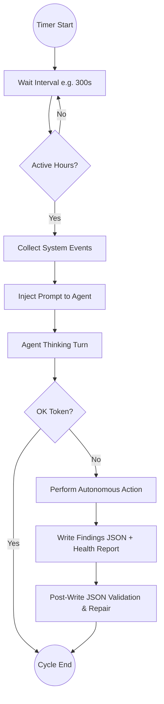
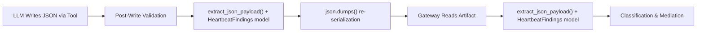

# Heartbeat Service

**Last updated:** 2026-04-29

The **Heartbeat Service** is the "autonomic nervous system" of the Universal Agent. It allows the agent to function without direct user interaction.

> [!IMPORTANT]
> **This document is the single source of truth** for the UA Heartbeat Service subsystem.
> Operational runbooks and incident notes may reference heartbeat concepts, but this file
> defines the authoritative architecture, data contracts, and implementation map.

## 1. Purpose

Most chatbots are passive—they only speak when spoken to. The Heartbeat Service changes this by:

- **Periodic Wakefulness**: Prompting the agent to re-evaluate its state every few minutes.
- **Monitoring Background Tasks**: Checking if long-running operations (like research or compilation) are finished.
- **Time Sensitivity**: Informing the agent of the current time, approaching deadlines, or scheduled events.

Heartbeat does **not** own trusted email mission execution. That work is routed through Task Hub and the dedicated ToDo dispatcher. Heartbeat remains responsible for health supervision, mediation, and other role-appropriate proactive checks.

## 2. Process Heartbeat vs. UA Heartbeat Service

These are **two completely separate modules** with overlapping names:

| Dimension | Process Heartbeat (`process_heartbeat.py`) | UA Heartbeat Service (`heartbeat_service.py`) |
| --- | --- | --- |
| Purpose | OS-level liveness signal | Application-level proactive agent scheduler |
| Mechanism | Daemon thread writes timestamp file every 10s | Async task runs agent every ~30 min |
| Event-loop dependency | Independent (runs in OS thread) | Runs ON the asyncio event loop |
| Consumer | `vps_service_watchdog.sh` | Gateway mediation pipeline, Simone auto-triage |
| Env prefix | `UA_PROCESS_HEARTBEAT_*` | `UA_HEARTBEAT_*` / `UA_HB_*` |

## 3. Heartbeat Cycle



## 4. Configuration & Scheduling

The heartbeat is highly configurable via environment variables.

### Primary Settings

| Environment Variable | Default | Description |
| --- | --- | --- |
| `UA_HEARTBEAT_INTERVAL` | 1800 (30 min) | Primary interval between heartbeat runs (in seconds). Also accepts legacy `UA_HEARTBEAT_EVERY`. |
| `UA_HEARTBEAT_MIN_INTERVAL_SECONDS` | Dynamic | Minimum allowed interval; resolved after Infisical bootstrap. |
| `UA_HEARTBEAT_ACTIVE_START` | None | Start of active hours window (e.g., "08:00"). Heartbeat skips runs outside this window. |
| `UA_HEARTBEAT_ACTIVE_END` | None | End of active hours window (e.g., "20:00"). |
| `UA_HEARTBEAT_EXEC_TIMEOUT` | 1600 | Maximum execution time for a single heartbeat turn (in seconds). |
| `UA_HEARTBEAT_AUTONOMOUS_ENABLED` | 1 | Set to "0" to disable autonomous heartbeat actions entirely. |
| `UA_DAEMON_IDLE_TIMEOUT` | 1800 (30 min) | Strict daemon stuck-run timeout. Daemon heartbeat idle checks and gateway daemon execution watchdogs use this threshold before cancellation and crash-report writing. |

### Retry & Continuation

| Environment Variable | Default | Description |
| --- | --- | --- |
| `UA_HEARTBEAT_RETRY_BASE_SECONDS` | 10 | Base delay for exponential backoff retries. |
| `UA_HEARTBEAT_MAX_RETRY_BACKOFF_SECONDS` | 3600 | Maximum retry backoff delay. |
| `UA_HEARTBEAT_CONTINUATION_DELAY_SECONDS` | 1 | Short delay after actionable runs for quick re-check. |
| `UA_HEARTBEAT_FOREGROUND_COOLDOWN_SECONDS` | 1800 | Cooldown after foreground (user) activity before heartbeat resumes. |

### Limits & Tuning

| Environment Variable | Default | Description |
| --- | --- | --- |
| `UA_HEARTBEAT_MAX_PROACTIVE_PER_CYCLE` | 1 | Maximum proactive items to process per heartbeat cycle. |
| `UA_HEARTBEAT_MAX_ACTIONABLE` | 50 | Maximum actionable items to surface in a single run. |
| `UA_HEARTBEAT_MAX_SYSTEM_EVENTS` | 25 | Maximum system events to include per heartbeat. |
| `UA_HEARTBEAT_INVESTIGATION_ONLY` | None | If set, heartbeat runs in investigation-only mode (no mutations). |
| `UA_HEARTBEAT_TICK_EMIT_INTERVAL_S` | 60 | Interval (seconds) for emitting low-severity `heartbeat_tick` activity events. Provides the Mission Control Heartbeat Daemon tile with a liveness signal even on quiet systems. Hidden from the default Events feed. |

### Task-Focused Mode

When `task_hub_claimed` is non-empty (i.e., a Task Hub task has been claimed for dispatch), heartbeat runs in **task-focused mode**. This mode optimizes for quick task execution rather than comprehensive system monitoring.

| Environment Variable | Default | Description |
| --- | --- | --- |
| (none — mode is automatic) | — | Activated when `task_hub_claimed` is non-empty. |

**Behavioral changes in task-focused mode:**

- **Skipped components**: Brainstorm context injection, morning report generation, system health checks
- **Lean environment prompt**: Uses `_build_task_focused_environment_context()` instead of full context builder
- **No manual findings JSON**: Agent does not write heartbeat_findings_latest.json (synthetic findings used)
- **Faster scheduling**: Continuation passes prioritize task completion over monitoring

**Scope note:** Task-focused heartbeat mode still exists for heartbeat-owned proactive work, but trusted inbound email no longer enters this path. Trusted email is triaged by the hook layer and then executed by the dedicated ToDo runtime.

**Implementation:** See `_compose_heartbeat_prompt()` parameter `task_focused=True` and `_build_task_focused_environment_context()` in `heartbeat_service.py`.

### OK Tokens

The agent can emit special strings (like `HEARTBEAT_OK` or `UA_HEARTBEAT_OK`) to indicate it has nothing to do, ending the turn cleanly. These are stripped and matched by `_strip_heartbeat_tokens()` which also detects "no-op checklist" language to avoid accidental leakage.

### Retry Queue and Continuation Passes

Heartbeat scheduling includes a persisted retry queue in `heartbeat_state.json`.

- **Busy or foreground-locked runs** schedule a retry with exponential backoff:
  - `delay = min(base_retry_seconds * 2^(attempt - 1), max_retry_backoff_seconds)`
- **Failure-driven retries** use the same exponential backoff pattern.
- **Successful actionable runs** schedule a short continuation re-check (default 1 second).
- Retry metadata is persisted with: `retry_kind`, `retry_attempt`, `retry_reason`, `next_retry_at`, `last_retry_delay_seconds`.

## 5. Visibility (Stealth Mode)

The agent can perform "stealth heartbeats" where its thoughts are logged internally but not displayed to the user. Heartbeat execution broadcasts agent events onto the gateway session stream when a UI is connected.

For Mission Control dashboard liveness, the scheduler loop emits a low-severity `heartbeat_tick` activity event at the interval configured by `UA_HEARTBEAT_TICK_EMIT_INTERVAL_S` (see Limits & Tuning). These tick events are hidden from the default Events feed but provide a real liveness signal for the Heartbeat Daemon tile and the Gateway tile (which uses any-recent `activity_events` as a liveness proxy).

## 6. Heartbeat Findings Contract

### Artifacts Written

Each heartbeat cycle that produces non-OK findings writes two artifacts:

| Artifact | Format | Purpose |
| --- | --- | --- |
| `work_products/system_health_latest.md` | Markdown | Human-readable health report |
| `work_products/heartbeat_findings_latest.json` | JSON | Machine-readable findings for gateway mediation |

### JSON Schema

The findings JSON must follow this schema (defined in `memory/HEARTBEAT.md` and enforced by `HeartbeatFindings` Pydantic model):

```json
{
  "version": 1,
  "overall_status": "ok|warn|critical",
  "generated_at_utc": "ISO-8601 UTC timestamp",
  "source": "heartbeat",
  "summary": "Short one-paragraph summary.",
  "findings": [
    {
      "finding_id": "stable_snake_case_id",
      "category": "gateway|system|disk|memory|cpu|dispatch|database|unknown",
      "severity": "ok|warn|critical",
      "metric_key": "metric_name",
      "observed_value": "<any>",
      "threshold_text": ">50",
      "known_rule_match": true,
      "confidence": "low|medium|high",
      "title": "Human-readable title",
      "recommendation": "Actionable recommendation.",
      "runbook_command": "shell command for diagnosis",
      "metadata": {}
    }
  ]
}
```

### JSON Repair Pipeline

The LLM agent writes findings JSON via the Write tool, which is inherently fragile (missing commas, trailing commas, Python literals like `True`/`None`). A three-layer defense ensures reliable parsing:



**Layer 1: Post-write validation (`heartbeat_service.py`)**
After the agent finishes its turn and writes the findings file, the service reads it back, runs `extract_json_payload()` with the `HeartbeatFindings` Pydantic model, and re-serializes with `json.dumps()`. This catches and repairs malformed JSON before it ever reaches the gateway.

**Layer 2: Gateway repair (`gateway_server.py`)**
When the gateway reads the findings artifact in `_heartbeat_findings_from_artifacts()`, it uses the same `extract_json_payload()` + `HeartbeatFindings` pipeline instead of bare `json.loads()`. This handles edge cases where post-write validation was skipped or failed.

**Layer 3: Synthetic fallback (`heartbeat_service.py`)**
If the agent doesn't write findings at all (common for Task Hub dispatch, exec completions, etc.), the service generates synthetic findings using `json.dumps()` — always valid JSON.

The repair pipeline uses:

- `json_repair` library: fixes missing commas, trailing commas, unquoted keys, Python `True`/`False`/`None` literals
- `HeartbeatFindings` Pydantic model: validates schema and fills missing fields with permissive defaults
- `json.dumps()`: deterministic re-serialization guarantees valid JSON

### Missing vs. Corrupt Artifact Distinction

The gateway distinguishes between these cases since v2026-03-19:

- **Missing artifact**: Normal for many run types (Task Hub, exec completions). No `heartbeat_findings_parse_failed` notification emitted. Synthetic findings are used.
- **Corrupt artifact**: The artifact exists but can't be parsed even after repair. Emits `heartbeat_findings_parse_failed` notification with the parse error. Fallback findings are used.

## 7. Non-OK Heartbeat Mediation

Non-OK heartbeats are treated as operational investigations:

1. Heartbeat detects the issue
2. Gateway classifies findings (known-rule vs unknown, severity)
3. Gateway adds `autonomous_heartbeat_completed` notification with `requires_action=true`
4. Simone is automatically dispatched for investigation
5. Simone writes investigation summary back into the hook run workspace
6. If operator review needed, Kevin gets dashboard notification + AgentMail

> [!NOTE]
> This is deliberately auto-investigation, not auto-remediation.
> Simone cannot auto-edit code, auto-run shell commands, or auto-deploy in this flow.
> See [Heartbeat Issue Mediation and Auto-Triage](../03_Operations/95_Heartbeat_Issue_Mediation_And_Auto_Triage_2026-03-12.md) for the full mediation contract.

### Cooldown and Deduplication

Equivalent findings are suppressed from repeated Simone dispatch for a configurable window (default: `cooldown_minutes = 60`). The notification still appears; only duplicate dispatch is suppressed.

### No-op Suppression

Heartbeats with no meaningful activity (no writes, no work products, no elevated severity, no unknown rules) are suppressed from notification entirely via `_heartbeat_has_meaningful_activity()`.

## 8. Agent Instructions (`memory/HEARTBEAT.md`)

The `memory/HEARTBEAT.md` file is the **agent-facing operating contract** — it tells the LLM what checks to run, what thresholds to use, what artifacts to write, and what schema to follow. It is NOT documentation; it is a prompt.

Key contents:

- Active monitors (VPS system health, local desktop health)
- Mission-focus items and execution windows
- The JSON findings schema (authoritative for the agent)
- Checkbox semantics: `[ ]` = active/pending, `[x]` = completed/disabled
- Kevin's working style preferences
- Response policy (concise summaries, no-op skipping)
- Novelty policy (instructs the agent to explicitly avoid repeating recently investigated topics)

### 8.1 Proactive Deduplication

To prevent the agent from endlessly investigating the same initial standing instructions (e.g. "AI Model Releases") during empty Task Hub queues, heartbeat uses a **proactive topic tracker**:

1. **Fingerprinting**: `proactive_topic_tracker.py` extracts a deterministic fingerprint of the topic summary from non-OK heartbeat responses.
2. **State Storage**: The topic and its timestamp are recorded into a `recent_topics` list inside `heartbeat_state.json`, subject to a 24-hour expiration window.
3. **Prompt Injection**: The tracker formats these recent topics into a text block, which is then dynamically injected by `_compose_heartbeat_prompt` into the `== RECENT INVESTIGATIONS ==` section of the agent's prompt.
4. **Novelty Enforcement**: The Novelty Policy inside `HEARTBEAT.md` explicitly commands the LLM to skip any topics appearing in the Recent Investigations list, forcing it to rotate through different uninvestigated items.

## 8A. Role-Isolated Runtime Model

Heartbeat and Task Hub execution no longer share the same Simone daemon session.

| Runtime | Session ID | Allowed work |
| --- | --- | --- |
| Heartbeat daemon | `daemon_simone_heartbeat` | Heartbeat prompts, health checks, mediation follow-up |
| ToDo daemon | `daemon_simone_todo` | Task Hub claim, execution, delegation, review, final delivery |

This split prevents run-log/transcript cross-talk between heartbeat supervision and email/task execution.

Daemon sessions are not permanently immune from timeout cleanup. They keep their stable session IDs, but any daemon whose runtime activity is stale beyond `UA_DAEMON_IDLE_TIMEOUT` is treated as stuck even if `active_runs` is still nonzero. The heartbeat idle check writes `work_products/daemon_timeout_crash.json` under the session's actual `workspace_dir`, unregisters the daemon from heartbeat supervision, and asks the gateway to cancel any active execution task. Separately, gateway-registered daemon execution tasks have a watchdog with the same 30-minute default so ToDo daemon runs cannot remain alive indefinitely after a dispatch is accepted.

## 8B. Heartbeat-Safe Autonomous Subsystem Isolation

Proactive curation tasks (such as those triggered by cron) are explicitly isolated from heartbeat supervision to prevent recursive "check the checker" behavior.
- **Metadata Exclusion**: `metadata: {"skip_heartbeat": True}` is injected into these sessions. The Gateway Server honors this flag to bypass standard heartbeat registration.
- **Guardrail Overrides**: The Heartbeat Service tracks `_curation_dispatched` events, safely bypassing standard mission guard policies during active proactive curation.

## 9. Implementation Files

| File | Role |
| --- | --- |
| `src/universal_agent/heartbeat_service.py` | Main service: scheduling, execution, prompt composition, retry queue, post-write validation, synthetic fallback |
| `src/universal_agent/services/dispatch_service.py` | Core dispatch functions: `dispatch_immediate()`, `dispatch_on_approval()`, `dispatch_scheduled_due()`, `dispatch_sweep()` — all dispatch paths enrich tasks with Simone-first routing metadata |
| `src/universal_agent/services/todo_dispatch_service.py` | Dedicated ToDo execution service: session-based dispatch orchestration for `todo_execution` runtimes only; manages wake signals and scheduler loop for claimed Task Hub execution |
| `src/universal_agent/utils/heartbeat_findings_schema.py` | `HeartbeatFindings` + `HeartbeatFinding` Pydantic models with permissive defaults and normalizers |
| `src/universal_agent/utils/json_utils.py` | `extract_json_payload()`: 5-layer JSON repair (json.loads → json_repair → regex extraction → Pydantic validation) |
| `src/universal_agent/gateway_server.py` | `_heartbeat_findings_from_artifacts()`: reads + repairs + classifies findings; `_emit_heartbeat_event()`: mediation dispatch; routes sessions to heartbeat vs ToDo services by `session_role` |
| `src/universal_agent/heartbeat_mediation.py` | `sanitize_heartbeat_recommendation_text()`: rewrite stale provider-specific language in mediation output |
| `src/universal_agent/process_heartbeat.py` | OS-level liveness writer (daemon thread, separate from this service) |
| `src/universal_agent/hooks_service.py` | Hook completion handling for Simone heartbeat investigations |
| `src/universal_agent/heartbeat_scope_filter.py` | `filter_heartbeat_by_scope()`: filters HEARTBEAT.md sections by factory role (HQ vs local worker) |
| `src/universal_agent/delegation/heartbeat.py` | Factory heartbeat sender: periodic registration refresh with HQ for Corporation View stale detection |
| `src/universal_agent/bot/heartbeat_adapter.py` | `BotConnectionAdapter`: adapts Telegram Bot for HeartbeatService broadcast interface |
| `memory/HEARTBEAT.md` | Agent-facing operating instructions and active monitors |
| `src/universal_agent/main.py` | Bootstraps the service during agent initialization |

Heartbeat is not a fallback executor for trusted email work. If the ToDo runtime is unavailable, the task remains queued and visible to operators; heartbeat must not absorb that mission path.

## 10. Related Documentation

| Document | Scope |
| --- | --- |
| [Heartbeat Issue Mediation and Auto-Triage (2026-03-12)](../03_Operations/95_Heartbeat_Issue_Mediation_And_Auto_Triage_2026-03-12.md) | Full mediation contract: notification model, Simone dispatch, operator escalation, UI badges |
| [Factory Delegation, Heartbeat, and Registry (2026-03-06)](../03_Operations/88_Factory_Delegation_Heartbeat_And_Registry_Source_Of_Truth_2026-03-06.md) | Redis transport, factory heartbeat (VP fleet registration), delegation context |
| [Heartbeat Debug Fixes (2026-02-05)](../03_Operations/01_Heartbeat_Debug_Fixes.md) | Historical: no-op strictness, text dedup, UI visibility fixes |
