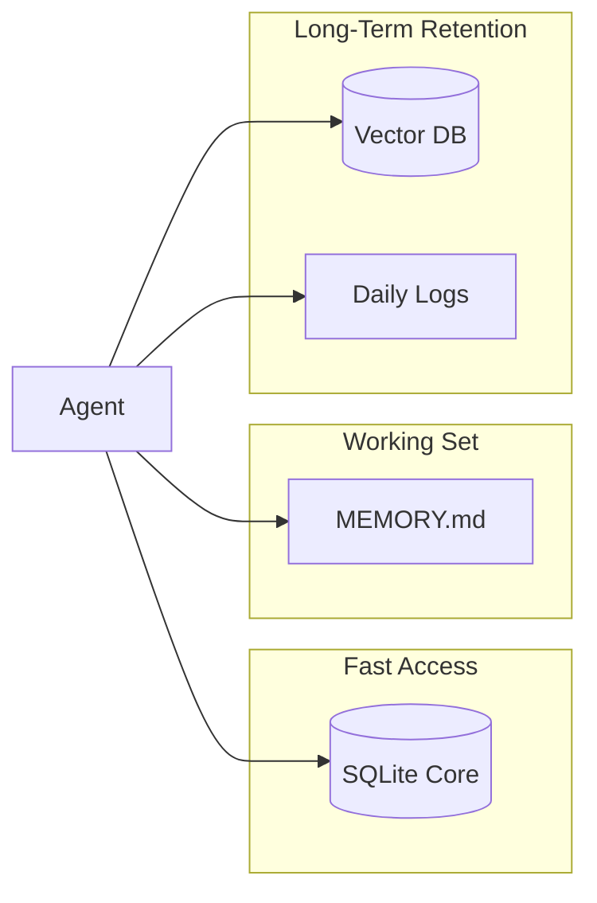

# Memory System

The Universal Agent employs a **Tiered Memory Architecture** to balance fast-access state, semantic retrieval, and long-term human-readable archives.

## 1. Memory Tiers

| Tier | Storage Mechanism | Use Case |
| --- | --- | --- |
| **Core Memory** | SQLite (`agent_core.db`) | Immediate persona, user preferences, and constant variables. |
| **Active Context** | Markdown (`MEMORY.md`) | A human-readable record of recent turns and summaries. |
| **Vector Memory** | ChromaDB / LanceDB | Semantic search for historical context and cross-session knowledge. |
| **Archival Memory** | Markdown Daily Files | Long-term logs organized by date (e.g., `2024-02-05.md`). |

## 2. Tiering Diagram

## 3. LLM Wiki Integration

The Memory System bridges to the LLM Wiki Subsystem via `maybe_auto_sync_internal_memory_vault()` (in `wiki/projection.py`). When new memories are written, the internal memory vault is automatically re-derived from canonical memory, session, checkpoint, and run evidence.

This integration is triggered at four points:

| Trigger Point | Location | What Happens |
| --- | --- | --- |
| `append_memory_entry` | `memory/memory_store.py` | After appending a new memory entry to daily markdown files |
| `sync_session` | `memory/orchestrator.py` | After writing a new session entry |
| `capture_session_rollover` | `memory/orchestrator.py` | After capturing a session rollover |
| `session_checkpoint_save` | `session_checkpoint.py` | After saving a session checkpoint to the workspace |

**Gating:** Controlled by two environment variables (both must be truthy):
- `UA_LLM_WIKI_AUTO_SYNC_INTERNAL` (default: off)
- `UA_LLM_WIKI_ENABLE_INTERNAL_PROJECTION` (default: on)

When disabled, the memory system operates independently without wiki sync. The sync is fault-tolerant — failures are logged but never block memory writes.

See also: **Internal Memory Vault** (Glossary) and LLM Wiki System documentation.

## 4. Implementation Details

### Core Memory (SQLite)

Stored in the `agent_core.db` within the `Memory_System_Data` directory. This is used for "hard-coded" memory blocks like `persona` and `human`.

- **Primary Class**: `MemoryManager` in `Memory_System/manager.py` (exposed via `agent_core.py`).

### Vector Memory

Allows the agent to performing semantic lookups. When `memory_index_mode` is set to `vector`, the agent automatically indexes new memory entries.

- **Backends**: Supports `chromadb` (default) and `lancedb` (for high-performance environments with AVX2).
- **Embeddings**: Configurable between `SentenceTransformers` (local) and `OpenAI`.
- **Search Logic**: Uses cosine similarity to find the most relevant past memories based on the current context.

### Memory Store (`memory_store.py`)

The central coordinator for saving memories.

1. **Append**: Writes the full entry to a daily markdown file.
2. **Summarize**: Generates a short summary of the interaction.
3. **Index**: Updates the `index.json` and recent benchmarks in `MEMORY.md`.
4. **Vectorize**: (Async) Generates embeddings and upserts to the vector database.

## 5. Auto-Flush Mechanism

To prevent "content blindness" and handle context window limits (typically 200k tokens), the system implements an **Auto-Flush** loop.

### How it works

1. **Detection**: When the active context reaches a configurable threshold (e.g., `UA_TRUNCATION_THRESHOLD` at 150k tokens), the system triggers a memory flush.
2. **Analysis**: A specialized internal loop analyzes the current transcript for facts, decisions, and outcomes.
3. **Persistence**: The agent use tools like `archival_memory_insert` to save these findings to the daily Markdown logs and vector store.
4. **Reset**: The active session context is then safely truncated or summarized, ensuring the agent remains high-velocity without losing critical history.

---

## 6. Configuration & Backend

Memory behavior is controlled via environment variables:

- `UA_MEMORY_INDEX`: Set to `vector`, `json`, `fts`, or `off`.
- `UA_MEMORY_BACKEND`: Select `chromadb` or `lancedb`.
- `UA_EMBEDDING_PROVIDER`: Select `sentence-transformers` or `openai`.
