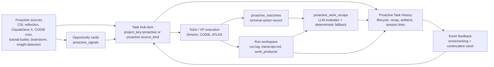
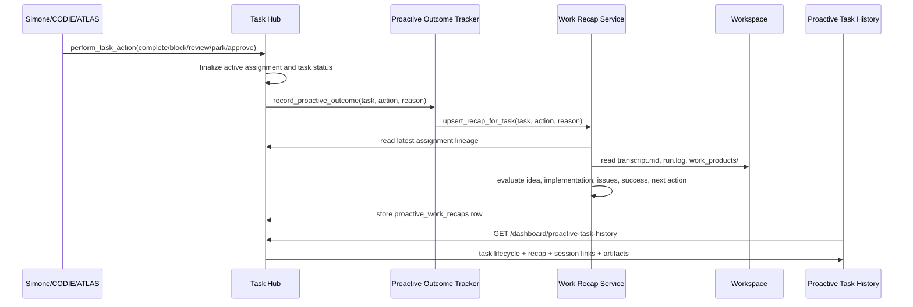

# Proactive Autonomous Work Product Project

**Status:** Active implementation reference
**Last updated:** 2026-04-29
**Owner:** Kevin Dragan
**Related docs:** [Proactive Pipeline](Proactive_Pipeline.md), [Proactive Intelligence Work Product Pipeline](Proactive_Intelligence_Work_Product_Pipeline.md), [Task Hub Dashboard](Task_Hub_Dashboard.md)

## Objective

Universal Agent should use idle agent capacity to generate useful work products for Kevin without waiting for direct assignment. The system should not stop at ideation. A proactive item counts only when it is converted into an executable work item, completed or explicitly dispositioned, and made auditable through session history, artifacts, recap, and feedback.

The current project goal is to make autonomous work visible and trustworthy:

- proactive opportunities should enter the same Task Hub execution spine as ordinary work when they need execution
- speculative but non-destructive work is allowed by default
- final work must produce an artifact, delivery evidence, PR, report, session result, or explicit failure/continuation record
- the Proactive Task History tab must distinguish autonomous work from user-directed dashboard quick-add work
- every completed proactive item should expose a recap, artifacts, evidence, and a three-panel session link
- Kevin feedback should tune future scoring and may spawn continuation work in a fresh session that reuses the prior workspace safely

## Current Implementation Slice

The April 29 implementation established the first durable audit spine:

| Area | Implementation | Code citation |
| --- | --- | --- |
| Proactive Task Hub read model | `list_proactive_work_tasks()` returns proactive items across lifecycle stages and excludes normal dashboard quick-add tasks unless explicitly marked proactive. | `file:///home/kjdragan/lrepos/universal_agent/src/universal_agent/task_hub.py#L1572` |
| Latest assignment/evidence hydration | Proactive rows include latest assignment lineage, workspace, session ids, completion time, and delivery evidence. | `file:///home/kjdragan/lrepos/universal_agent/src/universal_agent/task_hub.py#L1508` |
| Dashboard API | `/api/v1/dashboard/proactive-task-history` now returns tasks, opportunities, lifecycle counts, artifacts, session links, and recaps. | `file:///home/kjdragan/lrepos/universal_agent/src/universal_agent/gateway_server.py#L17042` |
| Recap lookup and serialization | Dashboard cards prefer durable recaps and fall back to task metadata or deterministic pending text. | `file:///home/kjdragan/lrepos/universal_agent/src/universal_agent/gateway_server.py#L17124` |
| Three-panel/session links | Serialized work items carry `session_id`, `run_id`, `workspace_dir`, transcript/run-log links, and `three_panel_href`. | `file:///home/kjdragan/lrepos/universal_agent/src/universal_agent/gateway_server.py#L17243` |
| Durable recap table | `proactive_work_recaps` stores evaluator output keyed by `task_id`, including idea, implementation, issues, success assessment, next action, confidence, and raw payload. | `file:///home/kjdragan/lrepos/universal_agent/src/universal_agent/services/proactive_work_recap.py#L25` |
| LLM recap evaluator | Recap generation builds a session-evidence bundle from latest assignment, workspace, `transcript.md`, `run.log`, and `work_products/`, then uses a high-capability LLM evaluator with deterministic fallback. | `file:///home/kjdragan/lrepos/universal_agent/src/universal_agent/services/proactive_work_recap.py#L208` |
| Terminal outcome hook | Proactive outcome recording now also stores a recap after terminal actions. | `file:///home/kjdragan/lrepos/universal_agent/src/universal_agent/services/proactive_outcome_tracker.py#L213` |
| CODIE cleanup cron | Gateway startup auto-ensures the CODIE proactive cleanup cron and upgrades legacy jobs. | `file:///home/kjdragan/lrepos/universal_agent/src/universal_agent/gateway_server.py#L14047` |
| Feedback continuation | Feedback tags/text can create a fresh proactive continuation task linked to the original task and prior workspace. | `file:///home/kjdragan/lrepos/universal_agent/src/universal_agent/task_hub.py#L1442` |

## Execution Architecture

## Terminal Action Sequence

## Proactive History Card Contract

The primary unit on `/dashboard/proactive-task-history` is a proactive work item. A complete card should expose:

| Field | Purpose |
| --- | --- |
| source kind | Shows which autonomous system created or promoted the work. |
| lifecycle stage | `opportunity`, `queued`, `running`, `completed`, or `needs_attention`. |
| assignment/session lineage | Makes it clear which agent/session did the work. |
| three-panel link | Opens the completed session with transcript, run log, and workspace context. |
| artifacts | Links to published proactive artifacts and workspace products. |
| evidence | Delivery evidence such as AgentMail sends, drafts, attachments, or work-product paths. |
| recap | Evaluator summary of idea, implementation, known issues, success, and next action. |
| feedback control | Records Kevin feedback for scoring and potential continuation work. |

## Recap Evaluation Design

The current recap evaluator is deliberately conservative. It does not invent success. It reads available session evidence, runs a high-capability LLM evaluator when enabled, and stores an auditable summary. If the model call fails or returns invalid JSON, it falls back to the deterministic session-evidence evaluator and records `evaluation_status=llm_failed_fallback`.

Inputs:

- Task Hub title and description
- terminal action and reason
- latest assignment result summary
- latest assignment workspace
- `work_products/` file list
- `transcript.md` tail
- `run.log` tail

Outputs:

- `idea`
- `implemented`
- `known_issues`
- `success_assessment`
- `recommended_next_action`
- `confidence`
- `raw_model_output_json`

Evaluator requirements:

1. Use a high-capability model by default through `resolve_opus()` or an explicit `UA_PROACTIVE_RECAP_LLM_MODEL` override.
2. Do not use a light/Haiku-class model for proactive work-product success assessment.
3. Build a structured prompt from the evidence bundle.
4. Parse strict JSON and normalize required recap fields.
5. Store the parsed result in the same `proactive_work_recaps` row with `evaluation_status=llm_evaluated`.
6. Preserve the deterministic session-evidence evaluator as fallback when model calls fail.

## CODIE Proactive Cleanup Lane

CODIE codebase/product improvement is intentionally excluded from the general proactive ideation lane for now because it has its own cron-backed PR lane.

CODIE cleanup requirements:

- target low-to-medium complexity tasks
- prefer simplification and deletion over expansion
- use the Claude Code simplify/cleanup skill when installed and helpful
- use red-green TDD for behavior-touching changes
- explain why red-green is not applicable for mechanical-only cleanup
- produce a PR against `develop` as the final work product when useful
- never merge, deploy, or push directly to `main`

The current cron path queues deterministic cleanup work through `universal_agent.scripts.codie_cleanup_enqueue`, avoiding brittle natural-language cron prompts.

## Continuation Work Design

Feedback should be able to request continuation without overloading the original context window.

Target behavior:

1. Kevin leaves feedback on a proactive history item.
2. The system records feedback for scoring.
3. If feedback implies follow-up, a new Task Hub item is created with `source_kind=proactive_feedback_continuation`, `project_key=proactive`, and `parent_task_id` linking to the prior task.
4. The new session receives:
   - original task and recap
   - feedback text/tags
   - previous `workspace_dir`
   - explicit instruction to reuse existing files without overwriting unless necessary
5. The continuation session writes new artifacts into the same workspace or a clearly linked child workspace.
6. The new task appears as its own proactive history item with separate assignment/session lineage.

Implemented trigger signals:

- feedback tag `continue_work`
- feedback tag `needs_followup`
- text containing phrases such as "continue", "follow up", "next step", "keep working", "do more", or "more like this"

Open design point: workspace reuse is currently expressed in the continuation task description and metadata. A later dispatch/session-creation slice should add a guarded runtime path that can mount or reference an existing directory without re-templating over existing outputs.

## Acceptance Criteria

Current slice:

- Proactive Task History includes autonomous proactive tasks across lifecycle states.
- User-directed dashboard quick-add tasks do not pollute the autonomous history view.
- Completed proactive tasks can store durable recaps.
- Recaps are linked to session/workspace evidence.
- History cards show artifacts, evidence, and three-panel links when available.
- CODIE cleanup work is deterministic, TDD-aware, PR-oriented, and gateway-ensured.
- LLM-backed recaps use a high-capability model path and deterministic fallback.
- Feedback can create proactive continuation tasks in fresh sessions with prior workspace context.

Next slice:

- Proactive history can group task chains: original idea, continuation tasks, artifacts, and outcomes.
- Dashboard cards show whether a recap is heuristic, LLM-evaluated, failed, or stale.
- AgentMail digest/email surfaces completed proactive work with the same recap and links.

## Verification Record

Fresh verification from the April 29 implementation pass:

- `uv run pytest tests/unit/test_task_hub_proactive_history.py tests/unit/test_proactive_codie.py tests/unit/test_proactive_outcome_tracker.py -q` -> 21 passed
- `python3 -m py_compile` over touched backend modules -> passed
- `npx eslint app/dashboard/proactive-task-history/page.tsx` -> passed
- `npx tsc --noEmit --pretty false` -> passed
- `git diff --check` over touched implementation/docs -> passed
- Browser smoke rendered `/dashboard/proactive-task-history` locally; local gateway proxy returned 502 because the backend gateway was not running in that dev session
