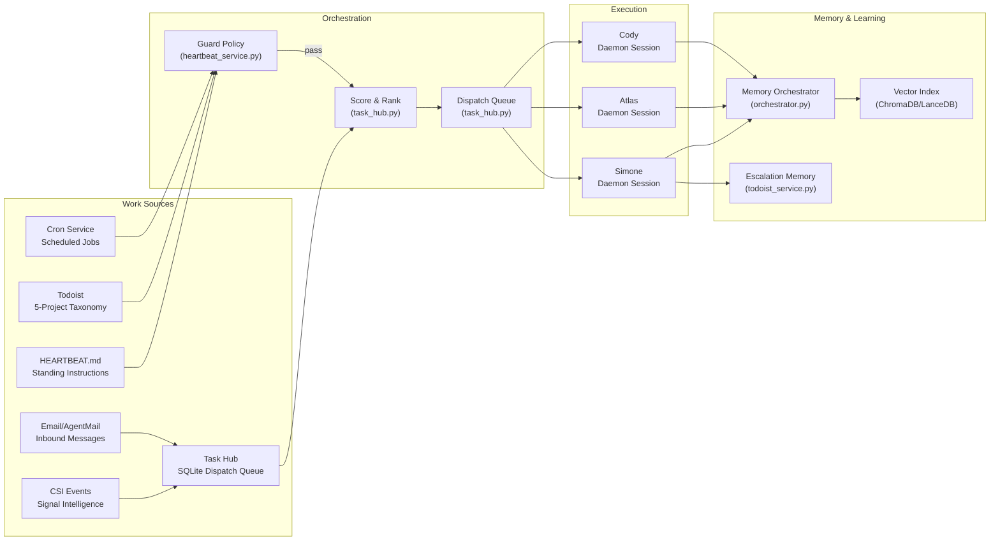
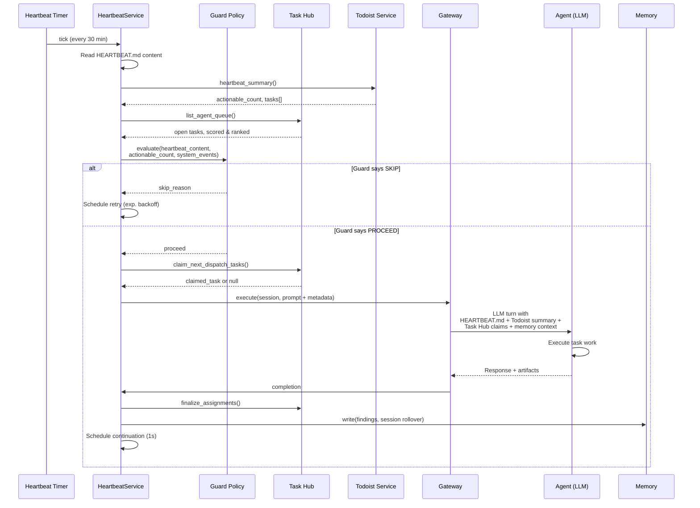
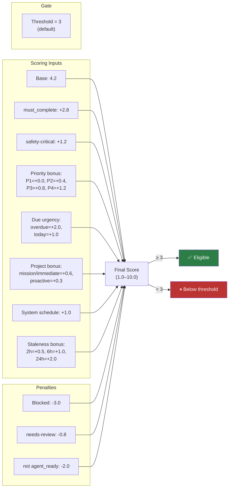
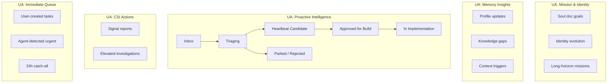
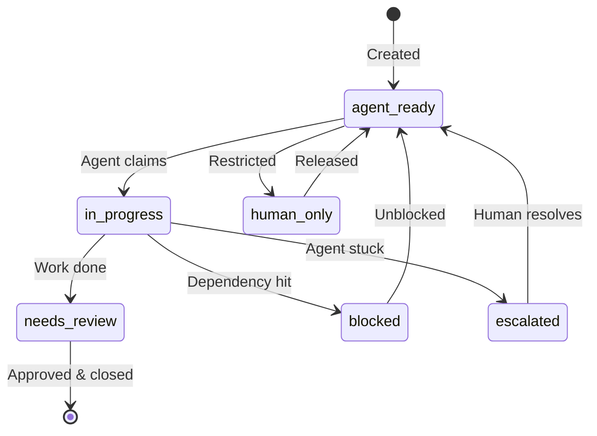
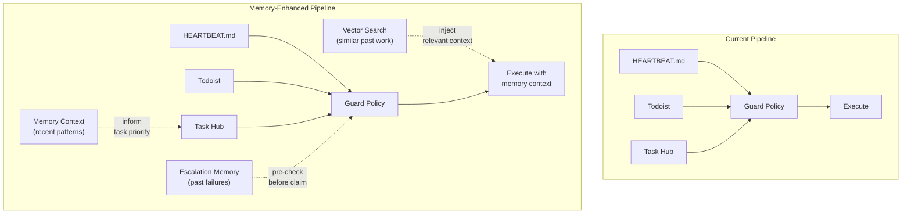

# Proactive Pipeline Architecture

> [!IMPORTANT]
> **This document is the single source of truth** for the UA Proactive Pipeline —
> the end-to-end system that makes agents DO work autonomously, not just respond
> to user messages.

## 1. What Is the Proactive Pipeline?

The Proactive Pipeline is the integration of **six subsystems** that work together to
ensure agents (Simone, Atlas, Cody) continuously find, prioritize, claim, execute,
and report on work — 24/7, without human prompting.




## 2. End-to-End Flow — Sequence Diagram




## 3. Guard Policy — Decision Flowchart

The Guard Policy is the **critical gate** that decides whether a heartbeat cycle
should execute or skip. This was the primary bottleneck before the 2026-03-22 fix.

```mermaid
flowchart TD
    Start((Heartbeat<br/>Triggered)) --> AutCheck{Autonomous<br/>enabled?}
    AutCheck -- "No (UA_HEARTBEAT_<br/>AUTONOMOUS_ENABLED=0)" --> Skip1[/"SKIP:<br/>autonomous_disabled"/]

    AutCheck -- Yes --> CapCheck{actionable_count<br/>≤ max_actionable?}
    CapCheck -- No --> Skip2[/"SKIP:<br/>actionable_over_capacity"/]

    CapCheck -- Yes --> WorkCheck{Has work?}

    WorkCheck -- "HEARTBEAT.md<br/>has content" --> Proceed✅
    WorkCheck -- "Todoist actionable<br/>count > 0" --> Proceed✅
    WorkCheck -- "Task Hub<br/>claims available" --> Proceed✅
    WorkCheck -- "System events<br/>pending" --> Proceed✅
    WorkCheck -- "Brainstorm<br/>candidates" --> Proceed✅
    WorkCheck -- "Exec completions<br/>waiting" --> Proceed✅

    WorkCheck -- "None of<br/>the above" --> Skip3[/"SKIP:<br/>no_actionable_work"/]

    Proceed✅ --> CoolCheck{Foreground<br/>cooldown?}
    CoolCheck -- "Active + not<br/>a directed wake" --> Skip4[/"SKIP:<br/>foreground_cooldown"/]
    CoolCheck -- "No / Directed<br/>wake request" --> Execute[/"EXECUTE<br/>heartbeat cycle"/]

    style Proceed✅ fill:#2d7d46,color:#fff
    style Skip1 fill:#b33,color:#fff
    style Skip2 fill:#b33,color:#fff
    style Skip3 fill:#b33,color:#fff
    style Skip4 fill:#b33,color:#fff
    style Execute fill:#2d7d46,color:#fff
```


> [!NOTE]
> **Key fix (2026-03-22):** Before this date, `HEARTBEAT.md` content was NOT
> checked as a work source. The guard skipped every cycle with `no_actionable_work`
> because Todoist and Task Hub had nothing, even though `HEARTBEAT.md` contained
> standing instructions. The `has_heartbeat_content` parameter now bypasses this.

## 4. Task Hub Scoring & Dispatch

The Task Hub scores each task to determine dispatch order and eligibility.




> A standard `agent-ready` task scores 4.2 (base) and is always eligible at the
> default threshold of 3. Scoring influences **dispatch order**, not eligibility.

## 5. Todoist 5-Project Taxonomy — Swimlane




### Task Lifecycle Labels




## 6. Memory Integration (Implemented)

All three memory enhancements below are live. Each is wrapped in defensive
`try/except` — memory is advisory, never blocks heartbeat execution.

### Integration Points

| Memory Component | Available to Heartbeat? | Used for Proactive Work? |
| --------------- | ---------------------- | ---------------------- |
| `memory_context.py` — recent context | ✅ Built into prompt | ✅ Built into prompt |
| `tools/memory.py` — semantic search | ✅ Agent can call it | ✅ Agent-initiated + auto-injected |
| `check_escalation_memory()` | ✅ Built | ✅ Pre-check before task claim |
| Session rollover capture | ✅ Auto-triggers | ✅ Indexed for dispatch scoring |
| Vector index (ChromaDB) | ✅ Indexed | ✅ Queried during task scoring |

### How It Works




1. **Escalation Pre-Check** (`heartbeat_service.py` L1535–1553) — After task claim, queries `check_escalation_memory()` for each task's title. Past failure resolutions are attached as `escalation_history` on the claim so the agent doesn't repeat mistakes.

2. **Memory-Informed Scoring** (`task_hub.py` `_memory_relevance_bonus()`) — Searches `MemoryOrchestrator` for the task title. Returns **+0.4 score** and **+0.06 confidence** when relevant institutional memory exists.

3. **Context Injection** (`heartbeat_service.py` L1577–1600) — After dispatch, searches memory for each claimed task's title and injects matching snippets (capped at 500 chars each) into `metadata["memory_context_for_tasks"]`.

## 7. Feature Flags & Configuration

| Flag | Default | Purpose |
|------|---------|---------|
| `UA_ENABLE_HEARTBEAT` | **ON** (True) | Master switch for heartbeat service |
| `UA_ENABLE_CRON` | **ON** (True) | Master switch for cron service |
| `UA_HEARTBEAT_EXEC_TIMEOUT` | **1600s** | Max execution time per heartbeat turn |
| `UA_HEARTBEAT_MAX_RETRY_BACKOFF_SECONDS` | **3600s** | Max backoff between retries |
| `UA_TASK_AGENT_THRESHOLD` | **3** | Score threshold for dispatch eligibility |
| `UA_HEARTBEAT_AUTONOMOUS_ENABLED` | 1 | Kill switch for autonomous runs |
| `UA_HEARTBEAT_INTERVAL` | 1800 | Interval between heartbeat cycles (seconds) |

## 8. Implementation Map

### Core Files

| File | Role |
|------|------|
| [`heartbeat_service.py`](file:///home/kjdragan/lrepos/universal_agent/src/universal_agent/heartbeat_service.py) | Orchestrator: scheduling, guard policy, prompt composition, retry queue, Task Hub claims |
| [`task_hub.py`](file:///home/kjdragan/lrepos/universal_agent/src/universal_agent/task_hub.py) | Scoring, dispatch queue, claim/finalize lifecycle, staleness bonus |
| [`feature_flags.py`](file:///home/kjdragan/lrepos/universal_agent/src/universal_agent/feature_flags.py) | `heartbeat_enabled()`, `cron_enabled()` — master switches |
| [`todoist_service.py`](file:///home/kjdragan/lrepos/universal_agent/src/universal_agent/services/todoist_service.py) | 5-project taxonomy, subtask hierarchy, escalation memory, brainstorm pipeline |

### Memory Files

| File | Role |
|------|------|
| [`memory/orchestrator.py`](file:///home/kjdragan/lrepos/universal_agent/src/universal_agent/memory/orchestrator.py) | Canonical memory broker: write, search, session sync, rollover |
| [`memory/memory_context.py`](file:///home/kjdragan/lrepos/universal_agent/src/universal_agent/memory/memory_context.py) | Token-budgeted context builder from recent entries |
| [`memory/memory_store.py`](file:///home/kjdragan/lrepos/universal_agent/src/universal_agent/memory/memory_store.py) | Persistent storage with vector indexing |
| [`tools/memory.py`](file:///home/kjdragan/lrepos/universal_agent/src/universal_agent/tools/memory.py) | Agent-facing `memory_get` and `memory_search` tools |

### Key Functions and Classes

| Function/Class | Location | Purpose |
|---------------|----------|---------|
| `HeartbeatService` | `heartbeat_service.py` | Main service class — manages daemon heartbeat loops |
| `_heartbeat_guard_policy()` | `heartbeat_service.py` | Decision gate: skip or execute? |
| `_run_heartbeat()` | `heartbeat_service.py` | Executes a single heartbeat cycle |
| `score_task()` | `task_hub.py` | Computes 1.0–10.0 score with staleness bonus |
| `current_policy()` | `task_hub.py` | Returns threshold and stale-task settings |
| `claim_next_dispatch_tasks()` | `task_hub.py` | Atomically claims top-scoring eligible task |
| `finalize_assignments()` | `task_hub.py` | Post-execution: mark complete/review/reopen |
| `TodoService` | `todoist_service.py` | Full Todoist API wrapper with taxonomy |
| `TodoService.heartbeat_summary()` | `todoist_service.py` | Deterministic summary for heartbeat injection |
| `TodoService.check_escalation_memory()` | `todoist_service.py` | Query past escalation resolutions |
| `MemoryOrchestrator` | `memory/orchestrator.py` | Unified memory read/write/search |
| `build_file_memory_context()` | `memory/memory_context.py` | Token-budgeted context for prompts |

## 9. Related Documentation

| Document | Scope |
|----------|-------|
| [Heartbeat Service](Heartbeat_Service.md) | Cycle mechanics, JSON findings schema, repair pipeline, mediation flow |
| [Memory System](Memory_System.md) | Tiered memory architecture, auto-flush |
| [Todoist Heartbeat Runbook](../03_Operations/41_Todoist_Heartbeat_And_Triage_Operational_Runbook_2026-02-16.md) | Operational cadence for Todoist-backed inputs |
| [Heartbeat Issue Mediation](../03_Operations/95_Heartbeat_Issue_Mediation_And_Auto_Triage_2026-03-12.md) | Non-OK heartbeat auto-investigation |
