# Proactive Pipeline Architecture

> [!IMPORTANT]
> **This document is the single source of truth** for the UA Proactive Pipeline —
> the end-to-end system that makes agents DO work autonomously, not just respond
> to user messages.
>
> **Last updated:** 2026-03-31 — trusted AgentMail inbound now defaults to one canonical Task Hub item per inbound request, disjoint email splitting is opt-in behind `UA_AGENTMAIL_SPLIT_DISJOINT_TASKS`, tracked chat-panel requests now enter the same Task Hub / `todo_execution` lifecycle, the gateway accepts both `query` and `execute` websocket message types, and `todo_execution` still requires a durable Task Hub lifecycle mutation or a server-side auto-linked VP delegation.
> See `01_Architecture/05_Simone_First_Orchestration.md` for full
> architectural rationale. Todoist decommissioned; Task Hub is the sole
> dispatch and orchestration layer.

---

## 1. What Is the Proactive Pipeline?

The Proactive Pipeline is the integration of **seven subsystems** that work together
to ensure agents continuously find, prioritize, claim, execute, and report on work —
24/7, without human prompting.

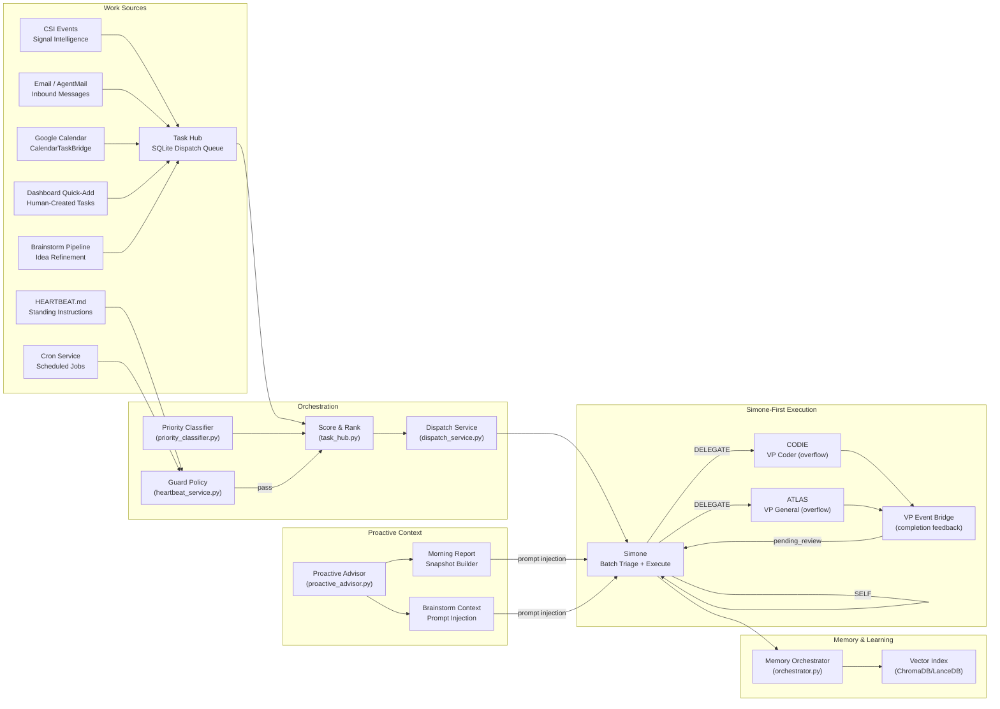

### What Changed from Legacy

| Aspect | Legacy (pre-2026-03) | Current |
|--------|---------------------|---------|
| External task store | Todoist 5-project taxonomy | **Decommissioned** — all tasks live in Task Hub SQLite |
| Dispatch queue | Todoist `actionable_count` polling + heartbeat inline | **Task Hub dispatch queue** with score-ranked claiming |
| Brainstorm pipeline | Manual Todoist labels (Inbox→Triaging→Candidate) | **6-stage LLM refinement** (raw_idea→actionable) |
| Task entry points | Todoist API sync only | **6 ingress paths**: CSI, Email, Calendar, Dashboard, Heartbeat, Brainstorm |
| Morning report | Not implemented | **Deterministic snapshot** injected into heartbeat prompts |
| Agent tools | `todoist_*` tool family | **`task_hub_task_action`** — review, complete, block, park, unblock, delegate, approve<br>**`task_hub_decompose`** — split multi-part tasks into linked subtasks |

---

## 2. End-to-End Flow — Sequence Diagram

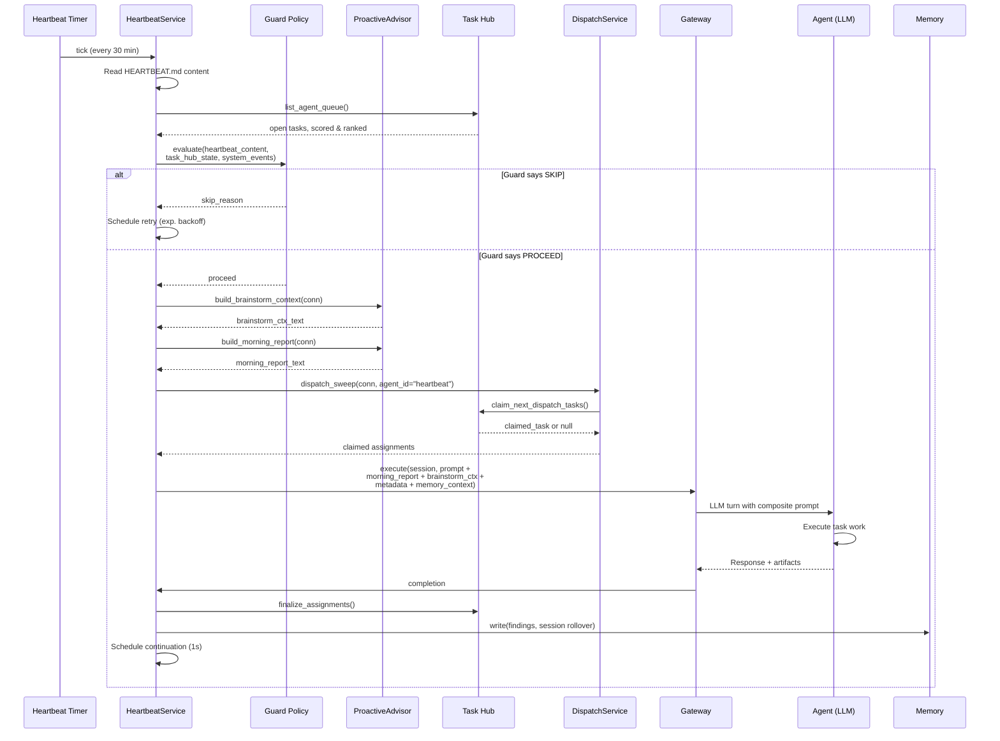

---

## 3. Task Ingress — How Tasks Enter the Hub

Tasks enter the Task Hub through six distinct ingress paths:

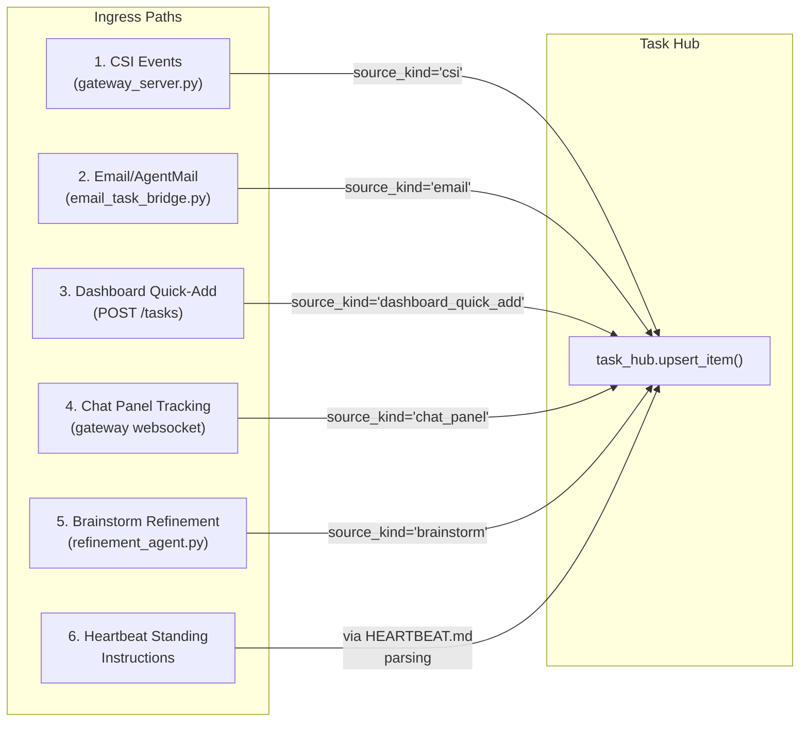

### 3.1 CSI Event Bridge

CSI (Continuous Signal Intelligence) events are classified and optionally materialized
as tasks. The gateway routes based on a configurable policy:

- **`agent_actionable`** → Creates a task with `source_kind='csi'` and `labels=['agent-ready']`
- **`human_intervention_required`** → Creates a task needing human review

### 3.2 Email Task Bridge (`email_task_bridge.py`)

Converts trusted inbound AgentMail emails into trackable tasks:

- **Thread-level deduplication**: One task per email thread; subsequent emails UPDATE the existing task
- **Deterministic task IDs**: `email:<sha256(thread_id)[:16]>` — stable across restarts
- **Canonical single-task intake by default**: A trusted inbound email becomes one Task Hub item unless `UA_AGENTMAIL_SPLIT_DISJOINT_TASKS=1` explicitly re-enables pre-splitting
- **Trust-based labeling**: Trusted sender → `['email-task', 'agent-ready']`; untrusted → `['email-task', 'external-untriaged']`
- **Auto-reactivation**: If a thread was `waiting-on-reply` and a new inbound arrives, it auto-reactivates to `open`
- **Delivery-mode inference**: `fast_summary`, `standard_report`, or `enhanced_report` is inferred from the prompt and stored in task metadata
- **Canonical execution owner**: Trusted email tasks are stamped with `canonical_execution_owner="todo_dispatcher"`
- **Hook contract**: The AgentMail hook may record triage metadata and may send at most one short receipt acknowledgement when the prompt allows it, but it must not execute the mission or send the final deliverable
- **Single-final guardrail**: If the inbound request says "one final response only", "one final email only", or "do not send multiple reports", the hook acknowledgement path is disabled and only the canonical final delivery remains allowed

### 3.3 Chat Panel Tracking (`/api/v1/sessions/{id}/stream`)

Interactive chat requests can also enter the canonical Task Hub lifecycle:

- **Per-turn task IDs**: `chat:{session_id}:{turn_id}`
- **Immediate claim**: the current interactive session claims the freshly-created task directly instead of waiting for the background sweep
- **Shared execution contract**: the gateway wraps the request in the same `todo_execution` prompt structure used by the dedicated ToDo dispatcher
- **Delivery mode**: default is `interactive_chat`; explicit email requests still infer the normal email delivery modes
- **Mission guardrail input**: the original user prompt is preserved separately so Task Hub execution instructions do not accidentally force email delivery for normal chat tasks

### 3.4 Dashboard Quick-Add (`POST /api/v1/dashboard/todolist/tasks`)

Human operators can add tasks directly from the dashboard:

```json
{
  "title": "Research competitor pricing",
  "description": "...",
  "priority": 2,
  "project_key": "immediate"
}
```

Creates a task with `source_kind='dashboard_quick_add'`, `labels=['quick-add']`.

### 3.5 Brainstorm Refinement

Tasks with `refinement_stage` set are brainstorm items progressing through the
6-stage pipeline. When they reach `actionable`, they become dispatch-eligible.

### 3.6 Heartbeat Standing Instructions

The `HEARTBEAT.md` file contains standing instructions that the heartbeat
service reads each cycle. These inform the agent's prompt but are not
materialized as Task Hub entries directly.

### 3.7 Canonical Ingress Convergence

The architectural rule is now explicit:

- **Ingress is transport-specific**
  - email still needs reply extraction, trust checks, queueing, and triage-only safety evaluation
  - chat still arrives over the live websocket and may stay in the foreground session
- **Execution is transport-agnostic**
  - once a request is accepted for tracked work, it should execute under the Task Hub / `todo_execution` lifecycle
  - decomposition is allowed inside canonical execution, not as a required pre-processing step at email ingress
- **Heartbeat auto-remediation is actionable ingress**
  - actionable heartbeat investigations create `source_kind='heartbeat_remediation'` tasks with `trigger_type='immediate'`
  - that ingress also nudges the idle dispatch loop so `daemon_simone_todo` can claim the remediation promptly instead of waiting as passive backlog

### 3.8 Trusted Email Canonical Flow

Trusted inbound email now follows a single canonical execution chain:

```mermaid
flowchart LR
    Mail["AgentMail inbound"] --> Hook["Hook session<br/>email_triage"]
    Hook -->|"triage metadata + optional receipt ack"| TH["Task Hub item"]
    TH --> Todo["ToDo dispatcher<br/>daemon_simone_todo"]
    Todo -->|"self execute or delegate"| VP["VP / Simone execution"]
    VP --> Review["pending_review / review"]
    Review --> Final["Final email delivery"]
    Final --> Done["Task Hub completed"]
```

Important invariants:
- The hook session is **not** an execution path.
- Heartbeat is **not** a fallback executor for trusted email work.
- Final report email comes from the canonical Task Hub lifecycle only.
- Automation-owned prompts must not trigger inferred VP routing just because the prompt text mentions a VP slug; only real user intent can do that.
- `standard_report` and `enhanced_report` send one final email with executive summary in the body and the full artifact attached when available.

### 3.9 Tracked Chat Canonical Flow

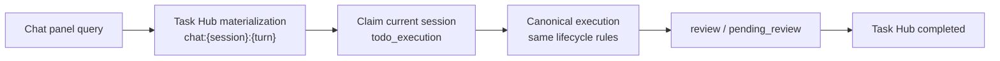

Important invariants:
- Chat tracking exists for lifecycle visibility and repeatability, not as a second execution pipeline.
- The websocket transport can submit either `query` or `execute`; both converge into the same gateway request handling.
- Normal chat tasks default to `interactive_chat` delivery, so the final answer stays in-session unless the user explicitly asked for email delivery.

---

## 4. Priority Classifier (`priority_classifier.py`)

All classification is **deterministic — no LLM calls**. The classifier assigns
one of four priority tiers to inbound tasks:

| Tier | Strategy | Max Wait | When |
|------|----------|----------|------|
| **P0 — Immediate** | `immediate` | 60s | Operator instruction, urgency keywords, active thread reply |
| **P1 — Soon** | `idle_slot` | 300s | Operator feedback, email-derived, due today |
| **P2 — Scheduled** | `scheduled` | 1800s | Has due date, deferral keywords, status updates |
| **P3 — Background** | `heartbeat` | 1800s | Brainstorm candidates, untrusted senders, maintenance |

### Email Priority Classification

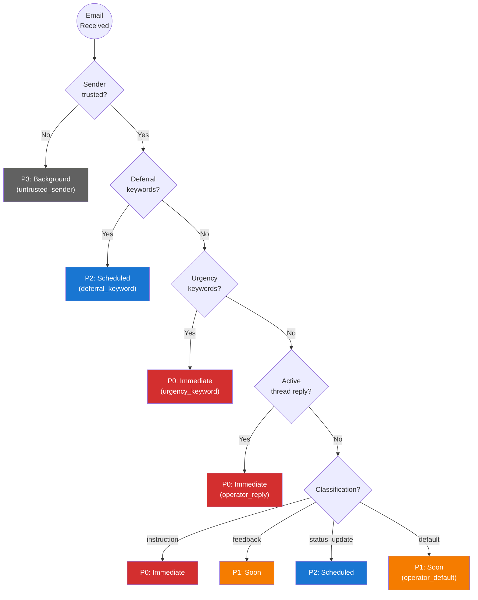

---

## 5. Task Hub Scoring & Dispatch

The Task Hub scores each task to determine dispatch order and eligibility.

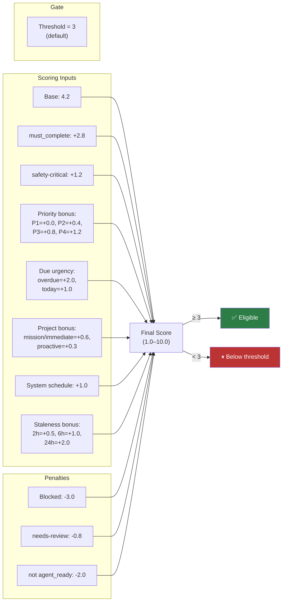

> A standard `agent-ready` task scores 4.2 (base) and is always eligible at the
> default threshold of 3. Scoring influences **dispatch order**, not eligibility.

---

## 6. Dispatch Service (`dispatch_service.py`)

The dispatch service provides four entry points for triggering task execution:

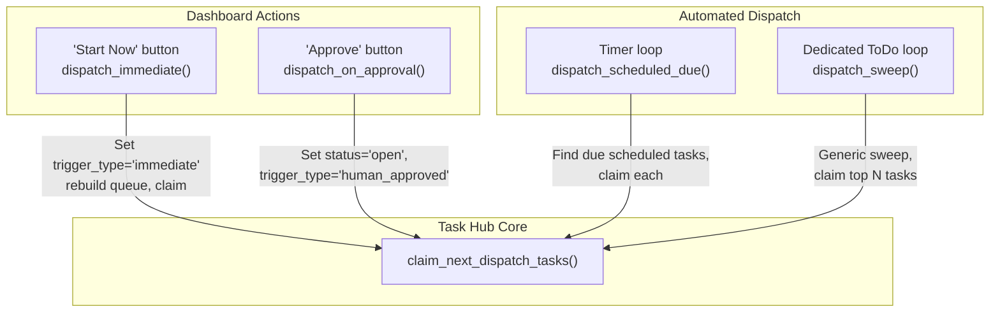

### Dispatch Methods

| Method | Trigger | Agent ID | Description |
|--------|---------|----------|-------------|
| `dispatch_immediate()` | Dashboard "Start Now" | `dashboard` | Sets `trigger_type='immediate'`, rebuilds queue, claims |
| `dispatch_on_approval()` | Dashboard "Approve" | `dashboard` | Transitions review → open + `human_approved`, claims |
| `dispatch_scheduled_due()` | Timer loop | `scheduler` | Finds all tasks whose `due_at` has arrived, claims each |
| `dispatch_sweep()` | Dedicated ToDo dispatcher | `todo:<session_id>` | Generic sweep — claims top N regardless of trigger type, then executes through the shared gateway runner |

---

## 7. Brainstorm Refinement Pipeline

The brainstorm pipeline guides raw ideas through progressive refinement stages
using LLM-assisted analysis:

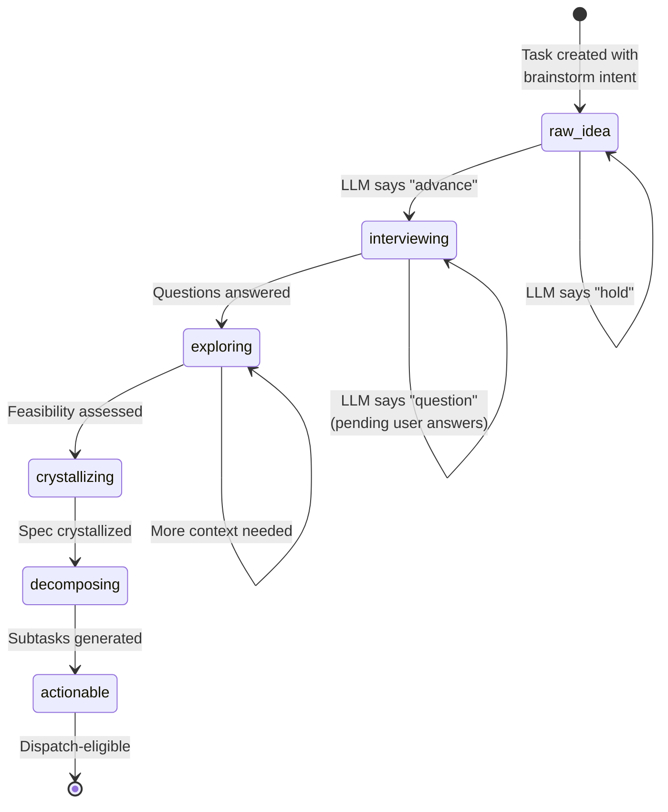

### 7.1 Refinement Agent (`refinement_agent.py`)

Uses Claude to analyze a brainstorm task at its current stage:

| Stage | Focus | LLM Guidance |
|-------|-------|-------------|
| `raw_idea` | Assess clarity | Is the goal clear? Scope defined? Obvious unknowns? |
| `interviewing` | Gather requirements | Generate 2-4 focused, specific questions |
| `exploring` | Assess feasibility | Technical viability, alternatives, challenges |
| `crystallizing` | Consolidate | Clear spec with requirements and constraints |
| `decomposing` | Break down | 2-5 concrete, independently-completable subtasks |

The LLM returns one of three recommendations:
- **`advance`** — Ready for next stage; enriched description applied
- **`question`** — 1-4 clarifying questions enqueued for the user
- **`hold`** — Insufficient context to proceed

### 7.2 Decomposition Agent (`decomposition_agent.py`)

Separately callable from the dashboard to break any task into 2-5 subtasks:

```json
[
  {"title": "Set up authentication middleware", "description": "...", "priority": 3},
  {"title": "Create user profile API endpoint", "description": "...", "priority": 2}
]
```

Subtasks are linked to the parent via `parent_task_id` and auto-complete the
parent when all siblings are done.

---

## 8. Proactive Advisor & Morning Report

### 8.1 Morning Report (`proactive_advisor.py`)

The morning report is a **deterministic** (no LLM) snapshot of Task Hub state,
built each heartbeat cycle and injected into the agent's prompt:

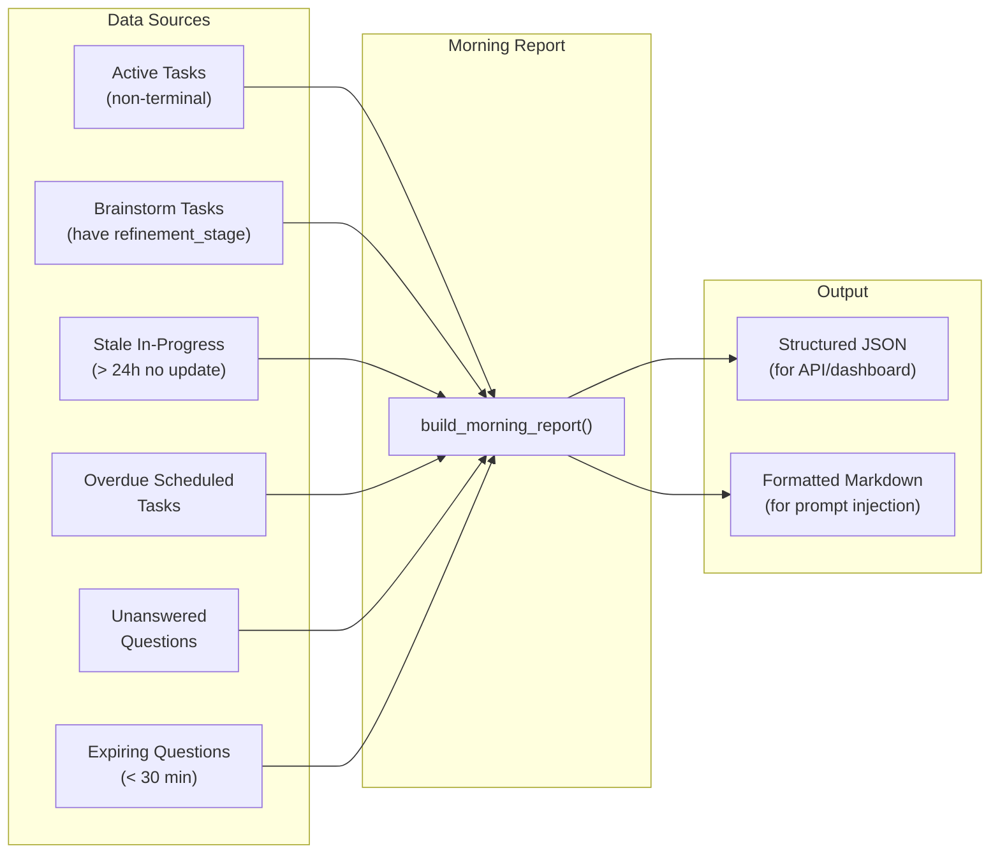

The formatted report includes:
- Active task count
- Brainstorm task table (stage, pending questions, staleness)
- Stale in-progress items (not updated in 24h+)
- Overdue scheduled tasks
- Agent instructions for proactive follow-up

### 8.2 Brainstorm Context Injection

Separately from the morning report, `build_brainstorm_context()` assembles a
focused table of brainstorm tasks with their stages and pending question counts.
This is injected as additional prompt context so the agent can proactively
advance refinement or re-ask expiring questions.

### 8.3 Heartbeat Integration

Both contexts are injected into the heartbeat prompt at execution time:

```python
# heartbeat_service.py (simplified)
brainstorm_ctx = build_brainstorm_context(conn)
brainstorm_text = format_brainstorm_context_prompt(brainstorm_ctx)

report = build_morning_report(conn)
morning_text = report.get("report_text", "")

# Appended to the agent prompt
prompt = f"{base_prompt}\n\n{brainstorm_text}\n\n{morning_text}"
```

---

## 9. Guard Policy — Decision Flowchart

The Guard Policy is the **critical gate** that decides whether a heartbeat cycle
should execute or skip.

```mermaid
flowchart TD
    Start((Heartbeat<br/>Triggered)) --> AutCheck{Autonomous<br/>enabled?}
    AutCheck -- "No (UA_HEARTBEAT_<br/>AUTONOMOUS_ENABLED=0)" --> Skip1[/"SKIP:<br/>autonomous_disabled"/]

    AutCheck -- Yes --> CapCheck{actionable_count<br/>≤ max_actionable?}
    CapCheck -- No --> Skip2[/"SKIP:<br/>actionable_over_capacity"/]

    CapCheck -- Yes --> WorkCheck{Has work?}

    WorkCheck -- "HEARTBEAT.md<br/>has content" --> Proceed✅
    WorkCheck -- "Task Hub<br/>claims available" --> Proceed✅
    WorkCheck -- "System events<br/>pending" --> Proceed✅
    WorkCheck -- "Brainstorm<br/>candidates" --> Proceed✅
    WorkCheck -- "Exec completions<br/>waiting" --> Proceed✅

    WorkCheck -- "None of<br/>the above" --> RefCheck{Reflection<br/>hours?}

    RefCheck -- "Yes + UA_REFLECTION<br/>_ENABLED" --> RefBudget{Nightly<br/>budget left?}
    RefBudget -- Yes --> ReflMode[/"REFLECTION MODE<br/>memory-driven work"/]
    RefBudget -- No --> Skip5[/"SKIP:<br/>nightly_budget_exhausted"/]
    RefCheck -- No --> Skip3[/"SKIP:<br/>no_actionable_work"/]

    ReflMode --> CoolCheck
    Proceed✅ --> CoolCheck{Foreground<br/>cooldown?}
    CoolCheck -- "Active + not<br/>a directed wake" --> Skip4[/"SKIP:<br/>foreground_cooldown"/]
    CoolCheck -- "No / Directed<br/>wake request" --> Execute[/"EXECUTE<br/>heartbeat cycle"/]

    style Proceed✅ fill:#2d7d46,color:#fff
    style Skip1 fill:#b33,color:#fff
    style Skip2 fill:#b33,color:#fff
    style Skip3 fill:#b33,color:#fff
    style Skip4 fill:#b33,color:#fff
    style Skip5 fill:#b33,color:#fff
    style Execute fill:#2d7d46,color:#fff
    style ReflMode fill:#1a5276,color:#fff
```

> [!NOTE]
> **Key fix (2026-03-22):** Before this date, `HEARTBEAT.md` content was NOT
> checked as a work source. The guard skipped every cycle with `no_actionable_work`
> because the Task Hub had nothing, even though `HEARTBEAT.md` contained
> standing instructions. The `has_heartbeat_content` parameter now bypasses this.

---

## 10. Task Lifecycle

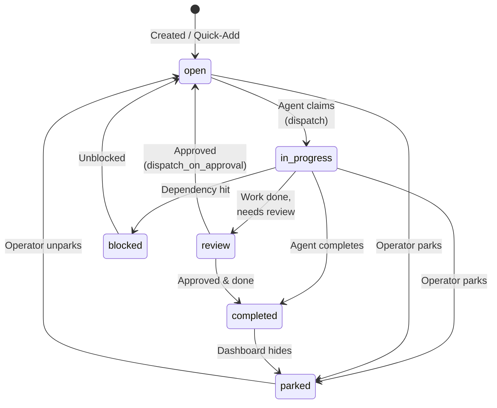

### Terminal vs Non-Terminal States

| Status | Terminal? | Shows on Dashboard? |
|--------|-----------|-------------------|
| `open` | No | ✅ Agent Queue |
| `in_progress` | No | ✅ In Progress panel |
| `review` | No | ✅ Personal Queue (needs human) |
| `blocked` | No | ✅ With block reason |
| `completed` | Yes | ✅ Completed panel (hideable) |
| `parked` | Yes | ❌ Hidden |
| `cancelled` | Yes | ❌ Hidden |

---

## 11. Dashboard API Surface

The Task Hub dashboard exposes a comprehensive REST API through the gateway:

### Task Listing

| Endpoint | Method | Purpose |
|----------|--------|---------|
| `/api/v1/dashboard/todolist/overview` | GET | Summary counts, heartbeat runtime snapshot, and ToDo dispatcher health snapshot |
| `/api/v1/dashboard/todolist/agent-queue` | GET | Queue items plus derived board projection (`board_lane`, assignment/session lineage, review flags) |
| `/api/v1/dashboard/todolist/personal-queue` | GET | Human-attention tasks (review, blocked) |
| `/api/v1/dashboard/todolist/completed` | GET | Completed tasks with session links |
| `/api/v1/dashboard/todolist/email-tasks` | GET | Email-originated tasks with thread context |
| `/api/v1/dashboard/todolist/agent-activity` | GET | Current agent work (in-progress) |
| `/api/v1/dashboard/todolist/dispatch-queue` | GET | Ranked dispatch queue |

### Task Actions

| Endpoint | Method | Purpose |
|----------|--------|---------|
| `/api/v1/dashboard/todolist/tasks` | POST | **Quick-add** a new task |
| `/api/v1/dashboard/todolist/tasks/{id}/action` | POST | Lifecycle action (review, complete, block, park, unblock) |
| `/api/v1/dashboard/todolist/tasks/{id}/dispatch` | POST | **Start Now** — immediate dispatch |
| `/api/v1/dashboard/todolist/tasks/{id}/approve` | POST | **Approve** — approve + dispatch a review task |
| `/api/v1/dashboard/todolist/tasks/{id}/decompose` | POST | LLM decomposition into subtasks |
| `/api/v1/dashboard/todolist/tasks/{id}/complete-subtask` | POST | Complete subtask, auto-complete parent if all done |
| `/api/v1/dashboard/todolist/tasks/{id}/history` | GET | Full assignment history plus email mapping, reconciliation flags, transcript/run-log links |
| `DELETE /api/v1/dashboard/todolist/completed/{id}` | DELETE | Hide a completed task (parks it) |
| `/api/v1/dashboard/todolist/dispatch-queue/rebuild` | POST | Force dispatch queue rebuild |

### Brainstorm & Refinement

| Endpoint | Method | Purpose |
|----------|--------|---------|
| `/api/v1/dashboard/todolist/tasks/{id}/refine` | POST | Trigger LLM refinement cycle |
| `/api/v1/dashboard/todolist/tasks/{id}/refinement-state` | GET | Current stage + history |
| `/api/v1/dashboard/todolist/tasks/{id}/subtasks` | GET | Decomposition tree |
| `/api/v1/dashboard/todolist/tasks/{id}/questions` | GET | Pending clarifying questions |
| `/api/v1/dashboard/todolist/tasks/{id}/answer-question` | POST | Submit user answer |

### Morning Report

| Endpoint | Method | Purpose |
|----------|--------|---------|
| `/api/v1/dashboard/todolist/morning-report` | GET | Deterministic morning snapshot |

The ToDo dashboard also surfaces a dispatcher-health panel derived from the overview payload. That panel is meant to answer operational questions such as:
- Was the last wake targeted at a registered session?
- Did the ToDo driver claim work after waking?
- Was execution deferred by capacity or rejected at admission?
- Are wake requests piling up faster than registered sessions can consume them?

---

## 12. Agent Tools

Agents interact with the Task Hub through **two MCP tools** registered via Claude Agent SDK:

### task_hub_task_action

Lifecycle management for existing tasks:

```python
@tool(name="task_hub_task_action")
async def task_hub_task_action_wrapper(args):
    # Allowed actions: claim, seize, review, complete, block, park,
    # unblock, delegate, approve
    ...
```

| Action | Purpose |
|--------|---------|
| `claim` | Alias for `seize`; safe no-op if the task is already in progress |
| `seize` | Claim an open task for execution |
| `review` | Mark task for human review |
| `complete` | Mark task as completed |
| `block` | Park with blocked reason |
| `park` | Defer without blocking |
| `unblock` | Remove blocked status |
| `delegate` | Assign to VP (reason=vp_id, note=mission_id) |
| `approve` | Sign off on VP-completed task |

**Enforcement rule**: a `todo_execution` turn is only considered valid if it ends with one of these lifecycle mutations. If Simone successfully dispatches a VP mission but forgets `task_hub_task_action(action='delegate', ...)`, the gateway auto-links the returned `mission_id` into Task Hub delegation. Pure prose like “mission queued” with no durable mutation is invalid and the task is reopened or routed to review instead of being left `in_progress` / `seized`. If outbound final-delivery side effects already occurred (for example a draft or sent message exists), retry is suppressed and the task is routed to review instead of being reopened.

**Execution-lane contract**: `todo_execution` work is already claimed before Simone sees it. The prompt explicitly forbids re-triage and blocks hidden Claude meta tools such as `Task`, `TaskStop`, and `Agent` so the runtime stays inside the canonical Task Hub lifecycle instead of drifting into SDK-side task control.

**Hook guardrail**: even if `TaskStop` still appears in model output, the pre-tool guard now resolves the current `run_kind` from durable run state and hard-blocks it in `todo_execution`, `email_triage`, and `heartbeat*` lanes. In general lanes it only passes if the run has prior durable evidence of real SDK `Task`/`Agent` delegation. Block messages are corrective, not just prohibitive.

### task_hub_decompose

Decompose a multi-part task into linked subtasks (non-LLM):

```python
@tool(name="task_hub_decompose")
async def task_hub_decompose_wrapper(args):
    # Splits parent into N linked subtasks with parent_task_id
    # Parent marked as 'decomposed'; auto-completes when all children finish
    ...
```

Use when a single task contains multiple distinct work items that should be
tracked and potentially delegated independently. Input is a JSON array of
subtask objects, each with at minimum `title`, and optionally `description`,
`priority`, and `labels`.

**Note:** This is distinct from `decomposition_agent.py` which uses LLM to
automatically generate subtasks. Use `task_hub_decompose` when you already
know the subtask structure and just need to materialize it.

Both tools are available to Simone and VP agents during execution cycles.

---

## 13. Memory Integration

All memory enhancements are live and wrapped in defensive `try/except` — memory
is advisory, never blocks heartbeat execution.

| Memory Component | Available to Heartbeat? | Used for Proactive Work? |
| --------------- | ---------------------- | ---------------------- |
| `memory_context.py` — recent context | ✅ Built into prompt | ✅ Built into prompt |
| `tools/memory.py` — semantic search | ✅ Agent can call it | ✅ Agent-initiated + auto-injected |
| `check_escalation_memory()` | ✅ Built | ✅ Pre-check before task claim |
| Session rollover capture | ✅ Auto-triggers | ✅ Indexed for dispatch scoring |
| Vector index (ChromaDB) | ✅ Indexed | ✅ Queried during task scoring |

### How Memory Enhances Dispatch

1. **Escalation Pre-Check** — After task claim, queries `check_escalation_memory()` for each task's title. Past failure resolutions are attached as `escalation_history` so the agent doesn't repeat mistakes.

2. **Memory-Informed Scoring** (`task_hub.py` `_memory_relevance_bonus()`) — Searches `MemoryOrchestrator` for the task title. Returns **+0.4 score** and **+0.06 confidence** when relevant institutional memory exists.

3. **Context Injection** — After dispatch, searches memory for each claimed task's title and injects matching snippets (capped at 500 chars each) into `metadata["memory_context_for_tasks"]`.

---

## 14. Feature Flags & Configuration

| Flag | Default | Purpose |
|------|---------|---------| 
| `UA_ENABLE_HEARTBEAT` | **ON** (True) | Master switch for heartbeat service |
| `UA_ENABLE_CRON` | **ON** (True) | Master switch for cron service |
| `UA_HEARTBEAT_EXEC_TIMEOUT` | **1600s** | Max execution time per heartbeat turn |
| `UA_HEARTBEAT_MAX_RETRY_BACKOFF_SECONDS` | **3600s** | Max backoff between retries |
| `UA_TASK_AGENT_THRESHOLD` | **3** | Score threshold for dispatch eligibility |
| `UA_HEARTBEAT_AUTONOMOUS_ENABLED` | 1 | Kill switch for autonomous runs |
| `UA_HEARTBEAT_INTERVAL` | 1800 | Interval between heartbeat cycles (seconds) |
| `UA_REFLECTION_ENABLED` | follows `UA_HEARTBEAT_AUTONOMOUS_ENABLED` | Master toggle for overnight reflection engine |
| `UA_REFLECTION_START_HOUR` | 22 | Start of overnight reflection window (24h local time) |
| `UA_REFLECTION_END_HOUR` | 7 | End of overnight reflection window (24h local time) |
| `UA_REFLECTION_MAX_NIGHTLY_TASKS` | 10 | Maximum tasks an agent may work on per night |

---

## 15. Implementation Map

### Core Pipeline Files

| File | Role |
|------|------|
| [`heartbeat_service.py`](../../src/universal_agent/heartbeat_service.py) | Orchestrator: scheduling, guard policy, prompt composition, retry queue, Task Hub claims, proactive advisor injection |
| [`task_hub.py`](../../src/universal_agent/task_hub.py) | Scoring, dispatch queue, claim/finalize lifecycle, staleness bonus, brainstorm stage tracking, question queue |
| [`dispatch_service.py`](../../src/universal_agent/services/dispatch_service.py) | Four dispatch entry points: immediate, approval, scheduled, sweep |
| [`proactive_advisor.py`](../../src/universal_agent/services/proactive_advisor.py) | Morning report builder, brainstorm context assembler (deterministic, no LLM) |
| [`priority_classifier.py`](../../src/universal_agent/services/priority_classifier.py) | Deterministic P0-P3 priority classification for emails and tasks |
| [`email_task_bridge.py`](../../src/universal_agent/services/email_task_bridge.py) | Email → Task Hub materialization, thread dedup, HEARTBEAT.md append |
| [`reflection_engine.py`](../../src/universal_agent/services/reflection_engine.py) | Overnight autonomous work generator — time windows, budget tracking, memory-driven context assembly |
| [`refinement_agent.py`](../../src/universal_agent/services/refinement_agent.py) | LLM-powered brainstorm refinement (6-stage progression) |
| [`decomposition_agent.py`](../../src/universal_agent/services/decomposition_agent.py) | LLM-powered task decomposition into 2-5 subtasks |
| [`task_hub_bridge.py`](../../src/universal_agent/tools/task_hub_bridge.py) | Agent-facing MCP tools: `task_hub_task_action` (lifecycle), `task_hub_decompose` (split into subtasks) |
| [`feature_flags.py`](../../src/universal_agent/feature_flags.py) | `heartbeat_enabled()`, `cron_enabled()` — master switches |

### Memory Files

| File | Role |
|------|------|
| [`memory/orchestrator.py`](../../src/universal_agent/memory/orchestrator.py) | Canonical memory broker: write, search, session sync, rollover |
| [`memory/memory_context.py`](../../src/universal_agent/memory/memory_context.py) | Token-budgeted context builder from recent entries |
| [`memory/memory_store.py`](../../src/universal_agent/memory/memory_store.py) | Persistent storage with vector indexing |
| [`tools/memory.py`](../../src/universal_agent/tools/memory.py) | Agent-facing `memory_get` and `memory_search` tools |

### Dashboard / API Files

| File | Role |
|------|------|
| [`gateway_server.py`](../../src/universal_agent/gateway_server.py) | All `/api/v1/dashboard/todolist/*` endpoints (lines 16251–16936) |
| [`web-ui/app/dashboard/todolist/page.tsx`](../../web-ui/app/dashboard/todolist/page.tsx) | Task Hub Dashboard — Kanban UI, glassmorphism design, client-side rendering |

### Key Functions and Classes

| Function/Class | Location | Purpose |
|---------------|----------|---------| 
| `HeartbeatService` | `heartbeat_service.py` | Main service class — manages daemon heartbeat loops |
| `_heartbeat_guard_policy()` | `heartbeat_service.py` | Decision gate: skip or execute? |
| `_run_heartbeat()` | `heartbeat_service.py` | Executes a single heartbeat cycle |
| `score_task()` | `task_hub.py` | Computes 1.0–10.0 score with staleness bonus |
| `claim_next_dispatch_tasks()` | `task_hub.py` | Atomically claims top-scoring eligible task |
| `finalize_assignments()` | `task_hub.py` | Post-execution: mark complete/review/reopen |
| `perform_task_action()` | `task_hub.py` | Lifecycle transitions (complete, block, park, etc.) |
| `dispatch_immediate()` | `dispatch_service.py` | Dashboard "Start Now" handler |
| `dispatch_sweep()` | `dispatch_service.py` | Dedicated ToDo dispatcher claim path |
| `build_morning_report()` | `proactive_advisor.py` | Deterministic morning snapshot for prompts |
| `build_brainstorm_context()` | `proactive_advisor.py` | Brainstorm task context for prompts |
| `classify_email_priority()` | `priority_classifier.py` | Deterministic email → P0-P3 |
| `is_reflection_hours()` | `reflection_engine.py` | Checks if current time is within overnight window |
| `build_reflection_context()` | `reflection_engine.py` | Assembles memory, completions, brainstorms into prompt |
| `has_nightly_budget()` | `reflection_engine.py` | Checks if agent task budget is not exhausted |
| `refine_with_llm()` | `refinement_agent.py` | Claude-powered brainstorm stage advancement |
| `decompose_with_llm()` | `decomposition_agent.py` | Claude-powered task breakdown |
| `EmailTaskBridge.materialize()` | `email_task_bridge.py` | Email → Task Hub entry |
| `MemoryOrchestrator` | `memory/orchestrator.py` | Unified memory read/write/search |

---

## 16. All Proactive Entry Points

The system has **11 distinct ways** that tasks reach agents for proactive execution.
These are central to understanding how the system operates autonomously.

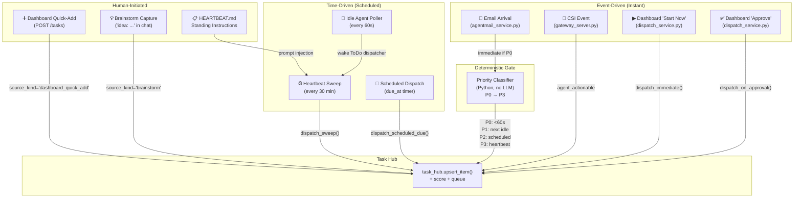

### Entry Point Reference Table

| # | Entry Point | Trigger | Latency | Source File |
|---|------------|---------|---------|-------------|
| 1 | **Heartbeat Sweep** | Timer (every 30 min) | ≤30 min | `heartbeat_service.py` + `dispatch_service.py` |
| 2 | **Email Arrival** | Inbound AgentMail | <60s (P0) | `agentmail_service.py` + `email_task_bridge.py` |
| 3 | **Dashboard Quick-Add** | Human types task | Next sweep | `gateway_server.py:16721` |
| 4 | **Dashboard "Start Now"** | Human clicks button | Immediate | `dispatch_service.py:dispatch_immediate()` |
| 5 | **Dashboard "Approve"** | Human approves review task | Immediate | `dispatch_service.py:dispatch_on_approval()` |
| 6 | **Scheduled Dispatch** | `due_at` timestamp arrives | At scheduled time | `dispatch_service.py:dispatch_scheduled_due()` |
| 7 | **Idle Agent Poller** | Background loop (60s) | ≤60s | `idle_dispatch_loop.py` |
| 8 | **CSI Event Bridge** | Signal intelligence event | Next sweep | `gateway_server.py` (CSI handler) |
| 9 | **Brainstorm Capture** | User says "idea: ..." in chat | Starts refinement | `gateway_server.py` (system command) |
| 10 | **HEARTBEAT.md Instructions** | Standing instructions file | Each heartbeat cycle | `heartbeat_service.py` |
| 11 | **Priority Classifier** | Deterministic Python gate | N/A (inline) | `priority_classifier.py` |

### How They Compose

- **Email → Fast Path**: Email arrives → EmailTaskBridge materializes → PriorityClassifier assigns P0 → `_try_immediate_dispatch()` wakes the agent immediately (no 30-min wait)
- **Brainstorm → Slow Path**: User captures idea → 6-stage refinement → eventually `actionable` → scored and enqueued → heartbeat sweep claims it
- **CSI → Background Path**: Signal detected → task created with `source_kind='csi'` → scored at P3 → picked up by next heartbeat sweep
- **Standing Instructions**: `HEARTBEAT.md` content is read each cycle and injected into the agent prompt — no Task Hub entry, purely prompt-driven

---

## 17. Development Timeline

The Task Hub / Proactive Pipeline was built across **two phase systems** over March 2026:

### Phase System A: Todoist → Task Hub Migration (March 8–21)

| Phase | Description | Key Commits | Date |
|-------|------------|-------------|------|
| **Pre-1** | Internal To-Do command center cutover | `da9e41f1` | Mar 8 |
| **1–5** | Todoist subtasks, email task bridge, autonomous execution, MCP integration | `b1536bc2`, `8dcadb00` | Mar 20 |
| **6** | Email-to-Task Pipeline (labels, waiting-on-reply, auto-reactivation) | `8dcadb00` | Mar 20 |
| **7A** | Priority Classifier (`priority_classifier.py`) | `81060ecf` | Mar 21 |
| **7B** | Immediate email dispatch | `81060ecf` | Mar 21 |
| **7C** | Busy signal + ETA notification | `81060ecf` | Mar 21 |
| **7D** | Idle Agent Poller (`idle_dispatch_loop.py`) | `81060ecf` | Mar 21 |
| **7E** | Agent qualification routing | ⚠️ Deferred | — |

### Phase System B: Task Hub Pipeline Build (March 26, Sequential)

| Phase | Description | Key Commit | Time |
|-------|------------|-----------|------|
| **1** | Todoist decommission + Task Hub schema extension | `d94d4bc9` | 10:12 AM |
| **2** | Purge all Todoist legacy code + schema tests | `c295ff91` | 10:40 AM |
| **3** | Multi-trigger dispatch service (4 entry points) | `8d7e936d` | 11:06 AM |
| **4** | Decomposition pipeline (LLM subtask generation) | `b6534d22` | 11:22 AM |
| **5** | Brainstorm refinement + Proactive advisor (morning report) | `30ffb8d0`, `44e31db2` | 11:34–11:50 AM |
| **6** | Dashboard UX/UI redesign (Tailwind, glassmorphism, quick-add, morning report banner) | `c60a890f`, `42b3fe8e` | 12:29–3:15 PM |

---

## 18. Roadmap — Planned but Not Yet Implemented

> [!WARNING]
> The following features were designed or discussed during the Phase 1–7 development
> but have not yet been implemented.

### 18.1 Overnight Autonomous Work ✅ IMPLEMENTED

**Concept**: When no actionable tasks exist in the Task Hub, Simone should review her memories, missions, and brainstorm ideas during quiet hours and independently advance or create work.

**Implementation**: The **Reflection Engine** (`services/reflection_engine.py`) provides this capability:

- **Time-window gating** (`is_reflection_hours()`): Default 10 PM – 7 AM, configurable via `UA_REFLECTION_START_HOUR` / `UA_REFLECTION_END_HOUR`
- **Guard policy integration**: When the dispatch queue is empty AND it's within the overnight window, the guard policy sets `reflection_mode=True` instead of `skip_reason="no_actionable_work"`
- **Memory-driven context**: `build_reflection_context()` queries the Memory Orchestrator for goals/missions, finds stalled brainstorms (>24h), and reviews recent completions for pattern awareness
- **Budget tracking**: `has_nightly_budget()` enforces a per-night task cap (default: 10) stored in `task_hub_settings`, auto-resets each calendar day
- **Safety guardrails**: The reflection prompt explicitly forbids production deployments, data deletion, external emails, and breaking API changes
- **Prompt injection**: Reflection context is appended to the heartbeat prompt, giving the agent structured overnight mission context

**Key files**: `services/reflection_engine.py`, modified `heartbeat_service.py` (guard policy + prompt injection)
**Tests**: `test_reflection_engine.py` (31 cases)

### 18.2 Active Morning Report Push (7 AM Email) ✅ IMPLEMENTED

**Status**: Implemented. The `MorningReportSender` service sends a daily digest email via AgentMail.

**Architecture**:

- **Service**: `services/morning_report_sender.py` — Pure Python, no LLM calls
- **Trigger**: Checked on every heartbeat tick (~30 min interval); fires when `now.hour == 7` (configurable via `UA_MORNING_REPORT_HOUR`)
- **Dedup guard**: `_LAST_REPORT_SENT_KEY` in `task_hub_settings` ensures only one email per calendar day
- **Recipient resolution**: `UA_MORNING_REPORT_EMAIL` → `UA_PRIMARY_EMAIL` → `UA_NOTIFICATION_EMAIL` fallback chain
- **Feature flag**: `UA_MORNING_REPORT_ENABLED` (defaults to following `UA_HEARTBEAT_AUTONOMOUS_ENABLED`)

**Email content sections**:

1. **🌙 Overnight Autonomous Activity** — Reflection cycles used, tasks completed/created overnight
2. **📋 Task Hub State** — Active count, open queue, in-progress, unanswered questions
3. **💡 Brainstorm Pipeline** — Stage status, stale flags, pending interview questions
4. **⚠️ Attention Needed** — Stalled brainstorms, stale in-progress tasks
5. **📊 Dashboard link** — Direct link to `/dashboard/todolist`

**Delivery**: Three complementary channels:

1. ☀️ **AgentMail push** (7 AM) — `MorningReportSender.send_if_due()` fires during heartbeat tick
2. 🤖 **Heartbeat prompt injection** — First tick of the day includes report in agent context
3. 🖥️ **Dashboard banner** — `GET /api/v1/dashboard/todolist/morning-report`

**Key files**: `services/morning_report_sender.py`, modified `heartbeat_service.py` (trigger hook)
**Tests**: `test_morning_report_sender.py` (29 cases)

### 18.3 Calendar → Task Bridge ✅ IMPLEMENTED

**Concept**: Calendar events are materialized as Task Hub entries so that calendar-driven deadlines and events automatically feed into the proactive dispatch pipeline.

**Implementation** (`services/calendar_task_bridge.py`):

- **`CalendarTaskBridge`** — Pure-Python service (no LLM calls) that converts upcoming Google Calendar events into dispatchable tasks.

- **Deduplication**: Each calendar event ID maps to a deterministic `task_id` (`cal:{sha256[:16]}`). Re-syncs update the existing task's title/time via Task Hub UPSERT semantics.

- **Due-at scheduling**: Tasks are due `lead_minutes` (default: 30) before the event starts, ensuring prep work is dispatched before the meeting.

- **Priority classification** (deterministic, no LLM):
  - **P1**: Keywords like `urgent`, `deadline`, `ASAP`, `critical`, `blocker`
  - **P2**: Normal meetings/events (default)
  - **P3**: `optional`, `FYI`, `tentative`, `social`, `lunch`

- **Content sanitization** (security boundary, following the email triage agent pattern):
  - Calendar event descriptions from shared invites are untrusted external input.
  - Known prompt-injection patterns are detected and `[REDACTED]`: "ignore previous instructions", `system prompt:`, backtick commands, `$(...)` shell injection, etc.
  - Excessively long descriptions (>2000 chars) are truncated.
  - All materialized tasks carry `content_sanitized: true` in metadata.

- **Organizer trust**: Kevin's 3 known addresses are marked `organizer_trusted: true` in task metadata — matching the email handler's trusted-sender model.

- **Task Hub entry format**:
  - `source_kind='calendar'`, `source_ref='gcal_event:{event_id}'`
  - `trigger_type='scheduled'`, `labels=['calendar-task', 'agent-ready']`
  - Rich description with location, attendees, and time info

- **Lifecycle management**: `mark_completed()`, `mark_cancelled()`, `expire_past_events(hours_past=2)` for automated cleanup.

- **Feature flag**: `UA_CALENDAR_BRIDGE_ENABLED` (default: `false` — opt-in)

| Env Variable | Default | Purpose |
|---|---|---|
| `UA_CALENDAR_BRIDGE_ENABLED` | `false` | Enable/disable calendar → task materialization |

### 18.4 Simone-First Orchestration ✅ REPLACING LEGACY ROUTER

> [!WARNING]
> **The legacy `qualify_agent()` keyword router is being retired.**
> See `01_Architecture/05_Simone_First_Orchestration.md` for the full
> architectural rationale and implementation plan.

**Concept**: All tasks route to Simone. She evaluates the full queue, picks her own task,
and delegates overflow to VP agents (Atlas, Codie) when she's busy. No task completes
without her sign-off.

**Legacy** (`services/agent_router.py` — being retired):

- `qualify_agent()` used deterministic keyword/label matching to pre-route tasks
- This bypassed Simone's reasoning capabilities and created brittle routing
- `UA_AGENT_ROUTING_ENABLED` was never enabled in production (default: `false`)

**New model** (Simone-First):

- **Batch triage**: Simone sees all eligible tasks (up to 5) and triages each:
  `SELF` / `DELEGATE_ATLAS` / `DELEGATE_CODIE` / `DEFER`
- **Simone is the primary executor**: she works the most complex tasks herself
- **VPs are overflow capacity**: delegated via `vp_dispatch_mission` when Simone is busy
- **Sign-off required**: VP-completed tasks go to `pending_review` until Simone approves
- **Triage logging**: every delegation decision is recorded in Task Hub metadata

**New statuses**: `delegated` (VP working), `pending_review` (VP done, awaiting sign-off)

### 18.5 Automated Refinement-to-Decomposition Loop ✅ IMPLEMENTED

**Concept**: Brainstorm tasks should automatically progress through refinement stages without human intervention. When a task reaches the `decomposing` stage, subtasks should be auto-generated and the parent advanced to `actionable`.

**Implementation** (`services/auto_refinement_loop.py`):

- **`find_refinement_candidates(conn)`** — Scans for brainstorm tasks at processable stages (`raw_idea`, `interviewing`, `exploring`, `crystallizing`, `decomposing`) in `open` status.
  - Filters by cooldown (per-task, configurable window)
  - Orders by priority → creation date (FIFO within same priority)

- **`refine_task(conn, task_id)`** — Single-task refinement using `refine_with_llm()`:
  - **advance**: Moves to next stage, auto-decomposes if reaching `decomposing`
  - **question**: Appends questions to the task's question queue
  - **hold**: Records reasoning, no state change

- **`run_auto_refinement_cycle(conn)`** — Batch runner (called from heartbeat tick):
  - Feature-gated by `UA_AUTO_REFINEMENT_ENABLED`
  - Budget-limited by `UA_AUTO_REFINEMENT_MAX_PER_CYCLE`
  - Error-isolated (one task failure doesn't affect others)

- **Auto-decomposition chain**: When refinement advances a task to `decomposing`:
  1. `decompose_with_llm()` generates subtask specs
  2. `task_hub.decompose_task()` creates subtasks
  3. `task_hub.advance_refinement()` advances parent to `actionable`
  4. Notification recorded for dashboard/morning report

| Env Variable | Default | Purpose |
|---|---|---|
| `UA_AUTO_REFINEMENT_ENABLED` | `false` | Enable autonomous refinement loop |
| `UA_AUTO_REFINEMENT_MAX_PER_CYCLE` | `3` | Max tasks refined per heartbeat cycle |
| `UA_AUTO_REFINEMENT_COOLDOWN_MINUTES` | `30` | Min time between refinement attempts on same task |

**Key files**: `services/auto_refinement_loop.py`
**Tests**: `test_auto_refinement_loop.py` (28 cases), `test_integration_flows.py` (13 cases)

### 18.6 Completion Feedback Loop ✅ IMPLEMENTED

**Concept**: When an agent finishes a task, the system should immediately process the next queued task instead of waiting for the next polling cycle (up to 60s delay).

**Implementation** (in `heartbeat_service.py`):

- After `finalize_assignments()` succeeds with completed tasks, immediately calls `request_heartbeat_next(session_id, reason=...)`.
- Reduces inter-task latency from ~60s (idle poll) to near-zero.
- Non-fatal: wrapped in `try/except` to never break the finalization path.
- Traceable via `completion_feedback:{N}_done` reason in heartbeat logs.

This creates a **chained execution model**: `Task A completes → immediate wake → claim Task B → ...`

**Key files**: Modified `heartbeat_service.py`
**Tests**: `test_integration_flows.py::TestFlow3_CompletionFeedback` (2 cases)

### 18.7 Capacity Governor ✅ IMPLEMENTED

**Concept**: The system needs to handle API rate limits gracefully by throttling dispatch-level work when the LLM provider returns 429/overloaded errors. Without this, the heartbeat would keep dispatching new agent executions, compounding the overload.

**Implementation** (`services/capacity_governor.py`):

- **`CapacityGovernor`** — Singleton, system-wide capacity manager:
  - `can_dispatch()` — Pre-flight check: returns `(False, reason)` if in backoff or all slots full
  - `acquire_slot(context)` — Async context manager for slot acquisition with 5s timeout
  - `report_rate_limit(context, error)` — 429 detection, triggers exponential backoff with jitter
  - `report_success(context)` — Decays consecutive failure counter, clears backoff when counter hits 0
  - `snapshot_dict()` — For dashboards: active_slots, backoff_remaining, total_shed, etc.

- **Backoff strategy**:
  - Exponential: `base * 2^(consecutive-1)`, capped at `backoff_max`
  - Jitter: 10-30% random noise to prevent thundering herd
  - Minimum cooldown: `cooldown_after_429` (default: 60s)
  - Consecutive tracking: 429s within 120s of each other count as the same incident

- **Integration points**:

  | Location | Hook | Purpose |
  |----------|------|---------|
  | `todo_dispatch_service.py` | `can_dispatch()` before `dispatch_sweep()` | Skip ToDo claiming when at capacity |
  | `auto_refinement_loop.py` | `can_dispatch()` before refinement cycle | Defer LLM work under pressure |
  | `refinement_agent.py` | `report_rate_limit()` in error handler | Feed 429s into backoff |
  | `decomposition_agent.py` | `report_rate_limit()` in error handler | Feed 429s into backoff |
  | `heartbeat_service.py` | `report_rate_limit()` in execution error handler | Feed 429s from Simone into backoff |
  | `vp/worker_loop.py` | `report_rate_limit()` in VP worker loop | Feed 429s from VP (Coder/Generalist) runs into backoff |

- **Graceful degradation**: If the governor module fails to import (e.g., upgrade-in-progress), all callers fall through to their default behavior — the governor is **additive, not blocking**.

| Env Variable | Default | Purpose |
|---|---|---|
| `UA_CAPACITY_MAX_CONCURRENT` | `2` | Max parallel agent executions |
| `UA_CAPACITY_BACKOFF_BASE_SECONDS` | `30` | Initial backoff duration on 429 |
| `UA_CAPACITY_BACKOFF_MAX_SECONDS` | `300` | Maximum backoff cap (5 min) |
| `UA_CAPACITY_COOLDOWN_AFTER_429_SECONDS` | `60` | Mandatory cooldown per 429 incident |

**Key files**: `services/capacity_governor.py`, modified `heartbeat_service.py`, `auto_refinement_loop.py`, `refinement_agent.py`, `decomposition_agent.py`
**Tests**: `test_capacity_governor.py` (14 cases)

---

## 19. Test Coverage Matrix

The proactive pipeline has extensive unit test coverage across **15 test modules** validating every layer from schema primitives to end-to-end heartbeat integration.

### Core Task Hub Tests

| Test Module | Cases | Scope |
|-------------|-------|-------|
| `test_task_hub_lifecycle.py` | ~30 | CRUD, status transitions (`open → in_progress → review → completed`), assignment finalization, stale detection, scoring heuristics, `perform_task_action()` lifecycle |
| `test_task_hub_schema_extensions.py` | 18 | Comments (CRUD, scoping, limits), question queue (enqueue/answer/expiry), subtask decomposition (parent→child hierarchy, custom IDs, progress tracking, tree traversal, depth limits), refinement lifecycle (stage advancement, invalid stage rejection), `trigger_type` defaults, `parent_task_id` column |
| `test_task_hub_bridge.py` | 2 | MCP tool wiring — `task_hub_task_action` (lifecycle actions), `task_hub_decompose` (subtask creation from JSON) |

### Dispatch Layer Tests

| Test Module | Cases | Scope |
|-------------|-------|-------|
| `test_dispatch_service.py` | 6 | All four dispatch entry points: `immediate` (nonexistent/completed guard), `on_approval` (transition + claim), `scheduled_due` (empty/due filtering), `sweep` (heartbeat drop-in) |
| `test_gateway_dispatch_endpoints.py` | 5 | REST API wiring for dispatch endpoints — `DispatchError` propagation, approval transitions, scheduled timer filtering |
| `test_trigger_type_queue_priority.py` | 5 | Queue sort-key ranking (`immediate` > `heartbeat_poll` > `scheduled`), trigger_type claim filtering, `None` filter returns all, upsert preserves trigger_type |
| `test_scheduled_dispatch.py` | 5 | `list_due_scheduled_tasks()` — past-due inclusion, future exclusion, non-scheduled exclusion, non-open exclusion, ordering by `due_at` |

### Advisor & Refinement Tests

| Test Module | Cases | Scope |
|-------------|-------|-------|
| `test_proactive_advisor.py` | 8 | `build_morning_report()` deterministic assembly, `build_brainstorm_context()` filtering, empty-state handling, staleness detection, overdue scheduled task reporting |
| `test_refinement.py` | 10 | LLM-driven brainstorm refinement — stage progression (`raw_idea → interviewing → scoped → actionable`), question queue integration, notification deduplication, error handling |
| `test_decomposition.py` | 8 | LLM-driven task decomposition — subtask creation, parent auto-completion when all siblings finish, progress tracking, depth-limited tree traversal |

### Auto-Refinement & Integration Tests

| Test Module | Cases | Scope |
|-------------|-------|-------|
| `test_auto_refinement_loop.py` | 28 | Candidate scanning (5), single-task refinement with advance/question/hold outcomes (8), decomposition chain (4), batch cycle with budget/cooldown/feature-flag (6), error isolation (3), LLM-based reasoning integration (2) |
| `test_integration_flows.py` | 13 | End-to-end flows: full refinement→decomposition pipeline (4), email→triage→task materialization (3), completion feedback wake (2), concurrent refinement budget enforcement (2), mixed-source pipeline (2) |

### Capacity Governor Tests

| Test Module | Cases | Scope |
|-------------|-------|-------|
| `test_capacity_governor.py` | 14 | Singleton lifecycle (4), slot acquisition and limiting (3), 429 backoff trigger/escalation/recovery (4), shed counter tracking (1), module-level convenience functions (2) |

### General Integration Tests

| Test Module | Cases | Scope |
|-------------|-------|-------|
| `test_email_task_bridge.py` | 15+ | Email materialization — thread deduplication, lineage tracking, priority classification integration, ActionEmailBridge vs EmailTaskBridge routing, attachment handling |
| `test_heartbeat_task_hub_claims.py` | 1 | End-to-end heartbeat → Task Hub integration: verifies `claim_next_dispatch_tasks()` → agent execution → `finalize_assignments()` with `policy="heartbeat"` and retry semantics |

### Reflection Engine Tests

| Test Module | Cases | Scope |
|-------------|-------|-------|
| `test_reflection_engine.py` | 31 | Time window boundary cases (8), feature flag combinations (5), nightly budget lifecycle (5), Task Hub context queries (5), prompt formatting (3), full context build (1), guard policy integration (4) |
| `test_morning_report_sender.py` | 29 | Time-window and dedup logic (6), feature flag combinations (4), recipient resolution (4), sent tracking (2), overnight activity queries (2), email body/subject formatting (4), integration tests (7) |

### Agent Routing Tests

| Test Module | Cases | Scope |
|-------------|-------|-------|
| `test_agent_router.py` | 37 | Label-based routing (11), keyword heuristics (8), project-key routing (3), source-kind routing (2), agent availability fallback (3), feature flag (3), batch routing (3), edge cases (4) |

### Calendar Task Bridge Tests

| Test Module | Cases | Scope |
|-------------|-------|-------|
| `test_calendar_task_bridge.py` | 57 | Deterministic task ID (4), content sanitization / prompt-injection defense (8), priority classification (11), organizer trust (6), event time parsing (5), feature flag (3), event materialization (11), batch materialization (3), query filtering (2), lifecycle management (4), schema idempotency (1) |

### Running the Test Suite

```bash
# Run all proactive pipeline tests
uv run pytest tests/unit/test_task_hub_*.py tests/unit/test_dispatch_*.py \
    tests/unit/test_proactive_advisor.py tests/unit/test_refinement.py \
    tests/unit/test_decomposition.py tests/unit/test_email_task_bridge.py \
    tests/unit/test_heartbeat_task_hub_claims.py \
    tests/unit/test_trigger_type_queue_priority.py \
    tests/unit/test_scheduled_dispatch.py \
    tests/unit/test_gateway_dispatch_endpoints.py \
    tests/test_auto_refinement_loop.py \
    tests/test_integration_flows.py \
    tests/test_capacity_governor.py -v

# Quick smoke test (core lifecycle + dispatch only)
uv run pytest tests/unit/test_task_hub_lifecycle.py tests/unit/test_dispatch_service.py -v

# Phase 5-7 tests only (auto-refinement, integration, capacity)
uv run pytest tests/test_auto_refinement_loop.py \
    tests/test_integration_flows.py \
    tests/test_capacity_governor.py -v

# Reflection engine tests
uv run pytest tests/test_reflection_engine.py -v
```

---

## 20. Related Documentation

| Document | Scope |
|----------|-------|
| [Task Hub Dashboard](Task_Hub_Dashboard.md) | Frontend design system, component architecture, API integration |
| [Heartbeat Service](Heartbeat_Service.md) | Cycle mechanics, JSON findings schema, repair pipeline, mediation flow |
| [Memory System](Memory_System.md) | Tiered memory architecture, auto-flush |
| [Email Architecture](../../docs/03_Operations/82_Email_Architecture_And_AgentMail_Source_Of_Truth_2026-03-06.md) | AgentMail identity, triage→Simone architecture |
| [CSI Architecture](../../docs/03_Operations/92_CSI_Architecture_And_Operations_Source_Of_Truth_2026-03-06.md) | CSI ingester runtime, delivery contract |
| [Heartbeat Issue Mediation](../../docs/03_Operations/95_Heartbeat_Issue_Mediation_And_Auto_Triage_2026-03-12.md) | Non-OK heartbeat auto-investigation |
