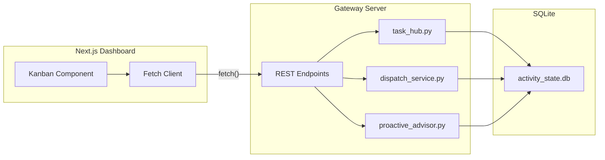

# Task Hub Dashboard

> **Canonical source of truth** for the Task Hub Dashboard frontend — design system, component architecture, API integration, and Kanban UX patterns.
>
> **Last updated:** 2026-03-30 — dispatcher health, canonical execution forensics, delivery-mode visibility, and role-separated heartbeat vs ToDo execution semantics documented.

---

## 1. Overview

The Task Hub Dashboard is the primary UI for managing proactive tasks within Universal Agent. It is the in-house Kanban control surface for Task Hub, built as a Next.js client-side component consuming Python backend APIs.

**Key design principles:**
- **Glassmorphism-first**: All panels use `glass`/`tactical-panel` CSS classes with backdrop blur and translucent backgrounds
- **KCD Design System**: Strict adherence to the `kcd-*` Tailwind color palette (see `tailwind.config.ts`)
- **Responsive**: Stacking columns on `< md` breakpoints
- **Real-time awareness**: Polling-based data refresh with optimistic UI updates

---

## 2. File Map

| File | Purpose |
|------|---------|
| `web-ui/app/dashboard/todolist/page.tsx` | Main dashboard component (`"use client"`) — Kanban board, task cards, filters, lifecycle actions |
| `web-ui/app/globals.css` | KCD design tokens, glassmorphism utilities, tactical panel styles |
| `web-ui/tailwind.config.ts` | `kcd-*` color palette configuration |
| `src/universal_agent/gateway_server.py` | Backend API endpoints consumed by the dashboard |
| `src/universal_agent/task_hub.py` | Core Task Hub data layer (SQLite) |
| `src/universal_agent/services/dispatch_service.py` | Dispatch logic for "Start Now" / approval / scheduled tasks |

---

## 3. Design System

### 3.1 Color Palette (`kcd-*`)

The dashboard exclusively uses the `kcd-*` Tailwind palette defined in `tailwind.config.ts`:

| Token | Value | Usage |
|-------|-------|-------|
| `kcd-bg` | `#0a0e17` | Page background |
| `kcd-surface` | `#111827` | Card/panel backgrounds |
| `kcd-surface-alt` | `#1a2332` | Elevated surfaces, hover states |
| `kcd-border` | `#1e293b` | Panel borders |
| `kcd-text` | `#e2e8f0` | Primary text |
| `kcd-text-muted` | `#94a3b8` | Secondary/label text |
| `kcd-accent` | `#38bdf8` | Primary accent (links, focus rings) |
| `kcd-accent-hover` | `#7dd3fc` | Accent hover state |
| `kcd-success` | `#22c55e` | Success states, completed tasks |
| `kcd-warning` | `#f59e0b` | Warning states, medium priority |
| `kcd-error` | `#ef4444` | Error/critical states, high priority |

### 3.2 Glassmorphism Utilities

Defined in `globals.css`:

```css
.glass {
  background: rgba(17, 24, 39, 0.6);
  backdrop-filter: blur(12px);
  border: 1px solid rgba(56, 189, 248, 0.1);
}

.tactical-panel {
  background: rgba(17, 24, 39, 0.8);
  backdrop-filter: blur(16px);
  border: 1px solid rgba(30, 41, 59, 0.6);
  border-radius: 0.75rem;
}
```

### 3.3 Typography

- **Font stack**: Inter (via Google Fonts) with system fallbacks
- **Headings**: `font-semibold` or `font-bold` depending on hierarchy
- **Body**: `text-sm` (14px) for card content, `text-xs` (12px) for metadata

---

## 4. Component Architecture

### 4.1 Page Structure

```
page.tsx ("use client")
├── Header Bar (title + filter controls)
├── Quick-Add Input Bar (planned: Phase 6b)
├── Morning Report Banner (planned: Phase 6c)
└── Kanban Board
    ├── Column: Not Assigned (derived lane: `not_assigned`)
    ├── Column: In Progress (derived lane: `in_progress`)
    ├── Column: Needs Review (derived lane: `needs_review`)
    └── Column: Completed (derived lane: `completed`)
```

### 4.2 Task Card Components

Each task card renders:
- **Priority badge**: Color-coded using `priorityColorClass()` helper
- **Title**: Truncated with hover tooltip for overflow
- **Source pill**: Visual indicator of task origin (`sourceKindPill` helper)
- **Labels**: Tag chips for `agent-ready`, brainstorm stage, etc.
- **Delivery mode**: `fast_summary`, `standard_report`, or `enhanced_report`
- **Canonical execution role**: `email_triage`, `todo_execution`, `heartbeat`, or VP lineage surfaced from backend history
- **Lifecycle enforcement visibility**: history and Mission Control now surface `execution_missing_lifecycle_mutation` and auto-linked delegation so prose-only “queued” claims are distinguishable from real Task Hub state
- **Outbound delivery visibility**: task history can distinguish hook acknowledgements from final outbound artifacts so duplicate response incidents are diagnosable
- **Action buttons**: Contextual lifecycle actions per column

### 4.3 Dispatcher Health Panel

The ToDo dashboard includes a dedicated dispatcher-health strip for the separate non-heartbeat execution driver. It shows:
- Last wake request and target session
- Whether that wake targeted a registered session
- Last claim batch size and claiming session
- Last execution decision and latest failure/defer reason
- Pending wake count versus registered-session count
- Busy-session count so “agent asleep” vs “all executors busy” is visible without log inspection
- Whether a successful VP dispatch was auto-linked into Task Hub delegation by the server because the model omitted the explicit lifecycle tool call
- The latest final execution result rather than just dispatch admission, so repeated retries and reopened tasks do not masquerade as healthy accepted executions

### 4.4 Helper Functions

| Function | Purpose |
|----------|---------|
| `priorityColorClass(priority)` | Maps P0–P3 → Tailwind color classes (`kcd-error`, `kcd-warning`, `kcd-accent`, `kcd-text-muted`) |
| `sourceKindPill(sourceKind)` | Renders origin badge (email, heartbeat, manual, brainstorm) |
| Derived board projection | Maps canonical task status + assignment lineage to UI lanes (`not_assigned`, `in_progress`, `needs_review`, `completed`) |

---

## 5. API Integration

The dashboard consumes the following backend REST endpoints from `gateway_server.py`:

### 5.1 Read Endpoints

| Endpoint | Method | Purpose |
|----------|--------|---------|
| `/api/v1/dashboard/todolist/overview` | GET | Summary counts, heartbeat runtime, and ToDo dispatcher health |
| `/api/v1/dashboard/todolist/agent-queue` | GET | Queue items plus derived board lanes, delivery mode, and canonical assignment/session lineage |
| `/api/v1/dashboard/todolist/completed` | GET | Completed tasks with session/workspace links |
| `/api/v1/dashboard/todolist/tasks/{task_id}/history` | GET | Assignment/evaluation trail, email mapping, transcript/run-log links, and canonical execution forensics |
| `/api/v1/dashboard/todolist/morning-report` | GET | Deterministic morning report snapshot |

### 5.2 Write Endpoints

| Endpoint | Method | Purpose |
|----------|--------|---------|
| `/api/v1/dashboard/todolist/tasks` | POST | Create/upsert a task (quick-add) |
| `/api/v1/dashboard/todolist/tasks/{task_id}/action` | POST | Lifecycle action: `complete`, `block`, `park`, `review`, `reopen` |
| `/api/v1/dashboard/todolist/tasks/{task_id}/dispatch` | POST | "Start Now" — immediate dispatch to agent |
| `/api/v1/dashboard/todolist/tasks/{task_id}/approve` | POST | Approve a task for agent execution |
| `/api/v1/heartbeat/wake` | POST | Manually nudge heartbeat/system supervision |

### 5.3 Data Flow



---

## 6. Task Lifecycle on the Dashboard

### 6.1 Board Lanes

| Column | Derived From | Available Actions |
|--------|--------------|-------------------|
| **Not Assigned** | `open` with no active assignment/delegation | Dispatch, Seize, Block, Park |
| **In Progress** | `in_progress`, `delegated`, or active seized/running assignment | Complete, Block, Review, Park |
| **Needs Review** | `needs_review`, `pending_review`, or unverified completion flagged by reconciliation | Complete, Park |
| **Completed** | `completed` | Inspect, review history, hide |

Blocked and parked items remain available through queue data and filters, but they are no longer primary board columns.

### 6.3 Visibility And Forensics

The board is intentionally more diagnostic than before:
- **Dispatcher Health** makes wake/claim/defer/failure state visible without checking logs first
- **Task History** exposes session lineage, email mapping, reconciliation flags, and transcript/run-log links
- **Orphaned** card badges highlight tasks whose lifecycle state no longer matches an active assignment
- **Canonical execution hints** prevent hook-triage or heartbeat artifacts from being mistaken for the final execution owner

### 6.2 Action → API Mapping

| UI Action | API Call | Backend Function |
|-----------|----------|------------------|
| "Start Now" | `POST /dispatch/immediate/{id}` | `dispatch_immediate()` |
| "Complete" | `POST /items/{id}/action` body: `{action: "complete"}` | `perform_task_action()` |
| "Park" | `POST /items/{id}/action` body: `{action: "park"}` | `perform_task_action()` |
| "Block" | `POST /items/{id}/action` body: `{action: "block"}` | `perform_task_action()` |
| "Review" | `POST /items/{id}/action` body: `{action: "review"}` | `perform_task_action()` |
| "Reopen" | `POST /items/{id}/action` body: `{action: "reopen"}` | `perform_task_action()` |
| "Quick Add" | `POST /items` body: `{title, priority, ...}` | `upsert_item()` |

---

## 7. Priority Display System

Tasks are visually coded by priority:

| Priority | Label | Color | Tailwind Class |
|----------|-------|-------|----------------|
| P0 | Critical | Red | `text-kcd-error`, `border-kcd-error` |
| P1 | High | Amber | `text-kcd-warning`, `border-kcd-warning` |
| P2 | Medium | Blue | `text-kcd-accent`, `border-kcd-accent` |
| P3 | Low | Gray | `text-kcd-text-muted`, `border-kcd-border` |

---

## 8. Source Kind Pills

Visual indicators showing where a task originated:

| Source | Pill Style | Origin |
|--------|-----------|--------|
| `email` | Blue outline | Materialized via `EmailTaskBridge` |
| `heartbeat` | Green outline | Created during heartbeat cycle |
| `manual` | Gray outline | User-created via dashboard quick-add |
| `brainstorm` | Purple outline | Born from brainstorm refinement pipeline |
| `webhook` | Orange outline | Ingested via webhook handler |

---

## 9. Planned Features (Phase 6 Roadmap)

| Phase | Feature | Status |
|-------|---------|--------|
| **6a** | Tailwind CSS / `kcd-*` migration | ✅ Complete |
| **6b** | Quick-Add sticky input bar | 🔲 Planned |
| **6c** | Morning Report collapsible banner | 🔲 Planned |
| **6d** | Simplified Kanban + icon-only hover actions | 🔲 Planned |
| **6e** | Mobile responsive layout | 🔲 Planned |
| **6f** | Skeleton loading + micro-animations | 🔲 Planned |

---

## 10. Related Documentation

| Document | Scope |
|----------|-------|
| [Proactive Pipeline](Proactive_Pipeline.md) | End-to-end autonomous task execution — ingress, scoring, dispatch, refinement, decomposition |
| [Heartbeat Service](Heartbeat_Service.md) | Heartbeat supervision contract, mediation flow, and separation from canonical ToDo execution |
| [Memory System](Memory_System.md) | Tiered memory architecture used by proactive agents |
