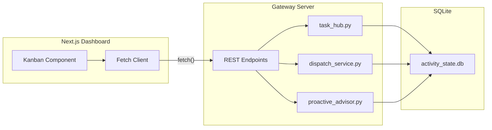
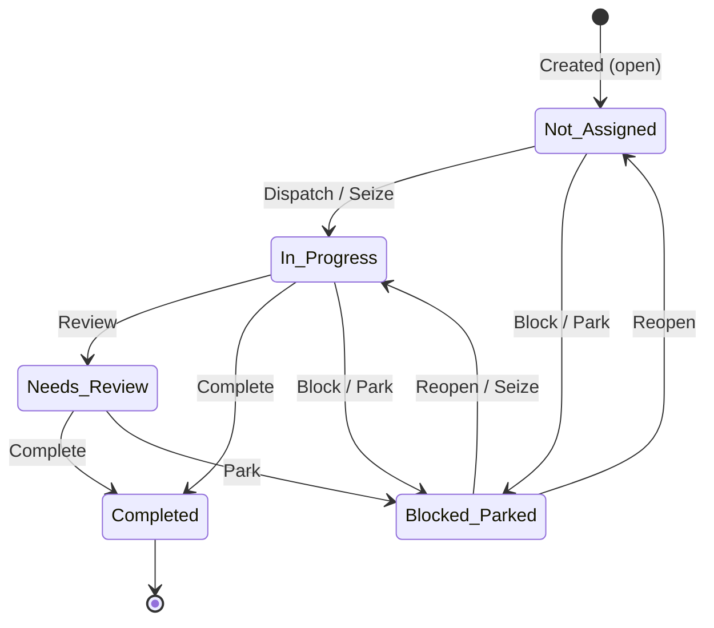

# Task Hub Dashboard

> **Canonical source of truth** for the Task Hub Dashboard frontend — design system, component architecture, API integration, and Kanban UX patterns.
>
> **Last updated:** 2026-04-18 — Agent Flow visual process display controls and client-derived visual events documented.

---

## 1. Overview

The Task Hub Dashboard is the primary UI for managing proactive tasks within Universal Agent. It is the in-house Kanban control surface for Task Hub, built as a Next.js client-side component consuming Python backend APIs.

**Key design principles:**
- **Glassmorphism-first**: All panels use `glass`/`tactical-panel` CSS classes with backdrop blur and translucent backgrounds
- **KCD Design System**: Strict adherence to the `kcd-*` Tailwind color palette (see `tailwind.config.ts`)
- **Responsive**: Stacking columns on `< md` breakpoints
- **Real-time awareness**: Polling-based data refresh with optimistic UI updates

The `/dashboard` landing page also embeds a mini Agent Flow widget beneath the main dashboard panels. That widget is part of the dashboard runtime surface even though its full-screen view lives at `/dashboard/agent-flow`.

---

## 2. File Map

| File | Purpose |
|------|---------|
| `web-ui/app/dashboard/todolist/page.tsx` | Main dashboard component (`"use client"`) — Kanban board, task cards, filters, lifecycle actions |
| `web-ui/app/globals.css` | KCD design tokens, glassmorphism utilities, tactical panel styles |
| `web-ui/tailwind.config.ts` | `kcd-*` color palette configuration |
| `src/universal_agent/gateway_server.py` | Backend API endpoints consumed by the dashboard |
| `src/universal_agent/task_hub.py` | Core Task Hub data layer (SQLite) |
| `src/universal_agent/services/dispatch_service.py` | Dispatch logic for "Start Now" / approval / scheduled tasks |
| `web-ui/lib/agent-flow/spotlight-store.ts` | Persisted Agent Flow spotlight control state used by the embedded mini widget and the full Agent Flow route |
| `web-ui/lib/agent-flow/visual-preferences.ts` | Persisted Agent Flow visual tuning state for text display, replay pacing, thinking display, and fade behavior |

---

## 3. Design System

### 3.1 Color Palette (`kcd-*`)

The dashboard exclusively uses the `kcd-*` Tailwind palette defined in `tailwind.config.ts`:

| Token | Value | Usage |
|-------|-------|-------|
| `kcd-bg` | `#0a0e17` | Page background |
| `kcd-surface` | `#111827` | Card/panel backgrounds |
| `kcd-surface-alt` | `#1a2332` | Elevated surfaces, hover states |
| `kcd-border` | `#1e293b` | Panel borders |
| `kcd-text` | `#e2e8f0` | Primary text |
| `kcd-text-muted` | `#94a3b8` | Secondary/label text |
| `kcd-accent` | `#38bdf8` | Primary accent (links, focus rings) |
| `kcd-accent-hover` | `#7dd3fc` | Accent hover state |
| `kcd-success` | `#22c55e` | Success states, completed tasks |
| `kcd-warning` | `#f59e0b` | Warning states, medium priority |
| `kcd-error` | `#ef4444` | Error/critical states, high priority |

### 3.2 Glassmorphism Utilities

Defined in `globals.css`:

```css
.glass {
  background: rgba(17, 24, 39, 0.6);
  backdrop-filter: blur(12px);
  border: 1px solid rgba(56, 189, 248, 0.1);
}

.tactical-panel {
  background: rgba(17, 24, 39, 0.8);
  backdrop-filter: blur(16px);
  border: 1px solid rgba(30, 41, 59, 0.6);
  border-radius: 0.75rem;
}
```

### 3.3 Typography

- **Font stack**: Inter (via Google Fonts) with system fallbacks
- **Headings**: `font-semibold` or `font-bold` depending on hierarchy
- **Body**: `text-sm` (14px) for card content, `text-xs` (12px) for metadata

---

## 4. Component Architecture

### 4.1 Page Structure

```
page.tsx ("use client")
├── Header Bar (title + filter controls)
├── Quick-Add Input Bar (planned: Phase 6b)
├── Morning Report Banner (planned: Phase 6c)
└── Kanban Board
    ├── Column: Not Assigned (derived lane: `not_assigned`)
    ├── Column: In Progress (derived lane: `in_progress`)
    ├── Column: Needs Review (derived lane: `needs_review`)
    └── Column: Completed (derived lane: `completed`)
```

### 4.2 Task Card Components

Each task card renders:
- **Priority badge**: Color-coded using `priorityColorClass()` helper
- **Title**: Truncated with hover tooltip for overflow
- **Source pill**: Visual indicator of task origin (`sourceKindPill` helper)
- **Labels**: Tag chips for `agent-ready`, brainstorm stage, etc.
- **Delivery mode**: `fast_summary`, `standard_report`, or `enhanced_report`
- **Canonical execution role**: `email_triage`, `todo_execution`, `heartbeat`, or VP lineage surfaced from backend history
- **Workspace action routing**: opens the live `session_id` when present and carries explicit `run_id` only as durable file-browsing context; it must not infer chat navigation from `workspace_name` or workspace path basenames
- **Lifecycle enforcement visibility**: history and Mission Control now surface `execution_missing_lifecycle_mutation` and auto-linked delegation so prose-only “queued” claims are distinguishable from real Task Hub state
- **Outbound delivery visibility**: task history can distinguish hook acknowledgements from final outbound artifacts so duplicate response incidents are diagnosable
- **Action buttons**: Contextual lifecycle actions per column

### 4.3 Dispatcher Health Panel

The ToDo dashboard includes a dedicated dispatcher-health strip for the separate non-heartbeat execution driver. It shows:
- Last wake request and target session
- Whether that wake targeted a registered session
- Last claim batch size and claiming session
- Last execution decision and latest failure/defer reason
- Pending wake count versus registered-session count
- Busy-session count so “agent asleep” vs “all executors busy” is visible without log inspection
- Whether a successful VP dispatch was auto-linked into Task Hub delegation by the server because the model omitted the explicit lifecycle tool call
- The latest final execution result rather than just dispatch admission, so repeated retries and reopened tasks do not masquerade as healthy accepted executions

Operational guardrail:
- `UA_TODO_DISPATCH_MAX_PER_SWEEP` controls how many tasks the dedicated ToDo dispatcher claims into one execution prompt. The production default is `1` to avoid large multi-task prompts starving the gateway event loop; raise only during controlled batch-processing windows.

### 4.4 Embedded Agent Flow Mini Widget

The dashboard landing page renders an embedded mini Agent Flow panel so operators can see current spotlight activity without leaving `/dashboard`.

Operational notes:
- it mounts on every dashboard load
- it reads spotlight control state from `ua.agent-flow-spotlight.v1`
- it must not depend on persisted archive timelines or replay payloads
- browser storage for this widget is intentionally lightweight because `/dashboard` is a frequently revisited route

### 4.5 Spotlight Persistence Contract

The persisted Agent Flow spotlight store is browser-local UI state, not a durable event archive.

Current contract:
- storage key: `ua.agent-flow-spotlight.v1`
- allowed persisted fields: spotlight mode, selected session id, selection source, replay loop index, replay generation
- forbidden persisted fields: `archivesBySessionId`, normalized event timelines, replay payloads, or any large archived graph state

If old browser state contains the legacy heavy payload shape, rehydrate should discard the archived timeline graph and keep only the lightweight control fields.

### 4.6 Agent Flow Visual Process Display

The full `/dashboard/agent-flow` route is a truthful live process display and a compressed replay surface. Live mode consumes real gateway WebSocket events through the `global_agent_flow` observer socket; it must not invent process activity. Replay mode may rewrite event timing for readability, but the replayed visuals still come from observed or archived events.

Visual tuning is browser-local UI state, separate from the lightweight spotlight state:

| Control | Default | Purpose |
|---------|---------|---------|
| Text mode | `hybrid` | Chooses compact bubbles, readable fly-outs plus transcript, or larger inline sheets |
| Replay pacing | `readable` | Chooses fast synthetic replay or short capped readability holds around text/artifact events |
| Text scale | `1` | Scales readable text fly-outs without changing underlying event content |
| Readable hold | `1` | Multiplies replay/display hold time for long text moments |
| Thinking display | `ambient` | Keeps raw thinking visually lightweight by default |
| Auto-fade text | `true` | Allows readable fly-outs to fade after their hold period |
| Pin on hover | `true` | Keeps readable text visible while hovered |

Phase 1 visual events are derived client-side from existing real events:

| Visual event | Source signal | Display contract |
|--------------|---------------|------------------|
| `text_burst` | Long user/assistant text, long or failed tool result, artifact preview | Readable fly-out on canvas; clicking opens the Transcript panel for full context |
| `phase_transition` | Session attach, input/status, tool work, delegation, completion | Ring/wave marker around the active agent |
| `artifact_emitted` | Work product event, artifact-like system event, write/publish/report tool result | Output card connected to the producing agent |
| `error_recovery` | Failed tool result and later successful activity | Red fracture for failure, green repair pulse when the run continues |

Durable Greatest Hits and explicit gateway-level visual events are planned follow-up phases. Until those phases land, Greatest Hits remains browser-observed and the new visuals are derived from the event stream already reaching the Agent Flow tab.

### 4.7 Helper Functions

| Function | Purpose |
|----------|---------|
| `priorityColorClass(priority)` | Maps P0–P3 → Tailwind color classes (`kcd-error`, `kcd-warning`, `kcd-accent`, `kcd-text-muted`) |
| `sourceKindPill(sourceKind)` | Renders origin badge (email, heartbeat, manual, brainstorm) |
| Derived board projection | Maps canonical task status + assignment lineage to UI lanes (`not_assigned`, `in_progress`, `needs_review`, `completed`) |

---

## 5. API Integration

The dashboard consumes the following backend REST endpoints from `gateway_server.py`:

### 5.1 Read Endpoints

| Endpoint | Method | Purpose |
|----------|--------|---------|
| `/api/v1/dashboard/todolist/overview` | GET | Summary counts, heartbeat runtime, and ToDo dispatcher health |
| `/api/v1/dashboard/todolist/agent-queue` | GET | Queue items plus derived board lanes, delivery mode, and canonical assignment/session lineage |
| `/api/v1/dashboard/todolist/completed` | GET | Completed tasks with session/workspace links |
| `/api/v1/dashboard/todolist/tasks/{task_id}/history` | GET | Assignment/evaluation trail, email mapping, transcript/run-log links, and canonical execution forensics |
| `/api/v1/dashboard/todolist/morning-report` | GET | Deterministic morning report snapshot |

Read endpoints must not rebuild the Task Hub dispatch queue. They read the latest stored queue snapshot so sidebar navigation and polling do not perform expensive scoring/write work while holding the activity-store lock. Use `/api/v1/dashboard/todolist/dispatch-queue/rebuild` or dispatcher/write paths when a queue rebuild is intentionally required.

Queue and history responses surface `canonical_execution_session_id`, `canonical_execution_run_id`, and `canonical_execution_workspace` as distinct fields. The dashboard treats `session_id` as the attach target for the normal agent workspace view and treats `run_id` as the durable evidence/file-browsing key.

### 5.2 Write Endpoints

| Endpoint | Method | Purpose |
|----------|--------|---------|
| `/api/v1/dashboard/todolist/tasks` | POST | Create/upsert a task (quick-add) |
| `/api/v1/dashboard/todolist/tasks/{task_id}/action` | POST | Lifecycle action: `complete`, `block`, `park`, `review`, `reopen` |
| `/api/v1/dashboard/todolist/tasks/{task_id}/dispatch` | POST | "Start Now" — immediate dispatch to agent |
| `/api/v1/dashboard/todolist/tasks/{task_id}/approve` | POST | Approve a task for agent execution |
| `/api/v1/heartbeat/wake` | POST | Manually nudge heartbeat/system supervision |

### 5.3 Data Flow



## 5.4 Troubleshooting: Browser-State Navigation Instability

If `/dashboard` crashes for one browser profile but not another:

1. inspect `localStorage`, especially `ua.agent-flow-spotlight.v1`
2. compare the failing browser against a clean browser session
3. clear the spotlight key before clearing all site data
4. verify the key remains small after reload; large archive-style payloads are a regression

This pattern matters because the dashboard embeds the mini Agent Flow widget and always pays the cost of spotlight rehydrate.

---

## 6. Task Lifecycle on the Dashboard

### 6.1 Board Lanes

| Column | Derived From | Available Actions |
|--------|--------------|-------------------|
| **Not Assigned** | `open` with no active assignment/delegation | Dispatch, Seize, Block, Park |
| **In Progress** | `in_progress`, `delegated`, or active seized/running assignment | Complete, Block, Review, Park |
| **Needs Review** | `needs_review`, `pending_review`, or unverified completion flagged by reconciliation | Complete, Park |
| **Completed** | `completed` | Inspect, review history, hide |

Blocked and parked items remain available through queue data and filters, but they are no longer primary board columns.

> [!TIP]
> The lifecycle of a task and how it visually propagates through the dashboard columns is outlined below.



*As demonstrated in the exhibit above, tasks naturally flow from the `Not_Assigned` state into execution (`In_Progress`) and verification (`Needs_Review`) before `Completed` based strictly on API lifecycle mutations triggered by UI buttons or agent tool calls.*

### 6.3 Visibility And Forensics

The board is intentionally more diagnostic than before:
- **Dispatcher Health** makes wake/claim/defer/failure state visible without checking logs first
- **Task History** exposes session lineage, email mapping, reconciliation flags, and transcript/run-log links
- **Orphaned** card badges highlight tasks whose lifecycle state no longer matches an active assignment
- **Canonical execution hints** prevent hook-triage or heartbeat artifacts from being mistaken for the final execution owner
- **Tracked chat visibility** means `source_kind='chat_panel'` work items use the same board, history, and lifecycle surfaces as email- or dashboard-originated tasks
- **Lifecycle-failure visibility** means `execution_missing_lifecycle_mutation` incidents should be interpreted as "the task entered the canonical lane but the run ended without `task_hub_task_action(...)`" rather than as a dashboard projection bug

### 6.2 Action → API Mapping

| UI Action | API Call | Backend Function |
|-----------|----------|------------------|
| "Start Now" | `POST /dispatch/immediate/{id}` | `dispatch_immediate()` |
| "Complete" | `POST /items/{id}/action` body: `{action: "complete"}` | `perform_task_action()` |
| "Park" | `POST /items/{id}/action` body: `{action: "park"}` | `perform_task_action()` |
| "Block" | `POST /items/{id}/action` body: `{action: "block"}` | `perform_task_action()` |
| "Review" | `POST /items/{id}/action` body: `{action: "review"}` | `perform_task_action()` |
| "Reopen" | `POST /items/{id}/action` body: `{action: "reopen"}` | `perform_task_action()` |
| "Quick Add" | `POST /items` body: `{title, priority, ...}` | `upsert_item()` |

---

## 7. Priority Display System

Tasks are visually coded by priority:

| Priority | Label | Color | Tailwind Class |
|----------|-------|-------|----------------|
| P0 | Critical | Red | `text-kcd-error`, `border-kcd-error` |
| P1 | High | Amber | `text-kcd-warning`, `border-kcd-warning` |
| P2 | Medium | Blue | `text-kcd-accent`, `border-kcd-accent` |
| P3 | Low | Gray | `text-kcd-text-muted`, `border-kcd-border` |

---

## 8. Source Kind Pills

Visual indicators showing where a task originated:

| Source | Pill Style | Origin |
|--------|-----------|--------|
| `email` | Blue outline | Materialized via `EmailTaskBridge` |
| `heartbeat` | Green outline | Created during heartbeat cycle |
| `manual` | Gray outline | User-created via dashboard quick-add |
| `brainstorm` | Purple outline | Born from brainstorm refinement pipeline |
| `webhook` | Orange outline | Ingested via webhook handler |
| `chat_panel` | Neutral/default pill unless customized | Materialized from the live chat websocket into the canonical Task Hub execution lane |

## 8.1 Tracked Chat Resolution Semantics

Tracked chat requests are intentionally visible on `/dashboard/todolist` while they are executing. The expected behavior is:

1. A live chat request is accepted.
2. The gateway creates `chat:{session_id}:{turn_id}` and immediately claims it for the foreground session.
3. The task appears in the board with `source_kind='chat_panel'`.
4. The run must finish with a durable lifecycle mutation such as `complete`, `review`, `block`, `park`, or `delegate`.

If step 4 does not happen, the board should not treat the work as resolved. Instead:

- the assignment is finalized as failed
- the task is reopened
- the runtime emits `execution_missing_lifecycle_mutation`

So when an operator sees a chat-created item appear in the board but fail to resolve, that usually means the canonical lifecycle contract was not satisfied during execution, not that the dashboard invented a phantom task.

---

## 9. Planned Features (Phase 6 Roadmap)

| Phase | Feature | Status |
|-------|---------|--------|
| **6a** | Tailwind CSS / `kcd-*` migration | ✅ Complete |
| **6b** | Quick-Add sticky input bar | 🔲 Planned |
| **6c** | Morning Report collapsible banner | 🔲 Planned |
| **6d** | Simplified Kanban + icon-only hover actions | 🔲 Planned |
| **6e** | Mobile responsive layout | 🔲 Planned |
| **6f** | Skeleton loading + micro-animations | 🔲 Planned |

---

## 10. Related Documentation

| Document | Scope |
|----------|-------|
| [Proactive Pipeline](Proactive_Pipeline.md) | End-to-end autonomous task execution — ingress, scoring, dispatch, refinement, decomposition |
| [Heartbeat Service](Heartbeat_Service.md) | Heartbeat supervision contract, mediation flow, and separation from canonical ToDo execution |
| [Memory System](Memory_System.md) | Tiered memory architecture used by proactive agents |
