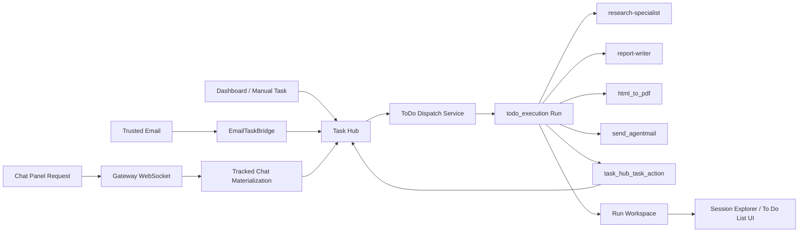
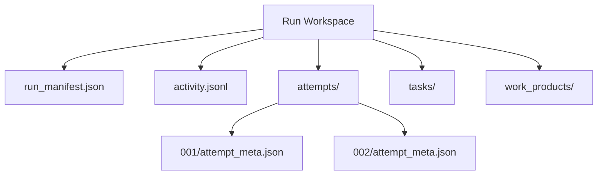
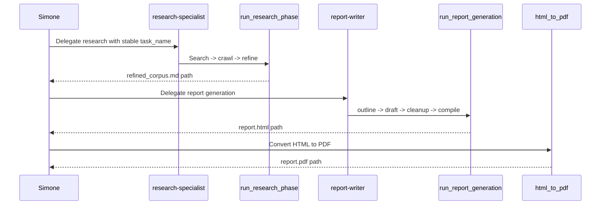
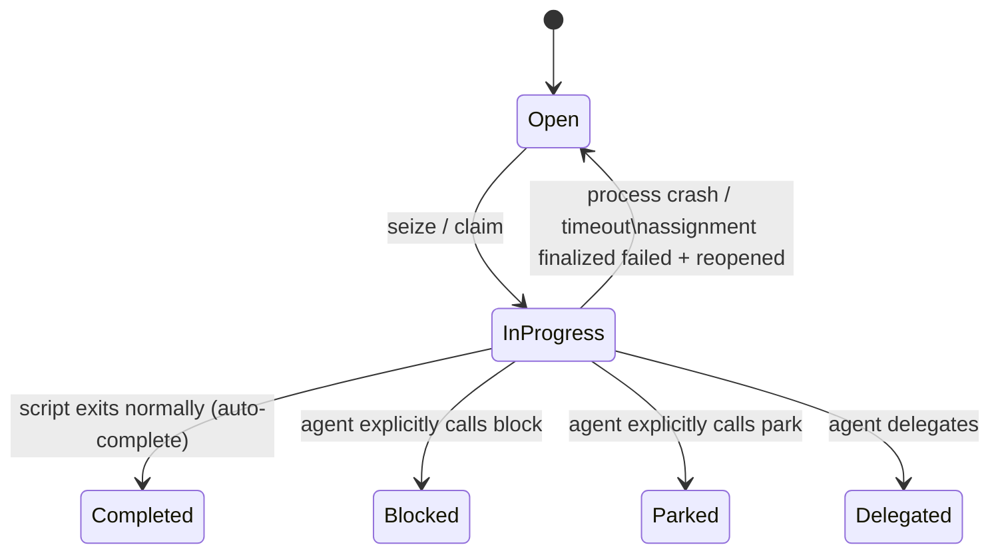
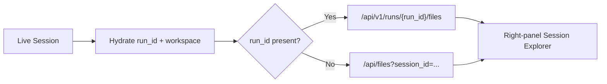
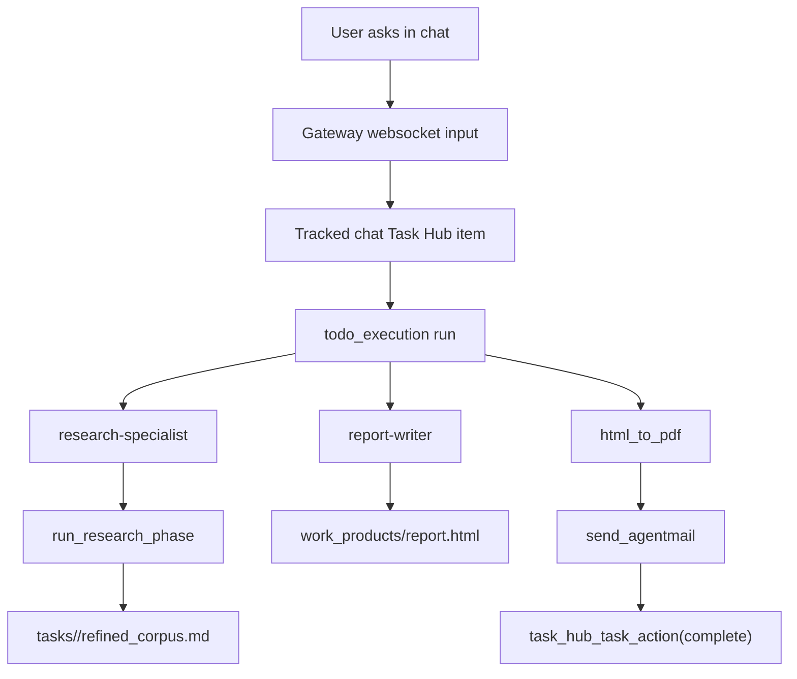
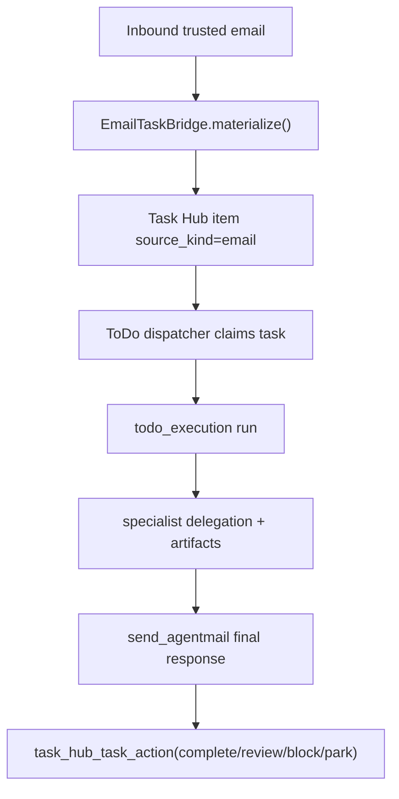

# Task Hub and Multi-Channel Execution Master Reference (2026-03-31)

> Code-verified master reference for how work enters the system, becomes a tracked Task Hub item, executes inside a durable run workspace, delegates to specialists, produces artifacts, and resolves back into the To Do List dashboard and delivery channels.

---

## 1. Purpose

This document is the central organized reference for the current To Do List tab pipeline and its neighboring execution paths. It is intended to answer, in one place:

- how trusted email and direct chat requests enter the same durable execution lane
- how Task Hub items are created, claimed, executed, and resolved
- how run IDs, run workspaces, and attempt directories are structured
- how the research-specialist and report-writer delegation flow works
- how artifacts are written to the filesystem
- how final delivery happens through chat or AgentMail
- how the right-panel Session Explorer resolves files
- what lifecycle events and failure modes operators should expect

This document is intentionally a master map. It does not replace the more specialized canonical docs it links to.

Important reading note:

- this document describes the current codebase as it exists today
- the run-per-task workspace isolation model is fully implemented across all canonical ingestion paths (tracked chat, ToDo dispatcher, email-to-task bridge)
- the canonical allocation layer is `ExecutionRunService` in `src/universal_agent/services/execution_run_service.py`
- for historical context on the migration, see [coding_handoff.md](../../docs/coding_handoff.md)

---

## 2. Scope and Canonical Relationship

This master reference is written from direct source review. It consolidates behavior currently spread across:

- Task Hub / To Do dispatcher
- Gateway websocket execution
- run workspace and attempt scaffolding
- research/report specialist tooling
- AgentMail delivery
- dashboard file browsing

When a deeper subsystem needs more detail, consult:

- [Proactive Pipeline](../../docs/02_Subsystems/Proactive_Pipeline.md)
- [Task Hub Dashboard](../../docs/02_Subsystems/Task_Hub_Dashboard.md)
- [Chat Panel Communication Layer](../../docs/02_Flows/04_Chat_Panel_Communication_Layer.md)
- [Artifacts, Workspaces, and Remote Sync Source of Truth](../../docs/03_Operations/90_Artifacts_Workspaces_And_Remote_Sync_Source_Of_Truth_2026-03-06.md)
- [Email Architecture and AgentMail Source of Truth](../../docs/03_Operations/82_Email_Architecture_And_AgentMail_Source_Of_Truth_2026-03-06.md)
- [TaskStop Guardrails and Task Hub Execution Hardening](../../docs/03_Operations/106_TaskStop_Guardrails_And_Task_Hub_Execution_Hardening_2026-03-31.md)
- [Run/Attempt Lifecycle and Nomenclature Migration Plan](../../docs/03_Operations/104_Run_Attempt_Lifecycle_And_Nomenclature_Migration_Plan_2026-03-24.md)

---

## 3. Core Model

The current system is built around five durable ideas:

1. Inbound work should become a tracked Task Hub item whenever it represents real execution work.
2. Canonical execution happens in a `todo_execution` lane, not ad hoc inside arbitrary helper paths.
3. Every meaningful run gets a durable run workspace under `AGENT_RUN_WORKSPACES/...`.
4. Task-specific artifacts live under `tasks/<task_name>/...` inside that run workspace.
5. A run is not considered properly resolved unless it records a durable Task Hub lifecycle mutation such as `complete`, `review`, `block`, `park`, or `delegate`.

Implementation status (completed 2026-04-01):

- all canonical execution paths (tracked chat, ToDo dispatch, email-to-task) allocate a fresh dedicated run workspace per accepted task via `ExecutionRunService.allocate_execution_run()`
- each allocated workspace is registered in the durable `runs` table with full lineage (task_id, origin, workspace_dir)
- the `update_assignment_lineage()` helper in `task_hub.py` stamps assignment records with run-scoped workspace_dir and workflow_run_id after allocation
- UI/API helpers (`_session_run_summary`, `_live_session_payload`) prefer `active_run_id` and `active_run_workspace` from session metadata for file browsing

The execution contract itself is normalized by `build_execution_manifest(...)` in [todo_dispatch_service.py](../../src/universal_agent/services/todo_dispatch_service.py#L73). For each work item, the runtime records:

- `workflow_kind`
- `delivery_mode`
- `requires_pdf`
- `final_channel`
- `canonical_executor`
- `codebase_root` when the work item is an approved repo-backed coding task
- `repo_mutation_allowed` when repo mutation authority is explicitly active

---

## 4. High-Level Architecture



---

## 5. Ingress Channels

### 5.1 Trusted Email

Trusted inbound email is materialized into Task Hub by `EmailTaskBridge`. The bridge is explicitly described as the email-to-task entry point in [email_task_bridge.py](../../src/universal_agent/services/email_task_bridge.py#L1).

Current code behavior:

- one deterministic task per email thread via `_deterministic_task_id(...)` in [email_task_bridge.py](../../src/universal_agent/services/email_task_bridge.py#L44)
- source kind is `email`
- delivery mode is inferred at materialization time by `infer_delivery_mode(...)` in [email_task_bridge.py](../../src/universal_agent/services/email_task_bridge.py#L50)
- canonical execution owner is stamped as `todo_dispatcher` in [email_task_bridge.py](../../src/universal_agent/services/email_task_bridge.py#L798)

The bridge writes task metadata that already contains the workflow manifest and delivery contract before dispatch.

Important nuance:

- email task identity is intentionally stable at the thread level
- execution lineage is separate from task identity
- the remaining refactor is to make each accepted email execution allocate its own dedicated run workspace while preserving the stable thread-backed task id

### 5.2 Direct Chat Panel

The chat panel is also a Task Hub ingress for normal user work.

The gateway decides whether to track a chat request in `_should_track_chat_panel_request(...)` in [gateway_server.py](../../src/universal_agent/gateway_server.py#L6347). If accepted, `_prepare_tracked_chat_execution(...)` creates a Task Hub item keyed as `chat:{session_id}:{turn_id}` and stamps delivery metadata in [gateway_server.py](../../src/universal_agent/gateway_server.py#L6365).

Then, when websocket execution starts, the request is rewritten into:

- `source = "chat_panel_task_hub"`
- `run_kind = "todo_execution"`
- `claimed_task_ids = [...]`
- `claimed_assignment_ids = [...]`

That mutation happens in [gateway_server.py](../../src/universal_agent/gateway_server.py#L26694).

Important current limitation:

- tracked chat already enters the canonical `todo_execution` lane
- the request metadata now carries both:
  - a run-scoped artifact workspace (`workspace_dir`, `workflow_run_id`)
  - an optional repo mutation target (`codebase_root`) for explicit coding tasks
- source edits should target `codebase_root` only when `repo_mutation_allowed=true`; all logs/checkpoints/work products still belong to the run workspace

### 5.3 Manual Dashboard / Other Task Hub Sources

The dashboard and other internal paths can create tasks directly in Task Hub. Once a task exists and is claimed for canonical execution, it follows the same `todo_execution` lifecycle rules as email and tracked chat.

Implementation note:

- any ingestion path that eventually reaches `todo_execution` should be treated as part of the same workspace-isolation problem
- the target contract is one accepted execution => one run workspace, regardless of whether the task originated from chat, email, or another trusted internal path

---

## 6. Durable Run and Attempt Model

Run workspace scaffolding is created by `ensure_run_workspace_scaffold(...)` in [run_workspace.py](../../src/universal_agent/run_workspace.py#L66).

What it creates and maintains:

- `run_manifest.json`
- `activity.jsonl`
- `attempts/`
- optional `attempts/<NNN>/attempt_meta.json`
- attempt evidence snapshots copied from root artifacts and `work_products/`



Important current rule:

- attempts are run-scoped, not task-scoped
- task-specific research/report outputs are task-scoped under `tasks/<task_name>/...`
- repo-backed coding authority is request-scoped and may coexist with the run workspace; it does not redefine the run workspace itself

---

## 7. Canonical Workspace Layout

The current canonical layout for research/report work is:

```text
<run workspace>/
  run_manifest.json
  activity.jsonl
  attempts/
    001/
    002/
  tasks/
    <task_name>/
      search_results/
        crawl_*.md
        processed_json/
      filtered_corpus/
      research_overview.md
      refined_corpus.md
  work_products/
    report.html
    report.pdf
```

Source of this layout:

- task-scoped search/corpus handling in `finalize_research(...)` at [mcp_server.py](../../src/mcp_server.py#L2533)
- report input path in `_run_report_generation_legacy(...)` at [mcp_server.py](../../src/mcp_server.py#L4440)
- task-scoped workspace instructions in [research-specialist.md](../../.claude/agents/research-specialist.md#L17)

Current nuance:

- run-root `search_results/` can still exist as a staging inbox
- finalized search archives and crawl outputs belong under `tasks/<task_name>/search_results/`

---

## 8. Workspace Resolution

Workspace identity is resolved through multiple layers, not one single mechanism.

### 8.1 Process Environment

The runtime sets both:

- `CURRENT_RUN_WORKSPACE`
- `CURRENT_SESSION_WORKSPACE` as a legacy alias

This is visible in [main.py](../../src/universal_agent/main.py#L8678) and [agent_setup.py](../../src/universal_agent/agent_setup.py#L440).

### 8.2 Subagent Prompt Context

The primary agent and specialist prompt builders include the run workspace explicitly:

- top-level context in [agent_core.py](../../src/universal_agent/agent_core.py#L1667)
- research specialist prompt in [agent_core.py](../../src/universal_agent/agent_core.py#L1703)
- report writer prompt in [agent_core.py](../../src/universal_agent/agent_core.py#L1775)
- task hook workspace awareness in [main.py](../../src/universal_agent/main.py#L3354)

### 8.3 Research Bridge Fallback Resolution

The research/report bridge resolves the actual run workspace using this precedence in `_resolve_workspace_hint(...)` in [research_bridge.py](../../src/universal_agent/tools/research_bridge.py#L75):

1. explicit `workspace_dir` if it points to a real run/session workspace
2. execution context variable
3. marker-file workspace resolution
4. observer workspace
5. latest run-workspace inference

Task identity is resolved separately by `_resolve_task_name(...)` in [research_bridge.py](../../src/universal_agent/tools/research_bridge.py#L133). This is the key fix that prevents path strings from being normalized into bogus task names.

---

## 9. Task Hub Execution Lane

The dedicated To Do dispatcher claims work and hands it to Simone in the `todo_execution` lane.

Claim + prompt build + submission happen in [todo_dispatch_service.py](../../src/universal_agent/services/todo_dispatch_service.py#L360). The dispatcher:

- claims up to a bounded set of tasks
- records assignment IDs
- builds the canonical execution prompt with `build_todo_execution_prompt(...)`
- sends a `GatewayRequest` with `run_kind="todo_execution"`

Important current limitation:

- the dispatcher claim path still passes `provider_session_id=session.session_id` and `workspace_dir=session.workspace_dir` in [todo_dispatch_service.py](../../src/universal_agent/services/todo_dispatch_service.py#L356)
- so dedicated To Do execution is lifecycle-canonical but not yet fully workspace-isolated on a one-task-per-run basis

The prompt itself explicitly states:

- work items are already claimed
- Task Hub mutations must use `mcp__internal__task_hub_task_action`
- email must use `mcp__internal__send_agentmail`
- `TaskStop` is not valid in this lane

That policy is defined in [todo_dispatch_service.py](../../src/universal_agent/services/todo_dispatch_service.py#L123).

### 9.1 Allowed and Disallowed Controls

In current code, `todo_execution` blocks only `TaskStop` at the constant layer:

- [constants.py](../../src/universal_agent/constants.py#L43)

This means sanctioned delegation to specialists is still allowed. The system is not trying to ban delegation; it is trying to ban lifecycle-breaking controls.

---

## 10. Specialist Delegation Model



### 10.1 Research Specialist

The research specialist contract is documented directly in [research-specialist.md](../../.claude/agents/research-specialist.md#L17).

Current mandatory expectations:

- use the run workspace, never repo-root-relative paths
- search first with Composio search tools
- then call `mcp__internal__run_research_phase`
- do not use Composio crawl/fetch tools
- keep the same `task_name` across research and report phases

### 10.2 Report Writer

The report writer contract is defined in [report-writer.md](../../.claude/agents/report-writer.md#L16).

Current expected path:

- call `mcp__internal__run_report_generation`
- trust its success receipt
- return the `report.html` output path

### 10.3 Foreground-Only Sequencing

The codebase treats `research-specialist` and `report-writer` as sequential prerequisites rather than background fire-and-forget helpers. The docs and guardrails around golden runs reflect that these are foreground specialist phases rather than loose parallel tasks.

---

## 11. Research and Report Pipeline Internals

### 11.1 Research Phase

`_run_research_phase_legacy(...)` in [mcp_server.py](../../src/mcp_server.py#L4417) validates that staged search JSON exists and then calls `finalize_research(...)`.

`finalize_research(...)` currently does all of the following in [mcp_server.py](../../src/mcp_server.py#L2533):

- resolves task-scoped directories
- scans search inbox JSON files
- extracts URLs
- archives processed search JSON into `tasks/<task_name>/search_results/processed_json/`
- calls Crawl4AI through `_crawl_core(...)`
- writes crawled markdown to `tasks/<task_name>/search_results/`
- filters into `tasks/<task_name>/filtered_corpus/`
- writes `research_overview.md`
- writes `refined_corpus.md` when corpus refinement succeeds

### 11.2 Report Generation

`_run_report_generation_legacy(...)` in [mcp_server.py](../../src/mcp_server.py#L4417) expects the corpus at:

- `tasks/<task_name>/refined_corpus.md`

Then it runs:

1. `generate_outline(...)`
2. `draft_report_parallel(...)`
3. `cleanup_report(...)`
4. `compile_report(...)`

and returns `work_products/report.html`.

### 11.3 PDF Generation

`html_to_pdf` resolves paths relative to the current workspace in [pdf_bridge.py](../../src/universal_agent/tools/pdf_bridge.py#L13), prefers Playwright Chromium in [pdf_bridge.py](../../src/universal_agent/tools/pdf_bridge.py#L74), and falls back to WeasyPrint if needed in [pdf_bridge.py](../../src/universal_agent/tools/pdf_bridge.py#L84).

---

## 12. Delivery Model

Final delivery is governed by the execution manifest.

Current top-level modes come from `build_execution_manifest(...)` and `infer_workflow_kind(...)` in [todo_dispatch_service.py](../../src/universal_agent/services/todo_dispatch_service.py#L52).

Examples:

- `research_report_email`
- `research_report_chat`
- `interactive_answer`
- `code_change`

For final email delivery, the native bridge is `mcp__internal__send_agentmail` in [agentmail_bridge.py](../../src/universal_agent/tools/agentmail_bridge.py#L87).

Current protections:

- duplicate final email protection for email-thread-backed work
- duplicate final delivery protection for Task Hub tasks in `todo_execution`
- receipt-style acknowledgements blocked during canonical ToDo execution

Those checks live in [agentmail_bridge.py](../../src/universal_agent/tools/agentmail_bridge.py#L139).

---

## 13. Orchestrator-Driven Lifecycle Mutation

To simplify agent logic, Task Hub resolution is now fundamentally **orchestrator-driven**. Instead of penalizing agents for forgetting to mutate task states, the gateway's pipeline automatically auto-completes tasks upon successful script execution.

Lifecycle actions can still be explicitly triggered by the agent via `perform_task_action(...)` in [task_hub.py](../../src/universal_agent/task_hub.py#L2709) for granular control (e.g., `delegate`, `block`, `park`). The bridge exposed to the model is `task_hub_task_action` in [task_hub_bridge.py](../../src/universal_agent/tools/task_hub_bridge.py#L26).

### 13.1 Enforcement and Auto-Completion

If a `todo_execution` run finishes execution naturally (without runtime crashes or hard application exceptions), `_todo_execution_auto_complete_after_final_delivery(...)` in [gateway_server.py](../../src/universal_agent/gateway_server.py) executes unconditionally. It safely issues a `complete` action for every unresolved task claimed by the given session.

Only if the run suffers a critical abort or timeout does the pipeline fallback state apply:

- the assignment is finalized as failed
- the task receives an error note
- the task falls back to the open queue or moves to needs review.



---

## 14. Event Lifecycle and Operator Signals

The gateway records To Do dispatcher runtime events in `_todo_dispatch_runtime_record(...)` in [gateway_server.py](../../src/universal_agent/gateway_server.py#L2803).

Observed event families include:

- `todo_dispatch_wake_requested`
- `todo_dispatch_session_registered`
- `todo_dispatch_claimed`
- `todo_dispatch_submitted`
- `todo_dispatch_execution_result`
- `todo_dispatch_deferred`
- `todo_dispatch_failed`
- `todo_dispatch_no_tasks`
- `agent_state_changed` with `source="todo_dispatcher"`

These events drive runtime visibility in the dashboard and should be interpreted as orchestration-state signals, not final lifecycle truth by themselves. Final truth still comes from Task Hub state.

---

## 15. Session Explorer and File Browser Resolution

The right-panel file browser must prefer the durable run workspace when a `run_id` exists.

### 15.1 Backend

The authoritative durable file APIs are:

- `GET /api/v1/runs/{run_id}/files`
- `GET /api/v1/runs/{run_id}/files/{file_path}`

implemented in [api/server.py](../../src/universal_agent/api/server.py#L1502).

### 15.2 Frontend

The Web UI now prefers run-backed URLs in:

- `buildDurableFileListUrl(...)` at [page.tsx](../../web-ui/app/page.tsx#L582)
- `buildDurableFileUrl(...)` at [page.tsx](../../web-ui/app/page.tsx#L595)

It also hydrates `run_id` and `workspace` metadata for live sessions in [page.tsx](../../web-ui/app/page.tsx#L1556) and [page.tsx](../../web-ui/app/page.tsx#L1615).



This is what makes task-scoped trees like `tasks/<task_name>/search_results/` visible in the right panel during live execution.

Important nuance:

- preferring `run_id` improves correctness of file browsing
- but it does not by itself guarantee one-task-per-run isolation
- if multiple tasks still share one underlying execution workspace, the explorer will faithfully show all of them
- fixing that requires the upstream run-allocation refactor described in [coding_handoff.md](../../docs/coding_handoff.md)

---

## 16. Current End-to-End Flows

### 16.1 Chat Request Asking for Research + Report + Email



### 16.2 Trusted Email Asking for a Report



---

## 17. Known Current Constraints and Important Nuances

These are not speculative. They reflect the current checkout.

- The system still carries both `CURRENT_RUN_WORKSPACE` and `CURRENT_SESSION_WORKSPACE`, but `CURRENT_SESSION_WORKSPACE` is a compatibility alias rather than the preferred documented name.
- Research input JSON may still arrive in run-root `search_results/`, but finalized research artifacts are task-scoped.
- `todo_execution` does not ban specialist delegation. It bans lifecycle-breaking controls like `TaskStop`.
- A task appearing in the To Do List and then remaining unresolved usually means the execution missed `task_hub_task_action(...)`, not that Task Hub failed to ingest it.
- The right-panel file browser is only authoritative when it has the run-backed metadata needed to browse by `run_id`.
- The current code still has incomplete workspace isolation for some canonical execution paths. In particular, tracked chat claims and dispatcher claims can still reuse an existing session workspace instead of allocating a fresh run workspace per accepted task.
- The required remediation for chat, email, dispatcher, and any other canonical ingestion path is documented in [coding_handoff.md](../../docs/coding_handoff.md).

---

## 18. Practical Debug Checklist

When this pipeline misbehaves, verify in this order:

1. Did the work become a Task Hub item with the correct `source_kind` and metadata?
2. Did the request enter `run_kind="todo_execution"`?
3. Did the run workspace resolve to a real `AGENT_RUN_WORKSPACES/...` directory?
4. Did research write into `tasks/<task_name>/...` instead of inventing a synthetic task name?
5. Did `run_research_phase` produce `refined_corpus.md`?
6. Did `run_report_generation` produce `work_products/report.html`?
7. Did `html_to_pdf` produce the expected PDF?
8. If email delivery was requested, did `send_agentmail` record a final outbound side effect?
9. Did the run call `task_hub_task_action(...)` with a terminal or delegating action?
10. If the UI looks wrong, does the live session have `run_id` and is the file browser using `/api/v1/runs/{run_id}/files`?

---

## 19. Source Map

Primary code files behind this document:

- [gateway_server.py](../../src/universal_agent/gateway_server.py)
- [todo_dispatch_service.py](../../src/universal_agent/services/todo_dispatch_service.py)
- [task_hub.py](../../src/universal_agent/task_hub.py)
- [task_hub_bridge.py](../../src/universal_agent/tools/task_hub_bridge.py)
- [email_task_bridge.py](../../src/universal_agent/services/email_task_bridge.py)
- [research_bridge.py](../../src/universal_agent/tools/research_bridge.py)
- [mcp_server.py](../../src/mcp_server.py)
- [run_workspace.py](../../src/universal_agent/run_workspace.py)
- [pdf_bridge.py](../../src/universal_agent/tools/pdf_bridge.py)
- [agentmail_bridge.py](../../src/universal_agent/tools/agentmail_bridge.py)
- [page.tsx](../../web-ui/app/page.tsx)
- [api/server.py](../../src/universal_agent/api/server.py)
- [research-specialist.md](../../.claude/agents/research-specialist.md)
- [report-writer.md](../../.claude/agents/report-writer.md)

---

## 20. Change Intent

This document exists so future debugging does not have to reconstruct the pipeline from scattered subsystem docs and partial recollection. It should be kept aligned with code whenever any of the following change:

- Task Hub ingress rules
- `todo_execution` lifecycle rules
- run/attempt/workspace naming
- research/report specialist contracts
- final delivery policy
- Session Explorer file resolution
