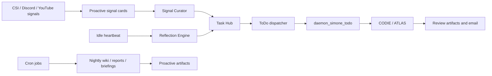
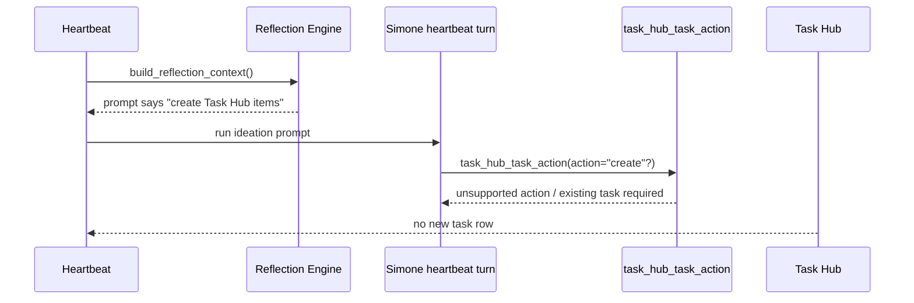
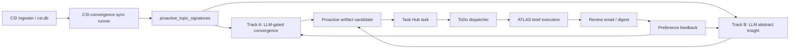

# Proactive Automation Current State Audit (2026-04-18)

## Executive Summary

The proactive system is not a single finished 24/7 automation path today. It is a set of useful foundations plus several disconnected or partially wired producers.

The most important finding is that the repository contains services for proactive signal cards, artifact inventory, CODIE cleanup tasks, tutorial-build tasks, convergence tasks, idle dispatch, daemon sessions, and scheduled cron work. However, the current wiring does not reliably convert idle time into generated work that is then executed through Task Hub.

In the local checkout inspected on 2026-04-18:

- The local gateway was not running on `127.0.0.1:8002`, so heartbeat, cron, AgentMail, idle dispatch, proactive signal sync, and ToDo dispatch were not active locally.
- The local tutorial worker was running, but it was repeatedly failing to reach the gateway with `Connection refused`.
- `AGENT_RUN_WORKSPACES/activity_state.db` had no proactive tables and no `reflection`, `proactive_signal`, `tutorial_build`, `convergence_detection`, `proactive_codie`, or `heartbeat_remediation` Task Hub rows.
- The runtime cron store at `AGENT_RUN_WORKSPACES/cron_jobs.json` did not contain the documented `nightly_wiki`, `morning_briefing`, `proactive_report_7am`, `proactive_report_12pm`, or `proactive_report_4pm` jobs. Those jobs exist in `workspaces/cron_jobs.json`, which is not the default gateway runtime cron store.
- Reflection mode can run, but the prompt tells the agent to create Task Hub rows with `task_hub_task_action`, while that MCP tool only performs lifecycle actions on existing tasks. That makes the core "idle agent creates new tasks" behavior structurally unable to work through the documented tool.
- Signal curation has a promotion helper, but the heartbeat path only records curation metadata and does not call the helper that creates Task Hub work.

The net state is: proactive infrastructure exists, but the execution chain is broken at generation, scheduling, and runtime availability. This explains why few proactive activities are visible even though many pieces were built.

## Scope And Method

This report reviewed the current documentation, source code, and local runtime state. It intentionally did not change code.

Primary source areas:

| Area | Source |
| --- | --- |
| Canonical proactive architecture | `docs/02_Subsystems/Proactive_Pipeline.md` |
| Proactive work-product plan | `docs/02_Subsystems/Proactive_Intelligence_Work_Product_Pipeline.md` |
| Heartbeat and idle ideation | `src/universal_agent/heartbeat_service.py`, `src/universal_agent/services/reflection_engine.py` |
| Signal cards and curation | `src/universal_agent/proactive_signals.py`, `src/universal_agent/services/signal_curator.py` |
| Task Hub execution | `src/universal_agent/services/todo_dispatch_service.py`, `src/universal_agent/tools/task_hub_bridge.py` |
| Cron scheduling | `src/universal_agent/cron_service.py`, `AGENT_RUN_WORKSPACES/cron_jobs.json`, `workspaces/cron_jobs.json` |
| Tutorial builds | `src/universal_agent/services/proactive_tutorial_builds.py`, `scripts/tutorial_local_bootstrap_worker.py` |

## Intended Architecture

The documented target is an always-on system where signals, reflection, cron, and human ingress converge into Task Hub, and non-active agents pick up work through the ToDo dispatcher.



The docs explicitly describe 24/7 proactive task finding and execution in the canonical Proactive Pipeline, including "continuously find, prioritize, claim, execute, and report" behavior. Source: file:///home/kjdragan/lrepos/universal_agent/docs/02_Subsystems/Proactive_Pipeline.md#L15 and file:///home/kjdragan/lrepos/universal_agent/docs/02_Subsystems/Proactive_Pipeline.md#L17.

The work-product plan is more cautious. It says the artifact, review-email, feedback, CODIE, tutorial-build, and convergence foundations exist, but it still lists "live automation wiring" and live smoke tests as outstanding. Source: file:///home/kjdragan/lrepos/universal_agent/docs/02_Subsystems/Proactive_Intelligence_Work_Product_Pipeline.md#L339 and file:///home/kjdragan/lrepos/universal_agent/docs/02_Subsystems/Proactive_Intelligence_Work_Product_Pipeline.md#L355.

Those two docs currently conflict in tone. The canonical architecture reads like the system is fully autonomous; the work-product plan correctly reflects that automation wiring and validation remain incomplete.

## What Exists And Appears Solid

### Daemon And Dispatch Foundations

Gateway startup creates daemon sessions when heartbeat is enabled. The daemon session manager defaults to Simone and maps two roles: heartbeat and todo. Source: file:///home/kjdragan/lrepos/universal_agent/src/universal_agent/services/daemon_sessions.py#L28 and file:///home/kjdragan/lrepos/universal_agent/src/universal_agent/services/daemon_sessions.py#L32.

Daemon session metadata marks todo sessions with `session_role="todo_execution"`, and the gateway registers `todo_execution` sessions with the ToDo dispatch service. Source: file:///home/kjdragan/lrepos/universal_agent/src/universal_agent/services/daemon_sessions.py#L99 and file:///home/kjdragan/lrepos/universal_agent/src/universal_agent/gateway_server.py#L7606.

The ToDo dispatch service only accepts sessions with `session_role` `todo_execution` or `todo`, then claims tasks and submits them as `run_kind="todo_execution"`. Source: file:///home/kjdragan/lrepos/universal_agent/src/universal_agent/services/todo_dispatch_service.py#L503 and file:///home/kjdragan/lrepos/universal_agent/src/universal_agent/services/todo_dispatch_service.py#L733.

The idle dispatch loop can wake an idle ToDo executor every poll interval or immediately via nudges. Source: file:///home/kjdragan/lrepos/universal_agent/src/universal_agent/services/idle_dispatch_loop.py#L75 and file:///home/kjdragan/lrepos/universal_agent/src/universal_agent/services/idle_dispatch_loop.py#L184.

Conclusion: Task Hub execution can work when the gateway is running and a ToDo daemon is registered.

### Proactive Artifact And Review Foundations

The proactive artifact registry exists and is exposed through dashboard endpoints for list, digest preview/send, individual review email, feedback, CODIE cleanup task creation, tutorial build task creation, tutorial build artifact registration, and convergence signatures. Source: file:///home/kjdragan/lrepos/universal_agent/src/universal_agent/gateway_server.py#L16498 and file:///home/kjdragan/lrepos/universal_agent/src/universal_agent/gateway_server.py#L16662.

CODIE cleanup task creation exists as a helper and creates a normal open Task Hub item with `source_kind="proactive_codie"` and `trigger_type="heartbeat_poll"`. Source: file:///home/kjdragan/lrepos/universal_agent/src/universal_agent/services/proactive_codie.py#L29 and file:///home/kjdragan/lrepos/universal_agent/src/universal_agent/services/proactive_codie.py#L42.

Tutorial build task creation exists as a helper and creates a normal open Task Hub item with `source_kind="tutorial_build"` and `trigger_type="heartbeat_poll"`. Source: file:///home/kjdragan/lrepos/universal_agent/src/universal_agent/services/proactive_tutorial_builds.py#L16 and file:///home/kjdragan/lrepos/universal_agent/src/universal_agent/services/proactive_tutorial_builds.py#L42.

Conclusion: once a proactive Task Hub row is actually created, the normal execution lane can pick it up.

## Main Impediments

### 1. Local Runtime Was Not Running

The local process table did not show a gateway process, and `curl http://127.0.0.1:8002/api/v1/health` returned no response. The tutorial worker service was active, but its logs repeatedly showed gateway `Connection refused`.

Impact:

- no heartbeat ticks
- no cron execution
- no AgentMail ingress
- no proactive signal sync
- no idle dispatch loop
- no ToDo daemon claims
- no tutorial bootstrap claims

This is the simplest explanation for "I do not see proactive activity" on the local machine: the always-on control plane is down.

### 2. Runtime Cron Store Mismatch

Gateway uses `AGENT_RUN_WORKSPACES` as its default workspace root. Source: file:///home/kjdragan/lrepos/universal_agent/src/universal_agent/gateway_server.py#L241.

`schedule_nightly_wiki.py` writes to `UA_WORKSPACES_DIR` or `/home/kjdragan/lrepos/universal_agent/workspaces` by default. Source: file:///home/kjdragan/lrepos/universal_agent/src/universal_agent/scripts/schedule_nightly_wiki.py#L14 and file:///home/kjdragan/lrepos/universal_agent/src/universal_agent/scripts/schedule_nightly_wiki.py#L17.

Current evidence:

| File | Observed proactive jobs |
| --- | --- |
| `workspaces/cron_jobs.json` | `nightly_wiki`, `morning_briefing`, `proactive_report_7am`, `proactive_report_12pm`, `proactive_report_4pm` |
| `AGENT_RUN_WORKSPACES/cron_jobs.json` | `autonomous_daily_briefing`, `cron_codie_cleanup`, plus many test/simple cron jobs |

Impact:

- the documented nightly wiki and 3x daily proactive reports are not registered in the runtime cron file the gateway uses by default
- `nightly_wiki_agent.py` and `proactive_report_agent.py` may be implemented, but they are not being invoked by the live CronService in this checkout

### 3. Runtime Cron Store Contains High-Frequency Noise

`AGENT_RUN_WORKSPACES/cron_jobs.json` contains many "simple repeating interval" and "cron schedule" jobs, including jobs with `every_seconds=2`. Recent `AGENT_RUN_WORKSPACES/cron_runs.jsonl` entries showed repeated `[Errno 5] Input/output error` failures for those jobs.

Impact:

- this can bury useful proactive cron activity in noise
- frequent failing cron work can create scheduler churn
- proactive jobs may be absent, but the runtime still appears "busy" with unrelated failures

This should be cleaned as an operational hygiene step before judging proactive throughput.

### 4. Reflection Engine Cannot Actually Create Tasks Through Its Documented Tool

The heartbeat guard can enter reflection mode when the queue is empty and reflection is enabled. Source: file:///home/kjdragan/lrepos/universal_agent/src/universal_agent/heartbeat_service.py#L788 and file:///home/kjdragan/lrepos/universal_agent/src/universal_agent/heartbeat_service.py#L838.

The reflection engine prompt tells the agent to create Task Hub items using `task_hub_task_action`. Source: file:///home/kjdragan/lrepos/universal_agent/src/universal_agent/services/reflection_engine.py#L277.

But `task_hub_task_action` only supports lifecycle actions for existing tasks: claim, seize, review, complete, block, park, unblock, delegate, approve. It requires a `task_id` and rejects unsupported actions. Source: file:///home/kjdragan/lrepos/universal_agent/src/universal_agent/tools/task_hub_bridge.py#L26 and file:///home/kjdragan/lrepos/universal_agent/src/universal_agent/tools/task_hub_bridge.py#L46.



Additional issue: heartbeat increments the proactive budget when reflection context is built, before any task creation is verified. Source: file:///home/kjdragan/lrepos/universal_agent/src/universal_agent/heartbeat_service.py#L2114 and file:///home/kjdragan/lrepos/universal_agent/src/universal_agent/heartbeat_service.py#L2120.

Impact:

- idle reflection may consume budget without producing tasks
- even successful LLM reasoning cannot persist new Task Hub work through the stated tool
- this is likely the biggest code-level blocker for 24/7 autonomous task generation

### 5. Signal Curator Does Not Promote Cards In The Heartbeat Path

`signal_curator.py` has a helper that can promote curated card decisions into Task Hub items. Source: file:///home/kjdragan/lrepos/universal_agent/src/universal_agent/services/signal_curator.py#L134.

However, the heartbeat path only checks whether curation should run, collects pending cards into request metadata, and records the curation timestamp. Source: file:///home/kjdragan/lrepos/universal_agent/src/universal_agent/heartbeat_service.py#L2032 and file:///home/kjdragan/lrepos/universal_agent/src/universal_agent/heartbeat_service.py#L2043.

There is no call from heartbeat to `promote_cards_to_tasks(...)`.

Impact:

- pending signal cards can accumulate without automatically becoming Task Hub work
- recording the curation timestamp can make later time-based curation less likely even though no promotion happened
- the curator is a scaffold, not a complete automated producer

### 6. Signal Card Generation Is Explicit Or Dashboard-Triggered, Not Continuous

The proactive signals dashboard no longer syncs CSI/Discord sources during ordinary reads. It only schedules background sync when `sync` or `force_sync` is requested. Source: file:///home/kjdragan/lrepos/universal_agent/src/universal_agent/gateway_server.py#L16341 and file:///home/kjdragan/lrepos/universal_agent/src/universal_agent/gateway_server.py#L16352.

The performance note says this was intentional: dashboard reads must not do source sync by default. Source: file:///home/kjdragan/lrepos/universal_agent/docs/03_Operations/113_Task_Hub_Dashboard_Read_Path_Performance_2026-04-16.md#L31.

Impact:

- the performance fix was reasonable, but it removed an accidental producer
- unless another cron/heartbeat source-sync path exists, signal cards will not be continuously refreshed
- in this checkout, no proactive signal-card tables existed in the activity DB, which is consistent with sync not having run

### 7. Tutorial Build Automation Is Helper-Complete But Not End-To-End Automatic

The tutorial build helper can auto-route build-oriented CSI videos into Task Hub when `sync_build_oriented_csi_videos(...)` runs. Source: file:///home/kjdragan/lrepos/universal_agent/src/universal_agent/services/proactive_tutorial_builds.py#L92.

But that helper is called from `sync_generated_cards(...)`, and `sync_generated_cards(...)` is currently invoked by the proactive signals background sync path rather than a continuously scheduled runtime in this checkout. Source: file:///home/kjdragan/lrepos/universal_agent/src/universal_agent/proactive_signals.py#L314 and file:///home/kjdragan/lrepos/universal_agent/src/universal_agent/gateway_server.py#L15945.

Separately, tutorial repo bootstrap exists behind dashboard/ops bootstrap-job flows. Completed bootstrap jobs register proactive artifacts. Source: file:///home/kjdragan/lrepos/universal_agent/src/universal_agent/gateway_server.py#L22194 and file:///home/kjdragan/lrepos/universal_agent/src/universal_agent/gateway_server.py#L22505.

The docs describe `UA_HOOKS_AUTO_BOOTSTRAP` as "Enable automatic repo bootstrap after tutorial generation", but code in `hooks_service.py` uses that variable to bootstrap YouTube hook mappings when hook config is absent. Source: file:///home/kjdragan/lrepos/universal_agent/docs/03_Operations/99_Tutorial_Pipeline_Architecture_And_Operations.md#L190 and file:///home/kjdragan/lrepos/universal_agent/src/universal_agent/hooks_service.py#L739.

Impact:

- "generate YouTube tutorial repos proactively" is not currently an always-on lane
- local tutorial worker readiness does not matter if the gateway is down
- source cards, CSI classification, Task Hub task creation, ToDo dispatch, repo bootstrap, and artifact registration are implemented as separate surfaces but not validated as one unattended chain

### 8. Current Local DB Shows No Proactive Work

Observed local `AGENT_RUN_WORKSPACES/activity_state.db` state:

| Query area | Result |
| --- | --- |
| Task Hub by source | only `email` and `chat_panel` rows |
| Proactive source rows | none for `proactive_signal`, `reflection`, `tutorial_build`, `convergence_detection`, `proactive_codie`, `heartbeat_remediation`, or `brainstorm` |
| Proactive tables | no `proactive_signal_cards`, `proactive_artifacts`, or related proactive tables present |
| Proactive settings | no proactive budget/curator/reflection settings present |

Interpretation:

- local state does not show the proactive machinery producing inventory or Task Hub work
- the code foundations may exist, but the local runtime has not exercised them

## Current State Table

| Capability | Code exists | Runtime automatic | Evidence | Status |
| --- | --- | --- | --- | --- |
| Dedicated ToDo dispatcher | yes | yes when gateway running | gateway creates ToDo service and idle loop | Foundation ready |
| Daemon todo executor | yes | yes when gateway running | daemon sessions default to Simone heartbeat + todo | Foundation ready |
| Reflection idle ideation | yes | partially | guard enters reflection mode; prompt/tool mismatch prevents creation | Broken producer |
| Shared proactive budget | yes | yes but premature | budget increments when prompt context is built, not after task creation | Misleading accounting |
| Signal card generation | yes | no default continuous sync found | dashboard sync is explicit/background only | Disconnected producer |
| Signal curator | helper exists | no promotion call in heartbeat | metadata only, no `promote_cards_to_tasks` call | Incomplete |
| Proactive artifacts | yes | partial/manual | endpoints and registry exist | Inventory ready |
| Review digest email | yes | manual endpoint; scheduled reports absent from runtime cron | digest send endpoint exists | Manual unless cron fixed |
| 3x daily proactive reports | yes script/docs | not registered in runtime cron store | in `workspaces/cron_jobs.json`, absent from runtime store | Misregistered |
| Nightly wiki | yes script/docs | not registered in runtime cron store | same cron store mismatch | Misregistered |
| CODIE cleanup | helper exists; cron exists | uncertain, gateway down and no runs observed | runtime cron job exists but no matching run rows | Not validated |
| Tutorial private repo build tasks | yes | only if signal sync runs | helper called from signal sync path | Disconnected |
| Tutorial bootstrap worker | yes | worker running locally | worker cannot reach gateway | Blocked by gateway |

## Recommended Remediation Sequence

### P0: Restore The Always-On Runtime

1. Bring the gateway back up and verify `GET /api/v1/health` on `127.0.0.1:8002`.
2. Confirm `daemon_simone_heartbeat` and `daemon_simone_todo` are registered.
3. Confirm the idle dispatch loop is running and can wake the ToDo dispatcher.
4. Confirm the local tutorial worker stops logging `Connection refused`.
5. Clean the runtime cron file of stale high-frequency test jobs before evaluating proactive throughput.

### P1: Fix Generation Into Task Hub

1. Add or expose a sanctioned Task Hub creation tool for heartbeat/reflection use, or make reflection produce structured task candidates that Python persists after the turn.
2. Move proactive budget increment to after verified task creation.
3. Wire signal curation to actually call `promote_cards_to_tasks(...)`, or replace the current metadata-only path with a deterministic Python promotion pass plus optional LLM ranking.
4. Add a real scheduled source-sync job in the runtime cron store for proactive signals, or call source sync from a bounded heartbeat maintenance path.

### P2: Fix Runtime Cron Registration

1. Make `schedule_nightly_wiki.py` use the same `WORKSPACES_DIR` default as the gateway, or schedule through the live CronService API.
2. Register `nightly_wiki`, `morning_briefing`, and `proactive_report_*` into `AGENT_RUN_WORKSPACES/cron_jobs.json` or the configured production workspace root.
3. Add a health check that compares documented scheduled proactive jobs against the live CronService job list.

### P3: Validate End-To-End Proactive Lanes

Run one controlled smoke per lane:

| Lane | Smoke test |
| --- | --- |
| Reflection | Empty queue -> one `reflection` Task Hub item -> ToDo dispatcher claims it |
| Signal card | Forced sync -> pending card -> curator promotion -> `proactive_signal` task |
| Tutorial build | Build-oriented CSI video -> `tutorial_build` task -> CODIE/Simone execution -> artifact |
| Nightly wiki | Pending signal card -> cron run -> VP mission -> nightly wiki artifact -> morning briefing mention |
| CODIE cleanup | Scheduled cleanup -> draft PR artifact -> review email |
| Review feedback | Review email -> reply `1 useful` -> feedback stored -> no normal email task |

## Addendum: CSI Convergence Follow-Up Reviewed On 2026-04-19

After this audit, another implementation pass added or documented a CSI convergence lane in `docs/04_CSI/CSI_Convergence_Intelligence_Pipeline.md`. I reviewed that document with a subagent and then verified the source paths locally.

### What Changed

The CSI convergence service now contains a real two-track producer foundation:

- `proactive_topic_signatures` and `proactive_convergence_events` schemas are created by `ensure_schema(...)` in `src/universal_agent/services/proactive_convergence.py`.
- `sync_topic_signatures_from_csi(...)` reads CSI `youtube_channel_rss` analysis rows, upserts topic signatures, and calls `detect_and_queue_convergence(...)`.
- Track A runs a fast overlap filter plus an LLM semantic match and requires `signal_strength >= 8`.
- Track B runs an LLM ideation pass over recent signatures and can create abstract insight tasks.
- `create_convergence_brief_task(...)` and `create_insight_brief_task(...)` create Task Hub rows plus proactive artifacts.

Source evidence:

- file:///home/kjdragan/lrepos/universal_agent/src/universal_agent/services/proactive_convergence.py#L59
- file:///home/kjdragan/lrepos/universal_agent/src/universal_agent/services/proactive_convergence.py#L160
- file:///home/kjdragan/lrepos/universal_agent/src/universal_agent/services/proactive_convergence.py#L237
- file:///home/kjdragan/lrepos/universal_agent/src/universal_agent/services/proactive_convergence.py#L340
- file:///home/kjdragan/lrepos/universal_agent/src/universal_agent/services/proactive_convergence.py#L419
- file:///home/kjdragan/lrepos/universal_agent/src/universal_agent/services/proactive_convergence.py#L477
- file:///home/kjdragan/lrepos/universal_agent/src/universal_agent/services/proactive_convergence.py#L540

### What Is Better Than Before

This is a useful move in the right direction. It creates a proper proactive producer that can turn external signal convergence into Task Hub execution work. It also fits the desired architecture better than reflection-only ideation because the producer has concrete inputs, deterministic source records, idempotent event IDs, and clear evidence paths.

My updated view: CSI convergence should become one of the primary proactive producers. Reflection should not be the main engine for useful work generation. Reflection is useful for self-improvement and backlog thinking, but CSI has real external signal flow and should produce higher-quality proactive candidates.

### What Is Still Broken Or Unproven

The CSI convergence pass does not erase the prior audit findings. It narrows one producer gap, but the runtime chain is still not proven end to end.

| Issue | Current status | Evidence |
| --- | --- | --- |
| No always-on producer trigger found | Addressed with `src/universal_agent/scripts/csi_convergence_sync.py` and gateway startup registration of fixed Chron job `csi_convergence_sync` | file:///home/kjdragan/lrepos/universal_agent/src/universal_agent/scripts/csi_convergence_sync.py#L1 |
| Gateway extract endpoint imports missing symbol | Addressed by restoring async `detect_and_queue_convergence_llm(...)` | file:///home/kjdragan/lrepos/universal_agent/src/universal_agent/services/proactive_convergence.py#L263 |
| Endpoint return-shape drift | Addressed by returning both `convergence` and `convergences` | file:///home/kjdragan/lrepos/universal_agent/src/universal_agent/gateway_server.py#L16916 |
| UI pill key mismatch | Addressed by mapping `convergence_detection` and `insight_detection` | file:///home/kjdragan/lrepos/universal_agent/web-ui/app/dashboard/todolist/page.tsx#L342 |
| Documentation overstates active status | Addressed in `docs/04_CSI/CSI_Convergence_Intelligence_Pipeline.md` | file:///home/kjdragan/lrepos/universal_agent/docs/04_CSI/CSI_Convergence_Intelligence_Pipeline.md#L3 |

Fresh verification:

```bash
uv run pytest tests/unit/test_proactive_convergence.py -q
# 6 passed

uv run pytest tests/gateway/test_proactive_artifacts_endpoint.py -q
# 6 passed

uv run python -m compileall src/universal_agent/services/proactive_convergence.py src/universal_agent/gateway_server.py src/universal_agent/scripts/csi_convergence_sync.py
# compiled successfully
```

### Recommended CSI-First Proactivity Design

The right architecture is not to create another proactive system. Use the current pieces, but make the contracts explicit:



Design rules:

1. **One producer runner per source family.** CSI convergence should have a dedicated scheduled or post-enrichment runner. It should not depend on dashboard GET requests.
2. **Candidate first, task second.** Convergence findings should first become proactive artifact candidates with full evidence. Only high-confidence candidates should become open Task Hub tasks automatically.
3. **Task Hub remains execution, not inventory.** The artifact registry should store every produced intelligence candidate; Task Hub should contain the subset that should be acted on.
4. **Use canonical source kinds.** Pick `convergence_detection` and `insight_detection` as backend source kinds, then make UI, tests, docs, and reports match them.
5. **Budget and quota by producer.** CSI convergence should have its own daily cap, separate from reflection, so a noisy CSI day does not exhaust all proactive generation and reflection does not consume CSI capacity.
6. **Make feedback tune surfacing, not generation.** Explicit rejection should lower ranking and email priority; it should not disable CSI generation unless repeated negative feedback is specific and strong.
7. **Every producer emits metrics.** Each run should record seen rows, signatures upserted, candidates generated, tasks queued, skipped-by-threshold, LLM failures, and dispatch nudges.

### Next Fix Order

1. Live-smoke the `csi_convergence_sync` Chron job against the real CSI database.
2. Add run metrics to the dashboard or Ops API: seen rows, signatures upserted, tasks queued, skipped-by-threshold, and LLM failures.
3. Add a browser/UI smoke for source-kind pill rendering once the local dashboard is running.
4. Add producer-specific budget controls if real CSI volume is noisy.
5. Only after live volume is observed, tune the `signal_strength >= 8` threshold.

## Bottom Line

The prior work did not disappear. Most of the pieces exist. The gap is that they are not connected as a continuously running production loop:

1. The local always-on gateway was not running.
2. Several documented cron jobs were registered into the wrong workspace store.
3. Reflection cannot persist new tasks through the tool it is instructed to use.
4. Signal curation detects pending work but does not promote it.
5. Proactive source sync is explicit/background on dashboard request, not an always-on producer.
6. Tutorial build and wiki flows depend on the disconnected signal-sync and cron paths.

The next work should not invent a new proactive system. It should finish the current one by repairing runtime availability, wiring producers into Task Hub, and validating each lane end to end with concrete database and artifact evidence.
