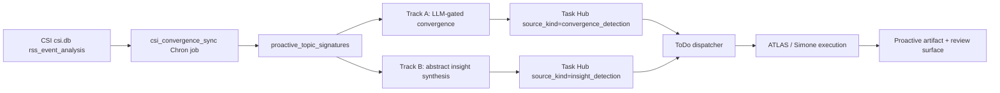

# CSI Convergence Proactivity Repair Handoff (2026-04-19)

## Purpose

This is a shareable context document for another coder taking over the CSI convergence proactivity work. It explains what changed, why it changed, what was verified, and what still needs live validation.

The work was driven by a proactive-system audit that found Universal Agent had many proactive foundations but weak producer wiring. A later CSI convergence pass added a promising producer lane, but its runtime/API/UI contracts were not aligned. This handoff documents the repair pass that aligned those contracts.

## Executive Summary

CSI convergence is now the preferred proactive producer direction because it starts from real external signals instead of reflection-only ideation. The repaired path is:



What is now repaired:

| Previous blocker | Repair |
| --- | --- |
| `gateway_server.py` imported missing `detect_and_queue_convergence_llm` | Restored async service function |
| Gateway tests expected `body["convergence"]["artifact"]`, but service returned a list | Gateway now returns both `convergence` and `convergences` |
| Backend used `source_kind='convergence_detection'` / `insight_detection`, UI mapped `convergence-brief` / `insight-brief` | ToDo UI now maps both canonical backend kinds |
| CSI sync was tied to dashboard/background refresh | Added cron-callable producer script and gateway startup registration |

## Why This Was Necessary

The CSI convergence documentation claimed an active dual-track pipeline, but source verification showed contract drift:

- The backend task source kinds were `convergence_detection` and `insight_detection`.
- The ToDo UI pill map keyed off `convergence-brief` and `insight-brief`, so real backend tasks would render as generic muted pills.
- The gateway import path referenced a missing function, so `/api/v1/dashboard/proactive-artifacts/convergence/extract` returned a 500.
- The service had moved from single-result to multi-result output, but the gateway/tests still expected a single object.
- The only discovered producer invocation was via `proactive_signals.sync_generated_cards(...)`, which is not enough for a continuous source producer.

## Files Changed

| File | Change |
| --- | --- |
| `src/universal_agent/services/proactive_convergence.py` | Added async `detect_and_queue_convergence_llm(...)` and factored shared async detection logic |
| `src/universal_agent/gateway_server.py` | Added fixed `csi_convergence_sync` Chron registration and normalized convergence endpoint responses |
| `src/universal_agent/scripts/csi_convergence_sync.py` | New cron entry point that syncs CSI signatures and writes a JSON status artifact |
| `web-ui/app/dashboard/todolist/page.tsx` | Added `convergence_detection` and `insight_detection` source-kind pill colors |
| `tests/gateway/test_proactive_artifacts_endpoint.py` | Updated gateway tests for LLM-gated convergence and full/single response shape |
| `docs/04_CSI/CSI_Convergence_Intelligence_Pipeline.md` | Updated current state, config, verification, and caveats |
| `docs/03_Operations/115_Proactive_Automation_Current_State_Audit_2026-04-18.md` | Added the follow-up status and next live-validation work |

## Code Reference Map

Use these exact locations when reviewing the repair:

- `detect_and_queue_convergence(...)` synchronous wrapper and async implementation: file:///home/kjdragan/lrepos/universal_agent/src/universal_agent/services/proactive_convergence.py#L237
- `detect_and_queue_convergence_llm(...)` async gateway-facing function: file:///home/kjdragan/lrepos/universal_agent/src/universal_agent/services/proactive_convergence.py#L263
- CSI convergence Chron registration helper: file:///home/kjdragan/lrepos/universal_agent/src/universal_agent/gateway_server.py#L16490
- Gateway startup hook that ensures the Chron job after Chron starts: file:///home/kjdragan/lrepos/universal_agent/src/universal_agent/gateway_server.py#L13675
- Convergence signature endpoint response with `convergence` and `convergences`: file:///home/kjdragan/lrepos/universal_agent/src/universal_agent/gateway_server.py#L16873
- Convergence extract endpoint response with restored async LLM path: file:///home/kjdragan/lrepos/universal_agent/src/universal_agent/gateway_server.py#L16924
- Cron entry point: file:///home/kjdragan/lrepos/universal_agent/src/universal_agent/scripts/csi_convergence_sync.py#L1
- ToDo source-kind mapping: file:///home/kjdragan/lrepos/universal_agent/web-ui/app/dashboard/todolist/page.tsx#L332

## Runtime Contract

The gateway now ensures a fixed Chron job at startup when Chron is enabled and `UA_CSI_CONVERGENCE_CRON_ENABLED` is truthy.

| Setting | Default | Meaning |
| --- | --- | --- |
| `UA_CSI_CONVERGENCE_CRON_ENABLED` | `1` | Register the producer job |
| `UA_CSI_CONVERGENCE_CRON_EXPR` | `*/30 * * * *` | Run every 30 minutes |
| `UA_CSI_CONVERGENCE_CRON_TIMEZONE` | `America/Chicago` | Chron timezone |
| `UA_CSI_CONVERGENCE_CRON_TIMEOUT_SECONDS` | `900` | Script timeout |
| `UA_CSI_CONVERGENCE_SYNC_LIMIT` | `400` | Max CSI analysis rows per run |
| `CSI_DB_PATH` | `/var/lib/universal-agent/csi/csi.db` | Source CSI database |

The script writes a status payload to:

```text
UA_ARTIFACTS_DIR/proactive/csi_convergence/latest_sync.json
```

Expected payload shape:

```json
{
  "ok": true,
  "generated_at": "2026-04-19T00:44:59.348155+00:00",
  "csi_db_path": "/var/lib/universal-agent/csi/csi.db",
  "counts": {
    "seen": 0,
    "upserted": 0,
    "convergence_events": 0
  },
  "error": "",
  "report_path": "..."
}
```

## API Contract

Both convergence endpoints now return:

```json
{
  "status": "ok",
  "signature": {},
  "convergence": {},
  "convergences": []
}
```

`convergence` is the preferred single-object result for existing clients. `convergences` contains every result, including Track A convergence and Track B abstract insight tasks.

Selection rule:

1. Prefer the first result whose task has `source_kind == "convergence_detection"`.
2. Otherwise use the first result in the list.
3. Return `null` when no result was created.

## Verification Performed

Fresh verification from this repair pass:

```bash
uv run pytest tests/unit/test_proactive_convergence.py tests/gateway/test_proactive_artifacts_endpoint.py -q
# 12 passed in 42.36s

uv run python -m compileall src/universal_agent/services/proactive_convergence.py src/universal_agent/gateway_server.py src/universal_agent/scripts/csi_convergence_sync.py
# compiled successfully

PYTHONPATH=src UA_ACTIVITY_DB_PATH=<tmp>/activity.db CSI_DB_PATH=<tmp>/missing-csi.db UA_ARTIFACTS_DIR=<tmp>/artifacts uv run python -m universal_agent.scripts.csi_convergence_sync
# exited 0, wrote latest_sync.json, returned zero-count payload cleanly

git diff --check
# no whitespace errors
```

## Remaining Work

This repair fixed the code contract. It did not prove production behavior under real CSI volume.

Next coder should do these in order:

1. Start the gateway and verify `csi_convergence_sync` appears in the live Chron job list.
2. Run the job manually through the Chron API or dashboard.
3. Confirm `latest_sync.json` is written under the configured artifacts root.
4. Confirm `proactive_topic_signatures` rows appear in `AGENT_RUN_WORKSPACES/activity_state.db`.
5. Confirm high-strength matches create Task Hub rows with `source_kind='convergence_detection'` or `source_kind='insight_detection'`.
6. Confirm the ToDo dashboard shows green/amber pills for those rows in a real browser.
7. Add producer metrics to Ops or the CSI dashboard: seen rows, upserted signatures, Track A matches, Track B insights, tasks queued, LLM failures, skipped-by-threshold count.
8. Tune `signal_strength >= 8` only after seeing live frequency.

## Do Not Rebuild

Do not create a separate proactive pipeline. The right path is to finish this one:

- CSI generates evidence-backed candidates.
- The artifact registry stores inventory.
- Task Hub executes the selected subset.
- ToDo dispatcher owns execution.
- Feedback tunes surfacing and ranking.

The next iteration should add observability and live validation, not another producer abstraction.

