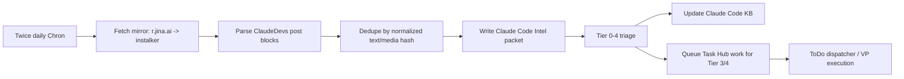

# ClaudeDevs X Intelligence Lane Design Handoff (2026-04-19)

> Status update 2026-04-19: this document is now the historical design handoff. The live source of truth for the implemented lane is [118_X_API_And_Claude_Code_Intel_Source_Of_Truth_2026-04-19.md](118_X_API_And_Claude_Code_Intel_Source_Of_Truth_2026-04-19.md).

## Purpose

This note preserves the design discussion for a proactive `@ClaudeDevs` X monitoring lane. Initial development resumed on 2026-04-19 using the X API bearer-token path rather than the earlier mirror-first fallback.

The goal is to preserve the original decision context. Current implementation details belong in doc 118.

## Requested Capability

Monitor the X account `@ClaudeDevs`, a developer-focused Anthropic/Claude account, for Claude Code updates:

- changelogs
- API releases
- community updates
- technical deep dives
- links to docs, blog posts, changelogs, examples, or release notes

The lane should turn important posts into durable work products, knowledge-base updates, Task Hub work, and, when appropriate, demo applications or private repos showing how to use new Claude Code capabilities.

## Design Decisions Reached

### 1. Dedicated Lane, Not Generic CSI

Decision: treat this as a dedicated Claude Code intelligence lane that reuses CSI/Task Hub/proactive artifact primitives but is not buried inside generic CSI.

Recommended identifiers:

| Concept | Proposed value |
| --- | --- |
| Lane | `claude_code_intel` |
| Knowledge base slug | `claude-code-intelligence` |
| Source account | `@ClaudeDevs` |
| Task Hub source kinds | `claude_code_update`, `claude_code_demo_task`, `claude_code_kb_update` |
| Artifact family | Claude Code Intel packet |

Reason: this source is narrow and strategic. It should drive follow-through, not just passive signal cards.

### 2. Every Run Produces A Packet

Decision: each run should write a durable packet, even when there is no material update.

Minimum packet:

```text
raw_mirror.md or raw_posts.json
raw_posts.json
new_posts.json
source_links.md
triage.md
actions.json
digest.md
```

This prevents silent ambiguity. A run should distinguish:

- no new posts
- mirror/source failure
- duplicate posts only
- relevant posts but no action needed
- posts that generated follow-up work

### 3. Tiered Escalation

Decision: use a tiered action ladder similar to the YouTube tutorial pipeline's concept-only vs code-worthy distinction, but tuned for Claude Code and developer implementation.

| Tier | Meaning | Output |
| --- | --- | --- |
| 0 | No material update | Packet only |
| 1 | Informational update | Packet + short digest |
| 2 | Reference update | Packet + reference notes + KB update |
| 3 | Implementation opportunity | Tier 2 + demo plan + Task Hub task for demo/repo |
| 4 | Strategic or breaking change | Impact report + migration/remediation tasks + prompt notification |

The watcher should not directly build demos inline. It should create packets and Task Hub work; ToDo/VP execution owns demos and implementation.

### 4. Knowledge Base Is Required

Decision: the lane must maintain an ongoing Claude Code knowledge base / LLM wiki.

Reason: model training cutoff knowledge will not include current Claude Code capabilities. Future agents should query the project-maintained knowledge base before implementing new Claude Code features.

The KB should include:

- normalized posts
- linked docs/articles
- release notes and changelogs
- project-specific interpretations
- demo outputs and lessons learned
- migration notes
- "how to use this in UA" patterns

## Source Access Findings

### xAI Path

The repo already has a good xAI/X search path:

- internal tool: `x_trends_posts`
- bridge file: `src/universal_agent/tools/x_trends_bridge.py`
- fallback skill: `.claude/skills/grok-x-trends`
- API env names: `GROK_API_KEY` or `XAI_API_KEY`

The tool supports `allowed_x_handles`, which fits `@ClaudeDevs`.

Current blocker found in this session:

- `GROK_API_KEY` was unset in the shell.
- `XAI_API_KEY` was unset in the shell.
- Infisical lookup did not produce either key in this session.
- Live xAI smoke failed with `missing GROK_API_KEY (or XAI_API_KEY)`.

User supplied a screenshot of a key, but it should be treated as exposed because it was visible in chat. Do not paste it into files. Rotate/delete it in xAI before production use.

### Mirror Path

Working mirror found:

```text
https://r.jina.ai/http://instalker.org/ClaudeDevs
```

This returned readable markdown for recent `@ClaudeDevs` posts without login or xAI credits.

Observed post themes included:

- Claude Code `v2.1.113` npm package shipping the native binary instead of the JavaScript build
- virtual hackathon with Opus 4.7 and API-credit prize pool
- Opus 4.7 stale safety prompt bug causing false malware warnings, with `claude update` or app relaunch as fix
- cache-miss heads-up before resuming older or long-running sessions
- `/usage` breakdown for Claude Code usage drivers
- `claude-api` skill updated for Opus 4.7 migration
- "migrate to Opus 4.7" workflow
- intro post for the account

Mirror limitations:

- The markdown did not expose stable tweet IDs or timestamps.
- Dedupe should hash normalized text and media URLs rather than rely on tweet IDs.
- The page includes related profiles/noisy sections after the main posts, so parsing must stop or filter carefully.

Other checked sources:

| Source | Result |
| --- | --- |
| `https://x.com/ClaudeDevs` via shell | logged-out shell / unreliable |
| `https://r.jina.ai/http://x.com/ClaudeDevs` | profile metadata but false "hasn't posted" result |
| Rattibha user page | Cloudflare challenge |
| TwStalker | Cloudflare challenge |
| xcancel / Nitter variants | unusable or empty |
| Search index | useful as tertiary discovery, but noisy |

## Recommended First Implementation When Resumed

Start with mirror-first ingestion, then switch primary to xAI when key/credits work.



Proposed files for future build:

| File | Purpose |
| --- | --- |
| `src/universal_agent/scripts/claude_code_intel_sync.py` | Cron entry point |
| `src/universal_agent/services/claude_code_intel.py` | Fetch, parse, dedupe, packet creation, triage helpers |
| `tests/unit/test_claude_code_intel.py` | Parser, dedupe, tiering tests |
| `tests/gateway/test_claude_code_intel_cron.py` or similar | Runtime registration tests if gateway registers fixed Chron job |
| `docs/03_Operations/...` | Implementation handoff/status doc |

Proposed cron:

| Setting | Initial value |
| --- | --- |
| Job ID | `claude_code_intel_sync` |
| Schedule | twice daily |
| Default times | morning and afternoon local time |
| Source mode | mirror-first until xAI key works |
| Output root | `UA_ARTIFACTS_DIR/proactive/claude_code_intel/` |

## Deferred Reason

Development is paused because the preferred xAI source path is not currently usable in runtime, and the user wants to wait for a working key before building the feature.

When resumed, do not restart the design discussion from scratch. Start by deciding whether to:

1. implement mirror-first ingestion immediately, or
2. first configure and smoke-test `GROK_API_KEY` / `XAI_API_KEY`.

## Resume Checklist

1. Confirm whether `GROK_API_KEY` or `XAI_API_KEY` is available in runtime without printing the value.
2. If xAI works, test:

```bash
uv run .claude/skills/grok-x-trends/scripts/grok_x_trends.py \
  --query "Claude Code" \
  --days 7 \
  --allow-handles ClaudeDevs \
  --posts-only \
  --json
```

3. If xAI does not work, test mirror:

```bash
curl -L --max-time 25 -s \
  "https://r.jina.ai/http://instalker.org/ClaudeDevs"
```

4. Build a parser from a saved fixture of the mirror markdown.
5. Create packet-writing and dedupe before any Task Hub creation.
6. Add tiered triage.
7. Add KB update path.
8. Add Task Hub generation only after packet and triage are stable.
