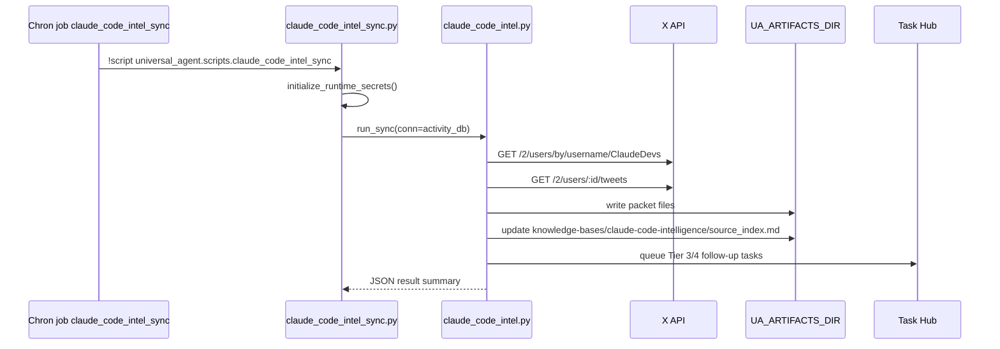
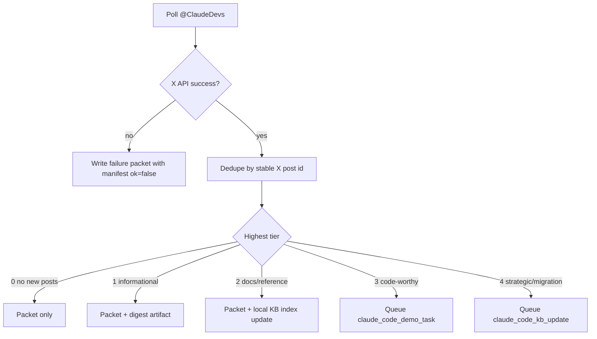

# X API And Claude Code Intel Source Of Truth (2026-04-19)

## Purpose

This is the canonical Universal Agent reference for X API development and the dedicated Claude Code intelligence lane that monitors `@ClaudeDevs`.

The lane exists because Claude Code changes faster than model training cutoffs. Agents working on Claude Code features must treat this document, the packet artifacts, and the referenced X documentation as the current source map before assuming they know the platform.

## Current Implementation

| Surface | Current state |
| --- | --- |
| Lane slug | `claude_code_intel` |
| Default source handle | `@ClaudeDevs` |
| Auth mode | X API bearer token, app-only, read-only |
| Cron job | `claude_code_intel_sync` |
| Default schedule | `0 8,16 * * *` in `America/Chicago` |
| Packet root | `<UA_ARTIFACTS_DIR>/proactive/claude_code_intel/packets/` |
| State file | `<UA_ARTIFACTS_DIR>/proactive/claude_code_intel/state.json` |
| Local KB index | `<UA_ARTIFACTS_DIR>/knowledge-bases/claude-code-intelligence/source_index.md` |
| Task Hub source kinds | `claude_code_update`, `claude_code_demo_task`, `claude_code_kb_update` |

Live validation status on 2026-04-19:

- Infisical bootstrap succeeded locally and loaded the X secrets.
- The packet-only smoke test reached `https://api.x.com/2/users/by/username/ClaudeDevs`.
- X returned `403 Client Forbidden`, so the current app/bearer token is not authorized for even user lookup yet.
- The lane still wrote a failure packet with `manifest.json` `ok=false`, which is the intended no-silent-failure behavior.
- Next operational step is to resolve X Developer Console access/credits/app permissions, then rerun the same packet-only smoke test.

Code-verified implementation points:

- `src/universal_agent/services/claude_code_intel.py` defines the lane constants, env-backed config, packet root, local KB root, X bearer token lookup, and main `run_sync()` flow. See `file:///home/kjdragan/lrepos/universal_agent/src/universal_agent/services/claude_code_intel.py#L32`.
- The poller resolves the user via `GET /2/users/by/username/{username}`, then fetches posts from `GET /2/users/{id}/tweets` with rich post/user/media fields. See `file:///home/kjdragan/lrepos/universal_agent/src/universal_agent/services/claude_code_intel.py#L233` and `file:///home/kjdragan/lrepos/universal_agent/src/universal_agent/services/claude_code_intel.py#L242`.
- Every run writes the packet files `raw_user.json`, `raw_posts.json`, `new_posts.json`, `source_links.md`, `triage.md`, `actions.json`, `digest.md`, and `manifest.json`. See `file:///home/kjdragan/lrepos/universal_agent/src/universal_agent/services/claude_code_intel.py#L514`.
- Tier 3 and Tier 4 items are queued into Task Hub; Tier 1 and Tier 2 remain packet/artifact/KB inventory only. See `file:///home/kjdragan/lrepos/universal_agent/src/universal_agent/services/claude_code_intel.py#L376`.
- The cron entry point is `python -m universal_agent.scripts.claude_code_intel_sync`. See `file:///home/kjdragan/lrepos/universal_agent/src/universal_agent/scripts/claude_code_intel_sync.py#L18`.
- Gateway startup auto-registers `claude_code_intel_sync` when Chron is enabled. See `file:///home/kjdragan/lrepos/universal_agent/src/universal_agent/gateway_server.py#L13641` and `file:///home/kjdragan/lrepos/universal_agent/src/universal_agent/gateway_server.py#L16592`.

## Runtime Flow





## X API Reference Map

Always begin with the machine-readable index:

- `https://docs.x.com/llms.txt`

Core docs used by this lane:

| Need | Official doc |
| --- | --- |
| Product overview | `https://docs.x.com/x-api/overview` |
| First bearer-token request | `https://docs.x.com/x-api/getting-started/make-your-first-request` |
| Authentication overview | `https://docs.x.com/fundamentals/authentication/overview` |
| User lookup by username | `https://docs.x.com/x-api/users/get-user-by-username` |
| User posts/timeline endpoint | Search `llms.txt` for `GET /2/users/:id/tweets` / `get-user-posts` / `get-users-id-tweets` |
| Search posts | `https://docs.x.com/x-api/posts/search/introduction` |
| Create post | `https://docs.x.com/x-api/posts/create-post` |
| Python XDK | `https://docs.x.com/tools/python-xdk` |
| Rate limits | `https://docs.x.com/x-api/fundamentals/rate-limits` |

## Auth And Infisical Contract

The current lane only needs `X_BEARER_TOKEN` for read-only app-only polling. The following secrets were added to Infisical `development`, `production`, and `local` environments on 2026-04-19:

| Secret | Use |
| --- | --- |
| `X_BEARER_TOKEN` | Read-only X API app auth used by this lane |
| `CLIENT_ID` | Generic OAuth2 client ID for official X tooling compatibility |
| `CLIENT_SECRET` | Generic OAuth2 client secret for official X tooling compatibility |
| `X_OAUTH2_CLIENT_ID` | Namespaced OAuth2 client ID |
| `X_OAUTH2_CLIENT_SECRET` | Namespaced OAuth2 client secret |
| `X_OAUTH_CONSUMER_SECRET` | OAuth1 consumer secret; not enough by itself for OAuth1 |
| `X_OAUTH_ACCESS_TOKEN` | OAuth1 user access token |
| `X_OAUTH_ACCESS_TOKEN_SECRET` | OAuth1 user access token secret |
| `X_OAUTH_CALLBACK_HOST` | Local callback host, currently `127.0.0.1` |
| `X_OAUTH_CALLBACK_PORT` | Local callback port, currently `8976` |
| `X_OAUTH_CALLBACK_PATH` | Local callback path, currently `/oauth/callback` |

Known gap: `X_OAUTH_CONSUMER_KEY` was not provided. That blocks full OAuth1 user-context usage, but it does not block read-only bearer-token polling.

## Configuration

| Env var | Default | Meaning |
| --- | --- | --- |
| `UA_CLAUDE_CODE_INTEL_CRON_ENABLED` | `1` | Auto-register the twice-daily cron job |
| `UA_CLAUDE_CODE_INTEL_CRON_EXPR` | `0 8,16 * * *` | Poll cadence |
| `UA_CLAUDE_CODE_INTEL_CRON_TIMEZONE` | `America/Chicago` | Schedule timezone |
| `UA_CLAUDE_CODE_INTEL_CRON_TIMEOUT_SECONDS` | `900` | Native script timeout |
| `UA_CLAUDE_CODE_INTEL_X_HANDLE` | `ClaudeDevs` | Source X handle |
| `UA_CLAUDE_CODE_INTEL_MAX_RESULTS` | `25` | Posts fetched per poll, bounded 5-100 |
| `UA_CLAUDE_CODE_INTEL_QUEUE_TASKS` | `1` | Queue Tier 3/4 follow-up into Task Hub |
| `UA_CLAUDE_CODE_INTEL_TIMEOUT_SECONDS` | `20` | X API request timeout |

Manual run:

```bash
PYTHONPATH=src uv run python -m universal_agent.scripts.claude_code_intel_sync
```

Packet-only manual run:

```bash
PYTHONPATH=src uv run python -m universal_agent.scripts.claude_code_intel_sync --no-task-hub
```

## Tiering Contract

| Tier | Meaning | System action |
| --- | --- | --- |
| 0 | No new posts | Packet only |
| 1 | Informational | Packet + digest artifact |
| 2 | Docs/reference/version update | Packet + local KB index update |
| 3 | Implementation/demo opportunity | Queue `claude_code_demo_task` |
| 4 | Strategic, breaking, migration, or safety issue | Queue `claude_code_kb_update` |

Tiering is heuristic in the first implementation. It is intentionally conservative about Task Hub pressure: only Tier 3 and Tier 4 items become executable tasks.

## Safety Boundary

This lane must not publish to X. The `POST /2/tweets` endpoint exists and requires user-context write auth, but the Claude Code intelligence lane is read-only unless Kevin explicitly re-authorizes a posting workflow.

When implementing future posting or interaction features, require a separate design review that covers OAuth scopes, approval gates, content policy, and anti-hallucination verification.

## Current Limitations

- No OAuth2 refresh-token flow is implemented yet.
- No media download or image/video understanding is implemented yet.
- Linked article ingestion is not yet automated; links are collected into `source_links.md` and Task Hub follow-up descriptions.
- The local KB index is a lightweight source index, not a full NotebookLM-backed external knowledge base yet.
- The first tiering model is keyword-based. A future pass should add an LLM classifier once enough real packets exist.
