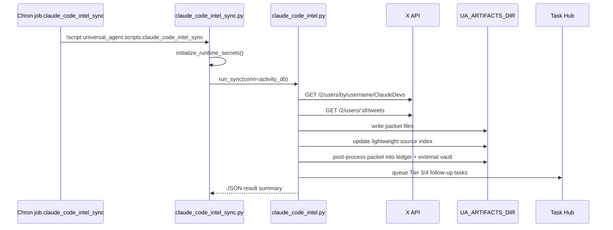
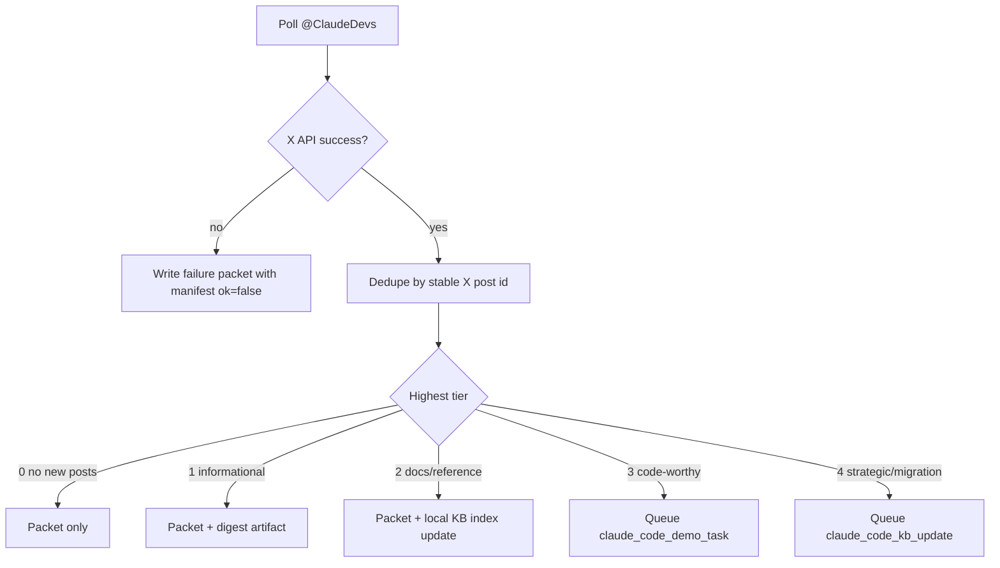
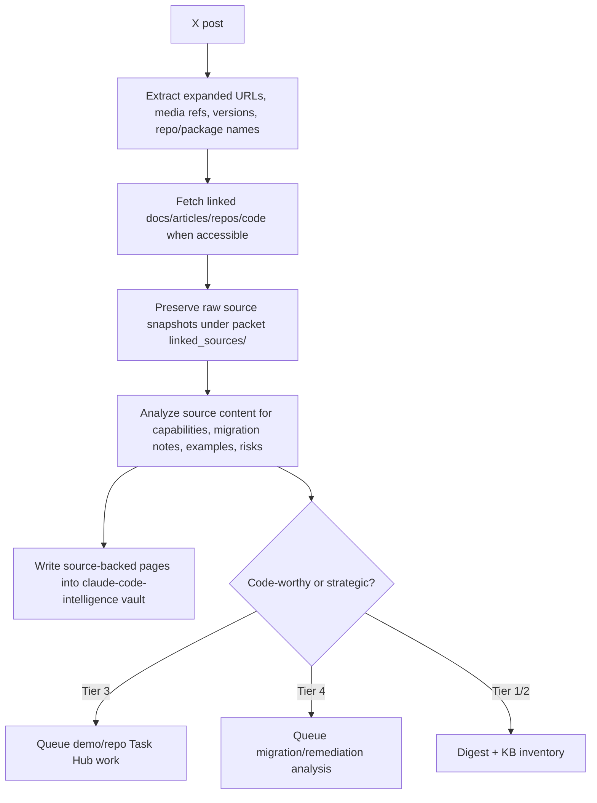

# X API And Claude Code Intel Source Of Truth (2026-04-19)

## Purpose

This is the canonical Universal Agent reference for X API development and the dedicated Claude Code intelligence lane that monitors `@ClaudeDevs`.

The lane exists because Claude Code changes faster than model training cutoffs. Agents working on Claude Code features must treat this document, the packet artifacts, and the referenced X documentation as the current source map before assuming they know the platform.

## Current Implementation

| Surface | Current state |
| --- | --- |
| Lane slug | `claude_code_intel` |
| Default source handle | `@ClaudeDevs` |
| Auth mode | X API bearer token, app-only, read-only |
| Cron job | `claude_code_intel_sync` |
| Default schedule | `0 8,16 * * *` in `America/Chicago` |
| Packet root | `<UA_ARTIFACTS_DIR>/proactive/claude_code_intel/packets/` |
| State file | `<UA_ARTIFACTS_DIR>/proactive/claude_code_intel/state.json` |
| Candidate ledger root | `<UA_ARTIFACTS_DIR>/proactive/claude_code_intel/ledger/` |
| Local KB index | `<UA_ARTIFACTS_DIR>/knowledge-bases/claude-code-intelligence/source_index.md` |
| External vault root | `<UA_ARTIFACTS_DIR>/knowledge-vaults/claude-code-intelligence/` |
| Task Hub source kinds | `claude_code_update`, `claude_code_demo_task`, `claude_code_kb_update` |

Live validation status on 2026-04-19:

- Infisical bootstrap succeeded locally and loaded the X secrets.
- The packet-only smoke test reached `https://api.x.com/2/users/by/username/ClaudeDevs`.
- X returned `403 Client Forbidden`, so the current app/bearer token is not authorized for even user lookup yet.
- The lane still wrote a failure packet with `manifest.json` `ok=false`, which is the intended no-silent-failure behavior.
- Next operational step is to resolve X Developer Console access/credits/app permissions, then rerun the same packet-only smoke test.
- Later on 2026-04-19, Kevin supplied the full X app credential set for app `main_nerfed1.py` (`app_id=28327271`, active, read/write, access token owner `@PaintersWayne`). The credential set was stored in Infisical `development`, `production`, and `local`.
- A second packet-only smoke test after storing the full credential set still returned `403 Client Forbidden` on `GET /2/users/by/username/ClaudeDevs`.
- The implementation now attempts app-only bearer first, then OAuth2 user token if `X_OAUTH2_ACCESS_TOKEN` exists, then OAuth1 user context if the OAuth1 key/token set exists.
- A third packet-only smoke test tried app-only bearer and OAuth1 user context; both returned `403 Client Forbidden`.
- `src/universal_agent/scripts/x_oauth2_bootstrap.py` now implements the official OAuth2 Authorization Code + PKCE bootstrap. It generated an authorization URL with scopes `tweet.read users.read offline.access` and persisted PKCE state under `<UA_ARTIFACTS_DIR>/proactive/claude_code_intel/oauth2/pending_oauth2.json`.
- Kevin completed OAuth2 authorization successfully. `X_OAUTH2_ACCESS_TOKEN` and `X_OAUTH2_REFRESH_TOKEN` were stored in Infisical `development`, `production`, and `local`.
- After OAuth2 success, direct endpoint diagnostics still returned `403`. X's detailed response said: `When authenticating requests to the Twitter API v2 endpoints, you must use keys and tokens from a Twitter developer App that is attached to a Project.` This means the current remaining blocker is X Developer Portal project/app attachment or API product entitlement, not Universal Agent code or missing tokens.
- On 2026-04-20, Kevin moved the app into the Pay Per Use package in the X Developer Console. The next packet-only smoke test succeeded: `GET /2/users/by/username/ClaudeDevs` returned `200`, `GET /2/users/2024518793679294464/tweets` returned `200`, and the lane wrote a successful packet with 5 new posts and 5 actions at `<UA_ARTIFACTS_DIR>/proactive/claude_code_intel/packets/2026-04-20/050815__ClaudeDevs/`.

Code-verified implementation points:

- `src/universal_agent/services/claude_code_intel.py` defines the lane constants, env-backed config, packet root, local KB root, X bearer token lookup, and main `run_sync()` flow. See `file:///home/kjdragan/lrepos/universal_agent/src/universal_agent/services/claude_code_intel.py#L32`.
- The poller resolves the user via `GET /2/users/by/username/{username}`, then fetches posts from `GET /2/users/{id}/tweets` with rich post/user/media fields. See `file:///home/kjdragan/lrepos/universal_agent/src/universal_agent/services/claude_code_intel.py#L233` and `file:///home/kjdragan/lrepos/universal_agent/src/universal_agent/services/claude_code_intel.py#L242`.
- The poller uses auth fallback order: app-only bearer, OAuth2 user access token, OAuth1 user context. See `file:///home/kjdragan/lrepos/universal_agent/src/universal_agent/services/claude_code_intel.py#L633`.
- Every run writes the packet files `raw_user.json`, `raw_posts.json`, `new_posts.json`, `source_links.md`, `triage.md`, `actions.json`, `digest.md`, and `manifest.json`. See `file:///home/kjdragan/lrepos/universal_agent/src/universal_agent/services/claude_code_intel.py#L514`.
- Tier 3 and Tier 4 items are queued into Task Hub; Tier 1 and Tier 2 remain packet/artifact/KB inventory only. See `file:///home/kjdragan/lrepos/universal_agent/src/universal_agent/services/claude_code_intel.py#L376`.
- Post classification is now LLM-assisted with deterministic fallback. Generic community/event posts are explicitly downshifted by fallback heuristics and may also be downshifted further by the LLM classifier when they lack concrete engineering implications.
- The replay/post-processing slice now exists in `src/universal_agent/services/claude_code_intel_replay.py`; it writes `linked_sources.json`, `implementation_opportunities.md`, packet candidate ledgers, preserves raw packet snapshots in the external vault, and ingests post/work-product text into `knowledge-vaults/claude-code-intelligence/`.
- The local attachment mail path now records task-scoped outbound delivery evidence during `todo_execution`, so attachment-heavy Claude Code tasks can satisfy Task Hub final-delivery verification instead of being forced into `completion_claim_missing_email_delivery` when a real AgentMail send occurred.
- Cron-created Claude Code Intel sessions are now explicitly tagged `session_role=cron`, `run_kind=cron`, and `skip_heartbeat=true`, which prevents autonomous heartbeat wake coupling from reusing the cron packet workspace as a heartbeat work surface.
- Packet candidate ledgers are now hydrated per post with deterministic task identity, current Task Hub row state, assignment ids/states/result summaries, assignment workspaces, outbound-delivery markers, email evidence ids discovered from assignment workspaces, and per-post wiki page paths.
- A historical cleanup utility now exists for already polluted Claude Code Intel cron workspaces. It archives only clearly heartbeat-specific artifacts (`heartbeat_state.json`, `work_products/heartbeat_findings_latest.json`, `work_products/system_health_latest.md`) into a timestamped `archive/claude_code_intel_cleanup_*` directory and leaves mixed `transcript.md` / `trace.json` / `run.log` untouched for forensic integrity.
- The cron entry point is `python -m universal_agent.scripts.claude_code_intel_sync`. See `file:///home/kjdragan/lrepos/universal_agent/src/universal_agent/scripts/claude_code_intel_sync.py#L18`.
- The replay/backfill entry point is `python -m universal_agent.scripts.claude_code_intel_replay_packet`. See `file:///home/kjdragan/lrepos/universal_agent/src/universal_agent/scripts/claude_code_intel_replay_packet.py#L1`.
- The OAuth2 bootstrap entry point is `python -m universal_agent.scripts.x_oauth2_bootstrap`. See `file:///home/kjdragan/lrepos/universal_agent/src/universal_agent/scripts/x_oauth2_bootstrap.py#L18`.
- Gateway startup auto-registers `claude_code_intel_sync` when Chron is enabled. See `file:///home/kjdragan/lrepos/universal_agent/src/universal_agent/gateway_server.py#L13641` and `file:///home/kjdragan/lrepos/universal_agent/src/universal_agent/gateway_server.py#L16592`.

## Runtime Flow





## Deeper Source Expansion Requirement

`@ClaudeDevs` posts are trigger events, not complete source material. The system must not treat the post text alone as the knowledge base update when the post contains links, videos, media, code references, release notes, documentation pages, GitHub repositories, package versions, or event pages.

The required evidence expansion path is:



The first delivery slice now writes `linked_sources.json`, `implementation_opportunities.md`, and packet candidate ledgers. For every linked source that can be fully reached, the packet should eventually include:

| File | Purpose |
| --- | --- |
| `linked_sources.json` | Structured URL/media/repo/package references extracted from X and later fetches |
| `linked_sources/<hash>/source.md` | Clean markdown/content extraction for the source |
| `linked_sources/<hash>/metadata.json` | URL, fetch status, content type, title, final URL, retrieved time |
| `linked_sources/<hash>/analysis.md` | Agent analysis: what changed, why it matters, implementation implications, risks |
| `implementation_opportunities.md` | Cross-source list of demos/repos/experiments worth building |

This matters because the strategic value is usually behind the post: release notes, docs pages, code examples, package changes, GitHub repositories, event pages, and media. A future agent must follow the evidence chain before creating durable Claude Code knowledge.

## Claude Code Knowledge Vault Target

The current implementation writes a lightweight index at:

```text
<UA_ARTIFACTS_DIR>/knowledge-bases/claude-code-intelligence/source_index.md
```

The next implementation step must create the real external LLM wiki vault at:

```text
<UA_ARTIFACTS_DIR>/knowledge-vaults/claude-code-intelligence/
```

The vault should follow the canonical LLM Wiki external structure:

| Vault path | Contents |
| --- | --- |
| `raw/` | Immutable X post/source snapshots |
| `sources/` | Source pages for X posts, linked docs, GitHub repos, package pages, videos, event pages |
| `concepts/` | Capabilities such as native binary packaging, cache-miss warnings, Opus 4.7 safety prompt handling |
| `entities/` | Claude Code, Opus versions, packages, tools, repositories, accounts, organizations |
| `analyses/` | Synthesis pages, implementation guidance, migration notes, demo plans |
| `assets/` | Downloaded or referenced media metadata and safe copied assets |

Agents implementing Claude Code features should query this vault before relying on model-cutoff knowledge.

Status update (2026-04-21): replay/backfill and first-pass vault population are implemented. The current slice ingests packet post summaries and optional work-product text into the external vault, and preserves raw packet snapshots under `raw/packets/`. Automatic fetching and analysis of linked external documents and repositories is still pending.

## X API Reference Map

Always begin with the machine-readable index:

- `https://docs.x.com/llms.txt`

Core docs used by this lane:

| Need | Official doc |
| --- | --- |
| Product overview | `https://docs.x.com/x-api/overview` |
| First bearer-token request | `https://docs.x.com/x-api/getting-started/make-your-first-request` |
| Authentication overview | `https://docs.x.com/fundamentals/authentication/overview` |
| User lookup by username | `https://docs.x.com/x-api/users/get-user-by-username` |
| User posts/timeline endpoint | Search `llms.txt` for `GET /2/users/:id/tweets` / `get-user-posts` / `get-users-id-tweets` |
| Search posts | `https://docs.x.com/x-api/posts/search/introduction` |
| Create post | `https://docs.x.com/x-api/posts/create-post` |
| Python XDK | `https://docs.x.com/tools/python-xdk` |
| Rate limits | `https://docs.x.com/x-api/fundamentals/rate-limits` |

## Auth And Infisical Contract

The current lane only needs `X_BEARER_TOKEN` for read-only app-only polling. The following secrets were added to Infisical `development`, `production`, and `local` environments on 2026-04-19:

| Secret | Use |
| --- | --- |
| `X_BEARER_TOKEN` | Read-only X API app auth used by this lane |
| `X_APP_NAME` / `X_API_APP_NAME` | X Developer Console app name, currently `main_nerfed1.py` |
| `X_APP_ID` / `X_API_APP_ID` | X Developer Console app ID, currently `28327271` |
| `X_APP_STATUS` | X Developer Console app status, currently `ACTIVE` |
| `X_APP_DESCRIPTION` | App description from X Developer Console |
| `X_APP_PERMISSIONS` | App permissions, currently read/write |
| `X_ACCESS_TOKEN_OWNER` | Account owning the generated OAuth1 access token, currently `@PaintersWayne` |
| `CLIENT_ID` | Generic OAuth2 client ID for official X tooling compatibility |
| `CLIENT_SECRET` | Generic OAuth2 client secret for official X tooling compatibility |
| `X_OAUTH2_CLIENT_ID` | Namespaced OAuth2 client ID |
| `X_OAUTH2_CLIENT_SECRET` | Namespaced OAuth2 client secret |
| `X_OAUTH2_ACCESS_TOKEN` | OAuth2 user-context access token created by the PKCE flow |
| `X_OAUTH2_REFRESH_TOKEN` | OAuth2 refresh token created only when `offline.access` is authorized |
| `X_OAUTH2_EXPIRES_AT` | Unix timestamp for the current OAuth2 access token expiry |
| `X_OAUTH2_SCOPE` | Authorized OAuth2 scope string |
| `X_OAUTH2_TOKEN_TYPE` | OAuth2 token type, expected `bearer` |
| `X_OAUTH_CONSUMER_KEY` | OAuth1 consumer/API key |
| `X_OAUTH_CONSUMER_SECRET` | OAuth1 consumer secret; not enough by itself for OAuth1 |
| `X_OAUTH_ACCESS_TOKEN` | OAuth1 user access token |
| `X_OAUTH_ACCESS_TOKEN_SECRET` | OAuth1 user access token secret |
| `X_OAUTH_CALLBACK_HOST` | Local callback host, currently `127.0.0.1` |
| `X_OAUTH_CALLBACK_PORT` | Local callback port, currently `8976` |
| `X_OAUTH_CALLBACK_PATH` | Local callback path, currently `/oauth/callback` |

The OAuth1 consumer-key gap was resolved on 2026-04-19. OAuth2 client ID/client secret are enough to start an OAuth2 authorization flow, but not enough by themselves to call user-context endpoints. The `x_oauth2_bootstrap.py` script exchanges the browser authorization callback for `X_OAUTH2_ACCESS_TOKEN` and `X_OAUTH2_REFRESH_TOKEN`.

## Configuration

| Env var | Default | Meaning |
| --- | --- | --- |
| `UA_CLAUDE_CODE_INTEL_CRON_ENABLED` | `1` | Auto-register the twice-daily cron job |
| `UA_CLAUDE_CODE_INTEL_CRON_EXPR` | `0 8,16 * * *` | Poll cadence |
| `UA_CLAUDE_CODE_INTEL_CRON_TIMEZONE` | `America/Chicago` | Schedule timezone |
| `UA_CLAUDE_CODE_INTEL_CRON_TIMEOUT_SECONDS` | `900` | Native script timeout |
| `UA_CLAUDE_CODE_INTEL_X_HANDLE` | `ClaudeDevs` | Source X handle |
| `UA_CLAUDE_CODE_INTEL_MAX_RESULTS` | `25` | Posts fetched per poll, bounded 5-100 |
| `UA_CLAUDE_CODE_INTEL_QUEUE_TASKS` | `1` | Queue Tier 3/4 follow-up into Task Hub |
| `UA_CLAUDE_CODE_INTEL_TIMEOUT_SECONDS` | `20` | X API request timeout |

Manual run:

```bash
PYTHONPATH=src uv run python -m universal_agent.scripts.claude_code_intel_sync
```

Packet-only manual run:

```bash
PYTHONPATH=src uv run python -m universal_agent.scripts.claude_code_intel_sync --no-task-hub
```

OAuth2 bootstrap:

```bash
PYTHONPATH=src uv run python -m universal_agent.scripts.x_oauth2_bootstrap authorize-url
```

Open the printed authorization URL in the browser, authorize the app, then exchange the callback URL:

```bash
PYTHONPATH=src uv run python -m universal_agent.scripts.x_oauth2_bootstrap exchange --callback-url '<PASTE_CALLBACK_URL>'
```

The exchange stores `X_OAUTH2_ACCESS_TOKEN`, `X_OAUTH2_REFRESH_TOKEN`, `X_OAUTH2_EXPIRES_AT`, `X_OAUTH2_SCOPE`, and `X_OAUTH2_TOKEN_TYPE` to Infisical `development`, `production`, and `local` by default.

Replay / backfill:

```bash
PYTHONPATH=src uv run python -m universal_agent.scripts.claude_code_intel_replay_packet \
  --packet-dir <UA_ARTIFACTS_DIR>/proactive/claude_code_intel/packets/YYYY-MM-DD/HHMMSS__ClaudeDevs
```

Historical cleanup for polluted cron workspaces:

```bash
PYTHONPATH=src uv run python -m universal_agent.scripts.claude_code_intel_cleanup_workspace \
  --workspace-dir <AGENT_RUN_WORKSPACES>/cron_claude_code_intel_sync
```

Apply mode:

```bash
PYTHONPATH=src uv run python -m universal_agent.scripts.claude_code_intel_cleanup_workspace \
  --workspace-dir <AGENT_RUN_WORKSPACES>/cron_claude_code_intel_sync \
  --apply
```

## Tiering Contract

| Tier | Meaning | System action |
| --- | --- | --- |
| 0 | No new posts | Packet only |
| 1 | Informational | Packet + digest artifact |
| 2 | Docs/reference/version update | Packet + local KB index update |
| 3 | Implementation/demo opportunity | Queue `claude_code_demo_task` |
| 4 | Strategic, breaking, migration, or safety issue | Queue `claude_code_kb_update` |

Tiering is heuristic in the first implementation. It is intentionally conservative about Task Hub pressure: only Tier 3 and Tier 4 items become executable tasks.

Status update (2026-04-22): tiering is no longer purely heuristic. The lane now uses:

1. deterministic fallback classification
2. optional LLM-assisted override

The fallback specifically downshifts community/event announcements (for example hackathon/application posts) out of `demo_task` unless there is stronger technical evidence. The LLM-assisted classifier can further refine this using post text plus link context.

## Replay And Backfill Contract

The first successful packet was run with `--no-task-hub`, so its five posts were marked seen but not queued into Task Hub. Replay/backfill is now implemented for the first delivery slice.

Current replay responsibilities:

- read `actions.json`, `raw_posts.json`, `new_posts.json`, and `manifest.json`
- register/reconcile the packet artifact
- optionally queue Tier 3/4 Task Hub tasks idempotently by post ID
- write `linked_sources.json`
- write `implementation_opportunities.md`
- write packet-level and lane-level candidate ledger files
- populate the external vault with post sources and optional work-product text files

Still pending in replay:

- fetch/analyze linked sources when possible
- reconcile full per-post task/assignment/email/wiki lineage

## Safety Boundary

This lane must not publish to X. The `POST /2/tweets` endpoint exists and requires user-context write auth, but the Claude Code intelligence lane is read-only unless Kevin explicitly re-authorizes a posting workflow.

When implementing future posting or interaction features, require a separate design review that covers OAuth scopes, approval gates, content policy, and anti-hallucination verification.

## Current Limitations

- OAuth2 refresh-token support exists in `x_oauth2_bootstrap.py`, but the cron lane does not yet auto-refresh expired OAuth2 access tokens before polling.
- Media download or image/video understanding is not implemented yet.
- Linked source ingestion is partially implemented: `linked_sources.json`, packet candidate ledgers, post-source vault pages, and bounded direct-link fetch snapshots are written. The replay pipeline now classifies linked sources into types such as GitHub repo/file, docs page, vendor docs, event page, X page, and generic web, and writes source-type-aware `analysis.md` guidance. Deeper repo/docs-specific extraction is still limited.
- The local KB index is a lightweight source index, not a full NotebookLM-backed external knowledge base yet.
- The first tiering model is keyword-based. A future pass should add an LLM classifier once enough real packets exist.
- The classifier is now LLM-assisted with deterministic fallback, but its input is still limited to the post text and direct link list. A future pass should incorporate richer linked-source content summaries into the classifier input.
- Packet candidate ledgers now hydrate task ids, assignment ids, assignment workspaces, outbound-delivery markers, email evidence ids from assignment workspaces, and per-post wiki page paths. Full lineage reconciliation across every historical task/artifact/email path is still evolving.
- Existing production cron workspaces that were already polluted by earlier heartbeat follow-up can now be cleaned with the dedicated cleanup utility. Mixed transcript/trace files are intentionally left in place and must still be interpreted as historically noisy.
