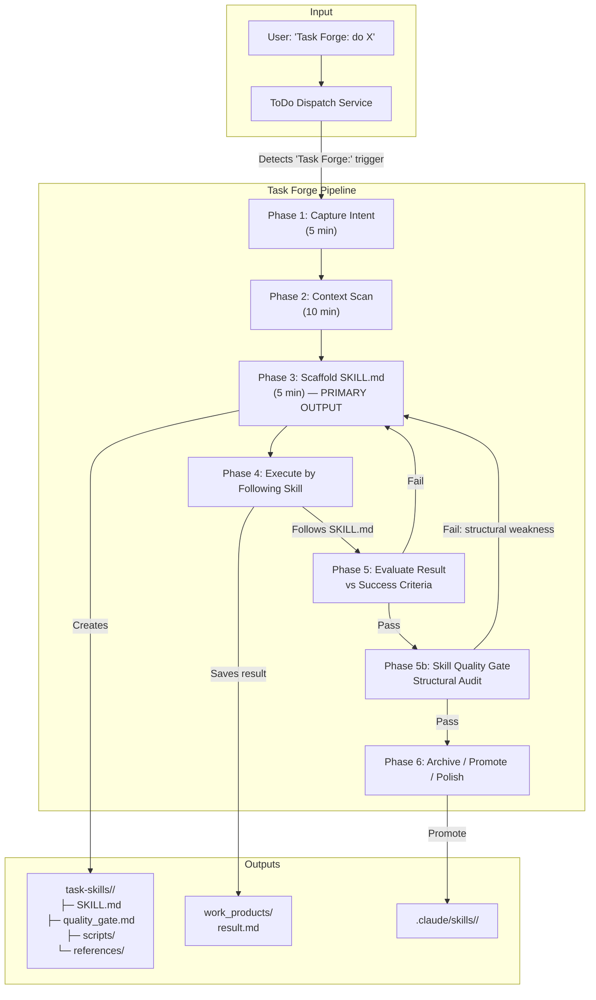
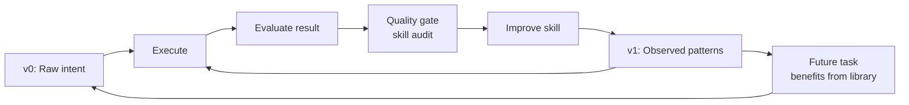

# Task Forge: Autonomous Skill Generation Pipeline

**Canonical Source of Truth** — Last updated: 2026-04-20

> Task Forge is the system that converts raw human intent into structured, reusable skills
> that agents can execute. **The skill IS the output, not just the result.**

---

## 1. Overview

Task Forge is a meta-skill: a skill whose purpose is to build other skills. It addresses a
fundamental insight about human-agent collaboration:

- **Old model:** Human architects the process → Agent executes it
- **New model:** Human describes the outcome → Agent discovers the process → Process is captured as a reusable skill

Instead of writing detailed PRDs or happy paths, the human provides intent and success criteria.
The agent explores, discovers the approach, and packages it as a structured task-skill that can
be rerun, composed, evolved, and promoted into the permanent skill library.

### Why Not Just Run Code?

A bare Python script produces a result but creates no institutional knowledge. A skill produces
the same result PLUS a reusable artifact that:

- Can be handed to a different agent in a different session
- Can be iterated and improved (v0 → v1 → v2 → v3)
- Can compose with other skills
- Can be evaluated, benchmarked, and optimized
- Persists after the session ends

**The factory vs. the product:** Task Forge builds factories, not hand-crafted products.

---

## 2. Architecture

### Component Map



### File Locations

| Artifact | Path | Purpose |
|----------|------|---------|
| Task Forge skill | `.claude/skills/task-forge/SKILL.md` | Meta-skill instructions |
| Task Forge skill (UA mirror) | `.agents/skills/task-forge/SKILL.md` | Hard-linked copy for UA discovery |
| Generated task-skills | `task-skills/<task-name>/` | Workspace for forged skills |
| Archived task-skills | `task-skills/archive/<task-name>/` | One-off skills after completion |
| Promoted skills | `.claude/skills/<task-name>/` | Graduated permanent skills |
| Work products | `<session>/work_products/` | Execution output artifacts |
| Quality gate audit | `task-skills/<task-name>/quality_gate.md` | Proof of Phase 5b audit |

### Source Files Modified

| File | What Changed |
|------|-------------|
| [`todo_dispatch_service.py`](file:///home/kjdragan/lrepos/universal_agent/src/universal_agent/services/todo_dispatch_service.py) | `TODO_DISPATCH_PROMPT` — Task Forge Workflow section, Work Product Persistence section |
| [`hooks.py`](file:///home/kjdragan/lrepos/universal_agent/src/universal_agent/hooks.py) | `_strip_heredoc_bodies()` — heredoc regex handles `<<MARKER | cmd` pattern; `python -c` inline code stripping; `on_pre_bash_inject_workspace_env` — `python` → `python3` rewrite |
| [`.claude/skills/task-forge/SKILL.md`](file:///home/kjdragan/lrepos/universal_agent/.claude/skills/task-forge/SKILL.md) | Full skill definition with all 7 phases |

---

## 3. The Skill Maturity Model

Skills don't start optimized. They earn optimization through observed use:

```
┌──────────┬──────────────────────────────────────────────────────────────┐
│ Version  │ Description                                                  │
├──────────┼──────────────────────────────────────────────────────────────┤
│ v0       │ INTENT — Goal + success criteria. 5 min investment.          │
│          │ Agent freedom: Maximum. "Here's what I need. Go figure out." │
├──────────┼──────────────────────────────────────────────────────────────┤
│ v1       │ OBSERVATION — + Extracted scripts + noted anti-patterns.     │
│          │ Agent freedom: High. "Here's what worked last time."         │
├──────────┼──────────────────────────────────────────────────────────────┤
│ v2       │ FRAMEWORK — + Decision trees + thinking frameworks.          │
│          │ Agent freedom: Medium. "Here's how to think about this."     │
├──────────┼──────────────────────────────────────────────────────────────┤
│ v3       │ PIPELINE — + Deterministic scripts + full references.        │
│          │ Agent freedom: Low. "Here's the optimized process."          │
│          │ ← This is the "happy path" — EARNED, not assumed.            │
└──────────┴──────────────────────────────────────────────────────────────┘
```

**Natural selection governs maturity:**
- One-off tasks → Born v0, archived v0
- Occasional tasks → Reach v1 when they recur
- Frequent tasks → Reach v2-v3 over time
- Dead-end tasks → Fail v0, abandoned (5 min cost)

---

## 4. Phase Details

### Phase 1: Capture Intent (5 min)

Extract four things:
1. **Goal** — What needs to happen (outcome, not process)
2. **Success Criteria** — Concrete, verifiable "done" conditions
3. **Hard Constraints** — What must NOT happen
4. **Context Pointers** — Relevant files, systems, dependencies

Ask at most 2-3 clarifying questions. Anti-pattern: over-interviewing.

### Phase 2: Quick Context Scan (10 min max)

Fast reconnaissance, not deep research:
- Grep codebase for related files (find landmines, not blueprints)
- Check existing skills for composability
- Scan relevant docs for domain knowledge

Anti-pattern: research rabbit holes.

### Phase 3: Scaffold the Task-Skill (MANDATORY)

> **The skill IS the output.** Skipping this phase is the cardinal sin of Task Forge.

Create:
```
task-skills/<task-name>/
├── SKILL.md              ← PRIMARY output (REQUIRED)
├── scripts/              ← Only for deterministic/fragile operations
└── references/           ← Only for domain knowledge the agent wouldn't know
```

The SKILL.md template:
```markdown
---
name: <task-name>
description: <one-line description>
---

# <Task Title>

## Goal
<Outcome, not process>

## Success Criteria
- Criterion 1
- Criterion 2

## Constraints
- Constraint 1

## Context
- Key file: `path/to/relevant/file.py`

## Anti-Patterns (if known)
- Don't do X because Y
```

**What makes a good skill vs. a bad one:**

| Good | Bad |
|------|-----|
| SKILL.md describes *what* and *why* | SKILL.md is just "run scripts/do_thing.py" |
| Scripts assist the .md, not replace it | Bare Python script IS the deliverable |
| Another agent could follow it cold | Only works with session-specific knowledge |
| References existing skills for composability | Reinvents wheels |
| Lean SKILL.md, heavy content in references/ | Everything in one massive file |

### Phase 4: Execute or Dispatch

| Situation | Action |
|-----------|--------|
| Simple task, can do it yourself | Execute directly by following the SKILL.md |
| Code/build task needing external workspace | Dispatch to Cody VP |
| Research/analysis task | Dispatch to Atlas VP or handle directly |
| User wants to run it themselves | Report skill location |

### Phase 5: Evaluate Result

Check result against success criteria from the SKILL.md:
- **All criteria met** → Proceed to Phase 5b
- **Some failed** → Add anti-pattern to SKILL.md → Re-execute (max 3x)

### Phase 5b: Skill Quality Gate (Updated 2026-04-20)

After the result passes, audit **the skill itself** using the skill-creator's writing guide
(`.claude/skills/skill-creator/SKILL.md`, "Skill Writing Guide" section).

> **Quality gate must produce a traceable artifact.** The agent cannot just claim "passed quality
> gate" — it must write the audit results to `task-skills/<task-name>/quality_gate.md`.

**Three required steps:**

1. **Read** `.claude/skills/skill-creator/SKILL.md` (mandatory tool call)
2. **Evaluate** 5 structural checks:

| Check | What to look for | Fail if... |
|-------|-----------------|------------|
| **Structure** | Frontmatter, Goal, Success Criteria, Context | Missing core sections |
| **Not a script wrapper** | SKILL.md describes what/why | Just says "run this script" |
| **Composable** | References existing skills | Reinvents existing capabilities |
| **Generalizable** | Another agent could follow it | Hardcoded paths/session-specific |
| **Progressive disclosure** | Lean SKILL.md (<100 lines) | Everything in one file |

3. **Write** results to `task-skills/<task-name>/quality_gate.md` including:
   - Checklist with pass/fail per check and 1-line justification
   - Improvements made (if any checks failed)
   - Observations for future runs (anti-patterns, v1 suggestions)

The `quality_gate.md` serves as both **proof of audit** and **institutional memory** — observations
from this run feed into future runs, starting the recursive learning loop.

**If any check fails:** One improvement pass to fix structure, then update quality_gate.md.

### Phase 6: Archive or Promote

| Outcome | Action |
|---------|--------|
| One-off task | Archive to `task-skills/archive/<name>/` |
| Might recur | Leave in `task-skills/` |
| Definitely recurring | Promote to `.claude/skills/<name>/` |
| Worth polishing | Hand to skill-creator for full eval/iterate |

---

## 5. The Recursive Learning Loop

Task Forge enables bounded, practical recursive self-improvement:



**Two timescales of learning:**

1. **Immediate iteration** (within a single session):
   Run → Evaluate → Add anti-pattern → Re-run → Better output → Repeat

2. **Longitudinal evolution** (across multiple uses):
   Use for Task A → Note patterns → Use for Task B → New insights → Formalize → Skill matures

The quality gate (Phase 5b) jump-starts this loop: even a small structural improvement on the
first run compounds when the skill is reused. The couple of extra minutes is not wasted because
it begins the recursive learning process that transforms one-shot scripts into institutional knowledge.

---

## 6. Dispatch Integration

### Trigger Detection

The `TODO_DISPATCH_PROMPT` in `todo_dispatch_service.py` detects Task Forge tasks via:
- Prefix: `"Task Forge:"` in the task description
- Trigger phrases: `"forge a skill"`, `"build me a skill"`, `"task forge this"`

When detected, Simone MUST read `.claude/skills/task-forge/SKILL.md` and follow all phases in order.

### Work Product Contract

All Task Forge executions produce TWO deliverables:
1. **The task-skill** — `task-skills/<name>/SKILL.md` (+ optional scripts/, references/)
2. **The work product** — `work_products/<name>.md` (the actual output)

Both must be persisted before the task is dispositioned in Task Hub.

### Hook Hardening (2026-04-20)

The following hook changes support reliable Task Forge execution:

| Hook | Change | Why |
|------|--------|-----|
| `on_pre_tool_use_task_forge_completion_gate` | **NEW** — blocks `task_hub_task_action(complete)` unless `SKILL.md` and `quality_gate.md` exist | Run #3 proved prompt instructions alone are insufficient; model reads them and shortcuts |
| `_strip_heredoc_bodies()` | Extended regex from `\s*\n` to `[^\n]*\n` after marker | Handles `cat <<'EOF' \| python` pattern |
| `_strip_heredoc_bodies()` | Added `python -c` inline code stripping | Skill names in Python literals triggered false-positive Bash denials |
| `on_pre_bash_inject_workspace_env` | Added `python` → `python3` rewrite | VPS has `python3` but no `python` symlink |
| `_prompt_is_todo_dispatch_template()` | New function (prior session) | Prevents VP routing hooks from blocking Task Forge dispatch boilerplate |

---

## 7. Relationship to Skill Creator

Task Forge and Skill Creator are complementary, not competing:

| Dimension | Task Forge | Skill Creator |
|-----------|-----------|---------------|
| **Purpose** | Get things done NOW | Build polished permanent skills |
| **Speed** | ~25 min to first execution | Hours of eval/iterate/benchmark |
| **Output** | v0 task-skill (intent + execution) | v2-v3 production skill (eval suite) |
| **Quality check** | Phase 5b lightweight structural audit | Full test cases, baselines, benchmarks |
| **When to use** | New task, one-off, or first attempt | Graduating a proven task-skill |

**The handoff:** Task Forge creates the v0. If it proves its value through reuse, Phase 6
offers a "Worth polishing?" path that hands the skill to the skill-creator for full eval/iterate
polish with test cases, baseline comparison, and description optimization.

**Phase 5b borrows** the skill-creator's structural standards (Anatomy of a Skill, Progressive
Disclosure, Writing Patterns) as a lightweight quality check — without running the full eval suite.

---

## 8. Philosophy: The Task Forge Treatise

The philosophical foundation for Task Forge is documented in a separate treatise (written
2026-04-19). Key principles:

1. **The happy path is the end of the process, not the beginning.** You don't engineer it
   upfront — you discover it through observation and refine it through iteration.

2. **The skill format is the minimum viable structure for giving an agent enough to succeed
   at anything.** SKILL.md = mission briefing. scripts/ = tools. references/ = domain knowledge.

3. **Plans are guesses. Execution is discovery.** The agent sees the codebase, the tools,
   the context — often more than the human who wrote the plan.

4. **Natural selection governs skill maturity.** One-off tasks die at v0. Recurring tasks
   earn optimization. The library evolves through actual use, not theoretical planning.

5. **The human promotes from Process Designer to Outcome Definer.** You're the CEO, not
   the project manager. Task Forge is your PM.

---

## 9. Anti-Patterns

| Anti-Pattern | Why It's Wrong | What to Do Instead |
|-------------|---------------|-------------------|
| Skipping Phase 3 | No reusable artifact; just running code | Always scaffold SKILL.md first |
| Bare Python script as output | Inflexible, opaque, can't compose/evolve | Scripts go in scripts/, driven by SKILL.md |
| Over-interviewing (>3 questions) | Delays execution; agent discovers context | Ship the v0, let agent figure it out |
| Research rabbit holes (>10 min) | Diminishing returns on context scan | Ship v0, iterate if needed |
| Pre-engineering scripts for v0 | Guessing what the agent needs | Let agent discover, extract in v1+ |
| >3 retries without human input | Problem is task definition, not execution | Escalate to user |
| Script-with-.md-wrapper | Looks like a skill but isn't composable | SKILL.md must describe what/why, not just "run X" |

---

## 10. Verification

### Run History

| Run | Date | Duration | Skills Found | Phase 3 | Phase 5b | Work Product | Notes |
|-----|------|----------|-------------|---------|----------|--------------|-------|
| #1 | 2026-04-19 | 160 min | ~40 (partial) | ❌ Skipped | N/A | ❌ Chat-only | Pre-hardening baseline |
| #2 | 2026-04-20 | 6 min | 87 (complete) | ✅ Created | ⚠️ Self-certified | ✅ Persisted | Post-hardening; quality gate claimed but no artifact |
| #3 | 2026-04-20 | 2.7 min | N/A | ❌ Skipped | ❌ Skipped | ❌ None | Read instructions, shortcut anyway — proved need for hook enforcement |
| #4 | 2026-04-20 | 5.4 min | 82 (complete) | ✅ Created | ✅ Artifact produced | ✅ Persisted | Full pipeline success: SKILL.md + quality_gate.md + work product + task hub disposition |
| #5 | Pending | — | — | — | — | — | Testing Phase 5c (optional skill improvement pass) |

### Automated Checks
- Task Forge trigger detection tested via `TODO_DISPATCH_PROMPT` pattern matching
- Hook hardening tested via existing hook test suite
- `python` → `python3` rewrite verified via regex in `on_pre_bash_inject_workspace_env`
- Heredoc regex verified to handle `<<'EOF' | python` pattern
- Completion gate hook (`on_pre_tool_use_task_forge_completion_gate`) deployed — blocks `complete` without artifacts

### Known Gaps
- Summary extraction for ~10 skills with YAML block scalar descriptions (`|`, `>`) produces truncated summaries
- Phase 5c (skill improvement pass) not yet tested — opt-in via user keywords
- Completion gate hook not yet battle-tested (Run #4 passed organically without triggering the hook)
