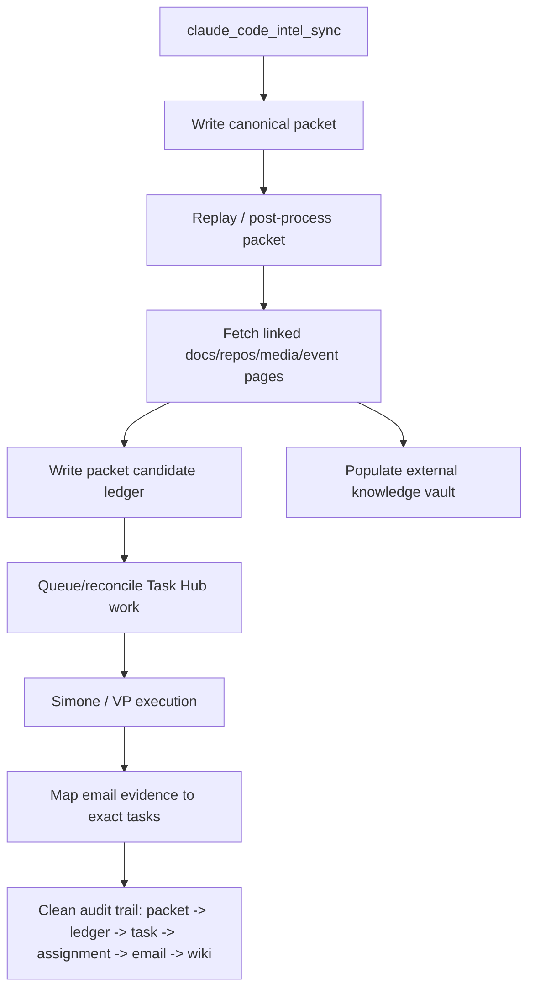
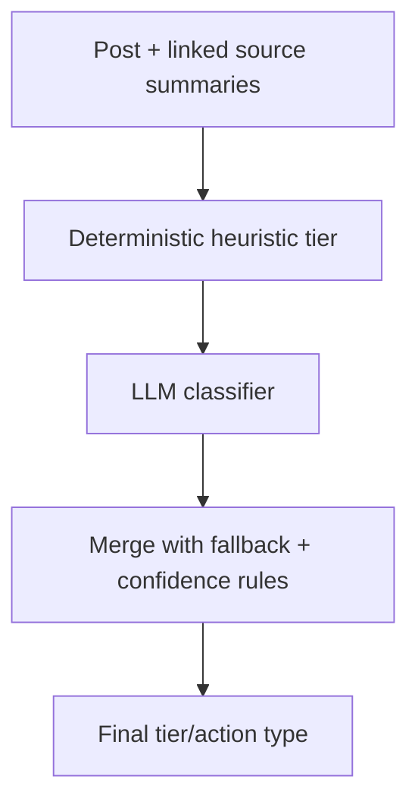

# ClaudeDevs X Intel Implementation Plan (2026-04-21)

## Purpose

This document turns the findings from the production audit in [120_ClaudeDevs_X_Intel_VPS_Runtime_Audit_2026-04-20.md](120_ClaudeDevs_X_Intel_VPS_Runtime_Audit_2026-04-20.md) into a concrete implementation plan.

Goal: move the `claude_code_intel` lane from "working X packet producer with ad hoc downstream outputs" to a durable Claude Code intelligence system with:

- idempotent replay/backfill
- linked-source expansion beyond the X post surface
- a real external knowledge vault
- a packet candidate ledger
- better Task Hub completion evidence mapping
- cleaner cron-vs-heartbeat workspace separation

This is a planning document only. It does not propose immediate runtime edits outside the scoped future phases below.

> Status update (2026-04-22): the core implementation slices through replay/backfill, first-pass external vault population, linked-source expansion, packet candidate ledger hydration, attachment-email delivery proof mapping, cron/heartbeat future isolation, historical workspace cleanup utility, and LLM-assisted classification are now implemented. The remaining work in this plan is refinement-oriented.

## Current Baseline

The implemented lane today already has:

- packet creation under `artifacts/proactive/claude_code_intel/packets/`
- dedupe by X post ID
- auth fallback order (app bearer -> OAuth2 user token -> OAuth1 user token)
- heuristic tiering
- Task Hub queueing for Tier 3/4
- a lightweight local KB index at `artifacts/knowledge-bases/claude-code-intelligence/source_index.md`

Code references:

- lane constants/config/packet write path: `file:///home/kjdragan/lrepos/universal_agent/src/universal_agent/services/claude_code_intel.py#L35`
- packet generation and state update: `file:///home/kjdragan/lrepos/universal_agent/src/universal_agent/services/claude_code_intel.py#L141`
- Task Hub queueing for Tier 3/4: `file:///home/kjdragan/lrepos/universal_agent/src/universal_agent/services/claude_code_intel.py#L428`
- current lightweight source index write: `file:///home/kjdragan/lrepos/universal_agent/src/universal_agent/services/claude_code_intel.py#L504`
- cron registration: `file:///home/kjdragan/lrepos/universal_agent/src/universal_agent/gateway_server.py#L16664`
- external wiki ingest function: `file:///home/kjdragan/lrepos/universal_agent/src/universal_agent/wiki/core.py#L704`
- KB registry path: `file:///home/kjdragan/lrepos/universal_agent/src/universal_agent/wiki/kb_registry.py#L14`
- completion review fallback on missing email evidence: `file:///home/kjdragan/lrepos/universal_agent/src/universal_agent/task_hub.py#L2948`
- local AgentMail attachment wrapper: `file:///home/kjdragan/lrepos/universal_agent/src/universal_agent/tools/local_toolkit_bridge.py#L230`
- external wiki vault contract: `file:///home/kjdragan/lrepos/universal_agent/docs/02_Subsystems/LLM_Wiki_System.md#L30`

## Desired End State



The system should let us answer, for any Claude Code update:

1. What did the X post say?
2. What deeper sources were investigated?
3. What durable wiki pages were created?
4. What Task Hub work was queued?
5. What work was completed, reviewed, blocked, or parked?
6. What email/report artifacts were actually sent?

## What Changes vs What Stays

| Area | Stays | Changes |
| --- | --- | --- |
| X API polling | Existing `claude_code_intel.py` fetch flow | Add richer post/source expansion and replay path |
| Packet structure | Keep current packet files and post-ID dedupe | Add `linked_sources/`, ledger, implementation-opportunity outputs |
| Knowledge base | Keep `source_index.md` as lightweight operator surface | Add real external vault under `knowledge-vaults/claude-code-intelligence/` |
| Task Hub queueing | Keep Tier 3/4 queueing contract | Make queueing auditable and replay-safe |
| Completion guard | Keep anti-hallucination review fallback | Improve delivery evidence association to exact task |
| Chron scheduling | Keep `claude_code_intel_sync` schedule | Split packet workspace from heartbeat follow-up workspace |

## Phase Plan

### Phase 0: Add Packet Replay / Backfill

#### Why

The first good production packet already exists, but packet-to-vault/task replay is manual and the initial success path can mark posts seen before all downstream steps are complete. The audit explicitly called this out as the first missing control surface. See `file:///home/kjdragan/lrepos/universal_agent/docs/03_Operations/120_ClaudeDevs_X_Intel_VPS_Runtime_Audit_2026-04-20.md#L150`.

#### Deliverables

- `src/universal_agent/services/claude_code_intel_replay.py`
- `src/universal_agent/scripts/claude_code_intel_replay_packet.py`
- tests for replay idempotency and ledger update

#### Responsibilities

Replay must:

- read `manifest.json`, `raw_posts.json`, `actions.json`, and `source_links.md`
- rebuild intended Tier 3/4 queue candidates
- write packet candidate ledger entries
- run linked-source expansion
- populate the external vault
- reconcile Task Hub rows idempotently by `post_id + source_kind`

#### Concrete interface

```python
def replay_packet(
    *,
    packet_dir: Path,
    conn: sqlite3.Connection | None,
    queue_task_hub: bool = True,
    expand_sources: bool = True,
    write_vault: bool = True,
) -> dict[str, Any]:
    ...
```

CLI:

```bash
PYTHONPATH=src uv run python -m universal_agent.scripts.claude_code_intel_replay_packet \
  --packet-dir <packet_dir> \
  --no-task-hub \
  --no-expand-sources \
  --no-vault
```

### Phase 1: Create The Real External Claude Code Vault

#### Why

The canonical external LLM wiki contract is `UA_ARTIFACTS_DIR/knowledge-vaults/<vault_slug>/`, not the current lightweight `knowledge-bases/.../source_index.md` helper. See:

- `file:///home/kjdragan/lrepos/universal_agent/docs/02_Subsystems/LLM_Wiki_System.md#L30`
- `file:///home/kjdragan/lrepos/universal_agent/src/universal_agent/wiki/core.py#L704`

#### Vault target

```text
<UA_ARTIFACTS_DIR>/knowledge-vaults/claude-code-intelligence/
```

#### Initial structure

```text
raw/
sources/
entities/
concepts/
analyses/
assets/
lint/
```

#### Initial page set

- `sources/x-post-<post_id>.md` for each post
- `analyses/opus-4-7-launch.md`
- `analyses/native-binary-packaging.md`
- `analyses/claude-api-migration-skill.md`
- `concepts/task-budgets.md`
- `concepts/cache-miss-warnings.md`
- `concepts/xhigh-effort.md`
- `concepts/ultrareview.md`
- `concepts/auto-mode.md`
- `concepts/managed-agents-advisor-strategy.md`

#### Concrete integration

Use `wiki_ingest_external_source(...)` for each normalized source page and update the KB registry only after the external vault path is stable.

Suggested helper:

```python
def ingest_packet_into_vault(
    *,
    packet_dir: Path,
    vault_slug: str = "claude-code-intelligence",
    root_override: str | None = None,
) -> dict[str, Any]:
    ...
```

### Phase 2: Add Linked-Source Expansion

#### Why

The strongest product requirement Kevin added is that this lane must go deeper than the post body. Posts often link to docs, repos, code examples, event pages, migration guides, or media. The system must analyze those linked sources, not just store URLs.

Current link extraction is shallow and lives in `extract_links(...)`: `file:///home/kjdragan/lrepos/universal_agent/src/universal_agent/services/claude_code_intel.py#L367`.

#### Deliverables

- `linked_sources.json` at packet root
- `linked_sources/<hash>/metadata.json`
- `linked_sources/<hash>/source.md`
- `linked_sources/<hash>/analysis.md`
- `implementation_opportunities.md`

#### Fetch strategy

For each extracted link:

1. normalize and dedupe final URL
2. classify source type:
   - docs/article
   - GitHub repo/file
   - package page
   - X media
   - event page
   - unsupported/opaque
3. fetch content with existing repo-native tooling first
4. persist fetch failure explicitly if unreachable
5. write source analysis with:
   - what changed
   - implementation implications
   - risk / migration notes
   - whether a repo/demo is warranted

#### Proposed module boundary

```python
def expand_linked_sources(
    *,
    packet_dir: Path,
    actions: list[dict[str, Any]],
) -> dict[str, Any]:
    ...
```

#### Non-goal

Do not turn this into uncontrolled crawling. Expansion should stay bounded to direct post-linked sources and their obvious canonical targets.

### Phase 3: Add Packet Candidate Ledger

#### Why

The audit showed a mismatch between:

- `queued_task_count=12`
- 12 proactive follow-up artifacts
- only 2 visible `claude_code_*` Task Hub rows later

This means packet-level candidate tracking cannot rely on Task Hub alone.

#### Ledger target

Store one durable ledger entry per candidate post/action under the packet lane root.

Suggested path:

```text
<UA_ARTIFACTS_DIR>/proactive/claude_code_intel/ledger/
```

Suggested file:

```text
ledger.jsonl
```

#### Required fields

| Field | Purpose |
| --- | --- |
| `packet_dir` | Which packet produced the candidate |
| `post_id` | Stable primary key |
| `tier` | Classifier output |
| `action_type` | `digest` / `kb_update` / `demo_task` / `strategic_follow_up` |
| `artifact_id` | Candidate proactive artifact |
| `intended_task_id` | Deterministic Task Hub id |
| `task_row_present` | Current Task Hub existence |
| `task_status` | Current/terminal status if present |
| `assignment_ids` | Task Hub assignment lineage |
| `email_evidence_ids` | Email evidence blobs or message ids |
| `wiki_pages` | Vault pages written from this source |
| `last_observed_at` | Reconciliation timestamp |

#### Concrete reconciliation routine

```python
def reconcile_packet_candidate_ledger(
    *,
    packet_dir: Path,
    conn: sqlite3.Connection | None,
) -> dict[str, Any]:
    ...
```

### Phase 4: Improve Completion Evidence Mapping

#### Why

The current Task Hub completion logic routes tasks to `needs_review` when no verified outbound email evidence is found:

- `file:///home/kjdragan/lrepos/universal_agent/src/universal_agent/task_hub.py#L2948`

That conservative behavior is correct. The problem is evidence association: one daemon run may send several emails/artifacts, but the verification signal is not currently tied strongly enough to the exact Claude Code task being completed.

#### Plan

Add per-task delivery evidence plumbing so that when `agentmail_send_with_local_attachments` is used, the runtime records:

- `task_id`
- `message_id`
- `thread_id`
- attachment paths
- work product paths
- delivery channel

Potential surfaces:

- enrich the local AgentMail wrapper output: `file:///home/kjdragan/lrepos/universal_agent/src/universal_agent/tools/local_toolkit_bridge.py#L245`
- update task completion metadata before `task_hub_task_action(complete)`
- add reconciliation that can inspect exact work-product/email mapping rather than generic outbound side effects

#### Concrete schema extension

Either:

1. extend existing `proactive_artifact_emails`, or
2. add a narrow `task_hub_delivery_evidence` table keyed by `task_id`

Recommended row shape:

```sql
task_id TEXT
message_id TEXT
thread_id TEXT
delivery_tool TEXT
attachment_paths_json TEXT
work_product_paths_json TEXT
recorded_at TEXT
```

### Phase 5: Separate Chron Packet Workspace From Heartbeat Follow-Up

#### Why

The audit found that `cron_claude_code_intel_sync` later accumulated heartbeat/system-health artifacts, making the cron workspace noisy for forensic review.

Current cron registration uses a fixed workspace:

- `file:///home/kjdragan/lrepos/universal_agent/src/universal_agent/gateway_server.py#L16664`

#### Plan

Keep the native packet cron workspace clean and move heartbeat follow-up to either:

- a dedicated heartbeat workspace, or
- a separate follow-up run id/workspace keyed to the heartbeat process

#### Options

| Option | Pros | Cons |
| --- | --- | --- |
| New heartbeat follow-up workspace | Cleanest audit separation | Requires routing change in follow-up trigger path |
| Keep same workspace but add explicit subfolder | Smaller code change | Still visually noisy and easier to confuse |
| Write heartbeat artifacts only to `UA_ARTIFACTS_DIR` | Clean cron workspace | Loses some execution/run locality |

Recommendation: dedicated heartbeat follow-up workspace.

### Phase 6: Replace Keyword Tiering With LLM-Assisted Classification

#### Why

Current tiering is driven by keyword sets:

- `_TIER2_TERMS`, `_TIER3_TERMS`, `_TIER4_TERMS`
- `file:///home/kjdragan/lrepos/universal_agent/src/universal_agent/services/claude_code_intel.py#L47`

This is good as a deterministic fallback, but generic announcements currently inflate `demo_task`.

#### Plan

Keep keyword tiering as fallback. Add an LLM classifier that outputs:

- `digest`
- `kb_update`
- `demo_task`
- `strategic_follow_up`
- confidence
- explanation

And dimensions like:

- capability update
- migration/breaking issue
- event/community update
- docs-only reference
- repo/code-example signal
- operational relevance to UA

Suggested flow:



## Phase Order And Risk

| Phase | Priority | Reason |
| --- | --- | --- |
| Replay/backfill | P0 | Lets us recover value from already-seen packets safely |
| External vault creation | P0 | Makes Claude Code knowledge durable and queryable |
| Linked-source expansion | P1 | Converts post ingestion into real research |
| Candidate ledger | P1 | Fixes auditability gap |
| Completion evidence mapping | P1 | Preserves anti-hallucination behavior while reducing false review holds |
| Workspace separation | P2 | Operational hygiene, lower functional risk |
| LLM classifier | P2 | Improves prioritization quality after durable evidence chain is in place |

## Testing Strategy

Add tests phase-by-phase:

1. replay idempotency:
   - replaying same packet twice does not duplicate tasks or ledger rows
2. linked-source expansion:
   - writes fetch metadata and preserves failures
3. vault population:
   - expected source/concept pages created
4. ledger reconciliation:
   - candidate row reflects current Task Hub/artifact/email state
5. completion evidence mapping:
   - per-task email evidence clears `completion_claim_missing_email_delivery`
6. workspace separation:
   - cron workspace remains packet-only after follow-up run
7. classifier:
   - fallback behavior preserved when LLM unavailable

## Recommended First Delivery Slice

The most leverage with the least ambiguity is:

1. `claude_code_intel_replay_packet.py`
2. packet candidate ledger
3. minimal external vault population from post text + existing work products

That gives:

- safe backfill for the 19-post production packet
- durable auditability
- a real Claude Code knowledge destination

Before deeper source crawling and before classifier upgrades.
