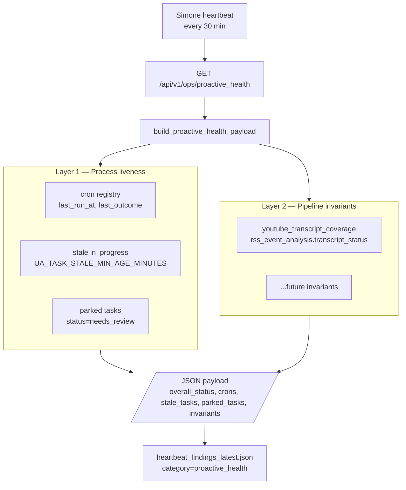

# 132 — Proactive Activity Watchdog

**Last updated:** 2026-05-18 (initial commit)

A two-layer watchdog that runs every Simone heartbeat. It exists because the YouTube digest pipeline silently produced 38/38 cards with `transcript_status='missing'` over a 7-day window — including cards whose ingest demonstrably succeeded — while every process-level health signal stayed green.

## Origin: the failure that process-level checks could not catch

- `youtube_daily_digest` cron ran nightly, exited 0, closed its `task_hub_items` row.
- `task_hub_pressure` dashboard tile stayed green.
- `cron_runs.jsonl` recorded clean exits.
- The Hermes card *did* successfully ingest a transcript.
- And yet `proactive_signals.generate_youtube_cards()` returned 100% with `transcript_status='missing'` over 7 days.

Root cause was a **cross-table architectural drift**: `youtube_daily_digest` writes to `csi_digests`, while `proactive_signals` reads from `events LEFT JOIN rss_event_analysis WHERE source='youtube_channel_rss'`. The LEFT JOIN produced NULL `transcript_status`, which `proactive_signals.py:395` coalesces to `"missing"`. No process check looked at the *content* of what the pipeline left behind.

The watchdog framework declares a second layer of checks that pipeline owners maintain: **post-condition assertions** about successful output.

## Two-layer architecture



| Layer | Catches | Misses |
|---|---|---|
| Layer 1 — process liveness | Cron not firing, workers stuck mid-task, parked protocol violations | A run that exited cleanly with corrupt or empty output |
| Layer 2 — pipeline invariants | Cross-table drift, NULL-coalesce hiding failures, semantic regression in the data | A pipeline that has no invariant declared |

Both layers are required. Process liveness without invariants is the failure mode the YouTube case demonstrated. Invariants without process liveness leaves obvious "cron stuck for 30 days" failures uncaught.

## Layer 1 — Process liveness

Source of truth: `src/universal_agent/services/proactive_health.py`.

| Section | Source | Anomaly threshold |
|---|---|---|
| `crons` | `_cron_service.list_jobs()` | (informational; surfaced for operator inspection) |
| `stale_tasks` | `SELECT task_hub_items WHERE status='in_progress' AND updated_at < now-UA_TASK_STALE_MIN_AGE_MINUTES (default 180m)` | count ≥ 1 → `warn`; count ≥ 3 → `critical` |
| `parked_tasks` | `SELECT task_hub_items WHERE status='needs_review'` | count ≥ 1 → `warn` |

Every block returns `{count, samples}` so the watchdog stays usable even when one upstream is sick.

## Layer 2 — Pipeline invariants

Source of truth: `src/universal_agent/services/pipeline_invariants.py` (runner) and `src/universal_agent/services/invariants/` (built-in invariant modules).

An **invariant** is a post-condition that should hold whenever a pipeline reports success. Each invariant is a Python function decorated with `@invariant(...)` that receives a context dict (`runtime_conn`, `csi_db_path`, ...) and returns:

- `None` → invariant holds, no finding emitted.
- `dict` with `observed_value` / `message` / optional `threshold_text` and `metadata` → anomaly, one `HeartbeatFinding` emitted (category=`proactive_health`).
- raises → runner emits a `severity='warn'` "probe_error" finding and continues; **the watchdog never crashes on a bad probe**.

### Authoring runbook — adding a new invariant

1. Create a module under `src/universal_agent/services/invariants/` (e.g. `csi_invariants.py`).
2. Import it from `src/universal_agent/services/invariants/__init__.py` so its `@invariant` decorators run on package import.
3. The probe must be fast (target < 200 ms) and read-only.
4. Add a unit test under `tests/unit/` that seeds the data store and verifies both the OK and anomaly paths.
5. Update this doc with the new invariant ID and what failure mode it catches.

Example shape:

```python
from universal_agent.services.pipeline_invariants import invariant

@invariant(
    id="my_pipeline_coherence",
    title="My pipeline coherence over last 24h",
    description="Every successful my_pipeline run should leave rows in table X.",
    severity="warn",
    runbook_command="sqlite3 ... SELECT ...",
    metadata={"pipeline": "my_pipeline"},
)
def _probe(ctx):
    conn = ctx.get("runtime_conn")
    if conn is None:
        return None
    bad_count = conn.execute("SELECT COUNT(*) FROM ...").fetchone()[0]
    if bad_count == 0:
        return None
    return {
        "observed_value": bad_count,
        "message": f"{bad_count} successful runs left no rows in X",
        "threshold_text": "expected: 0 mismatches over 24h",
    }
```

### Built-in invariants

| ID | Severity | Catches |
|---|---|---|
| `youtube_enrichment_coverage` | critical | The exact original 38/38 failure mode: events arrived in `events` but few/none have a matching row in `rss_event_analysis`. Triggers when ingest succeeded but enrichment never wrote (or wrote to a different table like `csi_digests`). |
| `youtube_transcript_coverage` | critical | Enrichment ran and wrote rows, but most carry `transcript_status != 'ok'`. The fine-grained companion to `youtube_enrichment_coverage`. |

Together these two cover both halves of the original incident: "enrichment never wrote" (caught by `youtube_enrichment_coverage`) and "enrichment wrote bad statuses" (caught by `youtube_transcript_coverage`). On any given heartbeat, either or both may fire depending on the failure shape.

## Use from Ralph loops (and other long-running work)

The runner is import-safe and exposes a pure function — Ralph loops can call it between iterations to assert their work is still making semantic progress, not just compiling cleanly:

```python
from universal_agent.services.pipeline_invariants import run_invariants
from universal_agent.services import invariants  # registers built-ins

findings = run_invariants({"csi_db_path": path_to_csi_db})
critical = [f for f in findings if f.severity == "critical"]
if critical:
    # Bail out of the loop, or surface for operator decision.
    ...
```

This is the "cursory validation not satisfied by a binary check" use case Kevin described: a Ralph loop that compiled and tested clean but produced semantically broken data would still trip its declared invariants.

## Integration with Simone's heartbeat

Simone calls `GET /api/v1/ops/proactive_health` every cycle and folds the response into `work_products/heartbeat_findings_latest.json` under `category='proactive_health'`. The full directive is in [`memory/HEARTBEAT.md`](../../memory/HEARTBEAT.md) under "Proactive Activity Watchdog". The schema for findings is shared with the existing VPS / Local health checks ([`src/universal_agent/utils/heartbeat_findings_schema.py`](../../src/universal_agent/utils/heartbeat_findings_schema.py)).

## Endpoint contract

`GET /api/v1/ops/proactive_health` — read-only, requires ops auth (`_require_ops_auth`).

```json
{
  "overall_status": "ok | warn | critical",
  "generated_at_utc": "2026-05-18T18:42:00+00:00",
  "crons": [
    {"job_id": "youtube_daily_digest", "enabled": true, "cron_expr": "0 5 * * *",
     "last_run_at": "...", "last_outcome": "ok", "next_run_at": "..."}
  ],
  "stale_tasks": {"count": 0, "samples": [], "threshold_minutes": 180},
  "parked_tasks": {"count": 0, "samples": []},
  "invariants": [
    {
      "finding_id": "invariant:youtube_transcript_coverage",
      "category": "proactive_health",
      "severity": "critical",
      "metric_key": "youtube_transcript_coverage",
      "observed_value": {"offending_days": [...], "days_inspected": 7, "window_days": 7},
      "title": "YouTube transcript coverage over last 7 days",
      "recommendation": "...",
      "runbook_command": "sqlite3 \"$UA_CSI_DB_PATH\" ..."
    }
  ]
}
```

`overall_status` derivation:

| Trigger | Result |
|---|---|
| any invariant `severity='critical'` OR `stale_tasks.count >= 3` | `critical` |
| any invariant `severity='warn'` OR `stale_tasks.count >= 1` OR `parked_tasks.count >= 1` | `warn` |
| otherwise | `ok` |

## File map

| File | Role |
|---|---|
| `src/universal_agent/services/pipeline_invariants.py` | Registry + runner |
| `src/universal_agent/services/invariants/__init__.py` | Triggers registration of built-in invariants |
| `src/universal_agent/services/invariants/youtube_invariants.py` | `youtube_transcript_coverage` invariant |
| `src/universal_agent/services/proactive_health.py` | Layer-1 + Layer-2 aggregator |
| `src/universal_agent/gateway_server.py` | Route handler for `GET /api/v1/ops/proactive_health` |
| `tests/unit/test_pipeline_invariants.py` | Runner unit tests |
| `tests/unit/test_youtube_transcript_coverage_invariant.py` | YouTube invariant integration test |
| `tests/unit/test_proactive_health_payload.py` | Aggregator payload unit tests |
| `tests/gateway/test_proactive_health_endpoint.py` | Endpoint integration tests |
| `memory/HEARTBEAT.md` § Proactive Activity Watchdog | Simone's directive |
