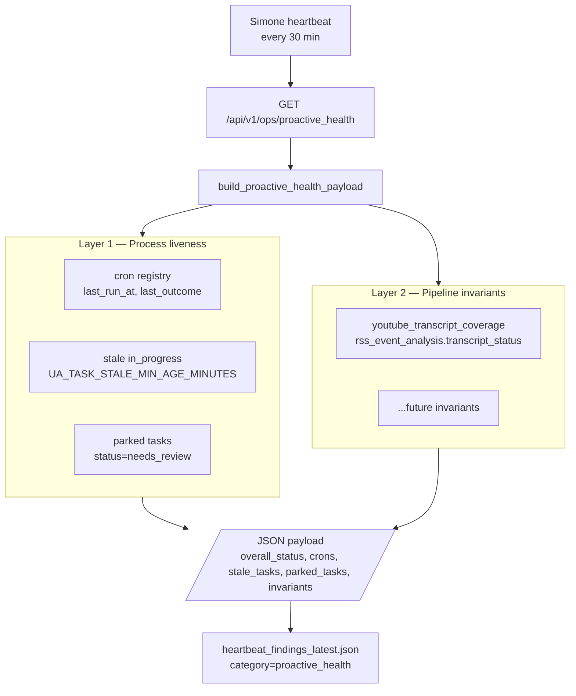

# 132 — Proactive Activity Watchdog

**Last updated:** 2026-05-20 (P0–P3 restoration) — Holistic audit and re-platforming across 6 PRs (#395–#400). Layer 1 cron list populated, Layer 2 invariants re-pointed at `activity_state.db` (was reading the empty `runtime_state.db` due to PR #376/#392 plumbing bugs), 2 new universal sweep invariants (`csi_source_liveness` covering 8 CSI sources, `cron_staleness` covering all 22 production crons), critical findings auto-park `proactive_health:*` Task Hub rows, persistent warns escalate to Task Hub after 3 ticks. See `lrepos/universal_agent/plans/create-a-plan-to-gentle-pebble.md` for the full restoration plan.

A two-layer watchdog that runs every Simone heartbeat. It exists because the YouTube digest pipeline silently produced 38/38 cards with `transcript_status='missing'` over a 7-day window — including cards whose ingest demonstrably succeeded — while every process-level health signal stayed green.

## Origin: the failure that process-level checks could not catch

- `youtube_daily_digest` cron ran nightly, exited 0, closed its `task_hub_items` row.
- `task_hub_pressure` dashboard tile stayed green.
- `cron_runs.jsonl` recorded clean exits.
- The Hermes card *did* successfully ingest a transcript.
- And yet `proactive_signals.generate_youtube_cards()` returned 100% with `transcript_status='missing'` over 7 days.

Root cause was a **cross-table architectural drift**: `youtube_daily_digest` writes to `csi_digests`, while `proactive_signals` reads from `events LEFT JOIN rss_event_analysis WHERE source='youtube_channel_rss'`. The LEFT JOIN produced NULL `transcript_status`, which `proactive_signals.py:395` coalesces to `"missing"`. No process check looked at the *content* of what the pipeline left behind.

The watchdog framework declares a second layer of checks that pipeline owners maintain: **post-condition assertions** about successful output.

## Two-layer architecture



| Layer | Catches | Misses |
|---|---|---|
| Layer 1 — process liveness | Cron not firing, workers stuck mid-task, parked protocol violations | A run that exited cleanly with corrupt or empty output |
| Layer 2 — pipeline invariants | Cross-table drift, NULL-coalesce hiding failures, semantic regression in the data | A pipeline that has no invariant declared |

Both layers are required. Process liveness without invariants is the failure mode the YouTube case demonstrated. Invariants without process liveness leaves obvious "cron stuck for 30 days" failures uncaught.

## Layer 1 — Process liveness

Source of truth: `src/universal_agent/services/proactive_health.py`.

| Section | Source | Anomaly threshold |
|---|---|---|
| `crons` | `_cron_service.list_jobs()` | (informational; surfaced for operator inspection) |
| `stale_tasks` | `SELECT task_hub_items WHERE status='in_progress' AND updated_at < now-UA_TASK_STALE_MIN_AGE_MINUTES (default 180m)` | count ≥ 1 → `warn`; count ≥ 3 → `critical` |
| `parked_tasks` | `SELECT task_hub_items WHERE status='needs_review'` | count ≥ 1 → `warn` |

Every block returns `{count, samples}` so the watchdog stays usable even when one upstream is sick.

## Layer 2 — Pipeline invariants

Source of truth: `src/universal_agent/services/pipeline_invariants.py` (runner) and `src/universal_agent/services/invariants/` (built-in invariant modules).

An **invariant** is a post-condition that should hold whenever a pipeline reports success. Each invariant is a Python function decorated with `@invariant(...)` that receives a context dict (`runtime_conn`, `csi_db_path`, ...) and returns:

- `None` → invariant holds, no finding emitted.
- `dict` with `observed_value` / `message` / optional `threshold_text` and `metadata` → anomaly, one `HeartbeatFinding` emitted (category=`proactive_health`).
- raises → runner emits a `severity='warn'` "probe_error" finding and continues; **the watchdog never crashes on a bad probe**.

### Authoring runbook — adding a new invariant

1. Create a module under `src/universal_agent/services/invariants/` (e.g. `csi_invariants.py`).
2. Import it from `src/universal_agent/services/invariants/__init__.py` so its `@invariant` decorators run on package import.
3. The probe must be fast (target < 200 ms) and read-only.
4. Add a unit test under `tests/unit/` that seeds the data store and verifies both the OK and anomaly paths.
5. Update this doc with the new invariant ID and what failure mode it catches.

Example shape:

```python
from universal_agent.services.pipeline_invariants import invariant

@invariant(
    id="my_pipeline_coherence",
    title="My pipeline coherence over last 24h",
    description="Every successful my_pipeline run should leave rows in table X.",
    severity="warn",
    runbook_command="sqlite3 ... SELECT ...",
    metadata={"pipeline": "my_pipeline"},
)
def _probe(ctx):
    conn = ctx.get("runtime_conn")
    if conn is None:
        return None
    bad_count = conn.execute("SELECT COUNT(*) FROM ...").fetchone()[0]
    if bad_count == 0:
        return None
    return {
        "observed_value": bad_count,
        "message": f"{bad_count} successful runs left no rows in X",
        "threshold_text": "expected: 0 mismatches over 24h",
    }
```

### Built-in invariants

Thirteen invariants ship today. Each fails open (returns no finding when the data store isn't deployed yet) and most have a time-of-day gate so probes don't false-fire before the underlying cron has had a chance to run.

| ID | Severity | Catches |
|---|---|---|
| `youtube_enrichment_coverage` | critical | The exact original 38/38 failure mode: events arrived in `events` but few/none have a matching row in `rss_event_analysis`. Triggers when ingest succeeded but enrichment never wrote (or wrote to a different table like `csi_digests`). |
| `youtube_transcript_coverage` | critical | Enrichment ran and wrote rows, but most carry `transcript_status != 'ok'`. The fine-grained companion to `youtube_enrichment_coverage`. |
| `csi_source_liveness` | critical | **(P1a #398)** Universal CSI adapter freshness invariant — one probe covering all 8 monitored sources (`hackernews`, `csi_analytics`, `youtube_channel_rss`, `youtube_playlist`, `reddit_discovery`, `threads_owned`, `threads_trends_seeded`, `threads_trends_broad`). Fires when any source's `max(occurred_at)` exceeds its per-source expected-max-silence threshold OR has zero events in the last 30 days. Replaces six potential per-source invariants with one finding that lists every stale source in `observed_value.stale_sources` (operator gets full picture per alert, not 6 emails). |
| `cron_staleness` | warn | **(P1b #399)** Universal cron staleness invariant — one probe covering all enabled cron jobs from `cron_jobs` context. For each cron: computes expected interval from `cron_expr` via `croniter`, compares `last_run_at` to `max(2× interval, 5 min floor)`, inspects `last_outcome`. Three failure modes: `stale` (cron stopped firing), `last_outcome_error` (ran but failed), `never_run` (registered but past first scheduled time and zero runs). Single finding lists every cron in trouble. |
| `morning_briefing_freshness` | warn | Today's `artifacts/autonomous-briefings/<YYYY-MM-DD>/DAILY_BRIEFING.md` is missing after the 6:30 AM Houston cron. Probe only checks existence at today's-dated path — mtime is irrelevant once the parent dir is today-scoped. |
| `proactive_artifact_digest_delivery` | warn | `proactive_artifact_emails` (in **`activity_state.db`** as of P0b) has no row sent within the last 30h. Means the 8:35 AM digest stopped emailing Kevin. |
| `hackernews_snapshot_cadence` | warn | No HN snapshot under `artifacts/hackernews/snapshots/` in the last 45 min during active hours (6 AM – 9:30 PM Houston). |
| `csi_convergence_sync_freshness` | warn | `MAX(detected_at)` on `proactive_convergence_events` older than 90 min (one missed 30-min cycle of grace). |
| `nightly_wiki_persistent_silence` | warn | No `artifacts/nightly_wikis/*_wiki_*` file produced in the last 7 days. Single quiet nights are legitimate (cron is "produce only on fresh signal"); a week of silence is stuck. |
| `proactive_reports_daily_trio` | warn | Fewer than 2 of the 3 daily `proactive_intelligence_reports` rows (morning / midday / afternoon) created today by 5 PM Houston. 1 missed slot is tolerated as routine API blip. Reads `activity_state.db`. |
| `claude_code_intel_packet_freshness` | warn | Newest packet under `artifacts/proactive/claude_code_intel/packets/` is more than 9h old during active hours. Means the 8 AM / 4 PM / 10 PM cron is failing. |
| `csi_demo_triage_rank_artifact` | critical | `proactive_artifacts` (in `activity_state.db`) has no row with `artifact_type='csi_demo_triage_run'` newer than 6h during active hours. Twice-daily cron — operator loses ranked CSI demo candidates. |
| `paper_to_podcast_email_delivery` | critical | No `proactive_artifact_emails` (in `activity_state.db`) row with `subject LIKE '%Papers%'` to `kevinjdragan@gmail.com` in last 30h. Operator's daily research-podcast pipeline silent. |
| `vault_lint_contradictions_monthly` | warn | No `artifacts/knowledge-vaults/*/contradiction-report-*.md` file dated current month, checked after the 2nd of the month. |

### Deliberately skipped (process-liveness only)

Five proactive systems have **process-liveness coverage** via Layer 1 + `cron_staleness` (P1b) but **no content invariant**. Documented here so the gaps are explicit:

| System | Reason |
|---|---|
| `vp_mission_pr_reconciler` | Pure Task Hub state mutation (in_progress → completed for merged PRs). No durable artifact or table row that uniquely identifies a successful run. Covered by `cron_staleness` for "stopped firing" detection. |
| `vp_coder_workspace_pruning` | Mutates filesystem only (deletes stale workspace subdirs). Success leaves no trace. Covered by `cron_staleness`. |
| `simone_chat_auto_complete` | Same shape — promotes `simone_chat` Task Hub rows in place; no artifact. Covered by `cron_staleness`. |
| `atlas_direct_dispatch` | Default OFF (`UA_ATLAS_DIRECT_DISPATCH_ENABLED=0`). Will add probe conditional on enablement once operator activates. Cron staleness checker only fires for enabled crons, so this stays quiet appropriately. |
| `architecture_canvas_drift` | Silent-success cron: only emits a file when drift detected. A probe that fires on missing file would alarm on every healthy week. Covered by `cron_staleness` for "stopped firing" detection (the more important failure mode). |

### Closed-loop notification architecture (P0c + P3)

The watchdog has **two escalation channels** that operate independently. Losing one does not lose the other.

```mermaid
flowchart TB
    Tick[Heartbeat tick<br/>every 30 min] --> Builder[build_proactive_health_payload]
    Builder --> Sidecar[sidecar JSON<br/>workspace_dir/work_products/<br/>proactive_health_latest.json]
    Builder --> Notifier[run_pre_flight_check]
    Notifier --> Email[Email channel<br/>kevinjdragan@gmail.com<br/>6h cooldown per finding_id]
    Notifier --> TaskHub[Task Hub channel<br/>upsert needs_review row<br/>task_id=proactive_health:&lt;finding_id&gt;]

    Email -. critical only .-> Email
    TaskHub -. all criticals .-> TaskHub
    TaskHub -. warns after 3 consecutive ticks .-> TaskHub

    TaskHub --> Simone[Simone heartbeat<br/>HEARTBEAT.md step 8]
    Simone --> Action[Triage:<br/>completed | blocked | investigation]
```

| Severity | Email | Task Hub |
|---|---|---|
| `critical` | ✓ (first occurrence, 6h dedup) | ✓ (every tick, upsert dedups) |
| `warn` | ✗ (would noise out criticals) | ✓ after 3 consecutive ticks |
| `ok` | ✗ | ✗ |

**Warn escalation counter:** module-level `_consecutive_warns[fingerprint]` increments every tick a warn is observed. Hits `UA_HEARTBEAT_PROACTIVE_HEALTH_WARN_ESCALATION_THRESHOLD` (default 3) → emits ONCE to Task Hub. Counters for warns absent this tick are RESET to zero — flapping warns start over.

**Task Hub dedup:** `task_hub.upsert_item` with `task_id = proactive_health:<finding_id>`. If the row is already in an active status (`open`, `needs_review`, `in_progress`), the heartbeat emit is a silent no-op (no `updated_at` churn). Simone clears completed findings by setting status to `completed` or `blocked`.

**Simone triage directive:** `memory/HEARTBEAT.md` §8 of the Proactive Activity Watchdog block tells Simone to read `metadata.runbook_command` and `metadata.recommendation`, investigate, then either close (`status=completed` with summary) or block (`status=blocked` with operator-required reason). Mass-clearing `proactive_health:*` rows without investigation is explicitly forbidden.

### Manual email-test endpoint

For operator verification that the email path is alive without waiting for a real critical finding:

```bash
curl -X POST -H "Authorization: Bearer $UA_OPS_TOKEN" \
  "http://127.0.0.1:8002/api/v1/ops/proactive_health/email_test?confirm=true&note=verify"
```

Requires `_require_ops_auth` + `?confirm=true`. Synthesizes a `[TEST]`-prefixed critical finding and routes through the same `send_email` path the watchdog uses. Returns `{sent: bool, ...}`. Bypasses dedup so repeated calls work.

### Skipped-notification observability

When the notifier can't email (e.g. `agentmail_service is None` during startup race), it logs at WARNING:

```
proactive_health: notification SKIPPED — reason=agentmail_service=None (gateway race or init pending), fingerprint='invariant:youtube_enrichment_coverage', consecutive=3
```

The `consecutive=N` counter increments per blocked tick per finding fingerprint and resets on the next successful send. Grep `journalctl -p warning | grep 'proactive_health: notification SKIPPED'` to spot blocked-email evidence.

## Use from Ralph loops (and other long-running work)

The runner is import-safe and exposes a pure function — Ralph loops can call it between iterations to assert their work is still making semantic progress, not just compiling cleanly:

```python
from universal_agent.services.pipeline_invariants import run_invariants
from universal_agent.services import invariants  # registers built-ins

findings = run_invariants({"csi_db_path": path_to_csi_db})
critical = [f for f in findings if f.severity == "critical"]
if critical:
    # Bail out of the loop, or surface for operator decision.
    ...
```

This is the "cursory validation not satisfied by a binary check" use case Kevin described: a Ralph loop that compiled and tested clean but produced semantically broken data would still trip its declared invariants.

## Integration with Simone's heartbeat

Simone calls `GET /api/v1/ops/proactive_health` every cycle and folds the response into `work_products/heartbeat_findings_latest.json` under `category='proactive_health'`. The full directive is in [`memory/HEARTBEAT.md`](../../memory/HEARTBEAT.md) under "Proactive Activity Watchdog". The schema for findings is shared with the existing VPS / Local health checks ([`src/universal_agent/utils/heartbeat_findings_schema.py`](../../src/universal_agent/utils/heartbeat_findings_schema.py)).

## Endpoint contract

`GET /api/v1/ops/proactive_health` — read-only, requires ops auth (`_require_ops_auth`).

```json
{
  "overall_status": "ok | warn | critical",
  "generated_at_utc": "2026-05-18T18:42:00+00:00",
  "crons": [
    {"job_id": "youtube_daily_digest", "enabled": true, "cron_expr": "0 5 * * *",
     "last_run_at": "...", "last_outcome": "ok", "next_run_at": "..."}
  ],
  "stale_tasks": {"count": 0, "samples": [], "threshold_minutes": 180},
  "parked_tasks": {"count": 0, "samples": []},
  "invariants": [
    {
      "finding_id": "invariant:youtube_transcript_coverage",
      "category": "proactive_health",
      "severity": "critical",
      "metric_key": "youtube_transcript_coverage",
      "observed_value": {"offending_days": [...], "days_inspected": 7, "window_days": 7},
      "title": "YouTube transcript coverage over last 7 days",
      "recommendation": "...",
      "runbook_command": "sqlite3 \"$UA_CSI_DB_PATH\" ..."
    }
  ]
}
```

`overall_status` derivation:

| Trigger | Result |
|---|---|
| any invariant `severity='critical'` OR `stale_tasks.count >= 3` | `critical` |
| any invariant `severity='warn'` OR `stale_tasks.count >= 1` OR `parked_tasks.count >= 1` | `warn` |
| otherwise | `ok` |

## File map

| File | Role |
|---|---|
| `src/universal_agent/services/pipeline_invariants.py` | Registry + runner |
| `src/universal_agent/services/invariants/__init__.py` | Triggers registration of built-in invariants |
| `src/universal_agent/services/invariants/youtube_invariants.py` | `youtube_*` invariants (2) |
| `src/universal_agent/services/invariants/proactive_pipeline_invariants.py` | Original 10 invariants (now reading `activity_conn` not the dead `runtime_conn` — fixed in P0b) |
| `src/universal_agent/services/invariants/csi_source_liveness.py` | **P1a (#398)** Universal CSI adapter freshness (1 invariant, covers 8 sources) |
| `src/universal_agent/services/invariants/cron_staleness.py` | **P1b (#399)** Universal cron staleness (1 invariant, covers all 22 enabled crons) |
| `src/universal_agent/services/proactive_health.py` | Layer-1 + Layer-2 aggregator. Reads `cron_jobs` via `CronStore.load_jobs()` fallback (P0a #395) so heartbeat daemon subprocesses see the cron list. Wires `cron_jobs` into the invariant context for `cron_staleness`. |
| `src/universal_agent/services/proactive_health_notifier.py` | Two-channel escalation: email for criticals (6h dedup), Task Hub for criticals (every tick) + warns (after 3 consecutive ticks). Module-level `_consecutive_warns` counter for warn escalation (P3). |
| `src/universal_agent/services/proactive_health_notifier.py` | Heartbeat pre-flight + email-on-critical notifier. Includes manual test endpoint helper and skip-reason logging. |
| `src/universal_agent/gateway_server.py` | Route handlers for `GET /api/v1/ops/proactive_health` and `POST /api/v1/ops/proactive_health/email_test` |
| `src/universal_agent/heartbeat_service.py` | Wires the pre-flight into `_run_heartbeat` before the skip-mode branch |
| `tests/unit/test_pipeline_invariants.py` | Runner unit tests |
| `tests/unit/test_youtube_transcript_coverage_invariant.py` | YouTube invariant integration test |
| `tests/unit/test_proactive_pipeline_invariants.py` | All other invariants' unit tests |
| `tests/unit/test_proactive_health_notifier.py` | Notifier + manual-test-helper tests |
| `tests/unit/test_proactive_health_payload.py` | Aggregator payload unit tests |
| `tests/gateway/test_proactive_health_endpoint.py` | Endpoint integration tests (GET + email_test POST) |
| `memory/HEARTBEAT.md` § Proactive Activity Watchdog | Simone's directive |
