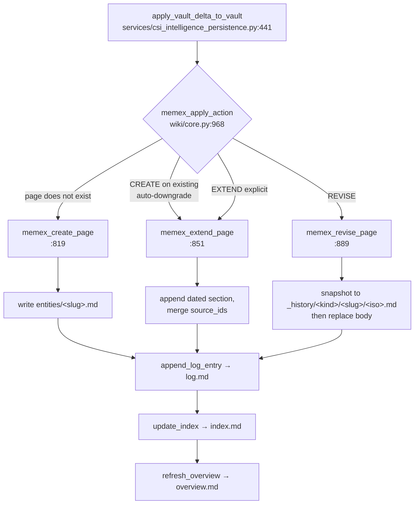
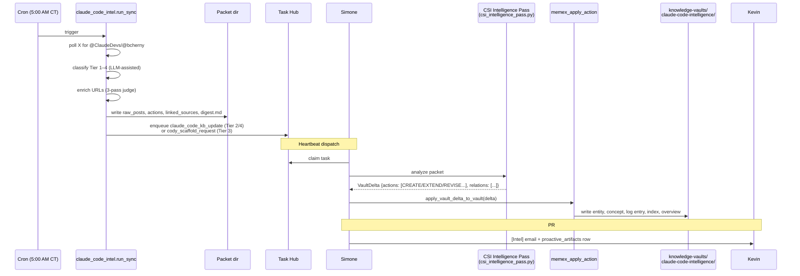
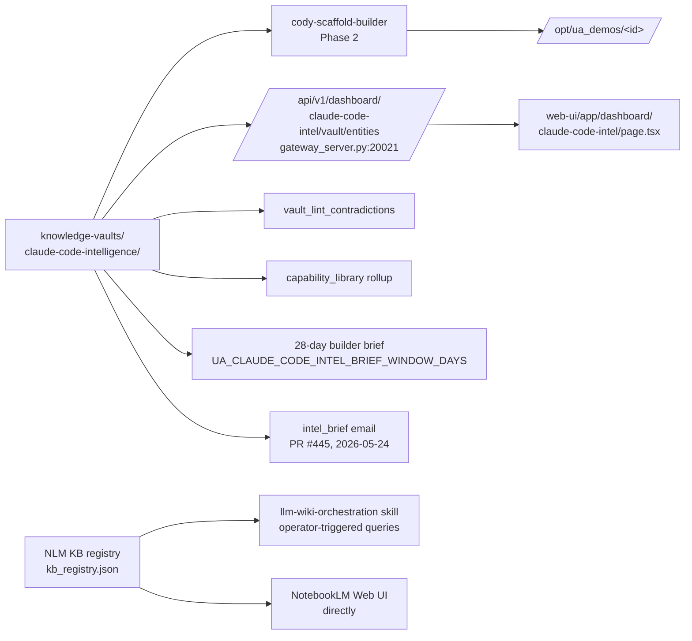

# Knowledge Vault & Wiki System — Operator Explainer

**Last updated:** 2026-05-24 (v2 — corrected NotebookLM picture; added recommended-approach section)
**Status:** Canonical operations reference. Linked from `docs/README.md` and `docs/Documentation_Status.md`.
**Companion docs:** `docs/02_Subsystems/LLM_Wiki_System.md` (canonical subsystem reference), `docs/02_Subsystems/ClaudeDevs_X_Intelligence_System.md` (CSI lane), `docs/03_Operations/109_LLM_Wiki_Implementation_Status_2026-04-06.md` (Phase 1/2/3 status).

## TL;DR

You have **three layers, not two**, that together comprise the "knowledge base / LLM wiki / vault" surface. All three are wired and currently running in production:

| Layer | Where it lives | Backed by | Triggered by | Status |
|---|---|---|---|---|
| **Memex Vault** | `artifacts/knowledge-vaults/<slug>/` (on disk, markdown + YAML + log) | Local `wiki/core.py` Memex primitives | Autonomous CSI ClaudeDevs lane (cron, daily) | **Active**, single vault: `claude-code-intelligence` |
| **NotebookLM KB Registry** | `artifacts/knowledge-bases/kb_registry.json` (slug → notebook_id pointer) | NotebookLM remote service | Operator-triggered ("Create Wiki" button) OR autonomous `nightly_wiki_agent` cron | **Active**, 9 KBs registered, nightly cron firing — **currently starved by a one-line DB-path bug, see § 10** |
| **The bridge** | `wiki_ingest_external_source` in `wiki/core.py:709` | Local Memex primitives | Called by step 6 of the NLM pipeline | **Code present, runtime evidence ambiguous** — only 1 vault on disk despite 9 NLM KBs |

The most important corrections from the v1 draft of this doc (2026-05-24 morning):

- **The NotebookLM layer is NOT dormant scaffolding.** It has 9 registered KBs and a running cron (`nightly_wiki_agent` at 3:15 AM CT) that the operator can also trigger manually via the "Create Wiki" button on each proactive signal card.
- **The two systems are designed to bridge, not stand alone.** Step 6 of the "Create Wiki" pipeline is `wiki_ingest_external_source`, which writes the NLM-generated report into a Memex vault as a `sources/` page. So NLM is the *research engine*, Memex is the *durable on-disk store*, and the bridge function unifies them.
- **The nightly cron is currently producing zero wikis** because of an `activity_state.db` vs `runtime_state.db` path mismatch (same pattern as the May-20 watchdog incident — see PRs #389–#400). 80 pending cards visible to the dashboard are invisible to the cron. **This is the #1 recommended fix in § 11.**

## 1. Concept origins

The Memex vault design and its CREATE / EXTEND / REVISE primitives intentionally adopt the *vault-as-canonical-product* and *append-dominant maintenance* model from the personal-wiki / second-brain tradition (Vannevar Bush's Memex → modern wikis like Obsidian, Logseq). I could not find an origin doc in `docs/` or `memory/` that explicitly cites Andrej Karpathy as the inspiration; one incidental mention exists (a Karpathy YouTube tutorial appears as an example use case in `docs/02_Subsystems/Mission_Control_Intelligence_System.md`). If the Karpathy framing was the original motivation, it lives in chat history rather than source-controlled docs. **Recommendation: backfill a one-paragraph origin note in `LLM_Wiki_System.md` so the design intent is durable.** Not critical.

The append-dominant intuition is captured in `docs/02_Subsystems/ClaudeDevs_X_Intelligence_System.md:128–146`:

> ~80% CREATE, ~15% EXTEND, ~5% REVISE. `raw/` and `sources/` immutable; only `entities/`, `concepts/`, `analyses/` mutable. REVISE snapshots to `_history/`.

## 2. The Memex Vault on disk

Live production location: `/opt/universal_agent/artifacts/knowledge-vaults/claude-code-intelligence/`

```
claude-code-intelligence/
├── vault_manifest.json   # schema_version, vault_kind=external, vault_slug, title, created_at, updated_at
├── index.md              # rebuilt wikilink index of every page (~800 lines today)
├── log.md                # append-only CREATE/EXTEND/REVISE journal with timestamps + reasons
├── overview.md           # rolled-up dashboard summaries
├── AGENTS.md             # which agents/skills mutate this vault
├── posts.jsonl           # raw X post records (provenance)
├── relations.jsonl       # entity ↔ concept ↔ source edges (intra-vault only)
├── entities/             # one .md per feature/capability
├── concepts/             # patterns, design principles
├── sources/              # ingested raw docs + post pages (also where NLM reports land via bridge)
├── analyses/             # CSI findings, trend writeups
├── _history/             # REVISE snapshots: <kind>/<slug>/<iso>.md
├── assets/               # images
├── raw/                  # pre-processed raw content
└── lint/                 # monthly contradiction reports
```

Each markdown page carries YAML frontmatter (`title`, `kind`, `tags`, `source_ids`, `provenance_kind`, `provenance_refs`, `confidence`, `status`, `summary`, `updated_at`). See `entities/custom-subagents.md` or `entities/workload-identity-federation.md` for representative examples.

Also present in production: `claude-code-intelligence-v1-archive/` — the pre-v2 vault preserved from before the LLM-driven extraction migration (May 2026). Reference only.

## 3. Memex primitive API

All vault mutations route through four functions in `src/universal_agent/wiki/core.py`:



Two safety properties worth knowing:

- **Auto-downgrade CREATE → EXTEND.** If the LLM analysis emits a CREATE on a page that already exists, the dispatcher converts it to an EXTEND silently.
- **REVISE snapshots before mutation.** Pre-rewrite body goes to `_history/<kind>/<slug>/<iso>.md` first. There's a monitoring invariant (`docs/proactive_signals/claudedevs_intel_v2_design.md:169`) that alerts if `_history/` fills faster than ~1 entry per ingest tick.

A separate external-source ingest path:

```python
# wiki/core.py:709
def wiki_ingest_external_source(*, vault_slug, source_title, source_content, source_id=None, root_override=None) -> dict
    # Creates vault if missing (ensure_vault("external", vault_slug, ...))
    # Runs LLM semantic extraction (entities + concepts + summary)
    # Writes a sources/<slug>.md page with provenance_kind='external_ingest'
```

This is the **bridge** between NotebookLM-generated content and the on-disk Memex vault. Anyone calling this function can materialize content from any source (NLM report, manually-curated docs, scraped pages) into a vault as a properly-tagged source page.

## 4. Producer pipeline A — CSI ClaudeDevs lane (the autonomous workhorse)



This is the high-volume, fact-grain producer. Each X post becomes a small entity or concept update. The lane is currently active and produces 0–N Task Hub items per daily poll (most polls produce nothing because of the seen-post checkpoint).

## 5. Producer pipeline B — NotebookLM "Create Wiki" flow

```mermaid
sequenceDiagram
    participant UI as Dashboard<br/>/dashboard/proactive-signals
    participant Cron as Cron (3:15 AM CT)<br/>nightly_wiki_agent
    participant DB as proactive_signal_cards<br/>(activity_state.db ⚠️)
    participant TH as Task Hub
    participant Simone
    participant NLM as NotebookLM<br/>(remote service)
    participant Reg as kb_registry.json
    participant Bridge as wiki_ingest_external_source
    participant Vault as Memex vault<br/>sources/&lt;slug&gt;.md

    Note over UI,Cron: Two entry points, same pipeline
    UI->>DB: read pending cards
    UI->>TH: operator clicks Create Wiki → enqueue task
    Cron->>DB: list_cards(status=pending, limit=100)
    Cron->>TH: enqueue tasks (UA_DAILY_PROACTIVE_WIKI_COUNT=1 by default)

    TH->>Simone: claim task
    Simone->>NLM: 1. notebook create
    Simone->>NLM: 2. research start (with topic query)
    Simone->>NLM: 3. studio generate (report + infographic)
    Simone->>Simone: 4. download artifacts → wiki_artifacts/
    Simone->>Reg: 5. kb_register(slug, notebook_id, title, tags)
    Simone->>Bridge: 6. wiki_ingest_external_source(vault_slug, report_text)
    Bridge->>Vault: write sources/&lt;slug&gt;.md with provenance
```

Defined in `src/universal_agent/proactive_signals.py:611–629` (button actions) and `src/universal_agent/scripts/nightly_wiki_agent.py:62–93` (cron objective). Both surfaces emit the exact same 6-step instruction to Simone.

This is the low-volume, deep-synthesis producer. Each pending card becomes a full NotebookLM research notebook + report + infographic + sources, with the report mirrored back into the Memex vault.

**Currently registered NotebookLM KBs (production):**

| Slug | Title | Sources | Last queried |
|---|---|---:|---|
| `agentic-harnesses` | Agentic Harnesses Knowledge Base | 88 | 2026-04-13 |
| `anthropic-mythos` | Anthropic Mythos Model | 66 | 2026-04-08 |
| `hermes-ai-desktop-app` | Hermes AI Desktop App — Self-Operating AI Agents | 46 | **2026-05-18** |
| `strongdm-dark-factory-retry` | StrongDM Dark Factory Retry | 21 | 2026-04-14 |
| `strongdm-dark-factory` | StrongDM Dark Last Try Factory | 16 | 2026-04-14 |
| `strongdm-dark-last-try-factory` | StrongDM Dark Last Try Factory | 16 | 2026-04-14 |
| `monkey-butt` | Monkey Butt — StrongDM Software Factory | 15 | 2026-04-14 |
| `claude-code-hooks` | Claude Code Hooks — Complete Guide | 10 | 2026-04-15 |
| `ai-mrna-protein-optimization` | AI Therapeutic Protein & mRNA Optimization Research | 0 | never |

You can open any of these in NotebookLM directly via their `notebook_id`. Most were created in the April 2026 burst (likely when this layer was first wired); `hermes-ai-desktop-app` is the only fresh one this month.

## 6. Producer pipeline C — Cody Phase-4 demo attachment

Separate from both A and B but worth knowing about. When Simone evaluates a Cody-built demo and the verdict is **pass**, the `vault-demo-attach` skill calls `services/cody_evaluation.py:attach_demo_to_vault_entity` (line ~380), which idempotently appends a `## Demos` bullet to the relevant `entities/<slug>.md`. This closes the entity → demo → entity loop.

## 7. Consumer side — what reads the vault



Surfaces to be aware of:
- `/dashboard/claude-code-intel` — Memex vault entity/concept tables + demo history
- `/dashboard/proactive-signals` — pending NLM cards with "Create Wiki" / "Fetch Transcript" / etc. action buttons
- `/dashboard/proactive-task-history` — task-and-artifact history including `intel_brief` rows from PR #445
- `morning_briefing` — pulls from `nightly_wiki_{today}.md` if the cron produced one
- NotebookLM web UI itself — direct access to the 9 registered notebooks

## 8. Skills inventory

| Skill | Path | Role |
|---|---|---|
| `claudedevs-x-intel` | `.claude/skills/claudedevs-x-intel/` | Phase 1 X poller and operator report writer |
| `cody-scaffold-builder` | `.claude/skills/cody-scaffold-builder/` | Phase 2 entity → demo workspace |
| `cody-progress-monitor` | `.claude/skills/cody-progress-monitor/` | Phase 4 read-only inventory of in-flight demos |
| `cody-work-evaluator` | `.claude/skills/cody-work-evaluator/` | Phase 4 demo verdict (pass/iterate/defer) |
| `vault-demo-attach` | `.claude/skills/vault-demo-attach/` | Phase 4 — append `## Demos` to entity |
| `llm-wiki-orchestration` | `.claude/skills/llm-wiki-orchestration/` | Routes operator-driven KB requests to notebooklm-operator |
| `notebooklm-orchestration` | (skill list) | Routes NotebookLM operations |
| `cody-implements-from-brief` | `.claude/skills/cody-implements-from-brief/` | Cody's implementation driver |

## 9. What's actually running (corrected status table)

| Component | Status | Evidence |
|---|---|---|
| Memex vault primitives (`wiki/core.py`) | **Active** | wiki/core.py:819–1051; vault has ~150+ entity pages |
| `claude-code-intelligence` Memex vault | **Active** (single live vault) | only directory under `knowledge-vaults/` (+ v1 archive) |
| CSI ClaudeDevs lane (autonomous poller) | **Active** | daily cron, latest packet 2026-05-22 |
| `nightly_wiki_agent` cron | **Active but starved** | runs 3:15 AM CT, exit 0, but "No pending cards" — **DB-path bug, see § 10** |
| NotebookLM KB registry | **Active**, 9 KBs registered | `kb_registry.json` present in prod |
| "Create Wiki" dashboard button | **Active** | wired in `proactive_signals.py:611–629` |
| Bridge: `wiki_ingest_external_source` | **Code exists, runtime evidence unclear** | only 1 vault on disk for 9 NLM KBs — see § 10 |
| Cody Phase 2 → 3 → 4 → vault-attach loop | **Active but rarely fires** | only 1 successful end-to-end demo (`custom-subagents__demo-1`, 2026-05-13) |
| Monthly contradiction lint | **Active** | invariant registered, monthly cadence |
| 28-day builder brief | **Active** | daily morning brief |
| `intel_brief` surfacing | **Just shipped** | PR #445 (2026-05-24) |
| `youtube-tutorials` Memex vault | **Scaffolded only, deferred** | `docs/proactive_signals/youtube_demo_unification_plan.md` |
| Internal memory vault (from canonical memory/checkpoints) | **Code exists, idle** | `wiki/core.py:sync_internal_memory_vault` not on a cron |
| `smoke-test-vault` | Test-only | not in production |

## 10. Honest faults (evidence-grounded)

### 10.1 ⚠️ CRITICAL — Nightly wiki cron reads the wrong database

**This is the same root-cause pattern as the May-20 watchdog incident** (PRs #389/#390/#392/#396 — fixed four invariants pointing at `runtime_conn` when the data lives in `activity_conn`). One callsite was missed.

`src/universal_agent/scripts/nightly_wiki_agent.py:30` opens the wrong DB:

```python
db_path = get_runtime_db_path()           # → runtime_state.db
conn = connect_runtime_db(db_path)
cards = list_cards(conn, status=CARD_STATUS_PENDING, limit=100)
# returns [] because runtime_state.db has 0 pending cards
```

**Evidence on production (this session, 2026-05-24):**

```
$ sqlite3 runtime_state.db   "SELECT status, COUNT(*) FROM proactive_signal_cards GROUP BY status"
dismissed | 20
promoted  | 11
(no pending rows)

$ sqlite3 activity_state.db  "SELECT status, COUNT(*) FROM proactive_signal_cards GROUP BY status"
deleted   | 344
pending   | 80          ← the dashboard sees these; the cron does not

$ tail -2 cron_nightly_wiki/run.log
=== cron run_id=48e8a3e8afbc … finished_at=2026-05-24T08:15:06Z exit_code=0 ===
INFO:__main__:No pending cards available for proactive wiki generation.
```

The dashboard UI writes to `activity_state.db`. The nightly cron reads from `runtime_state.db`. They diverged. The cron has been running cleanly for weeks doing nothing.

**Fix:** change `nightly_wiki_agent.py:30` to use the activity DB connection (or whatever the canonical `proactive_signals` DB resolver is — see `gateway_server._activity_connect()`). Add a regression test in `tests/unit/test_nightly_wiki_agent.py` mirroring the PR #396 pattern.

### 10.2 Bridge step 6 may not fire for NLM KBs

Of the 9 NLM KBs registered, none have a corresponding `artifacts/knowledge-vaults/<slug>/` directory on disk. The bridge `wiki_ingest_external_source` *creates* a vault if missing (`ensure_vault("external", vault_slug, …)`), so if step 6 had fired you'd see directories like `hermes-ai-desktop-app/`, `agentic-harnesses/`, etc.

Possible explanations:
- Simone is consistently skipping step 6 in practice (just registering, not ingesting back)
- The agent is calling step 6 with `vault_slug='claude-code-intelligence'` — every NLM-generated report goes into the one big vault
- Step 6 raised silently and was swallowed

**Investigation:** grep `log.md` in `claude-code-intelligence/` for `external_ingest` provenance, OR add explicit logging in `wiki_ingest_external_source` next time you run the cron.

### 10.3 9 NLM KBs, 1 Memex vault — naming / lifecycle mismatch

Even if 10.2 is resolved by routing all NLM-generated reports into the `claude-code-intelligence` vault, the slug naming pattern then becomes confusing: NLM has `hermes-ai-desktop-app` as its own KB, but the corresponding source page lives under `claude-code-intelligence/sources/`. **Decision needed:** one meta-vault for NLM reports vs one Memex vault per NLM KB. See § 11.

### 10.4 Karpathy origin undocumented

The vault design intent isn't traced in `docs/` or `memory/`. If Karpathy was the inspiration, capture a one-paragraph note in `LLM_Wiki_System.md`.

### 10.5 Internal memory vault is dormant code

`wiki/core.py:sync_internal_memory_vault` exists and the design treats it as a pillar of the system. No active cron. Either kill it from the design doc or wire it up.

### 10.6 YouTube tutorials vault deferred indefinitely

`docs/proactive_signals/youtube_demo_unification_plan.md` describes flowing YouTube tutorial creation through the same vault pattern. Deferred 2026-05-16 with gate "≥5 organic CSI tier-3 end-to-end runs first." Currently only 1 run exists.

### 10.7 No reader-side feedback wired

`proactive_artifacts.status` lifecycle (`produced → surfaced → accepted/rejected`) is in the schema, but no dashboard UI exposes it for `intel_brief` artifacts yet.

### 10.8 Memex REVISE rate not monitored

The design says alert if `_history/` fills faster than ~1/tick. I don't see a probe registered in `services/invariants/`. Worth confirming.

### 10.9 Naming overlap is real and persistent

`artifacts/knowledge-bases/<slug>/source_index.md` is unrelated to `artifacts/knowledge-bases/kb_registry.json` despite living in the same parent directory. They serve completely different purposes (a CSI Phase-0 reference bookmark vs the NLM registry). Worth a README in that directory or a rename.

## 11. Recommended approach — what to do right now

Assuming you keep the current system (NLM + Memex + bridge), here's the prioritized punch list:

### Phase A — Unblock what's broken (this week)

1. **Fix the nightly_wiki DB-path bug.** Change `nightly_wiki_agent.py:30` to point at the activity DB. One-line fix + regression test mirroring PR #396 from the May-20 watchdog incident. After the fix, the next 3:15 AM run should pick up ~80 pending cards and start producing wikis. Cap with `UA_DAILY_PROACTIVE_WIKI_COUNT=1` initially so you can review quality before raising the cap. **Estimated effort: 30 minutes.**

2. **Verify bridge step 6 actually fires.** Add explicit `logger.info("wiki_ingest_external_source: writing sources/<slug>.md to <vault_slug>")` near the start of `wiki/core.py:709`. Re-run a manual `Create Wiki` from the dashboard and confirm a new `sources/` page lands on disk. If it doesn't, the agent contract needs to be tightened. **Estimated effort: 30 minutes (1 hour with re-run).**

3. **Decide vault_slug routing for NLM-generated reports.** Two options:
   - **Option (a) — one meta-vault.** All NLM-generated reports go into a new `artifacts/knowledge-vaults/research-reports/` vault with the NLM slug as a tag. Simpler. One Memex vault to browse. Doesn't grow the per-vault directory count.
   - **Option (b) — one Memex vault per NLM KB.** Each `Create Wiki` creates both an NLM notebook AND a sibling Memex vault. Gives you the multi-vault story but adds maintenance overhead.
   - **My recommendation: Option (a)**, because the NLM notebook is already the per-topic durable artifact — duplicating that boundary in Memex adds no information. **Estimated effort to specify and ship: 1–2 hours.**

### Phase B — Make the surfacing complete (next 1–2 weeks)

4. **Apply the PR #445 intel_brief pattern to NLM wikis too.** When the nightly cron creates a wiki, you should get a `[Intel] New wiki created — <title>` email with the NLM notebook link, the on-disk report path, and a brief "what this is about" paragraph. Right now the nightly cron's only output is `nightly_wiki_{today}.md` for the morning briefing — fine as a digest but no per-wiki notification.

5. **Add reader feedback for intel_brief artifacts.** The `proactive_artifacts.status` lifecycle exists; expose `accept/reject/more-like-this` buttons in `/dashboard/proactive-task-history`. Feeds the preference model.

6. **Consolidate naming in the codebase.** Pick "vault" (Memex) or "wiki" (NLM) and use the other only for the matching system. Right now `wiki_ingest_external_source` writes a Memex vault page, which is exactly the kind of overlap that made the v1 of this doc wrong. A find-and-replace in code comments would help.

7. **Cron-staleness probe for `nightly_wiki`.** Add an invariant: if the cron has run successfully 7 days in a row but produced zero wikis, that's a critical finding (means it's starved). Same pattern as PRs #398/#399 from the May-20 watchdog work.

### Phase C — Strategic decisions (decide before investing more)

8. **Is the operator-triggered NLM flow still pulling weight?** Of the 9 registered NLM KBs, 7 are from April 2026; 1 is from May; 1 is empty. May activity is minimal. If autonomous CSI is doing the bulk of the work and operator-triggered NLM is rarely used, the NLM layer becomes maintenance burden for marginal value. Either commit to it (Phase A + B will help) or formally retire it.

9. **YouTube demo unification** (`docs/proactive_signals/youtube_demo_unification_plan.md`). The gate condition (≥5 organic CSI tier-3 runs) hasn't been met in 8 days. The nightly NLM cron is *also* processing YouTube cards in a different way. These are two paths to the same goal. Pick one. The NLM-via-`Create-Wiki` path is currently the more mature surface (despite the DB bug); the youtube_demo path would give you runnable code examples instead of research summaries.

10. **Multi-vault story.** If you commit to Option (a) from item #3, you'll still have just one Memex vault forever. That might be fine — the LLM Wiki design doc envisioned multiple, but you may not need them. Decide explicitly. If you want multiple, the YouTube vault from #9 is the natural second.

11. **Internal memory vault** (`wiki/core.py:sync_internal_memory_vault`). Either delete the function and remove it from the design doc, or wire a daily cron and confirm it produces useful output. Don't leave it as zombie code.

### Phase D — Comparison with state of the art

If you're considering a redesign:

| External pattern | Where UA Memex fits | Worth borrowing? |
|---|---|---|
| RAG over vector DB (LangChain, LlamaIndex) | Different goal entirely — Memex is curated synthesis, not retrieval | No, unless you want to *add* retrieval as a separate path alongside |
| Knowledge graph triple stores (Neo4j, RDF) | `relations.jsonl` is the lightweight version. Adding triples + SPARQL would over-engineer | No |
| GraphRAG (Microsoft) | Same intuition (LLM-synthesized graph) but with explicit triples + community detection | **Yes** — community detection could replace some manual entity-merge work |
| Obsidian + dataview | Memex is fully Obsidian-compatible by design | Already aligned |
| Personal wikis (Logseq, Roam) | Block-level granularity. Memex is page-level | Trade-off; current page-level is simpler and cleaner for provenance |

**Bottom line:** the current architectural choice (markdown + frontmatter + LLM-driven `VaultDelta` decisions) is sound for *durable curated intelligence about a slow-moving domain*. The faults above are implementation issues, not design issues. Don't rebuild — fix and complete.

## 12. Suggested next reads

If you want to keep going on this thread:

1. **Read `docs/02_Subsystems/LLM_Wiki_System.md`** — the canonical subsystem reference. Check if anything is stale relative to this doc.
2. **Read `docs/proactive_signals/knowledge_extraction_redesign_context_2026-05-07.md`** — explains *why* the design moved from regex extraction to LLM-driven `VaultDelta`. Important for v2 → v3.
3. **Walk one entity end-to-end.** Open `entities/workload-identity-federation.md`, trace backward to its packet at `artifacts/proactive/claude_code_intel/packets/2026-05-04/210008__ClaudeDevs/`. Compare raw post + linked source + classifier output to the resulting entity body. Tells you whether synthesis quality is acceptable.
4. **Trigger one NLM wiki manually** — pick a pending YouTube card on the dashboard, click "Create Wiki", watch the workflow end-to-end. Confirm step 6 (`wiki_ingest_external_source`) actually fires. Decision-grade evidence for § 10.2.
5. **Decide on items 8, 9, 10 in § 11** before any more investment.

---

*Generated 2026-05-24. v2 of this doc — v1 incorrectly characterized the NotebookLM layer as dormant. Canonical from this point forward; linked from `docs/README.md` and `docs/Documentation_Status.md`.*
