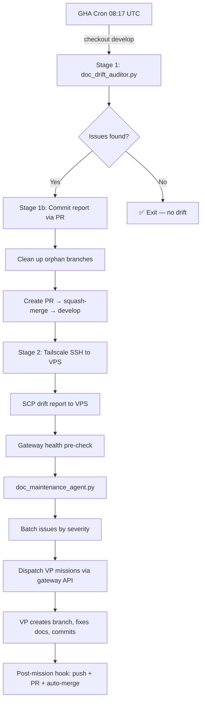

# Documentation Drift Maintenance Pipeline

**Canonical reference for the automated documentation maintenance system.**
**Last updated:** 2026-03-28

## Overview

The Documentation Drift Maintenance Pipeline is a two-stage automated system that detects and remediates documentation drift (where code changes but corresponding documentation is not updated).

| Stage | Script | Trigger | Purpose |
|-------|--------|---------|---------|
| Stage 1 | `doc_drift_auditor.py` | GHA scheduled workflow (~3:17 AM CDT) | Analyzes git co-change patterns, produces drift report |
| Stage 1b | GHA workflow (inline) | Immediately after audit | Commits report to `develop` via auto-merged PR |
| Stage 2 | `doc_maintenance_agent.py` | GHA workflow (inline via Tailscale SSH) | Consumes drift report, dispatches VP fix missions |



## Architecture

### Stage 1: Drift Auditor

- **Script:** `src/universal_agent/scripts/doc_drift_auditor.py`
- **Runtime:** GitHub Actions (zero LLM, pure Python deterministic)
- **Output:** `artifacts/doc-drift-reports/<YYYY-MM-DD>/drift_report.json` + `DRIFT_REPORT.md`
- **Commit:** Report is committed to `develop` via auto-merged PR (see Report Persistence below)

#### Checks Performed

| # | Check | Severity | Description |
|---|-------|----------|-------------|
| 1 | Git Change Scanner | — | Identifies files changed in last 24h, categorized by code area |
| 2 | Index Health | P0/P1 | Bidirectional sync between docs on disk and README/Status indexes |
| 3 | Internal Links | P1 | Verifies all markdown links in `docs/` resolve to existing files |
| 4 | Glossary Drift | P2 | Flags new technical terms appearing frequently but not in glossary |
| 5 | Deployment Co-change | P0 | Enforces deploy workflow → deploy docs co-update rule |
| 6 | Agentic File Drift | P1 | Checks if agent code changed without AGENTS.md/workflow updates |
| 7 | Code-Doc Cross-ref | P2 | Flags code areas that changed without corresponding doc updates |

### Stage 1b: Report Persistence (PR-Based Auto-Merge)

The drift report cannot be pushed directly to `develop` because branch protection requires a pull request. The GHA workflow:

1. Cleans up any orphan `chore/drift-report-*` branches from previous failed runs
2. Creates a temporary branch `chore/drift-report-<YYYY-MM-DD>`
3. Commits the report files on that branch
4. Pushes the branch (no protection on non-`develop` branches)
5. Creates a PR targeting `develop` via `gh pr create`
6. Applies the `automated` label (best-effort, non-blocking)
7. Auto-merges immediately via `gh pr merge --squash --admin`
8. Deletes the temporary branch after merge

The squash merge keeps `develop` history clean. If auto-merge fails, the PR remains open for manual merge and Stage 2 proceeds regardless.

| Permission | Required For |
|------------|-------------|
| `contents: write` | Push temp branch, merge PR |
| `pull-requests: write` | Create and merge PR via `gh` CLI |

### Stage 2: Maintenance Agent

- **Script:** `src/universal_agent/scripts/doc_maintenance_agent.py`
- **Trigger:** Invoked inline by GHA workflow via Tailscale SSH to VPS, immediately after Stage 1
- **Execution:** On VPS, dispatches VP missions via gateway HTTP API
- **Pre-flight:** Gateway health check before dispatch to catch unavailability early
- **Condition:** Only runs when Stage 1 found issues (exit code ≠ 0)

#### Why Stage 2 Runs Inline (Not After Deploy)

The VP agent does not need the drift report to exist in the deployed codebase — it receives the full objective text in the dispatch payload. Stage 2 copies the report directly to the VPS via SCP, which is more robust than waiting for the full deploy pipeline. The VP reads source code from the VPS production repo, which already has the latest `develop` code from the most recent staging deploy.

#### Gateway Dispatch

The maintenance agent dispatches VP missions through the gateway HTTP API:

```
POST /api/v1/ops/vp/missions/dispatch
```

Gateway URL resolution order:
1. `UA_GATEWAY_URL` environment variable
2. `http://localhost:8002` (ops API on VPS)
3. `http://localhost:8001` (main gateway on VPS)
4. `https://app.clearspringcg.com` (public fallback)

#### VP Mission Parameters

| Parameter | Value |
|-----------|-------|
| `vp_id` | `vp.coder.primary` |
| `mission_type` | `doc-maintenance` |
| `reply_mode` | `async` |
| `priority` | `100` |
| `execution_mode` | `sdk` |

## Issue Batching

The agent batches issues by severity to prevent agent stalling (observed with 30KB+ payloads containing 75+ issues):

- **Maximum issues per batch:** 15
- **Severity order:** P0 → P1 → P2
- **Batch naming:** `docs/<severity>-fix-<date>` (with alpha suffix for multiple batches: `-a`, `-b`, etc.)

### Fix Instructions by Category

| Category | Instruction |
|----------|-------------|
| `index_dead_entry` | Remove stale entry from both index files. If file was moved, update the link. |
| `index_orphan` | Add to both `docs/README.md` and `docs/Documentation_Status.md` in the correct section. |
| `broken_link` | Fix the broken link or remove if target was intentionally deleted. |
| `glossary_candidate` | Add project-specific terms to `docs/Glossary.md`. Skip generic terms. |
| `deploy_cochange_violation` | Update `docs/deployment/` to reflect current deployment behavior. |
| `agentic_drift` | Update `AGENTS.md` or workflow/SKILL.md files to match code changes. |
| `code_doc_drift` | Update docs to accurately reflect current code behavior. |

## Retry Logic

The agent implements retry with exponential backoff for gateway unavailability:

| Attempt | Delay |
|---------|-------|
| 1 | Immediate |
| 2 | 30 seconds |
| 3 | 60 seconds |

If all retries fail, the agent exits with code 1 and the health check will alert Simone.

## VP Mission Workflow

The dispatched VP agent performs:

1. **Branch Creation:** `docs/<severity>-fix-<date>`
2. **Verification:** For each issue, read current doc + source code to confirm drift
3. **Fix:** Only edit files that are genuinely stale
4. **Commit:** Descriptive message with skipped items noted
5. **No Push:** Build system handles push and PR creation automatically

### Verify Before Fixing (Critical)

The drift report uses heuristics and may flag false positives. The VP agent must:

1. Read the current content of the referenced doc file
2. Read the relevant source code
3. Compare: Does the documentation already accurately describe the current code?
4. If YES → Skip this issue, note in commit body
5. If NO → Fix the documentation

### Fast-Skip Rules

Some categories have high false-positive rates:

- **glossary_candidate:** Skip generic programming keywords (SQL, infra terms, stdlib names). Only add terms genuinely unique to this project.
- **code_doc_drift:** Read current docs first. If they already accurately describe code behavior, skip. The audit flags co-change absence, not actual staleness.
- **agentic_drift:** Check if AGENTS.md was recently updated. If current content is accurate, skip.

## Artifact Locations

| Artifact | Path |
|----------|------|
| Drift reports | `artifacts/doc-drift-reports/<date>/drift_report.json` |
| GHA artifacts | Downloaded via `gh run download` → `drift-report-<date>` |
| VPS staging path | `/opt/universal-agent-staging/artifacts/doc-drift-reports/` |
| VPS production path | `/opt/universal_agent/artifacts/doc-drift-reports/` |

## Authentication

The agent requires an ops/auth token resolved from:

1. `UA_OPS_TOKEN` environment variable
2. `AUTH_TOKEN` environment variable

On the VPS, these are injected via Infisical at runtime.

## Scheduling & Timing

| Event | Time (UTC) | Time (CDT) |
|-------|-----------|------------|
| GHA cron trigger | 08:17 | 3:17 AM |
| Typical actual start | 08:30–09:00 | 3:30–4:00 AM |
| Stage 1 audit | ~10 seconds | — |
| Stage 1b PR merge | ~3 seconds | — |
| Stage 2 VPS dispatch | ~5 seconds | — |
| VP mission completion | 15–30 minutes | — |

> **Note:** GitHub Actions cron scheduling has up to 45 minutes of jitter. The workflow typically starts 20-45 minutes after the scheduled time, which is normal and expected.

## Lessons Learned

1. **Label creation:** The `automated` label must exist in the GitHub repo. If it's missing, the `gh pr edit --add-label` command will fail. The workflow now treats label application as best-effort (non-blocking).
2. **Orphan branches:** Failed PR creates leave orphan `chore/drift-report-*` branches. The workflow now cleans these up automatically before creating a new branch.
3. **Auditor is sync:** The `doc_drift_auditor.py` is 100% deterministic Python with zero LLM calls — no async needed. Using `asyncio.run()` was unnecessary overhead.
4. **SCP-first design:** Stage 2 copies the drift report directly via SCP rather than waiting for it to be deployed. This is more robust and faster than waiting for the deploy pipeline.
5. **Gateway health pre-check:** The maintenance agent now pings the gateway health endpoint before attempting VP dispatch, providing early warning if the gateway is down.

## Manual Operations

### Trigger the drift audit on demand

```bash
# Run with default 24h scan window
gh workflow run "Nightly Documentation Drift Audit" --repo Kjdragan/universal_agent

# Run with a custom scan window (e.g. 48 hours of git history)
gh workflow run "Nightly Documentation Drift Audit" --repo Kjdragan/universal_agent -f since_hours=48
```

You can also trigger it from the GitHub UI: **Actions → Nightly Documentation Drift Audit → Run workflow**.

### Watch a run in progress

```bash
# List the most recent drift audit run
gh run list --workflow="nightly-doc-drift-audit.yml" --limit 1 --json status,conclusion,databaseId

# Stream logs in real time (replace <RUN_ID> with the databaseId from above)
gh run watch <RUN_ID> --exit-status
```

### View results after a run

```bash
# Download the drift report artifact
gh run download <RUN_ID> --name "drift-report-$(date -u +%Y-%m-%d)"

# View failed step logs
gh run view <RUN_ID> --log-failed
```

### Check for open drift PRs

```bash
# List any drift report PRs that weren't auto-merged
gh pr list --search "chore/drift-report" --state open
```

## Related Documentation

- [Documentation Rules](../README.md) — Index and documentation standards
- [AGENTS.md](../../AGENTS.md) — Repository agent rules (co-change enforcement)
- [Gateway Ops API](../04_API_Reference/Ops_API.md) — Mission dispatch endpoint
- [CI/CD Pipeline](../deployment/ci_cd_pipeline.md) — Deploy workflows that Stage 2 coexists with
