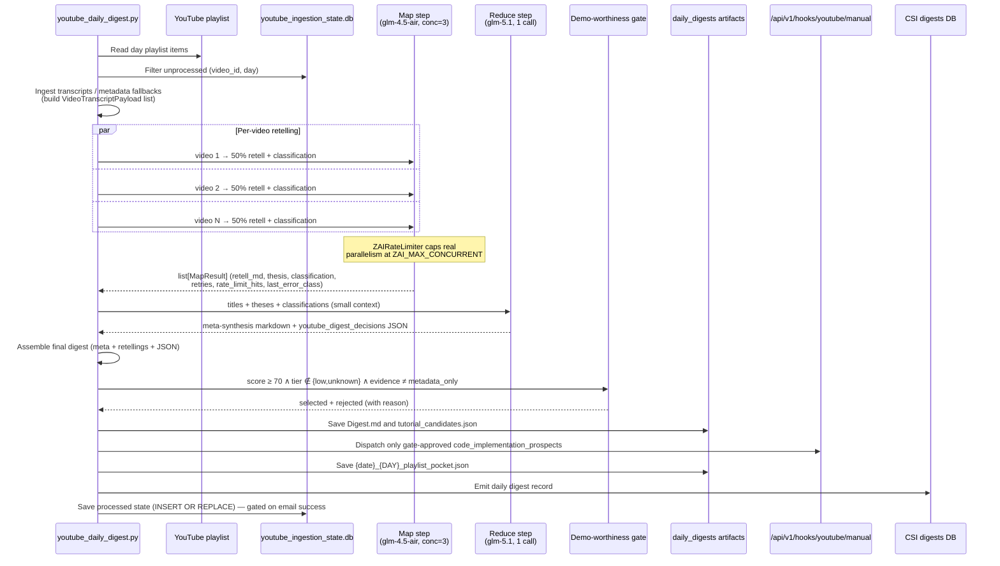
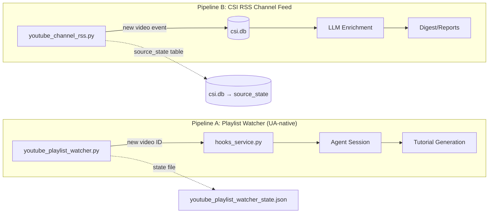

# Tutorial Pipeline — Architecture & Operations

> **Canonical source-of-truth** for the YouTube Tutorial Pipeline. All other
> tutorial-related documentation should reference this file.
>
> **Last updated:** 2026-05-18 — Daily Digest now ships on a **map-reduce pipeline** (per-video retell on `glm-4.5-air` @ conc=3, meta-synthesis on `glm-5.1`), with the per-video prompt asking for a **50% length retelling** instead of a "concise summary". Tutorial dispatch now passes through a deterministic **demo-worthiness gate** (score ≥ 70, value_tier ≠ low/unknown, evidence_quality ≠ metadata_only). `required_secrets` preflight now includes `YOUTUBE_OAUTH_*`. Per-call retry / FUP-1313 telemetry surfaces in `MapResult` and the comparison harness. PRs #356, #357, #360, #361, #363.

## 1. Pipeline Overview

The YouTube Tutorial Pipeline is an automated system that watches YouTube playlists for new videos, ingests their content (transcripts, metadata), dispatches an AI agent session to generate a structured tutorial artifact, optionally bootstraps a GitHub repository for the tutorial code, and notifies stakeholders at each stage.

As of 2026-04-27, the pipeline includes LLM-judged URL classification for description links, replacing brittle regex-only classification with Anthropic-powered assessment and Pydantic validation.

```
Playlist Watch → New Video Detection → Webhook Dispatch → Agent Session
  → Transcript Ingest → Tutorial Generation → Repo Bootstrap → Notification
```

### Key Components

| Layer | File | Responsibility |
|-------|------|---------------|
| Playlist Watcher | `services/youtube_playlist_watcher.py` | Periodically polls configured YouTube playlists for new video IDs |
| Hooks Service | `hooks_service.py` | Receives webhook events, manages dispatch queue, throttling, retry policies |
| Gateway Server | `gateway_server.py` | Notification system, tutorial dashboard API, persistence |
| YouTube Ingestion | `youtube_ingest.py` | Fetches transcripts via rotating residential proxy (Webshare or DataImpulse, selected by `PROXY_PROVIDER`) |
| Telegram Notifier | `services/tutorial_telegram_notifier.py` | Per-video dedup Telegram alerts for tutorial events |
| Dashboard (Tutorials) | `web-ui/app/dashboard/tutorials/page.tsx` | Tutorial runs, review jobs, bootstrap jobs, notifications with client-side dedup |
| Dashboard (Main) | `web-ui/app/dashboard/page.tsx` | Notification panel with video-level dedup |

### 1.1A Daily Digest Ranking, Tutorial Dispatch, and Database State Management

The Daily YouTube Digest cron uses day-specific playlists as incoming queues. Previously, it operated on a "destructive physical deletion" model, which consumed ~500 API quota units per run to clear the playlist. **As of 2026-04-30, the digest uses a Zero-Quota Database State Model.** 

It fetches the playlist (costing 1 API unit) and deduplicates videos against `youtube_ingestion_state.db` using a composite key of `(video_id, day)`. This allows you to process a video on the `MONDAY_YT_PLAYLIST` and re-process the exact same video on the `WEDNESDAY_YT_PLAYLIST` without conflict, while strictly deduplicating within the same day.

**Digest synthesis runs on a two-step map-reduce pipeline (as of 2026-05-18).** See `src/universal_agent/scripts/youtube_daily_digest.py:_generate_digest_content` for the dispatcher.

- **Map step** (per-video, parallel): one LLM call per video on `glm-4.5-air` (haiku-tier Z.AI) producing a 50%-length "Compressed Retelling" plus a `per_video_classification` JSON block. Bounded by an internal semaphore (`UA_YOUTUBE_DIGEST_MAP_CONCURRENCY`, default `3`) AND the global `ZAIRateLimiter` (`ZAI_MAX_CONCURRENT`, default `2`). Effective parallelism is `min(internal, global)`. The retell prompt explicitly asks for ~50% of source length and to preserve specific numbers, examples, tool names, and "this works because" explanations — see `RETELL_PROMPT`.
- **Reduce step** (single call): one LLM call on `glm-5.1` (opus-tier Z.AI) that sees only titles + thesis lines + per-video classifications (NOT full retellings), so context stays small. Emits the cross-video meta-synthesis (themes / learning insights / neglected opportunities) and the ranked `youtube_digest_decisions` JSON block.
- **Assembly** is deterministic Python (`_assemble_map_reduce_digest`): meta-synthesis + retellings + JSON block, in that order, so `_extract_decision_json` keeps working unchanged.

**Legacy single-call path** (one big-context glm-5.1 call with all transcripts concatenated) stays available behind `UA_YOUTUBE_DIGEST_PIPELINE=single_call` for A/B testing and fallback.

**Per-call telemetry** (added in PR #361): every `MapResult` carries `retries`, `rate_limit_hits`, and `last_error_class`. These get aggregated in the map-step log and surface in the comparison harness's `map_metrics.error_class_breakdown` so the operator can correlate model+concurrency choices with the actual rate-limit surface.

**Comparison harness.** `src/universal_agent/scripts/youtube_digest_compare.py` runs multiple labeled (pipeline, model, concurrency) configs against the SAME input transcripts (loaded from a repopulate pocket) and dumps side-by-side outputs to `AGENT_RUN_WORKSPACES/daily_digests/comparison_<date>_<DAY>/` for human review. Used 2026-05-18 to confirm `glm-4.5-air@conc=3` produces excellent retell depth at 0 retries / 0 FUP hits vs `glm-5-turbo@conc=3` at 2× wall time.

**Deterministic demo-worthiness gate before dispatch** (added in PR #357, `_select_tutorial_dispatch_candidates`): even when the LLM marks `code_implementation_prospect=true`, dispatch only fires when ALL of:
- `value_score ≥ UA_YOUTUBE_DIGEST_DEMO_GATE_MIN_SCORE` (default `70`)
- `value_tier not in {low, unknown}`
- `evidence_quality != metadata_only`

Rejected candidates appear in the digest email under a separate "Rejected by demo-worthiness gate" block with the specific reason; the rejection state is also written to `tutorial_candidates.json` for post-hoc audit.

**Cron preflight `required_secrets`** (PR #356 hardening). The digest cron's metadata declares the 7 day-specific `<DAY>_YT_PLAYLIST` keys AND `YOUTUBE_OAUTH_CLIENT_ID` / `YOUTUBE_OAUTH_CLIENT_SECRET` / `YOUTUBE_OAUTH_REFRESH_TOKEN`. Missing secrets surface as a `cron_run_failed` dashboard alert at preflight time instead of a silent runtime crash. (Was the 2026-05-18 root cause: production Infisical env had no `YOUTUBE_OAUTH_*` keys; dev had them but the Google refresh token was revoked. Both restored by mirroring CLIENT_ID/SECRET dev→prod and running `youtube_oauth2_setup.py` against `INFISICAL_ENVIRONMENT=production`.)

The digest LLM (reduce step in map-reduce mode, single LLM call in legacy mode) produces both human-readable markdown and a structured `youtube_digest_decisions` block. The code normalizes that block, sorts videos by `value_score`, saves a candidate artifact, and dispatches `code_implementation_prospect=true` videos that pass the demo-worthiness gate to the YouTube tutorial pipeline. The machine-readable decision block is stripped from the human-facing digest/email; the email instead includes a compact "YouTube Tutorial Pipeline Dispatch" section listing selected videos and hook acceptance status, plus the rejection block when applicable.

**Yesterday-shift day mapping.** The cron fires the morning *after* content collection. Tuesday's run reads `MONDAY_YT_PLAYLIST` (yesterday's playlist), not Tuesday's. The script computes `DAYS[(now - 1 day).weekday()]` automatically. Manual reruns via `--day` bypass this shift and target the exact day specified.

**Email delivery safeguard.** When email delivery is enabled (`--email-to`), the processed-videos database write is gated on successful delivery. If the email send fails, the script emits a `proactive_delivery_failed` stderr tag (captured by the cron service into `cron_runs.jsonl`) and **skips** the DB write, so the next scheduled run will retry the same videos. This prevents burning videos with no delivery path.

**Playlist provisioning.** `youtube_provision_digest_playlists.py` is a one-shot utility that discovers the user's "\<Day\> Digest" playlists via the YouTube Data API and upserts their IDs to Infisical as `\<DAY\>_YT_PLAYLIST`. Run it once after creating the 7 day-named playlists:

```bash
PYTHONPATH=src uv run python -m universal_agent.scripts.youtube_provision_digest_playlists
# add --dry-run to preview without writing to Infisical
```

**Cron registration.** `schedule_youtube_digest.py` registers (or updates) the `daily_youtube_digest` cron job. The gateway's `_ensure_youtube_daily_digest_cron_job()` helper calls this at boot, so manual invocation is rarely needed. The job runs at 06:00 America/Chicago with a 1-hour timeout.

> [!WARNING]
> **Testing Status (2026-04-30)**: The transition to the SQLite Database state model has been fully implemented in the codebase, and the python deduplication logic has been verified via unit mocks. However, **end-to-end testing with actual YouTube data has not been finalized yet due to Google Cloud Project API quota limitations** hit during development. Full live validation is scheduled to resume tomorrow when the quota resets.



Candidate files live under:

```text
AGENT_RUN_WORKSPACES/daily_digests/{YYYY-MM-DD}_{DAY}_tutorial_candidates.json
```

Automatic dispatch is bounded by `UA_YOUTUBE_DIGEST_AUTO_TUTORIAL_TOP_N` and defaults to `4`. Use `--no-auto-tutorial-dispatch` to disable it for a manual run. `--dry-run` writes/prints decision artifacts but does not dispatch tutorial runs or delete playlist entries.

Pocket files live under:

```text
AGENT_RUN_WORKSPACES/daily_digests/repopulate_pockets/{DAY}/{YYYY-MM-DD}_{DAY}_playlist_pocket.json
```

To restore the latest saved Monday pocket:

```bash
PYTHONPATH=src uv run python -m universal_agent.scripts.youtube_daily_digest --repopulate --day MONDAY
```

To preview without modifying YouTube:

```bash
PYTHONPATH=src uv run python -m universal_agent.scripts.youtube_daily_digest --repopulate --day MONDAY --dry-run
```

To restore a specific date:

```bash
PYTHONPATH=src uv run python -m universal_agent.scripts.youtube_daily_digest --repopulate --day MONDAY --date 2026-04-30
```

---

> [!IMPORTANT]
> **Two Separate YouTube Watching Systems Exist.** They use different databases,
> different state storage, and require independent operational management.
> Failing to reset BOTH systems (e.g., during a proxy provider switch) will
> result in stale state in one pipeline while the other is clean.

### 1.1 Dual-Pipeline Architecture



| Aspect | Pipeline A: Playlist Watcher | Pipeline B: CSI RSS Channel Feed |
|--------|------------------------------|-----------------------------------|
| **Purpose** | Watch specific playlists for new tutorial videos | Watch 444+ channel RSS feeds for any new uploads |
| **Owner** | UA Gateway (`services/youtube_playlist_watcher.py`) | CSI Ingester (`csi_ingester/adapters/youtube_channel_rss.py`) |
| **State Storage** | `youtube_playlist_watcher_state.json` (flat file) | `source_state` table rows keyed `youtube_channel_rss:<channel_id>` |
| **Database** | None (file-based state) | `csi.db` (default: `/var/lib/universal-agent/csi/csi.db`) |
| **State Contents** | `seen_ids`, `pending_dispatch_items`, `run_retry_counts`, `permanently_failed_video_ids` | Per-channel: `seen_ids`, `seeded`, `etag`, `last_modified` |
| **Reset Script** | `scripts/purge_youtube_backlog.py` Steps 1-3 | `scripts/purge_youtube_backlog.py` Steps 4-5 |
| **Proxy Usage** | Transcript ingestion via residential proxy | RSS feed polling (no proxy needed for RSS, proxy used for transcript fetch if triggered) |

> [!CAUTION]
> When switching proxy providers or resetting YouTube state, you **MUST** run
> the purge script which covers **both** pipelines:
> ```bash
> cd /opt/universal_agent
> uv run python scripts/purge_youtube_backlog.py --dry-run  # preview
> uv run python scripts/purge_youtube_backlog.py             # execute
> ```

---

## 2. Notification Kinds

All tutorial pipeline notification kinds are defined in `_TUTORIAL_NOTIFICATION_KINDS` in `gateway_server.py`:

| Kind | Stage | Description |
|------|-------|-------------|
| `youtube_playlist_new_video` | Detection | New video found in watched playlist |
| `youtube_playlist_dispatch_failed` | Detection | Failed to dispatch webhook for new video |
| `youtube_tutorial_started` | Processing | Agent session started for the video |
| `youtube_tutorial_progress` | Processing | Progress update during tutorial generation |
| `youtube_tutorial_interrupted` | Processing | Agent session was interrupted (timeout, error) |
| `youtube_tutorial_ready` | Complete | Tutorial artifact generated successfully |
| `youtube_tutorial_failed` | Complete | Tutorial generation failed |
| `youtube_tutorial_permanently_failed` | Monitoring | Playlist watcher exhausted retries without artifacts; marker is cleared automatically if artifacts later appear |
| `youtube_ingest_failed` | Ingestion | Transcript ingestion failed |
| `youtube_ingest_proxy_alert` | System Health | Proxy rotation failure (global, not per-video) |
| `youtube_hook_recovery_queued` | Recovery | Recovery queued for a previously failed hook |
| `tutorial_repo_bootstrap_queued` | Bootstrap | GitHub repo creation queued |
| `tutorial_repo_bootstrap_ready` | Bootstrap | Repo created and pushed successfully |
| `tutorial_repo_bootstrap_failed` | Bootstrap | Repo bootstrap failed |

---

## 3. Notification Deduplication

The pipeline generates multiple notifications per video as it moves through stages. Without deduplication, the notification panel becomes cluttered with stale intermediate stages. Deduplication operates at three levels:

### 3.1 Backend — Video-Level Upsert (`gateway_server.py`)

`_TUTORIAL_PIPELINE_STAGE_KINDS` defines the subset of kinds that track a single video through the pipeline. When `_add_notification()` receives a notification for one of these kinds and the metadata contains a `video_id` (or `video_key`):

1. It scans existing non-dismissed notifications for any with a matching `video_id` whose kind is also in `_TUTORIAL_PIPELINE_STAGE_KINDS`.
2. If found, the existing notification is **updated in-place** with the new kind, title, message, and metadata.
3. No new notification row is created — the video always has at most one active notification.

This mirrors the existing health-alert kind-level upsert pattern but groups by `video_id` across multiple pipeline kinds.

**Edge cases:**
- **Dismissed notifications** are skipped — a new row is created alongside the dismissed one.
- **No video_id** — fallback to normal creation (no dedup).
- **System health alerts** (`youtube_ingest_proxy_alert`) are excluded from pipeline stage dedup — they use kind-level upsert instead.

### 3.2 Frontend — Dashboard Notification Panel (`page.tsx`)

The `visibleNotifications` memo in the dashboard page applies a post-filter dedup step: after status/category/severity filters, tutorial notifications are grouped by `tutorialVideoKey()` and only the latest per video is retained. Non-tutorial notifications pass through unchanged.

### 3.3 Frontend — Tutorials Tab (`tutorials/page.tsx`)

The tutorials tab has its own `visibleNotifications` memo that uses `notificationEntityKey()` to group by video and keeps only the latest notification per entity.

### 3.4 Telegram — Per-Video Cooldown (`tutorial_telegram_notifier.py`)

`TutorialTelegramNotifier.maybe_send()` implements per-video dedup for `youtube_tutorial_ready` and `youtube_playlist_new_video` kinds using a TTL cache, preventing duplicate Telegram messages within a cooldown window.

---

## 4. Transcript Ingestion

Transcript fetching uses a **single, unified architecture** running entirely on the VPS.

> [!NOTE]
> The desktop transcript worker (`desktop_transcript_worker.py`) was decommissioned
> in April 2026. All transcript fetching now runs on the VPS via `youtube_ingest.py`
> using a rotating residential proxy (Webshare or DataImpulse).

### Architecture: VPS Rotating Residential Proxy

The `youtube_ingest.py` module uses rotating residential proxies to bypass YouTube's datacenter IP blocking. The active provider is selected by the `PROXY_PROVIDER` environment variable:

| Provider | Endpoint | Port | Default |
|---|---|---|---|
| **Webshare** | `p.webshare.io` | `80` | — |
| **DataImpulse** | `gw.dataimpulse.com` | `823` | ✅ (production default since April 2026) |

The module is exposed via the gateway endpoint `/api/v1/youtube/ingest` and is called by the CSI enrichment pipeline (`csi_rss_semantic_enrich.py`) on a systemd timer every 4 hours.

Key behaviors:
- **Proxy-first**: Requires residential proxy by default (`UA_YOUTUBE_INGEST_REQUIRE_PROXY=1`)
- **Provider-agnostic**: `PROXY_PROVIDER` env var selects `webshare` or `dataimpulse`
- **API-first metadata**: Uses YouTube Data API v3 for metadata (no proxy needed), yt-dlp as fallback
- **Minimum character threshold** to detect empty/stub transcripts
- **Cooldown between ingestion attempts** for the same video
- **In-flight TTL tracking** to avoid double-processing
- **Proxy failure generates** `youtube_ingest_proxy_alert` (health-alert dedup)

---

## 5. Webhook Dispatch & Retry

The hooks service manages a bounded dispatch queue with configurable concurrency:

- **Queue limit:** `UA_HOOKS_AGENT_DISPATCH_QUEUE_LIMIT` (default: 40)
- **Concurrency:** `UA_HOOKS_AGENT_DISPATCH_CONCURRENCY` (default: 1–2)
- **Overflow notification:** cooldown-gated `hook_dispatch_queue_overflow` alert
- **Dispatch dedup:** TTL-based dedup prevents re-dispatching the same video within `UA_HOOKS_YOUTUBE_DISPATCH_DEDUP_TTL_SECONDS` (default: 3600)
- **Retry policies:** Configurable per-kind via `UA_HOOKS_DISPATCH_RETRY_POLICIES` (JSON)
- **Startup recovery:** Re-queues recently interrupted sessions on restart (`UA_HOOKS_STARTUP_RECOVERY_ENABLED`)

---

## 6. Repo Bootstrap

After tutorial generation, the pipeline can automatically create a GitHub repository:
- `tutorial_repo_bootstrap_queued` → `tutorial_repo_bootstrap_ready` / `tutorial_repo_bootstrap_failed`
- Managed via the tutorials dashboard "Bootstrap Jobs" section

---

## 7. Configuration (Environment Variables)

### Core Hooks
| Variable | Default | Description |
|----------|---------|-------------|
| `UA_HOOKS_ENABLED` | `""` | Enable/disable the hooks service |
| `UA_HOOKS_TOKEN` | `""` | Authentication token for webhook endpoints |
| `UA_HOOKS_AUTO_BOOTSTRAP` | `""` | Enable automatic repo bootstrap after tutorial generation |

### YouTube Ingestion
| Variable | Default | Description |
|----------|---------|-------------|
| `UA_HOOKS_YOUTUBE_INGEST_MODE` | `""` | Ingestion mode: `proxy` for rotating proxies |
| `UA_HOOKS_YOUTUBE_INGEST_URL` | `""` | Primary ingest endpoint URL |
| `UA_HOOKS_YOUTUBE_INGEST_URLS` | `""` | Comma-separated fallback URLs |
| `UA_HOOKS_YOUTUBE_INGEST_TOKEN` | `""` | Auth token for ingest endpoints |
| `UA_HOOKS_YOUTUBE_INGEST_TIMEOUT_SECONDS` | `120` | Ingest request timeout |
| `UA_HOOKS_YOUTUBE_INGEST_RETRY_ATTEMPTS` | varies | Number of retry attempts |
| `UA_HOOKS_YOUTUBE_INGEST_MIN_CHARS` | `160` | Minimum transcript length |
| `UA_HOOKS_YOUTUBE_INGEST_COOLDOWN_SECONDS` | `600` | Cooldown between same-video ingests |
| `UA_HOOKS_YOUTUBE_INGEST_INFLIGHT_TTL_SECONDS` | `900` | In-flight tracking TTL |
| `UA_HOOKS_YOUTUBE_INGEST_FAIL_OPEN` | `false` | Continue pipeline on ingest failure |

### Dispatch
| Variable | Default | Description |
|----------|---------|-------------|
| `UA_HOOKS_AGENT_DISPATCH_CONCURRENCY` | `1` | Max concurrent agent dispatches |
| `UA_HOOKS_AGENT_DISPATCH_QUEUE_LIMIT` | `40` | Max queued dispatches |
| `UA_HOOKS_YOUTUBE_DISPATCH_DEDUP_TTL_SECONDS` | `3600` | Dispatch dedup window |
| `UA_HOOKS_YOUTUBE_TIMEOUT_SECONDS` | `1800` | Session timeout for tutorial processing |
| `UA_HOOKS_DISPATCH_RETRY_POLICIES` | `{}` | JSON retry policies per kind |

### Notifications
| Variable | Default | Description |
|----------|---------|-------------|
| `UA_NOTIFICATIONS_MAX` | `500` | Max in-memory notification count |
| `YOUTUBE_TUTORIAL_TELEGRAM_CHAT_ID` | `""` | Telegram chat ID for tutorial alerts |
| `TELEGRAM_BOT_TOKEN` | `""` | Telegram bot token |

### Startup Recovery
| Variable | Default | Description |
|----------|---------|-------------|
| `UA_HOOKS_STARTUP_RECOVERY_ENABLED` | `true` | Re-queue interrupted sessions on startup |
| `UA_HOOKS_STARTUP_RECOVERY_MAX_SESSIONS` | `3` | Max sessions to recover |
| `UA_HOOKS_STARTUP_RECOVERY_MIN_AGE_SECONDS` | `120` | Min age for recovery candidates |
| `UA_HOOKS_STARTUP_RECOVERY_COOLDOWN_SECONDS` | `1800` | Cooldown between recovery attempts |

### VPS Proxy (youtube_ingest.py)
| Variable | Default | Description |
|----------|---------|-------------|
| `PROXY_PROVIDER` | `webshare` | Active proxy provider: `webshare` or `dataimpulse` |
| `UA_YOUTUBE_INGEST_REQUIRE_PROXY` | `1` | Require residential proxy (set `0` for local dev only) |
| `PROXY_USERNAME` | — | Webshare proxy username |
| `PROXY_PASSWORD` | — | Webshare proxy password |
| `WEBSHARE_PROXY_HOST` | `proxy.webshare.io` | Webshare proxy domain |
| `WEBSHARE_PROXY_PORT` | `80` | Webshare proxy port |
| `WEBSHARE_PROXY_LOCATIONS` | — | Optional Webshare location filter |
| `DATAIMPULSE_HOST` | `gw.dataimpulse.com` | DataImpulse proxy domain |
| `DATAIMPULSE_PORT` | `823` | DataImpulse proxy port |
| `DATAIMPULSE_USER` | — | DataImpulse proxy username |
| `DATAIMPULSE_PASS` | — | DataImpulse proxy password |

### Daily Digest Pipeline (map-reduce, as of 2026-05-18)
| Variable | Default | Description |
|----------|---------|-------------|
| `UA_YOUTUBE_DIGEST_PIPELINE` | `map_reduce` | `map_reduce` (per-video retell + meta-synthesis) or `single_call` (legacy one-LLM-call shape, kept for A/B + fallback). |
| `UA_YOUTUBE_DIGEST_MAP_MODEL` | `glm-4.5-air` | Map-step model. Z.AI haiku-tier. Set to `glm-5-turbo` for sonnet-tier polish (~2× wall time). |
| `UA_YOUTUBE_DIGEST_MAP_CONCURRENCY` | `3` | Internal semaphore for parallel per-video calls. Effective parallelism is `min(this, ZAI_MAX_CONCURRENT)`. Pushing above 3 risks Z.AI FUP 1313 throttling at the account level. |
| `UA_YOUTUBE_DIGEST_MAP_TIMEOUT_SECONDS` | `180` | Per-map-call timeout. Plenty of headroom — observed glm-4.5-air p50 is ~20s, max ~30s. |
| `UA_YOUTUBE_DIGEST_MAP_MAX_TOKENS` | `6000` | Per-map-call output cap. Bumped from 4000 alongside the 50% retell target to fit retellings of the longest playlist videos (~5300 output tokens worst case). |
| `UA_YOUTUBE_DIGEST_MAP_TRANSCRIPT_CHAR_LIMIT` | `50000` | Max source-transcript chars fed to a single map call (truncated above this). |
| `UA_YOUTUBE_DIGEST_REDUCE_MODEL` | `resolve_model("opus")` → `glm-5.1` | Reduce-step model. Single small-context call (titles + classifications + theses only). |
| `UA_YOUTUBE_DIGEST_REDUCE_TIMEOUT_SECONDS` | `600` | Per-reduce-call timeout. |
| `UA_YOUTUBE_DIGEST_REDUCE_MAX_TOKENS` | `8000` | Per-reduce-call output cap. |
| `UA_YOUTUBE_DIGEST_LLM_TIMEOUT_SECONDS` | `900` | Legacy single-call timeout (only consulted when `UA_YOUTUBE_DIGEST_PIPELINE=single_call`). |
| `UA_YOUTUBE_DIGEST_LLM_MAX_RETRIES` | `5` | Retry budget for 429/FUP 1313 backoff on every ZAI call. |
| `UA_YOUTUBE_DIGEST_MODEL` | — | Legacy override for single-call path. Map-reduce path ignores this; use `UA_YOUTUBE_DIGEST_MAP_MODEL` / `UA_YOUTUBE_DIGEST_REDUCE_MODEL` instead. |
| `UA_YOUTUBE_DIGEST_MAX_TOKENS` | `12000` | Legacy max-tokens override for single-call path. |
| `ANTHROPIC_BASE_URL` / `ANTHROPIC_API_KEY` / `ZAI_API_KEY` | — | Inference credentials. When the resolved key matches `ZAI_API_KEY`, base_url is auto-set to `https://api.z.ai/api/anthropic`. |

### Daily Digest Auto Tutorial Dispatch + Demo-Worthiness Gate
| Variable | Default | Description |
|----------|---------|-------------|
| `UA_YOUTUBE_DIGEST_AUTO_TUTORIAL_TOP_N` | `4` | Max gate-approved code-implementation prospects to dispatch per digest run. |
| `UA_YOUTUBE_DIGEST_DEMO_GATE_MIN_SCORE` | `70` | Deterministic gate (see PR #357). Reject any candidate with `value_score < this`, regardless of LLM rating. Also rejects `value_tier in {low, unknown}` and `evidence_quality == metadata_only`. |
| `UA_YOUTUBE_DIGEST_TUTORIAL_HOOK_URL` | `UA_GATEWAY_URL + /api/v1/hooks/youtube/manual` | Optional explicit manual YouTube hook URL for digest dispatch. |
| `UA_HOOKS_TOKEN` | — | Required bearer token for digest-to-hook dispatch. |

Optional video/vision analysis in `youtube-tutorial-creation` is gated to `concept_plus_implementation` runs. `concept_only` runs use transcript and metadata evidence and set visual extraction to `not_attempted`.

---

## 8. Key Source Files

| Path | Description |
|------|-------------|
| `src/universal_agent/hooks_service.py` | Core pipeline orchestration, dispatch queue, retry |
| `src/universal_agent/gateway_server.py` | Notification CRUD, tutorial dashboard API, dedup constants |
| `src/universal_agent/youtube_ingest.py` | Transcript fetching via rotating residential proxy (Webshare or DataImpulse) |
| `src/universal_agent/youtube_mode_utils.py` | Shared concept-only vs code-worthy mode inference used by CSI signal ingest, hooks, gateway tutorial indexing, and playlist watching |
| `src/universal_agent/scripts/youtube_daily_digest.py` | Daily playlist digest. Hosts the map-reduce dispatcher (`_generate_digest_content`), map step (`_map_retell_videos` / `_retell_one_video`), reduce step (`_reduce_meta_synthesize`), demo-worthiness gate (`_select_tutorial_dispatch_candidates`), ranked tutorial-candidate persistence, and bounded code-prospect dispatch. Legacy single-call path retained as `_generate_digest_content_single_call`. |
| `src/universal_agent/scripts/youtube_digest_compare.py` | A/B comparison harness. Loads a repopulate pocket, re-ingests transcripts, runs an arbitrary list of `(pipeline, map_model, map_concurrency)` configs against identical input, dumps per-run `digest.md` + `run_metadata.json` plus a cross-run `classifications_diff.json` and `index.json`. Used to evaluate model+concurrency choices without touching the live cron. |
| `src/universal_agent/scripts/youtube_provision_digest_playlists.py` | One-shot utility: discovers "\<Day\> Digest" playlists via YouTube Data API and upserts IDs to Infisical |
| `src/universal_agent/scripts/schedule_youtube_digest.py` | Registers/updates the `daily_youtube_digest` cron job (called by gateway boot helper) |
| `tests/unit/test_youtube_daily_digest_map_reduce.py` | Map-reduce coverage: per_video_classification parsing, Z.AI rate-limit/FUP detection, digest assembly, map happy/failure paths, dispatcher routing, semaphore enforcement, retry-counting telemetry. |
| `tests/unit/test_youtube_daily_digest_demo_gate.py` | Deterministic demo-worthiness gate: score/tier/evidence rejection rules, top-N overflow, reject-reason annotation, env-driven min-score override. |
| `tests/unit/test_youtube_daily_digest_pockets.py` | Repopulate pocket persistence + restore, candidates artifact shape, dispatch dry-run, decision JSON stripping. |
| `tests/unit/test_youtube_daily_digest_email_failures.py` | Email delivery → processed-videos DB write gating (success path, failure path, no-email mode). |
| `src/universal_agent/scripts/vp_coder_workspace_pruner.py` | Weekly archive of stale VP-coder workspace subdirectories (7-day default retention) |
| `src/universal_agent/services/youtube_playlist_watcher.py` | Playlist polling |
| `src/universal_agent/services/tutorial_telegram_notifier.py` | Telegram notification sink with per-video dedup |
| `web-ui/app/dashboard/page.tsx` | Main dashboard with notification dedup |
| `web-ui/app/dashboard/tutorials/page.tsx` | Tutorials tab with entity-level dedup |
| `tests/unit/test_tutorial_notification_dedup.py` | Backend video-level dedup tests |
| `tests/unit/test_tutorial_telegram_dedup.py` | Telegram notifier dedup tests |
| `scripts/check_proxy.py` | Provider-agnostic proxy connectivity diagnostic (TCP, HTTP, HTTPS, YouTube) |
| `scripts/purge_youtube_backlog.py` | Operational script: reset playlist watcher state, finalize stale runs, purge pending signal cards |
| `.claude/skills/youtube-tutorial-creation/scripts/extract_description_links.py` | LLM-judged URL classification and content extraction from video descriptions |

---

## 8A. Description Link Classification (URL Intelligence)

The `extract_description_links.py` script classifies URLs found in YouTube video descriptions using a two-pass architecture:

### Pass 1: Deterministic Pre-Filter

Fast regex-based filtering strips known social domains (`twitter.com`, `x.com`, `discord.gg`, `instagram.com`, etc.) and promotional path keywords (`/discord`, `/newsletter`, `/subscribe`, `/merch`).

### Pass 2: LLM Judge

Remaining candidate URLs are assessed by an Anthropic LLM (via `ZAI_API_KEY` or `ANTHROPIC_API_KEY`) using `tool_use` structured output. Each URL receives:

- `type`: `github_repo`, `documentation`, `blog_post`, `api_reference`, `dataset`, `tool_page`, `changelog`, `promotional`, `media_only`, `social`, `other`
- `worth_fetching`: boolean indicating if the URL contains fetchable technical content
- `reasoning`: brief explanation of the assessment

The LLM output is validated via Pydantic models (`UrlVerdict`) with `HttpUrl` validation and automatic retries on validation failure.

### Fallback

If no LLM API key is available, the script falls back to the original deterministic regex classification, ensuring backward compatibility in environments without API access.

### Content Fetch

URLs marked `worth_fetching: true` are fetched downstream using either:
- **GitHub API**: README + repo metadata for `github_repo` URLs (shallow clone for richer content)
- **defuddle-cli**: Clean markdown extraction for web pages

Fetched content is stored alongside the tutorial artifacts and included in the evaluation context for concept preparation and code demo analysis.

### Environment Variables

| Variable | Description |
|---|---|
| `ZAI_API_KEY` / `ANTHROPIC_API_KEY` | API key for the LLM URL judge (falls back to regex if missing) |
| `ANTHROPIC_BASE_URL` | Optional base URL for ZAI proxy |

> [!NOTE]
> The same three-pass URL enrichment architecture is shared with the ClaudeDevs X Intelligence pipeline via `csi_url_judge.py`. Changes to one should be considered for the other.

---

## 9. Dashboard API Endpoints

| Endpoint | Method | Description |
|----------|--------|-------------|
| `/api/v1/dashboard/tutorials/runs` | GET | List tutorial run directories |
| `/api/v1/dashboard/tutorials/runs/{path}` | DELETE | Delete a tutorial run directory |
| `/api/v1/dashboard/tutorials/notifications` | GET | Tutorial-filtered notifications |
| `/api/v1/dashboard/tutorials/review-jobs` | GET | Pending review dispatches |
| `/api/v1/dashboard/tutorials/bootstrap-jobs` | GET | Repo bootstrap job status |
| `/api/v1/hooks/youtube/dispatch` | POST | Manually trigger a tutorial dispatch |
| `/api/v1/hooks/youtube/retry` | POST | Retry a failed hook |

---

## 10. Proxy Failure Semantics and Debugging Notes

The VPS transcript path in `src/universal_agent/youtube_ingest.py` builds its
proxy configuration from the **current process environment** using the
provider-agnostic `_build_proxy_config()` router, which delegates to either
`_build_webshare_proxy_config()` or `_build_dataimpulse_proxy_config()` based
on the `PROXY_PROVIDER` env var.

The relevant variables depend on the active provider:

**Webshare:**
- `PROXY_USERNAME` or `WEBSHARE_PROXY_USER`
- `PROXY_PASSWORD` or `WEBSHARE_PROXY_PASS`
- optional host, port, and location filters

**DataImpulse:**
- `DATAIMPULSE_USER`
- `DATAIMPULSE_PASS`
- `DATAIMPULSE_HOST` (default: `gw.dataimpulse.com`)
- `DATAIMPULSE_PORT` (default: `823`)

### What `proxy_not_configured` Actually Means

`proxy_not_configured` does **not** always mean "Infisical never had the
secret."

It specifically means the proxy config builder could not find a usable
username/password pair for the **active provider** in the current gateway
process at request time.

That can happen for multiple reasons:

1. Infisical bootstrap failed or never ran
2. the wrong deployment profile allowed degraded fallback startup
3. secret names or aliases are inconsistent
4. later runtime code mutated `os.environ` and removed the proxy vars from the
   live process after bootstrap
5. `PROXY_PROVIDER` is set to a provider whose credentials are not provisioned

### Live Service vs Fresh Process Matters

During the 2026-03-23 production incident, a fresh process on the VPS could
bootstrap proxy secrets successfully while the long-running gateway process was
still returning:

- `error = "proxy_not_configured"`
- `proxy_mode = "disabled"`

That narrowed the fault to **post-bootstrap runtime mutation**, not secret
storage alone.

The final fix lived in `src/universal_agent/execution_engine.py`:

- child-process env sanitization remains in place for Claude SDK subprocess
  spawn
- the parent gateway env is now restored immediately afterward
- the main `process_turn()` path no longer strips proxy credentials from the
  live service

### Operational Rule

When investigating tutorial ingest failures, compare:

1. the live HTTP endpoint behavior on the target host
2. a fresh one-off bootstrap process on that same host

If those disagree, inspect runtime code that mutates `os.environ` after
bootstrap. Do not assume a successful fresh bootstrap proves the long-running
service still has the same environment later.
