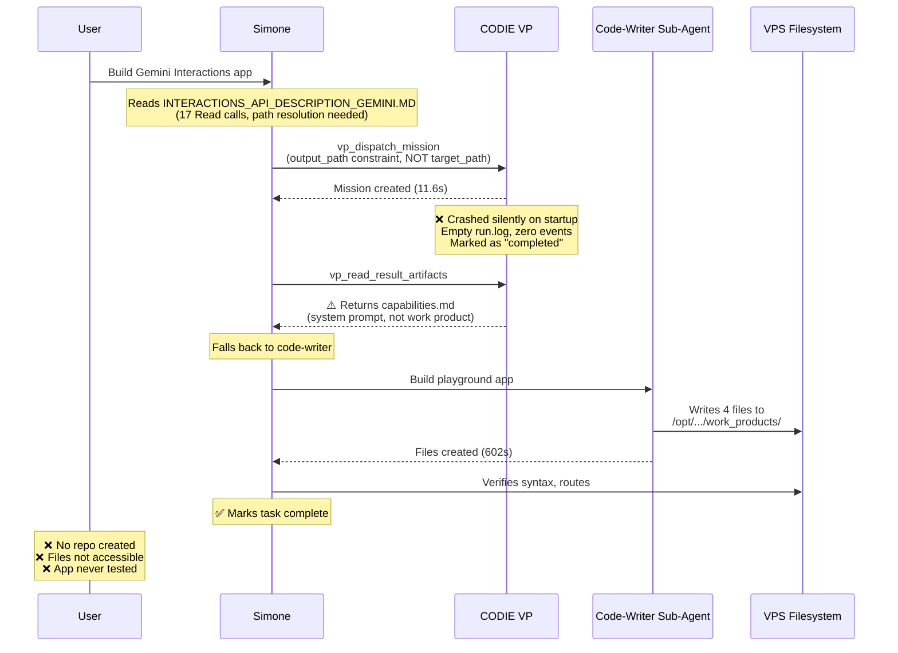
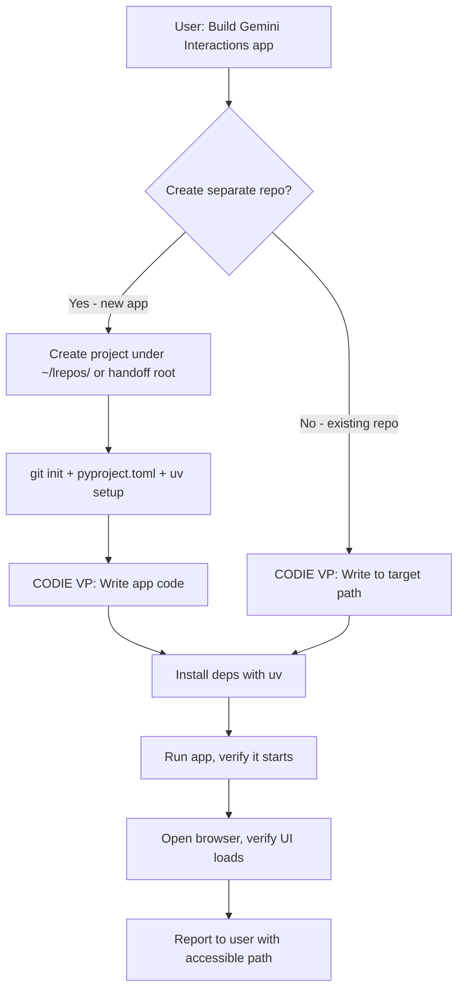

# Post-Mortem: Gemini Interactions API Playground Build (2026-04-26)

**Session:** `session_20260426_052318_cc0da49c`  
**Date:** 2026-04-26  
**Duration:** 733m 47s (12.2 hours wall clock, ~920s actual execution)  
**Tokens:** 170,521 | **Tools:** 36 | **Iterations:** 1  
**Task:** Build a comprehensive agent application implementing the Gemini Interactions API  
**Source Doc:** `INTERACTIONS_API_DESCRIPTION_GEMINI.MD`  

---

## Executive Summary

> [!CAUTION]
> **The task was NOT successfully completed.** The user expected a standalone repository to be created. Instead, files were dumped into an ephemeral VPS workspace path (`/opt/universal_agent/AGENT_RUN_WORKSPACES/session_*/work_products/`) that is non-persistent and not accessible from the local desktop. The VP coder (CODIE) crashed silently, Simone fell back to a code-writer sub-agent, and the result was a loose Flask app in a temporary directory — not a proper repo.

---

## Findings

### Finding 1: No Separate Repository Was Created

**Expected:** User asked to "build a comprehensive agent application" — implying a standalone project with its own repository, proper scaffolding, and version control.

**Actual:** Files were written directly to:
```
/opt/universal_agent/AGENT_RUN_WORKSPACES/session_20260426_052318_cc0da49c/work_products/gemini-interactions-playground/
```

This is an ephemeral workspace directory under the Universal Agent VPS runtime. It is:
- **Not a git repository** — no `git init` was run
- **Not accessible from the desktop** — the SSHFS mount provides `/home/kjdragan/...` paths, but `/opt/universal_agent/AGENT_RUN_WORKSPACES/` is not mounted
- **Not persistent** — agent run workspaces can be pruned by reaper cron jobs
- **Not a proper project** — no `pyproject.toml`, no virtual environment, no deployment config

> [!IMPORTANT]
> **Root cause:** Neither Simone nor the code-writer sub-agent interpreted "build a comprehensive agent application" as "create a new standalone repository." The VP orchestration skill and CODIE profile don't have a "create repo" workflow. The task was treated as "write some files" rather than "scaffold a project."

### Finding 2: CODIE VP Failed Silently (11.6s execution, empty run.log)

**Evidence from transcript:**
```
CODIE VP failed on this one (crashed on startup with empty run.log),
so I fell back to the code-writer sub-agent which delivered successfully.
```

**Timeline:**
| Event | Timestamp | Duration |
|-------|-----------|----------|
| `vp_dispatch_mission` called | +191.7s | — |
| Mission created | 05:26:39 | — |
| Mission "completed" | 05:26:53 | **11.6 seconds** |
| `vp_read_result_artifacts` called | +239.5s | — |
| Artifacts returned | — | Returned capabilities.md (the VP's own system prompt, NOT actual work product) |

**Analysis:** The VP coder mission completed in 11.6 seconds. A mission to build a comprehensive web application should take 10–30 minutes. The 11.6-second "completion" means the CODIE process startup itself failed immediately, and the worker loop finalized it as "completed" rather than "failed."

> [!WARNING]
> **Critical bug:** When the VP worker's `ProcessTurnAdapter` fails during `await adapter.initialize()` or produces no output events, the mission finalizes as "completed" with no error text (since `error_text` remains `None`). This is a false positive completion. The worker should detect zero-output missions and mark them as failed.

**Code path in** [claude_code_client.py](file:///home/kjdragan/lrepos/universal_agent/src/universal_agent/vp/clients/claude_code_client.py#L46-L82):
```python
trace_id: Optional[str] = None
final_text = ""
error_text: Optional[str] = None

try:
    await adapter.initialize()
    async for event in adapter.execute(objective):
        # ... collects events
finally:
    await adapter.close()

if error_text:
    return MissionOutcome(status="failed", ...)
return MissionOutcome(status="completed", ...)  # <-- Falls through to "completed" even with zero events
```

If the adapter produces zero events (startup crash), `error_text` is `None`, so the mission completes "successfully" with empty output.

### Finding 3: Constraint Key Mismatch — `output_path` vs `target_path`

Simone passed the constraint `output_path` in the mission dispatch:
```json
{
  "constraints": {
    "output_path": "/opt/universal_agent/AGENT_RUN_WORKSPACES/.../gemini-interactions-playground/",
    "tech_stack": "Python backend (Flask/FastAPI) with google-genai SDK, modern frontend",
    "max_duration_minutes": 30,
    "required_env_var": "GEMINI_API_KEY"
  }
}
```

But the [dispatcher code](file:///home/kjdragan/lrepos/universal_agent/src/universal_agent/vp/dispatcher.py#L273-L285) only recognizes these keys:
```python
def _extract_target_paths(constraints: dict[str, Any]) -> list[str]:
    keys = ("target_path", "path", "repo_path", "workspace_dir", "project_path")
```

The `output_path` key is silently ignored, meaning the workspace guard never applies and the workspace is resolved to the default VP workspace root instead.

### Finding 4: `vp_read_result_artifacts` Returned System Prompt, Not Work Product

When Simone called `vp_read_result_artifacts`, the response returned a **54KB capabilities.md file** (the VP's own system prompt) rather than any actual code files. This confirms the mission workspace contained only auto-generated boilerplate, not user-generated artifacts:

```json
{
  "excerpt": "<!-- Runtime Capabilities Snapshot (Auto) -->\n\n<!-- Generated: 2026-04-26 05:26:42 -->..."
}
```

This means:
1. CODIE never actually wrote any code
2. The workspace only contained the auto-seeded soul/capabilities files
3. Simone didn't notice this red flag and proceeded to the fallback path

### Finding 5: Code-Writer Sub-Agent Output Went to VPS-Only Path

After CODIE failed, Simone delegated to the internal `code-writer` sub-agent. The sub-agent successfully produced 4 files:

| File | Size | Lines |
|------|------|-------|
| `app.py` | 22KB | 682 |
| `templates/index.html` | 72KB | 1,780 |
| `requirements.txt` | 33B | 2 |
| `README.md` | 1.2KB | — |

**Quality assessment:** The files are syntactically correct (verified by the agent). Frontend calls align with backend routes. The design covers all 9 API sections. But:

- **Not accessible from desktop** — written to `/opt/universal_agent/AGENT_RUN_WORKSPACES/` on VPS
- **Not a git repo** — no version control
- **Not pip/uv installable** — no `pyproject.toml`, uses plain `requirements.txt`
- **Flask with `pip install`** — violates project rules (should use `uv` per user rules)
- **No virtual environment created** — just raw files
- **No Infisical integration** — uses `os.environ.get("GEMINI_API_KEY")` directly

### Finding 6: File Path Resolution Failure

The session started by attempting to read the source document from the path the user provided:
```
/home/kjdragan/lrepos/universal_agent/INTERACTIONS_API_DESCRIPTION_GEMINI.MD
```

This failed because the session ran on the VPS where the file exists at:
```
/opt/universal_agent/INTERACTIONS_API_DESCRIPTION_GEMINI.MD
```

The agent had to do a `find / -maxdepth 4` search to locate it. This indicates the SSHFS mount rule (`/home/kjdragan/...` paths available on VPS) was not functioning for this file, likely because it's in the repo root which is at `/opt/universal_agent/` on the VPS, not under `/home/kjdragan/`.

### Finding 7: Single Iteration — No Verification of Running Application

The entire session ran in **1 iteration with 36 tool calls**. The agent:
- Read the documentation (17 Read calls)
- Dispatched CODIE VP (failed silently)
- Delegated to code-writer sub-agent
- Verified syntax and route alignment
- Marked the task complete

**Missing steps:**
- Never ran `pip install -r requirements.txt`
- Never ran `python app.py` to verify the server starts
- Never made a test API call
- Never opened a browser to verify the UI
- Never created a git repository
- Never set up the project as a proper standalone application

---

## Error Classification

| # | Error | Severity | Category |
|---|-------|----------|----------|
| 1 | No standalone repo created | **P0 — Goal Failure** | Task interpretation |
| 2 | CODIE VP crashed silently, marked as "completed" | **P0 — Silent Failure** | VP worker lifecycle |
| 3 | `output_path` constraint ignored (key mismatch) | **P1 — Data Loss** | VP dispatch interface |
| 4 | Result artifacts returned system prompt instead of work | **P2 — Misleading** | VP artifact resolution |
| 5 | Output written to ephemeral VPS-only path | **P1 — Inaccessible** | Workspace management |
| 6 | Source file path resolution failure | **P2 — Friction** | SSHFS / path mapping |
| 7 | No runtime verification of built application | **P2 — Quality Gap** | Agent execution flow |
| 8 | Uses `os.environ.get()` instead of Infisical | **P2 — Policy Violation** | Secret management |
| 9 | Uses `pip` instead of `uv` | **P3 — Policy Violation** | Dependency management |

---

## Recommendations

### R1: Fix Zero-Output VP Mission Detection (P0)

**File:** [claude_code_client.py](file:///home/kjdragan/lrepos/universal_agent/src/universal_agent/vp/clients/claude_code_client.py#L46-L82)

**Change:** After the event loop completes, check whether any meaningful output was produced. If `final_text` is empty AND `error_text` is `None`, this is a silent failure:

```python
# After the event loop
if error_text:
    return MissionOutcome(status="failed", ...)

# NEW: Detect zero-output missions (startup crash / silent failure)
if not final_text.strip():
    return MissionOutcome(
        status="failed",
        result_ref=f"workspace://{workspace_dir}",
        message="Mission produced no output (possible startup crash or adapter failure)",
        payload={"trace_id": trace_id, "zero_output": True},
    )

return MissionOutcome(status="completed", ...)
```

### R2: Align VP Constraint Keys (P1)

**File:** [dispatcher.py](file:///home/kjdragan/lrepos/universal_agent/src/universal_agent/vp/dispatcher.py#L273-L285)

**Change:** Add `output_path` to recognized constraint keys:

```python
def _extract_target_paths(constraints: dict[str, Any]) -> list[str]:
    keys = ("target_path", "path", "repo_path", "workspace_dir", "project_path", "output_path")
```

Also update the VP orchestration skill to document which constraint keys are valid, so Simone uses the correct key.

### R3: Update VP Orchestration Skill for Project Scaffolding (P1)

**File:** [SKILL.md](file:///home/kjdragan/lrepos/universal_agent/.agents/skills/vp-orchestration/SKILL.md)

**Change:** Add a "New Project Scaffolding" section with guidance on:
- When to create a new git repo vs. work in existing repos
- Where to place new projects (handoff root, user-specified paths, NOT ephemeral workspaces)
- Mandatory steps: `git init`, `pyproject.toml`, virtual env, Infisical integration
- Constraint key documentation: which keys the VP worker recognizes

### R4: Add Mission Output Validation in VP Worker Loop (P1)

**File:** [worker_loop.py](file:///home/kjdragan/lrepos/universal_agent/src/universal_agent/vp/worker_loop.py#L374-L398)

**Change:** After `client.run_mission()`, validate the outcome before finalizing:

```python
outcome = await client.run_mission(...)

# NEW: Validate non-trivial output
if outcome.status == "completed" and not outcome.payload.get("final_text", "").strip():
    logger.warning("Mission %s completed with empty output — downgrading to failed", mission_id)
    outcome = MissionOutcome(status="failed", message="Zero-output completion", ...)
```

### R5: Simone Should Detect Code-Writer Fallback as Degraded Path (P2)

When Simone sees CODIE fail and falls back to code-writer, the final task disposition should note this as a degraded execution. Currently, the task was marked as "completed" without any indication that the primary executor (CODIE) failed.

**Change:** In the system prompt / todo dispatch service, add guidance that VP mission failure followed by code-writer fallback should:
1. Note the degradation in the task completion note
2. Verify that the code-writer output was written to a user-accessible path
3. Warn the user that the output may not be as comprehensive as a full VP mission

### R6: Workspace Path Accessibility Check (P2)

When writing output files, verify that the target path is accessible from the user's desktop (via SSHFS or direct path). Paths under `/opt/universal_agent/AGENT_RUN_WORKSPACES/` are NOT accessible via the standard SSHFS mount at `/home/kjdragan/`.

**Recommendation:** The VP handoff root or a user-specified project path under `/home/kjdragan/` should be used for project scaffolding tasks.

### R7: Enforce `uv` and Infisical for New Python Projects (P3)

Per user rules:
- Use `uv` instead of `pip` for dependency management
- Use Infisical for secrets, not `os.environ.get()`

The code-writer sub-agent doesn't appear to have these rules in its context. These should be injected into its system prompt or mission briefing.

---

## Architectural Flow Diagram



---

## What Should Have Happened (Happy Path)



**Missing capabilities the agent would need:**
1. A "project scaffolding" workflow in the VP skill or as a separate skill
2. Ability to create git repos in external paths
3. Post-build verification (run the app, browser check)
4. Path accessibility validation

---

## Summary

The session produced technically correct code but failed the fundamental user objective. The cascading failures were:

1. CODIE VP crash → silent false-positive completion → no escalation
2. Constraint key mismatch → output path ignored → default ephemeral workspace used
3. Code-writer fallback → files in VPS-only path → user can't access output
4. No git repo → no version control → output is ephemeral
5. No runtime verification → app never tested → quality unknown

**Priority fix order:** R1 (zero-output detection) → R2 (constraint keys) → R4 (output validation) → R3 (scaffolding skill) → R5-R7 (polish)
