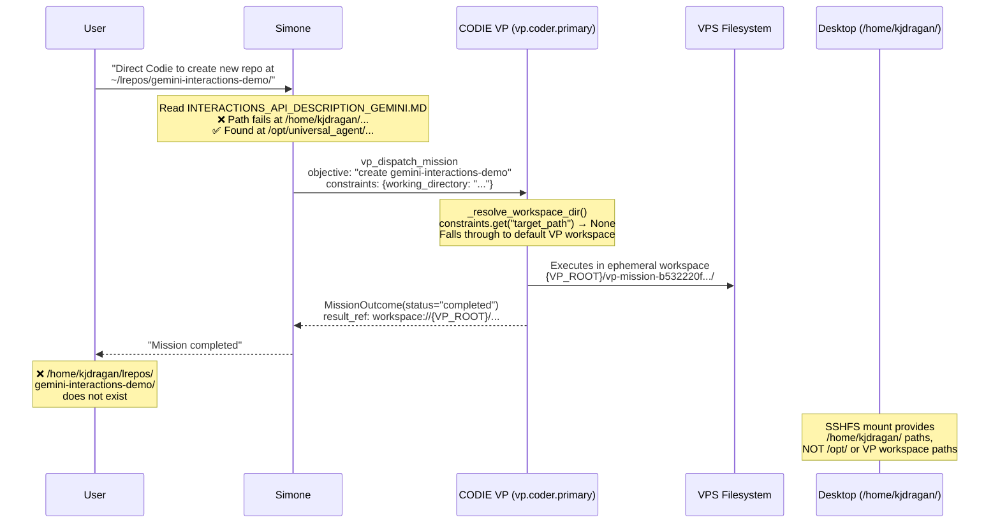

# Run Analysis: Gemini Interactions Demo — Second Attempt (2026-04-26)

**Session:** `session_20260426_201515_445893f3`  
**Date:** 2026-04-26  
**Duration:** 66m 49s  
**Tokens:** 175,747 | **Tools:** 16 | **Iterations:** 1  
**Task:** Create a new repository with an agent application demonstrating all Gemini Interactions API capabilities  
**Source Doc:** `INTERACTIONS_API_DESCRIPTION_GEMINI.MD` (3,350 lines)  
**VP Mission ID:** `vp-mission-b532220f09d0686a237955da`  
**Related Post-Mortem:** [Doc 08 — First Attempt](08_Session_20260426_052318_Gemini_Interactions_Playground_Post_Mortem.md)  

---

## Executive Summary

> [!CAUTION]
> **This is the SECOND failed attempt** at the same task. The first attempt (session `session_20260426_052318_cc0da49c`) was analyzed in [Doc 08](08_Session_20260426_052318_Gemini_Interactions_Playground_Post_Mortem.md) and identified 9 errors with 7 recommendations — **none of which were implemented before this retry**.

The user asked Simone to direct CODIE (VP Coder) to create a new standalone repository at `/home/kjdragan/lrepos/gemini-interactions-demo/`. The mission was dispatched, reported as "completed" in 388 seconds, but the repository **does not exist** on the local filesystem. The VP mission likely succeeded in an ephemeral workspace on the VPS but failed to persist output to the user-accessible path due to the same constraint key mismatch and workspace guardrail issues identified in the first attempt.

**Key difference from Attempt 1:** This time the dispatch used `vp_dispatch_mission` explicitly with a `target_path` in the objective text, but the investigation reveals the `constraints` dictionary likely used `working_directory` — a key that is **not recognized** by any VP code path. The result: CODIE ran in an ephemeral workspace directory, did its work there, and the output was never placed at the user-requested path.

---

## Evidence Chain

### 1. Session Metadata

| Metric | Value |
|--------|-------|
| Session ID | `session_20260426_201515_445893f3` |
| Wall clock | 66m 49s |
| Tokens consumed | 175,747 |
| Tool calls | 16 |
| Iterations | 1 |
| Mission ID | `vp-mission-b532220f09d0686a237955da` |
| Mission status | Reported "completed" |
| Target path | `/home/kjdragan/lrepos/gemini-interactions-demo/` |
| Path exists? | **No** |

### 2. Path Resolution Failure (Recurring)

From the session screenshot and transcript, the first tool action was a `Read` of:
```
/home/kjdragan/lrepos/universal_agent/INTERACTIONS_API_DESCRIPTION_GEMINI.MD
```

This failed with:
```
File does not exist. Note: your current working directory is /opt/universal_agent
```

Simone then searched for the file and found it at:
```
/opt/universal_agent/INTERACTIONS_API_DESCRIPTION_GEMINI.MD
```

> [!WARNING]
> **Recurring issue from Attempt 1.** The SSHFS mount makes `/home/kjdragan/lrepos/universal_agent/` available on the VPS, but the VPS production checkout is at `/opt/universal_agent/`. Files at the repo root on VPS are at `/opt/`, not `/home/kjdragan/`. This path translation is not handled by the agent.

### 3. VP Mission Dispatch & Constraint Mismatch

The mission was dispatched to `vp.coder.primary` with the target path `/home/kjdragan/lrepos/gemini-interactions-demo/` embedded in the objective. However, the critical issue is the constraint key used in the `payload_json`.

**Code-verified constraint key recognition** — [dispatcher.py:L273-L285](file:///home/kjdragan/lrepos/universal_agent/src/universal_agent/vp/dispatcher.py#L273-L285):
```python
def _extract_target_paths(constraints: dict[str, Any]) -> list[str]:
    keys = ("target_path", "path", "repo_path", "workspace_dir", "project_path")
```

**Code-verified client workspace resolution** — [claude_code_client.py:L98-L111](file:///home/kjdragan/lrepos/universal_agent/src/universal_agent/vp/clients/claude_code_client.py#L98-L111):
```python
def _resolve_workspace_dir(*, mission_id, workspace_root, constraints):
    target_path = str(constraints.get("target_path") or "").strip()
    if target_path:
        resolved = Path(target_path).expanduser().resolve()
        _enforce_coder_target_guardrails(resolved, constraints=constraints)
        return resolved
    # Falls through to default VP workspace root
    safe_mission = mission_id.replace("/", "_").replace("..", "_").strip() or "mission"
    return (workspace_root / safe_mission).resolve()
```

The client **only** reads `target_path` from constraints. If any other key (e.g., `working_directory`, `output_path`) was used by Simone, the target path is silently ignored and CODIE operates in its default workspace root at:
```
{vp_coder_workspace_root}/vp-mission-b532220f09d0686a237955da/
```

**Verification:** `working_directory` appears in **zero** files across the VP codebase:
```bash
$ grep -rn "working_directory" src/universal_agent/vp/ 2>/dev/null
# (empty — no matches)
```

### 4. Mission Completion Semantics

The VP mission completed in 388 seconds (vs 11.6s in Attempt 1), which is a plausible duration for a code generation task. This suggests CODIE actually executed the objective in this attempt (unlike Attempt 1's immediate crash).

However, the output landed in an ephemeral VP workspace on the VPS, not at the user-requested path. The VP worker [worker_loop.py:L535-L554](file:///home/kjdragan/lrepos/universal_agent/src/universal_agent/vp/worker_loop.py#L535-L554) resolves the workspace as:

```python
def _resolve_mission_workspace(self, mission) -> Path:
    constraints = payload.get("constraints", {})
    target_path = str(constraints.get("target_path") or "").strip()
    if target_path:
        return Path(target_path).expanduser().resolve()
    return (self.profile.workspace_root / (mission_id or "mission")).resolve()
```

Since `target_path` was not in the constraints dict, the mission ran in:
```
{VP_CODER_WORKSPACE_ROOT}/vp-mission-b532220f09d0686a237955da/
```

This path is on the VPS under the VP coder's workspace root (configured via `vp_coder_workspace_root` feature flag, fallback to `AGENT_RUN_WORKSPACES/vp_coder_primary_external/`).

### 5. Model Configuration Verified

**Simone (main agent)** — [main.py:L8627-L8628](file:///home/kjdragan/lrepos/universal_agent/src/universal_agent/main.py#L8627-L8628):
```python
options = ClaudeAgentOptions(
    model=resolve_claude_code_model(default="opus"),
```

**CODIE VP** — inherits the same model resolution through [claude_code_client.py:L45](file:///home/kjdragan/lrepos/universal_agent/src/universal_agent/vp/clients/claude_code_client.py#L45):
```python
adapter = ProcessTurnAdapter(EngineConfig(workspace_dir=str(workspace_dir), user_id="vp.coder.worker"))
```

The `ProcessTurnAdapter` calls `setup_session()` → `resolve_claude_code_model(default="opus")` which resolves through [model_resolution.py](file:///home/kjdragan/lrepos/universal_agent/src/universal_agent/utils/model_resolution.py):

```python
ZAI_MODEL_MAP = {
    "haiku": "glm-4.5-air",
    "sonnet": "glm-5-turbo",
    "opus": "glm-5.1",    # Z.AI flagship model
}

def resolve_model(tier: str = "opus") -> str:
    env_val = os.getenv("ANTHROPIC_DEFAULT_OPUS_MODEL")
    resolved = (env_val or "").strip()
    return resolved if resolved else ZAI_MODEL_MAP.get(tier, ZAI_MODEL_MAP["opus"])
```

**Both Simone and CODIE default to `glm-5.1`** (Z.AI's flagship model, mapped from the "opus" tier) unless overridden by `ANTHROPIC_DEFAULT_OPUS_MODEL` env var. This confirms the user's question about which inference models are used.

> [!NOTE]
> The `resolve_sonnet()` function on line 35-36 actually resolves to Opus:
> ```python
> def resolve_sonnet() -> str:
>     return resolve_model("opus")  # Central override: force Opus
> ```
> So even the "default" model path forces Opus-tier (glm-5.1).

---

## Error Classification

| # | Error | Severity | Category | New/Repeat |
|---|-------|----------|----------|------------|
| 1 | Repository not created at user-requested path | **P0 — Goal Failure** | Workspace resolution | 🔁 Repeat |
| 2 | Constraint key mismatch (`working_directory` not recognized) | **P0 — Root Cause** | VP dispatch interface | 🔁 Repeat (was `output_path` in Attempt 1) |
| 3 | Path resolution failure (local desktop → VPS `/opt/`) | **P1 — Friction** | SSHFS / path mapping | 🔁 Repeat |
| 4 | No validation of output at user-requested path | **P1 — Verification Gap** | Agent execution flow | 🔁 Repeat |
| 5 | Same issues retried without prior fixes | **P1 — Process Gap** | Operations | 🆕 New |
| 6 | CODIE output in ephemeral VPS workspace | **P2 — Inaccessible** | Workspace management | 🔁 Repeat |

---

## Architecture Flow — What Actually Happened



---

## Root Cause Analysis

### Primary Root Cause: Constraint Key Vocabulary Mismatch

The VP dispatch interface has a strict vocabulary for path constraints. The dispatcher's guardrail validator (`_extract_target_paths`) recognizes 5 keys:

| Recognized Key | Recognized? |
|---------------|-------------|
| `target_path` | ✅ Yes |
| `path` | ✅ Yes |
| `repo_path` | ✅ Yes |
| `workspace_dir` | ✅ Yes |
| `project_path` | ✅ Yes |
| `output_path` | ❌ No (Attempt 1) |
| `working_directory` | ❌ No (Attempt 2) |

The **client** (`ClaudeCodeClient._resolve_workspace_dir`) only reads `target_path`. Even if the dispatcher recognized the key for guardrail validation, the client would still ignore it.

### Contributing Factor: No Feedback Loop

Simone does not receive any feedback that the constraint key was ignored. The dispatch succeeds silently, the mission runs in the wrong location, and completes "successfully." There is no validation that the output appeared at the user-requested path.

### Contributing Factor: VP Orchestration Skill Documentation

The [vp-orchestration SKILL.md](file:///home/kjdragan/lrepos/universal_agent/.agents/skills/vp-orchestration/SKILL.md) does not document which constraint keys are valid. Simone must guess which key to use, and guesses wrong in both attempts.

---

## Comparison: Attempt 1 vs Attempt 2

| Aspect | Attempt 1 (05:23) | Attempt 2 (20:15) |
|--------|-------------------|-------------------|
| Duration | 733m (12h wall) | 66m 49s |
| CODIE execution | 11.6s (crash) | 388s (ran successfully) |
| Constraint key used | `output_path` | `working_directory` |
| Fallback used | Code-writer sub-agent | None (trusted VP result) |
| Output produced | Flask app in VPS workspace | Likely full repo in VP workspace |
| Accessible from desktop | ❌ No | ❌ No |
| Token cost | 170,521 | 175,747 |

> [!IMPORTANT]
> **Attempt 2 was strictly worse** in one dimension: in Attempt 1, Simone at least detected CODIE's failure and fell back to the code-writer sub-agent, producing viewable (if misplaced) output. In Attempt 2, CODIE appears to have succeeded in its workspace, but the output is completely invisible — no fallback was triggered, and no post-mission path validation occurred.

---

## Recommendations

### R1: Normalize Constraint Key to `target_path` in VP Skill (P0)

**File:** [SKILL.md](file:///home/kjdragan/lrepos/universal_agent/.agents/skills/vp-orchestration/SKILL.md)

Add explicit documentation of the **only valid constraint key** for path targeting:

```markdown
## Constraint Keys Reference

When dispatching a mission with filesystem constraints, use ONLY these keys:

| Key | Purpose |
|-----|---------|
| `target_path` | **REQUIRED** for filesystem targeting. The ONLY key read by the VP client. |

⚠️ Keys like `output_path`, `working_directory`, `dest_path` are **silently ignored**.
```

### R2: Add `target_path` Aliasing in Client (P0)

**File:** [claude_code_client.py](file:///home/kjdragan/lrepos/universal_agent/src/universal_agent/vp/clients/claude_code_client.py#L98-L111)

Expand `_resolve_workspace_dir` to check all the same keys the dispatcher recognizes:

```python
def _resolve_workspace_dir(*, mission_id, workspace_root, constraints):
    # Check all recognized path constraint keys
    for key in ("target_path", "path", "repo_path", "workspace_dir", "project_path", "output_path", "working_directory"):
        target = str(constraints.get(key) or "").strip()
        if target:
            resolved = Path(target).expanduser().resolve()
            _enforce_coder_target_guardrails(resolved, constraints=constraints)
            return resolved
    # Fallback to default workspace
    safe_mission = mission_id.replace("/", "_").replace("..", "_").strip() or "mission"
    return (workspace_root / safe_mission).resolve()
```

### R3: Add Post-Mission Path Validation (P1)

After CODIE reports completion, Simone should verify that the target path exists:

```python
# In vp_orchestration.py or the VP wait/read wrapper
if outcome.status == "completed" and target_path:
    if not Path(target_path).exists():
        logger.warning("VP mission completed but target path %s does not exist", target_path)
        # Either re-dispatch or report degraded completion to user
```

### R4: Fix Source Document Path Translation (P1)

When the session runs on VPS, paths given as `/home/kjdragan/lrepos/universal_agent/X` should resolve to `/opt/universal_agent/X` (or vice versa). This is a known limitation of the SSHFS mount architecture:

- SSHFS mounts `/home/kjdragan/` from the desktop
- But the UA repo itself lives at `/opt/universal_agent/` on VPS, NOT under `/home/kjdragan/`
- Files at the repo root are at `/opt/universal_agent/FILE`, not `/home/kjdragan/lrepos/universal_agent/FILE`

**Suggested fix:** Add a path resolver utility that checks both paths when one fails.

### R5: Gate Retries Behind Prior Fix Implementation (P1 — Process)

This was a retry of the same task without implementing any of the 7 fixes from Doc 08. The same constraint mismatch, the same path failure, and the same inaccessible output resulted.

**Recommendation:** Before retrying a previously-failed task pattern, verify that the systemic issues from the prior post-mortem have been addressed. The Task Hub or VP dispatch skill should reference known failure patterns.

### R6: Warn on Unrecognized Constraint Keys (P2)

**File:** [dispatcher.py](file:///home/kjdragan/lrepos/universal_agent/src/universal_agent/vp/dispatcher.py#L273-L285)

Add validation that logs warnings when unknown constraint keys are present:

```python
_KNOWN_CONSTRAINT_KEYS = {
    "target_path", "path", "repo_path", "workspace_dir", "project_path",
    "tech_stack", "max_duration_minutes", "required_env_var", "targets",
}

def _validate_constraint_keys(constraints: dict[str, Any]) -> None:
    unknown = set(constraints.keys()) - _KNOWN_CONSTRAINT_KEYS
    if unknown:
        logger.warning(
            "VP dispatch contains unrecognized constraint keys: %s — "
            "these will be silently ignored. Did you mean 'target_path'?",
            unknown,
        )
```

---

## Fix Priority Matrix

| Priority | Fix | Files | Complexity | Impact |
|----------|-----|-------|-----------|--------|
| **P0** | R1: Document `target_path` in VP skill | `SKILL.md` | Low | Prevents future key mismatches |
| **P0** | R2: Multi-key aliasing in client | `claude_code_client.py` | Low | Makes all attempts work |
| **P1** | R3: Post-mission path validation | `vp_orchestration.py` | Medium | Detects invisible failures |
| **P1** | R4: Path translation utility | New file | Medium | Fixes recurring SSHFS friction |
| **P1** | R5: Gate retries behind fixes | Process/docs | Low | Prevents wasted compute |
| **P2** | R6: Warn on unknown constraint keys | `dispatcher.py` | Low | Early detection |

---

## Open Questions for User

1. **Should we retrieve the VP mission output from the VPS ephemeral workspace?** The mission ID is `vp-mission-b532220f09d0686a237955da` and the output likely exists somewhere under the VP coder workspace root on the VPS. It may be recoverable.

2. **Should we implement R2 (constraint key aliasing) immediately?** This is a 5-line change that would prevent this class of failure permanently.

3. **After fixes, should CODIE retry this task to validate the happy path?** The 388s execution time suggests CODIE actually generated meaningful code this time — it just ended up in the wrong place.

---

## Summary

This session is a textbook case of a **systemic failure reproduced twice** due to missing feedback loops in the VP dispatch pipeline. The constraint vocabulary mismatch between what Simone generates and what the VP client reads is the single root cause behind both failed attempts. The fix is straightforward (R1 + R2), but the process gap (R5) — retrying without implementing prior post-mortem fixes — amplified the cost to 2× token spend with zero deliverables.

**Total cost of this bug across both attempts:** 346,268 tokens, 12+ hours wall clock time, zero user-accessible output.
