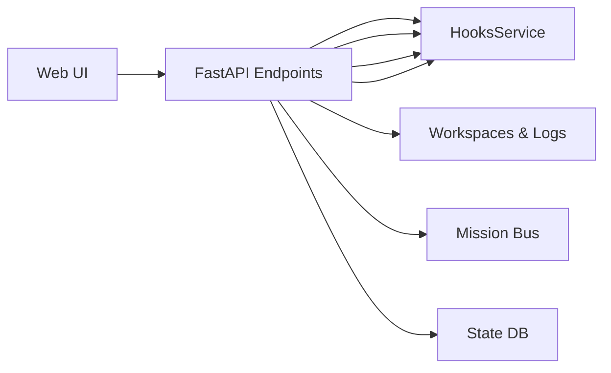

# Gateway Ops API

The **Ops API** is the primary HTTP/WebSocket interface exposed by `gateway_server.py`.

It runs on **port 8002** by default (configurable via `UA_GATEWAY_PORT`).

## 1. Overview

The gateway server provides:

- **Session Management**: Create, resume, and manage agent sessions
- **Real-time Streaming**: WebSocket endpoints for live event streaming
- **Ops Administration**: Factory registration, VP mission control, cron jobs, hooks
- **Dashboard APIs**: CSI digests, notifications, events, approvals
- **Health & Readiness**: Liveness probes for orchestration
- **Integration Endpoints**: YouTube ingest, signals ingest, Telegram ops



## 2. Authentication

### Ops Token

```
POST /auth/ops-token
```

Issues a JWT token for ops/administrative access.

**Request Body** (`OpsTokenIssueRequest`):
```json
{
  "password": "string"
}
```

**Response** (`OpsTokenIssueResponse`):
```json
{
  "token": "string",
  "expires_at": "ISO8601 timestamp"
}
```

### Auth Requirements

Most `/api/v1/ops/*` and `/api/v1/dashboard/*` endpoints require:
`Authorization: Bearer <token>` header with a valid ops JWT.

Session WebSocket endpoints may require auth when `UA_SESSION_API_AUTH_ENABLED=true`.

## 3. Health & Readiness

| Endpoint | Method | Description |
|----------|--------|-------------|
| `/` | GET | Root health check |
| `/api/v1/hooks/readyz` | GET | Hooks service readiness probe |
| `/api/v1/health` | GET | Detailed health status |

### Health Response

```json
{
  "status": "healthy",
  "checks": {
    "database": "ok",
    "redis": "ok",
    "filesystem": "ok"
  }
}
```

## 4. Session Management
| Endpoint | Method | Description |
|----------|--------|-------------|
| `/api/v1/sessions` | POST | Create new session |
| `/api/v1/sessions` | GET | List active sessions |
| `/api/v1/sessions/{id}` | GET | Get session details |
| `/api/v1/sessions/{id}` | DELETE | Delete session workspace |

### Create Session

```
POST /api/v1/sessions
```

**Request Body** (`CreateSessionRequest`):
```json
{
  "session_id": "optional-custom-id",
  "user_id": "optional-user-identifier"
}
```

**Response** (`CreateSessionResponse`):
```json
{
  "session_id": "uuid",
  "workspace_path": "/path/to/workspace",
  "created_at": "ISO8601 timestamp"
}
```

### Session Details

```
GET /api/v1/sessions/{id}
```

**Response** (`SessionSummaryResponse`):
```json
{
  "session_id": "uuid",
  "path": "/path/to/workspace",
  "last_run_id": "optional-run-id",
  "status": "idle|running|error",
  "created_at": "ISO8601 timestamp"
}
```

## 5. WebSocket Streaming
| Endpoint | Protocol | Description |
|----------|----------|-------------|
| `/ws/agent` | WebSocket | Primary UI event streaming (compat shim) |
| `/api/v1/sessions/{session_id}/stream` | WebSocket | Canonical session event stream |

### Connection Flow

1. Client connects to `/ws/agent?session_id=xxx` or `/api/v1/sessions/{session_id}/stream`
2. Server validates auth if required
3. Session events stream in real-time

### Event Types

- `text`: User input / assistant response
- `tool_call`: Tool invocation
- `tool_result`: Tool execution result
- `status`: Session status change
- `approval`: Approval request/response
- `error`: Error condition

## 6. Ops Administration

### Factory Registration
| Endpoint | Method | Description |
|----------|--------|-------------|
| `/api/v1/factory/capabilities` | GET | List factory capability labels |
| `/api/v1/factory/registrations` | POST | Register a factory worker |
| `/api/v1/factory/registrations` | GET | List active registrations |
| `/api/v1/factory/registrations/{factory_id}` | DELETE | Deregister a factory |

### VP Mission Control
| Endpoint | Method | Description |
|----------|--------|-------------|
| `/api/v1/vp/missions/dispatch` | POST | Dispatch a VP mission |
| `/api/v1/vp/missions/{mission_id}/cancel` | POST | Cancel a VP mission |
| `/api/v1/vp/missions/{mission_id}` | GET | Get mission status |
| `/api/v1/vp/missions` | GET | List VP missions |
| `/api/v1/vp/sessions` | GET | List VP sessions |
| `/api/v1/vp/sessions/{session_id}` | GET | Get VP session details |
| `/api/v1/vp/bridge-cursor` | GET/PUT | Manage VP bridge cursor |

### Cron Jobs
| Endpoint | Method | Description |
|----------|--------|-------------|
| `/api/v1/ops/timers` | GET | List scheduled cron jobs |
| `/api/v1/ops/cron` | POST | Create cron job |
| `/api/v1/ops/cron/{job_id}` | PUT | Update cron job |
| `/api/v1/ops/cron/{job_id}` | DELETE | Delete cron job |

### Ops Config
| Endpoint | Method | Description |
|----------|--------|-------------|
| `/api/v1/ops/config` | GET | Get current ops config |
| `/api/v1/ops/config` | PUT | Replace ops config |
| `/api/v1/ops/config/patch` | PATCH | Merge patch into config |

## 7. Dashboard APIs

### CSI Dashboard
| Endpoint | Method | Description |
|----------|--------|-------------|
| `/api/v1/dashboard/csi/digests` | GET | List CSI digests |
| `/api/v1/dashboard/csi/digests/{digest_id}/send-to-simone` | POST | Send digest to Simone |
| `/api/v1/dashboard/csi/purge` | POST | Purge CSI sessions |

### Notifications
| Endpoint | Method | Description |
|----------|--------|-------------|
| `/api/v1/dashboard/notifications` | GET | List notifications |
| `/api/v1/dashboard/notifications` | PATCH | Update notifications |
| `/api/v1/dashboard/notifications/purge` | POST | Purge notifications |

### Events
| Endpoint | Method | Description |
|----------|--------|-------------|
| `/api/v1/dashboard/events` | GET | List dashboard events |
| `/api/v1/dashboard/events/stream` | GET | Stream events (SSE) |
| `/api/v1/dashboard/events/counters` | GET | Get event counters |
| `/api/v1/dashboard/events/presets` | GET/POST | Manage event presets |

### Approvals
| Endpoint | Method | Description |
|----------|--------|-------------|
| `/api/v1/dashboard/approvals` | GET | List pending approvals |
| `/api/v1/dashboard/approvals/{id}` | PUT | Update approval status |

### Task Hub
| Endpoint | Method | Description |
|----------|--------|-------------|
| `/api/v1/dashboard/todolist/dispatch-queue` | GET | Get dispatch queue state |
| `/api/v1/dashboard/todolist/dispatch-queue/rebuild` | POST | Rebuild dispatch queue |

## 8. Integration Endpoints

### YouTube Ingest

```
POST /api/v1/youtube/ingest
```

Ingests YouTube video transcripts for processing.

**Request Body**:
```json
{
  "url": "https://youtube.com/watch?v=xxx",
  "options": {}
}
```

### Signals Ingest

```
POST /api/v1/signals/ingest
```

Ingests external signals (CSI events, webhooks).

### Telegram Ops

```
GET /api/v1/ops/telegram
```

Returns Telegram integration status and configuration.

### AgentMail

```
GET /api/v1/ops/agentmail
```

Returns AgentMail WebSocket connection status.

## 9. Hooks Service
| Endpoint | Method | Description |
|----------|--------|-------------|
| `/api/v1/hooks/{subpath:path}` | POST | Dynamic hook execution |

Hooks allow external systems to trigger agent actions via webhook-style endpoints.

### Hook Types

- Manual YouTube triggers
- CSI signal processing
- Custom webhook handlers

## 10. Continuity APIs
| Endpoint | Method | Description |
|----------|--------|-------------|
| `/api/v1/continuity/notifications` | GET | Get continuity notifications |
| `/api/v1/continuity/alerts` | GET | Get continuity alerts |
| `/api/v1/continuity/window-counts` | GET | Get window-based counts |

## 11. Memory APIs
| Endpoint | Method | Description |
|----------|--------|-------------|
| `/api/v1/memory/index/search` | GET | Search memory index |
| `/api/v1/memory/index/refresh` | POST | Refresh memory index |

## 12. MCP Server Management
| Endpoint | Method | Description |
|----------|--------|-------------|
| `/api/v1/ops/mcp/servers` | GET | List MCP servers |
| `/api/v1/ops/mcp/servers` | POST | Add MCP server |
| `/api/v1/ops/mcp/servers/{name}` | DELETE | Remove MCP server |

## 13. Work Threads
| Endpoint | Method | Description |
|----------|--------|-------------|
| `/api/v1/ops/work-threads` | GET | List work threads |
| `/api/v1/ops/work-threads` | POST | Create work thread |
| `/api/v1/ops/work-threads/{id}` | PUT | Update work thread |
| `/api/v1/ops/work-threads/{id}/decisions` | POST | Add decision to thread |

## 14. Session Operations
| Endpoint | Method | Description |
|----------|--------|-------------|
| `/api/v1/ops/sessions/{id}/reset` | POST | Reset session workspace |
| `/api/v1/ops/sessions/{id}/compact` | POST | Compact session logs |
| `/api/v1/ops/sessions/{id}/archive` | POST | Archive session |
| `/api/v1/ops/sessions/{id}/cancel` | POST | Cancel running session |

## 15. Environment Variables

Key environment variables controlling gateway behavior:

| Variable | Default | Description |
|----------|---------|-------------|
| `UA_GATEWAY_PORT` | `8002` | HTTP server port |
| `UA_GATEWAY_HOST` | `0.0.0.0` | Bind address |
| `UA_WORKSPACES_DIR` | `AGENT_RUN_WORKSPACES/` | Session workspaces directory |
| `UA_SESSION_API_AUTH_ENABLED` | `false` | Enable session API auth |
| `UA_OPS_AUTH_ENABLED` | `true` | Enable ops auth |
| `UA_OPS_AUTH_PASSWORD` | - | Password for ops token issuance |

## 16. Error Responses

All endpoints return standard HTTP status codes:

- `200`: Success
- `201`: Created
- `400`: Bad Request (validation error)
- `401`: Unauthorized
- `403`: Forbidden
- `404`: Not Found
- `409`: Conflict
- `422`: Unprocessable Entity
- `500`: Internal Server Error

Error response body:
```json
{
  "detail": "Error message describing the issue"
}
```

## 17. Source Files

Primary implementation:
- `src/universal_agent/gateway_server.py` — Main FastAPI application

Related services:
- `src/universal_agent/ops_service.py` — Ops service implementation
- `src/universal_agent/heartbeat_service.py` — Heartbeat management
- `src/universal_agent/cron_service.py` — Cron job management
- `src/universal_agent/hooks_service.py` — Hooks processing
- `src/universal_agent/timeout_policy.py` — WebSocket timeouts

## 18. Related Documentation

- `docs/02_Flows/07_WebSocket_Architecture_And_Operations_Source_Of_Truth_2026-03-06.md` — WebSocket details
- `docs/02_Flows/08_Gateway_And_Web_UI_Auth_And_Session_Security_Source_Of_Truth_2026-03-06.md` — Auth flows
- `docs/04_API_Reference/` — Other API documentation
