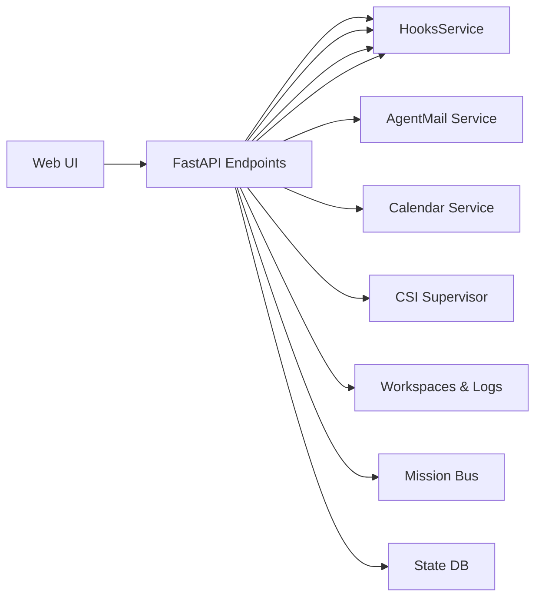

# Gateway Ops API

The **Ops API** is the primary HTTP/WebSocket interface exposed by `gateway_server.py`.

It runs on **port 8002** by default (configurable via `UA_GATEWAY_PORT`).

## 1. Overview

The gateway server provides:

- **Live Session Management**: Create, resume, preview, and manage live agent sessions with policy and budget controls
- **Durable Run Management**: Inspect run workspaces, run state, and attempts
- **Real-time Streaming**: WebSocket endpoints for live event streaming
- **Ops Administration**: Factory registration, VP mission control, cron jobs, hooks, skills, and models
- **Dashboard APIs**: CSI (digests, reports, briefings, health, SLO, specialist loops), notifications, events, approvals, activity, tutorials, Task Hub, pipeline metrics, Discord, supervisors, freelance pipeline
- **AgentMail Operations**: Full inbox management, thread browsing, draft creation, inbox queue control
- **Calendar and Scheduling**: Event management, change requests, nudge-overdue, SSE streaming
- **Health & Readiness**: Liveness probes, heartbeat wake, system health, telemetry briefings
- **Integration Endpoints**: YouTube ingest, signals ingest, Telegram ops, vision describe
- **File and Artifact Browsing**: Session file browsing, artifact directory, file upload



## 2. Authentication

### Ops Token

```
POST /auth/ops-token
```

Issues a JWT token for ops/administrative access.

**Request Body** (`OpsTokenIssueRequest`):
```json
{
  "password": "string"
}
```

**Response** (`OpsTokenIssueResponse`):
```json
{
  "token": "string",
  "expires_at": "ISO8601 timestamp"
}
```

### Comprehensive API Auth & Request Flow

```mermaid
sequenceDiagram
    participant C as Client (Web/CLI)
    participant Auth as Auth Middleware
    participant GW as Gateway Router
    participant Srv as Backend Service
    participant DB as SQLite / Redis

    C->>Auth: POST /auth/ops-token
    Auth-->>C: Returns JWT

    C->>GW: API Request (Auth: Bearer JWT)
    GW->>Auth: Validate JWT / Enforce Owner Lane
    
    alt Token Invalid
        Auth-->>C: 401 Unauthorized
    else Token Valid & Owner Matches
        Auth->>GW: Proceed Request
        GW->>Srv: Process Request
        Srv<->DB: State Read/Write
        Srv-->>GW: Result Payload
        GW-->>C: 200 OK Response
    end
```

### Auth Requirements

Most `/api/v1/ops/*` and `/api/v1/dashboard/*` endpoints require:
`Authorization: Bearer <token>` header with a valid ops JWT.

Session WebSocket endpoints may require auth when `UA_SESSION_API_AUTH_ENABLED=true`.

## 3. Health & Readiness

| Endpoint | Method | Description |
|----------|--------|-------------|
| `/` | GET | Root health check |
| `/api/v1/hooks/readyz` | GET | Hooks service readiness probe |
| `/api/v1/health` | GET | Detailed health status |

### Health Response

```json
{
  "status": "healthy",
  "checks": {
    "database": "ok",
    "redis": "ok",
    "filesystem": "ok"
  }
}
```

## 4. Live Session Management
| Endpoint | Method | Description |
|----------|--------|-------------|
| `/api/v1/sessions` | POST | Create new session |
| `/api/v1/sessions` | GET | List active sessions |
| `/api/v1/sessions/{id}` | GET | Get session details |
| `/api/v1/sessions/{id}` | DELETE | Delete the live session and its linked workspace if eligible |
| `/api/v1/ops/runs` | GET | List durable runs |
| `/api/v1/ops/runs/{id}` | GET | Get durable run details |

### Create Session

```
POST /api/v1/sessions
```

**Request Body** (`CreateSessionRequest`):
```json
{
  "session_id": "optional-custom-id",
  "user_id": "optional-user-identifier"
}
```

**Response** (`CreateSessionResponse`):
```json
{
  "session_id": "uuid",
  "workspace_path": "/path/to/workspace",
  "created_at": "ISO8601 timestamp"
}
```

### Session Details

```
GET /api/v1/sessions/{id}
```

**Response** (`SessionSummaryResponse`):
```json
{
  "session_id": "uuid",
  "path": "/path/to/workspace",
  "last_run_id": "optional-run-id",
  "status": "idle|running|error",
  "created_at": "ISO8601 timestamp"
}
```

### Durable Runs

```
GET /api/v1/ops/runs
GET /api/v1/ops/runs/{id}
```

These endpoints expose the durable run catalog. They are the canonical browsing surface for historical work, run metadata, and attempt state. Use the `/api/v1/sessions*` family only when you are dealing with a live execution session.

## 5. WebSocket Streaming
| Endpoint | Protocol | Description |
|----------|----------|-------------|
| `/ws/agent` | WebSocket | Gateway compatibility shim; browser traffic normally reaches the API server's `/ws/agent` bridge first |
| `/api/v1/sessions/{session_id}/stream` | WebSocket | Canonical gateway session event stream |

### Connection Flow

1. Browser clients normally connect to the API server's `/ws/agent` or `/api/v1/sessions/{session_id}/stream`
2. The API server validates dashboard auth and owner access, then proxies/bridges to the gateway stream
3. Trusted internal callers may connect directly to the gateway endpoints
4. Session events stream in real-time

### Event Types

- `text`: User input / assistant response
- `tool_call`: Tool invocation
- `tool_result`: Tool execution result
- `status`: Session status change
- `approval`: Approval request/response
- `error`: Error condition

## 6. Ops Administration

### Factory Registration
| Endpoint | Method | Description |
|----------|--------|-------------|
| `/api/v1/factory/capabilities` | GET | List factory capability labels |
| `/api/v1/factory/registrations` | POST | Register a factory worker |
| `/api/v1/factory/registrations` | GET | List active registrations |
| `/api/v1/factory/registrations/{factory_id}` | DELETE | Deregister a factory |

### Factory Control
| Endpoint | Method | Description |
|----------|--------|-------------|
| `/api/v1/ops/factory/update` | POST | Push factory configuration updates |
| `/api/v1/ops/factory/control` | POST | Control factory operations (start/stop/restart) |
| `/api/v1/ops/factory/local-service-control` | POST | Control local service instances |

### Delegation History
| Endpoint | Method | Description |
|----------|--------|-------------|
| `/api/v1/ops/delegation/history` | GET | View delegation event history |

### Proactive Artifacts
| Endpoint | Method | Description |
|----------|--------|-------------|
| `/api/v1/dashboard/proactive-artifacts` | GET | List durable proactive work-product artifacts; optionally sync proactive signal cards first |
| `/api/v1/dashboard/claude-code-intel` | GET | Read latest ClaudeDevs packet summary, recent packet history, checkpoint state, and Claude Code knowledge-vault pages for the dedicated dashboard review surface |
| `/api/v1/dashboard/proactive-artifacts/digest/preview` | GET | Preview the proactive review digest email; supports `include_calendar=true` |
| `/api/v1/dashboard/proactive-artifacts/digest/send` | POST | Send the proactive review digest through the initialized AgentMail service |
| `/api/v1/dashboard/proactive-artifacts/preferences/weekly/preview` | GET | Preview the weekly preference model report |
| `/api/v1/dashboard/proactive-artifacts/preferences/weekly/send` | POST | Send the weekly preference report through AgentMail |
| `/api/v1/dashboard/proactive-artifacts/{artifact_id}/feedback` | POST | Record explicit review feedback for an artifact |
| `/api/v1/dashboard/proactive-artifacts/{artifact_id}/send-review` | POST | Send one artifact as a review email |
| `/api/v1/dashboard/proactive-artifacts/codie/cleanup-task` | POST | Queue a review-gated CODIE cleanup Task Hub item |
| `/api/v1/dashboard/proactive-artifacts/codie/pr` | POST | Register a CODIE draft PR as a review artifact |
| `/api/v1/dashboard/proactive-artifacts/tutorial/build-task` | POST | Queue a private tutorial-build Task Hub item for CODIE |
| `/api/v1/dashboard/proactive-artifacts/tutorial/build-artifact` | POST | Register a completed private tutorial repo or local fallback artifact |
| `/api/v1/dashboard/proactive-artifacts/convergence/signature` | POST | Upsert a topic signature and optionally queue deterministic convergence detection |
| `/api/v1/dashboard/proactive-artifacts/convergence/extract` | POST | Extract a topic signature with LLM/fallback logic and optionally queue convergence detection |

Proactive artifact endpoints are review-oriented. They create inventory, Task Hub work candidates, review emails, and feedback records; they do not merge PRs, publish public repos, deploy production, or treat silence as rejection.

### VP Mission Control
| Endpoint | Method | Description |
|----------|--------|-------------|
| `/api/v1/vp/missions/dispatch` | POST | Dispatch a VP mission |
| `/api/v1/vp/missions/{mission_id}/cancel` | POST | Cancel a VP mission |
| `/api/v1/vp/missions/{mission_id}` | GET | Get mission status |
| `/api/v1/vp/missions` | GET | List VP missions |
| `/api/v1/vp/sessions` | GET | List VP sessions |
| `/api/v1/vp/sessions/{session_id}` | GET | Get VP session details |
| `/api/v1/vp/bridge-cursor` | GET/PUT | Manage VP bridge cursor |

### Cron Jobs
| Endpoint | Method | Description |
|----------|--------|-------------|
| `/api/v1/ops/timers` | GET | List scheduled cron jobs |
| `/api/v1/ops/cron` | POST | Create cron job |
| `/api/v1/ops/cron/{job_id}` | PUT | Update cron job |
| `/api/v1/ops/cron/{job_id}` | DELETE | Delete cron job |

### Ops Config
| Endpoint | Method | Description |
|----------|--------|-------------|
| `/api/v1/ops/config` | GET | Get current ops config |
| `/api/v1/ops/config` | PUT | Replace ops config |
| `/api/v1/ops/config/patch` | PATCH | Merge patch into config |

## 7. Dashboard APIs

### CSI Dashboard
| Endpoint | Method | Description |
|----------|--------|-------------|
| `/api/v1/dashboard/csi/digests` | GET | List CSI digests |
| `/api/v1/dashboard/csi/digests/{digest_id}/send-to-simone` | POST | Send digest to Simone |
| `/api/v1/dashboard/csi/purge` | POST | Purge CSI sessions |

### Notifications
| Endpoint | Method | Description |
|----------|--------|-------------|
| `/api/v1/dashboard/notifications` | GET | List notifications |
| `/api/v1/dashboard/notifications` | PATCH | Update notifications |
| `/api/v1/dashboard/notifications/purge` | POST | Purge notifications |

### Events
| Endpoint | Method | Description |
|----------|--------|-------------|
| `/api/v1/dashboard/events` | GET | List dashboard events |
| `/api/v1/dashboard/events/stream` | GET | Stream events (SSE) |
| `/api/v1/dashboard/events/counters` | GET | Get event counters |
| `/api/v1/dashboard/events/presets` | GET/POST | Manage event presets |

### Approvals
| Endpoint | Method | Description |
|----------|--------|-------------|
| `/api/v1/dashboard/approvals` | GET | List pending approvals |
| `/api/v1/dashboard/approvals/{id}` | PUT | Update approval status |

### Activity
| Endpoint | Method | Description |
|----------|--------|-------------|
| `/api/v1/dashboard/activity` | GET | List activity log entries |
| `/api/v1/dashboard/activity/{activity_id}` | GET | Get specific activity entry |
| `/api/v1/dashboard/activity/{activity_id}/send-to-simone` | POST | Send activity to Simone |
| `/api/v1/dashboard/activity/{activity_id}/action` | POST | Execute activity action |
| `/api/v1/dashboard/activity/{activity_id}` | DELETE | Delete activity entry |

### Task Hub
| Endpoint | Method | Description |
|----------|--------|-------------|
| `/api/v1/dashboard/todolist/dispatch-queue` | GET | Get dispatch queue state |
| `/api/v1/dashboard/todolist/dispatch-queue/rebuild` | POST | Rebuild dispatch queue |

### Tutorials
| Endpoint | Method | Description |
|----------|--------|-------------|
| `/api/v1/dashboard/tutorials/runs` | GET | List tutorial runs |
| `/api/v1/dashboard/tutorials/active-runs` | GET | List active tutorial runs |
| `/api/v1/dashboard/tutorials/runs/{run_id}` | DELETE | Cancel tutorial run |
| `/api/v1/dashboard/tutorials/notifications` | GET | Get tutorial notifications |
| `/api/v1/dashboard/tutorials/review-jobs` | GET | List tutorial review jobs |
| `/api/v1/dashboard/tutorials/review` | POST | Submit tutorial review |
| `/api/v1/dashboard/tutorials/bootstrap-repo` | POST | Bootstrap tutorial repo |

### System Resources
| Endpoint | Method | Description |
|----------|--------|-------------|
| `/api/v1/dashboard/system-resources` | GET | Get system resource usage (CPU, memory, disk) |

### System Commands
| Endpoint | Method | Description |
|----------|--------|-------------|
| `/api/v1/dashboard/system-commands` | POST | Execute system maintenance commands |

## 8. Integration Endpoints

### YouTube Ingest

```
POST /api/v1/youtube/ingest
```

Ingests YouTube video transcripts for processing.

**Request Body**:
```json
{
  "url": "https://youtube.com/watch?v=xxx",
  "options": {}
}
```

### Signals Ingest

```
POST /api/v1/signals/ingest
```

Ingests external signals (CSI events, webhooks).

### Telegram Ops

```
GET /api/v1/ops/telegram
```

Returns Telegram integration status and configuration.

### AgentMail

```
GET /api/v1/ops/agentmail
```

Returns AgentMail WebSocket connection status.

## 9. Hooks Service
| Endpoint | Method | Description |
|----------|--------|-------------|
| `/api/v1/hooks/{subpath:path}` | POST | Dynamic hook execution |

Hooks allow external systems to trigger agent actions via webhook-style endpoints.

### Hook Types

- Manual YouTube triggers
- CSI signal processing
- Custom webhook handlers

## 10. Session Continuity Metrics
| Endpoint | Method | Description |
|----------|--------|-------------|
| `/api/v1/ops/metrics/session-continuity` | GET | Get session continuity metrics (resume/attach rates, window counts) |

## 11. Session MCP Management
| Endpoint | Method | Description |
|----------|--------|-------------|
| `/api/v1/ops/sessions/{session_id}/mcp` | GET | List MCP servers for session |
| `/api/v1/ops/sessions/{session_id}/mcp` | POST | Add MCP server to session |
| `/api/v1/ops/sessions/{session_id}/mcp` | DELETE | Remove MCP server from session |

## 12. Memory Operations
| Endpoint | Method | Description |
|----------|--------|-------------|
| `/api/v1/ops/memory/compact-task-intel` | POST | Compact task intelligence memory |

## 13. Work Threads
| Endpoint | Method | Description |
|----------|--------|-------------|
| `/api/v1/ops/work-threads` | GET | List work threads |
| `/api/v1/ops/work-threads` | POST | Create work thread |
| `/api/v1/ops/work-threads/decide` | POST | Submit decision for work thread |
| `/api/v1/ops/work-threads/{thread_id}` | PATCH | Update work thread |

## 14. Session Operations
| Endpoint | Method | Description |
|----------|--------|-------------|
| `/api/v1/ops/sessions/{id}/reset` | POST | Reset the live session and its linked run workspace state |
| `/api/v1/ops/sessions/{id}/compact` | POST | Compact session logs |
| `/api/v1/ops/sessions/{id}/archive` | POST | Archive session |
| `/api/v1/ops/sessions/{id}/cancel` | POST | Cancel running session |

## 15. Session Lifecycle Extensions

| Endpoint | Method | Description |
|----------|--------|-------------|
| `/api/v1/sessions/{id}/resume` | POST | Resume a paused or disconnected session |
| `/api/v1/sessions/{id}/policy` | GET | Get session execution policy (timeout, budget) |
| `/api/v1/sessions/{id}/pending` | GET | Check for pending approval or input on session |
| `/api/v1/ops/sessions/{id}/preview` | GET | Preview session workspace contents without full load |
| `/api/v1/ops/sessions/cancel` | POST | Cancel a running session by query params |
| `/api/v1/ops/sessions/purge-stale` | POST | Bulk purge stale sessions past TTL |
| `/api/v1/ops/sessions/csi/purge` | POST | Purge CSI-related session artifacts |

## 16. Runs and Attempts

| Endpoint | Method | Description |
|----------|--------|-------------|
| `/api/v1/runs` | GET | List durable runs |
| `/api/v1/runs/{id}` | GET | Get durable run details |
| `/api/v1/runs/{id}/attempts` | GET | List attempts for a run |

## 17. Dashboard Task Hub (ToDo)

| Endpoint | Method | Description |
|----------|--------|-------------|
| `/api/v1/dashboard/todolist/overview` | GET | Task Hub overview (counts by lane) |
| `/api/v1/dashboard/todolist/personal-queue` | GET | Personal task queue for authenticated owner |
| `/api/v1/dashboard/todolist/agent-queue` | GET | Agent-visible dispatch queue |
| `/api/v1/dashboard/todolist/agent-activity` | GET | Agent activity feed |
| `/api/v1/dashboard/todolist/morning-report` | GET | Morning report summary |
| `/api/v1/dashboard/todolist/email-tasks` | GET | Email-sourced tasks |
| `/api/v1/dashboard/todolist/completed` | GET | Completed tasks |
| `/api/v1/dashboard/todolist/completed/{id}` | DELETE | Delete completed task |
| `/api/v1/dashboard/todolist/tasks` | POST | Create new task |
| `/api/v1/dashboard/todolist/tasks/{id}/action` | POST | Execute task action |
| `/api/v1/dashboard/todolist/tasks/{id}/dispatch` | POST | Dispatch task to agent |
| `/api/v1/dashboard/todolist/tasks/{id}/approve` | POST | Approve task |
| `/api/v1/dashboard/todolist/tasks/{id}/decompose` | POST | Decompose task into subtasks |
| `/api/v1/dashboard/todolist/tasks/{id}/refine` | POST | Trigger brainstorm refinement |
| `/api/v1/dashboard/todolist/tasks/{id}/subtasks` | GET | List subtasks |
| `/api/v1/dashboard/todolist/tasks/{id}/complete-subtask` | POST | Complete a subtask |
| `/api/v1/dashboard/todolist/tasks/{id}/questions` | GET | Get refinement questions |
| `/api/v1/dashboard/todolist/tasks/{id}/answer-question` | POST | Answer refinement question |
| `/api/v1/dashboard/todolist/tasks/{id}/refinement-state` | GET | Get refinement pipeline state |
| `/api/v1/dashboard/todolist/tasks/{id}/history` | GET | Task execution history |
| `/api/v1/dashboard/todolist/dispatch-queue` | GET | Dispatch queue state |
| `/api/v1/dashboard/todolist/dispatch-queue/rebuild` | POST | Rebuild dispatch queue |

## 18. Dashboard Pipeline and Agent Metrics

| Endpoint | Method | Description |
|----------|--------|-------------|
| `/api/v1/dashboard/summary` | GET | High-level system summary |
| `/api/v1/dashboard/capacity` | GET | Agent capacity governor state |
| `/api/v1/dashboard/pipeline-stats` | GET | Pipeline throughput statistics |
| `/api/v1/dashboard/proactive-pipeline` | GET | Proactive pipeline phases and status |
| `/api/v1/dashboard/agent-assignments` | GET | Current agent-to-task assignments |
| `/api/v1/dashboard/agent-metrics` | GET | Per-agent performance metrics |
| `/api/v1/dashboard/human-actions/highlight` | GET | Highlighted human action items |
| `/api/v1/dashboard/metrics/coder-vp` | GET | Coder VP mission metrics |
| `/api/v1/dashboard/freelance/pipeline` | GET | Freelance pipeline status and jobs |

## 19. Dashboard CSI Extended

| Endpoint | Method | Description |
|----------|--------|-------------|
| `/api/v1/dashboard/csi/reports` | GET | List CSI reports |
| `/api/v1/dashboard/csi/briefings` | GET | List CSI briefings |
| `/api/v1/dashboard/csi/health` | GET | CSI source health overview |
| `/api/v1/dashboard/csi/delivery-health` | GET | CSI delivery reliability metrics |
| `/api/v1/dashboard/csi/reliability-slo` | GET | CSI reliability SLO tracking |
| `/api/v1/dashboard/csi/opportunities` | GET | CSI opportunity signals |
| `/api/v1/dashboard/csi/specialist-loops` | GET | CSI specialist loop status |
| `/api/v1/dashboard/csi/specialist-loops/{key}/action` | POST | Execute specialist loop action |
| `/api/v1/dashboard/csi/specialist-loops/triage` | POST | Triage specialist loop topics |
| `/api/v1/dashboard/csi/specialist-loops/cleanup` | POST | Cleanup stale specialist loops |
| `/api/v1/dashboard/csi/digests/{id}` | DELETE | Delete individual digest |
| `/api/v1/dashboard/csi/digests` | DELETE | Bulk delete all digests |

## 20. Dashboard Discord

| Endpoint | Method | Description |
|----------|--------|-------------|
| `/api/v1/dashboard/discord/overview` | GET | Discord bot overview and status |
| `/api/v1/dashboard/discord/events` | GET | Discord event log |
| `/api/v1/dashboard/discord/channels` | GET | List Discord channels |
| `/api/v1/dashboard/discord/channels/{id}` | PATCH | Update Discord channel config |

## 21. Dashboard Proactive Signals

Manage proactive signal cards surfaced from CSI, Discord, and other intelligence sources. Cards represent actionable signals that require operator review, feedback, or action dispatch.

| Endpoint | Method | Description |
|----------|--------|-------------|
| `/api/v1/dashboard/proactive-signals` | GET | List proactive signal cards (syncs from CSI and Discord DBs first) |
| `/api/v1/dashboard/proactive-signals/{card_id}/feedback` | PATCH | Record feedback on a signal card (tags, text, status change) |
| `/api/v1/dashboard/proactive-signals/{card_id}/action` | POST | Apply an action to a signal card (triggers background rule distillation) |
| `/api/v1/dashboard/proactive-signals/{card_id}` | DELETE | Silently delete a signal card (not treated as preference feedback) |

### Query Parameters (list)

| Param | Default | Description |
|-------|---------|-------------|
| `source` | `all` | Filter by source (`all`, `csi`, `discord`, etc.) |
| `status` | `pending` | Filter by status (`pending`, `approved`, `rejected`, etc.) |
| `limit` | `80` | Maximum cards to return |

### Feedback Request Body

```json
{
  "status": "optional-new-status",
  "feedback_tags": ["tag1", "tag2"],
  "feedback_text": "Optional free-text feedback"
}
```

### Action Request Body

```json
{
  "action_id": "string",
  "feedback_tags": ["tag1"],
  "feedback_text": "Optional context"
}
```

Both feedback and action endpoints trigger background rule distillation when feedback text or tags are provided, automatically updating `docs/proactive_signals/generation_rules.md` with learned preferences.

Related implementation:
- `src/universal_agent/proactive_signals.py` — Card management, feedback recording, rule distillation
- `src/universal_agent/gateway_server.py` — Dashboard API endpoints

## 22. Dashboard Supervisors

| Endpoint | Method | Description |
|----------|--------|-------------|
| `/api/v1/dashboard/supervisors/registry` | GET | List registered supervisors |
| `/api/v1/dashboard/supervisors/{id}/snapshot` | GET | Get supervisor state snapshot |
| `/api/v1/dashboard/supervisors/{id}/run` | POST | Trigger supervisor run |
| `/api/v1/dashboard/supervisors/{id}/runs` | GET | List supervisor run history |

## 23. AgentMail Extended Ops

| Endpoint | Method | Description |
|----------|--------|-------------|
| `/api/v1/ops/agentmail/send` | POST | Send email via AgentMail |
| `/api/v1/ops/agentmail/threads` | GET | List AgentMail threads |
| `/api/v1/ops/agentmail/threads/{id}` | GET | Get thread details |
| `/api/v1/ops/agentmail/threads/{id}/messages` | GET | Get thread messages |
| `/api/v1/ops/agentmail/threads/bulk_delete` | DELETE | Bulk delete threads |
| `/api/v1/ops/agentmail/drafts` | GET | List drafts |
| `/api/v1/ops/agentmail/drafts/{id}` | GET | Get draft details |
| `/api/v1/ops/agentmail/drafts/{id}/send` | POST | Send a draft |
| `/api/v1/ops/agentmail/inbox-queue` | GET | List inbox queue entries |
| `/api/v1/ops/agentmail/inbox-queue/{id}/cancel` | POST | Cancel queued inbox item |
| `/api/v1/ops/agentmail/inbox-queue/{id}/retry-now` | POST | Retry a queued inbox item |
| `/api/v1/ops/agentmail/messages` | GET | List AgentMail messages |

## 24. Calendar and Scheduling

| Endpoint | Method | Description |
|----------|--------|-------------|
| `/api/v1/ops/calendar/events` | GET | List calendar events |
| `/api/v1/ops/calendar/events/{id}/action` | POST | Execute calendar event action |
| `/api/v1/ops/calendar/events/{id}/change-request` | POST | Submit change request for event |
| `/api/v1/ops/calendar/events/{id}/change-request/confirm` | POST | Confirm a change request |
| `/api/v1/ops/calendar/nudge-overdue` | POST | Nudge overdue calendar events |
| `/api/v1/ops/scheduling/events` | GET | List scheduling events |
| `/api/v1/ops/scheduling/stream` | GET | Stream scheduling events (SSE) |

## 25. Skills and Models

| Endpoint | Method | Description |
|----------|--------|-------------|
| `/api/v1/ops/skills` | GET | List available skills |
| `/api/v1/ops/skills/{key}` | PATCH | Update skill configuration |
| `/api/v1/ops/skills/{key}/doc` | GET | Get skill documentation |
| `/api/v1/ops/models` | GET | List available models |

## 26. Channels, Presence, and System Events

| Endpoint | Method | Description |
|----------|--------|-------------|
| `/api/v1/ops/channels` | GET | List active channels |
| `/api/v1/ops/channels/{id}/probe` | POST | Probe channel connectivity |
| `/api/v1/ops/channels/{id}/logout` | POST | Logout from channel |
| `/api/v1/system/presence` | GET | Get agent presence/availability state |
| `/api/v1/system/events` | GET | Get system events |
| `/api/v1/system/event` | POST | Post system event |

## 27. Additional Metrics and Budget

| Endpoint | Method | Description |
|----------|--------|-------------|
| `/api/v1/ops/metrics/scheduling-runtime` | GET | Scheduling runtime performance metrics |
| `/api/v1/ops/metrics/activity-events` | GET | Activity event metrics |
| `/api/v1/ops/metrics/vp` | GET | VP mission metrics |
| `/api/v1/ops/metrics/vp-bridge` | GET | VP bridge cursor/latency metrics |
| `/api/v1/ops/metrics/coder-vp` | GET | Coder VP specific metrics |
| `/api/v1/ops/session-budget/status` | GET | Current session token budget status |
| `/api/v1/ops/session-budget/heavy-mode` | POST | Toggle heavy execution mode |

## 28. Factory Live Chrome

| Endpoint | Method | Description |
|----------|--------|-------------|
| `/api/v1/factory/live-chrome/status` | GET | Live Chrome tunnel status |
| `/api/v1/factory/live-chrome/status` | POST | Start/stop Live Chrome tunnel |

## 29. Heartbeat and Telemetry

| Endpoint | Method | Description |
|----------|--------|-------------|
| `/api/v1/heartbeat/last` | GET | Get last heartbeat run metadata |
| `/api/v1/heartbeat/wake` | POST | Trigger immediate heartbeat wake |
| `/api/v1/ops/telemetry/briefing` | POST | Generate telemetry briefing |
| `/api/v1/ops/system-health` | GET | System health overview |

## 30. Artifacts and File Browsing

| Endpoint | Method | Description |
|----------|--------|-------------|
| `/api/artifacts` | GET | Browse artifact directory |
| `/api/artifacts/files/{path}` | GET | Get artifact file contents |
| `/api/files` | GET | Browse session file directories |
| `/api/files/{session_id}/{path}` | GET | Get file contents from a session |
| `/api/v1/sessions/{id}/upload` | POST | Upload file to session workspace |

## 31. Vision

| Endpoint | Method | Description |
|----------|--------|-------------|
| `/api/v1/vision/describe` | POST | Describe an image using vision model |

## 32. Environment Variables

Key environment variables controlling gateway behavior:

| Variable | Default | Description |
|----------|---------|-------------|
| `UA_GATEWAY_PORT` | `8002` | HTTP server port |
| `UA_GATEWAY_HOST` | `0.0.0.0` | Bind address |
| `UA_WORKSPACES_DIR` | `AGENT_RUN_WORKSPACES/` | Session workspaces directory |
| `UA_SESSION_API_AUTH_ENABLED` | `false` | Enable session API auth |
| `UA_OPS_AUTH_ENABLED` | `true` | Enable ops auth |
| `UA_OPS_AUTH_PASSWORD` | - | Password for ops token issuance |

## 33. Error Responses

All endpoints return standard HTTP status codes:

- `200`: Success
- `201`: Created
- `400`: Bad Request (validation error)
- `401`: Unauthorized
- `403`: Forbidden
- `404`: Not Found
- `409`: Conflict
- `422`: Unprocessable Entity
- `500`: Internal Server Error

Error response body:
```json
{
  "detail": "Error message describing the issue"
}
```

## 34. Source Files

Primary implementation:
- `src/universal_agent/gateway_server.py` — Main FastAPI application

Related services:
- `src/universal_agent/ops_service.py` — Ops service implementation
- `src/universal_agent/heartbeat_service.py` — Heartbeat management
- `src/universal_agent/cron_service.py` — Cron job management
- `src/universal_agent/hooks_service.py` — Hooks processing
- `src/universal_agent/timeout_policy.py` — WebSocket timeouts

## 35. Related Documentation

- `docs/02_Flows/07_WebSocket_Architecture_And_Operations_Source_Of_Truth_2026-03-06.md` — WebSocket details
- `docs/02_Flows/08_Gateway_And_Web_UI_Auth_And_Session_Security_Source_Of_Truth_2026-03-06.md` — Auth flows
- `docs/04_API_Reference/` — Other API documentation
