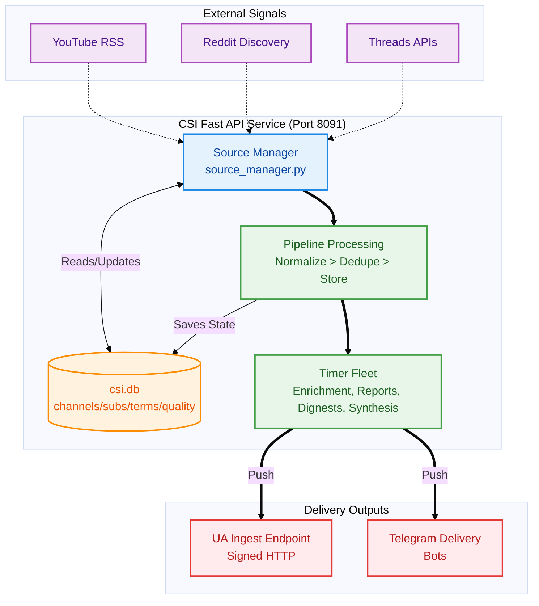

# CSI Master Architecture & Design Document

> **Status**: Living document — updated alongside CSI redesign phases.
> **Supersedes**: `03_Operations/92_CSI_Architecture_And_Operations_Source_Of_Truth_2026-03-06.md` (for architecture reference), `csi-rebuild/` (for rebuild-era docs), `005_CSI_YOUTUBE_PROXY_USAGE_AUDIT.md`, `006_CSI_TREND_ANALYSIS_FUNCTIONAL_REVIEW_AND_PLAN.md`, `007_CSI_PERSISTENCE_BRIEFING_AND_REMINDER_OPERATIONS.md`

## 1. Purpose & Vision

Creator Signal Intelligence (CSI) is the external data collection and analysis subsystem of Universal Agent. It:

- **Collects** signals from YouTube, Reddit, Threads, and RSS feeds
- **Enriches** content via LLM analysis (Claude Haiku 3.5 for real-time, Gemini Flash for batch)
- **Scores** source quality over time for automatic curation
- **Produces** domain-focused intelligence briefs and reports
- **Delivers** findings to UA via signed HTTP, Telegram, and the dashboard CSI tab

Current UA ingest boundary:

- YouTube playlist events may dispatch into the UA tutorial pipeline.
- CSI RSS/channel analytics are passive by default: UA stores digest/convergence evidence for dashboard and proactive artifact surfaces rather than dispatching every analytics event into an agent lane.
- Selected high-confidence convergence/proactive artifacts may still become Task Hub work through the newer proactive producer path.

## 2. Domain Taxonomy

The 9-domain taxonomy classifies all signals:

| Domain | Scope |
|---|---|
| `ai_models` | LLMs, foundation models, training, benchmarks |
| `ai_coding` | Agentic coding, dev tools, code generation |
| `ai_applications` | Applied AI products, multimodal, consumer AI |
| `ai_business` | AI industry, funding, strategy, policy |
| `geopolitics` | International relations, diplomacy, security |
| `conflict` | Active conflicts, military, defense analysis |
| `economics` | Markets, macro, monetary policy, trade |
| `technology` | Non-AI tech: security, infrastructure, hardware |
| `other_signal` | Catchall for unclassified content |

Implementation: `csi_ingester/analytics/categories.py`

## 3. Architecture

## 3. Architecture

> [!TIP]
> The subsystem data flow map below visualizes the components of CSI and their interactions.

## 4. Source Management (SQLite)

Sources are managed in `csi.db` (not JSON files). JSON files remain as seed data.

### Tables (Migration 0009)

| Table | Key | Purpose |
|---|---|---|
| `youtube_channels` | `channel_id` | 444 channels, domain/tier tagged |
| `reddit_sources` | `subreddit` | 33 subreddits with domain/tier |
| `threads_search_terms` | `term` | ~40 terms from 7 domain packs |
| `source_quality_history` | `id` | Time-series quality scores |

### Quality Scoring

Each source accumulates a weighted quality score:
- **Relevance** (40%): In-domain content ratio
- **Engagement** (20%): Interaction metrics (views, score, likes)
- **Novelty** (20%): New-information yield
- **Confidence** (20%): Assessment volume

### Tier System

| Tier | Policy | Promotion | Demotion |
|---|---|---|---|
| 1 (Core) | Every cycle | score ≥ 0.7, 3+ assessments | N/A (manual only) |
| 2 (Standard) | Normal | score ≥ 0.7 → Tier 1 | score < 0.3 → Tier 3 |
| 3 (Low) | Reduced | score ≥ 0.5 → Tier 2 | score < 0.2 → disabled |

### Adapter Integration

Adapters use DB-first, JSON-fallback pattern:
1. `adapter.set_db_connection(conn)` wires DB
2. On first poll, seeds JSON → DB (idempotent)
3. Queries active sources from DB with domain/tier filters
4. Falls back to legacy JSON if DB unavailable

Files: `youtube_channel_rss.py`, `reddit_discovery.py`

## 5. Processing Pipeline

### Batch Schedule (Tiered Frequency)

**Collection** runs at source-appropriate intervals (cheap HTTP/API calls):

| Source | Cadence | Rationale |
|---|---|---|
| Reddit enrichment | Every 3h | Fast-moving signals, breaking AI news |
| Threads enrichment | Every 4h | Keyword search, less time-critical |
| YouTube RSS enrichment | Every 4h | Videos don't go stale quickly |
| DLQ replay | Every 4h | Retries aren't urgent |

**Digest reports** run 3x daily at fixed windows (Central Time):

| Window | CT | UTC | Report sequence |
|---|---|---|---|
| Morning | 7:00 AM | 12:00 | :12 RSS → :18 Reddit+Threads → :25 Global |
| Afternoon | 1:00 PM | 18:00 | Same sequence |
| Evening | 7:00 PM | 00:00 | Same sequence |

**Daily jobs:**
- Quality assessment: 11:00 PM CT (04:00 UTC)
- DB backup: 3:40 AM local
- Token refresh: 3:15 AM local

### Timer Fleet

Key scripts in `scripts/`:
- `csi_source_quality_assessment.py` — Evening quality scoring
- `csi_rss_telegram_digest.py` — YouTube digest to Telegram
- `csi_reddit_telegram_digest.py` — Reddit digest to Telegram
- `csi_batch_brief.py` — Global trend brief generation

## 6. Delivery & Integration

### CSI → UA (Signed HTTP)
- Endpoint: `http://127.0.0.1:8002/api/v1/signals/ingest`
- Auth: Bearer token + HMAC-SHA256 signature
- Envelope: `{csi_version, csi_instance_id, batch_id, events[]}`

### Dashboard CSI Tab
- Frontend: `web-ui/app/dashboard/csi/page.tsx`
- Backend: `/api/v1/dashboard/csi/digests`

> [!IMPORTANT]
> Report titles must convey actionable value (headline, key finding) — not generic slugs like "CSI: rss_trend_report". This is a known issue being addressed.

## 7. Environment & Secrets

All secrets via Infisical (`CSI_INFISICAL_ENABLED=1`).

Key env vars: `CSI_DB_PATH`, `CSI_CONFIG_PATH`, `CSI_INSTANCE_ID`, `CSI_UA_ENDPOINT`, `CSI_UA_SHARED_SECRET`, Telegram bot tokens per stream.

## 8. Key Boundaries

> [!IMPORTANT]
> **Two YouTube Watching Systems Exist** with separate databases and state:
> - **Playlist Watcher** (UA-native) — watches specific playlists, state in `youtube_playlist_watcher_state.json`
> - **CSI RSS Channel Feed** (CSI Ingester) — watches 444+ channel RSS feeds, state in `csi.db → source_state`
>
> These are managed as **two distinct data entities**. Resetting one does NOT reset the other.
> See `docs/03_Operations/99_Tutorial_Pipeline_Architecture_And_Operations.md` §1.1 for details.

- **Tutorial playlist polling** → Moved to native UA (`youtube_playlist_watcher.py`)
- **CSI RSS channel polling** → CSI Ingester (`youtube_channel_rss.py`), state in `csi.db`
- **CSI owns**: signal ingestion, enrichment, analytics, reporting, quality assessment
- **UA owns**: tutorial pipeline, dashboard rendering, hook dispatch
- **Shared resource**: Residential proxy (Webshare/DataImpulse) — used by UA for transcript ingestion, not by CSI for RSS polling

## 9. Document Trail

| Document | Status |
|---|---|
| This document | **Canonical** — living |
| `03_Operations/92_CSI_...2026-03-06.md` | Superseded for architecture (keep for ops reference) |
| `csi-rebuild/` | Historical rebuild docs |
| `005/006/007_CSI_*.md` | Superseded |

---

*Last updated: 2026-03-19 — Phase 3 (adapter wiring, quality assessment)*
