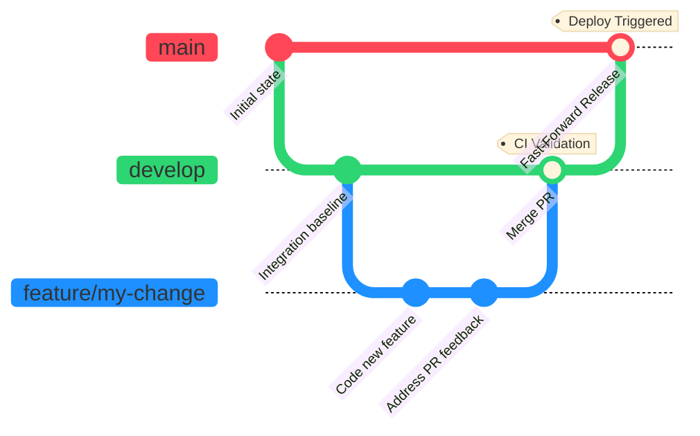

# Branching and Release Workflow

Last updated: April 18, 2026

## Purpose

This document defines the current branch policy for day-to-day coding, integration review, and production release.

Use this document as the operational source of truth for how code should move through the repository.

## Canonical Rule

There are three practical branch roles:

1. `feature/...` branches for active coding work
2. `develop` for integrated review and CI validation
3. `main` for production release

Do not use long-lived historical branches as the default development lane.

## Current Deployment Contract

GitHub Actions is the only supported application deployment path.

1. Open a pull request to `develop` to run Codex review on the proposed change.
2. Merge to `develop` after review and CI validation.
3. Fast-forward the exact validated `develop` SHA to `main`; the push to `main` triggers the single production deploy workflow.

Supporting references:

- `docs/deployment/ci_cd_pipeline.md`
- `docs/deployment/architecture_overview.md`
- `AGENTS.md`

## Environment Mapping

| Branch | Role | Deployment Target |
|------|------|-------------------|
| `feature/...` | local development and review | no automatic deploy |
| `develop` | integration and review branch | no automatic deploy |
| `main` | release branch | production VPS |

## Required Working Method

### 1. Start New Work

Create new work from `develop`.

```bash
git checkout develop
git pull --ff-only
git checkout -b feature/my-change
```

### 2. Do Local Development

Work on the `feature/...` branch until the change is locally ready.

For the main product UI and gateway, local development should happen from the repo checkout in **HQ dev mode**, not from the local worker environment.

Local checkout roles:

1. `/home/kjdragan/lrepos/universal_agent` = HQ dev lane
2. `~/universal_agent_factory` = optional local worker lane

If localhost starts returning role-based `403` responses on HQ dashboard pages, the repo checkout is almost certainly no longer bootstrapped as `development + HEADQUARTERS + local_workstation`.

Typical local loop:

1. code
2. run targeted tests
3. build affected surfaces as needed
4. commit the feature branch

### 3. Integrate Through Develop

When the change should be reviewed and integrated:

1. open a pull request from the feature branch into `develop`
2. let Codex review the PR, or let the workflow soft-skip if `OPENAI_API_KEY` is not configured yet
3. merge or fast-forward the feature branch into `develop`
4. validate CI and any required local/browser checks

### 4. Promote to Production

Only after `develop` validation is acceptable:

1. record the exact validated `develop` commit SHA
2. fast-forward `main` to that SHA
3. wait for `.github/workflows/deploy.yml` to pass
4. validate production

Validation rule:

- confirm the live environment by deployed `HEAD` SHA and observed runtime behavior
- do not treat a checkout label like `develop` or local branch assumptions as sufficient proof of what is running

### 5. Return The Local Checkout To The Active Feature Branch

After integration validation, production promotion, or deploy debugging, return the local coding checkout to the active feature branch.

Current default:

1. production/integration operations may temporarily move the local repo to `develop`
2. once validation is finished, restore the local repo to `feature/latest2`
3. only leave a different feature branch checked out if it has explicitly replaced `feature/latest2` as the active development lane

## What Not To Do

1. Do not do normal coding directly on `main`.
2. Do not treat `dev-parallel` as the active integration branch.
3. Do not use `scripts/vpsctl.sh`, `ssh`, `scp`, or `rsync` as the default application deployment path. Older scripts like `deploy_vps.sh` have been completely removed.

Those older scripts are legacy or break-glass tooling only. The `.agents/workflows/ship.md` automation workflow should be used as the standard proxy command to trigger deployments.

> [!IMPORTANT]
> The `/ship` workflow includes a guard that **refuses to run from `main` or `develop`**. It must be invoked from a feature branch. After deployment, it automatically returns you to the feature branch and fast-forwards it to stay in sync with `main`.

4. Do not assume production is missing a fix until you verify the deployed VPS `HEAD` SHA directly.

## Status Snapshot As Of March 12, 2026

This snapshot explains why the current branch policy was chosen.

1. `develop` and `main` were aligned at the same latest commit.
2. `dev-parallel` was behind both `develop` and `main` by 37 commits.
3. `develop` was the active integration branch.
4. Production deploy from `main` was green.

That means:

1. `develop` is the correct active integration branch.
2. `main` is a working production branch.
3. `dev-parallel` is a stale historical branch and should not be used as the normal base for future work.

## Practical Usage

### If you want integration only

Tell the agent to:

`Open or update a PR from my current feature branch into develop, run Codex review, merge it if acceptable, and verify CI/local checks.`

### If you want full rollout

Tell the agent to:

`Open or update a PR from my current feature branch into develop, run Codex review, merge it if acceptable, verify CI/local checks, then fast-forward the validated develop SHA to main and verify production.`

## Summary

The default operating model is:

1. branch from `develop`
2. code on `feature/...`
3. review and merge through a PR into `develop`
4. validate CI/local checks on `develop`
5. fast-forward the exact validated `develop` SHA to `main`
6. release through the `main` deploy workflow

## 1. One-Minute Cheat Sheet

Use this if you just want the shortest correct explanation.

1. Start new work from `develop`.
2. Do your coding on a `feature/...` branch.
3. Open a PR into `develop` when you want Codex review and integration validation.
4. Promote only the exact validated `develop` SHA to `main`.

Short meanings:

1. `feature/...` = your working branch
2. `develop` = integration branch
3. `main` = production branch

## 2. Exact Git Commands

### Start a new feature

```bash
git checkout develop
git pull --ff-only
git checkout -b feature/my-change
```

### Integrate through develop

```bash
git push -u origin feature/my-change
gh pr create --base develop --head feature/my-change --fill
```

That opens the reviewed path. After the PR is approved and merged, validate CI and any required local/browser checks from `develop`.

### Promote to production after develop validation passes

```bash
git checkout main
git merge --ff-only <validated_sha>
git push origin main
```

That fast-forwards `main` to the exact validated `develop` commit and triggers `.github/workflows/deploy.yml`.

## 3. Branch Flow Diagram

> [!TIP]
> The diagram below visualizes our branch policy. This entire process is automated via the `/ship` slash command workflow which handles the merges and triggering of CI/CD.



*As demonstrated in the exhibit above, work originates on feature branches, merges exclusively into `develop` for CI validation and review, and relies entirely on a fast-forward operation to `main` to trigger the production deploy via GitHub Actions. At no point is standard development performed directly on `main` or `develop`.*

For local runtime mode details, see:

- `docs/06_Deployment_And_Environments/05_Local_Runtime_Modes.md`

If deployment behavior changes later, update this file together with the GitHub Actions workflow documentation.
