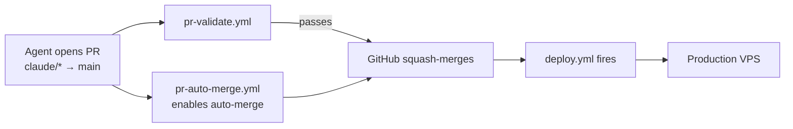
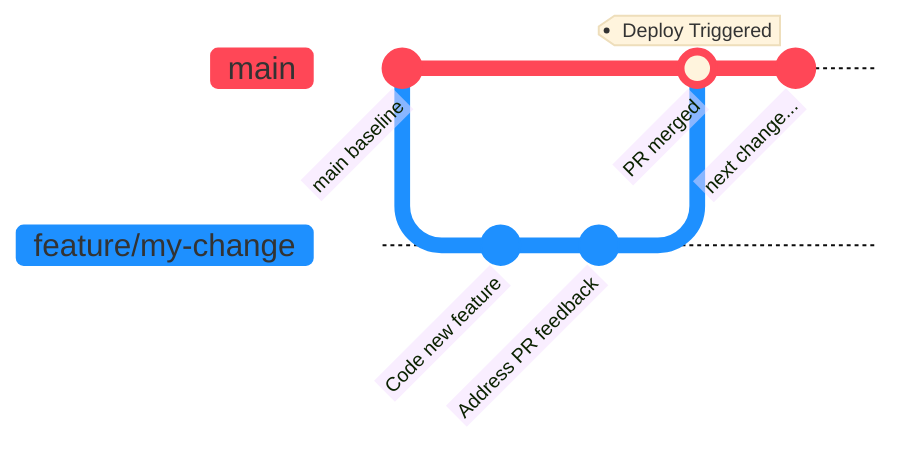

# Branching and Release Workflow

Last updated: 2026-05-11 (added `pr-auto-merge.yml` for `claude/*` PRs to `main`; full PR-to-production flow now hands-free for agent PRs)

## Purpose

This document defines the current branch policy for day-to-day coding, integration review, and production release.

Use this document as the operational source of truth for how code should move through the repository.

## Canonical Rule

There are exactly two practical branch roles:

1. **Feature branches** for active coding work. Tier-1 convention: `feature/latest2` (Kevin's pseudo-trunk). Tier-2 (autonomous bots): `<bot-name>/<task-id>`.
2. **`main`** for production release.

That's it. No `develop`, no `dev-parallel`, no staging branch. PR-Validate CI is the only pre-merge gate.

> **2026-05-10 simplification:** the `develop` branch was retired. Earlier docs that describe a `feature/latest2 → develop → main` chain are stale. The aspirational "develop = staging" environment never materialized; the chain was adding failure modes (silent no-op pushes, stale-branch divergence, mid-chain `git fetch` flakes) without delivering any integration value. Single PR target (`main`) collapses three-step ship cycles to one.

## Current Deployment Contract

GitHub Actions is the only supported application deployment path.

1. Push your work to a feature branch.
2. Open a pull request to `main` (use `/ship` or `gh pr create --base main`).
3. `pr-validate.yml` runs `py_compile` + `ruff` + `pytest tests/unit`. Required to pass.
4. Operator reviews and merges. The merge to `main` triggers `.github/workflows/deploy.yml`.
5. Production VPS updates automatically.

`deploy.yml` has a `paths-ignore` filter (`docs/**`, `**.md`, `reports/**`, `state/**`, `artifacts/**`) so docs-only / report-only commits merging to `main` (e.g. nightly drift report, openclaw release sync state) don't restart the gateway. Mixed code+docs commits still deploy — that's the safe default.

Supporting references:

- [`docs/deployment/ci_cd_pipeline.md`](../deployment/ci_cd_pipeline.md)
- [`docs/deployment/architecture_overview.md`](../deployment/architecture_overview.md)
- [`docs/deployment/ai_coder_instructions.md`](../deployment/ai_coder_instructions.md)
- `AGENTS.md` (symlinked from `CLAUDE.md`)

## Environment Mapping

| Branch | Role | Deployment Target |
|------|------|-------------------|
| `feature/latest2` (or any feature branch) | local development and PR preparation | no automatic deploy |
| `main` | release branch | production VPS, via `.github/workflows/deploy.yml` |

## Required Working Method

### 1. Start New Work

Create a feature branch from `main`:

```bash
git checkout main
git pull --ff-only
git checkout -b feature/my-change   # or kevin/my-change, claude/my-task, etc.
```

For tier-1 work where Kevin is iterating quickly in Antigravity, working on `feature/latest2` directly is fine — that's the operator's pseudo-trunk by convention.

### 2. Do Local Development

Local checkout roles:

1. `/home/kjdragan/lrepos/universal_agent` = HQ dev lane (`INFISICAL_ENVIRONMENT=development`, `FACTORY_ROLE=HEADQUARTERS`, `UA_DEPLOYMENT_PROFILE=local_workstation`)
2. `~/universal_agent_factory` = optional local worker lane

If localhost starts returning role-based `403` responses on HQ dashboard pages, the repo checkout is almost certainly no longer bootstrapped as `development + HEADQUARTERS + local_workstation`.

Typical local loop:

1. code
2. run targeted tests (`uv run pytest tests/unit/<area> -x -q`)
3. build affected surfaces as needed
4. commit on the feature branch

### 3. Open the PR to `main`

When the change is ready:

```bash
git push -u origin feature/my-change
# Either: run /ship (it opens the PR for you and watches CI)
# Or:    gh pr create --base main --head feature/my-change --fill
```

### 4. CI runs, operator merges

`pr-validate.yml` runs on every PR to `main`:

1. `python -m py_compile` on every changed `.py` file.
2. `ruff check --select E9,F` (errors only).
3. `pytest tests/unit -x -q` (fast unit-test subset).
4. Refuse merge if any `.py.bak` / `.swp` / `.orig` file is in the diff.

Once green, click Merge in the GitHub UI. The merge to `main` triggers `.github/workflows/deploy.yml`, which deploys to the production VPS.

### 5. Verify production runs the new code

After deploy, hit `GET /api/v1/version` on production and confirm the `commit_sha` matches the merge SHA — the canonical Rule A from `CLAUDE.md` § Production Verification Rules.

```bash
curl -s https://app.clearspringcg.com/api/v1/version | jq
# {"commit_sha": "<merge-sha>", "branch": "...", "process_started_at": "..."}
```

## What Not To Do

1. **Do not push directly to `main`.** All changes flow through PR. (GitHub branch protection should reject direct pushes; if it doesn't, you're bypassing CI.)
2. **Do not use the `develop` branch.** It was retired 2026-05-10. If you find references to it in older docs, those docs need updating.
3. **Do not use `dev-parallel`** — it's a stale historical branch.
4. **Do not use `scripts/vpsctl.sh`, `ssh`, `scp`, or `rsync` as the default application deployment path.** Older scripts like `deploy_vps.sh` are removed; `promote_to_production.sh` was deleted 2026-05-10. They're break-glass tooling only.
5. **Do not assume production is missing a fix until you verify the deployed VPS `HEAD` SHA directly** — hit `/api/v1/version`. Branch labels in production checkouts can lie; the SHA cannot.

> [!IMPORTANT]
> The `/ship` workflow includes a guard that **refuses to run from `main`**. It must be invoked from a feature branch. `/ship` opens a PR to `main` and prints the URL; the operator clicks Merge in GitHub.

## Practical Usage

### Standard ship loop

Tell the agent to:

> `Open a PR from my current feature branch to main, run pre-flight checks, watch CI, and tell me when it's ready to merge.`

That's `/ship` in one sentence.

### Auto-merge for trusted automation

The two scheduled jobs (`nightly-doc-drift-audit.yml`, `openclaw-release-sync.yml`) auto-merge their report PRs to `main` via `gh pr merge --squash --admin`. `deploy.yml`'s `paths-ignore` ensures these report-only commits don't trigger a production deploy.

### Auto-merge for `claude/*` agent PRs (added 2026-05-11)

Autonomous agent PRs from a `claude/*` head branch to `main` get auto-merge enabled automatically by `pr-auto-merge.yml`. Once `pr-validate.yml` passes, GitHub squash-merges the PR, deletes the branch, and the merge to `main` triggers `deploy.yml` → production.



This is the same auto-merge mechanism `/ship` uses for tier-1 PRs — `pr-auto-merge.yml` just enables it for PRs that are opened directly via `gh pr create` / GitHub API instead of through `/ship`. No operator action is required between PR open and production deploy.

For full pipeline detail see [`docs/deployment/ci_cd_pipeline.md` § "End-to-End PR-to-Production Flow"](../deployment/ci_cd_pipeline.md#end-to-end-pr-to-production-flow-2026-05-11).

## Summary

The default operating model is:

1. branch from `main` (or work on `feature/latest2`)
2. code on the feature branch
3. open a PR to `main` (via `/ship` or `gh pr create`)
4. PR-Validate CI runs
5. operator merges
6. `deploy.yml` fires and updates production

## 1. One-Minute Cheat Sheet

Use this if you just want the shortest correct explanation.

1. Branch from `main`.
2. Code on a `feature/...` branch.
3. Run `/ship` — it opens a PR to `main` and reports CI status.
4. Operator merges the green PR. Production deploys automatically.

Short meanings:

1. feature branch = your working branch
2. `main` = production branch (the only branch that triggers Deploy)

## 2. Exact Git Commands

### Start a new feature

```bash
git checkout main
git pull --ff-only
git checkout -b feature/my-change
```

### Open the PR

```bash
git push -u origin feature/my-change
# /ship handles this in one step — or:
gh pr create --base main --head feature/my-change --fill
```

### After CI passes, merge in GitHub UI

The merge fires `.github/workflows/deploy.yml`. Verify production runs the new SHA via `GET /api/v1/version`.

## 3. Branch Flow Diagram

> [!TIP]
> The diagram below visualizes the post-2026-05-10 branch policy. The entire process is automated via the `/ship` slash command which opens the PR and watches CI.



*Work originates on feature branches, opens a PR to `main` (PR-Validate CI runs), and on merge `deploy.yml` fires for the new `main` HEAD. At no point is standard development performed directly on `main`.*

For local runtime mode details, see [`05_Local_Runtime_Modes.md`](05_Local_Runtime_Modes.md).

If deployment behavior changes later, update this file together with the GitHub Actions workflow documentation.
