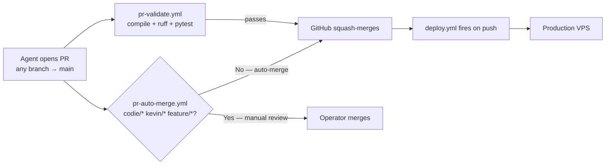
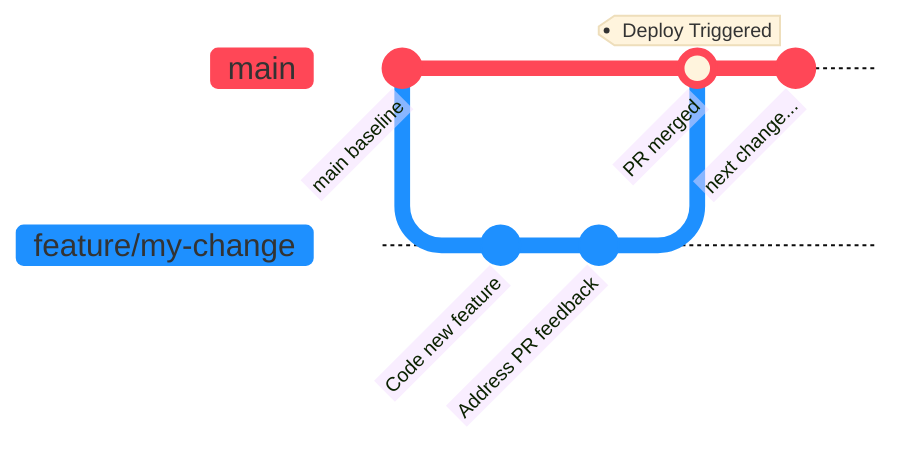

# Branching and Release Workflow

Last updated: 2026-05-29 (deploy-cancellation classification extended to positive-rc deploy-collateral — see § Cron deploy-cancellation classification); earlier 2026-05-13 (retired `feature/latest2`; documented the `claudereal` session-baseline cleanup that lands new sessions on `main` automatically)

## Purpose

This document defines the current branch policy for day-to-day coding, integration review, and production release.

Use this document as the operational source of truth for how code should move through the repository.

## Canonical Rule

There are exactly two practical branch roles:

1. **Per-task feature branches** for active coding work. Naming convention: `claude/<task>` for autonomous agent work, `kevin/<task>` or `feature/<task>` for operator-driven work. Always branched fresh from `main`.
2. **`main`** for production release. Every session's "home base."

That's it. No `develop`, no `feature/latest2`, no `dev-parallel`, no staging branch. PR-Validate CI is the only pre-merge gate.

> **2026-05-13 simplification:** `feature/latest2` (the former "pseudo-trunk") was retired. By the time it was deleted, local was 22 commits behind `main` and origin was even further behind — no PR had touched it in nine days, and every PR shipped during that period had branched off `main` directly. `feature/latest2` was a fossil that misled new sessions into thinking it was the home base. The post-retirement model has exactly one home branch: `main`. (See also the [Session Baseline Cleanup](#session-baseline-cleanup) section below for the local-side automation that enforces this.)
>
> **2026-05-10 simplification:** the `develop` branch was retired. Earlier docs that describe a `feature/latest2 → develop → main` chain are stale. The aspirational "develop = staging" environment never materialized; the chain was adding failure modes (silent no-op pushes, stale-branch divergence, mid-chain `git fetch` flakes) without delivering any integration value. Single PR target (`main`) collapses three-step ship cycles to one.

## Current Deployment Contract

GitHub Actions is the only supported application deployment path.

1. Push your work to a feature branch.
2. Open a pull request to `main` (use `/ship` or `gh pr create --base main`).
3. `pr-validate.yml` runs `py_compile` + `ruff` + `pytest tests/unit`. Required to pass.
4. Operator reviews and merges. The merge to `main` triggers `.github/workflows/deploy.yml`.
5. Production VPS updates automatically.

`deploy.yml` has a `paths-ignore` filter (`docs/**`, `**.md`, `reports/**`, `state/**`, `artifacts/**`) so docs-only / report-only commits merging to `main` (e.g. nightly drift report, openclaw release sync state) don't restart the gateway. Mixed code+docs commits still deploy — that's the safe default.

Supporting references:

- [`docs/deployment/ci_cd_pipeline.md`](../deployment/ci_cd_pipeline.md)
- [`docs/deployment/architecture_overview.md`](../deployment/architecture_overview.md)
- [`docs/deployment/ai_coder_instructions.md`](../deployment/ai_coder_instructions.md)
- `AGENTS.md` (symlinked from `CLAUDE.md`)

## Environment Mapping

| Branch | Role | Deployment Target |
|------|------|-------------------|
| any feature branch (`claude/<task>`, `kevin/<task>`, `feature/<task>`) | local development and PR preparation | no automatic deploy |
| `main` | release branch + session home base | production VPS, via `.github/workflows/deploy.yml` |

## Required Working Method

### 1. Start New Work

Create a feature branch from `main`:

```bash
git checkout main
git pull --ff-only
git checkout -b feature/my-change   # or kevin/my-change, claude/my-task, etc.
```

After `claudereal` (or `claude` via the bash wrapper) launches an interactive session, the [Session Baseline Cleanup](#session-baseline-cleanup) automatically lands you on `main` if the previous session's branch has already been merged. You can also branch from `main` manually with the commands above.

### 2. Do Local Development

Local checkout roles:

1. `/home/kjdragan/lrepos/universal_agent` = HQ dev lane (`INFISICAL_ENVIRONMENT=development`, `FACTORY_ROLE=HEADQUARTERS`, `UA_DEPLOYMENT_PROFILE=local_workstation`)
2. `~/universal_agent_factory` = optional local worker lane

If localhost starts returning role-based `403` responses on HQ dashboard pages, the repo checkout is almost certainly no longer bootstrapped as `development + HEADQUARTERS + local_workstation`.

Typical local loop:

1. code
2. run targeted tests (`uv run pytest tests/unit/<area> -x -q`)
3. build affected surfaces as needed
4. commit on the feature branch

### 3. Open the PR to `main`

When the change is ready:

```bash
git push -u origin feature/my-change
# Either: run /ship (it opens the PR for you and watches CI)
# Or:    gh pr create --base main --head feature/my-change --fill
```

### 4. CI runs, operator merges

`pr-validate.yml` runs on every PR to `main`:

1. `python -m py_compile` on every changed `.py` file.
2. `ruff check --select E9,F` (errors only).
3. `pytest tests/unit -x -q` (fast unit-test subset).
4. Refuse merge if any `.py.bak` / `.swp` / `.orig` file is in the diff.

Once green, click Merge in the GitHub UI. The merge to `main` triggers `.github/workflows/deploy.yml`, which deploys to the production VPS.

### 5. Verify production runs the new code

After deploy, hit `GET /api/v1/version` on production and confirm the `commit_sha` matches the merge SHA — the canonical Rule A from `CLAUDE.md` § Production Verification Rules.

```bash
curl -s https://app.clearspringcg.com/api/v1/version | jq
# {"commit_sha": "<merge-sha>", "branch": "...", "process_started_at": "..."}
```

## What Not To Do

1. **Do not push directly to `main`.** All changes flow through PR. (GitHub branch protection should reject direct pushes; if it doesn't, you're bypassing CI.)
2. **Do not use the `develop` branch.** It was retired 2026-05-10. If you find references to it in older docs, those docs need updating.
3. **Do not use `dev-parallel`** — it's a stale historical branch.
4. **Do not use `scripts/vpsctl.sh`, `ssh`, `scp`, or `rsync` as the default application deployment path.** Older scripts like `deploy_vps.sh` are removed; `promote_to_production.sh` was deleted 2026-05-10. They're break-glass tooling only.
5. **Do not assume production is missing a fix until you verify the deployed VPS `HEAD` SHA directly** — hit `/api/v1/version`. Branch labels in production checkouts can lie; the SHA cannot.

> [!IMPORTANT]
> The `/ship` workflow includes a guard that **refuses to run from `main`**. It must be invoked from a feature branch. `/ship` opens a PR to `main` and prints the URL; the operator clicks Merge in GitHub.

## Practical Usage

### Standard ship loop

Tell the agent to:

> `Open a PR from my current feature branch to main, run pre-flight checks, watch CI, and tell me when it's ready to merge.`

That's `/ship` in one sentence.

### Auto-merge for trusted automation

The two scheduled jobs (`nightly-doc-drift-audit.yml`, `openclaw-release-sync.yml`) auto-merge their report PRs to `main` via `gh pr merge --squash --admin`. `deploy.yml`'s `paths-ignore` ensures these report-only commits don't trigger a production deploy.

### Auto-merge for AI-coder PRs (added 2026-05-11; PAT-fixed 2026-05-11 PM; codie/* 2026-05-15; inverted filter 2026-05-17)

All non-draft PRs to `main` get auto-merge enabled automatically by `pr-auto-merge.yml`, **except** branches that need operator review before shipping:

| Branch prefix | Auto-merge? | Reason |
|---|---|---|
| `claude/*` | ✅ Yes | Claude Code agent work |
| `worktree-*` | ✅ Yes | Background-session worktrees |
| any other non-draft | ✅ Yes | Future AI-coder naming auto-merges by default |
| `codie/*` | ❌ No — manual | Operator reviews Codie's PRs before shipping |
| `kevin/*` | ❌ No — manual | Operator-authored PRs |
| `feature/*` | ❌ No — manual | Operator-authored PRs |

Once `pr-validate.yml` passes and auto-merge is armed, GitHub squash-merges the PR, deletes the branch, and the merge to `main` triggers `deploy.yml` → production.

> **2026-05-15 fix:** the original filter matched only `claude/*`, leaving `codie/*` PRs stuck. Widened to both prefixes.
>
> **2026-05-17 redesign (PR #317):** the allowlist (`claude/*` + `codie/*`) broke again when background sessions named branches `worktree-*` (PR #316 sat validated but unmerged). Inverted to an exclude-list: operator branches explicitly opt out (`codie/*`, `kevin/*`, `feature/*`); everything else auto-merges. `codie/*` excluded at operator request — Codie PRs go to manual review before ship.



This is the same auto-merge mechanism `/ship` uses for tier-1 PRs — `pr-auto-merge.yml` just enables it for PRs that are opened directly via `gh pr create` / GitHub API instead of through `/ship`. No operator action is required between PR open and production deploy.

#### Why a fine-grained PAT (and not GITHUB_TOKEN)

PR #232 (merged 2026-05-11) swapped `pr-auto-merge.yml` from `GITHUB_TOKEN` to `secrets.AUTO_MERGE_PAT` (with `GITHUB_TOKEN` fallback) because of GitHub's documented suppression rule:

> "Events triggered by the GITHUB_TOKEN, with the exception of `workflow_dispatch` and `repository_dispatch`, will not create a new workflow run."

When `gh pr merge --auto` was invoked with `GITHUB_TOKEN`, GitHub's resulting squash-merge `push` to main was attributed to that token, and `deploy.yml`'s `on: push: branches: main` trigger was silently skipped. Three Hermes PRs (#228, #229, #230) shipped to main with no deploy firing; production drifted until manual `gh workflow run deploy.yml --ref main`.

A fine-grained PAT (`AUTO_MERGE_PAT`, repo secret) is attributed to the operator's user identity, so the downstream push fires `deploy.yml` normally. PAT scopes: `Contents: Read+Write`, `Pull requests: Read+Write` on `Kjdragan/universal_agent` only. Rotate yearly (default token expiry).

The `post-merge-deploy.yml` bridge workflow was **deleted 2026-05-11 PM** after the PAT chain proved itself. The bridge had been added earlier the same day as a workaround for the GITHUB_TOKEN suppression bug, but with the PAT in place every merge was producing two Deploy runs (one from the natural `push` trigger via PAT, one from the bridge's `workflow_dispatch`). The PAT path is canonical; the bridge was redundant. If `AUTO_MERGE_PAT` ever expires and isn't rotated, restore the PAT — don't reintroduce the bridge (running deploy twice wastes minutes and clutters the Actions tab).

#### Concurrency caveat (2026-05-11 PM incident)

Multiple PRs merging to `main` within a few seconds of each other each trigger their own `deploy.yml` run. As of 2026-05-11 PM, `deploy.yml` has no `concurrency:` guard, so three concurrent deploys raced on `/opt/universal_agent/.git/index.lock` and **all three failed** with `fatal: Unable to create '/opt/universal_agent/.git/index.lock': File exists.`

Recovery: dispatch a single `deploy.yml` run via `gh workflow run deploy.yml --ref main` — once the stale lock file is removed (manually or by the next successful deploy's cleanup), production catches up to the latest commit.

**Recommended hardening** (not yet implemented): add `concurrency: { group: deploy-production, cancel-in-progress: false }` to `deploy.yml` so simultaneous merges queue instead of colliding. The `cancel-in-progress: false` setting preserves every deploy's intent (last-write-wins semantics on main); only the lock collision is eliminated.

For full pipeline detail see [`docs/deployment/ci_cd_pipeline.md` § "End-to-End PR-to-Production Flow"](../deployment/ci_cd_pipeline.md#end-to-end-pr-to-production-flow-2026-05-11).

#### Cron deploy-cancellation classification (added 2026-05-14)

A deploy that overlaps a long-running subprocess cron (e.g. `claude_code_intel_sync` running its `!script` worker) used to emit a scary `[ERROR] Autonomous Task Failed` + `[WARNING] Autonomous Task Retrying` email pair every deploy. Root cause: the asyncio-coroutine cancellation path (`cron_service.py:2013-2036`) correctly classified shutdown-induced cancellation as `record.status = "cancelled"` (benign `[INFO]`), but the subprocess path treated SIGTERM (`exit_code = -15`) as a normal non-zero failure.

Fix (`cron_service.py:_is_deploy_window_active` + new branch around line 1466): when a subprocess exits with a negative return code AND either (a) `/tmp/ua-deployment-window` exists (the deploy.yml-managed flag, already used by CSI canary), or (b) the gateway has been up for less than 60 seconds (fallback), classify the run as `cancelled` and advance the job's `next_run_at` by 5 seconds. The existing scheduler startup pass at `cron_service.py:604-624` then picks up the rescheduled job on next boot — backfill via the existing `catch_up_on_restart` mechanism, no new table or replay system required.

Net effect: a deploy that lands during a long cron's run is now a non-event (single `[INFO] Chron Run Cancelled` email instead of `[ERROR]` + `[WARNING]` pair, and the cron re-fires on the next gateway boot). Real subprocess failures (signals outside the deploy window) keep their existing loud behavior so genuine bugs still surface.

**Extended 2026-05-29 — positive-rc deploy-collateral.** The original branch only downgraded *negative* return codes (SIGTERM). But a cron can also fail with a *positive* rc inside a deploy window when the platform restarts under it: the 2026-05-29 `evening_briefing` incident, where `briefings_agent --mode=evening` exited `rc=1` after `connect ECONNREFUSED ::1:8002` because the gateway it calls was mid-restart (PR #572's merge triggered the deploy; the cron fired at 23:03:14 UTC during the gateway restart). The subprocess ran to completion and returned a positive code (so the kernel didn't signal-kill it), yet the failure was pure deploy collateral — and it still paged a scary `[ERROR] Autonomous Task Failed` email. Fix: the deploy-window branch now matches `exit_code != 0` (both signs) instead of `exit_code < 0`, with distinct messaging for signal-kill vs `rc=N during deploy restart (platform unreachable mid-restart)`. **Guardrail unchanged:** `_is_deploy_window_active()` (the `/tmp/ua-deployment-window` flag, set by `deploy.yml` *before* the service restart, or the gateway-uptime<60s fallback) is the ONLY thing that downgrades a nonzero exit — outside a deploy window a positive-rc failure still marks the run `error` and pages `[ERROR]` exactly as before. Regression-guarded in `tests/unit/test_cron_deploy_cancellation.py`.

## Session Baseline Cleanup

Added 2026-05-13. Lives at [`scripts/claude_session_baseline.py`](../../scripts/claude_session_baseline.py) and is invoked once per session by [`scripts/_claude_launcher.py`](../../scripts/_claude_launcher.py) when the launch CWD is the UA checkout. The agent / operator does nothing — opening a new terminal and typing `claudereal` is enough.

What it does (four-case contract):

| Current state | Action |
|---|---|
| On `main` | `git fetch --prune`, `git pull --ff-only origin main`. Prints `✓ on main @ <sha>`. |
| On a feature branch whose PR is **MERGED** (or whose remote branch was already deleted by auto-merge) | Stash known runtime gunk (`.omc/state/`, `memory/`, `MEMORY.md`, `temp/`), `git switch main`, fast-forward, `git branch -D <old>`, drop the stash. Prints `🧹 cleaned up merged <old>; on main @ <sha>`. |
| On a feature branch with an **OPEN** PR | No mutation. Prints `ℹ on <branch> @ <sha> (PR open); staying put`. |
| On a feature branch with no PR yet, or a dirty working tree containing real source edits | No mutation. Prints `ℹ on <branch> @ <sha> (...); staying put`. |

The cleanup is best-effort: any unexpected failure prints a warning to stderr and falls through, so `claude` always launches even if git is in a state the script doesn't recognize.

Closes the local-side gap in the `<branch> → PR → auto-merge → deploy` loop. Without this, after PR auto-merge GitHub deletes the remote branch but the local checkout stays put on the now-dead branch — so the next session opens on stale code (the trigger for this feature was the trimmed CLAUDE.md being silently invisible to sessions that branched off `main` before the trim landed). The cleanup makes that lag self-correct on the next session start.

## Summary

The default operating model is:

1. open a new terminal → `claudereal` runs the session-baseline cleanup → land on fresh `main`
2. agent (or operator) branches `claude/<task>` from `main`
3. code on the feature branch
4. `gh pr create --base main --head claude/<task>` (or `/ship`)
5. `pr-validate.yml` runs PR-Validate CI
6. `pr-auto-merge.yml` enables GitHub auto-merge (skip if `codie/*`, `kevin/*`, or `feature/*`)
7. on CI green, GitHub squash-merges and deletes the remote branch
8. `deploy.yml` fires on the resulting `main` push, deploys to the VPS
9. next session start: cleanup automatically prunes the merged local branch and lands you back on `main`

## 1. One-Minute Cheat Sheet

Use this if you just want the shortest correct explanation.

1. Branch from `main`.
2. Code on a `feature/...` branch.
3. Run `/ship` — it opens a PR to `main` and reports CI status.
4. Operator merges the green PR. Production deploys automatically.

Short meanings:

1. feature branch = your working branch
2. `main` = production branch (the only branch that triggers Deploy)

## 2. Exact Git Commands

### Start a new feature

```bash
git checkout main
git pull --ff-only
git checkout -b feature/my-change
```

### Open the PR

```bash
git push -u origin feature/my-change
# /ship handles this in one step — or:
gh pr create --base main --head feature/my-change --fill
```

### After CI passes, merge in GitHub UI

The merge fires `.github/workflows/deploy.yml`. Verify production runs the new SHA via `GET /api/v1/version`.

## 3. Branch Flow Diagram

> [!TIP]
> The diagram below visualizes the post-2026-05-10 branch policy. The entire process is automated via the `/ship` slash command which opens the PR and watches CI.



*Work originates on feature branches, opens a PR to `main` (PR-Validate CI runs), and on merge `deploy.yml` fires for the new `main` HEAD. At no point is standard development performed directly on `main`.*

For local runtime mode details, see [`05_Local_Runtime_Modes.md`](05_Local_Runtime_Modes.md).

If deployment behavior changes later, update this file together with the GitHub Actions workflow documentation.
