# Deployment Architecture Overview

This document defines the current supported deployment model for Universal Agent.

> [!IMPORTANT]
> ## 🔗 Key Dashboard URLs
>
> | Environment | URL | Notes |
> |---|---|---|
> | **Local Dev** | `http://localhost:3000` | Localheadquarters Next.js server |
> | **Production** | `https://app.clearspringcg.com/dashboard` | Public — no VPN needed |
>
> Production deploys automatically when `main` is pushed (via merged PR). The `develop` branch was retired 2026-05-10 — see [Branching and Release Workflow](../06_Deployment_And_Environments/04_Branching_And_Release_Workflow.md).

> [!IMPORTANT]
> Release verification is SHA-based. The authoritative proof of what is deployed on VPS is the checkout `HEAD` commit, not the branch name reported by the checkout alone.

## Git Branching Model

We use branch-driven automated deployment with a simplified single-environment pipeline.

- **Feature branches** (any name; tier-1 convention is `feature/latest2`, tier-2 bots use `<bot>/<task-id>`): local coding. Push, open a PR to `main`.
- **`main`**: automated production deployment target. When a PR merges to `main`, `.github/workflows/deploy.yml` fires and updates the VPS.

`pr-validate.yml` runs on every PR (`py_compile` + `ruff` + `pytest tests/unit`) — the only pre-deploy gate. `deploy.yml` has a `paths-ignore` filter so docs-only / report-only commits merging to `main` (e.g. nightly drift report) don't restart the gateway.

The `develop` branch was retired 2026-05-10. The staging environment it was meant to fed never materialized; the chain `feature/latest2 → develop → main` was adding failure modes (silent no-op pushes, stale-branch divergence, mid-chain `git fetch` flakes) without integration value.

## Environmental Mapping

The `deploy.yml` workflow applies to our single environment.

| Component | Production Environment |
|-----------|------------------------|
| Git Branch | `main` |
| VPS Checkout | `/opt/universal_agent` |
| Fallback Checkout | `/opt/universal_agent_repo` |
| Gateway/API Ports | `8002` / `8001` |
| Web UI Port | `3000` |
| Web UI URL | `https://app.clearspringcg.com` (Public)   `https://uaonvps` (Tailnet) |
| API URL | `https://api.clearspringcg.com` (Public)   `https://uaonvps:8443` (Tailnet) |
| Service Restart Strategy | Deploy installs repo-managed production systemd units plus Discord and VP worker unit templates, runs centralized runtime preflight, performs one clean `.venv` rebuild if preflight fails after the first sync, then restarts gateway/api/webui/telegram plus VP workers |
| Post-Deploy Health | See `ci_cd_pipeline.md` > Post-Deploy Health Verification |
| Secrets Behavior | Bootstrap `.env` for stage `production`; webui `.env.local` rendered from Infisical by deploy |

## Infisical Environment Naming

The runtime contract treats Infisical environments as stage lanes:

- `development`
- `production`

*(Note: `staging` was removed in Phase 3A).*

Machine identity is provided by bootstrap values written on each machine:

- `FACTORY_ROLE`
- `UA_DEPLOYMENT_PROFILE`
- `UA_RUNTIME_STAGE`
- `UA_MACHINE_SLUG`

> [!TIP]
> The exhibit below visualizes how the physical machines map into Infisical environment lanes via these bootstrap configurations.

```mermaid
%%{init: {'theme':'base'}}%%
flowchart TD
    %% Define Styles
    classDef infisical fill:#e1bee7,stroke:#8e24aa,stroke-width:2px,color:#4a148c
    classDef vps fill:#c8e6c9,stroke:#388e3c,stroke-width:2px,color:#1b5e20
    classDef worker fill:#bbdefb,stroke:#1976d2,stroke-width:2px,color:#0d47a1
    classDef var fill:#fff9c4,stroke:#fbc02d,stroke-width:1px,color:#000

    subgraph Infisical Service
        A1[development lane]:::infisical
        A2[production lane]:::infisical
    end

    subgraph Physical Machines & Bootstraps
        direction LR
        
        subgraph Machine A: VPS Headquarters
            B1([Environment Variables]):::var
            B1 --- b1[UA_RUNTIME_STAGE=production]
            B1 --- b2[FACTORY_ROLE=HEADQUARTERS]
            B1 --- b3[UA_DEPLOYMENT_PROFILE=vps]
        end

        subgraph Machine B: Desktop Worker
            C1([Environment Variables]):::var
            C1 --- c1[UA_RUNTIME_STAGE=production]
            C1 --- c2[FACTORY_ROLE=LOCAL_WORKER]
            C1 --- c3[UA_DEPLOYMENT_PROFILE=local_workstation]
        end

        subgraph Machine C: Desktop Dev
            D1([Environment Variables]):::var
            D1 --- d1[UA_RUNTIME_STAGE=development]
            D1 --- d2[FACTORY_ROLE=HEADQUARTERS]
            D1 --- d3[UA_DEPLOYMENT_PROFILE=local_workstation]
        end
    end

    %% Mappings
    A2 ==>|Secret Provisioning| B1
    A2 ==>|Secret Provisioning| C1
    A1 ==>|Secret Provisioning| D1
```

*As shown in the exhibit, the same stage environment (e.g., `production`) naturally supports both the VPS headquarters runtime and local worker topologies depending solely on the local bootstrap machine identity tags, completely overriding the need for a separate staging logical layer.*

## Tutorial Runtime Contract

The deployed VPS lane is also the default runtime for the YouTube tutorial pipeline.

- Playlist watching, hook transcript ingestion, tutorial artifact generation, and tutorial repo bootstrap run on the deployed VPS checkout.
- Tutorial repo bootstrap defaults to `UA_TUTORIAL_BOOTSTRAP_TARGET_ROOT=<UA_ARTIFACTS_DIR>/tutorial_repos` on VPS.
- Local workstation tutorial processing is supported only as an explicit development fallback and should not be treated as the normal deployed path.
- VPS tutorial ingest should use loopback-first endpoint ordering, typically `http://127.0.0.1:8002/api/v1/youtube/ingest`.

## Systemd Ownership

The base systemd units for deployed application services are part of the repository and are installed on every deploy from templates under `deployment/systemd/templates/`.

- Production deploy renders the canonical units for `universal-agent-gateway`, `universal-agent-api`, `universal-agent-webui`, `universal-agent-telegram`, Discord services, and the VP worker template against the active checkout path (`/opt/universal_agent` or fallback `/opt/universal_agent_repo`).
- This prevents host-local systemd drift from silently pinning a service to an old checkout, stale working directory, or missing `EnvironmentFile`.
- The managed Python service units pin `PYDANTIC_DISABLE_PLUGINS=logfire-plugin` so Logfire's optional Pydantic plugin cannot auto-load during startup and turn observability into a hard startup dependency.

### Gateway Resource Limits (updated 2026-04-27)

The gateway service template includes cgroup-enforced resource limits to prevent runaway memory consumption and fork bombs:

| Limit | Value | Purpose |
|-------|-------|---------|
| `MemoryMax` | **8G** | Hard cgroup limit — systemd kills the cgroup if exceeded |
| `MemoryHigh` | **6G** | Soft limit — triggers kernel memory reclaim/swap pressure |
| `TasksMax` | **500** | Caps total process count within the cgroup |
| `OOMPolicy` | `continue` | Gateway survives OOM kills of child processes |

These limits live in both `deployment/systemd/templates/universal-agent-gateway.service.template` (canonical) and the VPS override at `/etc/systemd/system/universal-agent-gateway.service.d/override.conf`.

- Runtime availability and tracing integrity are now separate concerns by design:
  - package bootstrap keeps services fail-open if Logfire import breaks at runtime
  - deploy preflight still blocks a new release unless the target `.venv` can import real OpenTelemetry + Logfire successfully

## Local Runtime Contract

Kevin's desktop has two supported runtime modes:

- localhost headquarters development:
  - `INFISICAL_ENVIRONMENT=development`
  - `FACTORY_ROLE=HEADQUARTERS`
  - `UA_DEPLOYMENT_PROFILE=local_workstation`

- deployed-stage local worker:
  - `INFISICAL_ENVIRONMENT=production`
  - `FACTORY_ROLE=LOCAL_WORKER`
  - `UA_DEPLOYMENT_PROFILE=local_workstation`

## Supported Deployment Rule

1. From a feature branch, run `/ship` (or `gh pr create --base main --head <branch>`).
2. PR-Validate CI runs.
3. When CI is green, merge the PR in GitHub UI.
4. The merge to `main` triggers `.github/workflows/deploy.yml` and the VPS updates automatically.
5. The canonical deployment runbooks live in `docs/deployment/`.

The `/checkpoint` and `/rollback` slash-command flows that depended on `develop` are retired — rollback is now `git revert <merge-sha>` + open a PR (or use GitHub's "Revert" button on the merged PR), which goes through the same Deploy pipeline.

## Repo-Backed Coding Sessions On VPS

Production agent sessions may now be explicitly authorized to edit approved repo roots (for example `/opt/universal_agent`) during coding tasks. This changes **execution authority**, not deployment policy.

Important distinction:

- repo-backed coding sessions let Simone / Cody mutate the checked-out repo on the VPS when the session policy and request metadata explicitly authorize that codebase root
- they do **not** change how releases are promoted
- production still deploys only through `main` push triggering `deploy.yml`

In other words: repo-backed coding enables the agent to do the work on the VPS checkout; the supported path for making that work live remains the existing branch-driven CI/CD pipeline.

## Release Verification Rule

When a production incident appears to suggest "the fix is not deployed":

1. verify the live checkout `HEAD` SHA on the target VPS
2. compare that SHA to the validated `main` SHAs
3. only then decide whether you have a deploy-gap problem or a runtime/browser-state problem

Important nuance:
- a checkout can still report `main` from `git branch --show-current` even after being reset to the exact release commit
- treat the deployed `HEAD` SHA as authoritative and the branch label as secondary context
