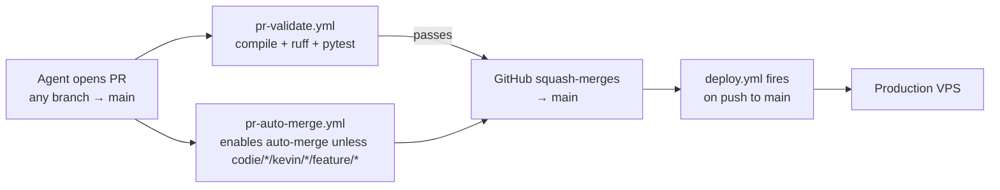

# CI/CD Pipeline & Troubleshooting

Our CI/CD pipeline is built on GitHub Actions and automates PR review and production deployment over Tailscale.

## Canonical Rule

This is the only supported app deployment path in this repository (post-2026-05-10 simplification).

- Work happens on a feature branch (tier 1 convention: `feature/latest2`; tier 2 bots use `<bot>/<task-id>`).
- Open a pull request to `main`. `pr-validate.yml` runs `py_compile` + `ruff` + `pytest tests/unit` — that's the pre-deploy gate.
- When CI is green, merge the PR. The merge to `main` triggers `.github/workflows/deploy.yml` and the VPS updates automatically.
- The `develop` branch was retired 2026-05-10 — see [Branching and Release Workflow](../06_Deployment_And_Environments/04_Branching_And_Release_Workflow.md).
- Do not treat `scripts/deploy_vps.sh`, `scripts/vpsctl.sh`, or manual SSH deploy steps as the primary deployment path.

Release verification rule:
- prove release state by deployed `HEAD` SHA plus live behavior
- do not assume a missing fix solely from branch expectations or `git branch --show-current` output on the VPS checkout

## Workflows

### Primary Deployment Workflows

| Name | File | Trigger | Target |
|------|------|---------|--------|
| `PR Validate` | `pr-validate.yml` | Pull request to `feature/latest2` or `main` | `py_compile` + `ruff check` + `pytest tests/unit` (mandatory pre-merge gate) |
| `PR Auto-Merge` | `pr-auto-merge.yml` | Pull request to `main` (any non-draft PR not from `codie/*`, `kevin/*`, or `feature/*`) | Enables GitHub auto-merge (squash + delete branch) so PR merges automatically once `Validate PR` passes. Uses `secrets.AUTO_MERGE_PAT` (fine-grained PAT) so the downstream squash-merge `push` event actually fires `deploy.yml` — see "Why a PAT" below. Tier-1 PRs through `/ship` already self-enable auto-merge. |
| `PR Rebase Watchdog` | `pr-rebase-watchdog.yml` | Push to `main`, every 15 min cron, `workflow_dispatch` | Heals stuck auto-merge PRs that went `mergeStateStatus=DIRTY` after main moved. **GitHub does not run `Validate PR` on conflicting PRs**, so auto-merge has nothing to wait on and sits silently. The watchdog detects this state, auto-rebases `claude/*` and `worktree-*` branches (force-push with lease), and posts a comment with rebase instructions on `kevin/*`/`feature/*`/`codie/*` branches. A `rebase-needed-comment` label suppresses comment spam; it auto-clears once the branch is mergeable again. |
| ~~`Post-Merge Deploy Dispatcher`~~ | ~~`post-merge-deploy.yml`~~ | **Deleted 2026-05-11 PM** | Was the workaround for the GITHUB_TOKEN suppression bug. With PR #232's PAT swap making `pr-auto-merge.yml` fire deploys via the natural `push` trigger, this bridge was redundant — every merge produced two Deploy runs (one from `push`, one from the bridge's `workflow_dispatch`). Removed to avoid double-deploys + Actions-tab clutter. |
| `Deploy` | `deploy.yml` (+ `scripts/deploy/remote_deploy.sh`) | Push to `main` (paths-ignore: docs/, **.md, reports/, state/, artifacts/, memory/**), or `workflow_dispatch` | Production Service. As of 2026-05-30 the remote deploy logic lives in the committed, shellcheck-able `scripts/deploy/remote_deploy.sh` (piped to the VPS over SSH stdin) instead of a 420-line inline heredoc — see "Deploy script decomposition" below. Concurrency guard (`deploy-production` group, `cancel-in-progress: false`) added 2026-05-11 PM. |

### End-to-End PR-to-Production Flow (2026-05-11)



**One-time prerequisite:** Repo Settings → "Allow auto-merge" must be on. Likely already enabled since `/ship` uses the same mechanism.

**Tier-1 PRs (operator-driven via `/ship`):** Same flow but auto-merge is enabled by `/ship` itself, not by this workflow.

**Manual fallback:** `codie/*`, `kevin/*`, and `feature/*` branches require manual merge — operator reviews before shipping. All other non-draft PRs auto-merge.

#### Why a PAT (2026-05-11 PR #232)

GitHub's [token rules](https://docs.github.com/en/actions/security-guides/automatic-token-authentication) explicitly state:

> "Events triggered by the GITHUB_TOKEN, with the exception of `workflow_dispatch` and `repository_dispatch`, will not create a new workflow run."

When `pr-auto-merge.yml` previously called `gh pr merge --auto` with `GITHUB_TOKEN`, the resulting squash-merge `push` event to main was attributed to `GITHUB_TOKEN` and `deploy.yml`'s `on: push` trigger was silently skipped. Three Hermes PRs (#228, #229, #230) shipped to main with no deploy firing until an operator manually invoked `gh workflow run deploy.yml --ref main`. The `post-merge-deploy.yml` dispatcher (introduced as a bridge for this gap) had the same fault, and was later deleted once the PAT proved itself.

Fix: `pr-auto-merge.yml` now uses `secrets.AUTO_MERGE_PAT` (a fine-grained PAT scoped to `Kjdragan/universal_agent` with `Contents: Read+Write` and `Pull requests: Read+Write` only). The PAT-driven push fires `deploy.yml` normally. Fallback to `GITHUB_TOKEN` is preserved for the bootstrap window before the secret is configured.

**PAT maintenance:** default fine-grained PATs expire after 1 year. When the token expires, `gh pr merge --auto` calls will 401/403 — regenerate the token, paste the new value into the existing `AUTO_MERGE_PAT` secret (overwrite), no workflow file change needed.

#### Deploy script decomposition (2026-05-30)

The remote deploy logic used to live as a ~420-line `ssh … << 'EOF' … EOF` heredoc inside `deploy.yml` (the file was 516 lines). That monolith was the single most failure-prone thing to edit in the repo: bash-inside-YAML-inside-a-heredoc is invisible to `shellcheck`, can't be run or diffed locally, and was prone to the GitHub-Actions-parser quirk (2026-05-27) where `actionlint`/`pyyaml` pass but the real workflow parser silently rejects the file. ~10 of the 15 most recent "deploy failures" were one session's bisect saga trying to edit it.

It is now extracted to a committed, executable `scripts/deploy/remote_deploy.sh`. `deploy.yml` shrank to ~160 lines and feeds the script to the VPS over SSH **stdin**:

```bash
{
  printf 'export INFISICAL_CLIENT_ID=%q\n'     "$INFISICAL_CLIENT_ID"
  printf 'export INFISICAL_CLIENT_SECRET=%q\n' "$INFISICAL_CLIENT_SECRET"
  printf 'export INFISICAL_PROJECT_ID=%q\n'    "$INFISICAL_PROJECT_ID"
  cat scripts/deploy/remote_deploy.sh
} | ssh … "$SSH_USER@$SSH_HOST" 'bash -s'
```

Key properties:
- **Byte-for-byte identical deploy logic.** The script body is the exact bash that was in the heredoc, only dedented; the extraction was verified with a `diff` that returned no changes.
- **Secrets via stdin, not argv.** The three `INFISICAL_*` bootstrap secrets are the only values `deploy.yml` injects (they were `${{ secrets.* }}` in the heredoc). They're now prepended as `export` lines through the same SSH stdin stream, so they never appear in the VPS process table — preserving the prior security property while keeping `remote_deploy.sh` free of `${{ }}` placeholders. The script fails fast (`${VAR:?}`) if any is missing.
- **No `actions/checkout`** — the script is fetched for the exact `$GITHUB_SHA` via the GitHub API (`gh api … contents/scripts/deploy/remote_deploy.sh`). A full checkout would pin a deprecated Node-20 action and its post-job submodule cleanup chokes (benign exit-128 warning) on the repo's orphaned `.claude/agents/agent-browser` / `test-remotion-project` gitlinks (committed with no `.gitmodules`). Fetching one file sidesteps both.
- **Removes the heredoc-parser fragility class entirely** — the workflow YAML no longer contains a large embedded bash block, and `remote_deploy.sh` can be `shellcheck`ed (planned PR-Validate gate) and reasoned about locally.

#### Concurrency guard (added 2026-05-11 PM)

During the 2026-05-11 PM incident, three Dependabot/operator PRs (#231, #226, plus the chain catch-up commit) merged within seconds of each other, three deploy runs raced on `/opt/universal_agent/.git/index.lock` and all three failed with:

```
fatal: Unable to create '/opt/universal_agent/.git/index.lock': File exists.
```

The concurrency guard was added to `deploy.yml` after that incident:

```yaml
concurrency:
  group: deploy-production
  cancel-in-progress: false  # preserve every deploy's intent
```

This serializes deploys so simultaneous merges queue instead of colliding. `cancel-in-progress: false` is the right setting — main is the source of truth and every deploy should run to completion (last-write-wins semantics on production).

### Utility Workflows

| Name | Trigger | Purpose |
|------|---------|---------|
| `Deploy Notify` (`deploy-notify.yml`) | `workflow_run` on `Deploy` **completed** (success AND failure) | Truthful deploy-complete signal to the operator's Telegram channel. Independently curls the public `/api/v1/version` and compares the **live** short SHA to the SHA `Deploy` ran on, then sends one of: ✅ success + live SHA confirmed / ⚠️ success but live SHA mismatch or endpoint down / ❌ deploy failed/cancelled/timed-out. Best-effort: a notifier outage warns in the run log and never hard-fails. Fills the gap where `deploy.yml` emailed only on failure and was silent on success. See "Deploy Complete Notification" below. |
| `Nightly Doc Drift Audit` | Scheduled (daily) | Detect documentation drift via auto-merged PR |
| `OpenClaw Release Sync` | Scheduled | Syncs OpenClaw updates |

## Current Targets

| Area | Production |
|------|------------|
| Git branch | `main` |
| VPS checkout | `/opt/universal_agent` |
| Gateway/API ports | `8002` / `8001` |
| Web UI port | `3000` |
| Web UI URL | `https://app.clearspringcg.com` (Public)<br>`https://uaonvps` (Tailnet) |
| API URL | `https://api.clearspringcg.com` (Public)<br>`https://uaonvps:8443` (Tailnet) |
| Legacy/fallback checkout | `/opt/universal_agent_repo` if `/opt/universal_agent` is occupied by a non-git legacy directory |
| Runtime secrets | `production` via explicit bootstrap `.env` plus stage secret validation |

## Infisical Runtime Lanes

The runtime model is stage-based:

- `development`
- `production`

Machine identity is written locally during bootstrap and validated during deploy:

- `FACTORY_ROLE`
- `UA_DEPLOYMENT_PROFILE`
- `UA_RUNTIME_STAGE`
- `UA_MACHINE_SLUG`

Deploy workflows must not provision machine-shaped Infisical environments during normal deploys.
They rewrite the checkout bootstrap `.env` from scratch on every deploy so
stale historical lines cannot survive a lane migration.

## Canonical Systemd Units

Deploy workflows own both the application checkout and the base systemd units that run it.

- Canonical unit templates live under `deployment/systemd/templates/`.
- `scripts/install_vps_systemd_units.sh` renders those templates against the active checkout path and installs them into `/etc/systemd/system/`.
- Production deploy installs `universal-agent-gateway`, `universal-agent-api`, `universal-agent-webui`, `universal-agent-telegram`, `ua-discord-cc-bot`, and `ua-discord-intelligence` along with VP workers.
- Gateway/API stack-limit drop-ins are installed alongside the rendered base units during the same step.

This is intentional: deploys must not rely on manually created host-only base units whose `WorkingDirectory`, `ExecStart`, or `EnvironmentFile` can drift from the checked-out release.

## Required GitHub Secrets

- `DEVIN_API_KEY` (Devin PR review workflow)
- `TAILSCALE_OAUTH_CLIENT_ID` (Tailscale OAuth API client ID, tag identity `tag:ci-gha`)
- `TAILSCALE_OAUTH_SECRET` (Tailscale OAuth API client secret)
- `VPS_SSH_HOST`
- `VPS_SSH_USER`
- `VPS_SSH_KEY`
- `INFISICAL_CLIENT_ID`
- `INFISICAL_CLIENT_SECRET`
- `INFISICAL_PROJECT_ID`
- `AGENTMAIL_API_KEY` (deploy-failure email notification — best-effort; deploy does not double-fault if missing)
- `AUTO_MERGE_PAT` (fine-grained PAT for auto-merge squash pushes that trigger deploy.yml)
- `UA_OPERATOR_TELEGRAM_BOT_TOKEN` (Deploy Notify → operator Telegram channel; mirrors Infisical `UA_OPERATOR_TELEGRAM_BOT_TOKEN`. Notifier no-ops with a warning if absent.)
- `UA_OPERATOR_TELEGRAM_CHAT_ID` (Deploy Notify → operator Telegram channel id; mirrors Infisical `UA_OPERATOR_TELEGRAM_CHAT_ID`.)

## Required Tailscale Policy Model

CI runs must authenticate as a dedicated tagged principal and use non-interactive SSH authorization.

### Tags

- CI runner tag: `tag:ci-gha`
- VPS tag: `tag:vps`

### SSH Policy (required)

```json
{
  "ssh": [
    { "action": "accept", "src": ["tag:ci-gha"], "dst": ["tag:vps"], "users": ["root", "ua"] }
  ]
}
```

### Network Policy (required)

Allow `tag:ci-gha` to reach `tag:vps` on TCP/22 in your current ACL/grants model.

## Pipeline Steps (using `/ship` slash command)

> [!IMPORTANT]
> The `/ship` workflow **must** be run from a feature branch. It refuses to run from `main`. This prevents accidental direct commits to production that bypass the PR-Validate CI gate.

1. **Commit & Push** on your feature branch.
2. **`/ship`** opens a PR to `main` automatically (or prints the PR-create URL if `gh` CLI isn't installed).
3. **`PR Validate`** runs `py_compile` + `ruff` + `pytest tests/unit` on the PR. Required to pass.
4. **Operator reviews and merges** the PR in GitHub UI.
5. **Production deploy** triggers automatically when the merge moves `main`.
6. **Post-release verification should use the deployed checkout SHA**. Hit `GET /api/v1/version` on production and confirm the `commit_sha` matches the merge SHA before declaring any browser-side check valid (Rule A from CLAUDE.md § Production Verification Rules).

> [!TIP]
> **Autonomous sessions: watch, don't poll.** After opening a PR, run the CI wait as a **backgrounded blocking watch** — `gh pr checks <pr> --watch` (or `gh run watch <run-id>`) — instead of a `sleep`+`gh pr view` poll loop. The harness re-invokes the session the instant CI/auto-merge completes, so a poll loop only burns turns. The `Deploy Complete Notification` (above) is the matching signal for the deploy half: you get a Telegram ping the moment production is confirmed live, so there is no need to poll `/api/v1/version` in a loop either. (Convention adopted 2026-05-30; saved as agent memory `feedback_background_watch_not_poll`.)

## Lessons From The April 5 Dashboard Incident

An intermediate theory during the dashboard return-crash investigation was that production must still be on an older UI SHA. That theory was wrong.

What actually mattered:

1. production was already on the newer dashboard fix SHA
2. the remaining browser-specific crash was driven by persisted browser state
3. the deploy-gap theory was disproven only after checking the live VPS checkout `HEAD`

Operational rule:
- do not use "production is probably behind" as a debugging shortcut
- verify the deployed SHA first, then debug the live runtime state that still differs

## Bootstrap Identity Written By Deploys

### Production VPS

- `INFISICAL_ENVIRONMENT=production`
- `UA_RUNTIME_STAGE=production`
- `FACTORY_ROLE=HEADQUARTERS`
- `UA_DEPLOYMENT_PROFILE=vps`
- `UA_MACHINE_SLUG=vps-hq-production`
- `UA_GATEWAY_PORT=8002`
- `UA_API_PORT=8001`
- `UA_GATEWAY_URL=http://127.0.0.1:8002`

The bootstrap file written by deploys is intentionally minimal. Stage-shared
runtime config and secrets are loaded from Infisical after bootstrap validation.
Current deploy workflows serialize that bootstrap file deterministically during
deploy rather than editing keys in place.

## Deployed Runtime Tooling

- Production deploy installs project dependencies with `uv sync`.
- Deploy runs the shared helper `scripts/deploy_validate_runtime.sh` after writing the lane bootstrap `.env`.
- That helper performs the validation contract:
  1. ensure Python 3.13 is available to `uv`
  2. run `uv sync`
  3. run `scripts/validate_runtime_bootstrap.py`
  4. run `scripts/verify_observability_runtime.py`
  5. run `scripts/verify_service_imports.py`
  6. if any of those checks fail, delete `.venv`, do one clean `uv sync`, and rerun the full validation sequence
  7. if validation still fails, abort deploy before any service restart
- `scripts/verify_observability_runtime.py` is stricter than the runtime fail-open bootstrap: deploy success requires a real `logfire` import and a healthy OpenTelemetry context entry-point load, not just the ability to limp forward on the stub.
- Deploy rebuilds the Next.js `universal-agent-webui` application via `npm run build`. `npm install` is **conditional** — it only re-runs when `package.json` has changed since the last deploy (detected via a mtime sentinel file `node_modules/.package-json-mtime`). Before every production web UI build, deploy deletes `web-ui/.next` so stale build locks, partial manifests, or interrupted build artifacts cannot survive into the next release.
- Deploy rebuilds the MkDocs documentation site via `mkdocs build`. The generated static site is served by the `universal-agent-docs` systemd unit on `localhost:8100`, exposed to the tailnet via `tailscale serve`. See `scripts/configure_docs_server.sh` for one-time setup.
- Deploy installs the external NotebookLM tool package `notebooklm-mcp-cli` for the `ua` service user via `uv tool install --force notebooklm-mcp-cli`.
- This provides the `nlm` CLI and `notebooklm-mcp` server binaries expected by the NotebookLM runtime.
- Deploy installs the `goplaces` CLI tool (v0.3.0) for the `ua` service user by downloading the release binary from GitHub to `/home/ua/.local/bin/goplaces`.
- Installation is idempotent.
- Deploy installs the `hackernews-pp-cli` binary for the `ua` service user via `scripts/install_hackernews_cli.sh`. The script downloads, SHA-pin-verifies, and smoke-tests the binary before reporting success. Targets `~/.local/bin/` (not the repo) so it survives `git clean` / repo resets. Installation is idempotent — only downloads if the binary is missing.
- Deploy syncs project skills (`.claude/skills/`) to the `ua` user-level directory (`/home/ua/.claude/skills/`) via `rsync -a --delete`. This makes skills discoverable by VP worker subprocesses that run from `/opt/universal_agent/AGENT_RUN_WORKSPACES/` where the project-relative `.claude/skills/` isn't visible. Without this sync, skills like `self-brief-and-attest` deployed in the repo wouldn't be reachable by Cody's CLI subprocess. The sync is idempotent and runs before the service restart phase.

## Expected Deploy Times

| Scenario | Production |
|----------|------------|
| First deploy on a fresh VPS (cold npm build) | ~20–25 min |
| Normal deploy — no `package.json` change | ~10–15 min |
| Deploy after `package.json` change (fresh npm install) | ~15–20 min |

The deploy workflow has `timeout-minutes: 35` to accommodate the worst-case cold build. Normal deploys complete well within 15 minutes.

To force a full `npm install` on the next deploy, delete the sentinel on the VPS:

```bash
rm /opt/universal_agent/web-ui/node_modules/.package-json-mtime
```

## Service Restart on Deploy

Every deploy pulls code, syncs dependencies, rebuilds the web UI, and then **restarts all managed systemd services**. This is the mechanism that ensures the running gateway, API, web UI, and other services pick up new code.

### Systemd Unit Names

| Service | Production Unit |
|---------|------------------|
| Gateway | `universal-agent-gateway` |
| API | `universal-agent-api` |
| Web UI | `universal-agent-webui` |
| Docs | `universal-agent-docs` |
| Telegram | `universal-agent-telegram` |
| Discord CC Bot | `ua-discord-cc-bot` |
| Discord Intelligence | `ua-discord-intelligence` |
| VP Worker (coder) | `universal-agent-vp-worker@vp.coder.primary` |
| VP Worker (general) | `universal-agent-vp-worker@vp.general.primary` |

### Restart Order

**Production**: gateway + API + webui + telegram restarted together, then each enabled VP worker is restarted individually.

VP workers are only restarted if `systemctl is-enabled` reports them as active.

Before those restarts, the deploy re-renders and installs the canonical base units from the repository so the restart always targets the current checkout path and env files.

After restart, Python services are checked against the current virtualenv interpreter. If `universal-agent-gateway` or `universal-agent-api` is still running an older interpreter than `/opt/universal_agent/.venv/bin/python`, the deploy restarts that service again before health checks.

After restart, the deploy workflow verifies local service health for:

- `http://127.0.0.1:8002/api/v1/health` (`universal-agent-gateway`, 96 attempts × 5s = 8 min timeout)
- `http://127.0.0.1:8001/api/health` (`universal-agent-api`)
- `http://127.0.0.1:3000/dashboard` (`universal-agent-webui`)

If any health check fails (timeout or crashloop abort), the workflow prints `systemctl status` and recent journal excerpts for the managed services, then fails the deploy. A green deploy therefore means the repo sync/restart completed and the local service health gates passed.

### Crashloop Fail-Fast (2026-05-28)

Each health-check attempt also runs `scripts/check_crashloop.sh`, which tracks systemd unit restart counts via a `/tmp/ua-crashloop-*` cache. If a service restarts ≥5 times while health checks are still polling, the watcher aborts the wait loop immediately instead of letting it time out. This prevents a 30-minute deploy timeout on a service that is crash-looping and will never recover (e.g. a bad config or import error introduced by the deploy). The script is a no-op when `systemctl` is unavailable.

### Deployment-Window Flag

The workflow sets `/tmp/ua-deployment-window` before restarting services and clears it after. This flag exists so the CSI canary can suppress SLO alerts during the brief service restart window.

### Deploy Failure Notification (2026-05-28)

When the deploy job fails (any step), a final best-effort step sends an email to the operator via AgentMail (`oddcity216@agentmail.to` → `kevinjdragan@gmail.com`). The email includes the commit SHA, branch, and a direct link to the failed workflow run with suggested next steps. The notification is gated on `secrets.AGENTMAIL_API_KEY` — if the secret is missing or the API call fails, the step exits cleanly without double-faulting the deploy.

### Deploy Complete Notification (2026-05-30)

`deploy-notify.yml` is a separate `workflow_run`-triggered workflow that fires on **every** terminal state of `Deploy` — success and failure — and pushes a single-line status to the operator's Telegram channel. It exists because `deploy.yml` only emailed on **failure** and was silent on success, so an autonomous session had no positive confirmation that its merge actually reached production.

It is decoupled from `deploy.yml` on purpose: it fires even when the deploy job dies abruptly (a trailing step inside `deploy.yml` would not run), and a bug in the notifier can never break a production deploy.

**Truthfulness (Rule A).** A green `Deploy` workflow is not proof the new code is live. The notifier independently curls the public `https://app.clearspringcg.com/api/v1/version` and compares the **live** `short_sha` to the SHA `Deploy` ran on, with a short retry loop to absorb the restart window. It then sends exactly one of:

| Signal | Meaning |
|---|---|
| ✅ Deploy OK — live SHA confirmed | `Deploy` succeeded AND `/api/v1/version` reports the same SHA |
| ⚠️ success but live SHA `X` (expected `Y`) / endpoint unreachable | `Deploy` reported success but production is not running the expected code — look now |
| ❌ Deploy `<conclusion>` | `Deploy` failed / cancelled / timed out |

Gated on `secrets.UA_OPERATOR_TELEGRAM_BOT_TOKEN` + `UA_OPERATOR_TELEGRAM_CHAT_ID`; if either is absent, or the Telegram send returns non-200, the workflow warns in its run log and exits cleanly (a notifier outage must never masquerade as a deploy problem). Docs-only merges never trigger `Deploy` (paths-ignore), so the notifier stays silent on doc commits by design. Runs 24/7 (infrastructure-event handler, exempt from active-hours dormancy).

> [!IMPORTANT]
> **Code changes only take effect after the service restarts.** If the deploy workflow completes but services are not restarted (e.g., `systemctl` is not available), the gateway will continue running the old code. The workflow logs a warning in this case.

## Post-Deploy Health Verification

After a deploy completes, verify the services are running correctly:

### Quick Check (from any Tailscale-connected machine)

```bash
# Production gateway health
curl -s http://100.106.113.93:8002/api/v1/health
```

### On the VPS

```bash
# Check service status
sudo systemctl status universal-agent-gateway universal-agent-api universal-agent-webui

# Tail gateway logs for errors
sudo journalctl -u universal-agent-gateway -n 50 --no-pager
```

### Verify Latest Code Is Running

The gateway lifespan initialization can take 2–3 minutes. If the health endpoint is unavailable immediately after deploy, wait and retry.

To confirm the gateway is running the expected code, check the process start time against the deploy timestamp:

```bash
ps -eo pid,lstart,cmd | grep gateway_server | grep -v grep
```

## Local Development Restart Caveat

> [!WARNING]
> The CI/CD pipeline only restarts **systemd-managed services on the VPS**. If you are running the gateway, API, or dev server **locally** as a direct process, deploying does **not** restart your local process. You must restart it manually to pick up new code.

## Review and Promotion Rule

- There is exactly one pre-merge gate: `pr-validate.yml` on the PR to `main`.
- Direct pushes to `main` are restricted (configure GitHub branch protection to enforce). All changes flow through PR.
- The `Deploy` workflow triggers on push to `main` (the merge), preventing the need for workflow dispatch APIs.

## Recommended GitHub Branch Protection

Configure these settings in GitHub repository settings → Branches → Branch protection rules.

### `main`

- **Require a pull request before merging** ✅
- **Require status checks to pass before merging** ✅ — at minimum `Validate PR` (from `pr-validate.yml`). Optionally also `GitGuardian Security Checks`.
- **Require branches to be up to date before merging** ✅ — prevents merging stale PRs.
- **Do not allow bypassing the above settings** ✅ — except for the GitHub Actions bot identity used by `nightly-doc-drift-audit.yml` and `openclaw-release-sync.yml` to auto-merge their report PRs (those use `--admin` fallback).
- **Restrict who can push to matching branches** ✅ — only trusted operators / GitHub Actions bot.

### `feature/latest2`

- **Optional**: leave open for direct push (Kevin's tier-1 working branch). If branch protection is added here later, switch tier-1 to PR-driven only.

## Troubleshooting

### Deploy Job Times Out

`deploy.yml` has `timeout-minutes: 35`.

If a deploy times out, the most common cause is a cold `npm run build` after the workflow removes `.next` for build hygiene. Simply re-run the workflow after confirming no separate deploy is still running.

### Web UI Route Manifests Missing

If `journalctl -u universal-agent-webui` reports an error like:

```text
Invariant: The client reference manifest for route "/dashboard/discord" does not exist
```

then the deployed `.next` directory is incomplete or inconsistent. The canonical fix is to re-run the production deploy workflow from the validated `main` SHA; deploy now removes `web-ui/.next` before building so the rerun cannot reuse the corrupt artifacts. Treat manual `rm -rf /opt/universal_agent/web-ui/.next && npm run build` as break-glass recovery only, not the normal deployment path.

### SSH Preflight Fails Fast

If preflight exits before deploy, inspect error output in the workflow log.

#### Signature: interactive Tailscale check

If stderr includes either:

- `Tailscale SSH requires an additional check`
- `https://login.tailscale.com/...`

then CI identity is not matching the required non-interactive SSH policy. Verify permissions.

### SSH Key or VPS Authentication Fails

- Verify the `VPS_SSH_KEY` secret in GitHub.
- Ensure the matching public key is present in target user `authorized_keys`.
- Check SSH auth logs on the VPS for rejected keys.

### Tailscale Connection Issues

- Ensure `TAILSCALE_OAUTH_CLIENT_ID` and `TAILSCALE_OAUTH_SECRET` are valid.
- Verify ACL/grants permit runner-to-VPS traffic on SSH.

### Service Startup Errors

- Tailing logs on the VPS:
  ```bash
  sudo journalctl -u universal-agent-gateway -f
  ```
- Verify the `.env` file exists in the installation directory.

### Production `uv sync` Fails With Python Interpreter Permission Errors

If production deploy logs show either:

- `failed to canonicalize path /opt/universal_agent/.venv/bin/python3: Permission denied`
- `Failed to execute /opt/universal_agent/.venv/bin/python3: Permission denied`

then the existing `.venv` was created against a Python interpreter path that the `ua` service user cannot traverse.

Current deploy workflow behavior:
1. chowns the repo to `ua`
2. checks whether `ua` can resolve `.venv/bin/python3`
3. removes `.venv` only if that check fails
4. rebuilds dependencies as `ua` with `uv`

### NotebookLM Preflight Fails With `FileNotFoundError` Or `nlm` Missing

If NotebookLM auth preflight reports `auth_cli_missing:FileNotFoundError`, the runtime cannot find the external NotebookLM tool binaries.

If this fails on a node, verify running `sudo -u ua env PATH=/home/ua/.local/bin:/usr/local/bin:$PATH command -v nlm`.
