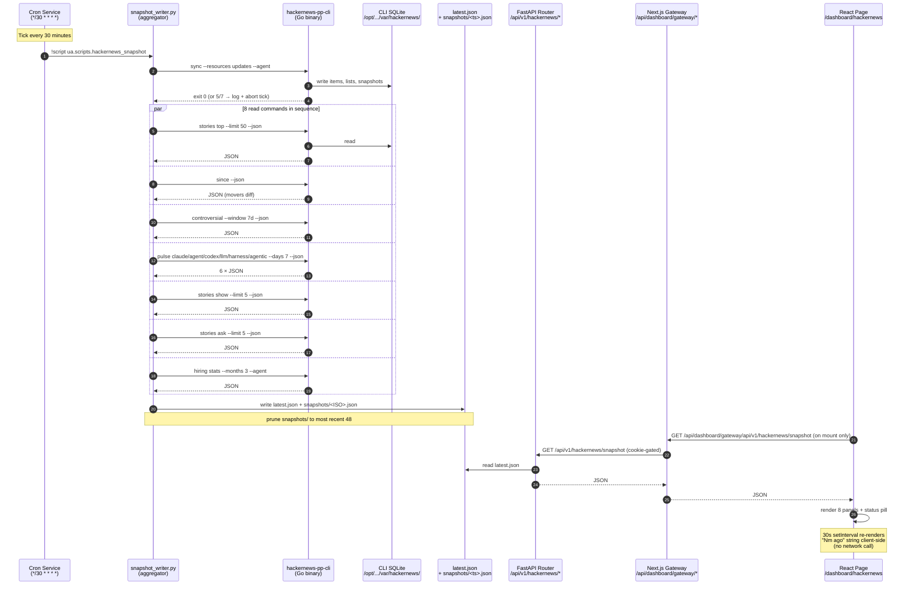
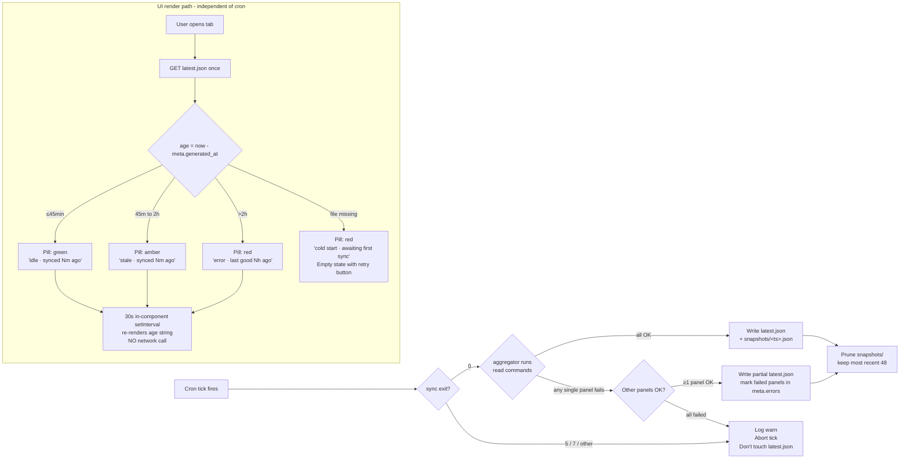

# Hacker News CLI Integration — Phase 1 Implementation Plan

**Status:** Approved (decisions locked via /grill-me on 2026-05-09).
**Scope:** Standalone `/dashboard/hackernews` tab populated by half-hourly `hackernews-pp-cli` cron. **No** integration with Task Hub / CSI / Simone / Atlas. **No** LLM calls. Phase 2 work catalogued but explicitly deferred.
**Source CLI:** [`mvanhorn/printing-press-library/library/media-and-entertainment/hackernews`](https://github.com/mvanhorn/printing-press-library/tree/main/library/media-and-entertainment/hackernews) — a Cobra-based Go CLI generated by the CLI Printing Press project, wrapping the HN Firebase + Algolia public APIs with a local SQLite snapshot store.
**Visual contract:** [`work_products/media/stitch/hackernews/index.html`](../../work_products/media/stitch/hackernews/index.html) — hand-built HTML/CSS prototype with token map at [`README.md`](../../work_products/media/stitch/hackernews/README.md).

---

## 0. Locked decisions recap

| # | Decision | Value |
|---|---|---|
| 1 | Binary path | `/opt/universal_agent/bin/hackernews-pp-cli` (pre-built release, version-pinned) |
| 2 | CLI SQLite store | `/opt/universal_agent/var/hackernews/` via `XDG_DATA_HOME` + `XDG_CONFIG_HOME` |
| 3 | Snapshot JSON | `<artifacts>/hackernews/latest.json` + 48-deep ring at `<artifacts>/hackernews/snapshots/` |
| 4 | Cron | `*/30 * * * *` single job (sync + aggregator) |
| 5 | Watchlist | `config/hackernews_watchlist.yaml`; defaults `[claude, agent, codex, llm, harness, agentic]` |
| 6 | Nav | One entry in `GlobalSidebar.tsx` Intelligence group, no home tile |
| 7 | Failure | Stale-tolerant; pill green ≤45m / amber 45m–2h / red >2h |
| 8 | Auth | Inherits dashboard auth wall via `/dashboard/*` + `/api/dashboard/gateway/*` proxy |
| 9 | Intelligence | Zero LLM in Phase 1 |
| 10 | Design | Accept the prototype HTML as the visual contract |
| 11 | Panels | All 8: Top Stories, Movers, Heated, Pulse, Show HN, Ask HN, Hiring, Search+Status |
| 12 | UI freshness | **No client-side polling.** Fetch on mount + a 30s in-component re-render that updates the "Nm ago" string client-side. |

`<artifacts>` resolves via [`artifacts.py:20`](../../src/universal_agent/artifacts.py#L20) `resolve_artifacts_dir()` — defaults to `<repo-root>/artifacts` per the CLAUDE.md pre-flight rule.

---

## 1. System architecture — sequence diagram



---

## 2. File / module layout

```
/opt/universal_agent/
├── bin/
│   └── hackernews-pp-cli                          # NEW — pre-built binary
├── config/
│   └── hackernews_watchlist.yaml                  # NEW
├── src/universal_agent/
│   ├── api/routers/
│   │   └── hackernews.py                          # NEW — FastAPI router
│   ├── scripts/
│   │   └── hackernews_snapshot.py                 # NEW — aggregator entry
│   ├── services/
│   │   └── hackernews_snapshot_service.py         # NEW — write/read/prune
│   └── gateway_server.py                          # MODIFY — register router + cron
├── web-ui/
│   ├── app/dashboard/hackernews/
│   │   └── page.tsx                               # NEW — React page
│   └── components/dashboard/
│       └── GlobalSidebar.tsx                      # MODIFY — one nav entry
├── artifacts/hackernews/                          # CREATED at runtime
│   ├── latest.json
│   └── snapshots/<ISO-ts>.json (×48)
└── var/hackernews/                                # CREATED at runtime
    ├── config/hackernews-pp-cli/config.toml
    └── data/hackernews-pp-cli/store.db (SQLite)
```

| Action | File | LOC estimate |
|---|---|---|
| NEW | `bin/hackernews-pp-cli` | 0 (binary, ~15MB) |
| NEW | `config/hackernews_watchlist.yaml` | ~12 |
| NEW | `src/universal_agent/services/hackernews_snapshot_service.py` | ~180 |
| NEW | `src/universal_agent/scripts/hackernews_snapshot.py` | ~80 |
| NEW | `src/universal_agent/api/routers/hackernews.py` | ~120 |
| NEW | `web-ui/app/dashboard/hackernews/page.tsx` | ~280 |
| MODIFY | `src/universal_agent/gateway_server.py` (router include + cron registration) | +30 |
| MODIFY | `web-ui/components/dashboard/GlobalSidebar.tsx` (one nav entry) | +1 |
| NEW | `tests/unit/test_hackernews_snapshot_service.py` | ~150 |
| NEW | `scripts/install_hackernews_cli.sh` | ~40 |
| NEW | `docs/integrations/hackernews_phase1_plan.md` (this doc) | ~700 |
| **Total** | | **~1,600 LOC** (~600 product + ~150 test + ~700 docs) |

---

## 3. Failure-mode state machine



**Key invariants:**
- The cron tick **never** writes a half-broken `latest.json` that overwrites a good one. Either all-or-mostly-OK → full write with `meta.errors[]`, or fail closed → no write.
- The UI **never** 500s on a missing/stale snapshot. The status pill carries the error state visibly.
- `meta.generated_at` (ISO 8601 UTC) is the source of truth for the pill — computed client-side on each render.
- **No client-side polling.** Pill updates are a pure UI tick that re-renders the age string from existing snapshot data. New snapshots are picked up on tab re-mount or via the explicit "Refresh now" button.

---

## 4. Implementation phases

### P1.1 — Binary install (deploy concern)

**File:** `scripts/install_hackernews_cli.sh`

```bash
#!/usr/bin/env bash
set -euo pipefail

# Pin to a specific GitHub release tag, NOT "latest" — reproducibility.
HN_CLI_VERSION="hackernews-current"
HN_CLI_SHA256="<TBD — capture at first install>"
HN_CLI_URL="https://github.com/mvanhorn/printing-press-library/releases/download/${HN_CLI_VERSION}/hackernews-pp-cli-linux-amd64.tar.gz"

INSTALL_DIR="/opt/universal_agent/bin"
TARGET="${INSTALL_DIR}/hackernews-pp-cli"
TMPDIR="$(mktemp -d)"
trap 'rm -rf "$TMPDIR"' EXIT

mkdir -p "$INSTALL_DIR"
curl -sSL "$HN_CLI_URL" -o "$TMPDIR/cli.tar.gz"
echo "${HN_CLI_SHA256}  ${TMPDIR}/cli.tar.gz" | sha256sum -c -
tar -xzf "$TMPDIR/cli.tar.gz" -C "$TMPDIR"
install -m 0755 "$TMPDIR/hackernews-pp-cli" "$TARGET"

# Pre-create XDG dirs so first sync doesn't choke on permissions.
mkdir -p /opt/universal_agent/var/hackernews/{config,data}/hackernews-pp-cli

# Smoke test.
"$TARGET" --version
XDG_CONFIG_HOME=/opt/universal_agent/var/hackernews/config \
XDG_DATA_HOME=/opt/universal_agent/var/hackernews/data \
"$TARGET" doctor

echo "Installed hackernews-pp-cli ${HN_CLI_VERSION} at ${TARGET}"
```

**Deploy hook:** add a single line to the deploy workflow that provisions binaries to `bash scripts/install_hackernews_cli.sh` if `/opt/universal_agent/bin/hackernews-pp-cli` is missing or version drifts.

**Verification:**
```bash
ls -la /opt/universal_agent/bin/hackernews-pp-cli  # exists, executable
/opt/universal_agent/bin/hackernews-pp-cli --version  # prints
```

---

### P1.2 — Backend: aggregator service + script + cron + router

**File:** `src/universal_agent/services/hackernews_snapshot_service.py`

```python
"""Hacker News snapshot service — runs hackernews-pp-cli, builds latest.json."""
from __future__ import annotations
import json, logging, os, subprocess, time
from datetime import datetime, timezone
from pathlib import Path
from typing import Any
import yaml

from universal_agent.artifacts import resolve_artifacts_dir

logger = logging.getLogger(__name__)

CLI_BINARY = Path("/opt/universal_agent/bin/hackernews-pp-cli")
XDG_BASE = Path("/opt/universal_agent/var/hackernews")
WATCHLIST_FILE = Path("/opt/universal_agent/config/hackernews_watchlist.yaml")
SNAPSHOT_RING_DEPTH = 48
DEFAULT_TOPICS = ["claude", "agent", "codex", "llm", "harness", "agentic"]


def _cli_env() -> dict[str, str]:
    env = os.environ.copy()
    env["XDG_CONFIG_HOME"] = str(XDG_BASE / "config")
    env["XDG_DATA_HOME"] = str(XDG_BASE / "data")
    env["HACKERNEWS_NO_COLOR"] = "1"
    return env


def _run_cli(args: list[str], timeout: int = 60) -> dict[str, Any] | list[Any] | None:
    """Run the CLI; return parsed JSON or None on failure (logged)."""
    cmd = [str(CLI_BINARY), *args, "--json", "--agent"]
    try:
        r = subprocess.run(
            cmd, env=_cli_env(), capture_output=True, text=True, timeout=timeout
        )
    except subprocess.TimeoutExpired:
        logger.warning("hackernews CLI timeout: %s", " ".join(args))
        return None
    if r.returncode != 0:
        logger.warning(
            "hackernews CLI exit=%d args=%s stderr=%s",
            r.returncode, args, r.stderr[:500],
        )
        return None
    try:
        return json.loads(r.stdout)
    except json.JSONDecodeError as e:
        logger.warning("hackernews CLI bad JSON: %s", e)
        return None


def _load_watchlist() -> list[str]:
    if not WATCHLIST_FILE.exists():
        return DEFAULT_TOPICS
    try:
        data = yaml.safe_load(WATCHLIST_FILE.read_text())
        topics = data.get("topics") if isinstance(data, dict) else None
        if isinstance(topics, list) and 1 <= len(topics) <= 6:
            return [str(t) for t in topics]
    except (OSError, yaml.YAMLError) as e:
        logger.warning("watchlist load failed: %s — using defaults", e)
    return DEFAULT_TOPICS


def build_snapshot() -> dict[str, Any]:
    """Run sync + 8 panel reads. Returns snapshot dict (with meta.errors)."""
    started = time.monotonic()
    errors: list[str] = []

    # Step 1: sync (must succeed; aborts the tick if it doesn't).
    sync_ok = _run_cli(["sync", "--resources", "updates"], timeout=180) is not None
    if not sync_ok:
        raise RuntimeError("sync failed — aborting tick, latest.json untouched")

    # Step 2: 8 panel reads (any single one can fail).
    topics = _load_watchlist()

    def safe(name: str, args: list[str], timeout: int = 60):
        result = _run_cli(args, timeout=timeout)
        if result is None:
            errors.append(name)
        return result

    snapshot = {
        "meta": {
            "generated_at": datetime.now(timezone.utc).isoformat(),
            "schema_version": 1,
            "watchlist": topics,
            "errors": errors,                      # filled below
            "duration_seconds": None,              # filled below
        },
        "top_stories": safe("top_stories", ["stories", "top", "--limit", "50"]),
        "movers": safe("movers", ["since", "--list", "topstories"]),
        "controversial": safe(
            "controversial",
            ["controversial", "--window", "7d", "--min-comments", "100"],
        ),
        "pulses": {
            t: safe(f"pulse_{t}", ["pulse", t, "--days", "7"])
            for t in topics
        },
        "show_hn": safe("show_hn", ["stories", "show", "--limit", "5"]),
        "ask_hn": safe("ask_hn", ["stories", "ask", "--limit", "5"]),
        "hiring": safe("hiring", ["hiring", "stats", "--months", "3"], timeout=90),
    }
    snapshot["meta"]["errors"] = errors
    snapshot["meta"]["duration_seconds"] = round(time.monotonic() - started, 2)
    return snapshot


def write_snapshot(snapshot: dict[str, Any]) -> Path:
    """Write latest.json + snapshots/<ts>.json, prune ring."""
    root = resolve_artifacts_dir() / "hackernews"
    snaps = root / "snapshots"
    root.mkdir(parents=True, exist_ok=True)
    snaps.mkdir(parents=True, exist_ok=True)

    latest = root / "latest.json"
    ts = snapshot["meta"]["generated_at"].replace(":", "").replace("-", "")
    archived = snaps / f"{ts}.json"

    payload = json.dumps(snapshot, indent=2, ensure_ascii=False)
    latest.write_text(payload)
    archived.write_text(payload)

    # Prune ring buffer.
    files = sorted(snaps.glob("*.json"), reverse=True)
    for stale in files[SNAPSHOT_RING_DEPTH:]:
        stale.unlink(missing_ok=True)

    return latest


def read_latest() -> dict[str, Any] | None:
    latest = resolve_artifacts_dir() / "hackernews" / "latest.json"
    if not latest.exists():
        return None
    try:
        return json.loads(latest.read_text())
    except json.JSONDecodeError:
        return None
```

**File:** `src/universal_agent/scripts/hackernews_snapshot.py`

```python
"""Cron entrypoint — invoked via `!script universal_agent.scripts.hackernews_snapshot`."""
from __future__ import annotations
import logging, sys
from universal_agent.services.hackernews_snapshot_service import (
    build_snapshot, write_snapshot,
)

logger = logging.getLogger(__name__)


def main() -> int:
    try:
        snapshot = build_snapshot()
    except RuntimeError as e:
        logger.error("hackernews snapshot aborted: %s", e)
        return 1
    path = write_snapshot(snapshot)
    errs = snapshot["meta"]["errors"]
    logger.info(
        "hackernews snapshot written path=%s errors=%d duration=%.1fs",
        path, len(errs), snapshot["meta"]["duration_seconds"],
    )
    return 0


if __name__ == "__main__":
    sys.exit(main())
```

**File:** `src/universal_agent/gateway_server.py` — append cron registration

Insert near the existing cron helpers (after [`_ensure_morning_briefing_cron_job`](../../src/universal_agent/gateway_server.py#L18162)):

```python
def _ensure_hackernews_snapshot_cron_job() -> Optional[dict[str, Any]]:
    return _register_system_cron_job(
        system_job="hackernews_snapshot",
        default_cron="*/30 * * * *",
        default_timezone="UTC",
        command="!script universal_agent.scripts.hackernews_snapshot",
        description="Half-hourly Hacker News snapshot via hackernews-pp-cli.",
        timeout_seconds=300,
        enabled=_proactive_cron_enabled("UA_HACKERNEWS_SNAPSHOT_ENABLED"),
        cron_env_var="UA_HACKERNEWS_SNAPSHOT_CRON",
        timezone_env_var="UA_HACKERNEWS_SNAPSHOT_TIMEZONE",
        # No required_secrets — HN APIs are public.
    )
```

Call `_ensure_hackernews_snapshot_cron_job()` from the same boot block where the other `_ensure_*` cron helpers are invoked.

**File:** `src/universal_agent/api/routers/hackernews.py`

```python
"""Read-only HN snapshot endpoints. Mounted on /api/v1/hackernews."""
from __future__ import annotations
from datetime import datetime, timezone
from typing import Any

from fastapi import APIRouter, HTTPException

from universal_agent.services.hackernews_snapshot_service import (
    build_snapshot, write_snapshot, read_latest,
)

router = APIRouter(prefix="/api/v1/hackernews", tags=["hackernews"])


@router.get("/snapshot")
def get_snapshot() -> dict[str, Any]:
    snap = read_latest()
    if snap is None:
        raise HTTPException(status_code=503, detail="no snapshot yet — cron has not run")
    return snap


@router.get("/health")
def health() -> dict[str, Any]:
    snap = read_latest()
    if snap is None:
        return {"status": "cold", "age_seconds": None, "errors": []}
    age = (datetime.now(timezone.utc) -
           datetime.fromisoformat(snap["meta"]["generated_at"])).total_seconds()
    return {
        "status": "ok" if age <= 2700 else ("stale" if age <= 7200 else "error"),
        "age_seconds": int(age),
        "errors": snap["meta"].get("errors", []),
    }


@router.post("/refresh")
def refresh_now() -> dict[str, Any]:
    """Manual one-shot. Used by the 'Refresh now' button."""
    try:
        snap = build_snapshot()
    except RuntimeError as e:
        raise HTTPException(status_code=502, detail=str(e))
    write_snapshot(snap)
    return {"ok": True, "errors": snap["meta"].get("errors", [])}
```

Register at the existing router include block near [`gateway_server.py:14794`](../../src/universal_agent/gateway_server.py#L14794):

```python
from universal_agent.api.routers.hackernews import router as hackernews_router
app.include_router(hackernews_router)
```

**File:** `config/hackernews_watchlist.yaml`

```yaml
# Hacker News topic watchlist — drives the Pulse panel.
# Re-read on every cron tick. Cap: 6 topics (matches design 3x2 grid).
# Edit and the change is live within 30 minutes.
topics:
  - claude
  - agent
  - codex
  - llm
  - harness
  - agentic
```

---

### P1.3 — Frontend: page + sidebar entry

**File:** `web-ui/components/dashboard/GlobalSidebar.tsx` — single line addition

At [`GlobalSidebar.tsx:84`](../../web-ui/components/dashboard/GlobalSidebar.tsx#L84) (Intelligence group), insert one entry and add `Newspaper` to the `lucide-react` import:

```tsx
{ href: "/dashboard/claude-code-intel", label: "Claude Code Intel", icon: Bot },
{ href: "/dashboard/discord", label: "Discord Intel", icon: Radio },
{ href: "/dashboard/csi", label: "CSI Feed", icon: Radio },
{ href: "/dashboard/hackernews", label: "Hacker News", icon: Newspaper },  // NEW
{ href: "/dashboard/csi/rss", label: "CSI Watchlist · YT", icon: ListTodo },
```

**File:** `web-ui/app/dashboard/hackernews/page.tsx`

~280 LOC. Maps the design's 8 panels to React components. **Single fetch on mount.** Pure UI tick (`30s setInterval`) re-renders the age string client-side without any network call. Pill state computed from `meta.generated_at` against `Date.now()`.

```tsx
"use client";
import { useCallback, useEffect, useState } from "react";
import { Newspaper, RefreshCw, ExternalLink, MessageCircle } from "lucide-react";

const API = "/api/dashboard/gateway/api/v1/hackernews";

type Snapshot = {
  meta: {
    generated_at: string;
    errors: string[];
    watchlist: string[];
    duration_seconds: number;
    schema_version: number;
  };
  top_stories: any[] | null;
  movers: any | null;
  controversial: any[] | null;
  pulses: Record<string, any | null>;
  show_hn: any[] | null;
  ask_hn: any[] | null;
  hiring: any | null;
};

function pillState(generatedAt: string | undefined): { color: string; label: string } {
  if (!generatedAt) return { color: "red", label: "cold start" };
  const ageSec = (Date.now() - new Date(generatedAt).getTime()) / 1000;
  if (ageSec <= 2700) return { color: "green", label: `idle · synced ${formatAge(ageSec)} ago` };
  if (ageSec <= 7200) return { color: "amber", label: `stale · synced ${formatAge(ageSec)} ago` };
  return { color: "red", label: `error · last good ${formatAge(ageSec)} ago` };
}

function formatAge(s: number): string {
  if (s < 60) return `${Math.floor(s)}s`;
  if (s < 3600) return `${Math.floor(s / 60)}m`;
  return `${Math.floor(s / 3600)}h ${Math.floor((s % 3600) / 60)}m`;
}

export default function HackerNewsPage() {
  const [snap, setSnap] = useState<Snapshot | null>(null);
  const [refreshing, setRefreshing] = useState(false);
  const [, force] = useState(0);  // for the age ticker

  const load = useCallback(async () => {
    const r = await fetch(`${API}/snapshot`, { cache: "no-store" });
    if (r.ok) setSnap(await r.json());
  }, []);

  const refresh = useCallback(async () => {
    setRefreshing(true);
    try {
      await fetch(`${API}/refresh`, { method: "POST" });
      await load();
    } finally {
      setRefreshing(false);
    }
  }, [load]);

  // Single fetch on mount.
  useEffect(() => { void load(); }, [load]);

  // Pure UI tick — re-renders so the "Nm ago" string updates. No network.
  useEffect(() => {
    const t = setInterval(() => force(n => n + 1), 30_000);
    return () => clearInterval(t);
  }, []);

  const pill = pillState(snap?.meta.generated_at);

  // 8 panel components rendered against snap.top_stories, snap.movers, etc.
  // Visual contract = work_products/media/stitch/hackernews/index.html.
  // Color tokens, spacing, hover affordances all carry over.

  return (
    <div className="...">
      {/* Top bar with HN orange "Y" mark + status pill + Refresh now button */}
      {/* Search input */}
      {/* 2-col grid: Top Stories + Heated on left; Pulse + Movers + Show/Ask + Hiring on right */}
    </div>
  );
}
```

**Design contract reference for porting:** [`work_products/media/stitch/hackernews/index.html`](../../work_products/media/stitch/hackernews/index.html) (the static prototype). Every color token, spacing token, panel layout, and hover affordance maps 1:1. The README at [`work_products/media/stitch/hackernews/README.md`](../../work_products/media/stitch/hackernews/README.md) is the authoritative token map.

---

### P1.4 — Wiring & smoke

In order:

1. Run `bash scripts/install_hackernews_cli.sh` on the VPS — verify binary + smoke-test `doctor`.
2. Drop `config/hackernews_watchlist.yaml`.
3. Deploy backend (router + cron registration). Verify cron job listed via the dashboard's existing Cron Jobs tab and that it fires within 30 min.
4. Manually `curl /api/dashboard/gateway/api/v1/hackernews/health` from the dashboard's authed session — verify `{"status":"ok"}` with `age_seconds < 2700`.
5. Deploy frontend (sidebar + page). Verify "Hacker News" appears in left nav under Intelligence.
6. Click through; verify all 8 panels render against real data.
7. Deliberately rename the binary temporarily; verify cron tick fails *without* corrupting `latest.json`; the old snapshot still serves; the pill goes amber after 45 minutes.
8. Restore binary; verify next tick recovers.

---

## 5. Snapshot JSON schema (v1)

```typescript
type Snapshot = {
  meta: {
    schema_version: 1;                    // bump on breaking changes
    generated_at: string;                 // ISO 8601 UTC
    duration_seconds: number;             // wall time of the tick
    watchlist: string[];                  // topics actually used this tick
    errors: string[];                     // panel names that failed
  };
  top_stories: HnStory[] | null;
  movers: { since: string; changes: HnMover[] } | null;
  controversial: HnControversial[] | null;
  pulses: Record<string, HnPulse | null>; // keyed by topic name
  show_hn: HnStory[] | null;
  ask_hn: HnStory[] | null;
  hiring: HnHiringStats | null;
};
```

A `null` panel = the CLI command for that panel failed; the UI renders an inline error chip in that panel and falls back to a "couldn't load" state. Other panels stay live.

---

## 6. Configuration surface

| Env var | Default | Effect |
|---|---|---|
| `UA_HACKERNEWS_SNAPSHOT_ENABLED` | `1` | Master kill-switch. Set to `0` to disable the cron without removing it. |
| `UA_HACKERNEWS_SNAPSHOT_CRON` | `*/30 * * * *` | Override cadence. |
| `UA_HACKERNEWS_SNAPSHOT_TIMEZONE` | `UTC` | Timezone for the cron expression. |

| Config file | Purpose |
|---|---|
| `config/hackernews_watchlist.yaml` | Pulse topics. Re-read every tick. Cap 6. |

No secrets. HN APIs are public — the cron declares no `required_secrets`.

---

## 7. Test plan

**Unit (`tests/unit/test_hackernews_snapshot_service.py`):**
- `_load_watchlist` returns defaults when file missing
- `_load_watchlist` returns parsed list when valid
- `_load_watchlist` returns defaults when malformed
- `build_snapshot` raises when `sync` fails
- `build_snapshot` returns partial snapshot with `meta.errors` populated when one panel fails
- `write_snapshot` creates `latest.json` + ring entry
- `write_snapshot` prunes to 48 entries
- All CLI invocations mocked via `subprocess.run` patch

**Integration (manual on VPS, post-deploy):**
- Real cron tick produces snapshot < 90s
- `/api/v1/hackernews/snapshot` returns 200 with all 8 keys
- `/api/v1/hackernews/health` returns expected status by age
- UI renders all 8 panels without console errors
- **No requests to `/snapshot` after the initial mount fetch** (verifies polling is gone — open DevTools Network tab, leave open 5 minutes, assert zero new fetches)

**Failure mode (manual):**
- Rename binary → cron tick logs error, no `latest.json` mutation, UI shows last good
- Wait 45 min → pill goes amber
- Wait 2h → pill goes red
- Restore binary → next tick recovers

---

## 8. Production verification checklist

Per the CLAUDE.md "Production Verification Rules" section:

| Rule | Verification step |
|---|---|
| 1. Skill deployed ≠ skill invoked | `grep -n hackernews_snapshot src/universal_agent/gateway_server.py` returns the cron registration; cron job visible in `/dashboard/cron-jobs` |
| 2. Phase complete = real artifact | `ls /opt/universal_agent/artifacts/hackernews/latest.json` exists; `cat` shows non-null `top_stories` |
| 3. Diagnostic commands use canonical resolver | `resolve_artifacts_dir()` from `artifacts.py:20` is what determines the path; no hardcoded paths |
| 4. No conflation of code paths | HN's snapshot path is its own service; not crossed with CSI's URL judge or research grounding allowlists |
| 5. Prove your claim before stating it | Plan only references functions whose bodies were read during /grill-me |
| 6. End-of-PR production smoke | Required steps in P1.4. SHIP_HANDOFF must include: cron job ID, first successful snapshot timestamp, screenshot of tab |
| 7. Sandbox honesty | Plan was authored from a Claude Code session; deploy steps run on the VPS via `/ship`. Flagged in the handoff. |
| 8. Branch vs deploy honesty | "Code merged" ≠ "tab live." Verification step (P1.4 step 6) is what closes the loop. |

---

## 9. Phase 2 — explicitly deferred (catalog only)

Documented for future reference, **not built in Phase 1**. The first two are now planned in detail in [`hackernews_phase2_plan.md`](./hackernews_phase2_plan.md):

| Idea | Why interesting | Effort | Status |
|---|---|---|---|
| Pulse → Simone briefing context | LLM synthesis over weekly HN signal; matches CLAUDE.md LLM-Native rule | Medium | Planned (Phase 2 Lane A) |
| Movers → CSI lane | High-velocity stories become CSI signals via existing pipeline | Medium | Planned (Phase 2 Lane B) |
| Daily LLM digest panel | Haiku 4.5 one-paragraph summary on top of the page; ~$0.0001/run | Small | Catalog only |
| `repost` gate before Show HN | Sanity-check our own posts vs. priors | Small | Catalog only |
| Hiring quarterly trend | Long-window aggregation surfaced as a tile | Medium | Catalog only |
| LLM relevance filter on Pulse | Only if data shows false-positive noise | Small | Catalog only |
| Topic auto-suggest | "you don't track X but it's trending" | Medium | Catalog only |

---

## 10. Risks / unknowns

1. **Binary release pinning.** The exact asset URL pattern and the SHA256 are `<TBD>` placeholders in P1.1. First install records both, then locks them.
2. **CLI XDG behavior.** The CLI README mentions config at `~/.config/hackernews-pp-cli/config.toml` but doesn't explicitly document `XDG_DATA_HOME` respect. We rely on standard XDG behavior; first smoke test confirms or we fall back to a `--config-dir` flag if it exists.
3. **First-tick cold start.** The CLI's `since` needs ≥2 syncs to produce diff data. First half-hour after install, the Movers panel will be empty. UI shows "awaiting first comparison" gracefully — covered in failure-mode flowchart node N.
4. **Cron service runs as `cron_system` user_id but the Linux process is `ua`'s shell.** XDG paths are env-var-driven so we decouple from `$HOME` resolution.
5. **Algolia rate limits on `pulse`.** 6 topics × Algolia hit per tick = 6 calls. Algolia's free public tier handles this trivially; flagged only because expanding the watchlist past 6 could change the math.

---

## 11. Sign-off

Approved 2026-05-09 via /grill-me interview. Implementation can hand off to `code-writer` sub-agent or be driven directly.
