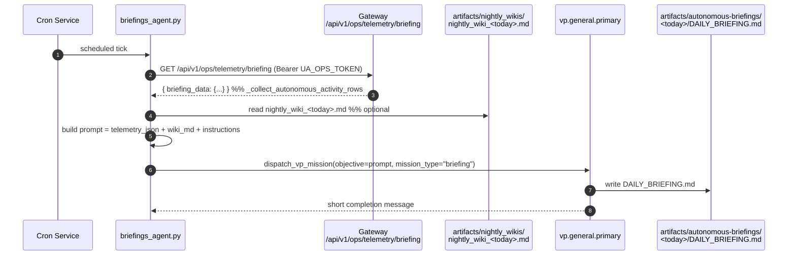
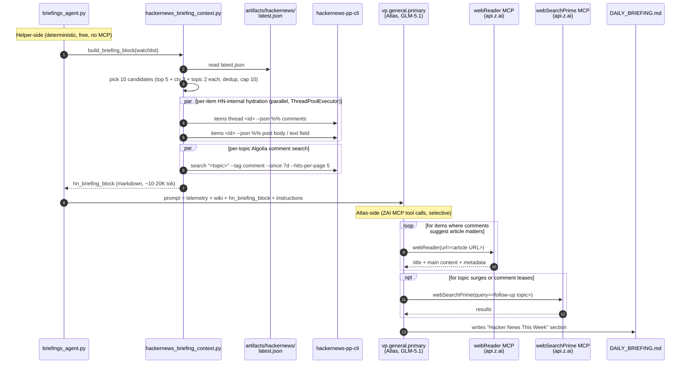
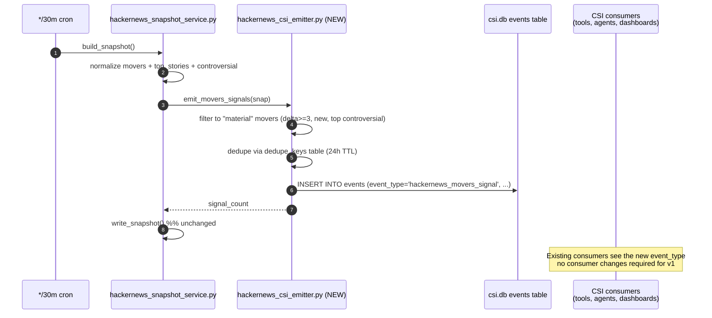

# Hacker News Phase 2 Implementation Plan

**Status:** Approved. `/grill-me` interview completed 2026-05-09 — see § 11 for the locked decision log.
**Scope:** Two leveraged Phase 2 integrations from [`hackernews_phase1_plan.md` § 9](./hackernews_phase1_plan.md):

  1. **Pulse → Simone briefing context** — fold the weekly HN watchlist signal into the daily autonomous briefing.
  2. **Movers → CSI lane** — turn high-velocity HN front-page activity into CSI events that flow through the existing trend-report / opportunity-bundle plumbing.

**Explicitly out of scope for Phase 2:**

  - The 5 other Phase 2 catalog items (Daily LLM digest panel, `repost` gate, Hiring quarterly trend, LLM relevance filter, Topic auto-suggest).
  - FTS5 search (separate Phase 2 deliverable; the disabled "search coming in Phase 2" UI placeholder stays disabled).
  - Phase 1.5 hygiene work (`page.tsx` LOC split, `refresh_now` async-ification) — tracked separately in [`docs/operations/2026-05-09_ship_pollution_and_phase1_followups.md`](../operations/2026-05-09_ship_pollution_and_phase1_followups.md).

---

## 0. Why these two

Both align with the [LLM-Native Intelligence Design](../../CLAUDE.md#llm-native-intelligence-design) rule from CLAUDE.md:

> `raw records → durable knowledge blocks → bounded retrieval context → LLM synthesis → gated action candidates`

**Lane A (Pulse → briefing)** plugs into Simone's existing daily briefing prompt — same LLM, same VP runtime, same artifact path. We're adding one more bounded context block ("here's what HN was talking about this week"), not building a new reasoning surface. Pure prompt extension.

**Lane B (Movers → CSI)** plugs into CSI's existing event bus. CSI already routes `rss_trend_report` / `reddit_trend_report` / `threads_trend_report` events through dedup, trend-report aggregation, and opportunity-bundle synthesis. We're adding one more `event_type` to that bus, not building a new pipeline.

**Cost contrast:** Phase 2 catalog item "Daily LLM digest panel" requires a new LLM call, prompt, token budget tracking, and visible UI surface — but only feeds the HN tab itself. Lanes A and B reuse existing LLM/UI surfaces and feed the broader operator intelligence loop. Higher leverage per LOC.

---

## 1. Lane A — Pulse → Simone briefing context

> **Design decision (2026-05-09, post-grill):** the originally-drafted "render
> the snapshot as a markdown table" approach was rejected during the grill
> because title-level pulse counts feed the LLM aggregates and ask it to
> imagine the underlying evidence — the antipattern CLAUDE.md's LLM-Native
> rule warns against. The revised approach (γ″) is a **hybrid** where the
> helper does deterministic HN-internal fetches (comment threads + post
> bodies + Algolia per-topic comment search) and **Atlas selectively fetches
> article bodies via the ZAI-native `webReader` MCP** during its mission. The
> helper is content-rich but bounded; Atlas's tool-use is reliable because
> `webReader` is GLM-trained and ZAI-shipped. The original plan to install
> `defuddle` was dropped — `webReader` covers it natively, with no install
> step and no model-tool-use uncertainty. See § 11 for the full decision
> log from the grill.

### 1.1 What the briefing pipeline looks like today



Code-verified anchors:
- Briefing entrypoint: [`src/universal_agent/scripts/briefings_agent.py`](../../src/universal_agent/scripts/briefings_agent.py) (95 LOC).
- Telemetry collector: [`gateway_server.py:26748` `ops_telemetry_briefing_get`](../../src/universal_agent/gateway_server.py#L26748) → `_collect_autonomous_activity_rows`.
- Prompt assembled at [`briefings_agent.py:56-78`](../../src/universal_agent/scripts/briefings_agent.py#L56) — single f-string with three sections (`telemetry_json`, `wiki_content`, `Instructions`).

### 1.2 What changes — content depth, not just titles

The hybrid γ″ split: helper does the deterministic HN-internal fetches (comments + post body + Algolia topic search); Atlas selectively fetches article bodies via the ZAI-native `webReader` MCP during its mission, after reading the comments.

**Helper at briefing time (once daily):**

1. Reads `artifacts/hackernews/latest.json` (already kept fresh by the */30m cron — no extra work in the snapshot path).
2. Picks 10 candidate items (rules in § 1.3a below).
3. For each candidate, fetches HN-internal content via the CLI:
   - HN comment thread via `hackernews-pp-cli items thread <id>` — top 10 comments by `points`. Free, never paywalled, highest-signal source.
   - HN post `text` field via `hackernews-pp-cli items <id>` — captures Show HN / Ask HN body text we currently throw away.
4. Adds a separate `Algolia mentions block` from `hackernews-pp-cli search "<topic>" --tag comment --since 7d --hits-per-page 5` for each watchlist topic — top 5 mentions of each topic across ALL HN comments this week, not just the front page (default relevance sort).
5. Renders the candidate items + Algolia mentions as a structured markdown block injected into the briefing prompt. **No fixed token cap** — Max plan absorbs whatever the deterministic fetch produces (~10-20K tokens typical).

**Atlas during the mission:**

1. Reads the briefing prompt with HN-internal evidence already in place.
2. For items where the comments suggest the article body would clarify "is this important to my work," Atlas calls `webReader` (ZAI-native MCP) to fetch the article. Atlas decides which items warrant a fetch — typically 2-5 of the 10 candidates.
3. Optionally calls `webSearchPrime` (ZAI-native MCP) for follow-up research if a topic surge or comment thread teases something not yet in the operator's knowledge base.
4. Synthesizes the "Hacker News This Week" section of the briefing.



### 1.3 File-by-file change

| File | Action | LOC |
|---|---|---|
| `.mcp.json` | MODIFY — register `web-reader` and `web-search-prime` ZAI MCPs with `${ZAI_API_KEY}` substitution. Header `_comment` block flagging ZAI-scope. | +20 |
| `src/universal_agent/scripts/briefings_agent.py` | MODIFY — call `build_briefing_block()` and inject into prompt; update Atlas instructions to teach `webReader` / `webSearchPrime` use | ~50 |
| `src/universal_agent/services/hackernews_briefing_context.py` | NEW — orchestrates HN-internal fetching + formatting. Picks candidates, calls CLI for comments/post-text, runs per-topic Algolia comment search, renders markdown | ~350 |
| `src/universal_agent/services/hackernews_content_fetch.py` | NEW — narrow client wrappers around the CLI's `items thread`, `items get`, `search` commands. Pure I/O, mockable from tests | ~180 |
| `docs/06_Deployment_And_Environments/10_Interactive_Coding_Environment.md` | MODIFY — add "Tool Surface by Execution Mode" subsection (the matrix locked in the grill) | +60 |
| `CLAUDE.md` | MODIFY — add row to "Pre-Implementation Reading" matrix: when deciding which web-fetch / search tool an agent should use, read the new section | +2 |
| `tests/unit/test_hackernews_content_fetch.py` | NEW — covers CLI subprocess wrapping, JSON parsing, timeout, error paths | ~140 |
| `tests/unit/test_hackernews_briefing_context.py` | NEW — covers: empty snapshot, fully populated, Algolia search merge, watchlist matching, single-fetch failure | ~180 |
| **Total** | | **~860 LOC product+test, ~80 LOC docs** |

LOC is down from the original ~1,020 because article-extraction failure handling (the bulk of the original budget) moves to Atlas's runtime — `webReader` failures are per-call and Atlas just skips and moves on, no helper-side timeout/paywall/403 logic needed.

#### 1.3a Candidate selection rules (locked)

```python
def _select_candidates(snap: dict, watchlist: list[str]) -> list[dict]:
    """Returns up to 10 deduplicated candidates, prioritized by source list."""
    seen: set[int] = set()
    out: list[dict] = []

    def push(items: list[dict]) -> None:
        for item in items:
            sid = item.get("id")
            if sid is None or sid in seen or len(out) >= 10:
                continue
            seen.add(sid)
            out.append(item)

    # Priority 1: top stories (operator's "what's everyone talking about" surface)
    push((snap.get("top_stories") or [])[:5])
    # Priority 2: controversial (operator's "what's the field arguing about" surface)
    push((snap.get("controversial") or [])[:3])
    # Priority 3: per-topic pulse (targeted watchlist signal)
    for topic in watchlist:
        topic_top = ((snap.get("pulses") or {}).get(topic) or {}).get("top_stories") or []
        push(topic_top[:2])

    return out
```

Rules: dedup by `id`, cap at 10, fill in priority order (top_stories → controversial → topic-pulse). Soft watchlist bias — front-page + controversial slots stay unfiltered so we don't pre-filter out off-watchlist signal that's still operator-relevant. Watchlist contributes through the `pulses` slots only.

### 1.4 The HN block format

The block has THREE sections (article excerpts removed — Atlas fetches those selectively via `webReader`). Each is a chunk of evidence the briefing LLM can cite. Token estimate ~10-20K with 10 candidate items + 6 watchlist topics × 5 mentions:

```markdown
## Hacker News This Week (snapshot from <generated_at>)

### 1. Watchlist pulse — 7-day mention volume

| topic    | mentions | avg pts | top hit |
|----------|---------:|--------:|---------|
| claude   |      231 |     348 | "Higher usage limits for Claude and a compute deal with SpaceX" (507 pts) |
| agent    |      188 |     212 | "Building a coding agent in 1000 LOC" (310 pts) |
| ...

### 2. Front-page stories with content (top 5 by score, +3 controversial, +2 watchlist-matched)

#### Internet Archive Switzerland
- 213 pts · 24 cmt · `internetarchive.ch` · by hggh
- Article: https://internetarchive.ch/  ·  HN: https://news.ycombinator.com/item?id=48074265
- **Use `webReader` to fetch article body if comments below suggest it matters.**
- **Top comments** (3 of 24, by points):
  > **timr** (52 pts): "The Swiss are uniquely positioned for this — long political stability + neutrality + strong privacy laws make them a natural archival jurisdiction."
  > **knubie** (38 pts): "Worth noting they're partnered with Stanford and Internet Archive proper for the technical infra; this isn't a from-scratch effort."
  > **shadowgovt** (24 pts): "I'd like to see how they handle the requirement to keep storage media physically maintained over multi-decade timescales..."

#### [next item...]

### 3. Show HN / Ask HN highlights (top 2 each)

#### Show HN: Free hotspot/polygon-region tool for game development
- 6 pts · 2 cmt · `magikmaker.dev` · by magikMaker
- **Post body** (from `text` field): "For a game I'm developing I needed an easy way to create hotspot regions on textures. Existing tools were either commercial or required a heavy editor install, so I built this..."
- **Comments**: [...]

### 4. Watchlist mentions across ALL HN comments this week (top 5 per topic, via Algolia)

#### claude (231 hits this week)
- "I switched our codegen pipeline to Claude 4.6 and saw a 30% reduction in tool-call retries..." (in thread: "Building agentic systems that don't suck", 412 pts) — 7d ago
- "Claude's projects feature is finally usable for codebases >100 files now that..." (in thread: "Anthropic ships project memory", 290 pts) — 4d ago
- ...

#### agent (188 hits this week)
- "We've been running multi-agent systems in prod for 8 months and the failure modes are..." (in thread: "Multi-agent traps to avoid", 521 pts) — 5d ago
- ...

_(panels with errors this run, if any: pulse_codex)_
```

### 1.5 The prompt change

Inserted after the wiki section, at [`briefings_agent.py:67-69`](../../src/universal_agent/scripts/briefings_agent.py#L67):

```python
from universal_agent.services.hackernews_briefing_context import build_briefing_block
from universal_agent.services.hackernews_snapshot_service import _load_watchlist

# Build the HN evidence block (~10-20K tokens). Returns "" on failure.
hn_block = build_briefing_block(watchlist=_load_watchlist())

# Soft kill switch — set UA_HACKERNEWS_BRIEFING_BLOCK_ENABLED=0 to disable.
# Briefing proceeds without HN context; rest of the prompt unchanged.
if os.getenv("UA_HACKERNEWS_BRIEFING_BLOCK_ENABLED", "1") == "0":
    hn_block = ""

objective = f"""Generate the daily autonomous operations briefing for the last 24 hours.
...

Here is the raw telemetry data:
```json
{telemetry_json}
```

Here is the external Nightly Wiki Proactive Generation output (if any):
```markdown
{wiki_content}
```

{hn_block}                          # ← NEW; blank-string when N/A so format stays clean

Instructions:
- Summarize tasks completed, attempted, and failed.
- ... (existing bullets unchanged) ...
- If the Hacker News block above is non-empty, include a "Hacker News This Week"
  section. **Read the actual content (comments, post bodies, Algolia mentions)** —
  do NOT just paraphrase titles. For items where the comments suggest the article
  body would clarify whether the substance matters to active work, **call the
  `webReader` tool with the article URL** to fetch the article body before
  deciding whether to surface it. Be selective — typically 2-5 of the 10
  candidates warrant a fetch. If a topic surged in mentions vs the baseline
  (compare to historical pulse counts in prior briefings if you have them), call
  that out separately. If a comment thread teases a follow-up topic worth
  surfacing in the operator's broader knowledge base, **call `webSearchPrime`**
  for that follow-up — but only when warranted, not as default behavior.
  Surface 1-3 items where the substance aligns with active work or open
  questions; quote a comment or article excerpt where it illuminates "why this
  matters." If nothing in the HN block lands on relevant ground, say so in one
  line and move on — do not pad. "Nothing relevant to active work today" is a
  valid answer.
"""
```

The `webReader` and `webSearchPrime` references in the instructions assume those MCPs are registered in `.mcp.json` (one of this Phase 2's deploy steps). They appear to Atlas as native tools at mission start; Atlas has been trained to invoke them by Z.AI as part of the GLM Coding Plan tooling.

### 1.6 The helper

`hackernews_briefing_context.py` does HN-internal fetching only — comments + post body + per-topic Algolia search. No article fetching (Atlas does that via `webReader`). Skeleton:

```python
"""Build the HN evidence block for the daily briefing (Lane A, hybrid γ″).

The helper does HN-internal content fetching via the `hackernews-pp-cli`
subprocess — comment threads, post bodies, and per-topic Algolia comment
searches. These are deterministic, free, never paywalled, and always
reliable.

Article body fetching is NOT done here. Atlas selectively invokes the
ZAI-native `webReader` MCP during its briefing mission for items where
the comments suggest the article matters. That keeps article-fetch
judgment in the LLM where it belongs and avoids needing to install
defuddle or handle paywall edge cases helper-side.

Failure-tolerant: any single CLI call can fail without aborting the
block — that item just renders with whatever did succeed. If the
snapshot is missing or stale, the helper returns "" and the briefing
proceeds without HN context.
"""
from __future__ import annotations

import logging
from concurrent.futures import ThreadPoolExecutor
from datetime import datetime, timezone
from typing import Any

from universal_agent.services.hackernews_snapshot_service import read_latest
from universal_agent.services.hackernews_content_fetch import (
    fetch_item,
    fetch_thread_comments,
    search_topic_mentions,
)

logger = logging.getLogger(__name__)

MAX_AGE_HOURS = 24
MAX_COMMENTS_PER_ITEM = 10
MAX_TOPIC_MENTIONS = 5
PER_CALL_TIMEOUT_S = 15
HYDRATE_PARALLELISM = 6


def build_briefing_block(watchlist: list[str], now: datetime | None = None) -> str:
    """Return a multi-section markdown block (~10-20K tokens) or "" on failure."""
    snap = read_latest()
    if not _is_fresh(snap, now=now):
        return ""

    candidates = _select_candidates(snap, watchlist)  # see § 1.3a
    if not candidates:
        return ""

    with ThreadPoolExecutor(max_workers=HYDRATE_PARALLELISM) as pool:
        hydrated = list(pool.map(_hydrate_one, candidates))
        topic_mentions_list = list(
            pool.map(lambda t: (t, _safe(lambda: search_topic_mentions(t, limit=MAX_TOPIC_MENTIONS))), watchlist)
        )

    topic_mentions = {t: (m or []) for t, m in topic_mentions_list}

    return _render(snap, hydrated, topic_mentions, watchlist)


def _hydrate_one(candidate: dict[str, Any]) -> dict[str, Any]:
    """Fetch HN-internal content for a single candidate. Best-effort."""
    out: dict[str, Any] = {**candidate}
    out["comments"] = _safe(lambda: fetch_thread_comments(candidate["id"], limit=MAX_COMMENTS_PER_ITEM)) or []
    out["post_text"] = _safe(lambda: (fetch_item(candidate["id"]) or {}).get("text") or "") or ""
    return out


def _safe(fn):
    try:
        return fn()
    except Exception as exc:
        logger.warning("HN briefing fetch failed: %s", exc)
        return None


def _is_fresh(snap: dict[str, Any] | None, now: datetime | None = None) -> bool:
    if not snap or not isinstance(snap, dict):
        return False
    iso_ts = snap.get("meta", {}).get("generated_at", "")
    if not iso_ts:
        return False
    try:
        ts = datetime.fromisoformat(iso_ts)
    except ValueError:
        return False
    if ts.tzinfo is None:
        ts = ts.replace(tzinfo=timezone.utc)
    age_h = ((now or datetime.now(timezone.utc)) - ts).total_seconds() / 3600
    return age_h <= MAX_AGE_HOURS


# ... _select_candidates (§ 1.3a), _render ...
```

### 1.7 Failure modes

**Helper-side (deterministic):**

| Mode | Behavior |
|---|---|
| `latest.json` missing or stale (>24h) | block = `""`, briefing proceeds unchanged |
| Snapshot present but no panels populated | block = `""`, briefing proceeds unchanged |
| Single CLI subprocess call hangs | per-call timeout (15s); item degrades to whatever did succeed |
| All CLI calls fail | block = `""`, briefing proceeds unchanged (CLI is essential to ALL helper content paths) |
| Algolia topic search fails for some topics | partial — successful topic blocks render, failed topics omitted with a footnote |
| Helper kill switch (`UA_HACKERNEWS_BRIEFING_BLOCK_ENABLED=0`) | block = `""`, briefing proceeds unchanged |

**Atlas-side (LLM tool calls):**

| Mode | Behavior |
|---|---|
| `webReader` returns 4xx/5xx for a URL (paywall, 403, etc.) | Atlas skips that article and surfaces the item from comments alone, OR drops the item from the briefing entirely if it loses confidence |
| `webReader` quota exhausted | Atlas reads the rate-limit response, falls back to comment-only synthesis, and notes "WebReader quota hit; surface based on comments only" in the briefing |
| `webSearchPrime` returns no results for a follow-up query | Atlas omits the follow-up; surfaces only what's in the candidate set |
| `.mcp.json` has invalid `${ZAI_API_KEY}` substitution | MCP fails to spawn at session start; Atlas mission proceeds without web tools and degrades to comment-only synthesis |

**Invariant:** the HN block must never block or corrupt the briefing. The briefing was working without it before Phase 2 and must continue to work on its bad days. No hard token cap is enforced — the deterministic helper output (~10-20K tokens) plus Atlas's selective `webReader` fetches all fit comfortably in the Max plan's prompt budget.

---

## 2. Lane B — Movers → CSI lane

### 2.1 What CSI looks like today

```mermaid
flowchart LR
    subgraph Producers
      RSS[RSS Trend Report Producer<br/>CSI_Ingester scripts] -->|emits| EV
      RDT[Reddit Trend Report Producer] -->|emits| EV
      THR[Threads Trend Producer] -->|emits| EV
    end

    EV[(events table<br/>/var/lib/universal-agent/csi/csi.db)]

    subgraph Consumers
      EV -->|csi_recent_reports tool| Agents[csi-trend-analyst<br/>factory-supervisor<br/>csi-supervisor]
      EV -->|opportunity bundling| OB[opportunity_bundle_ready events]
      EV -->|dashboard surfaces| UI[/dashboard/csi]
    end
```

Code-verified anchors:
- DB path: [`tools/csi_bridge.py:20`](../../src/universal_agent/tools/csi_bridge.py#L20) `_DEFAULT_CSI_DB_PATH = "/var/lib/universal-agent/csi/csi.db"`.
- Schema: `events(event_id, dedupe_key, source, event_type, occurred_at, subject_json, routing_json, metadata_json, ...)` — see [`CSI_Ingester/documentation/03_PRD_CSI_Ingester_v1_2026-02-22.md:335`](../../CSI_Ingester/documentation/03_PRD_CSI_Ingester_v1_2026-02-22.md#L335).
- Existing event types consumed: [`tools/csi_bridge.py:256-265`](../../src/universal_agent/tools/csi_bridge.py#L256) — `rss_trend_report`, `reddit_trend_report`, `threads_trend_report`, `report_product_ready`, `opportunity_bundle_ready`, `global_trend_brief_ready`, `csi_global_brief_review_due`, `rss_insight_daily`, `rss_insight_emerging`.

### 2.2 What changes

Add **one** new `event_type`: `hackernews_movers_signal`. The HN snapshot service already runs every 30 minutes and already computes movers (`since` diff between consecutive front-page snapshots). We attach a thin emitter to the back of `build_snapshot()` that:

1. Inspects the normalized `movers` block.
2. For each story that materially moved (climbed ≥3 ranks, debuted as `new`, or scored a high-controversy ratio), emits one CSI event with the story metadata.
3. Dedupes by `(story_id, day-bucket)` so we don't re-emit the same story every 30 minutes.

The events flow into the CSI events table just like RSS/Reddit/Threads events do, and the existing CSI consumer surfaces (the `csi_recent_reports` tool, the `csi-trend-analyst` agent, the `/dashboard/csi` tab) pick them up automatically.



### 2.3 File-by-file change

| File | Action | LOC |
|---|---|---|
| `src/universal_agent/services/hackernews_csi_emitter.py` | NEW — `emit_movers_signals(snap)` writes events to csi.db with dedup. Pure SQLite, no network | ~140 |
| `src/universal_agent/services/hackernews_snapshot_service.py` | MODIFY — call `emit_movers_signals(snapshot)` at end of `build_snapshot()` (best-effort; failure logs but does not abort the snapshot) | +8 |
| `src/universal_agent/tools/csi_bridge.py` | MODIFY — add `hackernews_movers_signal` to the `event_type IN (...)` whitelist at [csi_bridge.py:256](../../src/universal_agent/tools/csi_bridge.py#L256) | +1 |
| `tests/unit/test_hackernews_csi_emitter.py` | NEW — covers: dedup, materiality threshold, schema correctness, missing DB | ~180 |
| `docs/integrations/hackernews_phase2_plan.md` | NEW — this doc | ~600 |
| **Total** | | **~330 LOC product + test, ~600 docs** |

### 2.4 Materiality filter

We don't want to emit a CSI event for every minor rank shuffle — that floods the bus and erodes operator attention. The filter:

```python
def _is_material(change: dict[str, Any]) -> bool:
    """Decide whether a movers entry is worth a CSI event."""
    status = (change.get("status") or "").lower()
    delta = abs(int(change.get("delta") or 0))
    score = int(change.get("score") or 0)

    # 1. Brand-new debut on the front page — always interesting.
    if status == "new":
        return True

    # 2. Big climb (≥3 ranks). Falls below the noise floor at 1-2.
    if status == "moved" and delta >= 3:
        return True

    # 3. Drops aren't usually worth waking CSI for, EXCEPT if score was
    #    high — sudden de-listing of a high-scoring story can signal flag/quarantine.
    if status == "dropped" and score >= 200:
        return True

    return False
```

Plus a controversy promoter — the top-3 entries from `snapshot["controversial"]` get one event each per day (not per tick) regardless of whether they're in `movers`. They embody a different signal class: "the operators are arguing about this," which is exactly the kind of thing CSI's downstream brief-aggregation finds interesting.

### 2.5 Dedup strategy

The CSI events table already has a `dedupe_keys(key, expires_at)` companion table per the PRD. We compute:

```python
dedupe_key = f"hn:{story_id}:{utc_date_yyyy_mm_dd}"
```

…and use the same `INSERT OR IGNORE` + `dedupe_keys` upsert pattern the ingester uses elsewhere. TTL = 24 hours, so the same story can re-emit on a later day if it stays interesting.

### 2.6 Event payload shape

```json
{
  "event_id": "hn:48074265:20260509T184500Z",
  "dedupe_key": "hn:48074265:2026-05-09",
  "source": "hackernews",
  "event_type": "hackernews_movers_signal",
  "occurred_at": "2026-05-09T18:45:10Z",
  "subject_json": {
    "story_id": 48074265,
    "title": "Internet Archive Switzerland",
    "url": "https://internetarchive.ch/",
    "host": "internetarchive.ch",
    "by": "hggh",
    "score": 213,
    "descendants": 24,
    "rank": 1,
    "movement": {"status": "new", "delta": 0, "ratio_cmt_pts": null},
    "comment_url": "https://news.ycombinator.com/item?id=48074265",
    "topic_match": ["agent"]
  },
  "routing_json": {"lane": "hackernews", "category": "movers"},
  "metadata_json": {"snapshot_generated_at": "2026-05-09T18:45:10Z"}
}
```

`topic_match` is computed by case-insensitive substring match of the story title against the configured watchlist topics from `config/hackernews_watchlist.yaml`. This is what makes the CSI signal queryable later — "show me HN movers that matched any agent/llm/codex topic" becomes a one-line query against `subject_json`.

### 2.7 Failure modes

| Mode | Behavior |
|---|---|
| `csi.db` missing | `_log("CSI DB not available; skipping HN signal emission")`, snapshot still writes |
| `csi.db` schema-incompatible | log + skip; snapshot still writes |
| Single event INSERT fails | log + skip that one event; other events keep going |
| Snapshot has zero material movers | normal — emit nothing |
| Concurrent writer holding the DB | SQLite WAL handles this; we use a 5s `busy_timeout` |

The invariant is the same as Lane A: **CSI emission must never block the snapshot.** A best-effort try/except wraps the whole emitter call in `build_snapshot()`.

---

## 3. Phased rollout

| Phase | Scope | Ship gate |
|---|---|---|
| **P2.A1** | `hackernews_content_fetch.py` (CLI wrappers) + tests | All tests green; no live behavior change |
| **P2.A2** | `hackernews_briefing_context.py` orchestration + tests (with mocked fetcher) | All tests green; helper builds a valid block from fixture data |
| **P2.A3** | Wire helper into `briefings_agent.py`. One real briefing run end-to-end | Manual smoke: today's `DAILY_BRIEFING.md` contains a "Hacker News This Week" section that quotes a comment or article excerpt, not just titles |
| **P2.B1** | Lane B emitter + unit tests (no snapshot wiring yet) | All tests green; no live behavior change |
| **P2.B2** | Wire emitter into `build_snapshot()` (best-effort) | One real `*/30m` cron tick produces a CSI event when material movers exist; `csi_recent_reports` tool surfaces it |
| **P2.B3** | Add `hackernews_movers_signal` to consumer whitelist in `csi_bridge.py` | `csi_recent_reports` returns HN events to the `csi-trend-analyst` agent |

Each phase is an independent commit. P2.A1→A2→A3 must ship in order (A2 depends on A1, A3 depends on A2). P2.B1→B2→B3 likewise. Lanes A and B are independent of each other.

---

## 4. Risks / unknowns

1. **CSI event-type proliferation.** Adding new types is cheap, but every consumer that filters by type needs to know about the new one. We're modifying exactly one consumer ([`csi_bridge.py:256`](../../src/universal_agent/tools/csi_bridge.py#L256)) — others (factory-supervisor, csi-trend-analyst) consume events through that bridge and don't need to know the underlying type list. Verified before writing this plan.
2. **ZAI MCP availability across modes.** `web-reader` and `web-search-prime` are registered project-scope in `.mcp.json`, which means they're visible to ANY `claude` invocation with cwd inside `/opt/universal_agent/` — including Kevin's interactive Anthropic Max sessions from the project dir. Calling them from an Anthropic-side session burns ZAI quota for an Anthropic-side use. Mitigation: `_comment` block in `.mcp.json` flags the ZAI scope; `docs/06_Deployment_And_Environments/10_Interactive_Coding_Environment.md` § "Tool Surface by Execution Mode" documents the convention. We can't enforce this at the file level — we rely on documented convention.
3. **GLM-5.1 tool-use reliability for ZAI MCPs.** `webReader` and `webSearchPrime` are ZAI-shipped MCPs designed for the GLM Coding Plan, so GLM-5.1 should reliably emit tool calls for them. P2.A3 ship gate verifies this in a real briefing run — if Atlas declines to invoke `webReader` even for items where the comments suggest the article matters, we have a tool-use problem to debug. Empirically expected to work.
4. **CLI subprocess fan-out.** P2.A makes ~26 CLI subprocess calls in one briefing pass (10 candidates × 2 calls + ~6 topic searches). Each is ~100-500ms. Parallelized at `HYDRATE_PARALLELISM=6`, total briefing-helper wall time ~10-20s. Per-call timeout (15s) bounds damage. Worth observing the first few briefings for tail-latency outliers.
5. **Materiality threshold tuning.** The `delta >= 3` threshold for Lane B is a guess. After the first week of live signal, we'll have data to tune it (false-positive rate vs missed-signal rate). Documented as a follow-up, not blocking.
6. **`topic_match` substring matching is naive.** Will produce false positives ("agent" matches "real estate agent" stories) in both Lane A's candidate selection and Lane B's event-tagging. For Phase 2 we accept this; Phase 3 could swap to embeddings. Downstream LLM consumers (briefing LLM, CSI synthesis) can usually tell the difference because they have full content.
7. **DB write contention.** csi.db sees writes from CSI_Ingester adapters and (with this change) from the HN snapshot cron. SQLite WAL + `busy_timeout=5000ms` handles this, but worth observing the first few ticks for `database is locked` errors. Falls back to skip-and-log.
8. **Kill switch coverage.** Lane A's helper has `UA_HACKERNEWS_BRIEFING_BLOCK_ENABLED=0` to disable it without a deploy. Lane B's emitter has no equivalent toggle today — the materiality filter is in code. If Lane B floods csi.db with bad signal, the rollback is to revert the wiring commit (P2.B2). Acceptable for v1; we can add an env-var kill switch in v2 if needed.

---

## 5. Test plan

### Lane A unit tests (`hackernews_briefing_context` + `hackernews_content_fetch`)

Block-builder behavior:
- `test_block_returns_empty_when_no_snapshot`
- `test_block_returns_empty_when_snapshot_stale_25h_old`
- `test_block_returns_full_block_when_fresh_and_fetcher_succeeds`
- `test_block_renders_when_one_topic_search_fails` — other topics render; failed topic listed in caveat
- `test_block_renders_when_one_thread_fetch_hangs` — that item renders with whatever did succeed
- `test_block_returns_empty_when_all_cli_calls_fail` — CLI down = no content = no block
- `test_kill_switch_env_returns_empty_block`
- `test_candidate_selection_dedupes_across_top_stories_and_pulse_top`
- `test_candidate_selection_respects_priority_order` — top_stories before controversial before topic-pulse
- `test_candidate_selection_caps_at_10`

Content fetcher (subprocess wrapping):
- `test_fetch_thread_comments_returns_top_n_by_points`
- `test_fetch_thread_comments_returns_empty_on_cli_failure`
- `test_fetch_thread_comments_respects_timeout`
- `test_fetch_item_extracts_text_field`
- `test_fetch_item_returns_empty_text_for_link_posts`
- `test_search_topic_mentions_returns_compact_results`
- `test_search_topic_mentions_uses_tag_comment_filter`

### Lane B unit tests

- `test_emit_movers_skips_when_csi_db_missing`
- `test_emit_movers_dedupes_same_story_within_24h`
- `test_emit_movers_re_emits_on_next_day`
- `test_emit_movers_filters_low_delta_moves`
- `test_emit_movers_includes_new_status_always`
- `test_emit_movers_includes_high_score_drops`
- `test_emit_movers_writes_correct_subject_json_shape`
- `test_emit_movers_continues_on_single_insert_failure`

### End-to-end smoke (manual, post-deploy)

1. Wait for next `*/30m` snapshot tick.
2. `sqlite3 /var/lib/universal-agent/csi/csi.db "SELECT event_type, occurred_at, json_extract(subject_json, '$.title') FROM events WHERE event_type='hackernews_movers_signal' ORDER BY occurred_at DESC LIMIT 10;"` → expect ≥1 row when there are real front-page movers.
3. `mcp__internal__csi_recent_reports` → expect HN events in the response.
4. Run the briefing manually (`uv run python -m universal_agent.scripts.briefings_agent`).
5. Read `artifacts/autonomous-briefings/<today>/DAILY_BRIEFING.md` → expect a "Hacker News This Week" section when watchlist activity exists.

---

## 6. Documentation maintenance

Per [`CLAUDE.md` § Documentation Maintenance Rules](../../CLAUDE.md#documentation-maintenance-rules) and § Dynamic Documentation Maintenance, this plan + the implementation must update:

- `docs/README.md` — add link to this Phase 2 plan in the integrations group.
- `docs/Documentation_Status.md` — add an entry for `hackernews_phase2_plan.md` with the same one-paragraph description style as the Phase 1 plan.
- `docs/integrations/hackernews_phase1_plan.md § 9` — link to this Phase 2 plan from the catalog table; mark Pulse→briefing and Movers→CSI rows as "Phase 2 (in progress / shipped)".
- `docs/06_Deployment_And_Environments/10_Interactive_Coding_Environment.md` — add new subsection **"Tool Surface by Execution Mode"** with the matrix locked in the grill (autonomous/interactive/demo × ZAI MCPs / Anthropic-native tools). This is the canonical reference future agents and operators consult before assuming a tool is available.
- `CLAUDE.md` "Pre-Implementation Reading" matrix — add row: "Deciding which web-fetch / search tool an agent should use" → `docs/06_Deployment_And_Environments/10_Interactive_Coding_Environment.md` § "Tool Surface by Execution Mode".

---

## 7. Sign-off

Approved 2026-05-09 via `/grill-me` interview. See § 11 for the locked decision log.

Estimated total: **~860 LOC** across product + test (Lane A ~530 + Lane B ~330), plus ~80 LOC docs in this plan + the new "Tool Surface by Execution Mode" subsection in `10_Interactive_Coding_Environment.md`. The post-grill γ″ architecture cut Lane A by ~500 LOC vs the second-draft "helper does all fetching including defuddle" — moving article fetching to Atlas's `webReader` MCP eliminated the helper-side paywall/timeout/redirect-loop handling.

---

## 11. Decision log (from /grill-me interview, 2026-05-09)

| # | Decision | Locked value | Rationale |
|---|---|---|---|
| 1 | Where does the fetching live? | **γ″ — hybrid.** Helper does HN-internal CLI fetches; Atlas selectively fetches articles via ZAI MCP | LLM judgment chooses what to deeply read; deterministic content is reliable |
| 2 | Article extraction tool | **`webReader` ZAI MCP** | ZAI-native (designed for GLM-5.1), no install step, replaces both `defuddle` and Claude-Code WebFetch |
| 3 | Algolia per-topic comment search | **Keep, render after candidate items, default relevance sort** | Captures off-front-page watchlist signal not covered by per-item comments |
| 4 | Candidate count | **10 items** | Right ratio for surfacing 1-3 highlights; well within Max plan webReader quota (300/month vs 4000) |
| 5 | Watchlist match in candidate selection | **Soft bias** | Front-page + controversial slots stay unfiltered (discovery surface); pulse slots are watchlist-targeted (precision surface) |
| 6 | Plan tier | **Max** | 4000 webReader/webSearchPrime calls per month; 300/month usage = 7.5% of quota; no guardrail needed |
| 7 | ZAI MCPs in `.mcp.json` | **Yes, as part of Phase 2 deploy** | Project-scope visible to autonomous Atlas missions; `_comment` block flags ZAI-scope; per-mode usage documented |
| 8 | Tool-surface-by-mode formalization | **Add subsection to `10_Interactive_Coding_Environment.md`; row in CLAUDE.md Pre-Implementation Reading matrix** | Three execution modes (autonomous/interactive/demo) have different appropriate tool surfaces; the codebase needs documented convention since cwd-based filtering can't enforce it |
| 9 | Token cap | **None** | Max plan absorbs 30K+ token blocks; deterministic helper output bounded by candidate count; Atlas's selective fetches add at most ~10K more |
| 10 | Helper kill switch | **`UA_HACKERNEWS_BRIEFING_BLOCK_ENABLED=0`** | One-env-var rollback for Lane A without redeploy |
| 11 | Phase 2 LOC | **~860 product+test, ~80 docs** | Down from ~1350 because article-fetch failure handling moved to Atlas runtime |

**Open questions deferred to v2 (post-Phase-2 retrospective):**
- Materiality threshold tuning for Lane B (`delta >= 3`) — re-evaluate after first week of live signal.
- Embeddings-based topic_match — Phase 2 keeps naive substring; Phase 3 candidate.
- Lane B kill switch — currently rollback via revert; v2 may add env-var toggle.
