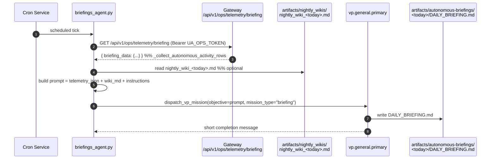
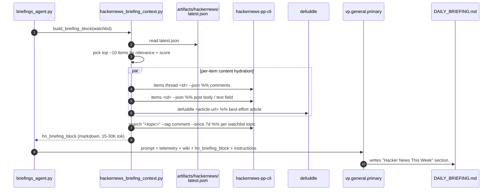
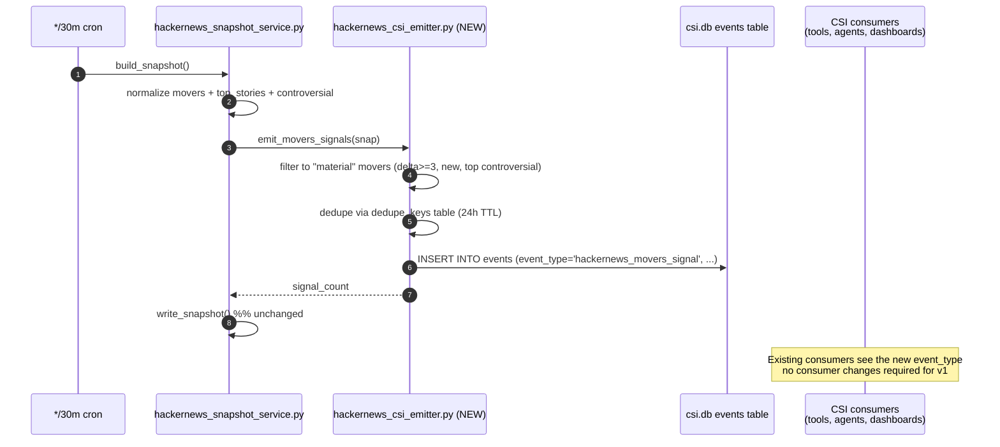

# Hacker News Phase 2 Implementation Plan

**Status:** Draft, awaiting `/grill-me` approval.
**Scope:** Two leveraged Phase 2 integrations from [`hackernews_phase1_plan.md` § 9](./hackernews_phase1_plan.md):

  1. **Pulse → Simone briefing context** — fold the weekly HN watchlist signal into the daily autonomous briefing.
  2. **Movers → CSI lane** — turn high-velocity HN front-page activity into CSI events that flow through the existing trend-report / opportunity-bundle plumbing.

**Explicitly out of scope for Phase 2:**

  - The 5 other Phase 2 catalog items (Daily LLM digest panel, `repost` gate, Hiring quarterly trend, LLM relevance filter, Topic auto-suggest).
  - FTS5 search (separate Phase 2 deliverable; the disabled "search coming in Phase 2" UI placeholder stays disabled).
  - Phase 1.5 hygiene work (`page.tsx` LOC split, `refresh_now` async-ification) — tracked separately in [`docs/operations/2026-05-09_ship_pollution_and_phase1_followups.md`](../operations/2026-05-09_ship_pollution_and_phase1_followups.md).

---

## 0. Why these two

Both align with the [LLM-Native Intelligence Design](../../CLAUDE.md#llm-native-intelligence-design) rule from CLAUDE.md:

> `raw records → durable knowledge blocks → bounded retrieval context → LLM synthesis → gated action candidates`

**Lane A (Pulse → briefing)** plugs into Simone's existing daily briefing prompt — same LLM, same VP runtime, same artifact path. We're adding one more bounded context block ("here's what HN was talking about this week"), not building a new reasoning surface. Pure prompt extension.

**Lane B (Movers → CSI)** plugs into CSI's existing event bus. CSI already routes `rss_trend_report` / `reddit_trend_report` / `threads_trend_report` events through dedup, trend-report aggregation, and opportunity-bundle synthesis. We're adding one more `event_type` to that bus, not building a new pipeline.

**Cost contrast:** Phase 2 catalog item "Daily LLM digest panel" requires a new LLM call, prompt, token budget tracking, and visible UI surface — but only feeds the HN tab itself. Lanes A and B reuse existing LLM/UI surfaces and feed the broader operator intelligence loop. Higher leverage per LOC.

---

## 1. Lane A — Pulse → Simone briefing context

> **Design decision (2026-05-09):** the originally-drafted "render the snapshot
> as a markdown table" approach was rejected after a discussion with the
> operator about signal quality. Title-level pulse counts feed the LLM
> aggregates and ask it to imagine the underlying evidence — the
> antipattern CLAUDE.md's LLM-Native rule explicitly warns against. The
> revised plan in §§ 1.2–1.7 below treats the briefing helper as a real
> evidence-gathering layer: HN comment threads (always free, often the
> highest-signal source), HN post bodies (free, hidden in the `text`
> field today), and article extracts via `defuddle` (graceful fallback
> on paywalls / 403s). The operator confirmed that ~10% paywalled items
> failing through to "article body unavailable" is acceptable — no
> headless-browser cookie passthrough this phase.

### 1.1 What the briefing pipeline looks like today



Code-verified anchors:
- Briefing entrypoint: [`src/universal_agent/scripts/briefings_agent.py`](../../src/universal_agent/scripts/briefings_agent.py) (95 LOC).
- Telemetry collector: [`gateway_server.py:26748` `ops_telemetry_briefing_get`](../../src/universal_agent/gateway_server.py#L26748) → `_collect_autonomous_activity_rows`.
- Prompt assembled at [`briefings_agent.py:56-78`](../../src/universal_agent/scripts/briefings_agent.py#L56) — single f-string with three sections (`telemetry_json`, `wiki_content`, `Instructions`).

### 1.2 What changes — content depth, not just titles

Once a day at briefing time, the helper:

1. Reads `artifacts/hackernews/latest.json` (already kept fresh by the */30m cron — no extra work in the snapshot path).
2. Picks ~10 candidate items: top 5 from `top_stories`, top 3 from `controversial`, plus up to 2 items from each watchlist topic's `pulses[topic].top_stories`. Deduplicates by story id.
3. For each candidate, **fetches actual content** (not just title):
   - Always: HN comment thread via `hackernews-pp-cli items thread <id>` — top ~10 comments by `points`. Free, never paywalled, often the highest-signal source.
   - Always: HN post `text` field via `hackernews-pp-cli items <id>` — captures Show HN / Ask HN body text we currently throw away.
   - Best-effort: article body via `defuddle <url>`. Graceful fallback to "article body unavailable (paywall / 403 / fetch error)" — the comments + post body still carry signal.
4. Adds a separate `Algolia mentions block` from `hackernews-pp-cli search "<topic>" --tag comment --since 7d` for each watchlist topic — top mentions of *your* topics across ALL HN comments this week, not just the front page.
5. Renders all of this as a structured markdown block ~15-30K tokens, injected into the briefing prompt.



### 1.3 File-by-file change

| File | Action | LOC |
|---|---|---|
| `src/universal_agent/scripts/briefings_agent.py` | MODIFY — call `build_briefing_block()` and inject into prompt | ~30 |
| `src/universal_agent/services/hackernews_briefing_context.py` | NEW — orchestrates fetching + formatting. Picks items, calls CLI for comments/post-text, calls `defuddle` for articles, runs per-topic Algolia comment search, renders markdown | ~450 |
| `src/universal_agent/services/hackernews_content_fetch.py` | NEW — narrow client wrappers around the CLI's `items thread`, `items get`, `search` commands. Pure I/O, mockable from tests | ~180 |
| `tests/unit/test_hackernews_content_fetch.py` | NEW — covers CLI subprocess wrapping, JSON parsing, timeout, error paths | ~140 |
| `tests/unit/test_hackernews_briefing_context.py` | NEW — covers: empty snapshot, fully populated, comments-only fallback when defuddle fails, paywall fallback, Algolia search merge, watchlist matching | ~220 |
| **Total** | | **~1,020 LOC** (~660 product + ~360 test) |

The original draft estimated ~250 LOC for a pure formatter. The real fetcher is ~4× larger — almost entirely because of robust error handling on the network paths (defuddle timeouts, 403s, paywalls, JSON parse failures, partial CLI output) and the per-topic Algolia search aggregation.

### 1.4 The HN block format (revised)

The block has FOUR sections instead of one. Each is a chunk of evidence the briefing LLM can cite. Token estimates assume ~10 candidate items + 6 watchlist topics:

```markdown
## Hacker News This Week (snapshot from <generated_at>)

### 1. Watchlist pulse — 7-day mention volume

| topic    | mentions | avg pts | top hit |
|----------|---------:|--------:|---------|
| claude   |      231 |     348 | "Higher usage limits for Claude and a compute deal with SpaceX" (507 pts) |
| agent    |      188 |     212 | "Building a coding agent in 1000 LOC" (310 pts) |
| ...

### 2. Front-page stories with content (top 5 by score, +3 controversial, +2 watchlist-matched)

#### Internet Archive Switzerland
- 213 pts · 24 cmt · `internetarchive.ch` · by hggh
- Article: https://internetarchive.ch/  ·  HN: https://news.ycombinator.com/item?id=48074265
- **Article excerpt** (defuddle, ~250 words):
  > Internet Archive Switzerland (IAS) is a non-profit foundation based in
  > St. Gallen dedicated to preserving Swiss digital heritage. We are
  > facing constant changes in file formats, sudden failure of storage
  > media... [truncated to 250 words]
- **Top comments** (3 of 24, by points):
  > **timr** (52 pts): "The Swiss are uniquely positioned for this — long political stability + neutrality + strong privacy laws make them a natural archival jurisdiction."
  > **knubie** (38 pts): "Worth noting they're partnered with Stanford and Internet Archive proper for the technical infra; this isn't a from-scratch effort."
  > **shadowgovt** (24 pts): "I'd like to see how they handle the requirement to keep storage media physically maintained over multi-decade timescales..."

#### [next item...]

### 3. Show HN / Ask HN highlights (top 2 each)

#### Show HN: Free hotspot/polygon-region tool for game development
- 6 pts · 2 cmt · `magikmaker.dev` · by magikMaker
- **Post body** (from `text` field): "For a game I'm developing I needed an easy way to create hotspot regions on textures. Existing tools were either commercial or required a heavy editor install, so I built this..."
- **Comments**: [...]

### 4. Watchlist mentions across ALL HN comments this week (top 5 per topic, via Algolia)

#### claude (231 hits this week)
- "I switched our codegen pipeline to Claude 4.6 and saw a 30% reduction in tool-call retries..." (in thread: "Building agentic systems that don't suck", 412 pts) — 7d ago
- "Claude's projects feature is finally usable for codebases >100 files now that..." (in thread: "Anthropic ships project memory", 290 pts) — 4d ago
- ...

#### agent (188 hits this week)
- "We've been running multi-agent systems in prod for 8 months and the failure modes are..." (in thread: "Multi-agent traps to avoid", 521 pts) — 5d ago
- ...

_(panels with errors this run, if any: pulse_codex)_
```

### 1.5 The prompt change

Inserted after the wiki section, at [`briefings_agent.py:67-69`](../../src/universal_agent/scripts/briefings_agent.py#L67):

```python
from universal_agent.services.hackernews_briefing_context import build_briefing_block

# Build the HN evidence block (~15-30K tokens). Returns "" on failure.
hn_block = build_briefing_block(watchlist=["claude", "agent", "codex", "llm", "harness", "agentic"])

objective = f"""Generate the daily autonomous operations briefing for the last 24 hours.
...

Here is the raw telemetry data:
```json
{telemetry_json}
```

Here is the external Nightly Wiki Proactive Generation output (if any):
```markdown
{wiki_content}
```

{hn_block}                          # ← NEW; blank-string when N/A so format stays clean

Instructions:
- Summarize tasks completed, attempted, and failed.
- ... (existing bullets unchanged) ...
- If the Hacker News block above is non-empty, include a "Hacker News This Week"
  section. **Read the actual content (article excerpts, comments, post bodies)** —
  do NOT just paraphrase titles. Surface 1-3 items where the *substance* aligns
  with active work or open questions. Quote a comment or excerpt where it
  illuminates "why this matters." If a topic surged in mentions vs the
  baseline (compare to historical pulse counts in prior briefings if you
  have them), call that out separately. If nothing in the HN block lands
  on relevant ground, say so in one line and move on — do not pad.
"""
```

### 1.6 The fetcher

`hackernews_briefing_context.py` is no longer "pure" — it makes ~30 subprocess calls (CLI items + threads + searches) and ~10 HTTP calls (defuddle on article URLs). Skeleton:

```python
"""Build the HN evidence block for the daily briefing.

This is the LANE A consumer of the snapshot. It does real fetching at
briefing-time (once daily) so the briefing LLM gets actual article
excerpts, comment threads, and HN post bodies — not just titles. The
half-hourly snapshot (services/hackernews_snapshot_service.py) stays
cheap and content-free; this module is where the evidence is assembled.

Failure-tolerant: any single fetch can fail without aborting the block.
Article fetches in particular are best-effort — paywalls, 403s, and
fetch timeouts gracefully degrade to "article body unavailable" and
the rest of the item (comments, post body) still renders.
"""
from __future__ import annotations

import logging
from concurrent.futures import ThreadPoolExecutor
from datetime import datetime, timezone
from typing import Any

from universal_agent.services.hackernews_snapshot_service import read_latest
from universal_agent.services.hackernews_content_fetch import (
    fetch_item,
    fetch_thread_comments,
    search_topic_mentions,
    fetch_article_via_defuddle,
)

logger = logging.getLogger(__name__)

MAX_AGE_HOURS = 24
CANDIDATE_TOP_STORIES = 5
CANDIDATE_CONTROVERSIAL = 3
CANDIDATE_PER_TOPIC = 2
MAX_COMMENTS_PER_ITEM = 10
MAX_ARTICLE_EXCERPT_WORDS = 250
MAX_TOPIC_MENTIONS = 5
DEFUDDLE_TIMEOUT_S = 10
HYDRATE_PARALLELISM = 6


def build_briefing_block(watchlist: list[str], now: datetime | None = None) -> str:
    """Return a multi-section markdown block (~15-30K tokens) or "" on failure."""
    snap = read_latest()
    if not _is_fresh(snap, now=now):
        return ""

    candidates = _select_candidates(snap, watchlist)
    if not candidates:
        return ""

    with ThreadPoolExecutor(max_workers=HYDRATE_PARALLELISM) as pool:
        hydrated = list(pool.map(_hydrate_one, candidates))

    topic_mentions = _gather_topic_mentions(watchlist)

    return _render(snap, hydrated, topic_mentions)


def _hydrate_one(candidate: dict[str, Any]) -> dict[str, Any]:
    """Fetch comments + post text + article excerpt for a single candidate. Best-effort."""
    out: dict[str, Any] = {**candidate}
    out["comments"] = _safe(lambda: fetch_thread_comments(candidate["id"], limit=MAX_COMMENTS_PER_ITEM)) or []
    out["post_text"] = _safe(lambda: fetch_item(candidate["id"]).get("text") or "") or ""
    if candidate.get("url"):
        out["article_excerpt"] = _safe(
            lambda: fetch_article_via_defuddle(candidate["url"], timeout_s=DEFUDDLE_TIMEOUT_S)
        )
    out["article_excerpt"] = (out.get("article_excerpt") or "").strip()
    return out


def _safe(fn):
    try:
        return fn()
    except Exception as exc:
        logger.warning("HN briefing fetch failed: %s", exc)
        return None


# ... _select_candidates, _gather_topic_mentions, _render, _is_fresh ...
```

### 1.7 Failure modes

| Mode | Behavior |
|---|---|
| `latest.json` missing or stale (>24h) | block = `""`, briefing proceeds unchanged |
| Snapshot present but no panels populated | block = `""`, briefing proceeds unchanged |
| Single defuddle fetch fails (paywall / 403 / timeout) | item still renders with comments + post body; "article body unavailable" marker |
| All defuddle fetches fail (defuddle service down) | items render with comments + post body only; no article excerpts anywhere — block is still useful |
| Single CLI subprocess call hangs | per-call timeout (15s); item degrades to whatever did succeed |
| All CLI calls fail | block = `""`, briefing proceeds unchanged (CLI is essential to ALL content paths) |
| Algolia topic search fails for some topics | partial — successful topic blocks render, failed topics omitted with a footnote |
| HTTP runaway (e.g., defuddle stuck on a redirect loop) | per-fetch timeout 10s, total budget 60s on the fetch phase |
| Token-budget overrun (briefing prompt > 100K tok) | helper truncates oldest content first (article excerpts → trimmed → comments → trimmed → topic mentions trimmed); never grows the prompt unboundedly |

The invariant is unchanged: **the HN block must never block or corrupt the briefing.** New invariant: **the briefing block must never grow unbounded** — there's a hard 30K-token cap on the rendered block, with a deterministic truncation order.

---

## 2. Lane B — Movers → CSI lane

### 2.1 What CSI looks like today

```mermaid
flowchart LR
    subgraph Producers
      RSS[RSS Trend Report Producer<br/>CSI_Ingester scripts] -->|emits| EV
      RDT[Reddit Trend Report Producer] -->|emits| EV
      THR[Threads Trend Producer] -->|emits| EV
    end

    EV[(events table<br/>/var/lib/universal-agent/csi/csi.db)]

    subgraph Consumers
      EV -->|csi_recent_reports tool| Agents[csi-trend-analyst<br/>factory-supervisor<br/>csi-supervisor]
      EV -->|opportunity bundling| OB[opportunity_bundle_ready events]
      EV -->|dashboard surfaces| UI[/dashboard/csi]
    end
```

Code-verified anchors:
- DB path: [`tools/csi_bridge.py:20`](../../src/universal_agent/tools/csi_bridge.py#L20) `_DEFAULT_CSI_DB_PATH = "/var/lib/universal-agent/csi/csi.db"`.
- Schema: `events(event_id, dedupe_key, source, event_type, occurred_at, subject_json, routing_json, metadata_json, ...)` — see [`CSI_Ingester/documentation/03_PRD_CSI_Ingester_v1_2026-02-22.md:335`](../../CSI_Ingester/documentation/03_PRD_CSI_Ingester_v1_2026-02-22.md#L335).
- Existing event types consumed: [`tools/csi_bridge.py:256-265`](../../src/universal_agent/tools/csi_bridge.py#L256) — `rss_trend_report`, `reddit_trend_report`, `threads_trend_report`, `report_product_ready`, `opportunity_bundle_ready`, `global_trend_brief_ready`, `csi_global_brief_review_due`, `rss_insight_daily`, `rss_insight_emerging`.

### 2.2 What changes

Add **one** new `event_type`: `hackernews_movers_signal`. The HN snapshot service already runs every 30 minutes and already computes movers (`since` diff between consecutive front-page snapshots). We attach a thin emitter to the back of `build_snapshot()` that:

1. Inspects the normalized `movers` block.
2. For each story that materially moved (climbed ≥3 ranks, debuted as `new`, or scored a high-controversy ratio), emits one CSI event with the story metadata.
3. Dedupes by `(story_id, day-bucket)` so we don't re-emit the same story every 30 minutes.

The events flow into the CSI events table just like RSS/Reddit/Threads events do, and the existing CSI consumer surfaces (the `csi_recent_reports` tool, the `csi-trend-analyst` agent, the `/dashboard/csi` tab) pick them up automatically.



### 2.3 File-by-file change

| File | Action | LOC |
|---|---|---|
| `src/universal_agent/services/hackernews_csi_emitter.py` | NEW — `emit_movers_signals(snap)` writes events to csi.db with dedup. Pure SQLite, no network | ~140 |
| `src/universal_agent/services/hackernews_snapshot_service.py` | MODIFY — call `emit_movers_signals(snapshot)` at end of `build_snapshot()` (best-effort; failure logs but does not abort the snapshot) | +8 |
| `src/universal_agent/tools/csi_bridge.py` | MODIFY — add `hackernews_movers_signal` to the `event_type IN (...)` whitelist at [csi_bridge.py:256](../../src/universal_agent/tools/csi_bridge.py#L256) | +1 |
| `tests/unit/test_hackernews_csi_emitter.py` | NEW — covers: dedup, materiality threshold, schema correctness, missing DB | ~180 |
| `docs/integrations/hackernews_phase2_plan.md` | NEW — this doc | ~600 |
| **Total** | | **~330 LOC product + test, ~600 docs** |

### 2.4 Materiality filter

We don't want to emit a CSI event for every minor rank shuffle — that floods the bus and erodes operator attention. The filter:

```python
def _is_material(change: dict[str, Any]) -> bool:
    """Decide whether a movers entry is worth a CSI event."""
    status = (change.get("status") or "").lower()
    delta = abs(int(change.get("delta") or 0))
    score = int(change.get("score") or 0)

    # 1. Brand-new debut on the front page — always interesting.
    if status == "new":
        return True

    # 2. Big climb (≥3 ranks). Falls below the noise floor at 1-2.
    if status == "moved" and delta >= 3:
        return True

    # 3. Drops aren't usually worth waking CSI for, EXCEPT if score was
    #    high — sudden de-listing of a high-scoring story can signal flag/quarantine.
    if status == "dropped" and score >= 200:
        return True

    return False
```

Plus a controversy promoter — the top-3 entries from `snapshot["controversial"]` get one event each per day (not per tick) regardless of whether they're in `movers`. They embody a different signal class: "the operators are arguing about this," which is exactly the kind of thing CSI's downstream brief-aggregation finds interesting.

### 2.5 Dedup strategy

The CSI events table already has a `dedupe_keys(key, expires_at)` companion table per the PRD. We compute:

```python
dedupe_key = f"hn:{story_id}:{utc_date_yyyy_mm_dd}"
```

…and use the same `INSERT OR IGNORE` + `dedupe_keys` upsert pattern the ingester uses elsewhere. TTL = 24 hours, so the same story can re-emit on a later day if it stays interesting.

### 2.6 Event payload shape

```json
{
  "event_id": "hn:48074265:20260509T184500Z",
  "dedupe_key": "hn:48074265:2026-05-09",
  "source": "hackernews",
  "event_type": "hackernews_movers_signal",
  "occurred_at": "2026-05-09T18:45:10Z",
  "subject_json": {
    "story_id": 48074265,
    "title": "Internet Archive Switzerland",
    "url": "https://internetarchive.ch/",
    "host": "internetarchive.ch",
    "by": "hggh",
    "score": 213,
    "descendants": 24,
    "rank": 1,
    "movement": {"status": "new", "delta": 0, "ratio_cmt_pts": null},
    "comment_url": "https://news.ycombinator.com/item?id=48074265",
    "topic_match": ["agent"]
  },
  "routing_json": {"lane": "hackernews", "category": "movers"},
  "metadata_json": {"snapshot_generated_at": "2026-05-09T18:45:10Z"}
}
```

`topic_match` is computed by case-insensitive substring match of the story title against the configured watchlist topics from `config/hackernews_watchlist.yaml`. This is what makes the CSI signal queryable later — "show me HN movers that matched any agent/llm/codex topic" becomes a one-line query against `subject_json`.

### 2.7 Failure modes

| Mode | Behavior |
|---|---|
| `csi.db` missing | `_log("CSI DB not available; skipping HN signal emission")`, snapshot still writes |
| `csi.db` schema-incompatible | log + skip; snapshot still writes |
| Single event INSERT fails | log + skip that one event; other events keep going |
| Snapshot has zero material movers | normal — emit nothing |
| Concurrent writer holding the DB | SQLite WAL handles this; we use a 5s `busy_timeout` |

The invariant is the same as Lane A: **CSI emission must never block the snapshot.** A best-effort try/except wraps the whole emitter call in `build_snapshot()`.

---

## 3. Phased rollout

| Phase | Scope | Ship gate |
|---|---|---|
| **P2.A1** | `hackernews_content_fetch.py` (CLI wrappers) + tests | All tests green; no live behavior change |
| **P2.A2** | `hackernews_briefing_context.py` orchestration + tests (with mocked fetcher) | All tests green; helper builds a valid block from fixture data |
| **P2.A3** | Wire helper into `briefings_agent.py`. One real briefing run end-to-end | Manual smoke: today's `DAILY_BRIEFING.md` contains a "Hacker News This Week" section that quotes a comment or article excerpt, not just titles |
| **P2.B1** | Lane B emitter + unit tests (no snapshot wiring yet) | All tests green; no live behavior change |
| **P2.B2** | Wire emitter into `build_snapshot()` (best-effort) | One real `*/30m` cron tick produces a CSI event when material movers exist; `csi_recent_reports` tool surfaces it |
| **P2.B3** | Add `hackernews_movers_signal` to consumer whitelist in `csi_bridge.py` | `csi_recent_reports` returns HN events to the `csi-trend-analyst` agent |

Each phase is an independent commit. P2.A1→A2→A3 must ship in order (A2 depends on A1, A3 depends on A2). P2.B1→B2→B3 likewise. Lanes A and B are independent of each other.

---

## 4. Risks / unknowns

1. **CSI event-type proliferation.** Adding new types is cheap, but every consumer that filters by type needs to know about the new one. We're modifying exactly one consumer ([`csi_bridge.py:256`](../../src/universal_agent/tools/csi_bridge.py#L256)) — others (factory-supervisor, csi-trend-analyst) consume events through that bridge and don't need to know the underlying type list. Verified before writing this plan.
2. **Briefing prompt token budget.** Revised block is ~15-30K tokens vs ~1K in the original draft — ~25× larger. Briefing dispatches to `vp.general.primary` (Anthropic Max), so the absolute number is fine. The risk is content bloat over time (more topics added, more candidates picked) silently growing the prompt past ~50K. Mitigation: hard 30K-token cap with deterministic truncation order (article excerpts trim first, then comments, then topic mentions).
3. **Defuddle / external-fetch reliability.** HN front-page links go to arbitrary domains. ~10% will paywall or 403 — we accept "article body unavailable" with comments+post-body fallback (operator-confirmed 2026-05-09). New risk: if defuddle as a service is intermittent, we may see all article excerpts vanish for a day. The block degrades gracefully but the briefing's HN section becomes title+comments only — still useful, but a quiet capability-loss the operator should notice if it persists.
4. **CLI subprocess fan-out.** P2.A makes ~30 CLI subprocess calls in one briefing pass (10 candidates × 3 calls + ~6 topic searches). Each is ~100-500ms. Parallelized at `HYDRATE_PARALLELISM=6`, total briefing-helper wall time ~30-60s. If any single call hangs, the per-call timeout (15s) bounds the damage. Worth observing the first few briefings for tail-latency outliers.
5. **Materiality threshold tuning.** The `delta >= 3` threshold for Lane B is a guess. After the first week of live signal, we'll have data to tune it (false-positive rate vs missed-signal rate). Documented as a follow-up, not blocking.
6. **`topic_match` substring matching is naive.** Will produce false positives ("agent" matches "real estate agent" stories) in both Lane A's candidate selection and Lane B's event-tagging. For Phase 2 we accept this; Phase 3 could swap to embeddings. Downstream LLM consumers (briefing LLM, CSI synthesis) can usually tell the difference because they have full content.
7. **DB write contention.** csi.db sees writes from CSI_Ingester adapters and (with this change) from the HN snapshot cron. SQLite WAL + `busy_timeout=5000ms` handles this, but worth observing the first few ticks for `database is locked` errors. Falls back to skip-and-log.

---

## 5. Test plan

### Lane A unit tests (`hackernews_briefing_context` + `hackernews_content_fetch`)

Block-builder behavior:
- `test_block_returns_empty_when_no_snapshot`
- `test_block_returns_empty_when_snapshot_stale_25h_old`
- `test_block_returns_full_block_when_fresh_and_fetcher_succeeds`
- `test_block_renders_when_defuddle_fails_for_one_item` — comments+post body still render; "article body unavailable" marker
- `test_block_renders_when_defuddle_fails_for_all_items` — items render comments-only
- `test_block_renders_when_one_topic_search_fails` — other topics render; failed topic listed in caveat
- `test_block_renders_when_one_thread_fetch_hangs` — that item renders with whatever did succeed
- `test_block_returns_empty_when_all_cli_calls_fail` — CLI down = no content = no block
- `test_block_truncates_article_excerpts_to_word_cap`
- `test_block_truncates_when_total_exceeds_30k_tokens`
- `test_candidate_selection_dedupes_across_top_stories_and_pulse_top`
- `test_candidate_selection_respects_per_topic_cap`

Content fetcher (subprocess wrapping):
- `test_fetch_thread_comments_returns_top_n_by_points`
- `test_fetch_thread_comments_returns_empty_on_cli_failure`
- `test_fetch_thread_comments_respects_timeout`
- `test_fetch_item_extracts_text_field`
- `test_fetch_item_returns_empty_text_for_link_posts`
- `test_search_topic_mentions_returns_compact_results`
- `test_search_topic_mentions_uses_tag_comment_filter`
- `test_fetch_article_via_defuddle_returns_excerpt_or_empty`
- `test_fetch_article_via_defuddle_handles_paywall_html_as_empty`

### Lane B unit tests

- `test_emit_movers_skips_when_csi_db_missing`
- `test_emit_movers_dedupes_same_story_within_24h`
- `test_emit_movers_re_emits_on_next_day`
- `test_emit_movers_filters_low_delta_moves`
- `test_emit_movers_includes_new_status_always`
- `test_emit_movers_includes_high_score_drops`
- `test_emit_movers_writes_correct_subject_json_shape`
- `test_emit_movers_continues_on_single_insert_failure`

### End-to-end smoke (manual, post-deploy)

1. Wait for next `*/30m` snapshot tick.
2. `sqlite3 /var/lib/universal-agent/csi/csi.db "SELECT event_type, occurred_at, json_extract(subject_json, '$.title') FROM events WHERE event_type='hackernews_movers_signal' ORDER BY occurred_at DESC LIMIT 10;"` → expect ≥1 row when there are real front-page movers.
3. `mcp__internal__csi_recent_reports` → expect HN events in the response.
4. Run the briefing manually (`uv run python -m universal_agent.scripts.briefings_agent`).
5. Read `artifacts/autonomous-briefings/<today>/DAILY_BRIEFING.md` → expect a "Hacker News This Week" section when watchlist activity exists.

---

## 6. Documentation maintenance

Per [`CLAUDE.md` § Documentation Maintenance Rules](../../CLAUDE.md#documentation-maintenance-rules) and § Dynamic Documentation Maintenance, this plan + the implementation must update:

- `docs/README.md` — add link to this Phase 2 plan in the integrations group.
- `docs/Documentation_Status.md` — add an entry for `hackernews_phase2_plan.md` with the same one-paragraph description style as the Phase 1 plan.
- `docs/integrations/hackernews_phase1_plan.md § 9` — link to this Phase 2 plan from the catalog table; mark Pulse→briefing and Movers→CSI rows as "Phase 2 (in progress / shipped)".
- `CLAUDE.md` "Pre-Implementation Reading" matrix — if the implementation introduces new public functions worth listing, add a row.

---

## 7. Sign-off (pending)

This plan is ready for `/grill-me` interview. After approval, hand off to the `code-writer` sub-agent or implement directly via Claude Code conversational on `feature/latest2`.

Estimated total: **~1,350 LOC** across product + test (Lane A ~1,020 + Lane B ~330), plus ~700 LOC docs. Lane A grew from ~250 to ~1,020 after the 2026-05-09 design discussion: a real fetcher (CLI wrappers + defuddle + Algolia comment search + truncation logic + parallelism + comprehensive failure handling) is ~4× the original "pure markdown formatter" estimate, but it's the difference between feeding the briefing LLM real evidence vs. asking it to guess from titles.
