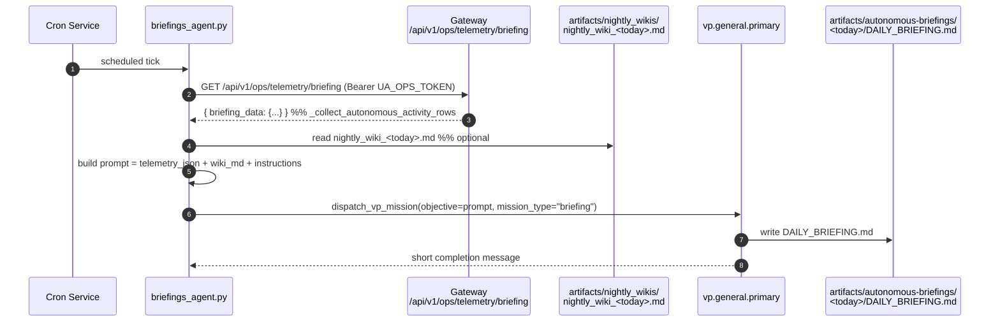
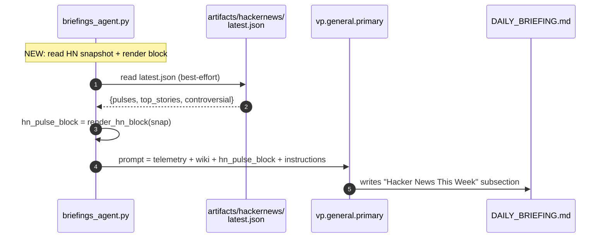
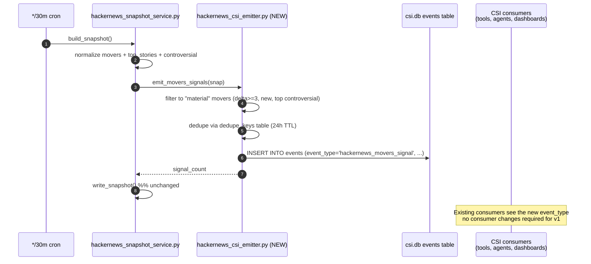

# Hacker News Phase 2 Implementation Plan

**Status:** Draft, awaiting `/grill-me` approval.
**Scope:** Two leveraged Phase 2 integrations from [`hackernews_phase1_plan.md` § 9](./hackernews_phase1_plan.md):

  1. **Pulse → Simone briefing context** — fold the weekly HN watchlist signal into the daily autonomous briefing.
  2. **Movers → CSI lane** — turn high-velocity HN front-page activity into CSI events that flow through the existing trend-report / opportunity-bundle plumbing.

**Explicitly out of scope for Phase 2:**

  - The 5 other Phase 2 catalog items (Daily LLM digest panel, `repost` gate, Hiring quarterly trend, LLM relevance filter, Topic auto-suggest).
  - FTS5 search (separate Phase 2 deliverable; the disabled "search coming in Phase 2" UI placeholder stays disabled).
  - Phase 1.5 hygiene work (`page.tsx` LOC split, `refresh_now` async-ification) — tracked separately in [`docs/operations/2026-05-09_ship_pollution_and_phase1_followups.md`](../operations/2026-05-09_ship_pollution_and_phase1_followups.md).

---

## 0. Why these two

Both align with the [LLM-Native Intelligence Design](../../CLAUDE.md#llm-native-intelligence-design) rule from CLAUDE.md:

> `raw records → durable knowledge blocks → bounded retrieval context → LLM synthesis → gated action candidates`

**Lane A (Pulse → briefing)** plugs into Simone's existing daily briefing prompt — same LLM, same VP runtime, same artifact path. We're adding one more bounded context block ("here's what HN was talking about this week"), not building a new reasoning surface. Pure prompt extension.

**Lane B (Movers → CSI)** plugs into CSI's existing event bus. CSI already routes `rss_trend_report` / `reddit_trend_report` / `threads_trend_report` events through dedup, trend-report aggregation, and opportunity-bundle synthesis. We're adding one more `event_type` to that bus, not building a new pipeline.

**Cost contrast:** Phase 2 catalog item "Daily LLM digest panel" requires a new LLM call, prompt, token budget tracking, and visible UI surface — but only feeds the HN tab itself. Lanes A and B reuse existing LLM/UI surfaces and feed the broader operator intelligence loop. Higher leverage per LOC.

---

## 1. Lane A — Pulse → Simone briefing context

### 1.1 What the briefing pipeline looks like today



Code-verified anchors:
- Briefing entrypoint: [`src/universal_agent/scripts/briefings_agent.py`](../../src/universal_agent/scripts/briefings_agent.py) (95 LOC).
- Telemetry collector: [`gateway_server.py:26748` `ops_telemetry_briefing_get`](../../src/universal_agent/gateway_server.py#L26748) → `_collect_autonomous_activity_rows`.
- Prompt assembled at [`briefings_agent.py:56-78`](../../src/universal_agent/scripts/briefings_agent.py#L56) — single f-string with three sections (`telemetry_json`, `wiki_content`, `Instructions`).

### 1.2 What changes

Add a fourth section to the prompt: `hn_pulse_block`. It's a deterministic markdown snippet rendered from `artifacts/hackernews/latest.json` covering the watchlist topics + top-of-front-page stories. The LLM in the VP mission already knows how to synthesize "did anything important on HN this week align with my work" from that context — no prompt-engineering acrobatics needed, just provide the evidence.



### 1.3 File-by-file change

| File | Action | LOC |
|---|---|---|
| `src/universal_agent/scripts/briefings_agent.py` | MODIFY — add `_render_hn_pulse_block(snap)` helper + read snapshot + add prompt section | ~50 |
| `src/universal_agent/services/hackernews_briefing_context.py` | NEW — pure helper: read latest.json, format markdown block. Isolating it lets us unit-test without touching briefings_agent | ~80 |
| `tests/unit/test_hackernews_briefing_context.py` | NEW — covers: missing snapshot, stale snapshot, populated snapshot, errored panels | ~120 |
| **Total** | | **~250 LOC** (~130 product + ~120 test) |

### 1.4 The HN block format

Deterministic markdown the LLM ingests as evidence. No LLM call here — pure code rendering of the snapshot:

```markdown
## Hacker News This Week (snapshot from <generated_at>)

**Watchlist pulse** — counts are 7-day mention totals across HN posts and comments:

| topic    | mentions | avg points |
|----------|---------:|-----------:|
| claude   |      231 |        348 |
| agent    |      188 |        212 |
| codex    |       97 |        145 |
| ...

**Top front-page stories right now (top 5):**

1. **Internet Archive Switzerland** — 213 pts · 24 cmt · `internetarchive.ch` — https://news.ycombinator.com/item?id=48074265
2. **PipeDream on the Acorn Archimedes** — 187 pts · 32 cmt · `pipedream.com` — ...
...

**Most-controversial (last 7d, ≥100 cmt, top 3):**

1. **Inventing Cyrillic** — ratio 2.23× — 105 cmt / 47 pts — https://...
...
```

Caps: 5 top stories, 3 controversial. Skipped silently when the snapshot is missing or older than 24 hours (the briefing is daily; stale HN data is worse than no HN data). Errored panels in `meta.errors[]` are listed as a one-line caveat instead of dropped silently.

### 1.5 The prompt change

Inserted after the wiki section, before instructions, at [`briefings_agent.py:67-69`](../../src/universal_agent/scripts/briefings_agent.py#L67):

```python
# NEW: HN context block
from universal_agent.services.hackernews_briefing_context import render_hn_pulse_block

hn_block = render_hn_pulse_block()  # returns "" when snapshot missing/stale

# UPDATED prompt — adds one section, leaves the rest verbatim
objective = f"""Generate the daily autonomous operations briefing for the last 24 hours.
...

Here is the raw telemetry data:
```json
{telemetry_json}
```

Here is the external Nightly Wiki Proactive Generation output (if any):
```markdown
{wiki_content}
```

{hn_block}                          # ← NEW; blank-string when N/A so format stays clean

Instructions:
- Summarize tasks completed, attempted, and failed.
- ... (existing bullets unchanged) ...
- If the Hacker News block above is non-empty, include a "Hacker News This Week"
  section that calls out 1-3 stories most relevant to ongoing work,
  surfaces any topic whose mention count surged this week vs typical
  baseline, and skips noise. If none of it lands on relevant ground,
  say so in one line and move on. Do NOT just paraphrase the table.
"""
```

The "if not relevant, say so in one line and move on" guard is important: the briefing's job is to synthesize signal, not to pad itself with unrelated tech-news. The LLM-Native rule from CLAUDE.md explicitly says to let the LLM judge.

### 1.6 The pure helper

```python
# src/universal_agent/services/hackernews_briefing_context.py
"""Render the HN snapshot into a deterministic markdown block for briefings.

No LLM calls — purely formats the existing latest.json snapshot. Used by
briefings_agent.py to fold HN context into the daily VP briefing prompt
without coupling the briefing pipeline to the snapshot service.
"""
from __future__ import annotations

from datetime import datetime, timezone
from typing import Any

from universal_agent.services.hackernews_snapshot_service import read_latest

MAX_AGE_HOURS = 24
TOP_STORY_COUNT = 5
CONTROVERSIAL_COUNT = 3


def render_hn_pulse_block(now: datetime | None = None) -> str:
    """Returns a markdown block of HN watchlist pulse + top stories, or ""
    when the snapshot is missing, stale, or empty."""
    snap = read_latest()
    if not snap or not isinstance(snap, dict):
        return ""

    generated_at = snap.get("meta", {}).get("generated_at", "")
    if not _is_fresh(generated_at, now=now):
        return ""

    parts = [f"## Hacker News This Week (snapshot from {generated_at})"]
    parts.append(_render_pulse_table(snap.get("pulses", {})))
    parts.append(_render_top_stories(snap.get("top_stories") or []))
    parts.append(_render_controversial(snap.get("controversial") or []))

    errored = snap.get("meta", {}).get("errors") or []
    if errored:
        parts.append(f"_(panels with errors this run: {', '.join(errored)})_")

    return "\n\n".join(p for p in parts if p)


def _is_fresh(iso_ts: str, now: datetime | None = None) -> bool:
    if not iso_ts:
        return False
    try:
        ts = datetime.fromisoformat(iso_ts)
    except ValueError:
        return False
    if ts.tzinfo is None:
        ts = ts.replace(tzinfo=timezone.utc)
    age_h = ((now or datetime.now(timezone.utc)) - ts).total_seconds() / 3600
    return age_h <= MAX_AGE_HOURS


# ... _render_pulse_table, _render_top_stories, _render_controversial ...
```

### 1.7 Failure modes

| Mode | Behavior |
|---|---|
| `latest.json` missing | block = `""`, briefing proceeds unchanged |
| Snapshot older than 24h | block = `""`, briefing proceeds unchanged |
| Snapshot present but `meta.errors` non-empty | block renders what's available; appends caveat line |
| Snapshot has unexpected shape | helper catches and returns `""` (never blocks the briefing) |
| HN service down for the whole day | LLM produces briefing without HN section — same as today |

The invariant: **the HN block must never block or corrupt the briefing.** It's additive context, not a hard dependency. The briefing was working without it and continues to work without it on its bad days.

---

## 2. Lane B — Movers → CSI lane

### 2.1 What CSI looks like today

```mermaid
flowchart LR
    subgraph Producers
      RSS[RSS Trend Report Producer<br/>CSI_Ingester scripts] -->|emits| EV
      RDT[Reddit Trend Report Producer] -->|emits| EV
      THR[Threads Trend Producer] -->|emits| EV
    end

    EV[(events table<br/>/var/lib/universal-agent/csi/csi.db)]

    subgraph Consumers
      EV -->|csi_recent_reports tool| Agents[csi-trend-analyst<br/>factory-supervisor<br/>csi-supervisor]
      EV -->|opportunity bundling| OB[opportunity_bundle_ready events]
      EV -->|dashboard surfaces| UI[/dashboard/csi]
    end
```

Code-verified anchors:
- DB path: [`tools/csi_bridge.py:20`](../../src/universal_agent/tools/csi_bridge.py#L20) `_DEFAULT_CSI_DB_PATH = "/var/lib/universal-agent/csi/csi.db"`.
- Schema: `events(event_id, dedupe_key, source, event_type, occurred_at, subject_json, routing_json, metadata_json, ...)` — see [`CSI_Ingester/documentation/03_PRD_CSI_Ingester_v1_2026-02-22.md:335`](../../CSI_Ingester/documentation/03_PRD_CSI_Ingester_v1_2026-02-22.md#L335).
- Existing event types consumed: [`tools/csi_bridge.py:256-265`](../../src/universal_agent/tools/csi_bridge.py#L256) — `rss_trend_report`, `reddit_trend_report`, `threads_trend_report`, `report_product_ready`, `opportunity_bundle_ready`, `global_trend_brief_ready`, `csi_global_brief_review_due`, `rss_insight_daily`, `rss_insight_emerging`.

### 2.2 What changes

Add **one** new `event_type`: `hackernews_movers_signal`. The HN snapshot service already runs every 30 minutes and already computes movers (`since` diff between consecutive front-page snapshots). We attach a thin emitter to the back of `build_snapshot()` that:

1. Inspects the normalized `movers` block.
2. For each story that materially moved (climbed ≥3 ranks, debuted as `new`, or scored a high-controversy ratio), emits one CSI event with the story metadata.
3. Dedupes by `(story_id, day-bucket)` so we don't re-emit the same story every 30 minutes.

The events flow into the CSI events table just like RSS/Reddit/Threads events do, and the existing CSI consumer surfaces (the `csi_recent_reports` tool, the `csi-trend-analyst` agent, the `/dashboard/csi` tab) pick them up automatically.



### 2.3 File-by-file change

| File | Action | LOC |
|---|---|---|
| `src/universal_agent/services/hackernews_csi_emitter.py` | NEW — `emit_movers_signals(snap)` writes events to csi.db with dedup. Pure SQLite, no network | ~140 |
| `src/universal_agent/services/hackernews_snapshot_service.py` | MODIFY — call `emit_movers_signals(snapshot)` at end of `build_snapshot()` (best-effort; failure logs but does not abort the snapshot) | +8 |
| `src/universal_agent/tools/csi_bridge.py` | MODIFY — add `hackernews_movers_signal` to the `event_type IN (...)` whitelist at [csi_bridge.py:256](../../src/universal_agent/tools/csi_bridge.py#L256) | +1 |
| `tests/unit/test_hackernews_csi_emitter.py` | NEW — covers: dedup, materiality threshold, schema correctness, missing DB | ~180 |
| `docs/integrations/hackernews_phase2_plan.md` | NEW — this doc | ~600 |
| **Total** | | **~330 LOC product + test, ~600 docs** |

### 2.4 Materiality filter

We don't want to emit a CSI event for every minor rank shuffle — that floods the bus and erodes operator attention. The filter:

```python
def _is_material(change: dict[str, Any]) -> bool:
    """Decide whether a movers entry is worth a CSI event."""
    status = (change.get("status") or "").lower()
    delta = abs(int(change.get("delta") or 0))
    score = int(change.get("score") or 0)

    # 1. Brand-new debut on the front page — always interesting.
    if status == "new":
        return True

    # 2. Big climb (≥3 ranks). Falls below the noise floor at 1-2.
    if status == "moved" and delta >= 3:
        return True

    # 3. Drops aren't usually worth waking CSI for, EXCEPT if score was
    #    high — sudden de-listing of a high-scoring story can signal flag/quarantine.
    if status == "dropped" and score >= 200:
        return True

    return False
```

Plus a controversy promoter — the top-3 entries from `snapshot["controversial"]` get one event each per day (not per tick) regardless of whether they're in `movers`. They embody a different signal class: "the operators are arguing about this," which is exactly the kind of thing CSI's downstream brief-aggregation finds interesting.

### 2.5 Dedup strategy

The CSI events table already has a `dedupe_keys(key, expires_at)` companion table per the PRD. We compute:

```python
dedupe_key = f"hn:{story_id}:{utc_date_yyyy_mm_dd}"
```

…and use the same `INSERT OR IGNORE` + `dedupe_keys` upsert pattern the ingester uses elsewhere. TTL = 24 hours, so the same story can re-emit on a later day if it stays interesting.

### 2.6 Event payload shape

```json
{
  "event_id": "hn:48074265:20260509T184500Z",
  "dedupe_key": "hn:48074265:2026-05-09",
  "source": "hackernews",
  "event_type": "hackernews_movers_signal",
  "occurred_at": "2026-05-09T18:45:10Z",
  "subject_json": {
    "story_id": 48074265,
    "title": "Internet Archive Switzerland",
    "url": "https://internetarchive.ch/",
    "host": "internetarchive.ch",
    "by": "hggh",
    "score": 213,
    "descendants": 24,
    "rank": 1,
    "movement": {"status": "new", "delta": 0, "ratio_cmt_pts": null},
    "comment_url": "https://news.ycombinator.com/item?id=48074265",
    "topic_match": ["agent"]
  },
  "routing_json": {"lane": "hackernews", "category": "movers"},
  "metadata_json": {"snapshot_generated_at": "2026-05-09T18:45:10Z"}
}
```

`topic_match` is computed by case-insensitive substring match of the story title against the configured watchlist topics from `config/hackernews_watchlist.yaml`. This is what makes the CSI signal queryable later — "show me HN movers that matched any agent/llm/codex topic" becomes a one-line query against `subject_json`.

### 2.7 Failure modes

| Mode | Behavior |
|---|---|
| `csi.db` missing | `_log("CSI DB not available; skipping HN signal emission")`, snapshot still writes |
| `csi.db` schema-incompatible | log + skip; snapshot still writes |
| Single event INSERT fails | log + skip that one event; other events keep going |
| Snapshot has zero material movers | normal — emit nothing |
| Concurrent writer holding the DB | SQLite WAL handles this; we use a 5s `busy_timeout` |

The invariant is the same as Lane A: **CSI emission must never block the snapshot.** A best-effort try/except wraps the whole emitter call in `build_snapshot()`.

---

## 3. Phased rollout

| Phase | Scope | Ship gate |
|---|---|---|
| **P2.A1** | Lane A pure helper + unit tests (no briefings_agent change yet) | All tests green, no live behavior change |
| **P2.A2** | Wire helper into briefings_agent.py prompt | One real briefing run completes with HN block visible in output |
| **P2.B1** | Lane B emitter + unit tests (no snapshot wiring yet) | All tests green, no live behavior change |
| **P2.B2** | Wire emitter into `build_snapshot()` (best-effort) | One real `*/30m` cron tick produces a CSI event when movers exist; `csi_recent_reports` tool surfaces it |
| **P2.B3** | Add `hackernews_movers_signal` to consumer whitelist in `csi_bridge.py` | `csi_recent_reports` returns HN events to the `csi-trend-analyst` agent |

Each phase is an independent commit. P2.A and P2.B are independent — either can ship first or alone.

---

## 4. Risks / unknowns

1. **CSI event-type proliferation.** Adding new types is cheap, but every consumer that filters by type needs to know about the new one. We're modifying exactly one consumer ([`csi_bridge.py:256`](../../src/universal_agent/tools/csi_bridge.py#L256)) — others (factory-supervisor, csi-trend-analyst) consume events through that bridge and don't need to know the underlying type list. Verified before writing this plan.
2. **Briefing prompt token budget.** The HN block adds ~600-1200 tokens per day. The briefings_agent dispatches to `vp.general.primary` which runs on Anthropic Max. No budget concern.
3. **Materiality threshold tuning.** The `delta >= 3` threshold is a guess. After the first week of live signal, we'll have data to tune it (false-positive rate vs missed-signal rate). Documented as a follow-up, not blocking.
4. **`topic_match` substring matching is naive.** Will produce false positives ("agent" matches "real estate agent" stories). For Phase 2 we accept this; Phase 3 could swap to embeddings. The downstream LLM consumers in CSI synthesis can usually tell the difference.
5. **DB write contention.** csi.db sees writes from CSI_Ingester adapters and (with this change) from the HN snapshot cron. SQLite WAL + `busy_timeout=5000ms` handles this, but worth observing the first few ticks for `database is locked` errors. Falls back to skip-and-log.

---

## 5. Test plan

### Lane A unit tests

- `test_render_block_returns_empty_when_no_snapshot`
- `test_render_block_returns_empty_when_snapshot_stale_25h_old`
- `test_render_block_returns_full_block_when_fresh`
- `test_render_block_handles_partial_panel_errors`
- `test_render_block_handles_missing_pulses_safely`
- `test_render_block_handles_zero_top_stories`

### Lane B unit tests

- `test_emit_movers_skips_when_csi_db_missing`
- `test_emit_movers_dedupes_same_story_within_24h`
- `test_emit_movers_re_emits_on_next_day`
- `test_emit_movers_filters_low_delta_moves`
- `test_emit_movers_includes_new_status_always`
- `test_emit_movers_includes_high_score_drops`
- `test_emit_movers_writes_correct_subject_json_shape`
- `test_emit_movers_continues_on_single_insert_failure`

### End-to-end smoke (manual, post-deploy)

1. Wait for next `*/30m` snapshot tick.
2. `sqlite3 /var/lib/universal-agent/csi/csi.db "SELECT event_type, occurred_at, json_extract(subject_json, '$.title') FROM events WHERE event_type='hackernews_movers_signal' ORDER BY occurred_at DESC LIMIT 10;"` → expect ≥1 row when there are real front-page movers.
3. `mcp__internal__csi_recent_reports` → expect HN events in the response.
4. Run the briefing manually (`uv run python -m universal_agent.scripts.briefings_agent`).
5. Read `artifacts/autonomous-briefings/<today>/DAILY_BRIEFING.md` → expect a "Hacker News This Week" section when watchlist activity exists.

---

## 6. Documentation maintenance

Per [`CLAUDE.md` § Documentation Maintenance Rules](../../CLAUDE.md#documentation-maintenance-rules) and § Dynamic Documentation Maintenance, this plan + the implementation must update:

- `docs/README.md` — add link to this Phase 2 plan in the integrations group.
- `docs/Documentation_Status.md` — add an entry for `hackernews_phase2_plan.md` with the same one-paragraph description style as the Phase 1 plan.
- `docs/integrations/hackernews_phase1_plan.md § 9` — link to this Phase 2 plan from the catalog table; mark Pulse→briefing and Movers→CSI rows as "Phase 2 (in progress / shipped)".
- `CLAUDE.md` "Pre-Implementation Reading" matrix — if the implementation introduces new public functions worth listing, add a row.

---

## 7. Sign-off (pending)

This plan is ready for `/grill-me` interview. After approval, hand off to the `code-writer` sub-agent or implement directly via Claude Code conversational on `feature/latest2`.

Estimated total: ~580 LOC across product + test (Lane A 250 + Lane B 330), plus ~600 LOC docs.
