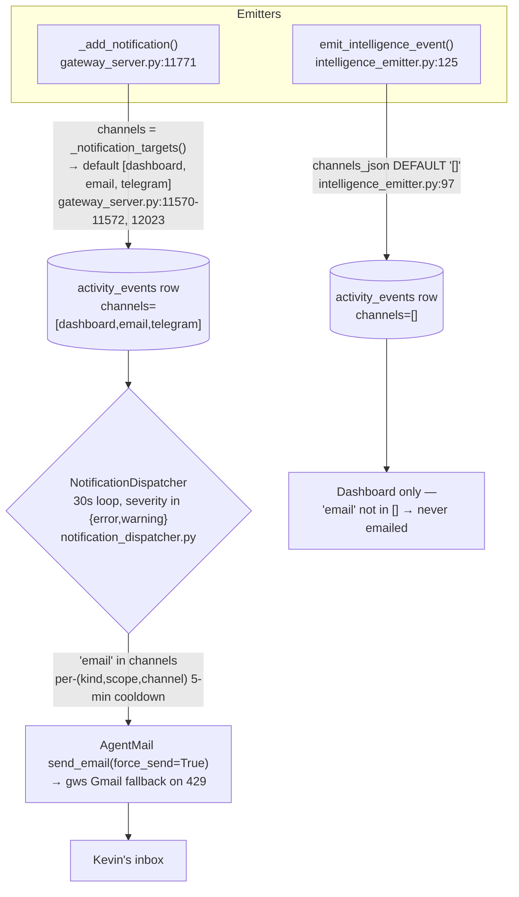

# AgentMail Residual Volume — Investigation Report

> **Status:** Investigation (decision-support). Not yet a spec.
> **Date:** 2026-05-28 (Houston / CT)
> **Scope:** Email-volume sources *outside* the shipped insight-pipeline consolidation (PRs #529–#535). Those are settled and out of scope here.
> **Production HEAD at investigation:** `e6ab0ae7` (insight PRs #531–#535 deployed ~13:00 CT / 18:00 UTC on 2026-05-28).

---

## 1. Executive Summary

**Email volume has already collapsed.** The insight-pipeline consolidation worked: the `vp.agents@agentmail.to` inbox went from **33 → 1** sent thread, and `oddcity216@agentmail.to` (Simone) from **~36 → 6** sent threads. Steady-state operational-alert email is now near-zero.

**The one real residual email-volume risk is incident-driven fan-out**, not steady-state noise. In the trailing ~37h, the notification dispatcher emailed exactly the alerts from a *single* 4-hour incident window (2026-05-28 00:00–03:53 UTC) and **zero** alerts in the ~13h since. That incident produced ~14 emails because the dispatcher's de-dup key is *per-event-scope*, so a mass-simultaneous failure (many distinct scopes of the same alert kind firing at a cron boundary) defeats coalescing exactly when you most want it.

**Recommended single most-impactful change:** add a **per-kind rollup window** to `NotificationDispatcher` so that when ≥K email-eligible rows of the same `kind` become deliverable within a window W, they collapse into **one** rollup email instead of K separate ones. This caps incident fan-out without losing information and composes with the existing per-`(kind, scope)` cooldown.

**Everything else is lower-impact and deferrable** (see §6 backlog): Issue B is already resolved; Issue C is a bounded, active-window-gated cadence; and the highest-frequency *activity-stream* noise (`proactive_task_failed`, 64 events/37h) is **dashboard-only and never emailed** — it is dashboard clutter, not an email problem.

---

## 2. Current 24h Volume vs. Baseline

| Inbox | Pre-PR baseline (24h to 05-28 ~17:30 UTC) | Now (~29–37h window, this session) | Δ |
|---|---|---|---|
| `vp.agents@agentmail.to` | 33 sent | **1 sent thread** | ▼ ~97% |
| `oddcity216@agentmail.to` (Simone) | 36 sent | **6 sent threads** | ▼ ~83% |
| `system.alerts@agentmail.to` | 0 | **0** | — |
| Operational-alert **emails** delivered (dispatcher, DB-confirmed) | n/a | **5 in 37h**, all inside the one 00:00–03:53 UTC incident; **0** in the 13h since | incident-bound |

Method: `mcp__AgentMail__list_threads` per inbox + an authoritative query of the production activity store (`AGENT_RUN_WORKSPACES/activity_state.db`, resolved via `durable/db.py:get_activity_db_path`) for `event_class='notification' AND severity IN ('error','warning')`, inspecting each row's `metadata_json.delivery` state.

> **Note on the 6 `oddcity216` sent threads:** none are operational alerts; they are legitimate proactive/insight/VP-status sends. The DB-confirmed alert emails from the cascade do **not** appear as `oddcity216` AgentMail threads — almost certainly because they were routed via the **gws Gmail 429-fallback** (PR #533) during the burst (a 14-email burst is exactly what trips AgentMail's rate limit). *Inference, flagged: the `delivery` record marks "email sent" regardless of transport.* Either way, the mail reached Kevin's inbox, which is the operator-visible symptom.

---

## 3. The Two Notification Streams (root architecture)

Every operator-facing signal is an `activity_events` row, but two emitters write them with **different channel defaults**, and only one is email-eligible:

**Email-eligible kinds (via `_add_notification`):** `calendar_missed` ("Missed Scheduled Event", `gateway_server.py:12562-12575`), `execution_missing_lifecycle_mutation` (`:7300-7325`), `autonomous_run_failed` / `cron_run_failed` ("Autonomous Task Failed" / "Chron Run Failed", `:7920`), `continuity_alert` ("Session Continuity Alert", `:3576`).

**Dashboard-only kinds (via `emit_intelligence_event`):** `proactive_task_failed`, `proactive_task_completed`, `task_review`, etc. (`proactive_outcome_tracker.py:266`). These are the highest-frequency signals but carry no `email` channel.

The dispatcher gate: `notification_dispatcher.py:190` (`if "email" not in _channels_list(record): return`), severity filter at `:296`, cooldown at `:40` (`_DEFAULT_COOLDOWN_SECONDS = 300`), scope key at `:43-74`.

---

## 4. Issue-by-Issue Findings

### Issue A — Midnight UTC operational-alert cascade  → **REAL, the right target**

**Confirmed in the activity DB.** The 5 `execution_missing_lifecycle_mutation` errors carry `delivery.email` timestamps at exactly 01:38, 01:40, 01:48, 02:43, 03:53 UTC — matching the handoff's list. The 5 "Missed Scheduled Event" warnings (00:00:00.x UTC) and the autonomous/continuity/chron alerts cluster in the same 00:00–03:53 UTC window (just below the 80-row sample floor).

**Root cause of the fan-out (code-verified):** the dispatcher's de-dup cooldown key is `(kind, scope, channel)` where `scope = _scope_key_for_record()` resolves to a per-event identifier — `task_id` → `job_id` → `run_id` → `session_id` (`notification_dispatcher.py:43-74`). When a single underlying incident (a cron-boundary scheduler reconcile and/or daemon-restart killing in-flight `daemon_simone_todo` runs) produces **many distinct scopes of the same kind simultaneously**, every scope is "new" to the cooldown, so each one emails. The cooldown protects against *one flapping task*; it does **not** protect against *many tasks failing at once* — which is the actual incident shape.

**Trigger:** the cascade ran on the pre-insight-pipeline code (deploy landed 18:00 UTC, 18h later). 00:00:00 UTC is a cron boundary; the 5 simultaneous `calendar_missed` warnings are the scheduler marking several overdue events missed in one pass. The `execution_missing_lifecycle_mutation` series is the known `daemon_simone_todo` failure mode (deploy-restart casualties + ~15% event-loop starvation — see project memory `2026-05-28_vp_workspace_link_fix`). The 3 `hourly_insight_email` autonomous failures in that window are **already silenced** by the now-deployed PR D (see Issue B).

**The legitimacy question (handoff Q2):** `execution_missing_lifecycle_mutation` is a *real* protocol-violation signal per `docs/03_Operations/129_Task_Hub_Observability_Protocol.md` (a `todo_execution` finished without a durable lifecycle mutation, `gateway_server.py:7299-7301`). It is not spurious — but during a mass deploy-restart it fires for every in-flight run at once, which is a fan-out of one root incident, not N independent operator-actionable events. That is precisely what a rollup should collapse.

### Issue B — `hourly_insight_email` cron-failure noise  → **RESOLVED, verify-only**

The cron is **absent from production `cron_jobs.json`** (only `proactive_artifact_digest` remains). `_ensure_hourly_insight_email_cron_job()` now registers with `enabled=_proactive_cron_enabled("UA_INSIGHT_HOURLY_EMAIL_ENABLED", default="0")` (`gateway_server.py:19208-19225`), and `_register_system_cron_job` skips/removes the disabled job. **It is not firing.** No `hourly_insight_email` activity in 30h of journal. No further action needed; do **not** set the env override unless re-enabling.

*(The 2 `autonomous_run_failed` rows seen at 06:09 and 12:06 CT are from a different script cron, not `hourly_insight_email`, and both show `delivery=[]` — not emailed.)*

### Issue C — Day-3 reminders & FYI-class emails  → **bounded, low-impact, mild trim available**

`cron_artifact_reminders.py` is a **bounded** state machine: `sent_initial → same_day_nudge (T+4h) → day3 (T+72h) → day7 (T+168h) → stopped` (`:46-57`). Max **4** emails per artifact over 7 days, then it stops emailing (the row stays on the dashboard until acked). Reminder emails (not the initial) are **active-window gated** to 06:00–22:00 Houston (`:273-285`) — correct dormancy classification (content-generation). This is not a volume problem.

- **Day-3/Day-7 cadence:** already terminates; it does not loop. Optional trim: drop the `day7` step (cap at 3 emails) since an artifact ignored for 3 days is unlikely to be acted on by a 4th email.
- **`[Hourly Intel]` FYI:** sourced from the now-disabled `hourly_insight_email` path; **redundant** with the new `/hourly-intel-digest` skill (PR #534) and already silenced with Issue B.
- **"ran on wrong topic" FYI:** a genuine pipeline-bug notice from `cron_artifact_notifier.py`. Useful but could be downgraded to dashboard-only; low frequency.

`cron_artifact_notifier` already has a per-`(kind, scope)` cooldown (PR #457) and a `[{job_id}]` subject prefix (`:557`).

---

## 5. Recommendation — Single Most-Impactful Change

**Add a per-kind rollup window to `NotificationDispatcher`.**

Mechanism: alongside the existing per-`(kind, scope)` cooldown, track a short rollup window W (e.g. 120–300s) per `kind`. When the dispatcher would send the **(K+1)-th** email of the same `kind` within W (default K≈3), instead of sending it individually, **buffer** it and emit a **single rollup email** at window close: *"`execution_missing_lifecycle_mutation` × 7 in the last 3 min — <list of scopes/titles>."*

Why this is the right cut:
- It targets the **only** demonstrated email-volume failure mode (incident fan-out), leaving genuinely-independent alerts to deliver normally.
- It is **information-preserving** (the rollup lists every collapsed event).
- It lives in **one file** (`notification_dispatcher.py`) on the **one path** that actually emails, so blast radius is tiny and it cannot touch any insight-pipeline file.
- It composes with — does not replace — the existing cooldown and the existing `_activity_upsert_digest_notification` compaction primitive (`gateway_server.py:~11945`), which could alternatively be extended to cover email-eligible alert kinds if a dashboard-side rollup is preferred.

A simpler fallback (if rollup is too much for v1): a **global alert-email budget** (e.g. ≤N alert emails per rolling 10 min; excess deferred to a single "+M more alerts — see dashboard" line). Less informative but trivially safe.

Both respect dormancy correctly: alerts are infrastructure-event handlers and stay 24/7 (per `docs/operations/operating_hours_dormancy.md`); the rollup only changes *batching*, not *whether* alerts fire.

---

## 6. Deferred Backlog (lower impact)

1. **`proactive_task_failed` dashboard volume** (64 events / 37h, ~1.7/hr, 24/7). Not emailed, so not an email problem — but it is the dominant dashboard-stream noise and is worth a separate look at *why ATLAS proactive work is failing review this often*. That is a quality signal, not a notification-plumbing fix.
2. **Drop the `day7` artifact reminder** (cap cadence at 3 emails).
3. **Downgrade `cron_artifact_notifier` "wrong topic" FYI** to dashboard-only.
4. **Optional:** route email-eligible alert kinds through the existing activity-digest compaction so the dashboard *and* email share one rollup path.

---

## 7. What This Investigation Did NOT Touch

Per the session hard rules: no insight-pipeline files (`hourly_intel_digest.py`, `recent_briefs_index.py`, the two new skills, the new `proactive_artifacts`/`convergence_candidates` schema, the new gateway routes); PR E (Track A/B cleanup) remains intentionally deferred 1–2 weeks.

---

## 8. Code Reference Index

| Concern | Location |
|---|---|
| Email-eligible emitter | `gateway_server.py:11771` (`_add_notification`), channels at `:12023` / default `:11570-11572` |
| Dashboard-only emitter | `services/intelligence_emitter.py:97,125` (channels default `'[]'`) |
| Dispatcher (cooldown, scope, email gate) | `services/notification_dispatcher.py:40,43-74,190,296` |
| Dispatcher wiring + enable flag | `gateway_server.py:15088-15142`, `:19454` (`_notification_dispatcher_enabled`), `:19469` (`_list_undelivered_high_severity_notifications`) |
| "Missed Scheduled Event" | `gateway_server.py:12512-12575` |
| "Execution Missing Lifecycle Mutation" | `gateway_server.py:7299-7325` |
| "Autonomous Task Failed" / "Chron Run Failed" | `gateway_server.py:7920` |
| `proactive_task_failed` | `services/proactive_outcome_tracker.py:266` |
| `hourly_insight_email` cron (disabled-by-default) | `gateway_server.py:19208-19225` |
| Artifact reminder cadence | `services/cron_artifact_reminders.py:46-57,273-285` |
| Artifact notifier cooldown / subject | `services/cron_artifact_notifier.py:557` (PR #457 cooldown) |
| Activity DB resolver | `durable/db.py:get_activity_db_path` → `AGENT_RUN_WORKSPACES/activity_state.db` |
