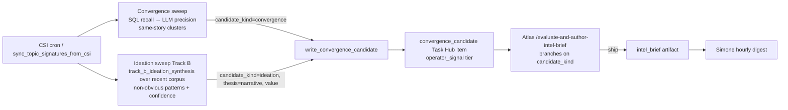

# Ideation Sweep — Restoring the High-Value Insight Engine (Track B)

**Status:** Implemented 2026-05-29.
**Companions:** [`llm_convergence_clustering_2026-05-29.md`](llm_convergence_clustering_2026-05-29.md), [`insight_pipeline_completion_spec_2026-05-29.md`](insight_pipeline_completion_spec_2026-05-29.md).

## 1. Why

The original pipeline ran **two** LLM intelligence sweeps:

- **Track A — `track_a_concrete_convergence`**: do multiple independent channels cover the *same concrete story*? → **convergence** briefs.
- **Track B — `track_b_ideation_synthesis`**: what *non-obvious abstract relationships, conflicting viewpoints, or macro-trends* are emerging that aren't obvious? → **insight** briefs.

The consolidation (PR C) replaced both with deterministic SQL clustering. PR #552 restored an LLM **convergence** judge (Track A-equivalent) — but **Track B was left dormant.** That's the wrong half: convergence detection structurally surfaces *news saturation* (everyone covering the same story = least novel), which Atlas correctly skips. The insights the operator actually valued — e.g. *"[VP Status] Insight: Narrative Warfare as Primary Conflict Theater"* (four unrelated stories running the identical manufactured-reality FORMAT) — are **Track B ideation** outputs: non-obvious cross-cutting patterns, not same-story convergence.

ZAI/GLM quota is abundant (operator decision 2026-05-29), so the cost reason for removing Track B no longer applies. This restores it as an hourly sweep, routed through the **same de-poisoned `convergence_candidate → Atlas → digest` pipeline.**

## 2. Architecture

- **`_run_ideation_sweep`** (sync wrapper) → **`_run_ideation_sweep_async`**: loads the recent signature corpus (`_load_recent_signatures`, rolling `source_window_hours`), chunks it into batches of 20 (Track B's analysis cap) so >20 recent videos are covered, runs `track_b_ideation_synthesis` per batch (ZAI/GLM via `_call_llm`), and keeps insights with `confidence ≥ UA_IDEATION_MIN_CONFIDENCE` (default 0.7) and ≥2 supporting videos. **Fails closed per batch** (a failed LLM call drops that batch, never a false insight).
- Each insight is written via `write_convergence_candidate(candidate_kind="ideation", thesis=narrative, value=value, signal_strength=confidence*10)`. It reuses the exact convergence task/queue/tier machinery — only the title, labels, task description framing, and `metadata.candidate_kind` differ.
- **Atlas's skill branches on `candidate_kind`**: for `ideation` it judges on **novelty / insight / actionability** (not multi-channel same-topic overlap) and authors from the synthesized narrative + "so what"; it explicitly must NOT skip merely because the supporting videos cover different topics — cross-topic synthesis is the point.

## 3. Why this is safe now (and wasn't before)

The old Track B path (`create_insight_brief_task`) emitted `insight_brief_task` artifacts and tasks whose parks fed the implicit-preference doom loop. That loop is gone (PR #553: implicit signals no longer emit; preference context is explicit-only). This restoration routes Track B through the new `intel_brief` path the digest consumes, and parks no longer poison Atlas. So ideation candidates that Atlas skips cost nothing downstream.

## 4. Config

| Env | Default | Effect |
|---|---|---|
| `UA_IDEATION_SWEEP_ENABLED` | `1` | Run the Track B ideation sweep each CSI cycle. `0` disables. |
| `UA_IDEATION_MIN_CONFIDENCE` | `0.7` | Min LLM self-rated confidence (0–1) to queue an ideation candidate. |

Cadence inherits `sync_topic_signatures_from_csi` (the CSI convergence cron, `0 6-21 * * *` active-window).

## 5. Code

| File | Change |
|---|---|
| `services/proactive_convergence.py` | `_ideation_sweep_enabled`, `_ideation_min_confidence`, `_load_recent_signatures`, `_run_ideation_sweep[_async]`; ideation block in `sync_topic_signatures_from_csi` (returns `ideation_candidates_written`); `write_convergence_candidate` + `_candidate_task_description` accept `candidate_kind` + `value`. |
| `.claude/skills/evaluate-and-author-intel-brief/SKILL.md` | Decision rubric branches on `candidate_kind`; ideation judged on novelty/value. |
| `tests/unit/test_ideation_sweep.py` | Sweep gating, fail-closed, ideation candidate framing, default-kind unchanged, flags. |

## 6. Known limitations / follow-ons

- **candidate_id collision:** an ideation insight whose supporting video set exactly matches a convergence cluster would hash to the same `candidate_id`. Rare (ideation videos are usually cross-topic/different); last-writer wins on `candidate_kind`. Acceptable for v1.
- **Corpus coverage:** the sweep analyzes the most-recent ~60 signatures (3 batches of 20). Widening the window / smarter sampling is a tuning follow-on.
- This does not change convergence detection; both sweeps run each cycle and feed the same Atlas judge.

## 7. Verification (post-deploy)

1. After a CSI run, `sync` result includes `ideation_candidates_written > 0` (when the corpus yields non-obvious patterns).
2. `convergence_candidates` rows exist with `metadata.candidate_kind='ideation'` and a populated `thesis`/`value`.
3. Atlas evaluates an ideation candidate and **ships** a genuinely non-obvious one → `intel_brief` on disk → digest email.
