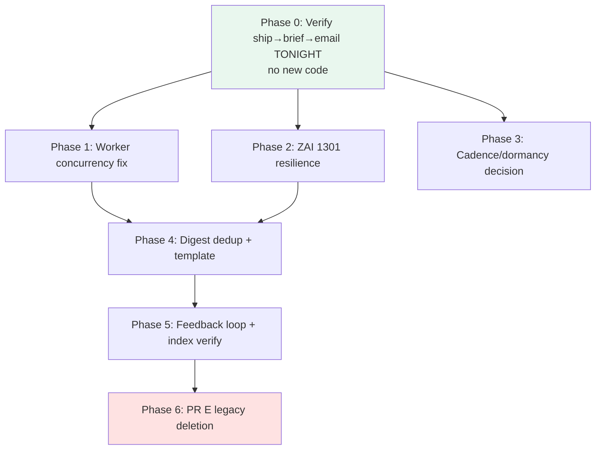

# Spec: Insight Pipeline Completion — From "Candidates Generate" to "Kevin Gets a Great Hourly Digest"

**Status:** Phase 0 complete + Phase 0.5 (de-poison) IMPLEMENTED 2026-05-29 (operator-approved); Phases 1/4/5/6 pending.
**Author:** Claude (Opus 4.8), 2026-05-29.

**Phase 0.5 implementation note (shipped this session):** Per operator decision — (1) `_fire_implicit_preference_signal` now no-ops by default (`UA_PROACTIVE_IMPLICIT_SIGNALS_ENABLED=0`); only explicit thumbs feedback ever moves preference. (2) `rebuild_preference_snapshot` scoped to `signal_type='explicit_feedback'` only, so the snapshot that feeds `get_delegation_context` → Atlas can't be poisoned by park/skip bursts. (3) One-time detox via the existing `preference_signal_detox` script (deletes implicit rows + rebuilds the cached model) runs post-deploy on prod. Tests in `test_preference_gate_scoping.py`.
**Lineage:** builds on PR #551 (execution unblock) and PR #552 (LLM cluster quality). Companions: [`insight_pipeline_consolidation_spec.md`](insight_pipeline_consolidation_spec.md), [`insight_pipeline_remediation_plan_2026-05-28.md`](insight_pipeline_remediation_plan_2026-05-28.md), [`llm_convergence_clustering_2026-05-29.md`](llm_convergence_clustering_2026-05-29.md).

---

## Assumptions (correct these before I proceed)

1. **"Successful outcome" = Kevin reliably receives one high-quality, collated hourly intel digest email** (during the active window), built from genuine multi-channel convergences that Atlas judged ship-worthy — and Atlas sends **no** per-insight direct emails.
2. **Dormancy is cost/rate-limit conservation, not a work freeze.** Per operator (2026-05-29): overnight is throttled because ZAI/GLM = China business-day peak and we don't want to burn tokens generating intel nobody reads until morning — but *work, verification, and detection may run overnight* when justified. The digest *delivery* should still respect the operator's reading hours (no 3 AM emails), but detection/authoring need not be frozen.
3. **ZAI/GLM is the inference substrate** for all autonomous detection/authoring (abundant quota; subject to overnight throttling + content-safety guardrails).
4. **The architecture is settled** (Atlas evaluates+authors in background → Simone batches hourly). We are *completing and hardening* it, not redesigning.
5. **Anthropic-tier models are not required** for this pipeline; GLM via the ZAI emulation layer is acceptable for detection, judgment, and authoring.

→ If any of these is wrong, say so now — they shape the whole plan.

---

## 1. Objective

Take the insight pipeline from its current state (verified: genuine convergence *candidates* now generate with real theses) to a **reliably-delivering product**: Atlas ships the good ones, Simone emails one clean collated digest per active-window hour, the operator's thumbs feedback tunes future runs, and the system is resilient to the failure modes we've observed (single-worker starvation, ZAI content-safety drops, near-duplicate clusters). Then remove the dead legacy code.

**Primary user:** Kevin (operator), who reads the hourly digest.
**Success = §8.**

---

## 2. Current state (verified this session)

| Component | State | Evidence |
|---|---|---|
| Convergence candidate generation | ✅ **Working** — LLM precision layer produces real theses + `signal_strength` | 4 candidates, strength 7–9, specific theses (Google I/O 2026, Claude Code free, etc.) |
| Atlas claims + runs `/evaluate-and-author-intel-brief` | ✅ **Working** (since PR #551 tier fix) | mission `vp-mission-4a347876` ran to completion, wrote a reasoned verdict |
| Atlas ship → `intel_brief` on disk → digest email | ⚠️ **Unverified end-to-end** — only `skip` verdicts observed so far (on garbage candidates) | 0 `intel_brief` artifacts ever |
| Simone `/hourly-intel-digest` | ✅ Runs on heartbeat, exits `no_candidates` correctly; `delivery_channel` column present | log: `status: no_candidates` |
| VP worker concurrency | ❌ **Bug** — `worker_loop.py:358` defaults to 1; `UA_MAX_CONCURRENT_VP_GENERAL`=2 unused by the loop; serial, ~26-min claim latency | observed single running mission |
| ZAI content-safety (1301) | ⚠️ Silently drops large/sensitive buckets (fail-closed) | the 29-video bucket dropped on the verification run |
| Digest dedup | ❌ **Missing** — `hourly_intel_digest` has no dedup; near-duplicate clusters (two Google I/O) would both ship | grep: no jaccard/dedup |
| Operator feedback loop | 🟡 **Built, unverified** — `/api/v1/briefs/{id}/feedback` + `proactive_artifact_feedback` exist | endpoints at `gateway_server.py:20514,20642` |
| `recent_briefs_index` (Atlas prior-verdict memory) | 🟡 **Built, unverified** — `recent_briefs_index.py` + skill references it | `append_verdict_to_index` referenced in SKILL.md |
| Legacy Track A/B + `create_insight_brief_task` + hand-trigger endpoints | ⚠️ **Dead but present** (PR E deferred) | still callable from `gateway_server.py:21048/21099` |

---

## 3. Commands

```
Test (unit):        uv run pytest tests/unit -q
Test (one file):    uv run pytest tests/unit/test_<name>.py -q
Lint:               uv run ruff check <files>
Manual CSI run:     ssh ua@uaonvps → infisical run --env=production -- \
                      env PYTHONPATH=/opt/universal_agent/src .venv/bin/python \
                      -m universal_agent.scripts.csi_convergence_sync
Live DB (prod):     ssh ua@uaonvps → sqlite3 /opt/universal_agent/AGENT_RUN_WORKSPACES/activity_state.db
VP missions (prod): ssh ua@uaonvps → sqlite3 /opt/universal_agent/AGENT_RUN_WORKSPACES/vp_state.db
Ship:               branch (worktree-*) → gh pr create --base main → auto-merge → deploy.yml
Deploy verify:      VPS git SHA == origin/main HEAD AND gateway ActiveEnterTimestamp is fresh
Gmail check (MCP):  mcp__claude_ai_Gmail__search_threads / AgentMail tools
```

## 4. Project structure (files in scope)

```
src/universal_agent/services/proactive_convergence.py   → detection + LLM clustering (PR #552)
src/universal_agent/services/hourly_intel_digest.py      → Simone digest: dedup + render (Phase 4)
src/universal_agent/vp/worker_loop.py                    → VP mission concurrency (Phase 1)
src/universal_agent/services/recent_briefs_index.py      → Atlas prior-verdict memory (Phase 5)
src/universal_agent/gateway_server.py                    → cron cadence, feedback endpoints, PR-E endpoint cleanup
.claude/skills/evaluate-and-author-intel-brief/SKILL.md  → Atlas authoring contract
docs/proactive_signals/                                  → specs/docs (update in same PRs)
tests/unit/                                              → all tests
```

## 5. Code style

Match the surrounding module. Example — the established env-flag + fail-closed idiom this pipeline uses (from PR #552):

```python
def _llm_clustering_enabled() -> bool:
    return str(os.getenv("UA_CONVERGENCE_LLM_CLUSTERING", "1")).strip().lower() in {"1", "true", "yes", "on"}

# Fail closed: on any LLM/parse error, emit NO candidate (precision over recall).
try:
    raw = await _call_llm(system=..., user=..., max_tokens=1200)
    parsed = _parse_json_response(raw)
except Exception as exc:        # noqa: BLE001
    logger.warning("convergence LLM refine failed (bucket size=%d): %s", len(bucket), exc)
    return None
```

Conventions: every behavioral lever is an env flag with a safe default + a one-line rollback; ZAI calls go through `llm_classifier._call_llm`; new behavior ships with a unit test that mocks the LLM; docs updated in the same PR and indexed in `docs/README.md` + `docs/Documentation_Status.md`.

## 6. Testing strategy

- **Unit (pytest, `tests/unit/`)** — mock `llm_classifier._call_llm` (AsyncMock); assert gating, dedup, fail-closed, env flags. `asyncio_mode=auto`.
- **Live verification (VPS)** — every phase that touches a phase boundary ends with a real-artifact check on prod DBs (per Doc 130), not just unit tests. Manual CSI run + mission inspection + Gmail MCP for the email.
- **Coverage bar:** each new function gets ≥1 happy-path + ≥1 failure/rejection test. No phase is "done" without both a green unit run AND a prod-state check.

## 7. Boundaries

- **Always:** branch + PR + auto-merge + deploy-verify (SHA + restart); fail closed on LLM errors; env-flag every lever; update docs in the same PR; convert timestamps to Houston time in operator-facing output.
- **Ask first:** changing the dormancy/cadence posture (Phase 3 — operator decision); raising worker concurrency above 2 (resource impact); any change that could increase Kevin's email volume; deleting the legacy code (Phase 6 — confirm new path stable ≥24h first).
- **Never:** let Atlas send per-insight direct emails (the whole point of consolidation); commit secrets; emit an empty digest; remove a failing test to go green; run destructive prod ops without a backup.

---

## 8. Success criteria (specific, testable)

1. **One real email.** Within one active-window hour, Kevin receives exactly one collated digest from `oddcity216@agentmail.to` containing ≥1 brief, with working per-brief links, and `proactive_artifacts` shows the brief(s) at `delivery_state='emailed'`, `delivery_channel='hourly_digest'`, `delivered_at` set. (Verified via Gmail MCP + prod DB.)
2. **Atlas ships real convergences.** At least one `intel_brief` artifact exists with `verdict='ship'` AND a non-empty `artifact_path` (brief authored to disk), authored from an LLM-confirmed candidate.
3. **No direct Atlas emails.** Zero new `[VP Status] Insight` emails to Kevin after this work lands.
4. **No duplicate briefs.** Near-identical convergences (e.g. the two Google I/O clusters) collapse to one in a digest.
5. **Throughput adequate.** An `operator_signal` mission is claimed within < 3 min of being queued when the worker is otherwise idle; ≥2 can run concurrently.
6. **Content-safety resilience.** A bucket that trips ZAI 1301 is retried with reduced input; if still rejected it is logged + counted (not silently lost), and high-value political/conflict convergences are not categorically dropped.
7. **Feedback closes the loop.** A thumbs-down on a brief lowers that lane/topic's weighting in a subsequent run (operator_rating recorded + surfaced to Atlas's index).
8. **Cadence matches operator intent.** Detection cadence reflects the agreed dormancy posture (Phase 3 decision); digest delivery never fires outside Kevin's reading hours.
9. **Dead code gone.** Legacy Track A/B + `create_insight_brief_task` + `detect_and_queue_convergence` + the two hand-trigger endpoints removed; tests green.

---

## 8b. Phase 0 finding (2026-05-29 overnight run) — THE dominant blocker

Phase 0 ran tonight and did its job: it proved the loop works *and* surfaced the real blocker. **The pipeline now executes correctly end-to-end and fast** — Atlas claimed and evaluated the 4 real candidates within minutes (no 26-min lag), dedup works (it caught the two Google I/O clusters as near-duplicates via the recent-briefs index), and its skip reasoning is articulate and defensible. **But it shipped nothing**, and the verdicts name why:

1. **Preference-context poison (dominant).** Every skip cites *"floor-level negative operator preference (−1.00 on project:proactive, source:insight_detection, topic:agent-ready; ~298 explicit signals)."* Those 298 signals are **NOT explicit** — they are `implicit_outcome` rows with text **"Outcome: park"**, auto-fired (−0.1 each) whenever a proactive task reaches a terminal park/skip/cancel state. They aggregate to −1.00 and are injected into Atlas's mission context, biasing it to skip. Skipping fires more park signals → **self-reinforcing doom loop.** Tonight's flush (parking hundreds of stale tasks at 02:29–02:30) deepened it.
2. **Mislabel.** `get_delegation_context` (`services/proactive_preferences.py`) reads `get_preference_snapshot` (which aggregates ALL signal types via `rebuild_preference_snapshot`, no `signal_type` filter) and formats the line as *"…from N **explicit** signal(s)"* — hardcoding "explicit" even for implicit signals. Atlas trusted the label.
3. **Already-fixed sibling.** `should_block_proactive_task` (same file) was scoped to `explicit_feedback` ONLY in the 2026-05-24 incident fix, with a comment describing *exactly* this failure ("a single burst of system parks can otherwise saturate a key's weight at −1.0 and silently suppress an entire pipeline"). The **gate** is protected; the **context injected into Atlas's reasoning is not.**

**New top-priority phase (supersedes the original Phase 1 ordering):**

### Phase 0.5 — De-poison Atlas's preference context (the unlock)
- [ ] **0.5a** Make `get_delegation_context` (and the snapshot weight it surfaces) compute from `signal_type='explicit_feedback'` ONLY — mirror the scoping already in `should_block_proactive_task`. Fix the "explicit signal(s)" label to be accurate.
  - Acceptance: with only implicit park signals present, `get_delegation_context` returns no negative-preference line (or clearly labels implicit, weight ≈ 0); Atlas missions no longer carry a poisoned −1.00.
  - Verify: unit test — seed N implicit_outcome park signals + 0 explicit → context is empty/neutral; re-run a real convergence eval and confirm Atlas no longer cites the −1.00.
  - Files: `services/proactive_preferences.py`, 1 test.
- [ ] **0.5b** Stop (or stop counting) `implicit_outcome` park/skip signals for the convergence pipeline so the loop can't re-poison. Decision needed (Open Q E): suppress emission, or keep for ranking-only (never context/gate). Recommended: keep for `score_artifact_for_review` ranking, exclude everywhere a human-facing "preference" is implied.
  - Acceptance: a fresh batch of parks does not move the injected preference weight.
  - Verify: unit test; live re-check after a park burst.
- [ ] **0.5c** Detox the existing 298+ implicit poison rows (one-time), as the 2026-05-24 fix did for its 2656.
  - Acceptance: snapshot weight for project:proactive returns to ≈0 absent explicit feedback.
  - Verify: prod DB check post-detox.
- [ ] **0.5d** Re-run Phase 0 verification: with the poison gone, confirm Atlas ships a genuinely high-value convergence → `intel_brief` on disk → digest email.

**Caveat (real, separate):** even de-poisoned, Atlas legitimately skipped Google-I/O-saturation and partisan-echo clusters as "near-zero marginal info for an operator who builds an AI agent platform." That judgment is *sound*. So a secondary finding is that **the current CSI source/topic mix yields mostly low-value convergences** — surfacing genuinely novel, operator-relevant convergences may need source/lane tuning (tracked as a follow-on, not blocking the unlock).

## 9. Plan (phased, ordered by dependency + risk-burn-down)



- **Phase 0 first** because it either proves the whole loop works (de-risking everything) or surfaces the *real* next blocker. Run tonight — dormancy is not a freeze.
- Phases 1 & 2 are independent hardening, parallelizable.
- Phase 3 is a **decision**, not code — needs operator input (Open Question A).
- Phase 4 depends on a working loop (P0) + adequate throughput (P1).
- Phase 6 (deletion) is last and gated on ≥24h of stable new-path operation.

---

## 10. Tasks

### Phase 0 — End-to-end verification (no new code, tonight)
- [ ] **0.1** Drive the 4 live candidates through dispatch → Atlas. If Simone's overnight dispatch is paused, dispatch them via the ops mission path (as in PR #551 verification).
  - Acceptance: ≥1 candidate reaches a `ship` verdict with an `intel_brief` artifact + non-empty `artifact_path`.
  - Verify: `sqlite3 vp_state.db` mission status; `activity_state.db` `proactive_artifacts WHERE artifact_type='intel_brief' AND verdict='ship'`.
  - Files: none (operational).
- [ ] **0.2** Confirm Simone's digest picks up the ship brief and sends one email (or manually invoke the digest skill path if heartbeat is paused).
  - Acceptance: one email delivered; brief stamped `emailed`/`hourly_digest`/`delivered_at`.
  - Verify: Gmail MCP search for the digest; prod DB delivery columns.
- [ ] **0.3** Record results; if a *new* blocker appears, fold it into this spec before continuing.

### Phase 1 — VP worker throughput

- [x] **1.0 (shipped 2026-05-29)** Ideation mission-tier gap. Simone dispatches
  ideation candidates under LLM-chosen mission types (`evaluate_ideation_insight`)
  that were absent from `MISSION_TYPE_TIER` → resolved to `background` → drained
  dead-last behind every convergence mission. Fixed: explicit operator_signal
  entries for the ideation mission types + a substring guard in `resolve_tier`
  (any `ideation`/`convergence`/`intel_brief`/`insight_brief`-family mission_type
  → operator_signal). `vp/mission_priority.py`, tests in
  `test_vp_mission_priority_tiers.py`.

- [ ] **1.1 (RECLASSIFIED — deliberate change, deferred)** True worker concurrency.
  Investigation showed `UA_VP_MAX_CONCURRENT_MISSIONS` / `max_concurrent_missions`
  is **stored but unused**: `VpWorkerLoop._tick()` claims ONE mission and runs it
  to completion before the next claim — the loop is **structurally serial**. So
  "concurrency=2" is NOT a knob flip; it requires rewriting `_run`/`_tick` to claim
  up to N and run them as concurrent asyncio tasks with in-flight tracking. That
  directly risks the documented **event-loop-starvation incident** (in-process
  Claude SDK turns starving the loop). Defer to a properly-spec'd + load-tested
  change; consider a second worker *process* (`worker_main.py`) over in-loop
  concurrency to avoid sharing one event loop. With the tier gaps now closed and
  candidate volume low (a few insights/cycle), the serial worker may be adequate —
  re-measure before taking the risk.
  - Files (if pursued): `vp/worker_loop.py` (loop rewrite) OR a new worker process unit.

### Phase 2 — ZAI 1301 content-safety resilience
- [ ] **2.1** In `_refine_cluster_with_llm`, on a 1301 (or any 400 content-safety) error, retry once with a trimmed payload (fewer videos / shorter claims); if still rejected, log + increment a dropped-bucket counter with the topic.
  - Acceptance: a 1301-triggering bucket is retried; persistent rejections are logged/counted, not silent; a political/conflict cluster that previously dropped now survives the retry where possible.
  - Verify: unit test (mock `_call_llm` to raise 1301 then succeed on retry); live: re-run sync, inspect logs.
  - Files: `services/proactive_convergence.py`, 1 test.

### Phase 3 — Cadence / dormancy decision (DECISION, then small code)
- [ ] **3.1** Resolve Open Question A with operator. Then set `UA_CSI_CONVERGENCE_CRON_EXPR` accordingly (e.g. hourly 24/7, or reduced overnight) and ensure digest delivery stays within reading hours.
  - Acceptance: cron expr matches the decision; `docs/operations/operating_hours_dormancy.md` + the dormancy guard test updated to reflect detection-vs-delivery distinction.
  - Verify: `tests/unit/test_cron_dormancy_defaults.py` green with the new posture.
  - Files: `gateway_server.py`, dormancy doc, guard test.

### Phase 4 — Digest dedup + template
- [ ] **4.1** Add near-duplicate suppression to the digest candidate selection (e.g. topic/thesis overlap), and/or ensure `recent_briefs_index` makes Atlas skip a second near-identical cluster at authoring time.
  - Acceptance: two near-identical briefs in one hour collapse to one in the email.
  - Verify: unit test with two overlapping briefs → one rendered.
  - Files: `services/hourly_intel_digest.py`, 1 test.
- [ ] **4.2** Eyeball the rendered digest HTML (subject line, ribbons, links); fix any rendering issues.
  - Acceptance: Kevin confirms the digest "looks good"; links resolve.
  - Verify: send a real digest (Phase 0/manual) and view it.

### Phase 5 — Feedback loop + recent-briefs index verification
- [ ] **5.1** Verify thumbs up/down writes `operator_rating` and that `recent_briefs_index` reflects it; confirm Atlas reads the index for prior-verdict awareness.
  - Acceptance: a thumbs-down recorded → next run's preference context / index shows it; Atlas skips a convergence it already shipped.
  - Verify: simulate feedback via endpoint; inspect index file + a subsequent mission's context.
  - Files: verification + any gap-fill in `recent_briefs_index.py` / feedback endpoint.

### Phase 6 — PR E legacy deletion (gated: ≥24h stable new-path)
- [ ] **6.1** Remove `track_a_concrete_convergence`, `track_b_ideation_synthesis`, `_detect_and_queue_convergence_async`, `create_convergence_brief_task`, `create_insight_brief_task`; simplify/remove the two gateway hand-trigger endpoints.
  - Acceptance: dead code removed; no caller references remain; tests green.
  - Verify: `grep` shows no live callers; `uv run pytest tests/unit -q` green.
  - Files: `services/proactive_convergence.py`, `gateway_server.py`, test updates.

---

## 11. Risks & mitigations

| Risk | Mitigation |
|---|---|
| Phase 0 reveals Atlas *still* skips even good candidates (e.g. preference context biases to skip) | Phase 0 is explicitly a discovery gate; if so, the preference-context injection (−1.00 project:proactive) becomes a new phase before anything else |
| Raising concurrency reignites event-loop starvation (known issue) | Cap at 2; measure loop responsiveness; keep `UA_DAEMON_SESSIONS_ENABLED` kill-switch in mind |
| ZAI 1301 keeps rejecting political clusters even trimmed | Log + surface count; escalate to operator whether to route those through a different model/lane |
| Overnight detection burns ZAI quota during China-peak throttle | Phase 3 decision; can keep detection hourly but delivery active-window-only |
| Deleting legacy code breaks a hand-trigger the dashboard still calls | Phase 6 gated; grep call sites incl. web-ui before deletion |

---

## 12. Decisions (operator-resolved 2026-05-29)

- **A. Cadence → active-window only (current).** Detection runs `0 6-21 * * *` Houston (already shipped in PR #552). **No code change.** Note: this governs the *cron*; agent-driven verification/work is not frozen overnight (that's why Phase 0 runs tonight).
- **B. Worker concurrency → 2.** Phase 1 makes the general VP worker honor `UA_MAX_CONCURRENT_VP_GENERAL=2`. No higher (respects event-loop-starvation history).
- **C. Sensitive content → accept the drop.** ZAI 1301 rejections stay fail-closed; **Phase 2 reduces to keeping the existing warning log** (no retry/reroute build). Political/conflict convergences that trip the guardrail simply won't surface — accepted tradeoff.
- **D. Digest dedup → both (index primary, digest backstop), Phase 4.** Atlas's recent-briefs index should skip a near-identical second cluster; the digest adds a deterministic backstop.

**Net effect on the plan:** Phase 3 is a no-op (cadence already correct). Phase 2 shrinks to "verify the drop is logged, not silent." Remaining code phases: 1 (concurrency=2), 4 (dedup + template), 5 (feedback/index verify), 6 (legacy deletion). Phase 0 (verification) runs now.
