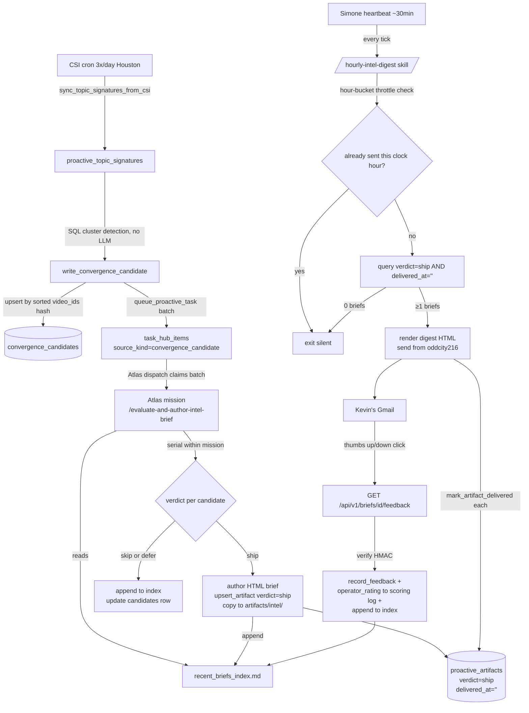

# Insight Pipeline Consolidation Spec

**Status:** Approved design — implementation pending.
**Authored:** 2026-05-28.
**Scope:** Consolidate the duplicated proactive-insight delivery path, fix CSI redetection, give Atlas ship/skip/defer authority, wire the operator feedback loop. Targets 4-5 PRs.

## 1. Problem statement

Three production problems documented in the 2026-05-28 investigation:

1. **Double delivery channel.** Atlas (`vp.general.primary`) emails Kevin directly per a soft instruction in convergence task descriptions (`[VP Status]` emails from `vp.agents@agentmail.to`); independently, a Python cron (`hourly_insight_email.py`) re-delivers the same `proactive_artifacts` rows from `oddcity216@agentmail.to`. Same brief, two emails. ~30+ extra emails/day.

2. **CSI redetects the same convergence repeatedly.** Brief identity is `sha256(primary_topic | sorted(video_ids))`. Both inputs are unstable — `primary_topic` is LLM-generated free text, and `video_ids` slides as the 72h window admits new sources. Same signal → new hash every hour → new artifact → new task → new brief. The Jaccard novelty term in the hourly composer only down-weights overlap (weight 0.2); it cannot suppress.

3. **Threshold judgment happens in the wrong place.** CSI cron does a Track A LLM pass scoring `signal_strength 1-10` and drops anything below 8, plus a Track B LLM pass generating "ideation narratives." Atlas only sees candidates that already cleared the cron's gate. Atlas re-reasons about the same data when writing the brief, producing three LLM passes per shipped brief with no awareness of his own prior verdicts.

## 2. Approved architecture

**CSI cron does pattern detection only.** No LLM evaluation. SQL cluster detection: GROUP BY shared primary topics across the window, emit a candidate for any cluster with ≥2 distinct channels. CSI cadence drops from hourly to 3x/day (`UA_CSI_CONVERGENCE_CRON_EXPR="0 7,13,19 * * *"`, Houston time).

**Atlas owns ship/skip/defer + authoring** via a new skill `/evaluate-and-author-intel-brief`. Atlas claims a batch of candidates in one mission, evaluates them serially inside that mission (each candidate sees prior verdicts in the same context window), and ships/skips/defers each. Ship verdicts produce an HTML artifact AND a structured summary appended to a maintained `recent_briefs_index.md`. Skip/defer verdicts get logged to the index for auditability and Atlas's future-context awareness. No emails sent by Atlas.

**Simone owns hourly digest delivery** via `/hourly-intel-digest`, invoked on every Simone heartbeat (~30 min). Self-throttles via hour-bucket comparison: fires at most once per clock hour. Pure packaging — no editorial LLM pass. Reads qualifying `proactive_artifacts` (verdict=ship, undelivered, created this hour-bucket), bundles into the digest HTML, sends from `oddcity216@agentmail.to`. Skips silently if no qualifying briefs (no empty emails).

**Operator feedback loop closes via signed-URL endpoint.** Thumbs-up/down links in the digest write `operator_rating` to `proactive_brief_scoring_log` and update the index file. Atlas reads those ratings when evaluating future candidates — prospective self-tuning, not retroactive re-evaluation.

**Re-evaluation is evidence-driven, not time-driven.** Candidate identity is `sha256(sorted(video_ids))[:16]` — when new sources enter a cluster, a new candidate (different hash) is generated naturally and Atlas evaluates it fresh. Skipped candidates with unchanged evidence are NOT re-evaluated. The "defer" verdict effectively means "wait for new evidence to arrive"; if it never does, defer becomes permanent — correct behavior.

## 3. Dispatch flow



## 4. Locked-in design decisions

| Decision | Choice | Rationale |
|---|---|---|
| HMAC signing location | Sign at artifact-write time, store pre-signed URLs in `proactive_artifacts.metadata_json` | Skill becomes pure read-and-package; no secret access in agent context |
| Atlas evaluation pattern | Batch mission, serial-within-mission evaluation | Same consistency win as per-candidate serial; ~5x faster end-to-end (1 mission vs 5) |
| Digest trigger | Every Simone heartbeat, self-throttled by hour-bucket comparison | Avoids cron-reliability sore spot; aligns with heartbeat liveness model |
| Sender display name | `UA Intel (Simone)` | Names the function, parenthesizes the mailbox owner; preserves continuity with existing Simone inbox triage |
| Subject line | `[Intel · HH:MM CT] <top headline> (+N more)` | Houston time per project memory; headline drives open-rate; +N tail aids inbox scanning |
| Visual hierarchy | Score-ordered, density tapers down list, gold/silver/bronze ribbons | Morning-coffee triage favors strong top-anchor; lower cards stay skimmable |
| Theme clustering | None — score order only | Packaging-only mandate forbids editorial LLM judgment |
| `needs-attention` urgent path | Atlas can mark a brief urgent → bypasses throttle, fires immediately, red ribbon, `[NEEDS ATTENTION]` subject prefix | Time-sensitive signals shouldn't wait for next hour-bucket |
| Pause-digest footer link | Signed link `?hours=24` skips delivery for N hours; brief artifacts persist | Travel/focus mode; low cost; reuses HMAC pattern |
| Re-evaluation | Evidence-driven only (new video_ids → new hash → new candidate). No time-based re-evaluation of skipped candidates | Matches operator preference; avoids burning Atlas cycles on identical inputs |
| `insight_scoring_health` weekly cron | Adapt for new metrics, don't delete | Useful weekly visibility on ship/skip/defer ratio, rating coverage, theme drift |
| Brief storage durability | Copy authored HTML to `artifacts/intel/<artifact_id>.html` at ship time; store path in `artifact_path` | Workspace cleanup never breaks old briefs; permanent shareable URLs |
| Feedback grammar | Primary: signed GET endpoint. Fallback (deferred): reply-grammar parser | GET endpoint works in all clients; reply-grammar only needed if corporate proxies strip query params |
| Tier-1 dial flips (PR A) | Raise `FLOOR_MIN_CONFIDENCE` 0.7→0.8; delete `sub_threshold_filler` branch; slow CSI cron to 3x/day; replace VP email instruction in convergence task descriptions | ~50% volume cut before structural work lands |

## 5. Component inventory

### 5.1 `services/proactive_convergence.py` (changed)

Replace Track A/B LLM evaluation with deterministic SQL cluster detection.

Remove: `track_a_concrete_convergence`, `track_b_ideation_synthesis`, `_detect_and_queue_convergence_async`, `create_convergence_brief_task`, `create_insight_brief_task`.

Add:

```python
def write_convergence_candidate(
    conn: sqlite3.Connection,
    *,
    signatures: list[dict],
    source_window_hours: int = 72,
) -> dict:
    """
    Compute candidate_id = sha256("|".join(sorted(video_ids)))[:16] prefixed 'cand_'.
    Upsert convergence_candidates row. If candidate already exists with verdict set,
    return existing row (no re-queue). Otherwise queue_proactive_task with
    source_kind="convergence_candidate", metadata.preferred_vp="vp.general.primary".
    """
```

Update `sync_topic_signatures_from_csi` to call SQL-only cluster detection (GROUP BY primary_topic shared across ≥2 channels within `source_window_hours`), then `write_convergence_candidate` per cluster.

Schema additions (in `ensure_schema`): see §6.1.

### 5.2 `services/recent_briefs_index.py` (new)

Single source of truth for Atlas's prior-verdict awareness AND operator-rating substrate.

Public interface:

```python
def build_recent_briefs_index(conn, *, lookback_hours=48, limit=200) -> str
def write_recent_briefs_index(conn, *, index_path: Path, lookback_hours=48) -> Path
def append_verdict_to_index(*, index_path, artifact_id, candidate_id, verdict,
                             thesis, key_entities, ship_reasoning,
                             operator_rating, decided_at) -> None
def read_index_or_fallback(conn, *, index_path: Path, lookback_hours=48) -> str
def update_operator_rating_in_index(*, index_path, artifact_id, rating: int) -> None
```

Env var: `UA_RECENT_BRIEFS_INDEX_PATH` (default `{WORKSPACES_DIR}/recent_briefs_index.md`).

Index format:

```markdown
# Recent Intel Briefs Index
Last updated: <ISO-8601 UTC>
Lookback: 48 hours

---

## [SHIP] <title>
candidate_id: cand_<16hex>
artifact_id: pa_<id>
decided_at: <ISO-8601>
thesis: <1-2 sentences — what the convergence is about and why it matters>
key_entities: [<entity>, <entity>, ...]
ship_reasoning: <why this cleared the bar — cross-channel diversity, novelty vs prior briefs, actionability>
operator_rating: null   # populated after Kevin clicks thumbs

---

## [SKIP] <theme description>
candidate_id: cand_<16hex>
decided_at: <ISO-8601>
thesis: <brief>
key_entities: [...]
ship_reasoning: <which prior brief this overlapped with, or why coverage was insufficient>
operator_rating: null

---

## [DEFER] <theme description>
candidate_id: cand_<16hex>
decided_at: <ISO-8601>
thesis: <brief>
key_entities: [...]
ship_reasoning: <defer condition stated explicitly: "defer until X further channel covers this">
operator_rating: null
```

Index is append-dominant. Pruning happens during `write_recent_briefs_index` when entries exceed `lookback_hours` or row count limit. No token-budget constraint — Atlas should see the full 48h history.

### 5.3 `.claude/skills/evaluate-and-author-intel-brief/SKILL.md` (new)

Atlas's batch evaluation skill. Invoked once per batch of `convergence_candidate` tasks claimed together.

Frontmatter:

```yaml
---
name: evaluate-and-author-intel-brief
description: >
  Atlas batch skill for evaluating one or more convergence candidates and
  authoring intel briefs for those that clear the bar. Reads the recent
  briefs index for prior-verdict context, processes candidates serially
  within the same mission, and produces ship/skip/defer verdicts plus
  full HTML briefs for ships. Pre-signs feedback URLs at artifact-write
  time and stores them in artifact metadata.
---
```

Behavior phases (executed for the batch as a whole, then serially per candidate):

**Phase 0 — Orient.** Read all candidate rows from `convergence_candidates` matching the claimed batch. Read `UA_RECENT_BRIEFS_INDEX_PATH` for prior-verdict context.

**Phase 1 — Evaluate each candidate serially.** For each candidate in batch order:

- Load signatures, channel names, primary topics, video IDs.
- Compare against the recent briefs index. Key questions:
  - Same thesis as a brief shipped in the last 48h? → skip.
  - Sources thin (<2 channels with <3 supporting claims)? → skip.
  - Borderline strength, sources may grow? → defer with stated condition.
  - Operator rated similar themes thumbs-down recently? → apply stricter bar.
- Choose: ship / skip / defer.
- **Append the verdict to the index file immediately** so the next candidate in the same batch sees this verdict.

**Phase 2 — Author (per ship verdict).** Write the full HTML brief with required sections:
- Convergence signal (what + why now)
- Evidence summary (per-channel claims)
- Divergence (where sources disagree)
- So what (3 specific actionable items for Kevin)

Save HTML to workspace. Copy to durable `artifacts/intel/<artifact_id>.html` at end of mission.

**Phase 3 — Register artifact (per ship verdict).** Generate pre-signed feedback URLs:

```python
up_token = sign_feedback_token(artifact_id, "up")
down_token = sign_feedback_token(artifact_id, "down")
feedback_url_up = f"{UA_GATEWAY_BASE_URL}/api/v1/briefs/{artifact_id}/feedback?v=up&t={up_token}"
feedback_url_down = f"{UA_GATEWAY_BASE_URL}/api/v1/briefs/{artifact_id}/feedback?v=down&t={down_token}"
```

Call `proactive_artifacts.upsert_artifact` with `verdict='ship'`, `artifact_path` pointing at the durable copy, `metadata_json` containing `{feedback_url_up, feedback_url_down, thesis, key_entities, key_actions, needs_attention: bool}`.

**Phase 4 — Update candidate row.** Set `convergence_candidates.verdict`, `verdict_reasoning`, `artifact_id` (if ship), `evaluated_at`. Close the Task Hub item as complete.

**Output schema (per candidate, persisted to candidates row + index):**

```yaml
candidate_id: str
verdict: "ship" | "skip" | "defer"
decided_at: ISO-8601
thesis: str           # 1-2 sentences
key_entities: [str]   # 3-6 named entities
ship_reasoning: str   # why ship/skip/defer
artifact_id: str      # non-empty only for ship
needs_attention: bool # ship only — Atlas can flag urgent
```

**Failure handling:** If a single candidate fails (malformed signatures, etc.), Atlas logs the failure, marks that candidate's verdict as `error` with reasoning, and continues the batch. If the whole mission fails, the unprocessed candidates remain `verdict=''` in the candidates table and naturally get re-claimed on the next Atlas dispatch.

### 5.4 `.claude/skills/hourly-intel-digest/SKILL.md` (new)

Simone's packaging-and-delivery skill. Invoked on every heartbeat, self-throttled.

Frontmatter:

```yaml
---
name: hourly-intel-digest
description: >
  Simone skill for packaging and delivering the hourly intel digest email.
  Self-throttling via hour-bucket comparison: exits immediately if a digest
  was already sent this clock hour. Pure packaging — no editorial LLM pass,
  no scoring. Invoke on every heartbeat; the skill handles its own gate.
---
```

Behavior phases:

**Phase 0 — Throttle check.** Query: does any `proactive_artifacts` row with `delivery_state='emailed'` AND `delivery_channel='hourly_digest'` have `delivered_at` in the current clock-hour bucket? If yes → exit `"throttled"`.

**Phase 1 — Candidate pull.** Query:

```sql
SELECT artifact_id, title, summary, artifact_path, metadata_json
FROM proactive_artifacts
WHERE verdict = 'ship'
  AND (delivered_at IS NULL OR delivered_at = '')
  AND artifact_type IN ('intel_brief')
  AND created_at >= datetime('now', 'start of hour')
ORDER BY
  CASE WHEN json_extract(metadata_json, '$.needs_attention') = 1 THEN 0 ELSE 1 END,
  json_extract(metadata_json, '$.composite_score') DESC
```

If empty → exit `"no_candidates"`. No email sent.

**Phase 2 — Render.** Use the email template (§7) with pre-signed feedback URLs from `metadata_json.feedback_url_up` / `feedback_url_down`. No HMAC signing in skill context — URLs were signed at artifact-write time.

**Phase 3 — Send.** Via `mcp__agentmail__send_message`:
- `inboxId`: `oddcity216@agentmail.to`
- `to`: `UA_INTEL_DIGEST_RECIPIENT` (default `kevinjdragan@gmail.com`)
- Subject: `[Intel · HH:MM CT] <top headline> (+N more)` or `[Intel · NEEDS ATTENTION · HH:MM CT] <headline>` if any needs_attention briefs in batch
- Both `text` and `html` MIME parts

**Phase 4 — Stamp.** For each artifact in the digest, call `mark_artifact_delivered` with `delivery_channel='hourly_digest'`.

**Failure handling:** If AgentMail send fails, log error, park `needs_review` Task Hub item per Task Hub Observability Protocol. Do not stamp `delivered_at` — artifacts remain eligible for next heartbeat's attempt. Natural recovery.

### 5.5 `services/vp_email_directive.py` (changed)

Remove the soft "if you email Kevin" instruction lines from convergence task descriptions. No changes to `build_vp_outbound_email_directive` itself — that function is still used by Cody and `proactive_codie`, which retain their direct-email pattern.

Specific replacement in `proactive_convergence.py:719` and `:906`:

Before: `"Store the final brief as a durable artifact. If you email Kevin about it, honor the FRAMING note above — open with proactive-discovery phrasing."`

After: `"Store the final brief as a durable artifact via services.proactive_artifacts.upsert_artifact. Do NOT email Kevin directly. Delivery is handled by the consolidated digest pipeline."`

### 5.6 `services/hourly_insight_email.py` (deprecated → deleted in PR E)

PR A: Raise `FLOOR_MIN_CONFIDENCE` 0.7 → 0.8 at line 57. Delete `SLOT_SUB_THRESHOLD_FILLER` branch at lines 427-430 (sub-threshold briefs never get a slot).

PR D: Module remains but is no longer the delivery channel. Filtered by `verdict != 'ship'` so it only delivers legacy artifacts that haven't been Atlas-evaluated.

PR E: Module deleted. Cron registration removed.

### 5.7 `scripts/csi_convergence_sync.py` (new standalone entrypoint)

Currently the cron command `!script universal_agent.scripts.csi_convergence_sync` references a non-existent script — the work is done inline by `sync_topic_signatures_from_csi`. PR C adds the actual script file as a thin entrypoint calling the updated `sync_topic_signatures_from_csi` (which now does SQL clustering + `write_convergence_candidate`).

### 5.8 New gateway endpoint: `GET /api/v1/briefs/<artifact_id>/feedback`

Lightweight signed-URL feedback endpoint. Email-link-safe (no JSON body, no ops-auth, no POST).

Query params:
- `v`: `"up"` or `"down"` (maps to score 5 or 1)
- `t`: HMAC token over `f"{artifact_id}:{v}"` using the existing signing key

Behavior:
1. Validate HMAC via `verify_feedback_token`. Invalid → 401 HTML page.
2. Look up artifact (404 HTML if missing).
3. Call `proactive_artifacts.record_feedback(conn, artifact_id, score=5 if up else 1, actor='kevin')`.
4. Update most recent `proactive_brief_scoring_log` row's `operator_rating` column for this artifact.
5. Call `update_operator_rating_in_index` to sync the index file.
6. Return 200 HTML "Thanks — recorded" page (small dashboard chrome with link back to brief).

Idempotent: re-clicking overwrites.

### 5.9 New gateway route: `GET /briefs/<artifact_id>`

Dashboard viewer for the full HTML brief. Reads `artifact_path` from `proactive_artifacts` (the durable `artifacts/intel/` copy) and serves it. Includes lightweight chrome with feedback widget (1-5 fine-grain slider) and "Related recent briefs" sidebar. Permanent shareable URL.

Falls back to rendering `title + summary` from DB if the artifact file is missing.

### 5.10 New gateway endpoint: `GET /api/v1/digest/pause?hours=<N>&t=<token>`

Operator-pause link, HMAC-signed. Writes a `digest_paused_until` timestamp to a small runtime-state table. Simone's `/hourly-intel-digest` skill checks this in Phase 0 alongside the throttle check: if `digest_paused_until > now`, exit silent.

Defaults: `hours=24`. Max accepted: 168 (1 week).

### 5.11 `services/cron_artifact_notifier.py` (changed)

Add helpers following the existing `sign_ack_token` / `verify_ack_token` pattern:

```python
def sign_feedback_token(artifact_id: str, vote: str) -> str
def verify_feedback_token(artifact_id: str, vote: str, token: str) -> bool
def sign_digest_pause_token(hours: int) -> str
def verify_digest_pause_token(hours: int, token: str) -> bool
```

### 5.12 `memory/HEARTBEAT.md` (changed)

Add one directive in the `<!-- scope:hq -->` block:

```markdown
- [ ] Hourly intel digest (Simone owns — runs every heartbeat, self-throttles to once per clock hour)
  - Invoke `/hourly-intel-digest`. The skill handles throttle/pause/empty-candidates checks. If it returns an error or the Task Hub run record shows failure, surface a one-line note and park a `needs_review` item with the error.
```

No HEARTBEAT.md changes for Atlas — Atlas is task-dispatch driven. The task description for `convergence_candidate` items (built in `write_convergence_candidate`) includes the directive to invoke `/evaluate-and-author-intel-brief`.

## 6. Data schema changes

### 6.1 New table: `convergence_candidates`

Lives in `activity_state.db`. DDL via `proactive_convergence.ensure_schema` (idempotent).

```sql
CREATE TABLE IF NOT EXISTS convergence_candidates (
    candidate_id TEXT PRIMARY KEY,
    video_ids_json TEXT NOT NULL DEFAULT '[]',
    channel_names_json TEXT NOT NULL DEFAULT '[]',
    channel_count INTEGER NOT NULL DEFAULT 0,
    primary_topics_json TEXT NOT NULL DEFAULT '[]',
    signatures_json TEXT NOT NULL DEFAULT '[]',
    task_id TEXT NOT NULL DEFAULT '',
    verdict TEXT NOT NULL DEFAULT '',
    verdict_reasoning TEXT NOT NULL DEFAULT '',
    artifact_id TEXT NOT NULL DEFAULT '',
    detected_at TEXT NOT NULL,
    evaluated_at TEXT NOT NULL DEFAULT '',
    created_at TEXT NOT NULL,
    updated_at TEXT NOT NULL,
    metadata_json TEXT NOT NULL DEFAULT '{}'
);

CREATE INDEX IF NOT EXISTS idx_convergence_candidates_verdict
    ON convergence_candidates(verdict, detected_at DESC);
CREATE INDEX IF NOT EXISTS idx_convergence_candidates_detected
    ON convergence_candidates(detected_at DESC);
CREATE INDEX IF NOT EXISTS idx_convergence_candidates_task
    ON convergence_candidates(task_id);
```

`candidate_id` derivation: `f"cand_{sha256(sorted_video_ids_joined).hexdigest()[:16]}"`. Stable across CSI runs for the same exact source cluster. New evidence → different `candidate_id` → fresh evaluation, naturally.

No staleness re-evaluation logic. Once `verdict != ''`, the candidate is final.

### 6.2 New columns on `proactive_artifacts`

Idempotent `ALTER TABLE ADD COLUMN` guards (same pattern as the existing `delivered_at` column):

```sql
ALTER TABLE proactive_artifacts ADD COLUMN verdict TEXT NOT NULL DEFAULT '';
ALTER TABLE proactive_artifacts ADD COLUMN verdict_reasoning TEXT NOT NULL DEFAULT '';
```

Ship verdicts populate both. Skip/defer verdicts don't produce artifact rows.

### 6.3 New `metadata_json` keys on `proactive_artifacts` (no schema change)

Atlas writes these at artifact-register time:
- `feedback_url_up` — pre-signed full URL
- `feedback_url_down` — pre-signed full URL
- `thesis` — 1-2 sentence convergence summary
- `key_entities` — array of strings
- `key_actions` — array of strings (the "so what" items)
- `needs_attention` — boolean, default false
- `composite_score` — preserved for sort ordering (not used for gating)

### 6.4 New runtime-state row: digest pause

```sql
CREATE TABLE IF NOT EXISTS digest_state (
    id INTEGER PRIMARY KEY CHECK (id = 1),
    paused_until TEXT NOT NULL DEFAULT '',
    updated_at TEXT NOT NULL DEFAULT ''
);
INSERT OR IGNORE INTO digest_state (id) VALUES (1);
```

### 6.5 `proactive_brief_scoring_log.operator_rating` — existing column, new write path

Column exists at `services/proactive_scoring_log.py:55`, never written today. New feedback endpoint populates it. Weekly `insight_scoring_health` cron starts seeing real data automatically.

## 7. Email template

Mobile-first single column, max-width 680px, all inline CSS, table-based layout for Outlook, no JS, no remote CSS, no web fonts. Palette per HEARTBEAT.md Gmail rules (outer `#ffffff`, card `#f6f8fa`, border `#d1d9e0`, body `#1f2328`, muted `#59636e`, accent `#0969da`).

### 7.1 Structure

```html
<div style="background:#ffffff; padding:24px; font-family:-apple-system,BlinkMacSystemFont,'Segoe UI',Roboto,sans-serif;">
  <div style="max-width:680px; margin:0 auto; color:#1f2328; line-height:1.6;">

    <!-- Header -->
    <div style="font-size:12px; letter-spacing:0.08em; text-transform:uppercase; color:#6b7280;">
      Hourly Intel · 2026-05-28 · 14:00 CT
    </div>
    <div style="font-size:18px; font-weight:600; margin-top:4px; color:#1f2328;">
      {N} signal{s} worth a look
    </div>
    <hr style="border:0; border-top:1px solid #e6e8eb; margin:12px 0 16px 0;">

    <!-- Per-brief card (gold/silver/bronze density tapers down) -->
    <div style="background:#f6f8fa; border:1px solid #d1d9e0; border-radius:8px; padding:16px; margin-bottom:16px;">

      <!-- Confidence ribbon + meta -->
      <table role="presentation" width="100%" cellpadding="0" cellspacing="0" border="0">
        <tr>
          <td>
            <span style="font-size:11px; font-weight:700; color:#0a7d3e; background:#e9f7ee; padding:3px 8px; border-radius:10px;">
              ★ HIGH CONFIDENCE
            </span>
          </td>
          <td align="right" style="font-size:11px; color:#6b7280;">
            4 channels · novelty 0.82
          </td>
        </tr>
      </table>

      <!-- Headline -->
      <h3 style="font-size:18px; line-height:1.3; margin:10px 0 6px 0; color:#1f2328;">
        {title}
      </h3>

      <!-- Thesis (1-2 sentences) -->
      <p style="font-size:14px; color:#374151; margin:0 0 10px 0;">
        {thesis}
      </p>

      <!-- Why it matters callout -->
      <p style="font-size:13px; color:#4b5563; margin:0 0 12px 0; border-left:3px solid #cbd5e1; padding-left:10px;">
        <strong>Why it matters:</strong> {first key_action}
      </p>

      <!-- Theme tags -->
      <div style="font-size:12px; color:#6b7280; margin-bottom:14px;">
        {for each tag:}
        <span style="background:#f3f4f6; padding:2px 8px; border-radius:10px; margin-right:4px;">{tag}</span>
        {endfor}
      </div>

      <!-- Action row -->
      <table role="presentation" cellpadding="0" cellspacing="0" border="0">
        <tr>
          <td style="padding-right:8px;">
            <a href="{UA_GATEWAY_BASE_URL}/briefs/{artifact_id}"
               style="display:inline-block; padding:9px 14px; background:#1f2328; color:#ffffff; text-decoration:none; font-size:13px; font-weight:600; border-radius:6px;">
              Read full brief →
            </a>
          </td>
          <td style="padding-right:6px;">
            <a href="{feedback_url_up}"
               style="display:inline-block; padding:9px 12px; background:#dafbe1; color:#1a7f37; text-decoration:none; font-size:13px; font-weight:600; border-radius:6px;">
              👍 More
            </a>
          </td>
          <td>
            <a href="{feedback_url_down}"
               style="display:inline-block; padding:9px 12px; background:#ffebe9; color:#cf222e; text-decoration:none; font-size:13px; font-weight:600; border-radius:6px;">
              👎 Less
            </a>
          </td>
        </tr>
      </table>

    </div>
    <!-- end per-brief card -->

    <!-- Footer -->
    <div style="font-size:11px; color:#6b7280; margin-top:24px; border-top:1px solid #e6e8eb; padding-top:12px;">
      Author: ATLAS · Delivered by Simone (oddcity216@agentmail.to)<br>
      <a href="{UA_GATEWAY_BASE_URL}/dashboard/proactive?tab=preferences" style="color:#4b5563;">Adjust intel preferences</a> ·
      <a href="{UA_GATEWAY_BASE_URL}/api/v1/digest/pause?hours=24&t={pause_token}" style="color:#4b5563;">Pause digest 24h</a> ·
      <a href="{UA_GATEWAY_BASE_URL}/dashboard/proactive?tab=scoring" style="color:#4b5563;">Why these?</a>
    </div>

  </div>
</div>
```

### 7.2 Visual hierarchy

Ranked by composite score, descending. `needs_attention` briefs pinned to top regardless of score.

| Rank position | Confidence band | Card density |
|---|---|---|
| #1 (or any needs_attention) | Gold (≥0.75) → `★ HIGH CONFIDENCE` (red `⚠ NEEDS ATTENTION` if flagged) | Full card: thesis + "why it matters" + tags + actions |
| #2 | Silver (0.55-0.75) → `◆ MEDIUM` | Full card, slightly smaller heading (16px) |
| #3+ | Silver/Bronze | Compact card: headline + 1-sentence thesis + actions only |
| #4-5 (rare) | Bronze | Single-line: headline + Read link only |

No theme grouping. Score order wins.

### 7.3 Subject line

Default: `[Intel · 14:00 CT] <top headline ≤55 chars> (+N more)`

`+N more` when N≥2; omit when single brief.

Needs-attention: `[Intel · NEEDS ATTENTION · 14:00 CT] <headline>` — also auto-CC's `kevinjdragan@gmail.com` for redundancy.

Threading: empty `In-Reply-To`/`References`. Each hour a distinct Gmail thread.

### 7.4 Edge cases

| Case | Handling |
|---|---|
| Exactly 1 brief | Drop the `(+N more)` tail; render `1 signal worth a look`; full-density single card |
| Zero briefs after throttle/pause check | Exit silent. No email. |
| `needs_attention` flag | Pinned top, red ribbon, subject prefix, CC Kevin's Gmail, bypasses hour-bucket throttle |
| Atlas brief withdrawn between query and send | Composer re-checks `verdict='ship'` at render time; falls through to next ranked brief if withdrawn |
| One card render fails | Drop that card, log warning, surface others |
| Digest paused | Skill exits silent; no email; brief artifacts persist for delivery when pause expires |

## 8. Feedback grammar

### 8.1 Primary: signed GET endpoint

`GET /api/v1/briefs/{artifact_id}/feedback?v={up|down}&t={hmac}`

`t` is HMAC-SHA256 over `f"{artifact_id}:{v}"` using `UA_FEEDBACK_HMAC_SECRET` (reuse existing signing infrastructure). Token has no embedded expiry — re-clickable indefinitely; later clicks overwrite earlier ratings (idempotent).

Score mapping: `up → 5`, `down → 1`. Aligns with the existing 1-5 scale in `proactive_scoring_log.operator_rating` and `_score_to_weight`. Single click moves the preference weight by ~0.4 — meaningful but not violent.

Response: 200 HTML page styled to dashboard chrome, "Thanks — recorded" message, link back to the brief.

### 8.2 Fallback: reply-grammar parser (deferred, optional)

Operator replies to digest with one-line grammar:
```
+1            → 👍 on insight #1
-2            → 👎 on insight #2
+1 -3 +4      → batch
5/2           → score 5 on insight #2 (1-5 fine grain)
```

Parser anchors on `In-Reply-To` to find the digest's artifact set; positions map to rendered order. Unknown grammar → one-time autoresponder explaining syntax.

Not in v1. Build only if corporate proxies are seen stripping GET-link query params.

## 9. Failure modes and recovery

| Failure | Recovery |
|---|---|
| Atlas skill crashes mid-batch | Already-evaluated candidates persisted in index + DB. Unevaluated candidates remain `verdict=''` and are re-claimed on next Atlas dispatch. No special logic. |
| Digest send fails (AgentMail down) | Skill parks `needs_review` task per Task Hub Observability Protocol. Artifacts unstamped → eligible for next heartbeat attempt → natural accumulation across pause. |
| Index file corrupted/missing | `read_index_or_fallback` detects bad parse / missing file, rebuilds from DB (`proactive_artifacts` ship rows + `convergence_candidates` skip/defer rows). |
| No Atlas dispatch slot when candidates arrive | Task Hub IS the queue; candidates sit until slot opens. `UA_MAX_CONCURRENT_VP_GENERAL` (default 2) governs slots. With 3x/day CSI at ~2-5 candidates/run, depth bounded to ~15. |
| Invalid HMAC on feedback click | 401 HTML "Link expired or invalid". Operator can rate via dashboard. |
| Feedback endpoint receives valid token but artifact missing | 404 HTML "Brief not found". No state change. |
| CSI cron produces no new signatures | `write_convergence_candidate` not called; no candidates queued; silent and correct. |
| Brief HTML file deleted after artifact registered | `GET /briefs/<id>` falls back to title+summary from DB. `metadata_json.thesis` preserved. |

## 10. Migration plan

Five PRs, ordered. Each independently revertable.

### PR A — Tier-1 dial flips (ship first)

**Scope:** Constants + soft-string changes. No new tables, skills, or behavior beyond reduced noise.

**Changes:**
- `services/hourly_insight_email.py:57` — `FLOOR_MIN_CONFIDENCE = 0.8` (was 0.7)
- `services/hourly_insight_email.py:427-430` — delete `SLOT_SUB_THRESHOLD_FILLER` branch
- `services/proactive_convergence.py:719,906` — replace the "If you email Kevin" lines per §5.5
- `gateway_server.py:19528` — change default `UA_CSI_CONVERGENCE_CRON_EXPR` from `"0 * * * *"` to `"0 7,13,19 * * *"`

**Tests:** Existing `tests/unit/test_proactive_convergence.py` + `tests/unit/test_cron_dormancy_defaults.py` (verify the new CSI schedule doesn't conflict with dormancy rules).

**Smoke:** After deploy, `proactive_brief_scoring_log` shows no `delivery_slot='sub_threshold_filler'` rows; CSI cron next-fire times align with 07:00/13:00/19:00 Houston.

**Rollback:** Revert the four-line set. Zero DB impact.

### PR B — Index helpers + dashboard `/briefs/<id>` route + feedback endpoint

**Scope:** Pure additions. Nothing reads the new index yet (Atlas skill ships in PR C).

**Files:**
- `services/recent_briefs_index.py` (new) — full interface per §5.2
- `services/proactive_artifacts.py` — add `verdict` + `verdict_reasoning` `ALTER TABLE` guards
- `services/proactive_convergence.py` — add `convergence_candidates` DDL to `ensure_schema`
- `services/cron_artifact_notifier.py` — add `sign_feedback_token`, `verify_feedback_token`, `sign_digest_pause_token`, `verify_digest_pause_token`
- `gateway_server.py` — add `GET /briefs/<artifact_id>`, `GET /api/v1/briefs/<artifact_id>/feedback`, `GET /api/v1/digest/pause` routes; add `digest_state` DDL

**Tests:** Unit tests for index builder/appender/reader, HMAC helpers, gateway routes with mock DB.

**Smoke:** `GET /api/v1/briefs/<existing_id>/feedback?v=up&t=INVALID` → 401. Build index from existing artifacts via Python REPL; verify markdown.

**Rollback:** Drop routes (no callers yet). Drop helper file. `ALTER TABLE ADD COLUMN` guards are idempotent — safe to leave.

### PR C — Atlas skill + new candidate-writing path

**Scope:** New skill, new write path in CSI sync. Old Track A/B still present but no longer called from CSI cron path.

**Files:**
- `.claude/skills/evaluate-and-author-intel-brief/SKILL.md` (new) — per §5.3
- `services/proactive_convergence.py` — add `write_convergence_candidate`; update `sync_topic_signatures_from_csi` to call it instead of `detect_and_queue_convergence`. Do NOT remove old Track A/B yet.
- `scripts/csi_convergence_sync.py` (new) — thin entrypoint calling the updated sync

**Parallel operation window:** Yes. Old-style `convergence_detection` / `insight_detection` Task Hub items already in the queue use the old task description. New candidates use the new skill. Both flows produce artifacts; both fill `proactive_artifacts`. PR D's digest filters by `verdict='ship'` (new column only set by the new skill), so the old hourly cron still delivers old-style artifacts and the new digest skill ignores them.

**Tests:** `write_convergence_candidate` idempotency (same video cluster → same `candidate_id`). Verify CSI sync no longer calls `_call_llm`.

**Smoke:** After next CSI cron (07:00/13:00/19:00 CT), `SELECT COUNT(*) FROM convergence_candidates WHERE detected_at > datetime('now', '-1 hour');` returns >0 if new signatures synced. Corresponding Task Hub items appear with `source_kind='convergence_candidate'`. Atlas dispatch claim triggers skill invocation visible in mission transcript.

**Rollback:** Revert `sync_topic_signatures_from_csi` to call the old `detect_and_queue_convergence`. Skill file harmless if left.

### PR D — Simone digest skill + heartbeat directive

**Scope:** New skill, HEARTBEAT.md directive. Consolidated delivery turns on. Old hourly cron continues briefly until verified.

**Files:**
- `.claude/skills/hourly-intel-digest/SKILL.md` (new) — per §5.4
- `memory/HEARTBEAT.md` — add directive per §5.12
- `gateway_server.py` — update `_ensure_hourly_insight_email_cron_job` to default `enabled=False` (or set `UA_INSIGHT_HOURLY_EMAIL_ENABLED=0` via `deploy.yml` bootstrap dict)

**Parallel operation window:** First 24h after ship, both old cron and new skill run. Old cron delivers `verdict=''` artifacts; new skill delivers `verdict='ship'` artifacts. Mutually exclusive by column. Operator confirms new digest works → flip the old cron off.

**Tests:** Throttle-check unit (hour-bucket comparison). Integration test for full flow with mock AgentMail. Verify `mark_artifact_delivered` writes `delivery_channel='hourly_digest'`.

**Smoke:** After Atlas ships a `verdict='ship'` brief, wait for next Simone heartbeat. Digest email arrives at `kevinjdragan@gmail.com` with new template. `delivered_at` stamped. Click thumbs-up; `operator_rating` populated in scoring log; index file updated.

**Rollback:** Remove HEARTBEAT.md directive. Re-enable old cron via env.

### PR E — Cleanup

**Scope:** Dead code removal. Safe to defer 1-2 weeks after PR D shows clean steady-state.

**Files:**
- `services/proactive_convergence.py` — delete `track_a_concrete_convergence`, `track_b_ideation_synthesis`, `create_convergence_brief_task`, `create_insight_brief_task`, `_detect_and_queue_convergence_async`, `detect_and_queue_convergence`, `detect_and_queue_convergence_llm`, `_MATCH_SYSTEM`, `_IDEATION_SYSTEM`, `_brief_task_description`. Simplify the two gateway convergence-trigger endpoints to call `write_convergence_candidate` instead.
- `services/hourly_insight_email.py` — delete entirely
- `scripts/hourly_insight_email.py` — delete entirely
- `gateway_server.py` — remove `_ensure_hourly_insight_email_cron_job`; remove import / startup call
- `services/insight_scoring_health.py` (or its cron registration) — **adapt** for new metrics (ship/skip/defer ratio, rating coverage, theme drift), don't delete
- `tests/unit/test_proactive_convergence.py` — remove tests for deleted functions

**Tests:** `py_compile` + `ruff check` on changed files. Full `pytest tests/unit` green.

**Smoke:** No new `source_kind IN ('convergence_detection', 'insight_detection')` Task Hub items. No `[Hourly Intel]` emails.

**Rollback:** Non-trivial — PR E deletes code. Mitigation: PR D's parallel-operation window proves stability before PR E ships.

## 11. Cost and volume expectations

| Metric | Before | After (steady state) |
|---|---|---|
| AgentMail emails/day | ~30-50 (Atlas direct + cron digest, duplicated) | ~3-8 (one digest per active hour with qualifying briefs) |
| LLM passes per shipped brief | 3 (Track A + Track B + Atlas authoring) | 1 (Atlas evaluation + authoring in same context) |
| CSI candidate-detection cost | ~$0.05 per cron run × 24 runs/day = ~$1.20/day | ~$0 per cron run × 3 runs/day = $0 (pure SQL) |
| Atlas evaluation cost | N/A (Atlas only authored) | ~$0.10-0.30 per batch × 3 batches/day = ~$0.30-1/day |
| Total LLM spend | ~$3-5/day | ~$1-2/day (50-70% reduction) |

Volume target: 5-8 high-quality intel briefs/week vs current 30-50 mixed-quality.

## 12. Open implementation questions

1. **`UA_GATEWAY_BASE_URL` resolution at HMAC-signing time.** Atlas's skill needs the gateway base URL to build pre-signed links. Likely already in env; verify.
2. **`UA_FEEDBACK_HMAC_SECRET` rotation.** Stale links degrade gracefully (401 → operator rates via dashboard).
3. **Concurrent Atlas batch claims.** If two Atlas slots claim overlapping batches, candidates could be processed twice. Mitigation: existing Task Hub `seizure_state` claim primitive. Verify in implementation.
4. **`needs_attention` flag.** Per-artifact metadata. Single batch can produce one urgent + others routine. Digest splits by sort + threshold.
5. **Pause-digest scope.** Pause blocks delivery only — Atlas evaluation and CSI detection continue. When pause expires, accumulated briefs deliver in one fat digest. Verify operator wants this vs "discard during pause."
6. **Index file location in dev.** Default may not exist; `read_index_or_fallback` rebuilds from DB on first read.

## 13. References

- `src/universal_agent/services/proactive_convergence.py` — current convergence/insight task generation
- `src/universal_agent/services/proactive_artifacts.py` — artifact registry + delivery state
- `src/universal_agent/services/proactive_scoring_log.py` — scoring log with unused `operator_rating` column
- `src/universal_agent/services/hourly_insight_email.py` — current cron delivery path (deprecated by this spec)
- `src/universal_agent/services/vp_email_directive.py` — VP email directive (unchanged for Cody; bypassed for Atlas convergence work)
- `src/universal_agent/services/cron_artifact_notifier.py` — existing HMAC signing pattern reused for feedback URLs
- `src/universal_agent/services/atlas_direct_dispatch.py` — Atlas dispatch poller (already handles `preferred_vp` tagging)
- `src/universal_agent/gateway_server.py` — cron registration (`:19528` CSI), feedback endpoint pattern (`:20492`), existing artifact feedback endpoint (`:20434`)
- `memory/HEARTBEAT.md` — Simone's directive file
- `docs/proactive_signals/claudedevs_intel_v2_design.md` — original CSI v2 design (this spec extends it)
- `docs/proactive_signals/claudedevs_intel_v2_remaining_work.md` — deferred CSI v2 work catalog
- `docs/03_Operations/129_Task_Hub_Observability_Protocol.md` — failure-recovery protocol for digest send failures
