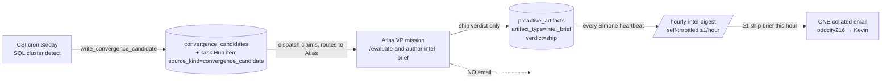
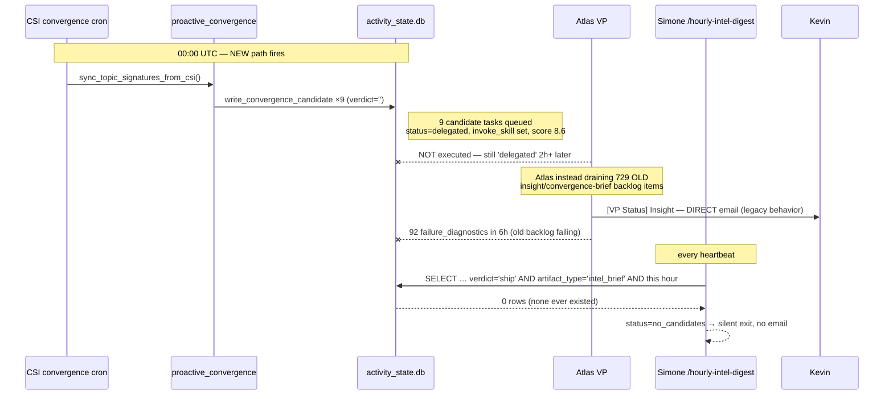

# Insight Pipeline Remediation Plan — Restore the Hourly Collated Digest

**Status:** Plan for review — no code written yet.
**Author:** Claude (Opus 4.8) diagnostic session, 2026-05-28.
**Companion docs:** [`insight_pipeline_consolidation_spec.md`](insight_pipeline_consolidation_spec.md) (the original A–E design), [`agentmail_residual_volume_investigation.md`](agentmail_residual_volume_investigation.md).
**Deployed SHA at diagnosis:** `6e03d331` (VPS `/api/v1/version` parity with `origin/main`).

---

## 1. Operator-visible symptom

> "I have yet to see the hourly batch email. No new insights today, whereas before we got them every couple minutes. Then I got ONE insight email — but it's Atlas emailing me directly, not the collated hourly grouping. Is this the AgentMail 429 problem?"

**Short answer: this is NOT an email-transport problem.** The `[VP Status] Insight` email you received proves outbound delivery works. The hourly digest never *attempts* to send because the upstream pipeline produces zero artifacts it can collate. AgentMail 429 / GWS-COI fallback is orthogonal and healthy — leave it as-is.

---

## 2. What was supposed to happen (the A–D design, now deployed)



Atlas sends **no** email. Simone sends **one** collated email per clock hour. Verified design citations:
- Atlas skill writes `upsert_artifact(artifact_type="intel_brief", ...)` then sets `verdict='ship'` — `.claude/skills/evaluate-and-author-intel-brief/SKILL.md:235,262`.
- Digest only consumes `intel_brief` with `verdict='ship'` created this hour — `src/universal_agent/services/hourly_intel_digest.py:59` (`ARTIFACT_TYPES = ("intel_brief",)`) and `:218-233`.
- Simone invokes it every heartbeat — deployed `memory/HEARTBEAT.md:224`.

---

## 3. What actually happens in production (code + live-DB verified)



### 3.1 Live-database evidence (VPS `AGENT_RUN_WORKSPACES/activity_state.db`, 1.5 GB)

| Probe | Result | Meaning |
|---|---|---|
| `proactive_artifacts` rows with `artifact_type='intel_brief'` | **0 ever** | New Atlas skill has never produced its output type |
| `proactive_artifacts` rows with non-empty `verdict` | **0 of 4264** | `/evaluate-and-author-intel-brief` has never set a verdict |
| `delivery_channel` column exists? | **No** | PR B migration partial; `is_throttled()` would throw on first real candidate |
| `convergence_candidates` table | **9 rows, all `2026-05-29T00:00:05Z`, verdict=''** | NEW generation path **works** (CSI cron `0 7,13,19 America/Chicago`) |
| Those 9 as Task Hub items | **`status='delegated'`**, `score=8.6`, `metadata.invoke_skill='evaluate-and-author-intel-brief'`, `preferred_vp='vp.general.primary'` | Correctly queued + routed, but **never executed** |
| Old `insight-brief:*` / `insight_detection` task items | **729** in `activity_state.db` | Large undrained legacy backlog |
| Latest `insight_brief_task` artifact | `2026-05-28T17:02Z` (≈1h before PR C deploy 18:06Z) | Old **generation** stopped at deploy; old **backlog** did not |
| `failure_diagnostic` artifacts last 6h | **92**, titled "ATLAS insight brief…/convergence brief…" | Atlas is **failing** on the old backlog while draining it |
| Both skills deployed on VPS | `.claude/skills/{evaluate-and-author-intel-brief,hourly-intel-digest}/SKILL.md` present | Skill files are not the gap |

### 3.2 The four real breaks

1. **Keystone — delegated candidates never execute.** The 9 well-formed `convergence_candidate` tasks sit at `status='delegated'` for 2h+ with `invoke_skill` set, but no VP mission runs `/evaluate-and-author-intel-brief`. Until this fires, `verdict='ship'`/`intel_brief` artifacts never exist and the digest is permanently empty. **Root unknown to confirm at implementation time:** does the dispatch→VP path read `metadata.invoke_skill` and actually launch the skill, or is Atlas's throughput starved by the failing old backlog (§3.2.2)? This is the first thing to instrument.

2. **Old backlog not decommissioned (deferred PR E).** 729 legacy `insight-brief` task items remain claimable. Atlas drains them with the **legacy direct-email behavior** (your `[VP Status]` email) and many **fail** (92 diagnostics/6h), consuming the VP throughput the new candidates need. The legacy generators are still in the tree and still reachable via the gateway hand-trigger endpoints:
   - `create_insight_brief_task` def `proactive_convergence.py:1032`, still called at `:728` inside `_detect_and_queue_convergence_async` (`:679`).
   - `detect_and_queue_convergence` (`:631`) still wired to gateway endpoints `gateway_server.py:21080` and `:21136`.
   - Spec §5.1 already lists these five functions for removal in PR E.

3. **PR B schema migration incomplete.** `verdict` column was added but `delivery_channel` was not. `hourly_intel_digest.py:114-116` (`ensure_schema_addons`) *would* add it, but that runs only when the digest executes — and `is_throttled()` (`:171`, queries `WHERE delivery_channel = ?`) would error the moment a real candidate appears if the column is still missing.

4. **No `convergence_candidate` routing rule in `todo_dispatch_service.py`.** The routing table (`:396`) names `insight_brief_task`/`convergence_brief_task` → Atlas but not `convergence_candidate`. The 9 tasks reached `delegated` anyway (so some default/`preferred_vp` path carried them), but the absence of an explicit rule is fragile and worth closing.

---

## 4. Why the "every couple minutes" flood stopped (so you can trust the diagnosis)

PR A raised the confidence floor (0.7→0.8), slowed the CSI cron to 3×/day, and replaced the convergence task descriptions' "email Kevin" instruction with a soft "do NOT email." On deploy (~18:06 UTC) the CSI loop switched from `create_insight_brief_task` to `write_convergence_candidate`, so **new** old-path generation ceased. The flood you remember was the old per-brief email stream; it stopped because generation stopped. What never arrived to replace it is the hourly digest — because of §3.2.

---

## 5. Remediation phases

Phases are ordered so the operator-visible win (a real hourly digest) lands as early as safely possible, with the destructive cleanup last.

### Phase 0 — Confirm the keystone (no code; ~30 min on VPS)
**Goal:** Prove *why* delegated candidates don't execute before changing anything.
- Inspect VP mission/run records and gateway logs for the 9 `cand_*` tasks: were missions created? did they invoke the skill? did they error, or never start?
- Check Atlas dispatch concurrency vs. the 729-item backlog + 92 failures — is throughput simply starved?
- **Decision gate:** if missions never launch → fix dispatch/invoke wiring (Phase 2). If they launch but don't run the skill → fix the skill-invocation contract (Phase 2). If they're merely starved → Phase 1 (drain backlog) may alone unblock them.

### Phase 1 — Stop the bleed: quarantine the legacy backlog + emails (code, low risk)
**Goal:** Stop the direct `[VP Status]` emails and free Atlas throughput.
- Mark the 729 stale `insight-brief:*` / `source_kind='insight_detection'` Task Hub items terminal (`status='cancelled'` with a reason), using the standard recovery verbs in `task_hub.py` — **do not** hand-roll a reaper (per CLAUDE.md / Doc 129).
- Hard-disable the legacy direct-email behavior at the source rather than relying on the soft "do NOT email" instruction (enforce it in the convergence task handler / Atlas directive).
- **Verify:** zero new `[VP Status] Insight` emails; `failure_diagnostic` rate drops.

```python
# Illustrative only — compose with existing task_hub verbs, do not invent a new path.
# Cancel stale legacy insight backlog so Atlas stops draining + emailing it.
stale = task_hub.find_items(source_kind="insight_detection", status_in=("queued","delegated","in_progress"))
for item in stale:
    task_hub.close_task(item.task_id, status="cancelled",
                        reason="Legacy insight path retired — superseded by convergence_candidate pipeline (remediation Phase 1)")
```

### Phase 2 — Make the new candidates execute end-to-end (code, core fix)
**Goal:** `convergence_candidate` → Atlas mission runs `/evaluate-and-author-intel-brief` → `intel_brief` + `verdict='ship'` artifact.
- Apply the Phase-0 finding: either add the explicit `convergence_candidate → Atlas + invoke_skill` dispatch rule in `todo_dispatch_service.py` (near `:396`), or fix the VP runtime so it honors `metadata.invoke_skill`.
- Add the explicit Atlas directive so the principal reliably invokes the skill when it claims a `convergence_candidate` (the skill name currently appears in **no** deployed directive — only in service code).
- **Verify (real artifact, per Doc 130):** after a CSI cron run, at least one new `proactive_artifacts` row with `artifact_type='intel_brief'` AND `verdict='ship'` exists, authored by a non-test Atlas mission.

### Phase 3 — Complete PR B's migration (code, tiny)
**Goal:** `delivery_channel` exists so the digest's throttle query can't throw.
- Ensure `delivery_channel TEXT NOT NULL DEFAULT ''` is added to `proactive_artifacts` (idempotent ALTER in the canonical migration, matching `hourly_intel_digest.py:116`), and backfill is a no-op default.
- **Verify:** `PRAGMA table_info(proactive_artifacts)` shows `delivery_channel` in `activity_state.db`.

### Phase 4 — Confirm the digest fires (verification, per Doc 130 Rule 6)
**Goal:** One real collated email.
- With ≥1 `intel_brief`/`verdict='ship'` brief created in a clock hour, confirm a Simone heartbeat sends exactly one digest from `oddcity216@agentmail.to` to `kevinjdragan@gmail.com`, and stamps `delivery_state='emailed'`, `delivery_channel='hourly_digest'`, `delivered_at` on the briefs.
- Confirm the next heartbeat in the same hour exits `throttled` (no duplicate).

### Phase 5 — PR E proper: delete the legacy generators (code, destructive — last)
**Goal:** Remove the dual pipeline permanently.
- Per spec §5.1, remove `track_a_concrete_convergence`, `track_b_ideation_synthesis`, `_detect_and_queue_convergence_async`, `create_convergence_brief_task`, `create_insight_brief_task`, and simplify the two gateway hand-trigger endpoints (`gateway_server.py:21048`, `:21099`) to call `write_convergence_candidate` (or remove them).
- Remove the disabled `hourly_insight_email` cron + `scripts/hourly_insight_email.py` if fully superseded.
- **Gate:** only after Phases 2–4 are verified live for ≥1–2 days.

---

## 6. Files in scope (citations)

| File | Lines | Role in fix |
|---|---|---|
| `services/proactive_convergence.py` | `204` sync, `295` `if upserted>0` gate, `390` `write_convergence_candidate`, `631/679/717/728` legacy, `1032` `create_insight_brief_task` | Phase 2 (gate review), Phase 5 (removals) |
| `services/todo_dispatch_service.py` | `~396` routing table | Phase 2 (add `convergence_candidate` rule) |
| `services/hourly_intel_digest.py` | `59`, `114-116`, `171`, `208-233` | Phase 3 (`delivery_channel`), Phase 4 (verify) |
| `task_hub.py` | recovery verbs (`close_task`/stale handling) | Phase 1 (cancel backlog) |
| `gateway_server.py` | `19592-19650` CSI cron, `21048/21099` hand-trigger endpoints | Phase 0 (confirm cron), Phase 5 (endpoint cleanup) |
| `.claude/skills/evaluate-and-author-intel-brief/SKILL.md` | `235`, `262` | Phase 2 (output contract reference) |
| `memory/HEARTBEAT.md` | `224` | Phase 2 (add Atlas directive nearby) |

---

## 7b. Implementation status (2026-05-28)

After live diagnosis on the VPS, the root cause was narrowed from the original
plan: routing and `invoke_skill` wiring **work** (Simone correctly claims
`convergence_candidate`, routes to Atlas, and queues a `convergence_evaluation`
mission with the skill in its objective). The break is in **VP mission
execution**, fixed by three surgical changes (this PR):

| # | Fix | File | Test |
|---|---|---|---|
| 1 | Promote `convergence_evaluation` → `operator_signal` tier (was resolving to `background`, the lowest, so the digest feeder was claimed dead-last behind every curation/insight mission and never ran). | `vp/mission_priority.py` | `test_convergence_evaluation_outranks_curation` |
| 2 | Add the missing `delivery_channel` column to the canonical `proactive_artifacts` schema (PR B added `verdict`/`verdict_reasoning` but omitted it; `hourly_intel_digest.is_throttled` queries it and would have errored on the first real candidate). | `services/proactive_artifacts.py` | `test_proactive_artifacts_delivery_channel.py` |
| 3 | Cap the curation runaway: `should_run_curation` now enforces a minimum dispatch interval (`UA_CURATOR_MIN_INTERVAL_MINUTES`, default 60) so the ≥10-pending-cards "immediate" trigger can't fire every heartbeat and flood the VP queue (~30/hr) — the feedback loop that buried the queue and starved the digest feeder. | `services/signal_curator.py` | `test_signal_curator_throttle.py` |

Also done out-of-band (operator-directed cleanup, not code): flushed the stale
backlog — cancelled 775 deprecated/orphaned Task Hub items, skip'd 9 stale
`convergence_candidates`, archived 2,525 deprecated artifacts, and cancelled
~295 queued VP missions (kept 2 `curation` as live test subjects) to give the
corrected pipeline a clean slate. Backup at
`AGENT_RUN_WORKSPACES/flush_backup_20260529T022441Z/`.

**Deferred (follow-up):** VP mission-worker concurrency is 1 (serial). The tier
fix + curation cap should keep operator_signal work flowing on a clean queue,
but if production shows sustained backlog, raising concurrency is the next
lever.

**Post-deploy verification (REQUIRED — branch ≠ deployed):**
1. Confirm deploy green + `/api/v1/version` SHA.
2. Confirm `delivery_channel` column now exists on the prod `activity_state.db`.
3. After the next CSI convergence cron, confirm a `convergence_evaluation`
   mission is **claimed and runs** (no longer stuck `queued`), and produces a
   `proactive_artifacts` row with `artifact_type='intel_brief'` AND
   `verdict='ship'` AND a non-empty `artifact_path` (brief authored to disk).
4. Confirm a Simone heartbeat then sends **one** collated digest from
   `oddcity216@agentmail.to` and stamps `delivery_state='emailed'`,
   `delivery_channel='hourly_digest'`, `delivered_at`.
5. Confirm curation dispatch rate drops to ≤1/hr.

## 7. Notes / open items
- **Secondary, not in scope:** `activity_state.db` is **1.5 GB**. Worth a compaction/retention pass separately; it will eventually hurt the digest's `created_at`-filtered scans.
- **`if upserted > 0` gate (`proactive_convergence.py:295`):** cluster detection only runs when *new* signatures were ingested that run. The 19:00 CDT run produced 9 candidates, but 07:00/13:00 may have produced none if no new CSI signatures landed. Consider decoupling cluster detection from `upserted>0` so existing-but-unclustered signatures still get evaluated. Flagged for Phase 0 review.
- **AgentMail/GWS:** confirmed healthy and orthogonal — no action.
- **Timezone:** all DB timestamps are UTC; operator-facing strings must convert to Houston time (project memory).
