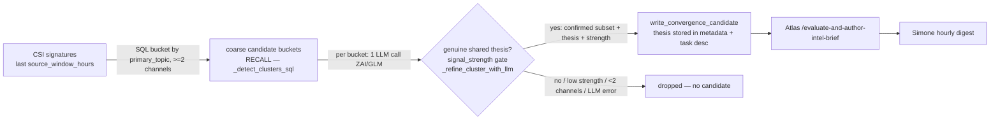

# LLM Convergence Clustering — Precision Layer for Candidate Generation

**Status:** Implemented 2026-05-29.
**Companion:** [`insight_pipeline_consolidation_spec.md`](insight_pipeline_consolidation_spec.md), [`insight_pipeline_remediation_plan_2026-05-28.md`](insight_pipeline_remediation_plan_2026-05-28.md).

## 1. Problem

Live verification of the insight pipeline (2026-05-29) confirmed the execution path works end-to-end, but **Atlas correctly skipped 100% of candidates.** Its verdict reasoning was the diagnosis:

> SKIP — cluster is an over-broad topic-bucket artifact, not a convergence signal: the 'ai_coding' tag is applied identically to obviously non-AI content (cooking, true crime, Zcash/crypto, police bodycam, ADHD). No shared thesis across ≥2 independent channels. Consistent with all 8 sibling candidates.

Root cause: `_detect_clusters_sql` (`services/proactive_convergence.py`) buckets signatures by a **coarse `primary_topic` string** (from CSI category tags) and emits a `convergence_candidate` for any bucket with ≥2 channels. That's string-matching standing in for semantic judgment — exactly the anti-pattern `CLAUDE.md` warns against ("avoid programmatic trend/theme systems that imitate reasoning; code collects evidence, LLMs synthesize meaning"). The buckets are almost all false, so every candidate skips → the hourly digest never gets fuel. Each false candidate also costs a full Atlas VP mission to evaluate-and-skip, saturating the single VP worker.

## 2. History (what changed and why)

The original pipeline had **LLM detection** — `track_a_concrete_convergence` did deep semantic comparison with a `signal_strength ≥ 8/10` gate; `track_b_ideation_synthesis` synthesized narratives. The consolidation (PR A/C) replaced both with the SQL string-match, citing cost (~$1.20/day for hourly Track A) and "let Atlas filter the noise." The cost goal was met; the quality bet failed — the SQL recall produces ~all noise, so Atlas filters everything to zero.

**Operator decision (2026-05-29):** ZAI/GLM inference quota is abundant, so an LLM detection pass — even hourly — is effectively free. The cost argument for SQL-only no longer holds.

## 3. Architecture

Restore LLM judgment at detection, structured as **cheap recall (code) → precision (LLM)**, per the LLM-native philosophy:

- **Recall (unchanged, cheap):** `_detect_clusters_sql` groups by shared `primary_topic` across ≥2 channels. Over-broad on purpose — it's a net.
- **Precision (new, `_refine_cluster_with_llm`):** one bounded ZAI call per bucket judges whether the videos genuinely converge on one specific story/thesis, returns the converging subset + a one-line thesis + `signal_strength` (1-10). Routed through `llm_classifier._call_llm` (ZAI emulation layer; model `resolve_opus()` → GLM).
- **Gate:** emit a candidate only when `is_convergence` AND `signal_strength ≥ UA_CONVERGENCE_MIN_STRENGTH` (default 7) AND the confirmed subset spans ≥2 independent channels. **Fails closed** — any LLM/parse error drops the bucket (no false candidate).
- **Thesis flows downstream:** stored on `convergence_candidates.metadata` and injected into the Atlas task description, so Atlas evaluates against the LLM's stated thesis instead of re-deriving from scratch.

The LLM reasons over **titles + summaries + key_claims** (rich evidence), so it sidesteps the coarse `primary_topic` tags entirely — no need to fix CSI tagging first.

## 4. Cadence

CSI convergence cron moved from 3×/day back to **hourly within the active window** (`UA_CSI_CONVERGENCE_CRON_EXPR` default `0 6-21 * * *`, America/Chicago). Respects the content-generation dormancy window (no overnight runs). Detection now runs every call (not gated on `upserted > 0`) so genuine convergence in the existing window is found even when no new signatures landed; idempotency comes from `candidate_id` stability + write-once verdict semantics.

## 5. Why precision also relieves the worker bottleneck

Cluster quality and VP-worker concurrency are the same problem. Garbage clusters → ~9 skip-missions/run → the single serial VP worker saturates skipping junk. High precision collapses volume to a handful of *real* candidates, so the concurrency pressure largely resolves on its own. (Raising `UA_MAX_CONCURRENT_VP_GENERAL` / worker concurrency remains a separate, secondary lever — re-measure after this lands.)

## 6. Config

| Env | Default | Effect |
|---|---|---|
| `UA_CONVERGENCE_LLM_CLUSTERING` | `1` | LLM precision layer on. `0` → legacy raw SQL string-match (rollback). |
| `UA_CONVERGENCE_MIN_STRENGTH` | `7` | Min LLM `signal_strength` (1-10) to emit a candidate. |
| `UA_CSI_CONVERGENCE_CRON_EXPR` | `0 6-21 * * *` | Hourly, active window. |

## 7. Code

| File | Change |
|---|---|
| `services/proactive_convergence.py` | `_CLUSTER_REFINE_SYSTEM` prompt; `_refine_cluster_with_llm`; `_detect_clusters_llm[_async]`; `sync_topic_signatures_from_csi` uses LLM path (flag-gated); `write_convergence_candidate` + `_candidate_task_description` accept/surface `thesis`/`signal_strength`. |
| `gateway_server.py` | CSI cron cadence → `0 6-21 * * *`. |
| `tests/unit/test_convergence_llm_clustering.py` | Gating, fail-closed, env knobs. |

## 8. Verification (post-deploy)

1. After a CSI cron run, confirm `convergence_candidates` rows carry a non-empty `metadata.thesis` and `signal_strength ≥ 7`.
2. Confirm the candidate count per run drops sharply vs. the prior ~9 garbage buckets.
3. Confirm Atlas now **ships** at least some candidates (verdict='ship' → `intel_brief` artifact with a brief on disk).
4. Confirm Simone's hourly digest sends a real collated email once a ship brief exists in the hour.
