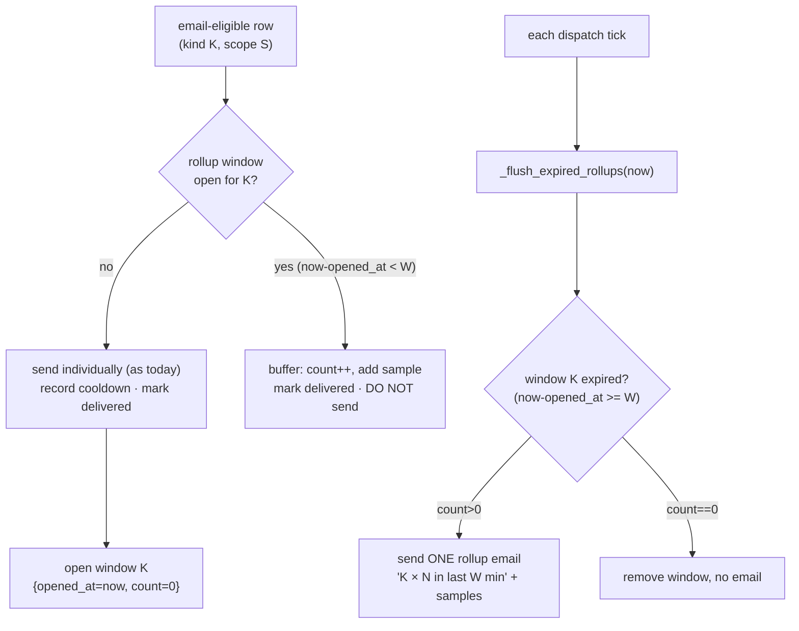

# Notification Alert Rollup — Spec

> **Status:** Approved for implementation (2026-05-28). Scopes the single highest-impact change from the AgentMail residual-volume investigation (`agentmail_residual_volume_investigation.md` § 5, Issue A).
> **Owner module:** `src/universal_agent/services/notification_dispatcher.py` (single file; no insight-pipeline files touched).

---

## 1. Problem

`NotificationDispatcher` drains `error`/`warning` activity rows to email/Telegram every 30s. Its only de-dup is a per-`(kind, scope, channel)` 5-minute cooldown (`_DEFAULT_COOLDOWN_SECONDS = 300`, scope from `_scope_key_for_record`). The cooldown protects against **one flapping task** re-emitting the same `(kind, scope)`. It does **nothing** against an **incident** that fails many *different* scopes of the same kind at once — each scope is "new," so each emails.

Witnessed (2026-05-28 00:00–03:53 UTC): one deploy/scheduler incident produced ~14 operator emails — 5 `calendar_missed` ("Missed Scheduled Event") firing within 1 second (5 distinct scopes), plus a `execution_missing_lifecycle_mutation` series (DB-confirmed emailed at 01:38, 01:40, 01:48, 02:43, 03:53 UTC) from in-flight `daemon_simone_todo` runs killed together. The cooldown coalesced none of it.

**Goal:** cap incident fan-out without (a) delaying the *first* alert of a kind, (b) losing information, or (c) touching the dashboard stream or any insight-pipeline code.

---

## 2. Design — per-kind rollup window

Add a **scope-agnostic, per-`kind` rollup window** layered *above* the existing cooldown, for the **email** channel only (the witnessed problem; Telegram is low-volume and often unconfigured — out of scope for v1).

Behavior per email-eligible row (in `_deliver_email_for_row`):

1. **First alert of a `kind`** (no open window for that kind): send immediately exactly as today (records cooldown, marks delivered) **and open a rollup window** for that kind: `{opened_at: now, count: 0, samples: []}`.
2. **Subsequent alerts of the same `kind`** while its window is open (`now - opened_at < W`): do **not** send individually. Instead **buffer** (increment `count`, append a short sample line, mark the row delivered so it cannot re-surface) and return.
3. **Window close:** each tick, `_flush_expired_rollups(now)` scans open windows. For any window with `now - opened_at >= W`:
   - if `count > 0` → send **one rollup email** ("`<kind>` × N additional alerts in the last W min" + sample list) and remove the window;
   - if `count == 0` (the isolated-alert case) → just remove the window, no email.

This preserves first-alert immediacy, collapses everything else in the window into a single rollup, and is information-preserving (the rollup lists every collapsed event). It composes with — does not replace — the existing per-`(kind, scope)` cooldown (which still governs the first-send path and same-scope re-delivery across windows).

### Why not the simpler alternatives
- **Within-tick grouping only** (group rows seen in one `dispatch_pending_once`): misses storms that span ticks (the lifecycle series spread over minutes → different ticks). Rejected.
- **Coarsen the cooldown scope to per-kind**: would *delay-then-send* every duplicate (cooldown skips don't drop, they retry), turning a storm into a slow drip of N emails over time rather than 1. Rejected.

---

## 3. Config (env, all optional, prod-safe defaults)

| Var | Default | Meaning |
|---|---|---|
| `UA_NOTIFICATION_ROLLUP_ENABLED` | `1` | Master switch. `0` → exact current behavior (no rollup). |
| `UA_NOTIFICATION_ROLLUP_WINDOW_SECONDS` | `180` | Window W. After the first alert of a kind, same-kind alerts within W roll up. |

Both read in `gateway_server.py` at dispatcher construction and passed into `NotificationDispatcher.__init__`. Alerts remain 24/7 (infrastructure-event handlers — no dormancy); rollup changes only *batching*, not *whether* alerts fire.

---

## 4. Code changes (one file + wiring + tests)

**`services/notification_dispatcher.py`:**
- `__init__`: add `rollup_enabled: bool = True`, `rollup_window_seconds: float = 180.0`; init `self._rollup_open: dict[str, dict] = {}`.
- New `_format_rollup_email(kind, count, samples) -> (subject, text, html)`.
- `_deliver_email_for_row`: after the channel + `_row_already_delivered` checks and before the cooldown send, insert the rollup branch (buffer if window open; else fall through to normal send then open a window). Mark buffered rows delivered via `self._mark_delivered`.
- New `async def _flush_expired_rollups(self, summary)`: send rollups for expired windows; add `email_rolled_up` and `rollup_emails_sent` to the summary dict.
- `dispatch_pending_once`: call `await self._flush_expired_rollups(summary)` once per tick (after the row loop) and add the two new summary counters. Also flush on `run_loop` shutdown is **not** required (best-effort; a pending rollup flushes on the next live tick or is lost on restart — acceptable for alerts).

**`gateway_server.py`** (dispatcher construction ~`:15114`): pass `rollup_enabled` / `rollup_window_seconds` from the two new env vars. No other call sites.

**Tests** (`tests/unit/test_notification_dispatcher*.py`): use the injected `now_fn` to drive time deterministically.
- First alert of a kind sends immediately; window opens.
- 2nd–Nth same-kind alerts within W are buffered (not sent), rows marked delivered, `email_rolled_up` increments.
- After W elapses, one rollup email sends listing N samples; window cleared.
- Isolated single alert → no rollup email at window close.
- Two different kinds maintain independent windows.
- `rollup_enabled=False` → exact legacy behavior (every alert sends, no rollup).
- Cooldown still applies on the first-send path.

---

## 5. Rollout / rollback

- Pure additive; default-on but fully revertible via `UA_NOTIFICATION_ROLLUP_ENABLED=0` (no redeploy needed if set in env).
- No schema, no new tables, no dashboard change. The dashboard still shows every individual row (rollup only affects the email channel).
- Smoke after merge: confirm a normal single alert still emails promptly; optionally synthesize a burst of same-kind rows and confirm one rollup email.
