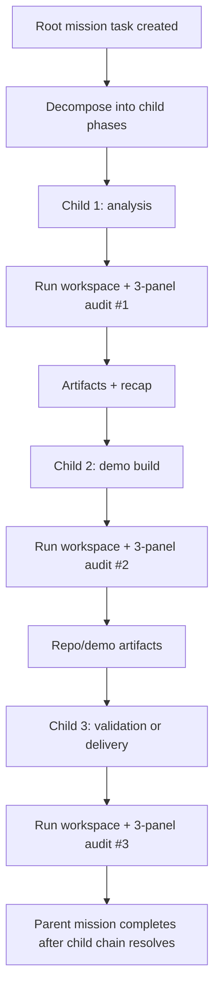
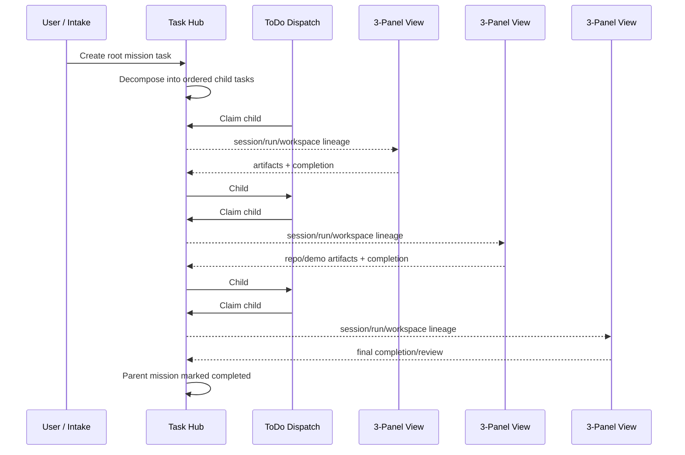

# Meaningful Work Task Hub + Three-Panel Design (2026-05-06)

## Purpose

This document proposes a concrete design for making the Task Hub the universal ledger for **meaningful autonomous work** while preserving the three-panel viewer as the canonical audit surface.

It also answers a specific workflow question:

> When a mission includes multiple dependent phases, such as video analysis followed by a separate code demo build in a different workspace, should that remain one task, or should it split into multiple tracked executions?

## Short Answer

Use **one parent mission** plus **sequential child tasks**, where each child task gets:

- its own Task Hub lifecycle
- its own run/session/workspace lineage
- its own three-panel audit surface
- its own artifacts

Do **not** keep the entire flow as one flat task if later phases produce independent workspaces or materially different artifacts.

Do **not** create unrelated sibling tasks with no lineage.

The right model is:

- one umbrella mission record
- multiple ordered child executions
- one audit trail per meaningful phase
- one chain tying them together

## Why This Fits the Existing Code

The current codebase already has most of the primitives needed.

### 1. Task Hub already supports parent/child lineage

`task_hub_items` already stores:

- `parent_task_id`
- `subtask_role`
- `workstream_id`

Code citation:

- `file:///home/kjdragan/lrepos/universal_agent/src/universal_agent/task_hub.py#L493-L560`

### 2. Task Hub already supports decomposition trees

The backend already provides:

- `decompose_task(...)`
- `list_subtasks(...)`
- `get_decomposition_tree(...)`
- `complete_subtask_and_check_parent(...)`

Code citations:

- `file:///home/kjdragan/lrepos/universal_agent/src/universal_agent/task_hub.py#L3122-L3268`
- `file:///home/kjdragan/lrepos/universal_agent/src/universal_agent/gateway_server.py#L22141-L22205`

### 3. Task Hub already tracks proactive chains and continuations

Task history already exposes a proactive chain summary with:

- `root_task_id`
- `parent_task_id`
- `children`
- `child_count`
- `continuation_count`

Code citation:

- `file:///home/kjdragan/lrepos/universal_agent/src/universal_agent/task_hub.py#L1725-L1778`

There is also an existing continuation pattern for “fresh session, linked to prior work” in `create_proactive_feedback_continuation(...)`.

Code citation:

- `file:///home/kjdragan/lrepos/universal_agent/src/universal_agent/task_hub.py#L1452-L1550`

### 4. The viewer contract is already meant to be shared across all producers

The three-panel viewer is already the canonical surface for all producers:

- Task Hub
- Sessions
- Calendar
- Proactive
- Chat

Code citations:

- `file:///home/kjdragan/lrepos/universal_agent/web-ui/lib/viewer/openViewer.ts#L1-L130`
- `file:///home/kjdragan/lrepos/universal_agent/src/universal_agent/api/viewer_routes.py#L1-L85`

### 5. Completed/history views already preserve execution lineage per task

Task Hub completed/history endpoints already expose:

- `canonical_execution_session_id`
- `canonical_execution_run_id`
- `canonical_execution_workspace`

Code citation:

- `file:///home/kjdragan/lrepos/universal_agent/src/universal_agent/gateway_server.py#L22692-L22960`

## Design Principle

The right unit for the three-panel viewer is not “the entire business mission.”

The right unit is:

> **one meaningful execution phase that has its own run, workspace, artifacts, and outcome**

That means:

- “analyze the video and understand it” is one execution phase
- “build a code demo from what was learned” is another execution phase
- “validate/demo/package the build” may be a third execution phase

These should each have their own three-panel view because the viewer is strongest when:

- the transcript matches one coherent job
- the file browser points at one coherent workspace
- the tool trace corresponds to one phase of work

## Proposed Model

### A. One Parent Mission Task

Create a root Task Hub item that represents the user’s high-level objective.

Example:

- `title`: “Analyze YouTube video and produce code-backed demo”
- `source_kind`: `email`, `dashboard_quick_add`, `reflection`, etc.
- `status`: may remain `open`, `decomposed`, or become a mission summary record

The parent task should not be the only execution surface. It is the mission anchor.

### B. Ordered Child Tasks For Meaningful Phases

Create child tasks using `parent_task_id=<root_task_id>`.

Example chain:

1. `subtask_role=analysis`
   Purpose: analyze video, extract findings, write report, capture requirements.
2. `subtask_role=demo_build`
   Purpose: create repo/demo workspace based on the analysis artifacts.
3. `subtask_role=demo_validation`
   Purpose: run/inspect/verify the demo and package outputs.
4. `subtask_role=delivery`
   Purpose: send the consolidated result or stage the final review.

Each child task should be independently completable and independently auditable.

This is already aligned with the decomposition contract:

- “Each subtask must be independently completable.”

Code citation:

- `file:///home/kjdragan/lrepos/universal_agent/src/universal_agent/services/decomposition_agent.py`

### C. Sequential, Not Parallel, When Knowledge Flows Forward

For the specific case the user described, parallel execution is the wrong default.

If the demo build depends on:

- what the analysis discovered
- what patterns were extracted
- what constraints the first phase learned

then the child tasks should run **sequentially**.

The first child should produce:

- report artifacts
- recap metadata
- workspace references
- any structured task metadata needed by the second phase

Then the second child begins in a fresh run/session with that context injected.

This is conceptually similar to the existing proactive continuation pattern, which creates a new task with references to the previous workspace and prior recap instead of forcing all work into one long-lived session.

Code citation:

- `file:///home/kjdragan/lrepos/universal_agent/src/universal_agent/task_hub.py#L1474-L1529`

## Recommended Lifecycle

### Flowchart

### Sequence Diagram

## Why This Is Better Than One Giant Task

If the entire flow stays inside one task:

- the three-panel transcript becomes mixed-purpose
- the file browser loses coherence when later work moves into a separate repo/demo workspace
- operator auditing becomes harder because the “analysis” work and “demo build” work are interleaved
- child outputs are harder to evaluate independently

In contrast, separate child tasks give you:

- one viewer per phase
- one workspace per phase
- one artifact set per phase
- one completion outcome per phase
- one mission-level chain tying them together

## Why This Is Better Than Totally Separate Unrelated Tasks

If the phases become unrelated tasks with no parent/child linkage:

- you lose the mission narrative
- you lose ordered lineage
- the operator cannot easily tell that the demo build derived from the analysis task
- completed columns and history views become operationally noisier because related work fragments across the board

The parent/child model preserves relatedness without collapsing execution into one monolith.

## Proposed UI Behavior

### 1. Root Task Card

The root task should show:

- title
- source kind
- child progress summary
- current active child phase
- expandable list of child tasks

This is already conceptually aligned with decomposition trees and proactive chains, though not yet fully surfaced in the main ToDo board.

### 2. Child Task Cards

Each child task should behave like a normal Task Hub execution item:

- `Not Assigned`
- `In Progress`
- `Needs Review`
- `Completed`

Each child gets its own `Workspace` button opening its own three-panel view.

### 3. Parent-Level History

The parent task’s history should aggregate:

- all child tasks
- all child runs
- all child workspaces
- all child recaps/artifacts

That gives the operator both:

- narrow phase-level audit
- broad mission-level audit

### 4. Completed Column Behavior

I would not flood the completed column with both parent and every child if that becomes noisy.

Recommended rule:

- child tasks appear as normal completed work items
- parent mission appears as a grouped summary record once the chain is finished, or only in history/detail views

That preserves auditability without doubling visible noise.

## Proposed Data Model Usage

### Use existing fields

- `parent_task_id`: link each phase to the mission root
- `subtask_role`: classify phases like `analysis`, `demo_build`, `validation`, `delivery`
- `workflow_manifest.workflow_kind`: keep phase semantics explicit
- `canonical_execution_*`: preserve run/session/workspace for each child task

### Use `workstream_id` as a mission-group key

The schema already stores `workstream_id`, but it is not meaningfully surfaced in the current UI/read-model paths.

Code citation:

- `file:///home/kjdragan/lrepos/universal_agent/src/universal_agent/task_hub.py#L493-L560`

I recommend using it as a shared mission-group key across the parent and all children. That gives a second grouping axis:

- `parent_task_id` for tree structure
- `workstream_id` for mission-wide filtering/searching/reporting

This is especially useful if later phases spawn grandchildren or support tasks.

## Proposed Default Policy

### When to keep work as one task

Keep one task only when:

- the work is one coherent execution phase
- artifacts stay in one workspace
- the transcript/tool trace remains understandable as one job

### When to split into sequential child tasks

Split when:

- later phases need their own repo/workspace
- later phases depend on earlier learning
- the artifact set materially changes
- the operator would benefit from separate 3-panel audits

Examples:

- video analysis -> code demo build
- report research -> slide deck creation
- remediation diagnosis -> code fix -> validation
- intelligence packet -> repo prototype -> packaged delivery

### When parallelism is allowed

Parallelism is acceptable only if child phases are genuinely independent.

It should **not** be the default when:

- phase B depends on phase A findings
- phase B needs phase A artifacts as inputs
- phase B requires interpretation from phase A’s transcript/report

## Recommendation

For the user’s specific scenario, I recommend:

1. Create one parent mission task.
2. Decompose it into sequential child tasks.
3. Give each child task its own run/session/workspace.
4. Open each child task through its own three-panel view.
5. Preserve parent/child/workstream lineage so operators can inspect either:
   - the whole mission
   - one exact execution phase

This is the best compromise between:

- consistency
- auditability
- low noise
- workspace clarity
- preserving the real dependency chain

## Implementation Direction

The codebase does **not** need a brand-new tracking system first.

The most leverage comes from:

1. Treating “meaningful work” as parent/child Task Hub missions.
2. Making decomposition/child-task progression first-class in the main Task Hub dashboard, not just in special history views.
3. Ensuring every child task gets clean canonical execution lineage so the Workspace button always opens the correct three-panel trace.

That preserves the elegance of the three-panel viewer while fixing its current weakness for multi-phase missions.
