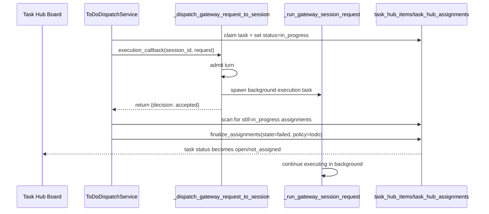
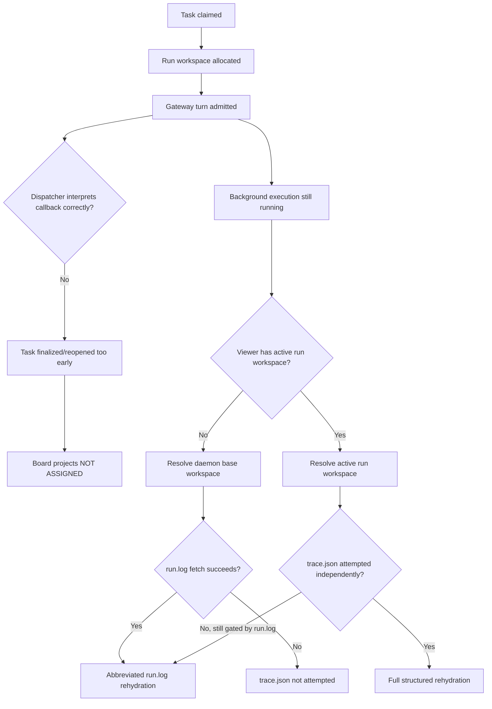

# Task Hub Happy-Path Audit (2026-05-06)

## Scope

This report explains why a To Do execution can appear active in the session viewer while the Task Hub board still shows the card under `NOT ASSIGNED`, and why the rehydrated middle-column activity sometimes degrades to terse `rehydrated TOOL CALL` rows instead of full tool detail.

Primary user-observed symptoms:

- A Task Hub item is visibly executing in a Simone ToDo workspace, but the `/dashboard/todolist` board still renders it under `NOT ASSIGNED`.
- The session viewer rehydrates with abbreviated `run.log` rows instead of the richer `trace.json` detail that later live streaming shows.

This report is code-verified. Every architectural claim is backed by source citations.

## Executive Summary

The system is currently off the happy path for four linked reasons:

| Severity | Finding | Why it breaks the happy path |
| --- | --- | --- |
| P0 | `ToDoDispatchService` treats "turn admitted" as "run completed" | It can reopen or de-assign a task while the agent is still executing it, which directly explains "workspace active, board says not assigned." |
| P1 | ToDo dispatch does not stamp the live daemon session with `active_run_id` / `active_run_workspace` | The viewer/file resolver cannot reliably locate the current run workspace for live ToDo sessions. |
| P1 | The viewer only attempts `trace.json` hydration after a successful `run.log` fetch | If `run.log` resolves to the wrong place or is absent, the richer rehydration source is never tried. |
| P1 | Gateway `run.log` persistence is session-scoped while execution context is run-scoped | The system splits runtime evidence across two roots, making file resolution and rehydration inconsistent. |

Net effect: lifecycle state, workspace resolution, and hydration source selection are not aligned around one canonical "active run" identity.

## Happy Path Definition

The intended happy path is:

1. A Task Hub item is claimed.
2. The Task Hub item remains `in_progress` until the execution run truly finishes or is explicitly dispositioned.
3. The board renders the item in `IN PROGRESS`.
4. The viewer resolves the active run workspace for that live session.
5. Rehydration prefers `trace.json` and shows full tool-call detail.
6. After explicit completion/review/block, the Task Hub item transitions to its terminal lane.

The claim logic already encodes that model: `claim_task_for_agent(...)` writes the assignment row, sets `dispatch.active_*`, and flips the item to `TASK_STATUS_IN_PROGRESS`. See `src/universal_agent/task_hub.py` lines 1173-1242.

Code citation:

- `file:///home/kjdragan/lrepos/universal_agent/src/universal_agent/task_hub.py#L1173-L1242`

## Current Breakpoints

### 1. Premature Task Cleanup After Mere Admission

#### What the code does

`ToDoDispatchService._process_session(...)` allocates a run workspace, updates assignment lineage, builds a `GatewayRequest`, and then awaits `self.execution_callback(...)`. After that callback returns, it assumes the run is over and performs a "stuck assignment" sweep that finalizes any still-`in_progress` tasks as failed/reopened.

Code citations:

- ToDo claim, run allocation, and request build:
  `file:///home/kjdragan/lrepos/universal_agent/src/universal_agent/services/todo_dispatch_service.py#L708-L900`
- Premature post-callback cleanup assumption:
  `file:///home/kjdragan/lrepos/universal_agent/src/universal_agent/services/todo_dispatch_service.py#L903-L1017`

#### Why that assumption is wrong

The configured callback is `_dispatch_gateway_request_to_session(...)`, but that function only admits the turn, spawns the real execution as an `asyncio` background task, registers it, and immediately returns `{"decision": "accepted"}`.

Code citation:

- `file:///home/kjdragan/lrepos/universal_agent/src/universal_agent/gateway_server.py#L7638-L7684`

So the callback return means:

- the request was accepted
- the real run was scheduled

It does **not** mean:

- the agent finished
- the task was dispositioned
- the run workspace is complete

#### Resulting failure mode

The dispatcher then scans for claimed tasks still in `TASK_STATUS_IN_PROGRESS` and calls `finalize_assignments(... policy="todo", state="failed")`. In the retryable path, that code reopens the task back to `TASK_STATUS_OPEN`.

Code citations:

- Stuck scan trigger:
  `file:///home/kjdragan/lrepos/universal_agent/src/universal_agent/services/todo_dispatch_service.py#L946-L1017`
- Retryable ToDo finalization reopens to `open`:
  `file:///home/kjdragan/lrepos/universal_agent/src/universal_agent/task_hub.py#L2581-L2616`

Once reopened, the board projection will classify the item as `not_assigned` unless it can still find a live assignment row or `dispatch.active_*` metadata.

Code citation:

- `file:///home/kjdragan/lrepos/universal_agent/src/universal_agent/gateway_server.py#L22606-L22654`

#### Sequence Diagram



#### Why this is the primary explanation for the board symptom

This is the only code path found that both:

- starts real execution, and
- can revert the Task Hub item immediately afterward without waiting for that execution to finish.

That exactly matches the user-observed mismatch: active workspace chatter plus a card back in `NOT ASSIGNED`.

### 2. Live ToDo Sessions Do Not Publish Active Run Lineage Like Chat-Panel Runs Do

#### What the viewer expects

Live session payloads and file resolution prefer `session.metadata["active_run_id"]` and `session.metadata["active_run_workspace"]`.

Code citations:

- Active run lookup for live payloads:
  `file:///home/kjdragan/lrepos/universal_agent/src/universal_agent/gateway_server.py#L4180-L4235`
- File resolver prefers active run workspace for daemon sessions:
  `file:///home/kjdragan/lrepos/universal_agent/src/universal_agent/gateway_server.py#L16175-L16245`

#### What chat-panel intake already does correctly

The chat-panel execution path allocates a run and explicitly stamps the session metadata:

```python
session.metadata["active_run_id"] = run_ctx.run_id
session.metadata["active_run_workspace"] = run_ctx.workspace_dir
```

Code citation:

- `file:///home/kjdragan/lrepos/universal_agent/src/universal_agent/gateway_server.py#L6953-L6988`

#### What ToDo dispatch does instead

ToDo dispatch allocates the run and updates assignment lineage, but it does not perform the equivalent session metadata stamp before invoking the execution callback.

Code citation:

- `file:///home/kjdragan/lrepos/universal_agent/src/universal_agent/services/todo_dispatch_service.py#L729-L756`
- Request metadata includes `workflow_run_id` and `workspace_dir`, but that is not the same as live session metadata:
  `file:///home/kjdragan/lrepos/universal_agent/src/universal_agent/services/todo_dispatch_service.py#L882-L900`

#### Consequence

The live daemon session can exist without an authoritative active run workspace attached to the session object, even though the assignment row knows it. That makes viewer resolution dependent on indirect fallback behavior rather than a canonical live pointer.

### 3. Viewer Rehydration Only Tries `trace.json` After `run.log` Succeeds

#### What the code does

The viewer hydration flow fetches `run.log` first. It only enters the `trace.json` branch inside `else if (fetchedRaw)`, meaning the richer structured source is skipped entirely if `run.log` fetch fails or resolves to the wrong workspace.

Code citation:

- `file:///home/kjdragan/lrepos/universal_agent/web-ui/app/page.tsx#L1944-L2095`

#### Why that matters here

The UI already has full-fidelity rehydration support in `extractHistoryFromTraceJson(...)`:

- structured messages
- thinking blocks
- structured tool calls
- structured tool results

But that code is gated behind successful raw-log retrieval.

Code citation:

- `file:///home/kjdragan/lrepos/universal_agent/web-ui/app/page.tsx#L217-L411`

#### Consequence

When the viewer resolves the wrong workspace for `run.log`, it never even attempts the better source. The result is the terse fallback rows the user called out.

### 4. The Gateway Violates the Canonical Run-Workspace Resolver Contract

`resolve_active_execution_workspace(...)` explicitly states that downstream code should use the run-scoped workspace from assignment or request metadata, not default blindly to the session transport workspace.

Code citation:

- `file:///home/kjdragan/lrepos/universal_agent/src/universal_agent/services/execution_run_service.py#L230-L264`

But `_run_gateway_session_request(...)` opens `run.log` directly under `session.workspace_dir`, while the request runtime context for the same execution uses `resolve_active_execution_workspace(...)`.

Code citations:

- Session-scoped `run.log` write:
  `file:///home/kjdragan/lrepos/universal_agent/src/universal_agent/gateway_server.py#L7037-L7044`
- Run-scoped request runtime context:
  `file:///home/kjdragan/lrepos/universal_agent/src/universal_agent/gateway_server.py#L7072-L7082`

#### Why this is a structural issue

The system is effectively maintaining two competing roots during the same ToDo execution:

- session workspace for `run.log`
- run workspace for execution context / assignment lineage

That split-brain layout makes hydration and viewer file resolution fragile even before the premature cleanup bug is considered.

## Why This Is Not On the Happy Path

### Flowchart



### In plain terms

The happy path fails because the system has no single authoritative answer to two questions:

1. "Is this task still actively executing?"
2. "Which workspace is the active execution workspace for this session right now?"

Those two answers currently live in partially overlapping places:

- `task_hub_items.status`
- `task_hub_assignments.state`
- `metadata.dispatch.active_*`
- `session.metadata.active_run_*`
- viewer resolver fallback logic
- frontend hydration source selection

That redundancy is survivable only if every layer agrees on timing. Right now they do not.

## Coverage Gaps

### 1. Existing ToDo dispatch tests verify `executing_sessions`, not end-to-end completion semantics

The dedicated regression file focuses on the existence and cleanup of `executing_sessions`, but the mocked callback returns `"accepted"` immediately. That mirrors the problematic contract rather than testing that the dispatcher waits for the actual run to finish.

Code citation:

- `file:///home/kjdragan/lrepos/universal_agent/tests/gateway/test_todo_dispatch_executing_sessions.py#L1-L168`

### 2. Agent queue tests cover orphan reconciliation and projection shape, not premature reopen during active execution

Current queue tests validate serialization and orphan repair, but there is no regression case for:

- active execution still running
- callback already returned
- board must still remain `in_progress`

Code citation:

- `file:///home/kjdragan/lrepos/universal_agent/tests/gateway/test_dashboard_agent_queue.py#L89-L237`

### 3. Viewer tests validate resolver contracts, not hydration source fallback ordering

Viewer end-to-end tests confirm resolution shape, but not the important scenario:

- `run.log` missing or wrong
- `trace.json` available
- viewer should still hydrate from trace

Code citation:

- `file:///home/kjdragan/lrepos/universal_agent/tests/viewer/test_viewer_e2e.py#L1-L144`

## Opportunities

### Opportunity 1. Make execution completion semantics explicit

The dispatcher should wait on "run finished" rather than "turn admitted." The current callback contract is too ambiguous for lifecycle management.

### Opportunity 2. Use one canonical active-run pointer everywhere

The system already has the right shape:

- `workflow_run_id`
- `workspace_dir`
- `active_run_id`
- `active_run_workspace`

The opportunity is to make one of those the canonical source for:

- board state
- viewer resolution
- run.log / trace placement
- session payloads

### Opportunity 3. Decouple `trace.json` hydration from `run.log` success

The viewer should treat `trace.json` as a first-class source, not as a dependent child of raw-log availability.

### Opportunity 4. Eliminate split-brain logging roots

If run-scoped execution is canonical, then `run.log`, `trace.json`, transcript, and work products should all resolve from the same active run workspace.

## Recommended Repair Order

This is not an implementation plan yet; it is the recommended discussion order.

1. Fix the execution lifecycle contract first.
   Why: this is the root cause of the incorrect board lane.
2. Fix live session active-run metadata publication second.
   Why: the viewer cannot reliably resolve the correct workspace otherwise.
3. Fix hydration source selection third.
   Why: once the correct run workspace is visible, the viewer should still prefer structured trace data even if raw logs are absent or delayed.
4. Normalize log/artifact roots fourth.
   Why: this removes the architectural drift that made the hydration bug easy to trigger.
5. Add regression tests for the actual failure mode, not just adjacent invariants.

## Recommendation for Discussion

The most important decision before touching code is architectural:

> Should ToDo execution treat the live daemon session as a transport shell whose only durable execution identity is the active run, or should the daemon session itself remain a first-class artifact root?

The current codebase is already leaning toward "run is canonical, session is transport," but the logging and hydration paths have not fully completed that migration.

That decision should drive the final fix, because otherwise we risk patching the symptoms and preserving the same split-brain behavior.
