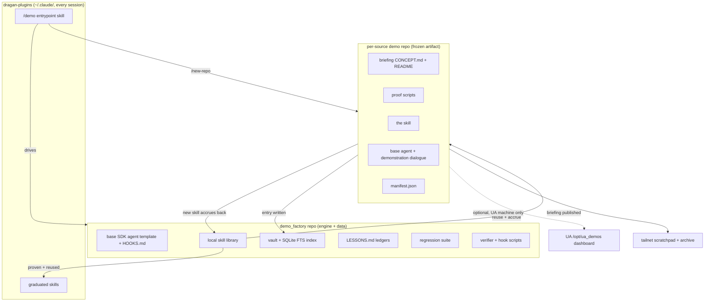
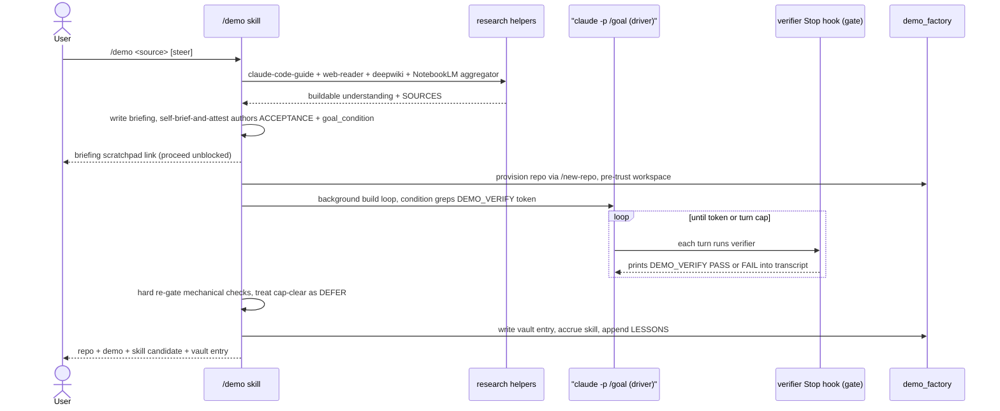

# `/demo` — Portable Claude Code Demo Factory: Phased Implementation Plan

**Date:** 2026-06-23
**Status:** PLAN — design ratified in grilling session, awaiting build go-ahead
**Owner:** claude
**Scope:** A **portable Claude Code slash command** (`/demo`) + a standalone **`demo_factory`** repo. This is **NOT** a feature inside Universal Agent. Zero new code in `src/universal_agent/`. UA is the authoring environment and a source of **proven patterns to replicate, never dependencies to import**. The only UA touch-point is an *optional* dashboard registration when run on a UA machine.
**Design exhibit:** `https://uaonvps.taildcc090.ts.net/scratch/demo-design/demo_design.html`

---

## 1. What this is

Point `/demo` at any source — a GitHub repo, an X/Threads post, a blog/news URL, a YouTube video, a dropped-in image, or a one-line topic — and it **researches the thing until it understands it well enough to build with it**, writes an operator briefing, then builds a **real, runnable demo** that exercises the capability end-to-end. The lasting payoff is a **skill** that can graduate into a global capability.

Two archetypes (the framework-selection rule already encoded in UA's `proactive_tutorial_builds.py` DEMO_BUILD_CONTRACT, replicated here):

- **Agent capability** (a Claude Code feature, an MCP, an agent tool, a new API param) → a **dialogue-driven Claude Agent SDK agent + a custom skill**. Recipe: proof script → extract skill via `skill-creator` → base agent + demonstration dialogue.
- **General framework** (a new library/model/API) → a **straight script** that drives the framework to do one real task. May graduate to a skill via the same script→skill bridge.

The **skill is the universal durable artifact** — even a general-framework demo can become a modular agent capability.

### Packaging split

| Piece | Home | Holds |
|---|---|---|
| **Portable surface** | `dragan-plugins` (installed into `~/.claude/`) | The `/demo` command entrypoint (next to `/new-repo`) + **graduated skills** |
| **Engine + data** | **`demo_factory`** repo (`~/lrepos/demo_factory`, GitHub, optional VPS) | Base SDK template + hooks, growing **local skill library**, the **vault** (+ FTS), `LESSONS.md` ledgers, regression suite, verifier/hook scripts |

The command is a **thin launcher** that locates/clones and drives the factory — exactly the shape `/new-repo` already uses (a plugin skill calling `scaffold_repo.sh` in its assets).

**Promotion pipeline:** a skill is born in a demo → accrues to the factory's local library → (proven + reused) → **graduates into `dragan-plugins`**, becoming a global capability in every session.

---

## 2. Architecture



---

## 3. Runtime flow (build step uses native `/goal`)



---

## 4. Reference patterns from UA (replicate, do **not** import)

A generic Claude Code session has none of UA's Python in scope. These are the proven shapes we re-author as portable skill/factory logic.

| UA symbol (reference) | What we replicate in the factory |
|---|---|
| `claude_cli_client.py::_run_goal_loop_mission` | The two-turn shape: Turn 1 authors `goal_condition.txt`; Turn 2 runs `claude -p "/goal <condition>"` (argv form). **UA's "internal goal loop" IS native `/goal`** — we use the same primitive. |
| `claude_cli_client.py::_build_cli_env` (`cody_mode='anthropic'`) | The **Anthropic-Max launch profile**: scrub `ANTHROPIC_*`, forward `CLAUDE_CODE_OAUTH_TOKEN`, `--model claude-opus-4-8` on argv. |
| `services/cody_evaluation.py::evaluate_demo` | The deterministic verifier — but make its `rerun_command` **required** (it is optional/`None` for supervised Cody) and have it print one greppable `DEMO_VERIFY:` line. |
| `services/cody_implementation.py::DemoManifest`, `::detect_endpoint_from_text`, `::canonicalize_endpoint` | The `manifest.json` schema + endpoint canonicalization. Note: `detect_endpoint_from_text` is a **substring grep a printed hostname can spoof** → add an out-of-band signal. |
| `services/demo_workspace.py::provision_demo_workspace`, `::POLLUTION_INDICATORS` | Workspace hygiene — but reframed: strip *daemon* pollution, **keep hooks** (the `hooks` key strip is not `disableAllHooks`; `/goal` itself is a Stop hook). Add **workspace pre-trust** (the real `/goal` blocker). |
| `services/tutorial_demo_finalize.py::finalize_tutorial_build_demo` | Mechanical completion checks (venv/`uv.lock`/`pyproject` + README run-section) + manifest synthesis. |
| `proactive_tutorial_builds.py` DEMO_BUILD_CONTRACT + `cody-implements-from-brief` skill | The build contract: framework selection, no-mock, model currency, runnable + manifest. |
| `timeout_policy.py::LivenessWatchdog` | No hard wall-clock cap — idle/no-progress kill + high backstop, layered with `/goal`'s "stop after N turns" clause. |
| `model_resolution::resolve_goal_eval_model` | On Anthropic-Max it returns `None` → the evaluator is **real Haiku**, no override needed (vs the autonomous ZAI `glm-4.5-air` weakness). |
| `gateway_server.py::_claude_code_intel_demos` | The *optional* UA dashboard surface — registration is a bonus, not a dependency. |

Portable mechanisms used directly (no replication needed): `/new-repo` (`scaffold_repo.sh`, `lab_common/secrets.py`, `lab_common/zai.py`, `vps_bootstrap.sh`), `skill-creator`, `self-brief-and-attest`, `claude-code-guide` agent, `youtube-transcript-metadata`, `record-app-demo-video`, `webapp-testing`, `notebooklm-orchestration`, `paper-to-podcast`, `gemini-tts-narrator`, `publish_scratch.sh` / `scratch_publish.py`.

---

## 5. Phases

Each phase is independently shippable and leaves a runnable artifact. Boundaries separate config/scaffold work from prompt/skill logic from enrichment.

### Phase 0 — Bootstrap `demo_factory` + the `/demo` entrypoint

**Goal:** the skeleton both halves of the system live in, end-to-end installable.

**Deliverables:**
- `demo_factory` repo created via `/new-repo` (uv 3.13, Infisical **production** bootstrap, private GitHub, optional VPS). Layout:
  ```
  demo_factory/
    CLAUDE.md            # operating guide: minimize hooks unless necessary; record every one
    HOOKS.md             # hook ledger (what / why / when added)
    template/            # base Claude Agent SDK dialogue agent scaffold (+ its .claude/ hooks)
    skills/              # the growing LOCAL skill library
    vault/
      entries/           # one markdown entry per capability
      index.jsonl        # ledger (scratch_archive pattern)
      index.html         # browsable + client-side search
      fts.sqlite         # SQLite FTS5 over concept text (built/refreshed per run)
    lessons/
      DEMO_BUILD_LESSONS.md   # Loop 3 process memory
    regression/          # runnable demos = the regression suite + a runner
    scripts/
      verify_demo.py     # the deterministic verifier (prints DEMO_VERIFY token)
      vault_query.py     # "have we covered X?" FTS query
      vault_write.py     # write/extend a capability entry
      skill_accrue.py    # copy a demo skill into skills/, bump reuse counter
  ```
- `/demo` entrypoint skill in `dragan-plugins` (skeleton): resolves the factory path (clone-if-missing), parses the source/seed, and dispatches. Mirrors `/new-repo`'s SKILL.md + assets structure.

**Key snippet — verifier token (the gate, run as a script Stop hook):**
```python
# demo_factory/scripts/verify_demo.py  — prints ONE forge-proof line
# PASS only if: required files present, the documented run command ACTUALLY executed (exit 0),
# no mock/stub client detected, and endpoint observed out-of-band == required.
print(f"DEMO_VERIFY: {'PASS' if ok else 'FAIL'} demo_id={demo_id} ran={ran} "
      f"exit={exit_code} endpoint={endpoint_observed} screenshot={shot or 'n/a'}"
      + ('' if ok else f' reason={reason}'))
```

**Acceptance:** `/demo --selftest` clones/links the factory, runs `verify_demo.py` against a trivial fixture, prints a `DEMO_VERIFY:` line, and writes one vault entry that appears in `index.html` and is found by `vault_query.py`.

**Boundary:** scaffold + scripts only. No source ingestion, no build orchestration yet.

---

### Phase 1 — Core `/demo` spine for **one** source type

**Goal:** prove the whole flow for a single source type (recommend a **GitHub repo** or a **Claude-feature URL**), end-to-end, manually verified.

**Deliverables:**
- **Input → research:** seed-type detection; for the chosen type, route to the right helper (GitHub → `gh clone` + read code/README + `deepwiki`; URL → `web-reader`/`defuddle`). For Claude-ecosystem sources, **`claude-code-guide` agent is required**. Research writes a `SOURCES/` dir (the grounding the build + briefing cite).
- **Briefing:** durable `CONCEPT.md` + `README.md` in the (to-be) repo; published to the scratchpad via `publish_scratch.sh` (markdown auto-renders), link handed back **immediately**, then proceed unblocked.
- **Build (archetype-routed):** proof script → (agent archetype) extract skill via `skill-creator` + base agent + demonstration dialogue; (general archetype) a straight script + small suite.
- **Land:** per-source repo via `/new-repo`; `manifest.json` (DemoManifest shape); vault entry written; skill accrued to `skills/`.

**Acceptance (real artifact, Production-Verification-Rule #2):** a real per-source repo on disk + GitHub, with a `manifest.json` whose `endpoint_hit` is verified (not `mock`), a README "## Run" that actually runs, and a vault entry. One representative demo built by a non-test run.

**Boundary:** build is still *manually* iterated here (no `/goal` yet) so the spine is debuggable in isolation.

---

### Phase 2 — `/goal`-driven build + verifier gate + hooks

**Goal:** replace the manual build iteration with the **native `/goal` loop (driver) + deterministic verifier (gate)** split.

**Deliverables:**
- `self-brief-and-attest` authors `ACCEPTANCE.md` + `goal_condition.txt` up front. Every criterion phrased as a **transcript-demonstrable** check; the YES requires the literal `DEMO_VERIFY: PASS demo_id=<id>` token (never a paraphrase, never a self-reported boolean).
- Build runs as a backgrounded `claude -p "/goal <condition>"` subprocess on the **Anthropic-Max launch profile**, in a **pre-trusted** workspace. Fallback to single-pass + retry if hooks/trust unavailable.
- `verify_demo.py` wired as a **script Stop hook** in the template's `.claude/` (recorded in `HOOKS.md`); it executes the demo, detects mocks, observes the endpoint **out-of-band**, prints the token.
- `goal_condition.txt` carries `... or stop after N turns` where **N scales with verification depth** (≈6 headless). **Turn-cap-clear ⇒ DEFER, not pass.** After the loop returns, mechanical checks **re-run as a hard code gate**.

**Key snippet — `goal_condition.txt` template:**
```
Build a runnable demo of <capability> that FULLY exercises it end-to-end against the real
endpoint (never mock). DONE only when the transcript contains the literal line
  DEMO_VERIFY: PASS demo_id=<id>
printed by demo_factory/scripts/verify_demo.py after it actually executed the README run
command. Echo the verifier output every turn. If not done, fix and retry.
Constraints: do not edit files outside this workspace. Or stop after <N> turns.
```

**Acceptance:** a demo built entirely by the `/goal` loop, where the transcript shows the `DEMO_VERIFY: PASS` token, the post-loop hard re-gate passes, and `endpoint_hit==anthropic_native` is confirmed out-of-band. A deliberately-broken demo loops and ends in **DEFER** (not a false PASS).

**Boundary:** loop/gate mechanics only. Recursive learning is Phase 3.

---

### Phase 3 — Recursive improvement loops

**Goal:** the system gets better every run.

**Deliverables (reusing the proven `/new-repo` lessons mechanism — *blocker → root cause → fix → file*):**
- **Loop 1 (per-skill):** extend the `skill-creator` path so every authored skill ships `LESSONS.md`; read at the **start of every run**, appended on runtime difficulty, folded into the skill body on consolidation.
- **Loop 2 (capability accrual):** `skill_accrue.py` registers each demo skill into `skills/` and bumps a reuse counter.
- **Loop 3 (process memory):** `DEMO_BUILD_LESSONS.md` read at the start of every build.
- **Regression-on-change:** when a shared skill folds in a lesson, `regression/` re-runs the demos that use it (each demo is runnable + verified). Guards self-modifying skills from rotting.

**Key snippet — `LESSONS.md` schema (per skill and per process):**
```markdown
## <ISO date> — <one-line symptom>
- **Blocker:** what failed
- **Root cause:** why
- **Fix:** the change
- **Applied to:** file/section
```

**Acceptance:** two consecutive demos that need an overlapping capability — the second **reuses** the accrued skill (counter increments) and a runtime lesson recorded in run 1 is visibly pre-empted in run 2. A folded-in lesson triggers a regression re-run.

**Boundary:** learning mechanics. Vault recall is Phase 4.

---

### Phase 4 — Vault recall layer

**Goal:** "have we covered X?" becomes answerable, and failures become first-class knowledge.

**Deliverables:**
- **One entry per capability** (not per run — re-visiting extends it): concept brief + visual briefing link + proven skill(s) + demo repo link + lessons + failure notes. Markdown + frontmatter.
- **SQLite FTS5** (`fts.sqlite`) over concept text + entry metadata, refreshed each run; `vault_query.py` is the agent-facing "have we covered X?" query.
- **Un-demoable entries (your failure idea):** when a concept relates to a real skill but **won't demo** (needs hardware/paid tier/unreleased API), the process writes *"what it is + why it didn't demo + what it'd take"* into `CONCEPT.md` **and** the visual briefing, and marks the entry `un-demoable`.
- **Pre-flight decision:** before building, query the vault; the result feeds the **reuse / expand / create-new** decision (groundwork for the librarian).

**Acceptance:** a second `/demo` on a capability already covered hits the vault pre-flight, reports the prior entry + reusable skill, and **extends** the existing entry rather than duplicating. An un-demoable run produces a marked entry with an honest blocker note.

**Boundary:** recall + storage. Consolidation is Phase 5.

---

### Phase 5 — Skill librarian + graduation pipeline

**Goal:** keep the library from sprawling; ship proven skills globally.

**Deliverables:**
- **Vault-lookup decision:** when the pre-flight finds *related* (not exact) skills, an LLM judgment picks **reuse · expand an existing skill · create-new-then-flag-for-consolidation**.
- **Periodic librarian pass:** consolidates a crowded cluster into a **master skill** (HyperFrames `video-ad-producer` shape — one skill, internal modes) or a **skill group** (stitch-skills shape — directory + README + sub-skills), then re-runs the regression suite.
- **Graduation pipeline:** reuse-count + librarian judgment promote a proven skill from `skills/` → **`dragan-plugins`** (a global capability). Deliberate, reviewed; never auto-install.

**Acceptance:** a cluster of ≥3 related skills is consolidated into a master skill/group with the regression suite green; one proven skill is graduated into `dragan-plugins` and is then invocable from a fresh, unrelated session.

**Boundary:** library health + promotion. Enrichment is Phase 6.

---

### Phase 6 — Enrichment + remaining source types

**Goal:** the marquee polish + full source coverage.

**Deliverables:**
- **Visual verification + screencast:** for UI demos, a render → screenshot (`webapp-testing` / DevTools) → critique → fix sub-loop with a **higher N (≈20)**; PASS gated on the screenshot file existing on disk + a vision check surfaced as a verifier line. Auto-screencast via `record-app-demo-video` → a "watch it run" artifact in the vault/briefing.
- **Cross-capability composition demos** once the library has several skills.
- **"Where could we use this?"** — each briefing ends with an LLM section mapping the capability to existing projects/repos.
- **NotebookLM:** per-capability **audio overview** (`paper-to-podcast` / `gemini-tts-narrator`); **research aggregator** (additive to the routed research, never a replacement); **wiki repurposed** (per-capability-cluster overview on demand into the vault entry).
- **Weekly "what's new in the toolbox"** digest over new vault entries.
- **Remaining source types** added incrementally: X/Threads (web-reader/defuddle + follow primary linked artifact), generic article/news, YouTube (`youtube-transcript-metadata`), dropped-in image/file, freeform topic.

**Acceptance:** a visual demo passes via the screenshot-gated sub-loop with a screencast artifact; a briefing carries a "where could we use this" section + an audio overview; each new source type produces a verified demo.

**Boundary:** terminal phase.

---

## 6. Cross-cutting concerns

| Concern | Resolution |
|---|---|
| **Demo runtime inference** | Default: the Claude Code binary (updated → new features present) over the ZAI backend. Provider-specific (Google/OpenAI/…): keys from Infisical **production** via the `/new-repo` bootstrap. Local-GPU/local-model demos: desktop **Ollama** (`qwen2.5-coder:7b`). Best-effort + honest markup when an endpoint is missing. |
| **`/goal` evaluator integrity** | Launch on the **Anthropic-Max profile** so the evaluator is real Haiku. Verify `endpoint_hit==anthropic_native` every build to catch a ZAI env leak. |
| **Workspace trust** | Pre-trust the new per-source repo **before** backgrounding `/goal`, else it silently no-ops. Degrade to single-pass + retry if trust/hooks unavailable. |
| **Hooks policy** | First-class. Curated, version-controlled in the template; new hooks added/tested in the template's own test env; every hook recorded in `HOOKS.md`; `CLAUDE.md` guideline: minimize unless necessary, never prohibit. |
| **Timeouts** | No hard wall-clock cap. `/goal`'s "stop after N turns" + `LivenessWatchdog` idle-kill + a high absolute backstop, layered. Don't reuse a 30-min cap. |
| **Model currency** | Verify current model ids/signatures from authoritative source (`claude-code-guide`, Context7, provider docs) — never training-data recall. Deprecated ids = failed demo. |
| **Secrets** | Infisical production via `/new-repo`'s `lab_common/secrets.py`. Never print secret values. |

---

## 7. Per-phase acceptance summary

| Phase | Real-artifact acceptance |
|---|---|
| 0 | `--selftest` prints a `DEMO_VERIFY:` line + writes a queryable vault entry |
| 1 | A real per-source repo + verified `manifest.json` + runnable README + vault entry (non-test run) |
| 2 | A `/goal`-built demo with the `DEMO_VERIFY: PASS` token + out-of-band endpoint proof; broken demo → DEFER not false PASS |
| 3 | Skill reused across two demos (counter++); a run-1 lesson pre-empted in run 2; regression re-run on fold-in |
| 4 | Re-visit extends an existing vault entry; un-demoable run produces a marked entry |
| 5 | ≥3-skill cluster consolidated, regression green; one skill graduated into `dragan-plugins`, invocable from a fresh session |
| 6 | Visual demo passes screenshot-gated sub-loop + screencast; briefing has "where to use" + audio; each new source type verified |

---

## 8. Open decisions deferred to build time

- Exact `vault/entries/*.md` frontmatter schema (tags, status enum: `demoed` / `un-demoable` / `partial`, reuse-count, source provenance + freshness stamp).
- Reuse-count + librarian thresholds that trigger consolidation and graduation.
- Whether the plan's canonical home migrates from UA `plans/` into `demo_factory/` at Phase 0 (recommended).
- The "watch it run" screencast length/format defaults.

---

## 9. Risks & mitigations

| Risk | Mitigation |
|---|---|
| `/goal` evaluator false-PASS (transcript-only judge rubber-stamps) | The verifier — not the evaluator — is the gate; condition greps a forge-proof token; hard re-gate after the loop. |
| `/goal` false-NEGATIVE (real success not surfaced) loops to cap | Force echo-into-transcript each turn; treat cap-clear as DEFER; budget turns for it. |
| Endpoint spoof (printed hostname satisfies substring grep) | Out-of-band signal (proxy/SDK request count or server-returned token), not `detect_endpoint_from_text` alone. |
| `/goal` silently no-ops in untrusted workspace | Pre-trust precondition + graceful fallback. |
| ZAI env leak makes "Haiku" judge run on `glm-4.5-air` | Anthropic-Max launch profile + per-build endpoint verification. |
| Self-modifying skills rot | Accumulated demos = regression suite, re-run on fold-in. |
| Skill-library sprawl | Librarian consolidation + reuse-driven graduation. |
| Scope balloon | Phases 0–2 are the minimum viable `/demo`; 3–6 are independently shippable increments. |

---

*This plan is the living blueprint — edit it as phases complete or revise. Canonical home migrates to `demo_factory/` once Phase 0 creates it.*
