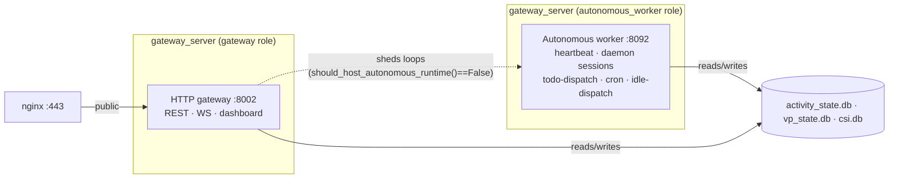
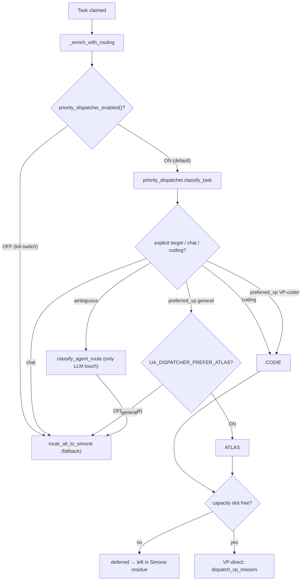
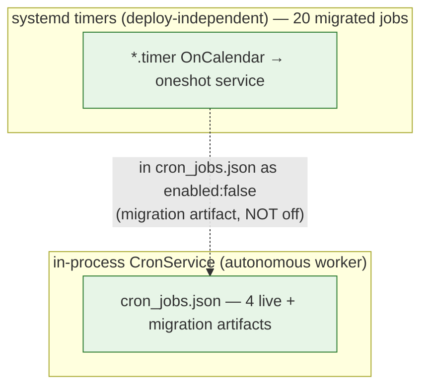

# Platform Status Registry

**The single answer to "what do we have, and is it live?"** — every subsystem, recurring job, intel
source, VP, MCP server, and channel, with an explicit status, the gate that controls it, and a code
anchor you can re-verify. This doc exists because the recurring failure mode in this system is
**status-blindness**: a feature is documented "off / flag-gated / prepared but not flipped", a flag
flips, and the doc silently goes wrong. This registry is the index that resists that — and the first
place to look before deep-diving the code.

> **Read status from code, not prose.** Wherever a status below could rot, it is sourced from a
> machine-authoritative function, cited inline. The live runtime equivalent of this whole doc is
> [`services/proactive_activity_report.py::build_activity_inventory`](../src/universal_agent/services/proactive_activity_report.py)
> — it reconciles both schedulers + lane freshness into the "N healthy · N degraded · N paused · N
> dark" line that leads the 3×-daily proactive report. **If you need the *live* state right now, read
> that report (or run the probes in [§9](#9-how-to-re-verify-anti-rot)), not this snapshot.**

## Status vocabulary

Adopted from the runtime inventory (`proactive_activity_report.py` `STATUS_*` / `_ICON`) so the doc and
the live surface speak the same language.

| Status | Icon | Meaning | What to do |
|---|---|---|---|
| **LIVE** | ✅ | Running now (a timer fires it, a service hosts it, a flag is on). | Build on it. |
| **PAUSED** | ⏸️ | Deliberately turned off by the operator; reversible by one flag. | Don't "fix" it on — read why first. |
| **PARKED** | ⏸️ | Intentionally not running; prepared to re-arm (e.g. an experimental lane behind a default-off flag). | Re-arm only for its purpose. |
| **RETIRED** | 🌑 | Gone / superseded; code may linger as a stub or importable shim. | Don't resurrect without reading the Decommission Register in [`01_architecture/07_task_type_registry.md`](01_architecture/07_task_type_registry.md). |
| **SCAFFOLDING** | 🏗️ | Built and importable, but no production caller / not wired to run. | A real capability; not a live loop. |
| **UNKNOWN** | ❔ | Referenced but not anchored in current code, or unverifiable from the dev box. | Verify before relying. |

**Default-flip discipline (how to keep this doc honest):** any row whose status depends on a flag
carries the flag **and its code default + the dated value**. When code default ≠ live prod value, the
row says so explicitly (the autonomous-runtime split and HOMER are the two current cases).

---

## 1. Backend processes & ports

The platform is **not** one process. Five UA listeners run on the VPS (`uaonvps`, runtime user `ua`,
`/opt/universal_agent`). nginx fronts the public gateway on `:8002`; the others are internal.

| Port | Process | systemd unit | Role | Status |
|---|---|---|---|---|
| 8002 | `gateway_server` (HTTP) | `universal-agent-gateway.service` | Public gateway: REST + WS streaming + dashboard backend. **Sheds the autonomous loops in split mode.** | LIVE ✅ |
| 8092 | `gateway_server` (`UA_GATEWAY_ROLE=autonomous_worker`) | `universal-agent-autonomous-runtime.service` | **Second gateway process** hosting all autonomous loops (heartbeat, daemon sessions, todo-dispatch, cron, idle-dispatch) off the HTTP loop. Private port. | LIVE ✅ |
| 8001 | `universal_agent.api.server` | `universal-agent-api.service` | REST API surface. | LIVE ✅ |
| 8091 | `csi_ingester.app` (uvicorn) | `csi-ingester.service` | CSI ingestion service (source registry + RSS adapters + semantic enricher). | LIVE ✅ |
| 3000 | `next-server` | `universal-agent-webui.service` | Web UI / dashboard frontend. | LIVE ✅ |
| — | `discord_intelligence.daemon` | `ua-discord-intelligence.service` | Discord passive monitor (standalone — **not** a CSI/convergence feed). | LIVE ✅ |
| — | `discord_intelligence.cc_bot` | `ua-discord-cc-bot.service` | Discord command-and-control bot. | LIVE ✅ |
| — | mission-control sweeper | `universal-agent-mission-control-sweeper.service` | Observational Chief-of-Staff sweeper, extracted from the gateway lifespan into its own deploy-isolated process. | LIVE ✅ |
| — | telegram bot | `universal-agent-telegram.service` | Telegram polling bot (gateway-bypass). | LIVE ✅ |
| — | MkDocs | `universal-agent-docs.service` | Serves the rendered docs site. | LIVE ✅ |
| 8080 | filebrowser | _(not a UA component)_ | A neighbor service on the box — **not** part of UA. Earlier docs that called `:8080` a UA gateway port were wrong. | n/a |

> **`:8080` is not UA.** The only UA gateway ports are **8002** (public HTTP) and **8092** (private
> autonomous worker). Owner: [`05_channels/05_web_ui_communication.md`](05_channels/05_web_ui_communication.md), [`05_channels/04_discord_ops.md`](05_channels/04_discord_ops.md).

### Autonomous-runtime split (LIVE since 2026-06-19)

- **Gate:** `loop_control.py::autonomous_runtime_mode` (`UA_AUTONOMOUS_RUNTIME_MODE` ∈ `in_process` *(code default)* | `split`). **Prod = `split`** (set via Infisical/`.env`, not visible in `/proc/environ`; proven live by the running worker). This is the one flag whose **prod value differs from the code default** — track it as such.
- **Who hosts the loops:** `loop_control.py::should_host_autonomous_runtime` (uses `UA_GATEWAY_ROLE`). In `split`, only the `autonomous_worker` process returns `True`; the public gateway returns `False` and sheds them. Exactly one process runs the loops — no double-fire.
- Consumed in `gateway_server.py` lifespan as `_run_autonomous_loops_here`; every loop init is gated on it. Worker port `UA_AUTONOMOUS_WORKER_PORT` (default 8092). PRs #1084/#1085/#1088/#1091.
- **Why it exists:** glm-5.2 thinking-ON autonomous turns ran 15+ min in-process and starved the uvicorn HTTP loop ("Gateway unreachable"). The split moved them off the HTTP loop. This **supersedes** the older "event-loop starvation" gotcha and the deploy-restart heartbeat-extraction ADR. Owner: [`01_architecture/01_system_overview.md`](01_architecture/01_system_overview.md).

---

## 2. Routing — how a claimed task reaches an executor

**The priority dispatcher is the live router** (DEFAULT-ON since 2026-06-16). Simone-first is the
disabled fallback, not the default.

| Path | Status | Gate (default) | Code anchor |
|---|---|---|---|
| **Priority dispatcher** | LIVE ✅ | `UA_PRIORITY_DISPATCHER_ENABLED` (**default ON**, since 2026-06-16, PR #1034/#1038) | `services/priority_dispatcher.py::priority_dispatcher_enabled`, `::classify_task`, `::dispatch_claimed` |
| Routing enrichment fork | LIVE ✅ | n/a — skips Simone routing when dispatcher on | `services/dispatch_service.py::_enrich_with_routing` |
| Prefer-ATLAS lane (general → ATLAS direct) | PARKED ⏸️ | `UA_DISPATCHER_PREFER_ATLAS` (**default OFF**) — general/ambiguous falls back to Simone | `services/priority_dispatcher.py::prefer_atlas_enabled` |
| **Simone-first routing** | PARKED ⏸️ (fallback) | active only when dispatcher OFF | `services/agent_router.py::route_all_to_simone` |
| VP-direct dispatch + capacity gate | LIVE ✅ | `UA_MAX_CONCURRENT_VP_CODER`=1, `UA_MAX_CONCURRENT_VP_GENERAL`=2 | `tools/vp_orchestration.py` (`dispatch_vp_mission`), `services/vp_capacity.py` |

Net: **VP-direct for tagged/classified VP work with a free slot; Simone-first fallback for general
(prefer-ATLAS off), chat, ambiguous, and capacity-deferred work.** Owner:
[`02_execution_core/02_task_hub.md`](02_execution_core/02_task_hub.md), [`01_architecture/07_task_type_registry.md`](01_architecture/07_task_type_registry.md) §2.

---

## 3. Virtual Principals (VPs)

`vp/profiles.py::resolve_vp_profiles` builds all profiles, then keeps only those in
`feature_flags.py::vp_enabled_ids` (`UA_VP_ENABLED_IDS`, default tuple = coder + general.primary). All
three run on ZAI/GLM (`inference_mode='zai'`); Anthropic Max is an opt-in per-task lever (`cody_mode`).

| VP | id | inference | enabled default | Prod status | Code anchor |
|---|---|---|---|---|---|
| **CODIE** | `vp.coder.primary` | zai | YES | LIVE ✅ (worker running) | `vp/profiles.py::resolve_vp_profiles`, `vp/clients/claude_cli_client.py` |
| **ATLAS** | `vp.general.primary` | zai | YES | LIVE ✅ (worker running) | `vp/profiles.py::resolve_vp_profiles`, `vp/clients/claude_generalist_client.py` |
| **HOMER** | `vp.general.secondary` | zai | **NO** | **LIVE ✅ in prod** — 3rd worker instance `@vp.general.secondary` running, enabled via `UA_VP_ENABLED_IDS` | `vp/profiles.py::resolve_vp_profiles` (PR #1094) |

- HOMER is an **ATLAS capacity twin** (shares `ATLAS_SOUL.md`, `client_kind=claude_generalist`) — an opportunistic 2nd general slot, not a new persona. Bidirectional CODIE/HOMER exclusion keeps **peak ≤ 2 running**.
- VP workers run as systemd template instances `universal-agent-vp-worker@<vp_id>.service`. Live claiming loop = `vp/worker_loop.py::VpWorkerLoop`; live mission state = **`vp_state.db`** (`durable/state.py` via `get_vp_db_path`), not `runtime_state.db`. (`vp/worker.py` has **no production caller** — SCAFFOLDING/CLI only.)
- Owner: [`03_agents/01_vp_workers_and_delegation.md`](03_agents/01_vp_workers_and_delegation.md).

---

## 4. Recurring jobs — the two-scheduler inventory

**Two independent schedulers run recurring work.** The #1 source of "is it dead?" confusion: a
systemd-migrated job appears in `cron_jobs.json` with `enabled:false` — that is the **correct migrated
state** (the timer is the sole firer), *not* "off". Disambiguate by name with
`systemd_migrated_jobs.py::is_migrated_to_systemd`.

### 4a. Migrated to systemd timers (LIVE — 20 jobs)

Source of truth = `systemd_migrated_jobs.py::SYSTEMD_MIGRATED_SYSTEM_JOBS` (do not hand-maintain a list
that drifts — re-read the frozenset). Unit names follow `universal-agent-<job-with-dashes>.timer`. All
verified `active waiting`, none failed, 2026-06-22.

`scratch_pruning` · `vault_lint_contradictions` · `architecture_canvas_drift` · `vp_coder_workspace_pruning` · `proactive_report_morning` · `proactive_report_midday` · `proactive_report_afternoon` · `proactive_artifact_digest` · `intel_auto_promoter` · `codie_proactive_cleanup` · `hourly_intel_digest` · `csi_convergence_sync` · `youtube_daily_digest` · `youtube_gold_channel_poller` · `youtube_oauth_watchdog` · `nightly_wiki` · `morning_briefing` · `evening_briefing` · `csi_demo_triage_rank` · `cron_artifact_reminders_sweep`.

Plus host/infra + CSI-ingester timers not in the frozenset but live on the box: `service-watchdog`
(30s), `oom-alert` (1m), `proactive-health` (10m), `session-reaper`, `uv-cache-prune`,
`proactive-signal-card-sync`, `proactive-demo-build-sweep`, `proactive-demo-nuggets` (23:50 America/Chicago end-of-day golden-nuggets demo judge; `UA_PROACTIVE_DEMO_NUGGETS_ENABLED` code-default OFF, **set `1` in prod 2026-07-01**), `backlog-triage`, `skill-gap-finder`,
`csi-rss-semantic-enrich` (4h), `csi-threads-semantic-enrich` (4h), `csi-youtube-transcript-canary`
(hourly), `csi-replay-dlq` (4h), `csi-daily-summary`, `csi-db-backup`, `csi-threads-token-refresh-sync`,
`m3-token-delta` (weekly, never-fired-yet). Global rollback: `UA_SYSTEMD_TIMER_MIGRATION_DISABLED=1`.

### 4b. Still in-process (LIVE — 5 jobs)

These do not AND-in `is_migrated_to_systemd`, so `cron_service.py::CronService` fires them inside the
autonomous worker. Some are in-process *by design* (need the agent runtime/skills/MCP).

| job_id | schedule | gate (default) | Status | Why in-process |
|---|---|---|---|---|
| `simone_chat_auto_complete` | `*/1` UTC | hardcoded ON (housekeeping) | LIVE ✅ | lightweight housekeeping |
| `vp_mission_pr_reconciler` | `*/15` 6-20 CT | `UA_VP_MISSION_PR_RECONCILER_ENABLED` (ON) | LIVE ✅ | housekeeping |
| `paper_to_podcast_daily` | `0 21` CT | `UA_PAPER_TO_PODCAST_ENABLED` (ON) | LIVE ✅ | a daily *prompt* — needs runtime/skills/MCP |
| `morning_ideation_report` | `30 6` CT | `UA_IDEATION_REPORT_ENABLED` (ON) | LIVE ✅ | Simone ideation prompt (distinct from convergence) |
| `stale_proposal_reaper` | `0 7 * * 0` CT | `UA_STALE_PROPOSAL_REAPER_ENABLED` (ON) | LIVE ✅ | lightweight weekly reaper — parks open reflection/brainstorm >14d via `action="park"` (protected skipped); md+json digest to `work_products/` |
| `hackernews_snapshot` | `0,30` 6-21 CT | `UA_HACKERNEWS_SNAPSHOT_ENABLED` (code ON, **prod=0**) | PARKED ⏸️ | parked in prod |

### 4c. Tombstones (do not "fix" these on)

| job | Status | Gate / mechanism | Note |
|---|---|---|---|
| `claude_code_intel_sync` | PAUSED ⏸️ | `UA_CLAUDE_CODE_INTEL_CRON_ENABLED` default flipped 1→0 (PR #1136) | X API HTTP 402 CreditsDepleted. Registrar durably disables the live row. Resume = flip default back / set flag = 1. |
| `atlas_direct_dispatch` | RETIRED 🌑 | `_ensure_atlas_direct_dispatch_cron_job` calls `delete_job` every boot | M3 (#1038); superseded by `priority_dispatcher.py::dispatch_claimed`. A plain `enabled=False` did **not** durably stop the live row — hence delete-on-boot. |
| `insight_scoring_health` | RETIRED 🌑 | removed from the frozenset + units deleted (PR #1131) | Zombie weekly monitor; its producer (`hourly_insight_email`) was deregistered in #745, so it emailed a false "0 scored" every Sunday. |

Owner: [`03_agents/04_cron_and_scheduling.md`](03_agents/04_cron_and_scheduling.md), [`06_platform/08_scheduling_substrate_adr.md`](06_platform/08_scheduling_substrate_adr.md).

---

## 5. CSI ingestion sources

Code-authoritative status = `services/invariants/csi_source_liveness.py` (`SOURCE_THRESHOLDS_HOURS`
holds LIVE/PARKED only — RETIRED adapters are removed from the table; `effective_source_thresholds`
drops parked sources whose flag is off). **YouTube is the only live ingestion feed.**

| Source | Status | Gate (default) | Code anchor | Notes |
|---|---|---|---|---|
| `youtube_channel_rss` | LIVE ✅ | none | `csi_source_liveness.py::SOURCE_THRESHOLDS_HOURS` | Sole convergence feed; 444-channel watchlist; 12h threshold. |
| `threads_owned` / `threads_trends_seeded` / `threads_trends_broad` | RETIRED 🌑 | n/a — gate + helper deleted | `csi_source_liveness.py::effective_source_thresholds` docstring | Decommissioned 2026-06-22 (PR #1140): never had a live ingestion adapter, X-API-dependent, redundant with the @ClaudeDevs/@bcherny lane. Removed from UA-side monitoring (`UA_CSI_THREADS_LANES_ENABLED` flag + `_THREADS_SOURCES` helper deleted). The CSI-ingester-side `csi-threads-*` timers persist but are inert pending an ingester redeploy. |
| `hackernews` | PARKED ⏸️ | `UA_HACKERNEWS_SNAPSHOT_ENABLED`=0 | `csi_source_liveness.py::_hackernews_snapshot_enabled` | No auto producer exists; re-parked 2026-06-21 (#1116). |
| `claude_code_intel` (X `@ClaudeDevs`/`@bcherny`) | PAUSED ⏸️ | `UA_CLAUDE_CODE_INTEL_CRON_ENABLED` default 1→0 (#1136) | `gateway_server.py::_claude_code_intel_cron_enabled` | X API HTTP 402 CreditsDepleted. |
| `csi_analytics` | RETIRED 🌑 | n/a | `csi_source_liveness.py` docstring | PR #990; superseded by the convergence pipeline; model glm-5.1 → **glm-5.2**. |
| `youtube_playlist` | RETIRED 🌑 | n/a | `csi_source_liveness.py` docstring | PR #438; daily digest is the canonical YouTube trigger. |

**Convergence pipeline (the only live intel-production path from CSI):**
`services/proactive_convergence.py::sync_topic_signatures_from_csi` reads YouTube transcripts
(`csi.db` `events` ⋈ `rss_event_analysis`) → `proactive_topic_signatures` → `convergence_candidates`.
**Discord is NOT a CSI/convergence feed** — it is a standalone daemon (`discord_intelligence.daemon`)
+ a CRUD watchlist router (`api/routers/csi_discord_watchlist.py`). The **Simone ideation pipeline**
(`morning_ideation_report` → `reflection_engine`) is a separate track. Owner:
[`04_intelligence/01_csi_architecture.md`](04_intelligence/01_csi_architecture.md), [`04_intelligence/10_proactive_pipeline.md`](04_intelligence/10_proactive_pipeline.md).

---

## 6. MCP servers — the two build paths

There are **two** MCP surfaces, and they differ. Autonomous work (Simone/VP via
`execution_engine.py::ProcessTurnAdapter`) uses `main.py::setup_session`; interactive/CLI/URW uses
`agent_setup.py::_build_mcp_servers`.

| Server | Interactive (`_build_mcp_servers`) | Autonomous (`setup_session`) | Gate |
|---|---|---|---|
| `composio` | ✅ | ✅ | `COMPOSIO_API_KEY` |
| `internal` (in-proc SDK) | ✅ | ✅ | always; memory toggle `enable_memory` |
| `zai_vision` | ✅ | ✅ | ZAI key |
| `telegram` | ✅ | **✗** | interactive-only |
| `gws` | ✅ (gated) | **✗** | interactive-only |
| `notebooklm-mcp` | ✅ | ✅ | feature-gated, default off |
| `arxiv-mcp-server` | ✅ | ✅ | `UA_ENABLE_ARXIV_MCP`, default off |
| `agentmail` | ✅ | ✅ | feature-gated |
| **`link` (Stripe/payments)** | **✗** | ✅ LIVE | `UA_ENABLE_LINK=1` (**prod ON**); live-spend needs `UA_ENABLE_LINK_LIVE=1` AND `UA_LINK_TEST_MODE=0` |
| `edgartools` | ✗ (commented out) | ✅ | autonomous-only |
| `video_audio` | ✗ (commented out) | ✅ | autonomous-only |
| `youtube` | ✗ (commented out) | ✅ | autonomous-only |

**The autonomous surface is the production-relevant one.** Docs that describe only `_build_mcp_servers`
miss `link` entirely and wrongly call edgartools/video_audio/youtube "disabled". LINK config:
`tools/link_bridge.py::build_link_mcp_server_config`. Owner:
[`07_tools/01_mcp_server_and_tools.md`](07_tools/01_mcp_server_and_tools.md).

---

## 7. Channels

| Channel | Status | Transport | Code anchor | Owner doc |
|---|---|---|---|---|
| Email / AgentMail | LIVE ✅ | WS ingress + Gmail fallback | `services/email_task_bridge.py::EmailTaskBridge` | [`05_channels/01_email_agentmail.md`](05_channels/01_email_agentmail.md) |
| Webhooks | LIVE ✅ | HTTP `POST /api/v1/hooks/*` (incl. `ci-failure` autofix) | `gateway_server.py` hook routes | [`05_channels/02_webhooks.md`](05_channels/02_webhooks.md) |
| Telegram | LIVE ✅ | polling bot (not webhook), `tg_<user_id>` sessions | `universal-agent-telegram.service` | [`05_channels/03_telegram.md`](05_channels/03_telegram.md) |
| Discord ops + intel | LIVE ✅ | standalone daemon + C2 bot | `discord_intelligence.daemon` | [`05_channels/04_discord_ops.md`](05_channels/04_discord_ops.md), [`04_intelligence/12_discord_intelligence.md`](04_intelligence/12_discord_intelligence.md) |
| Web UI / dashboard | LIVE ✅ | next-server `:3000` ↔ gateway `:8002` (WS/AG-UI) | `universal-agent-webui.service` | [`05_channels/05_web_ui_communication.md`](05_channels/05_web_ui_communication.md) |

---

## 8. Key intelligence pipelines & subsystems

Status of the cross-cutting systems most often mis-stated. Detail lives in the owner doc; this is the
status index.

| Subsystem | Status | Gate / anchor | Owner |
|---|---|---|---|
| Convergence pipeline (YouTube → signatures → candidates) | LIVE ✅ | `proactive_convergence.py::sync_topic_signatures_from_csi` | [`04_intelligence/10`](04_intelligence/10_proactive_pipeline.md) |
| Simone ideation (morning_ideation_report → reflection_engine) | LIVE ✅ | `services/reflection_engine.py` | [`04_intelligence/10`](04_intelligence/10_proactive_pipeline.md) |
| hourly_intel_digest (the intel-brief delivery path) | LIVE ✅ | systemd timer; `scripts/hourly_intel_digest_cron.py::run_once` | [`04_intelligence/13`](04_intelligence/13_insight_pipeline_build_plan.md) |
| Demo triage → auto-promoter → tutorial/demo build | LIVE ✅ | `services/csi_demo_triage.py`, `services/intel_auto_promoter.py` | [`04_intelligence/06`](04_intelligence/06_demo_triage.md), [`04_intelligence/15`](04_intelligence/15_demo_tutorial_pipeline_adr.md) |
| Proactive demo build → **demo_factory engine** (`tutorial_build` lane) | LIVE ✅ | `proactive_tutorial_builds.py::_demo_factory_override_block` (routing), `priority_dispatcher.py::dispatch_claimed` (3/day OUTFLOW cap), `proactive_demo_nuggets.py::select_and_build_nuggets` (end-of-day 0–2 extra, 5/day ceiling) | [`04_intelligence/15`](04_intelligence/15_demo_tutorial_pipeline_adr.md) § "Engine migration" |
| LLM wiki / vault (per-slug-nested paths) | LIVE ✅ | `nightly_wiki` timer; `services/vault_*` | [`04_intelligence/07`](04_intelligence/07_llm_wiki.md) |
| LivenessWatchdog (idle/no-progress kill — **never a hard wall-clock cap**) | LIVE ✅ | `timeout_policy.py::LivenessWatchdog` | [`02_execution_core/01`](02_execution_core/01_gateway_sessions_execution.md) |
| Mission-control sweeper (own service) | LIVE ✅ | `services/mission_control_sweeper_main.py` | [`04_intelligence/11`](04_intelligence/11_mission_control_intelligence.md) |
| proactive_activity_report (fleet-liveness inventory) | LIVE ✅ | `proactive_activity_report.py::build_activity_inventory` | this doc |
| URW HarnessOrchestrator / URWOrchestrator | SCAFFOLDING 🏗️ | operator-CLI / dormant on prod (0 `.urw` dirs) | [`02_execution_core/04`](02_execution_core/04_urw_orchestration.md) |
| Agent College (self-improvement loop) | RETIRED 🌑 | vestigial; never wired into the prod gateway runtime | [`03_agents/06`](03_agents/06_agent_college.md) |
| Reddit ingestion | RETIRED 🌑 | de-scoped, no code residue (#707) | [`01_architecture/07`](01_architecture/07_task_type_registry.md) §6 |

**Proactive demo engine — five live flags (Infisical `production`, set 2026-07-01):**
`UA_PROACTIVE_DEMO_ENGINE=1` (route `tutorial_build` onto the demo_factory `/demo` engine, code-default OFF),
`UA_PROACTIVE_DEMO_DAILY_CAP=3` (OUTFLOW 3 builds/day, code-default 3),
`UA_PROACTIVE_DEMO_NUGGETS_ENABLED=1` (end-of-day golden-nuggets judge, code-default OFF),
`UA_PROACTIVE_TUTORIAL_AUTO_ROUTE=1`, `UA_PRIORITY_DISPATCHER_ENABLED=1`. Distinct INFLOW ceiling
`UA_DEMO_BUILD_DAILY_CEILING` (default 10) still gates auto-route *queueing*. All count "today" over the
shared `utils/day_boundary.py::chicago_day_start_iso` boundary. **Pause the lane:** set
`UA_PROACTIVE_TUTORIAL_AUTO_ROUTE=0` + `UA_PRIORITY_DISPATCHER_ENABLED=0` and restart
`universal-agent-autonomous-runtime`; re-enable by flipping both back. Details:
[`04_intelligence/15`](04_intelligence/15_demo_tutorial_pipeline_adr.md) § "Engine migration".

The full per-task-type / mission-system catalog + the **Decommission Register** (why each dead system
was turned off) lives in [`01_architecture/07_task_type_registry.md`](01_architecture/07_task_type_registry.md) — this registry covers the *platform* axis;
that one covers the *task-type* axis.

---

## 9. How to re-verify (anti-rot)

This doc is a dated snapshot. To check live status, read from code/runtime — not prose:

- **Live fleet line:** read the latest 3×-daily proactive report (it leads with `build_activity_inventory`'s "N healthy · N degraded · N paused · N dark").
- **Crons/timers:** `systemctl list-timers --all` on the VPS + `systemd_migrated_jobs.py::SYSTEMD_MIGRATED_SYSTEM_JOBS` + live `cron_jobs.json` (under `AGENT_RUN_WORKSPACES`).
- **CSI sources:** `services/invariants/csi_source_liveness.py::effective_source_thresholds`.
- **VPs:** `vp/profiles.py::resolve_vp_profiles` + `UA_VP_ENABLED_IDS` (or `systemctl` for the running `vp-worker@` instances).
- **MCP servers:** `main.py::setup_session` (autonomous) vs `agent_setup.py::_build_mcp_servers` (interactive).
- **Live flags:** Infisical-injected flags are **not** in `/proc/<pid>/environ` — verify via behavior or the Infisical project, not the process env.
- **Deployed SHA:** `curl -s localhost:8002/api/v1/version` (must equal `origin/main`).

When you change any status above, update the row **and** its owning doc in the same PR (the governance
rule in [`CLAUDE.md`](CLAUDE.md)).
