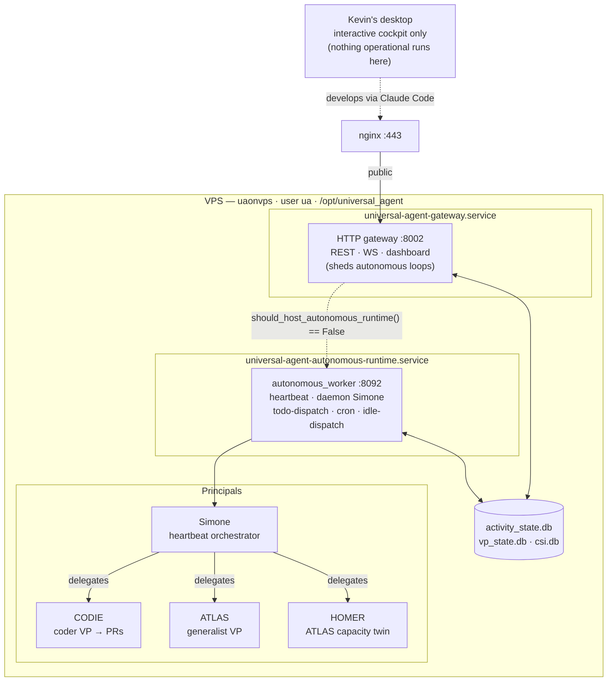
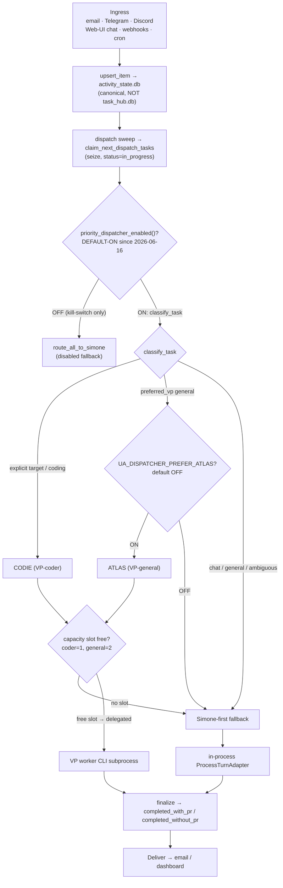
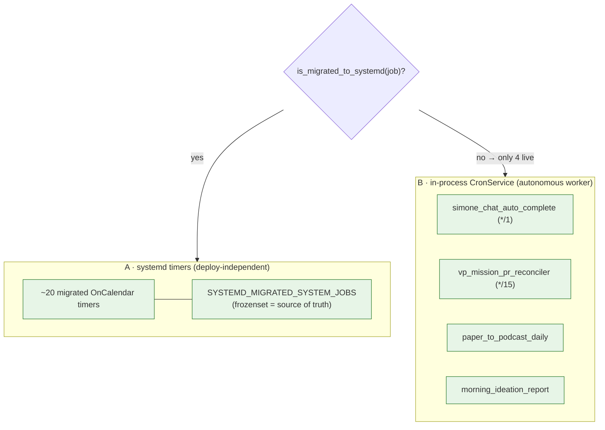
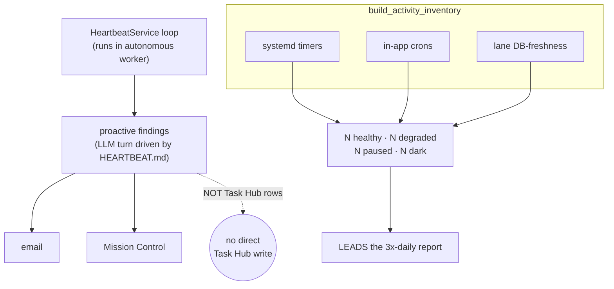
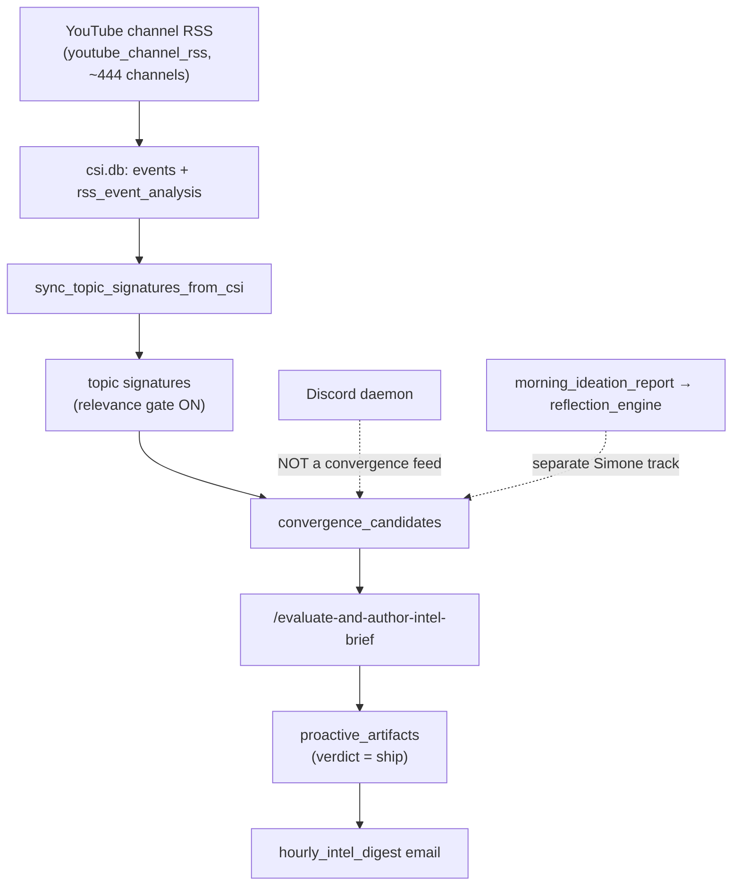
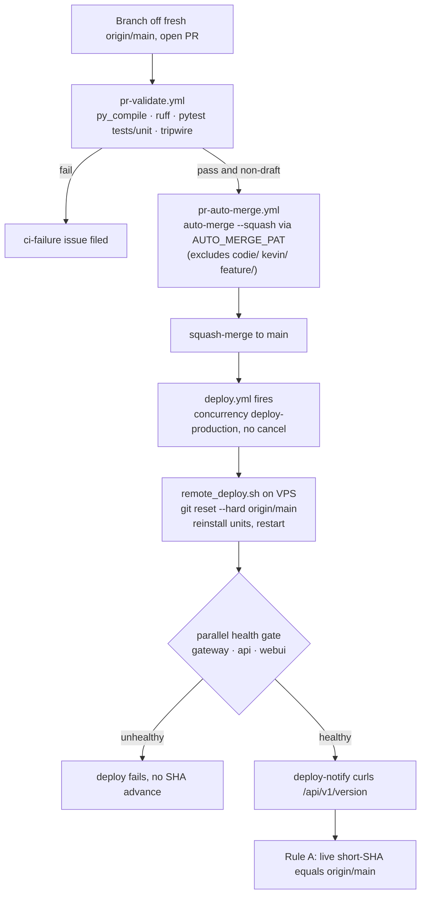

# Project at a Glance — 10-minute onboarding snapshot

**Who this is for:** anyone (human or agent) who needs to understand what Universal Agent
(UA) *is*, how it's structured, and how work flows — fast — before deep-diving any one
part. It's a **curated entry point**, not a source of truth: each exhibit links to the
canonical doc that owns the detail, and for *live* status you read
[`00_PLATFORM_STATUS_REGISTRY.md`](00_PLATFORM_STATUS_REGISTRY.md) (the START-HERE index)
or the 3×-daily proactive report — not this dated snapshot. Every claim here was verified
against the live system on 2026-06-22.

> Status shorthand used below: **LIVE** ✅ · **PARKED/PAUSED** ⏸️ · **RETIRED** 🌑 ·
> **SCAFFOLDING** 🏗️ (built, no prod caller).

---

## 1. UA in one picture

One VPS, two gateway processes, four principals, three shared DBs — the desktop never runs anything operational.

UA is a set of long-lived Python services that run **only on the VPS** (`uaonvps`, user
`ua`, `/opt/universal_agent`). The desktop is Kevin's interactive cockpit — nothing
operational runs there. Since the **autonomous-runtime split** (LIVE 2026-06-19),
production runs *two* `gateway_server` processes: the public HTTP gateway on `:8002`, and
a second process (`role=autonomous_worker`, `:8092`) that hosts **every** autonomous loop
off the HTTP loop. `loop_control.py::should_host_autonomous_runtime` makes them mutually
exclusive (no double-fire). **Why:** glm-5.2 thinking-ON turns ran 15+ min in-process and
starved uvicorn; the split moved them off the HTTP loop. Owner:
[`01_architecture/01_system_overview.md`](01_architecture/01_system_overview.md).

---

## 2. Processes & ports

The platform is not one process — five UA listeners plus port-less services, all on the VPS.

| Port | Process | systemd unit | Role |
|---|---|---|---|
| `8002` | `gateway_server` (HTTP) | `universal-agent-gateway.service` | Public gateway — REST + WS + dashboard backend (fronted by nginx). |
| `8092` | `gateway_server` (`role=autonomous_worker`) | `universal-agent-autonomous-runtime.service` | All autonomous loops, off the HTTP loop. Private port, no public route. |
| `8001` | `universal_agent.api.server` | `universal-agent-api.service` | REST API surface. |
| `8091` | `csi_ingester.app` (uvicorn) | `csi-ingester.service` | CSI ingestion — sources + RSS adapters + semantic enricher. |
| `3000` | `next-server` | `universal-agent-webui.service` | Web UI / dashboard frontend. |
| — | mission-control sweeper | `universal-agent-mission-control-sweeper.service` | Chief-of-staff housekeeping sweeper (own deploy-isolated process). |
| — | telegram / discord | `universal-agent-telegram.service`, `ua-discord-intelligence.service`, `ua-discord-cc-bot.service` | Channel daemons. |
| `8080` | filebrowser | *(not UA)* | A co-tenant on the box — **NOT** part of UA. |

The only two UA gateway ports are **8002** (public) and **8092** (private worker) — same
`gateway_server.py` in different roles. VP workers run as systemd template instances
`universal-agent-vp-worker@<vp_id>.service` (port-less). Re-verify deployed code with
`curl -s localhost:8002/api/v1/version`. Owners:
[`05_channels/05_web_ui_communication.md`](05_channels/05_web_ui_communication.md),
[`00_PLATFORM_STATUS_REGISTRY.md`](00_PLATFORM_STATUS_REGISTRY.md) §1.

---

## 3. How one unit of work flows (task lifecycle + the live routing fork)

Every task converges on the Task Hub spine, then hits the priority-dispatcher fork that decides VP-direct vs. Simone-fallback.

A task is a durable `task_hub_items` row in `activity_state.db` (**not** the orphaned
`task_hub.db`). The fork people get wrong: the **priority dispatcher is the LIVE router,
DEFAULT-ON since 2026-06-16** (`priority_dispatcher.py::priority_dispatcher_enabled`
returns True; the flag is only a kill-switch), so `dispatch_service.py::_enrich_with_routing`
**skips** `route_all_to_simone` — Simone-first is the disabled fallback. `classify_task`
sends explicit-target/coding → CODIE; chat/general/ambiguous → Simone; `preferred_vp`
general → ATLAS only if `UA_DISPATCHER_PREFER_ATLAS` (default **OFF**). VP-direct is
capacity-gated (coder=1, general=2); no slot ⇒ deferred to Simone. Owners:
[`02_execution_core/02_task_hub.md`](02_execution_core/02_task_hub.md),
[`01_architecture/02_task_lifecycle_end_to_end.md`](01_architecture/02_task_lifecycle_end_to_end.md).

---

## 4. Two schedulers (and the gotcha that fools everyone)

Recurring work runs on two independent substrates; a migrated job that reads `enabled:false` is correctly migrated, not off.

Substrate (A) is ~20 **systemd timers** (`systemd_migrated_jobs.py::SYSTEMD_MIGRATED_SYSTEM_JOBS`),
deploy-independent. Substrate (B) is the in-process `CronService` in the autonomous worker —
only **four** jobs are genuinely live (they need the agent runtime/skills/MCP). **The
gotcha:** a migrated job still shows `enabled:false` in `cron_jobs.json` — that is the
*correct* migrated state (the timer is the sole firer), **not** "off." Disambiguate with
`systemd_migrated_jobs.py::is_migrated_to_systemd`; global rollback is
`UA_SYSTEMD_TIMER_MIGRATION_DISABLED=1`. Owners:
[`03_agents/04_cron_and_scheduling.md`](03_agents/04_cron_and_scheduling.md),
[`06_platform/08_scheduling_substrate_adr.md`](06_platform/08_scheduling_substrate_adr.md).

---

## 5. Proactive brain: heartbeat + the fleet activity inventory

Simone's heartbeat drives proactive findings; a single reconciled inventory answers "is the whole fleet healthy right now?"

`heartbeat_service.py::HeartbeatService` emits findings to **email + Mission Control** —
deliberately **not** Task Hub rows. `services/proactive_activity_report.py::build_activity_inventory`
reconciles systemd timers + in-app crons + lane DB-freshness into the "N healthy · N
degraded · N paused · N dark" line leading the 3×-daily proactive report — the **runtime
equivalent of the Platform Status Registry**. Status vocabulary: healthy ✅ / degraded ⚠️ /
paused ⏸️ / parked ⏸️ / dark 🌑 / unknown ❔. Owners:
[`03_agents/03_heartbeat_service.md`](03_agents/03_heartbeat_service.md),
[`04_intelligence/10_proactive_pipeline.md`](04_intelligence/10_proactive_pipeline.md).

---

## 6. CSI → convergence: the intelligence pipeline

YouTube channel RSS is the only live CSI ingestion feed, and it drives the one path from raw signal to a shipped intel-brief email.

`services/proactive_convergence.py::sync_topic_signatures_from_csi` reads exactly one
source — `csi.db events WHERE source='youtube_channel_rss'` joined to `rss_event_analysis`
— so a relevance gate filters before candidates form. **Discord is NOT a convergence feed**
(standalone daemon), and the Simone ideation report is a separate track. Code-authoritative
source status is `services/invariants/csi_source_liveness.py::effective_source_thresholds`:
`youtube_channel_rss` **LIVE** ✅; `threads_*`, `csi_analytics`, `youtube_playlist`
**RETIRED** 🌑; `hackernews` **PARKED** ⏸️; `claude_code_intel` (X) **PAUSED** ⏸️ (X API
HTTP 402). Owners: [`04_intelligence/01_csi_architecture.md`](04_intelligence/01_csi_architecture.md),
[`04_intelligence/05_youtube_csi_flow.md`](04_intelligence/05_youtube_csi_flow.md).

---

## 7. Where state lives (the DBs)

Physically separate SQLite files with deliberate lane isolation — and stale orphans that trick diagnostics.

| Database | Holds | Watch-out |
|---|---|---|
| `activity_state.db` | **Canonical Task Hub** — items, assignments, runs, cron links; dashboard activity. | `task_hub.db` is a **stale orphan**, not canonical. Resolve via `get_activity_db_path()`. |
| `vp_state.db` | Live VP mission ledger (`vp_missions`, sessions, events) for CODIE/ATLAS/HOMER. | Resolve via `get_vp_db_path()`, **NOT** `runtime_state.db`. |
| `csi.db` | CSI `events`, `rss_event_analysis` (transcripts), `proactive_artifacts`. | Lives at `/var/lib/universal-agent/csi/csi.db`; resolve via `_csi_default_db_path()`. |
| `runtime_state.db` | Simone's in-process control plane — run queue, tool-call ledger, checkpoints. | The live run queue, not a cache — deleting it drops queued/running runs. |
| `.csi_digests.db` | Lean CSI digests (link-first daily/hourly digest store). | Separate from `csi.db`. |

The most-misremembered fact: **the Task Hub schema lives inside `activity_state.db`** — a
past incident forked undelivered intel briefs into a cwd-relative orphan because a skill
used a placeholder path instead of `get_activity_db_path()`. When a number looks wrong,
confirm *which* DB it came from first. Owner:
[`01_architecture/03_database_architecture.md`](01_architecture/03_database_architecture.md).

---

## 8. The Virtual Principals (VPs): CODIE, ATLAS, HOMER

A VP mission is the unit of delegated autonomous work; workers run as systemd template instances.

| VP | id | inference | role / output | prod status |
|---|---|---|---|---|
| **CODIE** | `vp.coder.primary` | ZAI | Coder — builds demos/code; output is a **PR**; `cli` mode; success = `completed_with_pr` | LIVE ✅ (default on) |
| **ATLAS** | `vp.general.primary` | ZAI | Generalist — research, intel briefs, convergence eval; `sdk` mode | LIVE ✅ (default on) |
| **HOMER** | `vp.general.secondary` | ZAI | ATLAS capacity twin (shares `ATLAS_SOUL.md`); pool overflow only | LIVE ✅ in prod (code default OFF; on via `UA_VP_ENABLED_IDS`) |

The cardinal rule: **inference follows the VP, not the work** (all three default to ZAI/GLM;
Anthropic Max is a per-task `cody_mode` opt-in). Concurrency peaks at **≤ 2 running**: ATLAS
holds one slot; the second is shared between CODIE and HOMER under bidirectional mutual
exclusion (`UA_MAX_CONCURRENT_VP_CODER=1`, `UA_MAX_CONCURRENT_VP_GENERAL=2`). The gate keys
on live `vp_missions` RUNNING state in `vp_state.db`, not the assignment snapshot. A
`completed_without_pr` from CODIE is a likely-failure signal. Owner:
[`03_agents/01_vp_workers_and_delegation.md`](03_agents/01_vp_workers_and_delegation.md).

---

## 9. Which model runs where (the 3 execution profiles)

Confusing the three profiles is the most common model-routing mistake — the profile decides the endpoint and credential, not the model string.

| Profile | Who / when | Model |
|---|---|---|
| **1. Interactive coding** | Kevin at a terminal (`claude` / `claudereal`) | Real Anthropic **Max** via OAuth (`ANTHROPIC_*` stripped) |
| **2. UA autonomous in-process** | Simone heartbeats, dispatch sweep, ATLAS | **ZAI / GLM** (injected by `initialize_runtime_secrets()`) |
| **3. Cody / all-VP per-task** | VP-dispatched missions | **ZAI by default** (since 2026-06-07); Anthropic Max opt-in via `cody_mode` |

The tier resolvers in `utils/model_resolution.py` return a model *name*; the *profile*
decides what it means. `resolve_opus()` → **glm-5.2** (thinking defaults ON, ~10–24× the
tokens, so cheap calls pass `thinking={"type":"disabled"}`). Routing is decided by
`ANTHROPIC_BASE_URL`, not the model string — a bare `Anthropic()` in a daemon hits ZAI;
reaching real Anthropic means *removing* those env vars so OAuth engages. **Common past
mistake:** "Cody defaults to Anthropic Max" is **wrong since 2026-06-07**. Owners:
[`01_architecture/04_model_choice_and_resolution.md`](01_architecture/04_model_choice_and_resolution.md),
[`06_platform/05_environments.md`](06_platform/05_environments.md).

---

## 10. Ship → verify (the deploy pipeline)

Any branch becomes running production through one GitHub-Actions path.

Branch off a *freshly-fetched* `origin/main` (a stale local `main` can revert newer commits
on squash). Auto-merge uses `AUTO_MERGE_PAT` on every non-draft PR **except** `codie/*`,
`kevin/*`, `feature/*`. `deploy.yml`'s concurrency guard (`cancel-in-progress: false`)
queues simultaneous deploys. Docs-only (`**.md`) changes are `paths-ignore`'d (no restart).
**Done means green:** confirm live `/api/v1/version` short-SHA equals `origin/main` (Rule A).
Owner: [`06_platform/04_deployment_and_cicd.md`](06_platform/04_deployment_and_cicd.md).

---

## 11. What's live right now (status registry snapshot)

A distilled snapshot — the single answer to "what do we have, and is it live?" (the canonical, re-verifiable version is the registry).

| Subsystem | Status | Note |
|---|---|---|
| Autonomous-runtime split | LIVE ✅ | Prod = `split`; loops in the `:8092` worker. Code default `in_process` (prod ≠ default). |
| Priority dispatcher (router) | LIVE ✅ | Default-ON since 2026-06-16; Simone-first is the disabled fallback. |
| CODIE / ATLAS | LIVE ✅ | Workers running; both ZAI/GLM. |
| HOMER (3rd VP) | LIVE ✅ | Code default OFF; on in prod via `UA_VP_ENABLED_IDS` (prod ≠ default). |
| `youtube_channel_rss` | LIVE ✅ | The sole convergence feed. |
| `hackernews` | PARKED ⏸️ | `UA_HACKERNEWS_SNAPSHOT_ENABLED=0`; no auto producer. |
| `claude_code_intel` (X) | PAUSED ⏸️ | Default flipped 1→0 (X API HTTP 402). |
| `threads_*` / `csi_analytics` / `youtube_playlist` | RETIRED 🌑 | Decommissioned; superseded by the convergence pipeline. |
| LINK / Stripe payments MCP | LIVE ✅ | Autonomous surface only (`UA_ENABLE_LINK=1`); live-spend needs two more flags. |
| URW orchestrators | SCAFFOLDING 🏗️ | Operator-CLI only; dormant on prod. |
| Agent College | RETIRED 🌑 | Never wired into the prod gateway runtime. |

This is a dated snapshot — the **canonical, re-verifiable** version (with gates, code
defaults, and anchors for every row) is [`00_PLATFORM_STATUS_REGISTRY.md`](00_PLATFORM_STATUS_REGISTRY.md).
Status there is sourced from machine-authoritative functions, not prose, so it resists rot.

---

## 12. How the project stays un-confusing (operating principles)

| Principle | Why it exists |
|---|---|
| **1. Code is the source of truth** | Docs describe what the code does *now*; cite symbols as `file::symbol`, never line numbers; CI (`scripts/doc_audit.py`) enforces it. |
| **2. The Platform Status Registry is the single index** | One place answers "what do we have, and is it live?" — read it first. |
| **3. Status is read from code, not prose** | "Default-flip blindness" (a flag flips, prose goes stale) is the #1 doc-rot pattern; rottable status is sourced from a function, cited inline. |
| **4. LLM-native intelligence** | Code collects/gates evidence; the LLM synthesizes meaning over a bounded context. |
| **5. Runtime-vs-dev contract** | UA *runs* on the VPS; the desktop is only the cockpit. Anything scheduled is a `deployment/systemd/` unit. |
| **6. Two schedulers + the migration-artifact gotcha** | A migrated cron showing `enabled:false` is correctly migrated, not off — check `is_migrated_to_systemd`. |

The throughline: **one authoritative source per question, mechanically defended.** When you
change behavior, update the doc that owns it *in the same PR*. When something looks "dead,"
check the canonical resolver before concluding — an `enabled:false` cron, a private `:8092`
worker, and a parked flag-gated lane all look dead from the wrong vantage point. Governance:
[`CLAUDE.md`](CLAUDE.md); full index: [`README.md`](README.md).
