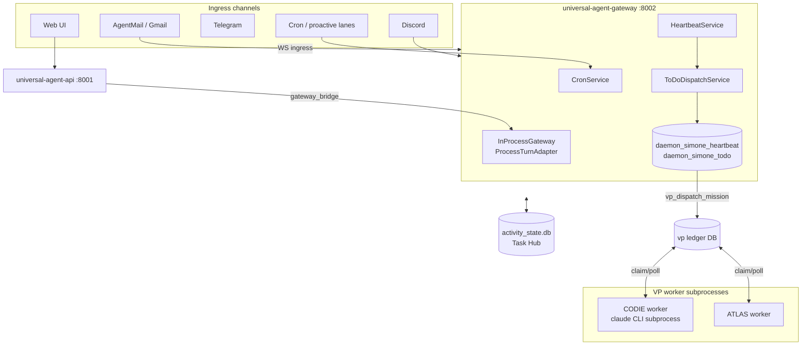
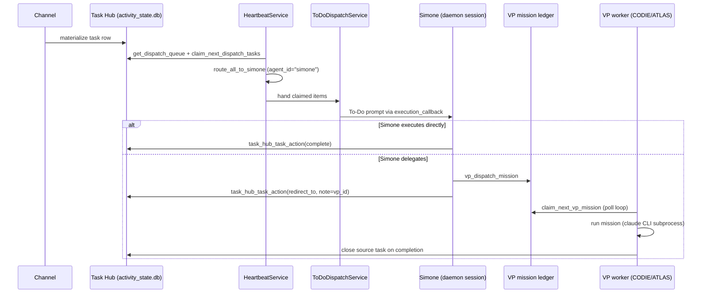

# System Architecture Overview

This is the map a newcomer reads first. It describes the **process topology** (what
runs where), the **principals** (the named agents that do work), and the **what-talks-to-what**
data flow that carries a unit of work from ingress to delivery. Deeper subsystem docs
(Task Hub, VP delegation, heartbeat, gateway/sessions) are linked at the end.

## The one-paragraph mental model

Universal Agent is a set of long-lived Python services on a single VPS. The **gateway**
(`gateway_server.py`, port 8002) is the brain: it owns an in-process execution engine
(`InProcessGateway`) and runs **Simone** — the primary orchestrator — as always-on
in-process *daemon sessions*. Work of every kind (email, chat, webhooks, cron, proactive
intelligence) is normalized into rows in a shared SQLite **Task Hub** (`activity_state.db`).
Simone's heartbeat sweeps that queue, claims the top tasks, and either executes them
herself or **delegates** them to one of two on-demand **VP workers** — **CODIE** (coding)
and **ATLAS** (general) — which run as *separate subprocess services* polling a VP-mission
DB. Everything is gated by deterministic code (concurrency, dedup, safety) but the
*reasoning* (triage, synthesis, delegation decisions) is done by LLMs.

## Principals vs. sub-agents (read this first — it is the #1 source of confusion)

| Term | What it is | Where it lives |
|---|---|---|
| **Principal** | A top-level Claude Code orchestrator instance driven by its own loop. | Simone, CODIE (`vp.coder.primary`), ATLAS (`vp.general.primary`). |
| **Sub-agent** | A helper agent definition invoked *by* a principal for a bounded task. | `.claude/agents/<name>.md` (e.g. `csi-supervisor`, `evaluation-judge`). |

`ls .claude/agents/` will **not** show Simone, CODIE, or ATLAS — that does not mean they
are missing. Simone is defined by directives in `memory/HEARTBEAT.md` and runs as the
`daemon_simone_heartbeat` / `daemon_simone_todo` in-process sessions
(`services/daemon_sessions.py::_DEFAULT_AGENT_ROLE_MAP`). CODIE and ATLAS are defined by
`vp/profiles.py::resolve_vp_profiles` and run as external worker subprocesses. Diagnose a
principal's presence by checking daemon/worker session state, not by listing sub-agent files.

### The three principals

`vp/profiles.py::resolve_vp_profiles` is the source of truth for the two VPs:

```python
"vp.coder.primary": VpProfile(vp_id=coder_vp_id(), display_name="CODIE",
    client_kind="claude_code", soul_file="CODIE_SOUL.md", ...)
"vp.general.primary": VpProfile(vp_id="vp.general.primary", display_name="ATLAS",
    client_kind="claude_generalist", soul_file="ATLAS_SOUL.md", ...)
```

- **Simone** — the primary executor/orchestrator. Always-on. Runs *inside* the gateway
  process. Takes the next task and works it directly, or delegates.
- **CODIE** (`vp.coder.primary`) — the coding VP. On-demand only; spawns a real `claude`
  CLI subprocess per mission (`vp/clients/claude_cli_client.py`).
- **ATLAS** (`vp.general.primary`) — the general VP. On-demand only; the generalist client.

> Naming gotcha: the human display name is **CODIE** but the email target label is
> `agent-codie` (NOT `agent-cody`). The internal `vp_id` is `vp.coder.primary`. "Cody" /
> "cody_mode" appears in model-routing code as a historical spelling — same VP.

`services/daemon_sessions.py` makes the asymmetry explicit:

```python
DEFAULT_DAEMON_AGENTS = ("simone",)  # Atlas & Cody are on-demand only; no proactive polling
```

Only Simone gets always-on daemon sessions. ATLAS and CODIE do nothing until Simone
delegates a mission to them.

## Process topology (systemd services)

The system is a handful of independent systemd units, restarted together by the deploy
workflow (`.github/workflows/deploy.yml`):

| Service | Module / port | Role |
|---|---|---|
| `universal-agent-gateway` | `gateway_server.py` — **port 8002** | The brain. InProcessGateway + execution engine + heartbeat + daemon Simone + cron + Task Hub dispatch. Health: `/api/v1/health`. |
| `universal-agent-api` | `api/server.py` — **port 8001** | Web UI REST/WebSocket API. Proxies execution to the gateway via `api/gateway_bridge.py`. |
| `universal-agent-webui` | `web-ui/` | The dashboard frontend. |
| `universal-agent-telegram` | `bot/` | Telegram polling bot (separate channel). |
| `ua-discord-cc-bot` | Discord control-channel bot. |
| `ua-discord-intelligence` | Discord intel pipeline + Google Workspace (gws) calendar materialization. |
| `universal-agent-vp-worker@vp.coder.primary` | `vp/worker_main.py` | CODIE worker subprocess. Polls VP-mission DB. |
| `universal-agent-vp-worker@vp.general.primary` | `vp/worker_main.py` | ATLAS worker subprocess. Polls VP-mission DB. |

The VP workers are systemd *template instances* (`@vp.coder.primary`,
`@vp.general.primary`). They run as the system user `ua`, and so does the gateway/discord
daemon — they share `HOME=/home/ua` so gws/Infisical-materialized creds are visible to all.



## The gateway process (`InProcessGateway`)

`gateway.py::InProcessGateway` is the canonical execution engine. Key facts from the code:

- It wraps the unified engine via `ProcessTurnAdapter` (`execution_engine.py::ProcessTurnAdapter`),
  one adapter per session (`self._adapters`). A legacy `AgentBridge` path exists but is
  deprecated (`use_legacy_bridge`).
- **Locking model** (`__init__`): a single `_execution_lock` serializes session
  create/resume (which mutate shared adapter dicts), while **per-session** locks
  (`_session_exec_locks`, via `_get_session_exec_lock`) let different sessions execute
  concurrently. There is a dedicated `_coder_vp_lock` for the single-lane CODER VP shared
  adapter. The gateway tracks lock-wait/hold telemetry in `_execution_runtime`.
- **Three runtime DBs** are opened at construction:
  - `get_runtime_db_path()` — Simone runtime queue/checkpoints.
  - `get_coder_vp_db_path()` — CODIE lane telemetry, isolated to avoid cross-lane SQLite
    lock contention.
  - `get_vp_db_path()` — the VP mission ledger for external primary workers.
  > Note: these are *runtime* DBs. The canonical **Task Hub** DB is a separate file,
  > `activity_state.db` (`get_activity_db_path()`), used by the heartbeat for the dispatch
  > queue. Do not confuse it with a `task_hub.db`.
- A **session reaper** (`start_reaper`, `_reaper_ttl_seconds`) cleans up idle sessions.

`get_gateway()` (`gateway_server.py`) is a process-wide singleton constructing one
`InProcessGateway(workspace_base=WORKSPACES_DIR)`. There is also an `ExternalGateway`
(HTTP/WS client to a remote gateway) used by clients that don't run in-process.

### Gateway lifespan / startup wiring

`gateway_server.py::lifespan` is where the whole runtime is assembled, in order:

1. `bootstrap_runtime_environment(profile=...)` resolves Infisical secrets and `.env`,
   then re-reads `UA_DEPLOYMENT_PROFILE` (because the module-level read runs before `.env`
   loads). Profiles: `local_workstation`, `standalone_node`, `vps`.
2. Connects the runtime DB (WAL mode, busy_timeout), runs migrations, prunes activity,
   pre-warms the dashboard SQLite page cache.
3. If `HEARTBEAT_ENABLED`: constructs `HeartbeatService`, then — gated by
   `daemon_sessions_enabled()` — constructs `DaemonSessionManager` and calls
   `ensure_daemon_sessions()` to create Simone's always-on sessions, registering each with
   the gateway (`register_existing_session`) and the heartbeat.
4. Constructs `ToDoDispatchService` (Simone's task-execution loop) and starts it.
5. Spawns a **startup recovery sweep** (in a thread, via `asyncio.to_thread`, so a large
   `activity_state.db` doesn't block the event loop) that releases orphaned in-progress
   assignments and reconciles task lifecycle.
6. Starts cron, idle-dispatch loop, VP event bridge, gws listener.

> **Deploy-window awareness:** several of these starts are wrapped in
> `_run_after_deployment_window(...)` when `_deployment_window_active()` is true. This
> suppresses restart-noise alerts during a deploy. See the Cron doc for mechanics.

> **Gotcha — event-loop starvation:** Simone's daemon heartbeat runs Claude SDK iterations
> *in-process*. When the gateway has a valid `ANTHROPIC_API_KEY`, those iterations can
> starve the asyncio loop for 15–20s at a time, making HTTP requests stall. The kill switch
> is `UA_DAEMON_SESSIONS_ENABLED=0`. This is an architectural property, not a transient bug.

> **Gotcha — socket bind:** `main()` binds an explicit socket with `SO_REUSEPORT` and hands
> the fd to `uvicorn.Config(app, fd=sock.fileno())`. This was the fix for a 2026-05-16
> incident where uvicorn 0.46.0's lifespan-then-bind ordering wedged the gateway. Do not
> "simplify" this back to a plain `uvicorn.run(host, port)`.

> **Gotcha — resource limits:** the gateway systemd template
> (`deployment/systemd/templates/universal-agent-gateway.service.template`) sets
> `MemoryMax=8G`, `MemoryHigh=6G`, `TasksMax=500` to guard against runaway memory and
> fork-bombs from spawned subprocesses. The template itself does **not** set `OOMPolicy`.
> `OOMPolicy=continue` (a child OOM-kill is OK; the gateway survives) is supplied separately
> by the optional drop-in installer `scripts/install_vps_memory_guardrails.sh`, which writes
> `/etc/systemd/system/<svc>.d/override.conf` for the gateway and csi-ingester. Note that
> drop-in **also overrides** the template numbers with percent-based limits
> (`MemoryHigh=85%`, `MemoryMax=95%`, `TasksMax=4096` by default), so the effective limits on
> a VPS where the guardrails are installed differ from the template defaults.

### Two different "heartbeats" — don't conflate them

There are two unrelated mechanisms both called "heartbeat":

| Mechanism | Code | What it does |
|---|---|---|
| **Process heartbeat** (OS-level liveness) | `process_heartbeat.py` | A daemon **thread** writes a Unix timestamp to a file every ~10s, even during a long LLM call. Read by `vps_service_watchdog.sh` to detect a wedged process and restart it. |
| **HeartbeatService** (app-level scheduler) | `heartbeat_service.py` | An **async task** that wakes Simone every ~30 min (or on demand) to sweep the Task Hub, run health/proactive checks, and dispatch work. |

The first proves the process is alive; the second drives autonomous agent behavior.

> **Scope note:** the HeartbeatService does **not** own trusted-email mission execution.
> That work is materialized into Task Hub and run through the dedicated ToDoDispatchService.
> The heartbeat is responsible for health supervision, proactive checks, and queue sweeps.

### Optional Redis delegation bus

`lifespan` initializes a `RedisMissionBus` (`gateway_server.py`) when
`_delegation_bus_enabled` and the factory policy permits publish/listen. It is **optional**:
if Redis is unavailable the gateway logs `falling back to http queue` and delegation flows
through the SQLite VP ledger instead. Most single-VPS deployments run without it.

## How a unit of work flows (the canonical path)

The system normalizes *all* asynchronous work into **Task Hub** rows, then Simone's
heartbeat dispatches them. The Simone-execution path:

1. **Ingress → Task Hub.** Each channel materializes a task row in `activity_state.db`
   (email via `email_task_bridge`, cron via the cron handler, proactive lanes via their
   producers, etc.).
2. **Heartbeat sweep.** `HeartbeatService._run_heartbeat` (in the `daemon_simone_heartbeat`
   session) periodically: releases stale assignments, prunes settled tasks, then calls
   `task_hub.get_dispatch_queue(conn, limit=max(3, max_proactive_per_cycle*4))` to rank the
   queue. A **Capacity Governor** gate (`services/capacity_governor.py`) can block dispatch
   if the provider is under 429 backoff or all slots are full.
3. **Claim + route.** Dispatch is the `dispatch_sweep` pattern
   (`services/dispatch_service.py::dispatch_sweep`): a stale-release pass, then
   `task_hub.claim_next_dispatch_tasks(conn, limit=N, ...)` atomically claims the top tasks,
   then `_enrich_with_routing`. **Routing is Simone-first:**
   `services/agent_router.py::route_all_to_simone` assigns *every* claimed task
   `agent_id="simone"`. The system does not pre-route to VPs — Simone decides delegation.
4. **Execute (Simone).** `ToDoDispatchService` builds a To-Do prompt of the claimed items
   and feeds them to Simone's session via the gateway's `execution_callback`. Simone works
   each item with her full toolset/skills/sub-agents.
5. **Delegate (optional).** If Simone decides a task belongs to a VP, she calls the
   `vp_dispatch_mission` tool. She then **must** disposition the source task with
   `task_hub_task_action(action="redirect_to", note="<vp_id>")` — *not* `complete`. This
   releases her claim, stamps `metadata.preferred_vp`, and satisfies the lifecycle-audit
   guardrail without lying that the work is done (the VP closes the source task on its own
   completion). The "redirect_to, not complete" rule is enforced in
   `todo_dispatch_service.py`'s prompt and is a recurring footgun.
6. **Finalize.** Simone dispositions every claimed item (`complete` / `review` / `block` /
   `park`).



## VP delegation & worker subprocesses

When Simone delegates, `gateway.py::_dispatch_external_vp_mission` writes a mission row to
the VP ledger DB via `vp/dispatcher.py::dispatch_mission_with_retry`. The VP workers are
**separate subprocesses** (`vp/worker_main.py` → `vp/worker_loop.py::VpWorkerLoop`) that:

- Poll the VP DB on `vp_poll_interval_seconds` (default 5s), claiming the next mission with
  `claim_next_vp_mission`, holding a session **lease** and heartbeating the claim.
- The gateway checks worker liveness before dispatch (`_external_vp_worker_health`): a
  worker is "live" if its session status is operational AND it has a live lease *or* a fresh
  heartbeat (stale window `vp_worker_heartbeat_stale_seconds`, default 180s). Dispatch can be
  gated on a live worker (`vp_require_live_worker_for_dispatch`, default True).
- CODIE runs via `vp/clients/claude_cli_client.py::ClaudeCodeCLIClient`, which spawns a real
  `claude --print` subprocess. The model/auth profile is resolved per-mission by
  `services/cody_mode.py` (`resolve_from_payload`); when `cody_mode == "anthropic"` the
  spawned env has all `ANTHROPIC_*` vars scrubbed so OAuth (Max plan) wins. See the
  Model Resolution and Environments docs for the full routing matrix.

### Mission priority tiers

`vp/mission_priority.py` assigns each mission to one of four semantic tiers (ordered by how
much delay is tolerable), with numeric `priority` as a within-tier tiebreaker:

| Tier | Meaning | Example mission types |
|---|---|---|
| `operator_daily` | Kevin reads it with morning coffee | `briefing`, `morning_briefing`, `evening_briefing`, `youtube_daily_digest` |
| `operator_signal` | Proactive intel, operator-visible, time-sensitive | `insight_brief`, `convergence_brief` |
| `maintenance` | System housekeeping (curation, wiki, cleanup) | runs when operator tiers are idle |
| `background` | Opportunistic; the **safe default** | anything unmapped |

The default tier is `background` (`DEFAULT_TIER`). Mapping is `mission_type → tier` via
`_MISSION_TYPE_TIER_MAP`; omitting a type silently resolves to `background`, which has
starved time-sensitive lanes before (e.g. ideation feeding the hourly digest had to be
promoted to `operator_signal`). When adding a mission type that must outrank maintenance,
add it to the map explicitly.

## Web UI vs. gateway split

The Web UI does **not** execute work itself. `api/server.py` (port 8001) serves the
dashboard REST/WebSocket API and forwards execution requests to the gateway (port 8002) via
`api/gateway_bridge.py` when `UA_GATEWAY_URL` is set. The bridge creates sessions over REST
and streams events back over WebSocket, so the Web UI uses the *same* canonical execution
engine as every other channel. File uploads and live execution state live on the gateway,
not the API server.

## Key environment flags (topology-level)

| Flag | Effect |
|---|---|
| `HEARTBEAT_ENABLED` / `heartbeat_enabled()` | Master switch for the heartbeat + daemon Simone + todo-dispatch + cron block. |
| `UA_DAEMON_SESSIONS_ENABLED` | Explicit on/off for Simone's daemon sessions (kill switch for event-loop starvation). |
| `UA_DAEMON_SESSION_AGENTS` | Which agents get daemon sessions (default `simone`). |
| `UA_GATEWAY_PORT` (default 8002) / `UA_API_PORT` (default 8001) | Service ports. |
| `UA_DEPLOYMENT_PROFILE` | `local_workstation` \| `standalone_node` \| `vps`. |
| `UA_GATEWAY_URL` | When set, the API server / external clients proxy to a remote gateway. |
| `vp_require_live_worker_for_dispatch` (default True) | Gate VP dispatch on a live worker. |
| `vp_poll_interval_seconds` (default 5) | VP worker poll cadence. |
| `vp_worker_heartbeat_stale_seconds` (default 180) | Worker liveness window. |
| `UA_DEV_<NAME>_FORCE_ON` | In local dev, autonomous loops are OFF by default; opt one in. |

## Topology hazards worth internalizing

- **The canonical Task Hub DB is `activity_state.db`, not `task_hub.db`.** A stale
  `AGENT_RUN_WORKSPACES/task_hub.db` exists and has misled prior handoffs. Always resolve
  via `durable/db.py::get_activity_db_path()`; never hardcode a path.
- **Simone runs unconstrained in the production checkout.** Her daemon heartbeat executes
  autonomously against `/opt/universal_agent`. A rogue/un-reviewed branch deployed here once
  introduced a `SyntaxError` mid-flight that crashed a cron; recovery required stopping the
  gateway and parking the task with careful SQL (a plain `cancel` gets resurrected by the
  orphan-reconciler). Treat the production tree as live and never let autonomous work pollute
  it with untracked files.
- **Parallel liveness models don't inform each other.** Factory heartbeat and CSI delivery
  health are separate; if the gateway goes down, both fail but neither signals the other.

## Where to go next

- **Task lifecycle end-to-end:** `01_architecture/02_task_lifecycle_end_to_end.md`
- **Task Hub & dispatch internals:** `02_execution_core/02_task_hub.md`
- **Gateway, sessions & execution engine:** `02_execution_core/01_gateway_sessions_execution.md`
- **VP workers & delegation:** `03_agents/01_vp_workers_and_delegation.md`
- **Simone-first orchestration:** `03_agents/02_simone_first_orchestration.md`
- **Heartbeat service:** `03_agents/03_heartbeat_service.md`
- **Model choice & resolution (ZAI vs Anthropic):** `01_architecture/04_model_choice_and_resolution.md`
- **Execution environments (3 Claude profiles):** `06_platform/05_environments.md`
