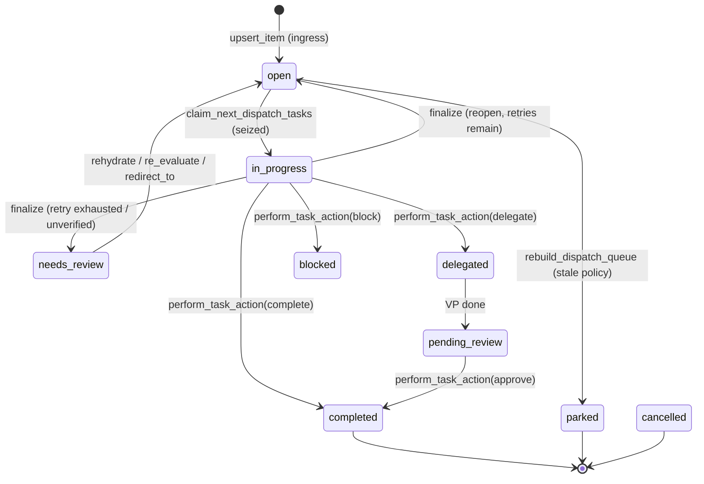
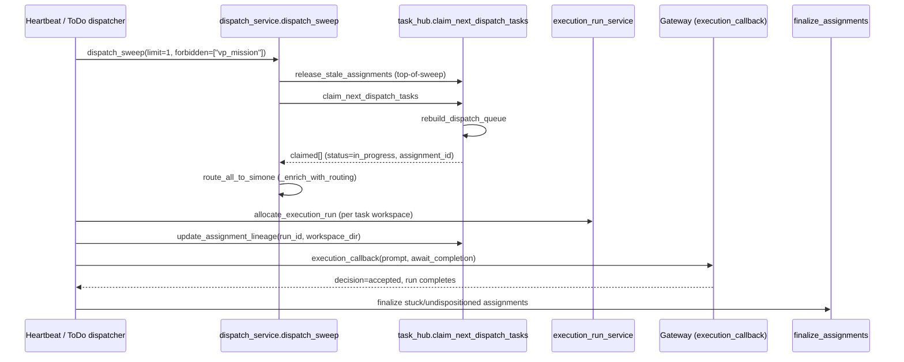

# Task Lifecycle End-to-End

This document traces **one unit of work** through the Universal Agent Task Hub:
ingress → queue → claim → execute → finalize → deliver. It is the canonical
description of how a "task" (a durable `task_hub_items` row) moves through its
states and the code that drives each transition.

## The Four Durable Concepts

The lifecycle is built on a strict separation that the execution-run layer
documents explicitly (`execution_run_service.py` module docstring):

| Concept | Role | Backing store |
|---|---|---|
| **Task** | Durable business identity — "the thing that must get done" | `task_hub_items` row |
| **Assignment** | One claim of a task by one agent/session | `task_hub_assignments` row |
| **Run** | Durable logical execution unit + artifact isolation lineage | `task_hub_runs` row + `runs` catalog |
| **Attempt** | One execution try within a run (the retry boundary) | `run_attempts` row |
| **Session** | Transport container only — **not** an artifact root | gateway session |

A single task may accrue many assignments (retries), and each dispatched
execution allocates its own run workspace. Sessions carry traffic but never
own artifacts.

**Nomenclature discipline.** The codebase deliberately splits four ideas that
casual usage tends to conflate. A **Run** is the durable logical unit; an
**Attempt** is one execution try (the retry boundary); an **Execution Session**
is the live provider/runtime process actually executing — this is the *only*
legitimate use of the bare word "session"; and a **Run Workspace** is the
durable evidence bundle (the per-run directory of artifacts). Reserve "session"
for live, in-flight concepts only — never for the durable run or its workspace.
The durable run/attempt state machine itself is driven by
`workflow_admission.py::WorkflowAdmissionService` (`mark_running`,
`mark_blocked`, `mark_needs_review`, `queue_retry`), which writes the run-level
status separately from the `task_hub_items` status tracked in the next section.

## State Model

Status constants live at the top of `task_hub.py`:

```python
TASK_STATUS_OPEN = "open"
TASK_STATUS_IN_PROGRESS = "in_progress"
TASK_STATUS_BLOCKED = "blocked"
TASK_STATUS_REVIEW = "needs_review"
TASK_STATUS_COMPLETED = "completed"
TASK_STATUS_PARKED = "parked"
TASK_STATUS_CANCELLED = "cancelled"
TASK_STATUS_DELEGATED = "delegated"            # VP is actively working this
TASK_STATUS_PENDING_REVIEW = "pending_review"  # VP done, Simone sign-off needed
TASK_STATUS_SCHEDULED = "scheduled"            # cron trigger fires at due_at
```

- `TERMINAL_STATUSES = {completed, parked, cancelled}` — excluded from queue rebuilds.
- `ACTIVE_STATUSES` — everything else, eligible to appear on the board.
- A parallel **`seizure_state`** field (`unseized` / `seized` / `delegated` /
  `completed` / `rejected` / `parked_manual`) tracks ownership independent of
  status.

**`completed` vs `parked` are not interchangeable.** `completed` is terminal
**success**; `parked` is terminal **deferred** (genuinely held / abandoned). A
prior bug demoted dashboard-cleared completed tasks to `parked`, which erased
the success signal and made Simone's digest read finished work as a backlog
needing triage. The fix (verified in code): hidden-completed tasks keep
`status=completed` and set `stale_state=STALE_STATE_DASHBOARD_HIDDEN`
(`"dashboard_hidden"`); `list_completed_tasks` excludes that marker
(`WHERE status = completed AND COALESCE(stale_state,'') != 'dashboard_hidden'`).
No completed→parked demotion exists anywhere in the current code.



## 1. Ingress — `upsert_item`

Every task enters via `task_hub.upsert_item(conn, item)`. There is no separate
"create" function; upsert is create-or-merge keyed on `task_id`. Notable
behaviors verified in the body:

- **Status preservation across blind re-upserts.** If a source refreshes a task
  and naively sends `status="open"` while the row is already
  `in_progress`/`blocked`/`needs_review`, the existing active status is kept —
  this prevents clobbering a live claim back to open.
- **Label-driven flags.** `must_complete` is forced true by the labels
  `must-complete` / `safety-critical`; `agent_ready` is forced true by the
  `agent-ready` label.
- **Per-task overrides** (all NULL-inheriting): `max_retries`, `cody_mode`
  (only `"zai"`/`"anthropic"` accepted, else NULL), `max_runtime_seconds`.
  Omitting the key inherits the existing row value; passing the key (even `0`/`""`)
  resets to NULL → env-default fallback.
- `trigger_type` defaults to `heartbeat_poll` and must be one of `TRIGGER_TYPES`.

Ingress producers include the email→task bridge (`email_task_bridge.py` calls
`upsert_item`), chat panel, CSI pipeline (`upsert_csi_item`), proactive signal
detectors, and the dashboard quick-add. They all converge on this one function.

## 2. Queue — `rebuild_dispatch_queue`

The dispatch queue is a **snapshot table** (`task_hub_dispatch_queue`),
fully rebuilt on demand — it is not an incremental queue.

`rebuild_dispatch_queue(conn)`:

1. Loads all non-terminal `task_hub_items`.
2. Scores each via `score_task` (base 4.2, plus bonuses for `must_complete`
   +2.8, `safety-critical` +1.2, priority, due urgency, project key, historical
   completion ratio, and a memory-relevance probe). Score is clamped 1.0–10.0.
3. Applies `_apply_stale_policy`. A task that trips the stale cutoff is forced
   to `parked` and skipped — **not** inserted into the queue.
4. Computes `eligible` per task. Eligibility requires `agent_ready=True` **and**
   `score >= policy.agent_threshold`, but is force-disabled for
   `blocked`/`in_progress`/`delegated`/`pending_review`/`scheduled`. `needs_review`
   is ineligible *unless* it is a system-schedule task. `must_complete` and
   system-schedule tasks bypass the score threshold when open/review.
5. **Anti-starvation guards:** `needs_review` tasks whose
   `last_disposition_reason` begins `heartbeat_`/`todo_retry` are kept
   ineligible; tasks whose `todo_retry_count >= todo_retry_limit` are kept
   ineligible (covers a finalize/reopen race).
6. Sorts by a tuple lane: `immediate` trigger first, then system-schedule,
   `must_complete`, `approval` project, then proactive lanes sort *below*
   user-originated work, then score / priority / due / updated.
7. `DELETE FROM task_hub_dispatch_queue` then bulk-inserts every scored row with
   `rank`, `eligible`, and a `skip_reason` (`blocked`, `in_progress`,
   `agent_not_ready`, `below_threshold`, `needs_review`, etc.).

`get_dispatch_queue` reads the latest `queue_build_id` snapshot for the board.

## 3. Claim — `claim_next_dispatch_tasks`

This is the atomic ingress→in-progress transition. It is **always preceded by a
fresh `rebuild_dispatch_queue`** inside the same call, so claims act on a
current snapshot.

For each eligible queue row (re-checked against live status), it:

1. Skips any task carrying a `completion_token` (completion-locked; needs
   explicit operator reset).
2. Inserts a `task_hub_assignments` row with a fresh `assignment_id`
   (`asg_<hex16>`), state `seized`, and the run lineage
   (`workflow_run_id`, `workflow_attempt_id`, `provider_session_id`,
   `workspace_dir`).
3. Opens a parallel `task_hub_runs` row via `_open_run` (best-effort, Phase D —
   never blocks the claim).
4. Updates the task to `in_progress` / `seized` and stamps
   `metadata.dispatch.active_*` lineage fields.
5. Records a `seize` evaluation row.

`claim_task_for_agent` is the **targeted** companion for interactive/explicit
intake — same durable lifecycle, but for one named task without waiting for a
sweep.

`provider_session_id` falls back to a value derived from `agent_id` via
`_session_id_from_agent_id` (strips `heartbeat:`/`todo:` prefixes, passes
`daemon_*` through).

## 4. Dispatch Entry Points — `dispatch_service.py`

`dispatch_service` is the centralized layer that wraps `claim_next_dispatch_tasks`
and enriches every claimed task with Simone-first routing metadata
(`_enrich_with_routing` → `route_all_to_simone`). Four entry points:

| Function | Trigger | Notes |
|---|---|---|
| `dispatch_immediate` | Dashboard "Start Now" | Promotes `trigger_type='immediate'`, claims limit=1 |
| `dispatch_on_approval` | Dashboard "Approve" | Sets `open` + `human_approved` + `agent_ready`, claims |
| `dispatch_scheduled_due` | Timer loop (`gateway_server`) | Claims tasks whose `due_at` arrived |
| `dispatch_sweep` | Heartbeat / todo dispatcher | Generic top-N claim, any trigger type |

`dispatch_sweep` runs a **top-of-sweep stale-release pass**
(`_release_stale_for_sweep` → `release_stale_assignments`) before claiming, so
reopened tasks are eligible in the very rebuild that the claim then performs.
The calling session and any `additional_running_sessions` are excluded from
release. Gated by `UA_DISPATCH_STALE_SWEEP_ENABLED` (default ON in prod) and
`UA_DISPATCH_STALE_AFTER_SECONDS` (default 1800, floored at 60).

`dispatch_sweep` accepts `forbidden_source_kinds`. The todo dispatcher passes
`["vp_mission"]` so it never claims VP-mirror rows that VP workers own
(defense-in-depth backstop; the producer-side fix is `agent_ready=False` on the
mirror — Followup #3).



## 5. Execute — Run Allocation + ToDo Dispatcher

The consumer side is `ToDoDispatchService._process_session`
(`todo_dispatch_service.py`). Per wake:

1. Capacity gate via `CapacityGovernor.can_dispatch()`. If blocked, re-queue the
   wake and defer.
2. **Run-per-task loop** up to `TODO_DISPATCH_MAX_PER_SWEEP`
   (`UA_TODO_DISPATCH_MAX_PER_SWEEP`, default 1, capped 1–5):
   - `dispatch_sweep(limit=1, forbidden_source_kinds=["vp_mission"])`.
   - `allocate_execution_run(...)` creates an isolated workspace under
     `AGENT_RUN_WORKSPACES/<run_id>/`, scaffolds it, and registers durable
     `runs` + `run_attempts` rows.
   - `update_assignment_lineage` stamps the run_id + workspace_dir onto the
     assignment.
3. LLM agent-routing enrichment (`_enrich_with_llm_agent_routing`) picks
   Simone / Atlas / Cody subject to concurrency caps
   (`UA_MAX_CONCURRENT_VP_CODER` default 1, `UA_MAX_CONCURRENT_VP_GENERAL`
   default 2).
4. `build_todo_execution_prompt` assembles the Simone orchestration prompt
   (`TODO_DISPATCH_PROMPT`) with the delivery contract, capacity snapshot,
   execution manifest, and any `⚡ TARGET_AGENT` directive.
5. The prompt is submitted via the gateway `execution_callback` with
   `await_execution_completion=True`.

The execution prompt is the **policy surface** for Simone: delegate-by-default
to VPs, close every claimed item with `task_hub_task_action`, and use
`redirect_to` (not `complete`) when dispatching to a VP.

> **Correction vs. legacy docs:** the 2026-03-31 master reference (§9) stated the
> ToDo dispatcher "still passes `workspace_dir=session.workspace_dir`" and was
> "not yet fully workspace-isolated on a one-task-per-run basis." The current
> code contradicts this: `_process_session` calls
> `dispatch_sweep(..., workspace_dir=None)` and then allocates a fresh per-task
> run workspace via `allocate_execution_run`, stamping it onto the assignment
> with `update_assignment_lineage`. Run-per-task isolation **is** implemented in
> the ToDo lane today.

## 6. Finalize — `finalize_assignments`

After the run returns, assignments are transitioned to a terminal assignment
state via `finalize_assignments(assignment_ids, state, policy, ...)`. This is
where retry-vs-review logic lives. It only acts on assignments currently in
`seized`/`running`.

For each finalized assignment it also closes the parallel `task_hub_runs` row
via `_close_run` (best-effort), mapping run state → outcome
(`completed`/`failed`/`reclaimed`/`timed_out`).

The task-row disposition depends on `policy`:

- **`policy="heartbeat"`** and **`policy="todo"`** apply retry budgets
  (`UA_TASK_HUB_HEARTBEAT_MAX_RETRIES` / `UA_TASK_HUB_TODO_MAX_RETRIES`, both
  default 3, per-task override via `_resolve_effective_max_retries`).
  - A run that reports `completed` **without an explicit disposition** is moved
    to `needs_review` (`*_completed_without_disposition`) — the agent must
    disposition; the framework does not silently auto-complete.
  - On failure with **retries remaining**: reopened to `open`
    (`last_disposition=reopened`).
  - On **retry exhaustion**: moved to `needs_review`
    (`*_retry_exhausted`).
  - If **email side effects were already detected** (`_email_side_effects_detected`),
    the task is routed to `needs_review` rather than retried, to avoid
    duplicate outbound sends.
  - **ToDo self-verify shortcut:** if a todo task `_task_can_self_verify_after_delivery`
    (its required final delivery is provably done), finalize auto-completes it with
    a synthetic `completion_token` and a clean result summary.
- The default `policy="legacy"` does not apply the retry ladder.

Finalize ends by purging `completed`/`needs_review`/`waiting-on-reply` tasks
from the dispatch-queue snapshot so a stale build can't re-serve them.

**Stuck-assignment backstop:** after the gateway run returns, the todo
dispatcher scans every claimed task. Any still in `in_progress` (agent crashed,
0-tool-call API error, or ended its turn without dispositioning) is finalized as
`failed` with `reopen_in_progress=True, policy="todo"` so it retries next tick
instead of wedging the UI.

## 7. Disposition — `perform_task_action`

The agent-facing and operator-facing transition verb is
`perform_task_action(task_id, action, ...)`. `VALID_ACTIONS`:

| Action | Result status | Notes |
|---|---|---|
| `seize` | `in_progress` | Manual claim |
| `reject` | (seizure `rejected`) | Status unchanged |
| `block` | `blocked` | Completes active assignments |
| `unblock` | `open` | |
| `review` | `needs_review` | |
| `complete` | `completed` | **Gated** — see below |
| `park` | `parked` | |
| `snooze` | (metadata only) | |
| `delegate` | `delegated` | Stamps `metadata.delegation` + mission_id |
| `approve` | `completed` | VP `pending_review` → signed off by Simone |
| `rehydrate` | `open` | Clean restart of wedged task (Phase B.1) |
| `re_evaluate` | `open` | Rehydrate + attach failure-context (`prior_runs`) |
| `redirect_to` | `open` | Rehydrate + set top-level `metadata.preferred_vp` |
| `request_revision` | — | Phase B.1 unstick verb |

**Completion delivery gate:** for tasks that `_task_requires_verified_final_delivery`,
`complete` will *not* mark the task done unless a verified outbound delivery
exists. If the expected channel (e.g. email) is unverified but delivery is
proven on *any* channel (chat marker or detected email side effect), it
auto-completes; otherwise it routes to `needs_review` with
`completion_blocked_reason="missing_verified_email_delivery"`. A successful
`complete` stamps a `completion_token` (`api_<hex>_<iso>`) that locks the task
against re-claim.

## 8. Deliver — Outbound Evidence

Final delivery is recorded with `record_task_outbound_delivery`, which writes
both a `metadata.dispatch.outbound_delivery` marker on the task and a structured
`task_hub_delivery_evidence` row (channel, message_id, thread_id, attachment +
work-product paths). This is the cross-ingress side-effect ledger that the
completion gate reads to decide whether final delivery actually happened. For
email-originated tasks the `email_task_mappings` table provides the same proof.

## 9. Recovery — `reconcile_task_lifecycle` & `release_stale_assignments`

Two repair paths keep the lifecycle honest:

- **`reconcile_task_lifecycle`** (run at gateway startup and on demand,
  `gateway_server.py`): repairs orphaned `in_progress` tasks whose session is
  not in `running_session_ids` and whose assignment is dead. It backfills VP
  delegation linkage when it can match a `vp_missions` row, otherwise reopens
  (or routes to `needs_review` if side effects occurred / retries exhausted). It
  also flags `*_auto_completed` rows lacking explicit disposition back to
  `needs_review` (`reconciled_completion_unverified`).
- **`release_stale_assignments`** finalizes `seized`/`running` assignments older
  than `stale_after_seconds` (matching `agent_id` prefixes, e.g. `heartbeat:`,
  `todo:`), excluding any live `provider_session_id`. Stale ones are finalized
  as `abandoned` with `reopen_in_progress=True`.

> Operational note: a deploy restart SIGTERMs in-flight runs, producing
> "lifecycle miss" reopen events that are self-healing non-events. During a
> deploy window these are routed dashboard-only (no email/Telegram) to suppress
> deploy-restart noise; the failure record and assignment reopen are unchanged.
> Genuine misses outside a deploy window still alert loudly.

## 10. Storage Topology — Two Databases

Task Hub lifecycle writes go to **`activity_state.db`** (the todo dispatcher
opens `get_activity_db_path()`), deliberately separate from
**`runtime_state.db`** (`get_runtime_db_path()`, which holds the run queue,
leases, checkpoints, and the `runs`/`run_attempts` catalog written by
`allocate_execution_run`). Both default under `AGENT_RUN_WORKSPACES/` and can be
overridden by `UA_ACTIVITY_DB_PATH` / `UA_RUNTIME_DB_PATH`.

> Operational gotcha: a Task Hub audit that queries `runtime_state.db` for
> `task_hub_assignments` will find them empty — the assignments live in
> `activity_state.db`. This split has previously produced a false "no
> assignments exist" diagnosis. Always confirm which DB a diagnostic opened.

Connections run in SQLite autocommit (`isolation_level=None`, WAL) so each DML
statement releases its write lock immediately, preventing long-running agent
sessions from blocking short Task Hub writes.

## Key Env Flags

| Variable | Default | Effect |
|---|---|---|
| `UA_DISPATCH_STALE_SWEEP_ENABLED` | ON in prod | Top-of-sweep stale release |
| `UA_DISPATCH_STALE_AFTER_SECONDS` | 1800 (≥60) | Stale assignment cutoff |
| `UA_TODO_DISPATCH_MAX_PER_SWEEP` | 1 (1–5) | Tasks claimed per todo wake |
| `UA_TASK_HUB_HEARTBEAT_MAX_RETRIES` | 3 | Heartbeat-policy retry budget |
| `UA_TASK_HUB_TODO_MAX_RETRIES` | 3 | ToDo-policy retry budget |
| `UA_MAX_CONCURRENT_VP_CODER` | 1 | Cody concurrency cap |
| `UA_MAX_CONCURRENT_VP_GENERAL` | 2 | Atlas concurrency cap |
| `UA_TASK_DEFAULT_MAX_RUNTIME_SECONDS` | 7200 (2h) | Per-run wall-clock fallback when no per-task override (`resolve_max_runtime_seconds`) |
| `UA_ACTIVITY_DB_PATH` / `UA_RUNTIME_DB_PATH` | under `AGENT_RUN_WORKSPACES/` | DB overrides |

## Gotchas Observed in Code

- **Skill/agent split.** `claim_next_dispatch_tasks` always re-checks live
  status before seizing — a queue snapshot row is advisory, not a lock. The lock
  is the `task_hub_items.status=in_progress` write inside the same transaction.
- **`complete` ≠ done for delegations.** When Simone dispatches to a VP she must
  use `redirect_to` (sets `metadata.preferred_vp`, clears retry counters),
  **not** `complete` — completing creates an audit-trail lie and breaks the
  VP failure-rescue flow.
- **Auto-completion never happens silently.** Both heartbeat and todo policies
  route a "completed without disposition" run to `needs_review`. The only
  framework auto-complete is the todo self-verify path gated on proven delivery.
- **VP mirror rows.** `source_kind='vp_mission'` rows are Kanban-visibility
  mirrors; they are suppressed from board projections when a parent row
  references them, and the todo dispatcher refuses to claim them.
