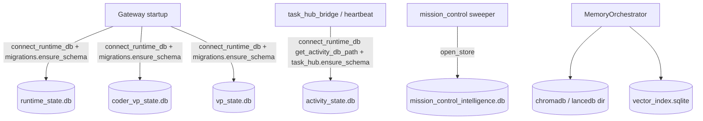

# Database Architecture

Universal Agent stores durable state across **several physically separate SQLite databases**, plus a vector-memory store. The segregation is deliberate: low-priority background writes (CSI, Task Hub) must never contend on a write lock with high-priority agent-session writes (run queue, checkpoints, leases). This doc inventories every database, its schema, who owns it, the path-resolution functions, and the pruning/retention behavior — verified against the source.

## 1. Database inventory

All operational SQLite files live under `<repo-root>/AGENT_RUN_WORKSPACES/` by default. Each has a path-resolver in `durable/db.py` that honors an env override first and otherwise falls back to that directory (creating it with `os.makedirs(..., exist_ok=True)`).

| Logical DB | Default filename | Resolver (`durable/db.py`) | Env override | Schema source | Purpose |
|---|---|---|---|---|---|
| Runtime state | `runtime_state.db` | `get_runtime_db_path()` | `UA_RUNTIME_DB_PATH` | `durable/migrations.py::ensure_schema` | Run queue, attempts, steps, tool-call ledger, checkpoints, leases, replay metadata. Simone's in-process control plane. |
| Coder VP state | `coder_vp_state.db` | `get_coder_vp_db_path()` | `UA_CODER_VP_DB_PATH` | `durable/migrations.py::ensure_schema` | CODIE/Cody lane telemetry, isolated from Simone's runtime queue to avoid cross-lane lock contention. |
| VP state | `vp_state.db` | `get_vp_db_path()` | `UA_VP_DB_PATH` | `durable/migrations.py::ensure_schema` | Dedicated VP mission ledger for external primary workers (`vp_sessions`, `vp_missions`, `vp_events`, bridge cursors). |
| Activity state | `activity_state.db` | `get_activity_db_path()` | `UA_ACTIVITY_DB_PATH` | `task_hub.py::ensure_schema` + `gateway_server.py::_ensure_activity_schema` | **Canonical Task Hub DB** (see §3) + dashboard `activity_events` telemetry + CSI specialist-loop background writes. |
| Mission Control intel | `mission_control_intelligence.db` | `services/mission_control_db.py::default_db_path` | `UA_MISSION_CONTROL_INTEL_DB_PATH` | `services/mission_control_db.py::ensure_schema` | Tiered intelligence cards, traffic-light tiles, dispatch audit, title-template cache. |
| Lossless memory (LCM) | caller-supplied `.db` | `lossless_memory/db.py` (`db_path` arg) | (no module-level env default) | `lossless_memory/db.py` | Semantic-RAG conversation/summary DAG (`lcm_*` tables). |
| Vector memory | `chromadb/` (or `lancedb/`) dir + `vector_index.sqlite` / `session_vector_index.sqlite` | `memory/paths.py`, per-backend | `PERSIST_DIRECTORY`, `UA_MEMORY_PROVIDER`, etc. | per-backend | Long-term / session semantic memory (see §5). |
| CSI | `/var/lib/universal-agent/csi/csi.db` | `gateway_server.py::_csi_default_db_path` (health monitor mirrors it as `_csi_db_path`) | `CSI_DB_PATH` | (CSI ingester subsystem) | ClaudeDevs/CSI intelligence store. Lives outside `AGENT_RUN_WORKSPACES`, under `/var/lib`. See §8 for the split-brain footgun. |

> The three DBs that share the `durable/migrations.py` schema (`runtime_state`, `coder_vp_state`, `vp_state`) are structurally identical — they differ only by which lane writes to them. The Gateway opens all three at startup (`gateway.py`) and runs `ensure_schema()` on each.

### Connection contract (`connect_runtime_db`)

Every runtime/activity/VP connection is opened through `durable/db.py::connect_runtime_db`, which sets a specific PRAGMA profile that callers must not subvert:

```python
conn = sqlite3.connect(path, timeout=busy_timeout_ms/1000.0,
                       check_same_thread=False, isolation_level=None)
conn.execute("PRAGMA foreign_keys=ON;")
conn.execute("PRAGMA auto_vacuum=INCREMENTAL;")
conn.execute("PRAGMA journal_mode=WAL;")
conn.execute(f"PRAGMA busy_timeout={busy_timeout_ms};")
```

Key behaviors:

- **`isolation_level=None` → true autocommit.** Each DML statement commits immediately, so the WAL write lock is held only for the duration of a single statement, not until an explicit `conn.commit()`. This was an intentional fix for multi-minute lock contention between long-running sessions (e.g. the Simone heartbeat) and short writes (e.g. YouTube dispatch admission). `BEGIN IMMEDIATE` explicit transactions still work as normal.
- **`check_same_thread=False`** because the gateway dispatches work across async tasks and libraries that use background threads.
- **WAL journaling** for concurrent reader/writer behavior across independent processes (gateway, CLI, worker can all be live at once).
- **`auto_vacuum=INCREMENTAL`** to avoid OS-level lock contention from full `VACUUM` sweeps.
- **Busy timeout** from `get_sqlite_busy_timeout_ms()` — `UA_SQLITE_BUSY_TIMEOUT_MS` env, clamped to a 250 ms floor, default **15000 ms**. A short timeout lets application-level retries react quickly instead of hanging for a minute on transient locks.

`services/mission_control_db.py::open_store` reuses the same busy-timeout helper and the same WAL + autocommit pattern, but opens its connection directly (not via `connect_runtime_db`) and does **not** set `foreign_keys` or `auto_vacuum`.



## 2. Runtime schema (`durable/migrations.py`)

`SCHEMA_SQL` in `migrations.py` is the source of truth for the runtime/VP family. `ensure_schema(conn)` runs the script then applies a long list of `_add_column_if_missing` ALTERs for forward-compatible migration. It is idempotent and memoized per-DB-path via `_SCHEMA_READY_PATHS` (keyed by the `main` DB file path from `PRAGMA database_list`), so repeated calls on the same file are cheap.

Tables created:

- **`runs`** — one row per logical run. Carries status, entrypoint, `run_spec_json`, lease fields (`lease_owner`, `lease_expires_at`, `last_heartbeat_at`), cancel fields, provider-session linkage, attempt pointers (`latest_attempt_id`, `last_success_attempt_id`, `canonical_attempt_id`), `iteration_count`/`max_iterations`, and `total_tokens`.
- **`run_attempts`** — per-attempt rows (`UNIQUE(run_id, attempt_number)`), each with its own lease, failure class/reason, retry backoff, and `summary_json`.
- **`run_steps`** — ordered steps within a run (status + phase).
- **`tool_calls`** — durable tool-call ledger with replay metadata: `side_effect_class`, `replay_policy` (default `REPLAY_EXACT`), `replay_status`, `normalized_args_hash`, and a `UNIQUE` `idempotency_key`. This is what makes runs replayable without re-firing side effects.
- **`tool_receipts`** — receipts keyed by `tool_call_id`, recording the external correlation id and response ref.
- **`checkpoints`** — `state_snapshot_json` + optional `cursor_json` + `corpus_data` (added by ALTER) for sub-agent context restoration.
- **`vp_sessions`**, **`vp_missions`**, **`vp_mission_backlog_history`**, **`vp_session_events`**, **`vp_events`**, **`vp_bridge_cursors`** — the VP orchestration ledger (state machine in `durable/state.py`).
- **`user_preferences`** — `preferences_json` per `user_id`.

### Migration ordering gotcha (2026-05-27 incident)

`vp_missions.priority_tier` is **not** added by `executescript(SCHEMA_SQL)` for pre-existing DBs — it is added later by `_add_column_if_missing`, and the tier-aware indexes (`idx_vp_missions_tier_priority`, `idx_vp_backlog_history_recent`) are created **after** that ALTER, *not* inside `SCHEMA_SQL`. The reason is explicit in the code: `executescript()` runs the whole `SCHEMA_SQL` block before any ALTER, and on a pre-PR-499 database `priority_tier` doesn't yet exist, so SQLite would abort the entire script at the index statement. Do not move those `CREATE INDEX` lines back into `SCHEMA_SQL` — that re-introduces the 2026-05-27 incident. `_backfill_vp_mission_priority_tier` then backfills tiers from `vp.mission_priority.MISSION_TYPE_TIER`, touching only rows still at the `'background'` default (so manual operator overrides survive).

## 3. Task Hub DB segregation — `activity_state.db` is canonical (NOT `task_hub.db`)

This is the single most misremembered fact about the database layer, so it is stated plainly:

> **The canonical Task Hub database is `activity_state.db`.** There is no `task_hub.db`. The Task Hub schema is created *inside* `activity_state.db`.

`task_hub.py` itself never resolves a DB path — every public function takes a `conn` argument. The **caller** decides which DB. The canonical caller is `tools/task_hub_bridge.py`, which opens:

```python
conn = connect_runtime_db(get_activity_db_path())   # → activity_state.db
```

`heartbeat_service.py` does the same (`connect_runtime_db(get_activity_db_path())` in multiple sites). So Task Hub reads/writes land in `activity_state.db`, alongside CSI background writes, and are kept off the high-priority `runtime_state.db`.

`task_hub.py::ensure_schema` creates (in whatever DB the caller passed):

- **`task_hub_items`** — the work queue. Columns include `source_kind`, `project_key` (default `immediate`), `priority`, `status` (default `open`), `agent_ready`, `score`/`score_confidence`, `stale_state` (default `fresh`), `seizure_state`, `mirror_status`, `must_complete`, `incident_key`, `workstream_id`/`subtask_role`/`parent_task_id`, `cody_mode`, `max_retries`, `max_runtime_seconds`, `completion_token` (idempotency token preventing re-claim of completed tasks), `trigger_type` (default `heartbeat_poll`), and refinement fields.
- **`task_hub_assignments`** — the **claim ledger** (started/ended/state, `worker_pid`, workflow/provider session linkage). `worker_pid` is the spawned subprocess PID for owned-subprocess assignments (cron `!script`, VP CLI, demo workspace) and NULL for in-process assignments (SDK, ToDo, heartbeat) which share the gateway daemon PID.
- **`task_hub_runs`** — per-attempt durable history (outcome/summary/metadata/error) alongside the claim ledger. Additive: assignments are the "an attempt occurred" record; runs are "what actually happened".
- **`task_hub_evaluations`** — judge decisions (`decision`, `reason`, `score`, `judge_payload_json`).
- **`cody_token_usage`** — per-mission Cody token telemetry (input/output/cache tokens, `total_cost_usd`, `cody_mode`, `model`). The dashboard tile sums rows where `recorded_at >=` the `cody_token_tracking_window.reset_at` cursor in `task_hub_settings`. Written by external `claude --print` subprocess missions (`vp/clients/claude_cli_client.py::_record_mission_token_usage`).
- **`token_usage_events`** — per-turn token telemetry for **IN-PROCESS** Claude Agent SDK principal turns (Simone heartbeat/daemon + in-process VP coder) that the httpx hook (`services/zai_observability.py`) cannot see (those calls return via the SDK `ResultMessage`, not the patched httpx client). One row per gateway turn, recorded in the `finally` of `execution_engine.py::ProcessTurnAdapter` (its `run_engine` task) via `services/principal_token_tracking.py::record_session_token_usage` — the `finally` fires on every exit path including **cancellation/timeout**, so cancelled daemon turns (a large share of Simone spend) are captured too. `source` = capture site (`cli-in-process`; the double-count invariant); `principal` = who spent (`simone`/`vp-coder`/…, from the adapter's `config._run_source`). Distinct lane from `cody_token_usage` (subprocess) and the `zai_inference_events.jsonl` httpx lane. `total_cost_usd` is the per-turn delta of the cumulative SDK cost; token counts SUM the per-iteration `ResultMessage.usage` (incl. cache tokens).
- **`task_hub_dispatch_queue`** — materialized ranked dispatch queue (`queue_build_id`, `rank`, `eligible`, `skip_reason`).
- **`task_hub_comments`**, **`task_hub_question_queue`**, **`task_hub_workstreams`**, **`task_hub_settings`** (key/`value_json`), **`task_hub_notifications`** (`UNIQUE(task_id, event_key)` dedup), **`task_hub_delivery_evidence`** (AgentMail message/thread/draft + work-product paths).

Like `migrations.py`, `task_hub.ensure_schema` runs a base `executescript` then a sequence of `ALTER TABLE ... ADD COLUMN` wrapped in `try/except sqlite3.OperationalError: pass` for forward-migration.

> **Correction of prior docs:** earlier documentation claimed the Task Hub tables live in `runtime_state.db` with `task_hub.py` as the "module source" of `runtime_state.db`. The code contradicts this. `task_hub.py` is schema-only and DB-agnostic; the canonical Task Hub population is in `activity_state.db` via `task_hub_bridge`/`heartbeat`. There is no `task_hub.db` file (a stale `task_hub.db` from ~2026-05-01 may exist on disk — it is NOT canonical, do not query it).

> **Split-brain caveat — a literal `task_hub.db` path string still ships in a prompt.** `heartbeat_service.py` builds Simone's runtime-quirks prompt with the line `Task Hub DB: /opt/universal_agent/AGENT_RUN_WORKSPACES/task_hub.db`. That string is a **prompt/comment field, not a resolver** — the actual canonical resolver is `durable/db.py::get_activity_db_path()` (→ `activity_state.db`). `task_hub.db` (if present) is smaller and stale; `activity_state.db` carries the real population. The two diverge wildly in row counts, so **always confirm which DB a number came from**, and resolve at runtime via `get_activity_db_path()` rather than trusting any hardcoded path string in a prompt or handoff note.

> **The orphan `task_hub.db` copies were ACTIVELY written, not just a 2026-05-01 relic (root-caused + fixed 2026-06-05, Phase D — see `06_platform/08_scheduling_substrate_adr.md`).** As of 2026-06-05 the VPS held five `task_hub.db` copies, two of them written *minutes* before inspection (`.agent/task_hub.db` ≈ 1.1 GB, repo-root `task_hub.db`). Root cause: the skill `evaluate-and-author-intel-brief/SKILL.md` told the Atlas LLM `sqlite3.connect("/path/to/activity_state.db")` — a **placeholder**, not `get_activity_db_path()`. Atlas substituted a cwd-relative path, and because `proactive_artifacts.py::upsert_artifact` and `task_hub.py::perform_task_action` take `conn` from the caller (they never resolve a path), the full task_hub + proactive schema was forked into a cwd-relative orphan the hourly digest never read — **18 `intel_brief` ship briefs were authored there and never delivered**. The fix repoints the skill to `connect_runtime_db(get_activity_db_path())` (matching `hourly-intel-digest/SKILL.md`) and adds regression guards in `tests/unit/test_canonical_store_resolvers_phaseD.py`. **Lesson for any skill or script that writes the canonical store: never hand a store-layer function a hand-built/placeholder/relative path — always pass `get_activity_db_path()`.** Orphan-DB cleanup + recovery of the 18 undelivered briefs is operator-gated (snapshots at `/home/ua/phaseD_orphan_snapshots_2026-06-05/`).

### Activity telemetry tables (same DB, different writer)

`activity_state.db` also holds dashboard/operator telemetry, whose schema is owned by `gateway_server.py::_ensure_activity_schema` (and connected via `_activity_connect()` → `connect_runtime_db(get_activity_db_path())`, i.e. the same file). The principal table is **`activity_events`** (long-form string/JSON rows; `event_class='notification'` is reserved for dashboard/operator lifecycle rows). Lifecycle maintenance lives at the gateway, not in `task_hub`:

- `UA_ACTIVITY_EVENTS_RETENTION_DAYS` — hard-retention window, floor 7, **default 90**.
- `UA_ACTIVITY_NOTIFICATION_AUTO_READ_HOURS` — non-actionable `info`/`success` notification rows older than this are auto-marked `read` (so health checks measure real unconsumed operator work, not telemetry noise), floor 1, **default 24**.
- `UA_ACTIVITY_DEFAULT_WINDOW_DAYS` — default query window, floor 1, **default 7**.

## 4. Pruning & retention

Task Hub is the only operational DB with explicit row-level pruning:

`task_hub.py::prune_settled_tasks(conn, *, retention_days=21)` deletes, in order, `task_hub_evaluations` → `task_hub_assignments` → `task_hub_items` for tasks whose `status IN ('completed', 'parked')` and whose `updated_at < datetime('now', '-{retention_days} days')`. Default retention is **21 days**. The only production caller is the Simone heartbeat (`heartbeat_service.py`), which calls it with `retention_days=21`.

> Note: `prune_settled_tasks` does **not** prune `task_hub_runs`, `cody_token_usage`, `token_usage_events`, or `task_hub_delivery_evidence`. Those grow unbounded by row count; storage management for them relies on the file-level `auto_vacuum=INCREMENTAL` pragma only. `[VERIFY: whether task_hub_runs growth is intentional or a missed prune target.]`

There is no equivalent row-pruner for `runtime_state.db` `runs`/`run_attempts` in the DB layer — stale-run handling is recovery (reaping), not deletion (see §6). Space reclamation across all DBs is handled passively by `PRAGMA auto_vacuum=INCREMENTAL` rather than scheduled `VACUUM`.

## 5. Memory subsystem (`memory/`)

Memory is separate from the operational DBs and has two storage tiers plus a pluggable vector backend.

### Path resolution (`memory/paths.py`)

- `resolve_persist_directory()` → `<repo-root>/Memory_System/data` by default, overridable with `PERSIST_DIRECTORY`. This is the home for `agent_core.db` (`resolve_agent_core_db_path()` = `<persist_dir>/agent_core.db`) and a `chroma_db` dir.
- `resolve_shared_memory_workspace()` → `<repo-root>/Memory_System/ua_shared_workspace`, overridable with `UA_SHARED_MEMORY_DIR`.
- Relative env-configured paths are anchored to repo root for deterministic behavior.

> **Path divergence gotcha:** `memory/paths.py` describes an `agent_core.db` + `Memory_System/data` layout, but the live `MemoryOrchestrator` and `chromadb_backend.get_memory` actually persist under a **workspace-relative `memory/` subdir** (e.g. `os.path.join(workspace_dir, "memory", "chromadb")`, `vector_index.sqlite`, `session_vector_index.sqlite`). The two path families coexist; treat `memory/paths.py` as the `Memory_System`-rooted convention and the orchestrator paths as the per-workspace runtime reality. `[VERIFY: which path family is authoritative in production — they are resolved independently.]`

### Vector backend selection

`feature_flags.memory_backend(default="chromadb")` maps `UA_MEMORY_PROVIDER`: when provider is `local` → `lancedb`, otherwise → `chromadb`. The orchestrator (`memory/orchestrator.py::_semantic_search`) instantiates `LanceDBMemory(.../lancedb)` or `ChromaDBMemory(.../chromadb)` accordingly.

- **ChromaDB** (`memory/chromadb_backend.py`) — `PersistentClient` at `db_path`, collection with `hnsw:space=cosine`, telemetry disabled. Stores text + embedding + metadata (importance, category, session_id, source, timestamp). De-dups at store time via a `min_score=0.95` self-search.
- **LanceDB** (`memory/lancedb_backend.py`) — `lancedb.connect(db_path)`, a `LanceModel` table whose vector dimension comes from the embedding provider.
- **SQLite keyword/vector index** (`memory/memory_vector_index.py`) — a fallback `embeddings` table (`content_hash` indexed) in `vector_index.sqlite`, using a deterministic hashing-based embedding (an MVP placeholder, not a real model embedding).

### Memory enablement flags (`feature_flags.py`)

- `UA_DISABLE_MEMORY` (kill switch) / `UA_MEMORY_ENABLED` → `memory_enabled` (default True).
- `UA_MEMORY_INDEX_MODE` ∈ {`json`, `vector`, `off`}; forced to `off` when memory disabled.
- `UA_MEMORY_PROVIDER` ∈ {`auto`, `local`, `openai`, `gemini`, `voyage`}.
- `UA_MEMORY_MAX_TOKENS` (default 800), `UA_MEMORY_FLUSH_ENABLED` (pre-compaction flush), `UA_MEMORY_FLUSH_SOFT_THRESHOLD_TOKENS` (default 4000), `UA_MEMORY_SESSION_*` (session-transcript indexing), `UA_MEMORY_ROLLOVER_MODE` ∈ {`transcript`, `summary_only`}, `UA_MEMORY_SCOPE` ∈ {`direct_only`, `all`}.

`ensure_memory_scaffold(workspace_dir)` (`memory/memory_store.py`) creates the per-workspace `memory/` dir, a `MEMORY.md` (seeded `# Agent Memory`), `memory/index.json`, and a `memory/research/index.json`.

### Lossless memory (LCM) — `lossless_memory/db.py`

A separate, self-contained SQLite store implements a Semantic-RAG conversation graph (a DAG-condensed summary mapping). `LosslessMemoryDB(db_path)` takes an explicit path (no module-level env default) and creates: `lcm_conversations`, `lcm_messages` (FK → conversations), `lcm_summaries`, `lcm_summary_messages`, `lcm_summary_parents`, and `lcm_context_items` (the DAG edges mapping summaries back to origin). It opens a plain `sqlite3.connect(db_path, timeout=10.0)` — it does **not** route through `connect_runtime_db`, so it does not inherit the WAL/autocommit/FK pragma profile. Pruning: `prune_decayed_nodes(days=180)` clears decayed `lcm_messages` and their `lcm_context_items` after a **180-day** default decay window.

## 6. Health monitoring & recovery (`utils/db_health_monitor.py`)

The heartbeat health monitor inspects DBs and emits `HeartbeatFinding`s. It resolves paths via its own `_db_path(name)` (env-var-first, then `AGENT_RUN_WORKSPACES/<name>`):

- `check_stale_runs` — `runtime_state.db`: first **self-heals**, then counts, runs whose latest attempt is `running`/`queued`/`blocked` past `STALE_RUN_HOURS`. It calls `stuck_run_reaper.py::finalize_orphaned_run_attempts` BEFORE its count query, so an attempt left non-terminal when its run already reached a terminal status (a failure-finalization path can stamp `runs.status` terminal — e.g. `failed` with `terminal_reason='hook_dispatch_failed'` — without finalizing the linked `run_attempts` row) is reconciled by the very loop that detects it and can no longer trip the "stuck in running/queued" alert permanently. The orphan is mirrored to the run's outcome with no re-surfaced failure card (the run already recorded its terminal outcome). It then counts the residual and auto-reaps genuinely-stuck `running` runs via `stuck_run_reaper.py::reap_stale_runs` (progress-based TTL), which exists to prevent the dispatch-cascade resource-exhaustion incident. `reap_stale_runs` alone cannot reach the orphan class — it scopes to `runs.status='running'` AND `run_attempts.status='running'` — which is why the dedicated orphan pass runs first.
- `check_stale_delegations`, `check_stuck_vp_missions` — runtime/VP DBs.
- `check_pending_signal_cards` — `activity_state.db`.
- CSI checks — the `/var/lib/universal-agent/csi/csi.db` store.

### Health-monitor bug to be aware of

`check_task_hub_backlog()` connects to **`runtime_state.db`** and queries `task_hub_items` there. But the canonical Task Hub DB is `activity_state.db` (§3). On a correctly-segregated production box, `task_hub_items` either doesn't exist in `runtime_state.db` (function early-returns via `_table_exists`) or is stale, so this check effectively reports **0 backlog regardless of the real Task Hub queue depth**. `[VERIFY: this is a code bug — the connect target should be activity_state.db like check_pending_signal_cards. Current behavior: the backlog finding never fires.]`

## 7. Operational notes & gotchas

- **`.env` is clobbered on every deploy** (`deploy.yml` wipes `/opt/universal_agent/.env`). Durable DB-path overrides must be set as code defaults or in the deploy bootstrap dict, not by editing the VPS `.env`.
- **Deleting `runtime_state.db` is only safe when no queued/running/resume-needed runs matter** — it is the live run queue, not a cache. The comment in `get_runtime_db_path()` is explicit about this.
- **Do not assume one big DB.** Five+ separate SQLite files with deliberate lane isolation; cross-lane writes to the wrong DB will silently diverge from what the dashboard/heartbeat reads.
- **WAL sidecar files** (`-wal`, `-shm`) accompany each DB; back up / copy them together or use the SQLite backup API, never a bare file copy of just the `.db`.
- **Schema is created lazily**, never via a separate migration step. Any process that opens a DB calls the relevant `ensure_schema()`; there is no standalone "migrate" command.
- **`activity_state.db` history note:** an audit on 2026-05-22 mistakenly read `runtime_state.db` and reported an empty `task_hub_assignments`; the 2026-05-24 revisit found `activity_state.db` held 1149 assignments. When diagnosing Task Hub state, always point at `activity_state.db`.

## 8. CSI database & the split-brain footgun (latent, not gone)

The CSI store (`csi.db`) is written by the standalone `csi-ingester.service` (uvicorn on `127.0.0.1:8091`, `WorkingDirectory=/opt/universal_agent/CSI_Ingester/development`), and read by the UA gateway via `gateway_server._csi_default_db_path()` (env `CSI_DB_PATH`, default `/var/lib/universal-agent/csi/csi.db`).

The ingester's `config.yaml` still ships a **relative dev default** `db_path: "var/csi.db"`. Production is correct *only* because the systemd `EnvironmentFile` (`CSI_Ingester/development/deployment/systemd/csi-ingester.env`) sets `CSI_DB_PATH=/var/lib/universal-agent/csi/csi.db`, overriding the config so the ingester and gateway share one DB.

> **Footgun:** if that `CSI_DB_PATH` override is ever dropped, the ingester silently resumes writing the dev relic (`CSI_Ingester/development/var/csi.db`) and the live `/var/lib` DB goes stale — you'll conclude "the pipeline is dead" when it's actually writing the wrong file. Treat `CSI_DB_PATH` in `csi-ingester.env` as load-bearing. Stale relics under the repo working tree (`CSI_Ingester/development/var/csi.db`, `csi_events.db`, `csi_ingester.db`) were deleted 2026-05-29 and must not be recreated by running the ingester without `CSI_DB_PATH`. `[VERIFY: systemd unit paths and the config.yaml relative default are environment facts from the legacy doc; re-confirm on the VPS if diagnosing CSI staleness.]`

**Journal mode — WAL.** `csi.db` is opened in **WAL** journal mode (`synchronous=NORMAL`) by `csi_ingester.store.sqlite::connect`, which every CSI process routes through; the pragmas are set idempotently on each connection (`_journal_mode` / `_busy_timeout_ms`, overridable via `CSI_SQLITE_JOURNAL_MODE` / `CSI_SQLITE_BUSY_TIMEOUT_MS` for emergency rollback). This replaced the legacy rollback-journal (DELETE) mode, under which the ~13 concurrent CSI processes (the long-running `csi-ingester` plus the semantic-enrich / trend-report / global-brief / daily-summary / replay-dlq / quality-assessment timers, and the main-repo `proactive_convergence::sync_topic_signatures_from_csi`) routinely raised `database is locked`; `busy_timeout` alone (added earlier) only made a blocked writer wait rather than letting readers and writers coexist. The one writer that does **not** go through the helper — convergence-sync, which runs as `ua` while the rest run as `root` — opens `csi.db` directly but still sets `busy_timeout` and inherits WAL (a persistent db property). Mixed-uid access is safe because SQLite, running as root, chowns the `-wal`/`-shm` sidecars to match the db owner (`ua:ua`). The `csi-db-backup` rotate script is WAL-correct: it `PRAGMA wal_checkpoint(PASSIVE)`s then uses the SQLite `.backup` API (never a bare `.db` copy), consistent with the §-above WAL-sidecar guidance.

Two unrelated YouTube-watching systems also keep separate state stores: the UA-native playlist watcher (`youtube_playlist_watcher_state.json`) and the CSI RSS channel feed (inside `csi.db`). Resetting one does NOT reset the other.
